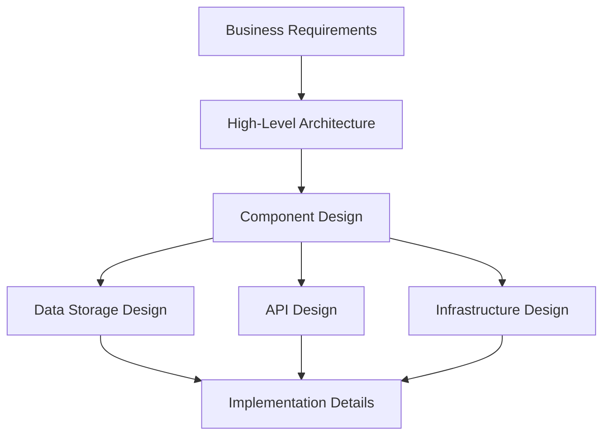
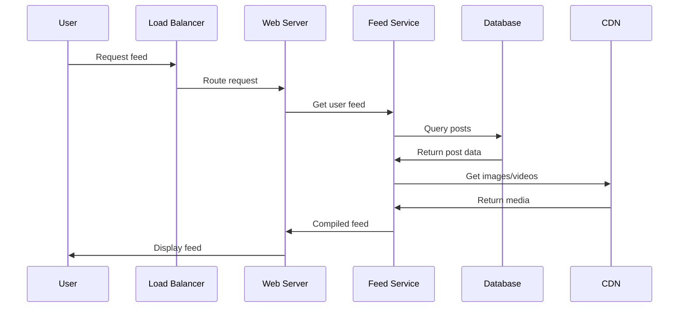

# What is System Design & Why It Matters

## Introduction

System design is the process of defining the architecture, components, modules, interfaces, and data for a system to satisfy specified requirements. Think of it as creating a blueprint for building large-scale software systems that can handle millions of users, process massive amounts of data, and remain reliable under various conditions.

Unlike building a simple application that runs on a single computer, system design deals with distributed systems - applications that run across multiple servers, databases, and networks to provide services to users around the world.

## Key Concepts

### What is a System?

A **system** in our context is a collection of interconnected components that work together to provide specific functionality. These components might include:

- **Web servers** that handle user requests
- **Databases** that store and retrieve data
- **Load balancers** that distribute traffic
- **Caches** that speed up data access
- **Message queues** that enable communication between services

### System Design Scope

System design encompasses several layers of decision-making:

**High-Level Architecture**: How major components interact
**Component Design**: Individual service responsibilities
**Data Design**: How information is stored and accessed
**Infrastructure**: Servers, networks, and deployment strategies

## Why System Design Matters

### 1. Scale Challenges

Modern applications face unprecedented scale challenges:
- **Netflix** serves 230+ million subscribers globally
- **WhatsApp** handles 100+ billion messages daily
- **Google Search** processes 8.5+ billion searches per day

These numbers are impossible to handle with a single server or simple application architecture.

### 2. Reliability Requirements

Users expect systems to be available 24/7. Even 99% uptime means:
- 3.65 days of downtime per year
- 7.2 hours of downtime per month
- 1.68 hours of downtime per week

For critical services, we need 99.9% or even 99.99% uptime, which requires careful system design.

### 3. Performance Expectations

Users abandon websites that take more than 3 seconds to load. System design helps us:
- Minimize response times
- Handle traffic spikes
- Provide consistent performance globally

### 4. Cost Optimization

Poor system design can lead to:
- Over-provisioned resources (wasted money)
- Under-provisioned resources (poor user experience)
- Inefficient data storage and processing

## Real-World Examples

### Example 1: Social Media Feed

When you open Instagram and see your feed, here's what happens behind the scenes:

This involves multiple services working together to deliver a seamless experience.

### Example 2: Online Shopping

When you buy something on Amazon:

1. **Inventory Service** checks product availability
2. **Payment Service** processes your payment
3. **Order Service** creates your order
4. **Shipping Service** arranges delivery
5. **Notification Service** sends confirmation emails

Each service can scale independently and handle failures gracefully.

## Why Learn System Design?

### For Software Engineers

- **Career Growth**: Senior roles require system design skills
- **Interview Success**: Most tech companies test system design knowledge
- **Better Code**: Understanding systems improves your coding decisions
- **Problem Solving**: Learn to think about scalability from the start

### For Technical Leaders

- **Architecture Decisions**: Make informed choices about technology stacks
- **Team Communication**: Explain technical concepts to stakeholders
- **Risk Management**: Identify potential system bottlenecks early
- **Resource Planning**: Estimate infrastructure needs accurately

## Summary

System design is the art and science of building large-scale, reliable, and efficient software systems. It's essential for:

- **Handling scale**: Serving millions of users simultaneously
- **Ensuring reliability**: Keeping systems running 24/7
- **Optimizing performance**: Delivering fast, responsive experiences
- **Managing costs**: Building efficient, cost-effective solutions

In the next section, we'll explore how system design differs from traditional software design and when to apply each approach.

---

**Key Takeaways:**
- System design focuses on distributed, large-scale applications
- It addresses challenges of scale, reliability, performance, and cost
- Modern applications require multiple interconnected services
- System design skills are crucial for career advancement in tech