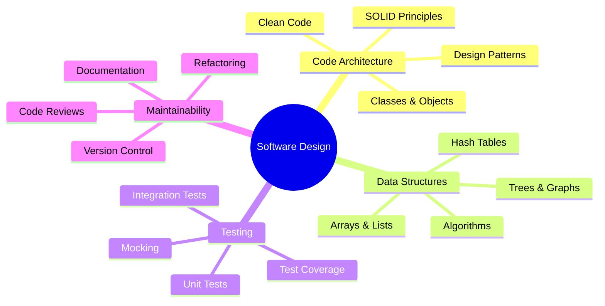
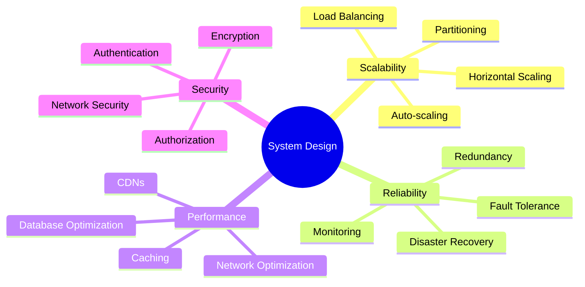
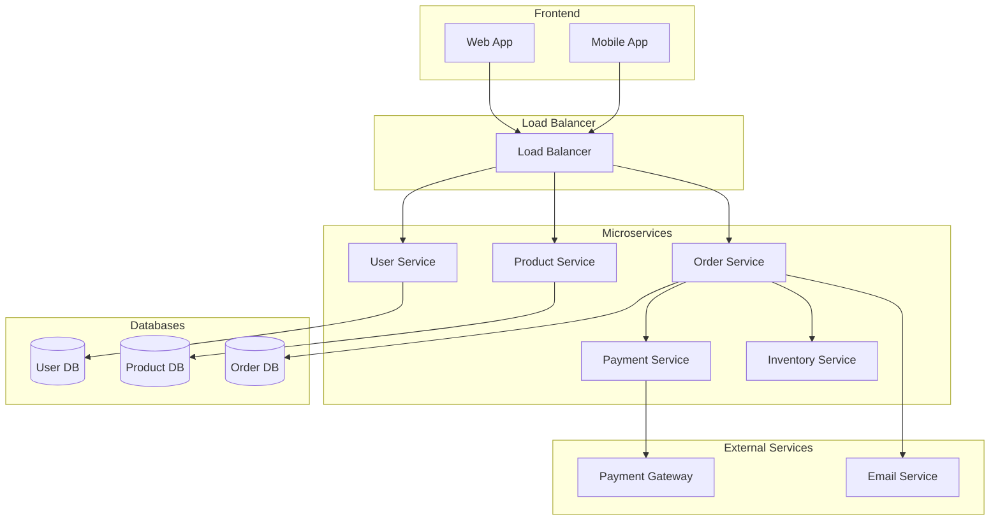
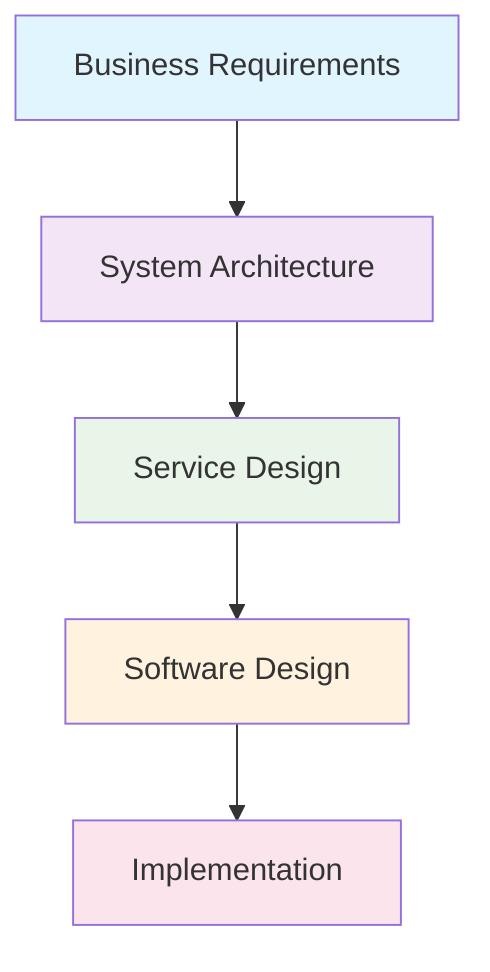
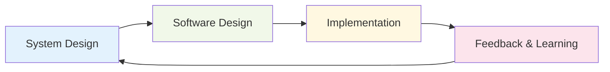

# System Design vs Software Design

## Introduction

While both system design and software design are crucial for building applications, they operate at different levels of abstraction and solve different types of problems. Understanding when and how to apply each approach is essential for creating successful software products.

Think of software design as designing the interior of a house (how rooms are organized, where furniture goes), while system design is like urban planning (how buildings, roads, utilities, and services work together across a city).

## Software Design Focus

### Scope and Objectives

Software design primarily focuses on:

- **Code organization**: How classes, modules, and functions are structured
- **Design patterns**: Reusable solutions to common programming problems
- **Data structures**: How data is organized within the application
- **Algorithms**: Efficient ways to process and manipulate data
- **Code quality**: Maintainability, readability, and testability

### Key Concerns



### Example: E-commerce Shopping Cart

In software design, you might focus on:

```python
class ShoppingCart:
    def __init__(self):
        self.items = []
        self.discount_strategy = None
    
    def add_item(self, product, quantity):
        # Implementation details
        pass
    
    def calculate_total(self):
        # Apply discount strategy pattern
        pass
    
    def checkout(self):
        # Process the order
        pass
```

The focus is on clean code, proper abstractions, and maintainable structure.

## System Design Focus

### Scope and Objectives

System design operates at a higher level, focusing on:

- **Distributed architecture**: How multiple services work together
- **Scalability**: Handling increasing load and data volume
- **Reliability**: Ensuring system availability and fault tolerance
- **Performance**: Optimizing response times and throughput
- **Infrastructure**: Servers, databases, networks, and deployment

### Key Concerns



### Example: E-commerce Platform

In system design, you might focus on:



The focus is on how services communicate, scale, and remain reliable.

## Key Differences

| Aspect | Software Design | System Design |
|--------|----------------|---------------|
| **Scope** | Single application/service | Multiple interconnected services |
| **Scale** | Hundreds to thousands of users | Millions to billions of users |
| **Primary Focus** | Code quality and maintainability | Scalability and reliability |
| **Time Horizon** | Immediate development cycle | Long-term growth and evolution |
| **Failure Impact** | Feature bugs, crashes | Service outages, data loss |
| **Tools & Patterns** | Design patterns, frameworks | Load balancers, databases, caches |
| **Metrics** | Code coverage, complexity | Latency, throughput, availability |
| **Team Size** | Individual to small team | Multiple teams across organizations |

### Abstraction Levels



- **System Design**: Defines the overall architecture and service boundaries
- **Software Design**: Defines how each service is internally structured

## When to Use Each Approach

### Start with System Design When:

- Building applications that need to scale beyond a single server
- Working with distributed teams or microservices
- Planning for high availability requirements (99.9%+ uptime)
- Handling large amounts of data or traffic
- Integrating with multiple external systems
- Planning long-term architecture evolution

**Example Scenarios:**
- Social media platforms
- E-commerce marketplaces
- Video streaming services
- Financial trading systems
- IoT data processing platforms

### Start with Software Design When:

- Building internal tools or small applications
- Working with a single team on a focused problem
- Prototyping or validating ideas quickly
- Creating libraries or frameworks
- Optimizing existing code performance
- Implementing specific algorithms or features

**Example Scenarios:**
- Internal admin dashboards
- Desktop applications
- Mobile apps with simple backends
- Data analysis scripts
- Game engines
- Development tools

### The Iterative Approach

In practice, you often need both:

1. **Start with System Design**: Define the overall architecture
2. **Move to Software Design**: Implement individual services
3. **Iterate**: Refine both as you learn and scale



## Summary

System design and software design are complementary disciplines that operate at different levels:

- **Software Design** focuses on creating clean, maintainable code within individual applications
- **System Design** focuses on creating scalable, reliable architectures across multiple services
- **Both are essential** for building successful software products
- **The choice depends** on your scale, requirements, and constraints

Understanding both perspectives helps you:
- Make better architectural decisions
- Write code that fits well into larger systems
- Communicate effectively with different stakeholders
- Plan for both immediate needs and future growth

In the next section, we'll explore the key principles and trade-offs that guide system design decisions.

---

**Key Takeaways:**
- Software design focuses on code quality and maintainability
- System design focuses on scalability and distributed architecture
- Both are needed for successful large-scale applications
- Start with the approach that matches your current scale and requirements