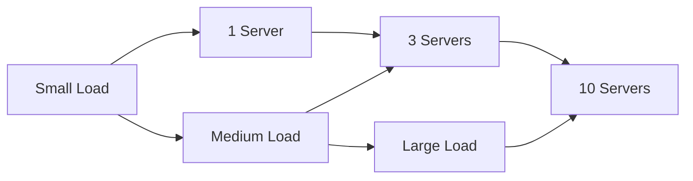
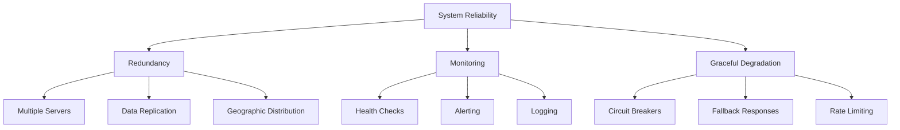
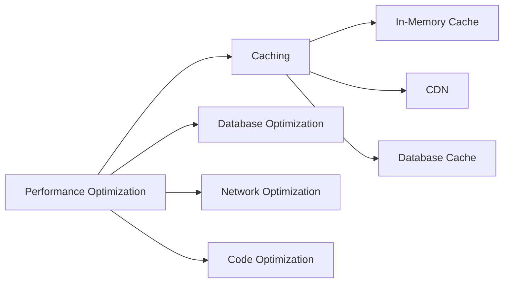
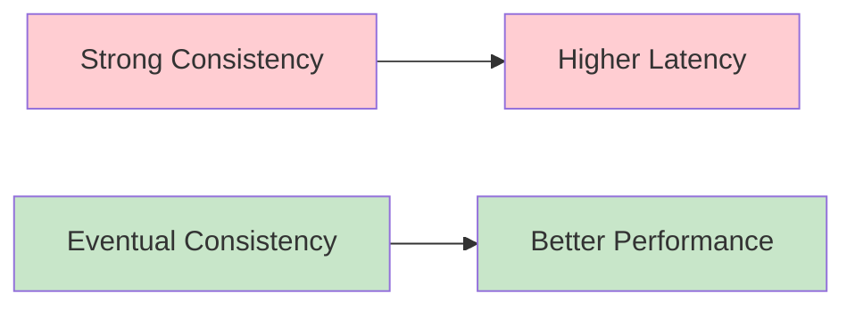
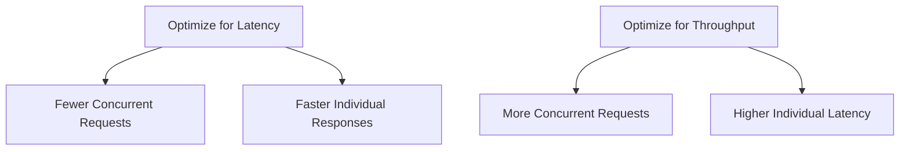
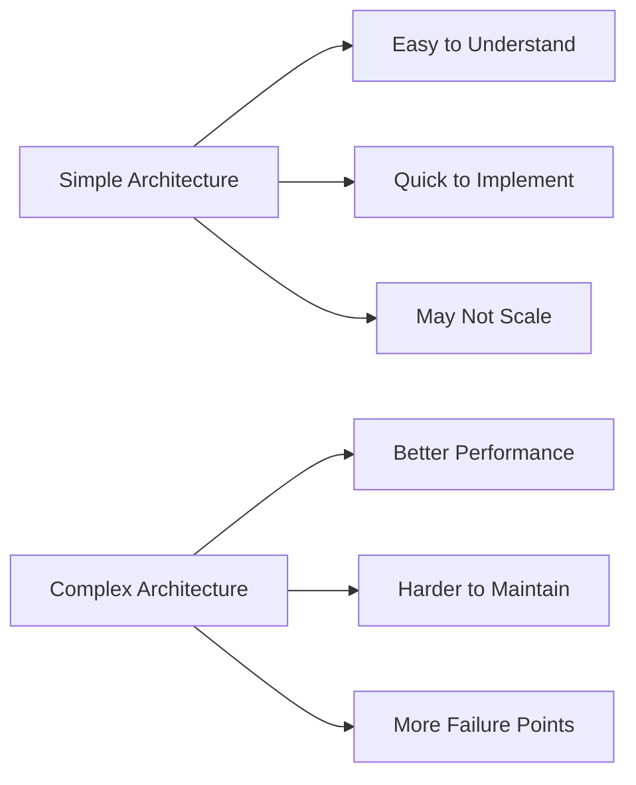
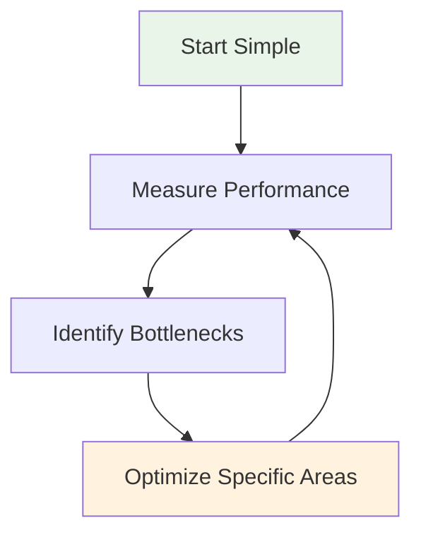

# Key Principles & Trade-offs

## Introduction

System design is fundamentally about making informed trade-offs. Unlike mathematics where there are often "correct" answers, system design involves choosing between competing priorities based on your specific requirements, constraints, and context.

Every design decision comes with benefits and costs. Understanding these trade-offs helps you make decisions that align with your business goals and technical constraints.

## Core Principles

### 1. Scalability

**Definition**: The ability to handle increased load by adding resources to the system.



**Types of Scalability:**
- **Vertical Scaling (Scale Up)**: Adding more power to existing machines
- **Horizontal Scaling (Scale Out)**: Adding more machines to the pool

**Key Considerations:**
- Plan for 10x growth, design for 100x
- Identify bottlenecks before they become problems
- Consider both data and traffic scaling

### 2. Reliability

**Definition**: The probability that a system performs correctly during a specific time duration.

**Reliability Metrics:**
- **Availability**: Percentage of time system is operational (99.9% = 8.76 hours downtime/year)
- **Fault Tolerance**: System continues operating despite component failures
- **Disaster Recovery**: Ability to recover from catastrophic failures



### 3. Consistency

**Definition**: All nodes see the same data at the same time.

**Consistency Levels:**
- **Strong Consistency**: All reads receive the most recent write
- **Eventual Consistency**: System will become consistent over time
- **Weak Consistency**: No guarantees about when data will be consistent

### 4. Performance

**Definition**: How fast a system responds to requests and processes data.

**Key Metrics:**
- **Latency**: Time to process a single request
- **Throughput**: Number of requests processed per unit time
- **Response Time**: Time between request and response



### 5. Security

**Definition**: Protecting systems and data from unauthorized access and attacks.

**Security Layers:**
- **Authentication**: Verifying user identity
- **Authorization**: Controlling access to resources
- **Encryption**: Protecting data in transit and at rest
- **Network Security**: Firewalls, VPNs, secure protocols

## Common Trade-offs

### 1. Performance vs Consistency



**Example**: Banking systems prioritize consistency (your account balance must be accurate) over performance, while social media feeds prioritize performance (fast loading) over perfect consistency.

### 2. Consistency vs Availability (CAP Theorem)

You can only guarantee two of the three:
- **Consistency**: All nodes see the same data
- **Availability**: System remains operational
- **Partition Tolerance**: System continues despite network failures

```mermaid
triangle
    A[Consistency] --> B[Availability]
    B --> C[Partition Tolerance]
    C --> A
    
    center[Pick Any Two]
```

**Real-world Examples:**
- **CP Systems**: Traditional databases (MySQL, PostgreSQL)
- **AP Systems**: DNS, web caches
- **CA Systems**: Single-node systems (not distributed)

### 3. Latency vs Throughput



**Example**: A real-time gaming system optimizes for low latency, while a batch processing system optimizes for high throughput.

### 4. Space vs Time Complexity

- **More Memory**: Faster lookups (caching, indexing)
- **Less Memory**: Slower processing (recomputation, disk I/O)

### 5. Simplicity vs Performance



## Decision Framework

### 1. Understand Requirements

**Functional Requirements:**
- What should the system do?
- What features are needed?
- What are the user workflows?

**Non-Functional Requirements:**
- How many users?
- How much data?
- What performance is needed?
- What's the budget?

### 2. Identify Constraints

**Technical Constraints:**
- Existing technology stack
- Team expertise
- Integration requirements
- Compliance needs

**Business Constraints:**
- Timeline
- Budget
- Team size
- Risk tolerance

### 3. Prioritize Trade-offs

Use a framework to evaluate options:

| Requirement | Weight | Option A | Option B | Option C |
|-------------|--------|----------|----------|----------|
| Performance | High (3) | 8 | 6 | 9 |
| Reliability | High (3) | 9 | 8 | 7 |
| Cost | Medium (2) | 6 | 9 | 5 |
| Complexity | Low (1) | 7 | 9 | 4 |
| **Total** | | **23** | **24** | **22** |

### 4. Start Simple, Evolve



**The Evolution Path:**
1. **Monolith**: Single application, single database
2. **Vertical Scaling**: Bigger servers
3. **Read Replicas**: Separate read and write databases
4. **Caching**: Add Redis/Memcached
5. **Microservices**: Split into smaller services
6. **Horizontal Scaling**: Multiple instances of each service

## Examples

### Example 1: Chat Application

**Requirements:**
- Real-time messaging
- 1M active users
- Message history
- 99.9% availability

**Key Trade-offs:**
- **Consistency vs Latency**: Choose eventual consistency for better real-time performance
- **Storage vs Performance**: Cache recent messages in memory, store history in database
- **Simplicity vs Scalability**: Start with WebSockets, add message queues for scale

### Example 2: E-commerce Platform

**Requirements:**
- Product catalog
- Order processing
- Payment handling
- Inventory management

**Key Trade-offs:**
- **Consistency vs Availability**: Strong consistency for payments, eventual consistency for product views
- **Performance vs Cost**: CDN for product images, database optimization for search
- **Security vs Usability**: Multi-factor authentication for payments, simple login for browsing

### Example 3: Video Streaming Service

**Requirements:**
- Video upload and processing
- Global content delivery
- Recommendation engine
- 10M concurrent viewers

**Key Trade-offs:**
- **Storage vs Performance**: Multiple video qualities, global CDN distribution
- **Latency vs Cost**: Edge servers for popular content, origin servers for long-tail content
- **Accuracy vs Speed**: Real-time recommendations vs batch-processed personalization

## Summary

System design is about making informed trade-offs based on your specific requirements and constraints. Key principles include:

**Core Principles:**
- **Scalability**: Design for growth
- **Reliability**: Plan for failures
- **Consistency**: Choose the right consistency model
- **Performance**: Optimize for your use case
- **Security**: Build security in from the start

**Common Trade-offs:**
- Performance vs Consistency
- Consistency vs Availability
- Latency vs Throughput
- Space vs Time
- Simplicity vs Performance

**Decision Framework:**
1. Understand requirements and constraints
2. Identify and prioritize trade-offs
3. Start simple and evolve based on data
4. Measure and iterate continuously

Remember: There are no perfect solutions, only solutions that are appropriate for your specific context and requirements.

---

**Key Takeaways:**
- Every design decision involves trade-offs
- Understand your requirements before making architectural choices
- Start simple and evolve based on real data and feedback
- Different parts of your system may require different trade-offs