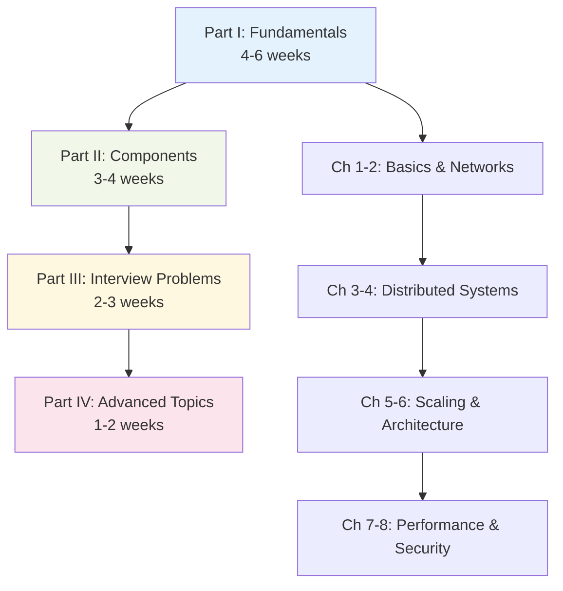
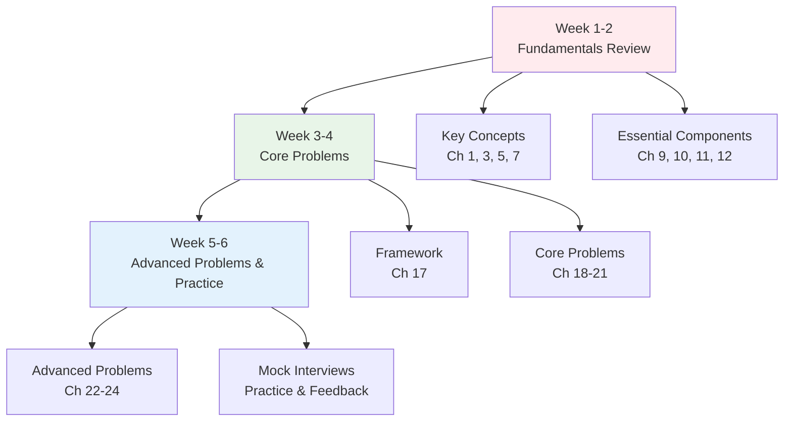
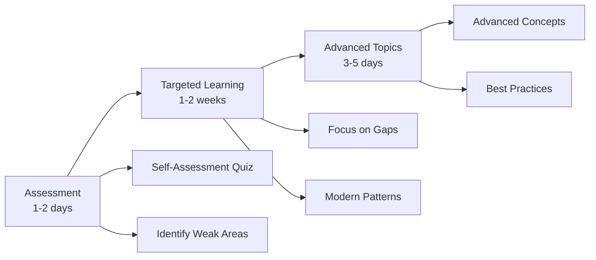
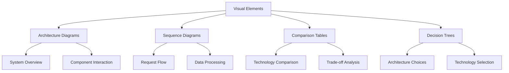

# How to Use This Book

## Introduction

This book is designed to serve two distinct purposes: as a **comprehensive learning guide** for those new to system design, and as a **quick reference resource** for experienced practitioners. Understanding how to navigate and use this book effectively will help you get the most value from your time investment.

Whether you're preparing for system design interviews, learning to architect scalable systems, or looking up specific concepts, this guide will help you choose the right approach for your goals.

## Dual-Mode Design

### Learning Mode 🎓

**Best for:**
- Complete beginners to system design
- Structured interview preparation
- Building comprehensive understanding
- Academic or course-based learning

**Characteristics:**
- Sequential chapter progression
- Hands-on exercises and checkpoints
- Progressive complexity building
- Comprehensive coverage of fundamentals

### Reference Mode 📚

**Best for:**
- Experienced developers looking up concepts
- Quick problem-solving during work
- Refreshing knowledge on specific topics
- Comparing different approaches or technologies

**Characteristics:**
- Direct topic access via search
- Standalone concept explanations
- Quick reference tables and checklists
- Cross-referenced related topics

## Learning Paths

### Path 1: Complete Beginner (8-12 weeks)

**Goal**: Build comprehensive system design knowledge from scratch

**Weekly Schedule:**
- **Week 1-2**: Introduction, Networks, Distributed Systems Basics
- **Week 3-4**: Consistency, Transactions, Scaling Fundamentals
- **Week 5-6**: Architecture Patterns, Performance, Security
- **Week 7-8**: Databases, Caching, Load Balancing
- **Week 9-10**: APIs, Search, Storage, Monitoring
- **Week 11-12**: Interview Problems and Practice

**Study Approach:**
1. Read each chapter sequentially
2. Complete all exercises and checkpoints
3. Take notes on key concepts
4. Practice with simple design problems
5. Review and reinforce learning weekly

### Path 2: Interview Preparation (4-6 weeks)

**Goal**: Prepare for system design interviews at tech companies

**Focus Areas:**
- **Fundamentals**: CAP theorem, scaling, consistency models
- **Components**: Databases, caches, load balancers, message queues
- **Problems**: Social media, messaging, e-commerce, search systems
- **Practice**: Mock interviews and peer review

### Path 3: Experienced Developer (2-3 weeks)

**Goal**: Fill knowledge gaps and learn modern system design practices

**Recommended Approach:**
1. Take the self-assessment quiz (coming soon)
2. Focus on identified weak areas
3. Study modern patterns (microservices, serverless, containers)
4. Review advanced topics and best practices

### Path 4: Reference Usage (Ongoing)

**Goal**: Quick lookup and problem-solving support

**Usage Patterns:**
- **Concept Lookup**: Use search to find specific topics
- **Problem Solving**: Jump to relevant interview problems
- **Technology Comparison**: Use comparison tables and decision matrices
- **Best Practices**: Access checklists and guidelines

## Reference Mode Usage

### Quick Navigation Strategies

#### 1. Search-First Approach

Use the search functionality to quickly find:
- **Concepts**: "CAP theorem", "eventual consistency", "load balancing"
- **Technologies**: "Redis", "Kafka", "PostgreSQL", "Kubernetes"
- **Patterns**: "microservices", "event sourcing", "CQRS"
- **Problems**: "design Twitter", "chat system", "URL shortener"

#### 2. Glossary and Index

- **Technical Glossary**: Definitions of all key terms
- **Technology Index**: Quick reference for tools and platforms
- **Pattern Index**: Architectural and design patterns
- **Problem Index**: System design interview problems by category

#### 3. Quick Reference Cards

Access condensed information for:
- **Capacity Estimation Formulas**
- **Database Comparison Charts**
- **Caching Strategy Decision Tree**
- **Load Balancing Algorithm Comparison**
- **Consistency Model Trade-offs**

### Cross-Reference System

Each concept includes links to:
- **Related Concepts**: Understand connections between topics
- **Practical Examples**: See concepts applied in real systems
- **Interview Problems**: Practice with relevant design problems
- **Further Reading**: Deep-dive resources and external links

## Navigation Tips

### Visual Learning Aids

### Interactive Elements

- **Capacity Calculators**: Estimate storage and bandwidth needs
- **Architecture Canvas**: Draw and validate system designs
- **Quiz Questions**: Test understanding of key concepts
- **Code Examples**: Practical implementation snippets
- **Case Studies**: Real-world system analysis

### Progress Tracking

- **Chapter Completion**: Track your progress through the book
- **Exercise Results**: Monitor your understanding and improvement
- **Bookmark System**: Save important sections for quick access
- **Personal Notes**: Add your own insights and reminders

## Study Recommendations

### For Beginners

**Before You Start:**
- Basic programming knowledge (any language)
- Understanding of web applications and databases
- Familiarity with basic networking concepts

**Study Habits:**
- **Consistent Schedule**: 1-2 hours daily is better than weekend cramming
- **Active Learning**: Take notes, draw diagrams, explain concepts aloud
- **Practice Regularly**: Work through exercises and design problems
- **Join Communities**: Discuss concepts with peers and mentors

**Common Pitfalls to Avoid:**
- Trying to memorize everything instead of understanding principles
- Skipping exercises and hands-on practice
- Moving too quickly through fundamental concepts
- Not practicing actual system design problems

### For Interview Preparation

**Timeline Planning:**
- **6+ weeks**: Follow the complete beginner path
- **4-6 weeks**: Focus on fundamentals + core problems
- **2-3 weeks**: Review key concepts + intensive problem practice
- **1 week**: Final review + mock interviews

**Practice Strategy:**
1. **Understand the Framework**: Learn the systematic approach
2. **Master Core Problems**: Focus on 15-20 essential problems
3. **Practice Communication**: Explain your thinking clearly
4. **Time Management**: Practice within interview time constraints
5. **Get Feedback**: Work with peers or mentors for review

**Mock Interview Schedule:**
- Week 1-2: Self-practice with timer
- Week 3-4: Peer practice sessions
- Week 5-6: Professional mock interviews

### For Reference Usage

**Bookmark Strategy:**
- **Frequently Used Concepts**: Quick access to common topics
- **Decision Frameworks**: Architecture and technology selection guides
- **Checklists**: System design review and validation lists
- **Templates**: Reusable patterns and structures

**Integration with Work:**
- Use concepts immediately in current projects
- Share learnings with team members
- Apply frameworks to real design decisions
- Contribute to architectural discussions

## Summary

This book is designed to adapt to your learning style and goals:

**Learning Mode Features:**
- Sequential progression with building complexity
- Comprehensive exercises and checkpoints
- Structured learning paths for different experience levels
- Progress tracking and personalized recommendations

**Reference Mode Features:**
- Search-optimized content organization
- Quick access to concepts, technologies, and patterns
- Cross-referenced related topics and examples
- Condensed reference cards and comparison tables

**Success Tips:**
- Choose the path that matches your goals and timeline
- Use active learning techniques (notes, diagrams, practice)
- Practice regularly with real system design problems
- Engage with the community for feedback and discussion

**Remember**: System design is a skill that develops over time. Whether you're learning systematically or using this as a reference, the key is consistent practice and application of these concepts to real problems.

---

**Quick Start Guide:**
- **New to System Design?** → Start with Path 1 (Complete Beginner)
- **Preparing for Interviews?** → Follow Path 2 (Interview Preparation)
- **Need Specific Information?** → Use search and reference mode
- **Want to Fill Gaps?** → Take the assessment and follow Path 3