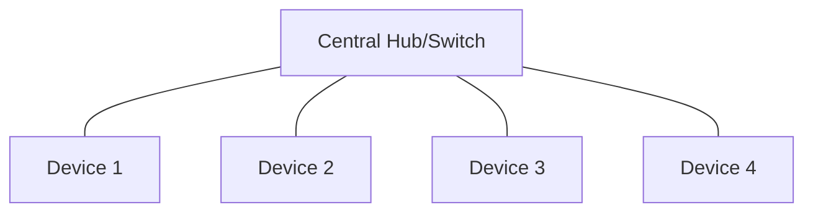
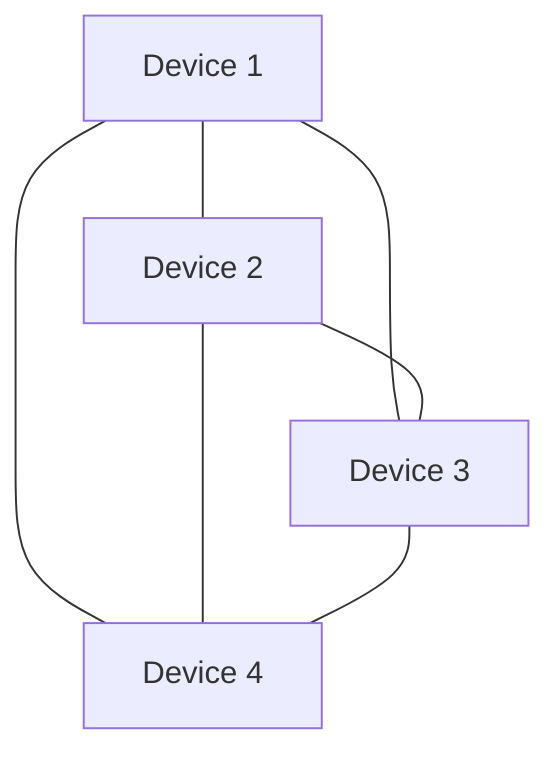
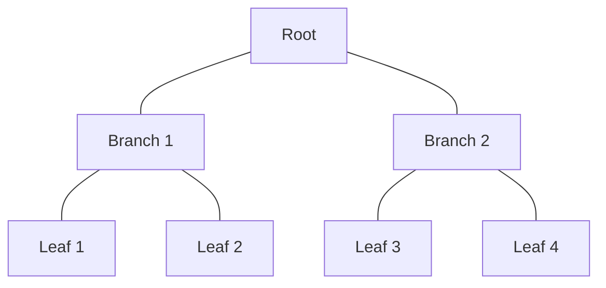
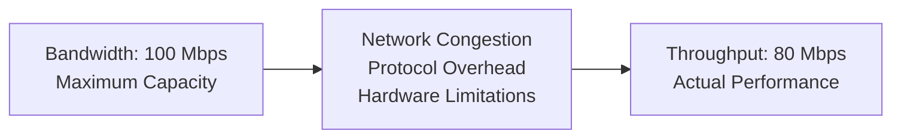
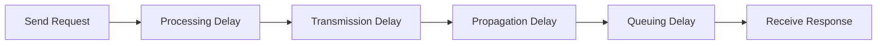
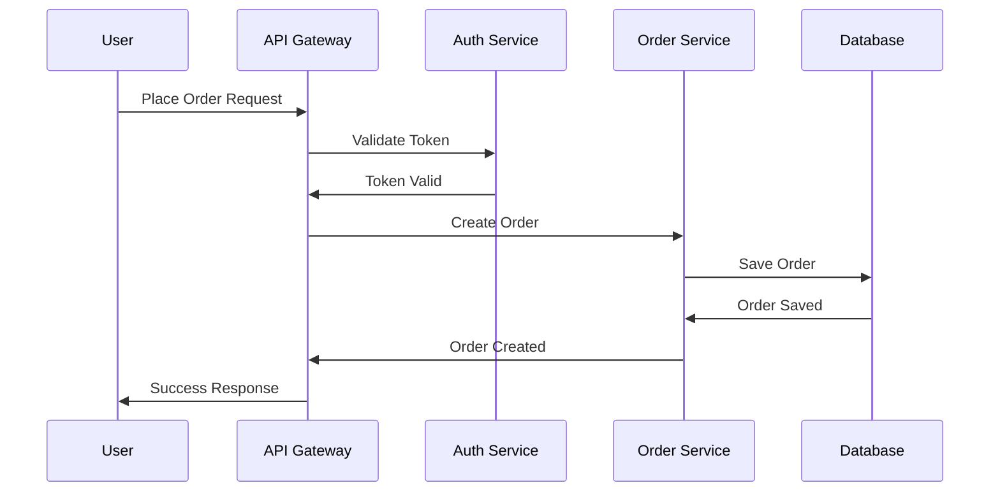
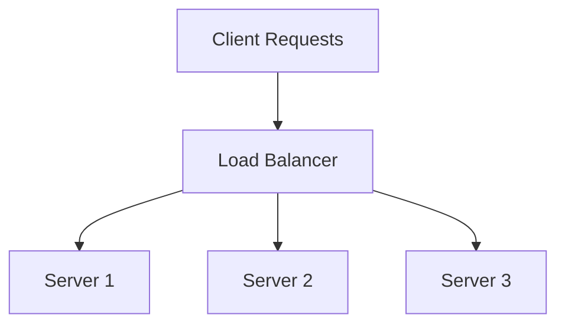
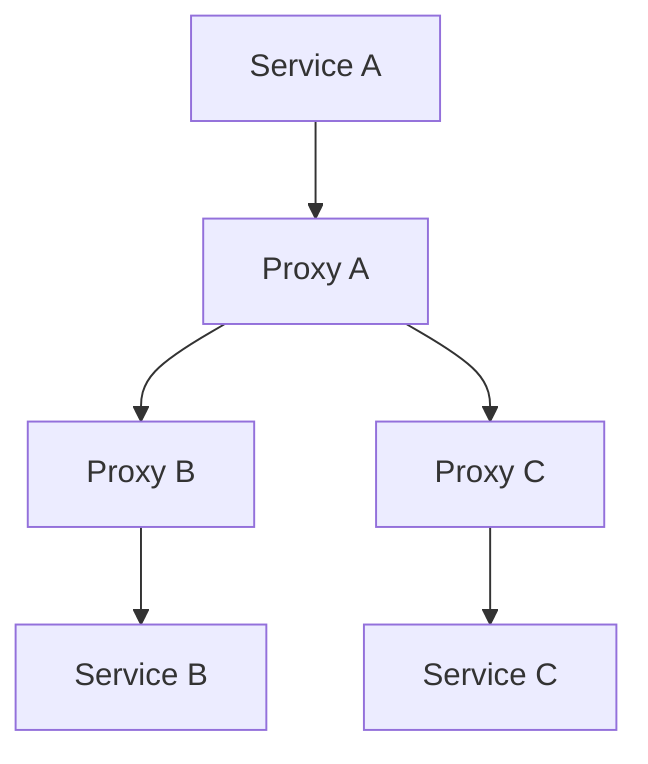

# Network Basics & Terminology

## Introduction

Computer networks form the foundation of all distributed systems. Whether you're designing a simple web application or a complex microservices architecture, understanding how computers communicate is essential. This section introduces fundamental networking concepts that you'll use throughout your system design journey.

## What is a Computer Network?

A computer network is a collection of interconnected devices that can communicate and share resources. Networks enable:

- **Data sharing** between applications and services
- **Resource sharing** like databases, files, and computing power  
- **Communication** through messaging, video calls, and collaboration tools
- **Distributed processing** across multiple machines

## Key Network Components

### Nodes
Any device connected to a network:
- **Clients**: End-user devices (laptops, phones, IoT devices)
- **Servers**: Machines that provide services (web servers, database servers)
- **Network devices**: Routers, switches, firewalls

### Links
Physical or logical connections between nodes:
- **Wired**: Ethernet cables, fiber optic cables
- **Wireless**: Wi-Fi, cellular, satellite
- **Virtual**: VPNs, software-defined networks

### Protocols
Rules that govern how devices communicate:
- **HTTP/HTTPS**: Web communication
- **TCP/UDP**: Transport layer protocols
- **IP**: Internet addressing and routing

## Network Topologies

### Star Topology


**Pros**: Easy to manage, failure isolation
**Cons**: Single point of failure at hub
**Use case**: Office networks, data centers

### Mesh Topology


**Pros**: High redundancy, no single point of failure
**Cons**: Complex, expensive
**Use case**: Internet backbone, critical systems

### Tree/Hierarchical Topology


**Pros**: Scalable, organized structure
**Cons**: Root node failure affects entire network
**Use case**: Corporate networks, CDN architecture

## Network Types by Scale

### Personal Area Network (PAN)
- **Range**: 1-10 meters
- **Examples**: Bluetooth devices, USB connections
- **Use case**: Connecting personal devices

### Local Area Network (LAN)
- **Range**: Building or campus
- **Examples**: Office Wi-Fi, Ethernet networks
- **Use case**: Internal company networks

### Wide Area Network (WAN)
- **Range**: Cities, countries, continents
- **Examples**: Internet, corporate VPNs
- **Use case**: Connecting distributed offices

### Content Delivery Network (CDN)
- **Range**: Global
- **Examples**: Cloudflare, AWS CloudFront
- **Use case**: Fast content delivery worldwide

## Essential Network Terminology

| Term | Definition | Example |
|------|------------|---------|
| **Bandwidth** | Maximum data transfer rate | 100 Mbps internet connection |
| **Latency** | Time for data to travel from source to destination | 50ms ping time |
| **Throughput** | Actual data transfer rate achieved | 80 Mbps actual speed |
| **Packet** | Unit of data transmitted over network | HTTP request broken into packets |
| **Port** | Logical endpoint for network communication | Port 80 for HTTP, Port 443 for HTTPS |
| **Firewall** | Security device that filters network traffic | Blocking unauthorized access |
| **Router** | Device that forwards data between networks | Home router connecting to ISP |
| **Switch** | Device that connects devices within a network | Office switch connecting computers |

## Network Performance Metrics

### Bandwidth vs Throughput


### Latency Components


- **Processing Delay**: Time to process packet headers
- **Transmission Delay**: Time to push packet onto link
- **Propagation Delay**: Time for signal to travel through medium
- **Queuing Delay**: Time waiting in router buffers

## Real-World Examples

### Web Application Request Flow
1. **User clicks link** → Browser initiates HTTP request
2. **DNS lookup** → Resolve domain name to IP address
3. **TCP connection** → Establish reliable connection
4. **HTTP request** → Send GET/POST request
5. **Server processing** → Application processes request
6. **HTTP response** → Send data back to browser
7. **Rendering** → Browser displays content

### Microservices Communication


## Network Security Basics

### Common Threats
- **Eavesdropping**: Intercepting network traffic
- **Man-in-the-Middle**: Intercepting and modifying communication
- **DDoS**: Overwhelming network with traffic
- **Packet Sniffing**: Capturing and analyzing network packets

### Basic Protections
- **Encryption**: HTTPS, TLS/SSL
- **Authentication**: Verify identity before access
- **Firewalls**: Filter incoming/outgoing traffic
- **VPNs**: Secure tunnels over public networks

## Best Practices for System Design

### 1. Design for Network Failures
```python
# Example: Retry logic with exponential backoff
import time
import random

def make_network_request(url, max_retries=3):
    for attempt in range(max_retries):
        try:
            response = requests.get(url, timeout=5)
            return response
        except requests.RequestException as e:
            if attempt == max_retries - 1:
                raise e
            
            # Exponential backoff with jitter
            delay = (2 ** attempt) + random.uniform(0, 1)
            time.sleep(delay)
```

### 2. Minimize Network Round Trips
```python
# Bad: Multiple round trips
user = get_user(user_id)           # Round trip 1
orders = get_user_orders(user_id)  # Round trip 2
profile = get_user_profile(user_id) # Round trip 3

# Good: Single round trip
user_data = get_user_complete_data(user_id)  # Round trip 1
```

### 3. Use Appropriate Protocols
- **HTTP/REST**: Simple request-response patterns
- **WebSockets**: Real-time bidirectional communication
- **gRPC**: High-performance RPC with binary protocol
- **Message Queues**: Asynchronous, reliable messaging

### 4. Implement Caching Strategically


## Common Network Patterns in System Design

### 1. Load Balancing
Distribute requests across multiple servers:


### 2. Service Mesh
Manage service-to-service communication:


### 3. Circuit Breaker
Prevent cascade failures:
```python
class CircuitBreaker:
    def __init__(self, failure_threshold=5, timeout=60):
        self.failure_threshold = failure_threshold
        self.timeout = timeout
        self.failure_count = 0
        self.last_failure_time = None
        self.state = 'CLOSED'  # CLOSED, OPEN, HALF_OPEN
    
    def call(self, func, *args, **kwargs):
        if self.state == 'OPEN':
            if time.time() - self.last_failure_time > self.timeout:
                self.state = 'HALF_OPEN'
            else:
                raise Exception("Circuit breaker is OPEN")
        
        try:
            result = func(*args, **kwargs)
            self.reset()
            return result
        except Exception as e:
            self.record_failure()
            raise e
```

## Summary

Understanding network basics is crucial for system design because:

1. **Performance**: Network latency often dominates system response time
2. **Reliability**: Networks fail, and systems must handle these failures gracefully
3. **Security**: Network communication needs protection from various threats
4. **Scalability**: Network architecture affects how well systems scale
5. **Cost**: Network usage can be a significant operational expense

Key concepts to remember:
- Networks enable distributed systems but introduce complexity
- Different topologies suit different use cases
- Performance metrics (bandwidth, latency, throughput) guide design decisions
- Security must be built into network communication from the start
- Design patterns help manage network complexity and failures

In the next section, we'll dive deeper into the OSI model to understand how network communication is structured in layers.
