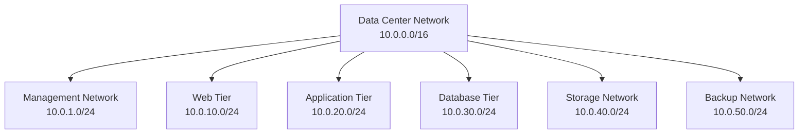

# IP Addressing & Subnetting

## Introduction

IP addressing is the foundation of network communication in distributed systems. Every device on a network needs a unique identifier to send and receive data. Understanding IP addressing and subnetting is crucial for system design because it affects network performance, security, scalability, and troubleshooting.

In this section, you'll learn how IP addresses work, how to design network architectures using subnetting, and how these concepts apply to modern cloud and distributed systems.

## IPv4 Addressing Fundamentals

### IPv4 Address Structure

An IPv4 address is a 32-bit number typically written in dotted decimal notation:

```
192.168.1.100
```

**Binary Representation:**
```
192     .168     .1       .100
11000000.10101000.00000001.01100100
```

**Address Components:**
- **Network Portion**: Identifies the network
- **Host Portion**: Identifies the specific device on that network

### IPv4 Address Classes (Historical)

| Class | Range | Default Subnet Mask | Network Bits | Host Bits | Max Networks | Max Hosts |
|-------|-------|-------------------|--------------|-----------|--------------|-----------|
| A | 1.0.0.0 - 126.255.255.255 | 255.0.0.0 (/8) | 8 | 24 | 126 | 16,777,214 |
| B | 128.0.0.0 - 191.255.255.255 | 255.255.0.0 (/16) | 16 | 16 | 16,384 | 65,534 |
| C | 192.0.0.0 - 223.255.255.255 | 255.255.255.0 (/24) | 24 | 8 | 2,097,152 | 254 |
| D | 224.0.0.0 - 239.255.255.255 | N/A | N/A | N/A | Multicast | Multicast |
| E | 240.0.0.0 - 255.255.255.255 | N/A | N/A | N/A | Reserved | Reserved |

**Note**: Classful addressing is largely obsolete, replaced by CIDR (Classless Inter-Domain Routing).

### Special IPv4 Address Ranges

#### Private Address Ranges (RFC 1918)
```
10.0.0.0/8        = 10.0.0.0 - 10.255.255.255     (16,777,216 addresses)
172.16.0.0/12     = 172.16.0.0 - 172.31.255.255   (1,048,576 addresses)
192.168.0.0/16    = 192.168.0.0 - 192.168.255.255 (65,536 addresses)
```

#### Reserved Addresses
```
0.0.0.0/8         = This network
127.0.0.0/8       = Loopback (localhost)
169.254.0.0/16    = Link-local (APIPA)
224.0.0.0/4       = Multicast
255.255.255.255   = Broadcast
```

### Subnet Masks and CIDR Notation

#### Subnet Mask Purpose
A subnet mask determines which portion of an IP address represents the network and which represents the host.

```
IP Address:    192.168.1.100
Subnet Mask:   255.255.255.0
Network:       192.168.1.0
Host:          0.0.0.100
```

#### CIDR Notation
CIDR (Classless Inter-Domain Routing) uses a slash followed by the number of network bits:

```
192.168.1.0/24 = 255.255.255.0
192.168.1.0/25 = 255.255.255.128
192.168.1.0/26 = 255.255.255.192
```

#### CIDR Calculation Examples
```python
def cidr_to_subnet_mask(cidr_bits):
    """Convert CIDR notation to subnet mask"""
    mask = (0xffffffff >> (32 - cidr_bits)) << (32 - cidr_bits)
    return f"{(mask >> 24) & 0xff}.{(mask >> 16) & 0xff}.{(mask >> 8) & 0xff}.{mask & 0xff}"

def calculate_network_info(ip_cidr):
    """Calculate network information from IP/CIDR"""
    import ipaddress
    
    network = ipaddress.IPv4Network(ip_cidr, strict=False)
    
    return {
        'network_address': str(network.network_address),
        'broadcast_address': str(network.broadcast_address),
        'subnet_mask': str(network.netmask),
        'total_addresses': network.num_addresses,
        'usable_addresses': network.num_addresses - 2,
        'first_usable': str(list(network.hosts())[0]) if network.num_addresses > 2 else None,
        'last_usable': str(list(network.hosts())[-1]) if network.num_addresses > 2 else None
    }

# Examples
print(calculate_network_info("192.168.1.0/24"))
print(calculate_network_info("10.0.0.0/16"))
print(calculate_network_info("172.16.0.0/20"))
```

## Subnetting Concepts and Techniques

### Why Subnet?

1. **Efficient IP utilization**: Avoid wasting IP addresses
2. **Network segmentation**: Separate different types of traffic
3. **Security**: Isolate sensitive systems
4. **Performance**: Reduce broadcast domains
5. **Management**: Organize networks logically

### Subnetting Process

#### Example: Subnetting 192.168.1.0/24

**Original Network:**
```
Network: 192.168.1.0/24
Addresses: 192.168.1.0 - 192.168.1.255 (256 total, 254 usable)
```

**Split into 4 subnets (/26):**
```
Subnet 1: 192.168.1.0/26   = 192.168.1.0   - 192.168.1.63   (64 addresses, 62 usable)
Subnet 2: 192.168.1.64/26  = 192.168.1.64  - 192.168.1.127  (64 addresses, 62 usable)
Subnet 3: 192.168.1.128/26 = 192.168.1.128 - 192.168.1.191  (64 addresses, 62 usable)
Subnet 4: 192.168.1.192/26 = 192.168.1.192 - 192.168.1.255  (64 addresses, 62 usable)
```

#### Variable Length Subnet Masking (VLSM)

VLSM allows different subnet sizes within the same network:

```python
def design_vlsm_network(base_network, requirements):
    """Design VLSM network based on requirements"""
    import ipaddress
    
    # Sort requirements by size (largest first)
    sorted_reqs = sorted(requirements, key=lambda x: x['hosts'], reverse=True)
    
    current_network = ipaddress.IPv4Network(base_network)
    subnets = []
    
    for req in sorted_reqs:
        # Calculate required subnet size
        required_hosts = req['hosts']
        # Add 2 for network and broadcast addresses
        required_addresses = required_hosts + 2
        
        # Find the smallest subnet that fits
        subnet_bits = 32
        while (2 ** (32 - subnet_bits)) < required_addresses:
            subnet_bits -= 1
        
        # Create subnet
        subnet_size = 32 - subnet_bits
        subnet = list(current_network.subnets(new_prefix=subnet_size))[0]
        
        subnets.append({
            'name': req['name'],
            'network': str(subnet),
            'usable_range': f"{list(subnet.hosts())[0]} - {list(subnet.hosts())[-1]}",
            'total_hosts': subnet.num_addresses - 2,
            'required_hosts': required_hosts
        })
        
        # Update current network to next available space
        remaining_networks = list(current_network.address_exclude(subnet))
        if remaining_networks:
            current_network = remaining_networks[0]
    
    return subnets

# Example: Design network for different departments
requirements = [
    {'name': 'Engineering', 'hosts': 100},
    {'name': 'Sales', 'hosts': 50},
    {'name': 'Marketing', 'hosts': 25},
    {'name': 'HR', 'hosts': 10},
    {'name': 'Servers', 'hosts': 5}
]

vlsm_design = design_vlsm_network("192.168.0.0/24", requirements)
for subnet in vlsm_design:
    print(f"{subnet['name']}: {subnet['network']} ({subnet['total_hosts']} hosts)")
```

### Subnetting for System Design

#### Data Center Network Design


#### Multi-Region Cloud Architecture
```python
class NetworkDesigner:
    def __init__(self):
        self.regions = {}
    
    def design_multi_region_network(self, base_cidr="10.0.0.0/8"):
        """Design network architecture for multiple regions"""
        import ipaddress
        
        base_network = ipaddress.IPv4Network(base_cidr)
        
        # Allocate /12 for each region (1,048,576 addresses each)
        region_networks = list(base_network.subnets(new_prefix=12))
        
        regions = ['us-east-1', 'us-west-2', 'eu-west-1', 'ap-southeast-1']
        
        for i, region in enumerate(regions):
            if i < len(region_networks):
                self.regions[region] = self.design_region_network(region_networks[i])
        
        return self.regions
    
    def design_region_network(self, region_network):
        """Design network within a single region"""
        # Allocate /16 for each AZ (65,536 addresses each)
        az_networks = list(region_network.subnets(new_prefix=16))
        
        region_design = {
            'region_cidr': str(region_network),
            'availability_zones': {}
        }
        
        az_names = ['a', 'b', 'c']
        for i, az_name in enumerate(az_names):
            if i < len(az_networks):
                region_design['availability_zones'][az_name] = self.design_az_network(az_networks[i])
        
        return region_design
    
    def design_az_network(self, az_network):
        """Design network within a single availability zone"""
        # Subnet the AZ network for different tiers
        subnets = list(az_network.subnets(new_prefix=20))  # /20 = 4,096 addresses each
        
        return {
            'az_cidr': str(az_network),
            'public_subnet': str(subnets[0]) if len(subnets) > 0 else None,
            'private_app_subnet': str(subnets[1]) if len(subnets) > 1 else None,
            'private_db_subnet': str(subnets[2]) if len(subnets) > 2 else None,
            'management_subnet': str(subnets[3]) if len(subnets) > 3 else None
        }

# Example usage
designer = NetworkDesigner()
network_design = designer.design_multi_region_network()

for region, design in network_design.items():
    print(f"\nRegion: {region} ({design['region_cidr']})")
    for az, az_design in design['availability_zones'].items():
        print(f"  AZ-{az}: {az_design['az_cidr']}")
        print(f"    Public: {az_design['public_subnet']}")
        print(f"    App: {az_design['private_app_subnet']}")
        print(f"    DB: {az_design['private_db_subnet']}")
```

## IPv6 Addressing

### IPv6 Address Structure

IPv6 uses 128-bit addresses written in hexadecimal notation:

```
2001:0db8:85a3:0000:0000:8a2e:0370:7334
```

**Compressed Format:**
```
2001:db8:85a3::8a2e:370:7334
```

### IPv6 Address Types

#### Global Unicast Addresses
```
2000::/3 = Global unicast (internet routable)
```

#### Link-Local Addresses
```
fe80::/10 = Link-local (not routable beyond local link)
```

#### Unique Local Addresses
```
fc00::/7 = Unique local (private, similar to RFC 1918)
```

#### Multicast Addresses
```
ff00::/8 = Multicast
```

### IPv6 Subnetting

IPv6 subnetting is much simpler due to the large address space:

```python
def ipv6_subnet_design(base_prefix="2001:db8::/32"):
    """Design IPv6 subnet structure"""
    import ipaddress
    
    base_network = ipaddress.IPv6Network(base_prefix)
    
    # Standard practice: /48 for sites, /64 for subnets
    site_networks = list(base_network.subnets(new_prefix=48))
    
    design = {}
    sites = ['headquarters', 'branch-office', 'data-center']
    
    for i, site in enumerate(sites):
        if i < len(site_networks):
            site_network = site_networks[i]
            # Each site gets /64 subnets
            subnets = list(site_network.subnets(new_prefix=64))
            
            design[site] = {
                'site_prefix': str(site_network),
                'subnets': {
                    'management': str(subnets[0]) if len(subnets) > 0 else None,
                    'servers': str(subnets[1]) if len(subnets) > 1 else None,
                    'workstations': str(subnets[2]) if len(subnets) > 2 else None,
                    'guest': str(subnets[3]) if len(subnets) > 3 else None
                }
            }
    
    return design

# Example
ipv6_design = ipv6_subnet_design()
for site, config in ipv6_design.items():
    print(f"\n{site}: {config['site_prefix']}")
    for subnet_type, prefix in config['subnets'].items():
        if prefix:
            print(f"  {subnet_type}: {prefix}")
```

## Network Address Translation (NAT)

### NAT Types and Use Cases

#### Static NAT (One-to-One)
```
Internal: 192.168.1.10 ↔ External: 203.0.113.10
```

#### Dynamic NAT (Many-to-Many)
```
Internal Pool: 192.168.1.0/24 ↔ External Pool: 203.0.113.0/28
```

#### PAT/NAPT (Port Address Translation)
```
192.168.1.10:3000 → 203.0.113.1:50000
192.168.1.11:3000 → 203.0.113.1:50001
192.168.1.12:3000 → 203.0.113.1:50002
```

### NAT in Cloud Environments

#### AWS VPC NAT Gateway Example
```python
class NATGatewayDesign:
    def __init__(self):
        self.nat_gateways = {}
    
    def design_nat_architecture(self, vpc_cidr="10.0.0.0/16"):
        """Design NAT gateway architecture for high availability"""
        import ipaddress
        
        vpc_network = ipaddress.IPv4Network(vpc_cidr)
        
        # Create subnets for each AZ
        az_subnets = list(vpc_network.subnets(new_prefix=18))  # /18 per AZ
        
        architecture = {
            'vpc_cidr': vpc_cidr,
            'availability_zones': {}
        }
        
        for i, az_letter in enumerate(['a', 'b', 'c']):
            if i < len(az_subnets):
                az_network = az_subnets[i]
                tier_subnets = list(az_network.subnets(new_prefix=20))  # /20 per tier
                
                architecture['availability_zones'][f'us-east-1{az_letter}'] = {
                    'public_subnet': str(tier_subnets[0]),  # For NAT Gateway
                    'private_subnet': str(tier_subnets[1]), # For application servers
                    'nat_gateway': {
                        'subnet': str(tier_subnets[0]),
                        'purpose': 'Outbound internet access for private subnet'
                    }
                }
        
        return architecture
    
    def calculate_nat_costs(self, data_processed_gb_per_month):
        """Calculate NAT Gateway costs (example pricing)"""
        # AWS NAT Gateway pricing (example - check current pricing)
        hourly_rate = 0.045  # USD per hour
        data_rate = 0.045    # USD per GB processed
        
        hours_per_month = 24 * 30
        monthly_fixed_cost = hourly_rate * hours_per_month
        monthly_data_cost = data_processed_gb_per_month * data_rate
        
        return {
            'fixed_cost_per_month': monthly_fixed_cost,
            'data_processing_cost': monthly_data_cost,
            'total_monthly_cost': monthly_fixed_cost + monthly_data_cost
        }

# Example usage
nat_design = NATGatewayDesign()
architecture = nat_design.design_nat_architecture()

print("NAT Gateway Architecture:")
for az, config in architecture['availability_zones'].items():
    print(f"{az}:")
    print(f"  Public Subnet (NAT): {config['public_subnet']}")
    print(f"  Private Subnet: {config['private_subnet']}")

# Cost calculation
costs = nat_design.calculate_nat_costs(1000)  # 1TB per month
print(f"\nMonthly NAT costs for 1TB: ${costs['total_monthly_cost']:.2f}")
```

## Routing Fundamentals

### Routing Table Structure

```bash
# Linux routing table example
$ ip route show
default via 192.168.1.1 dev eth0 proto dhcp metric 100
10.0.0.0/24 dev docker0 proto kernel scope link src 10.0.0.1
192.168.1.0/24 dev eth0 proto kernel scope link src 192.168.1.100
```

### Static vs Dynamic Routing

#### Static Routing
```python
class StaticRouteManager:
    def __init__(self):
        self.routes = []
    
    def add_route(self, destination, gateway, interface, metric=1):
        """Add static route"""
        route = {
            'destination': destination,
            'gateway': gateway,
            'interface': interface,
            'metric': metric
        }
        self.routes.append(route)
    
    def find_route(self, destination_ip):
        """Find best route for destination"""
        import ipaddress
        
        dest_addr = ipaddress.IPv4Address(destination_ip)
        best_route = None
        longest_prefix = -1
        
        for route in self.routes:
            try:
                network = ipaddress.IPv4Network(route['destination'], strict=False)
                if dest_addr in network:
                    prefix_length = network.prefixlen
                    if prefix_length > longest_prefix:
                        longest_prefix = prefix_length
                        best_route = route
            except ValueError:
                continue
        
        return best_route
    
    def generate_routing_config(self):
        """Generate routing configuration"""
        config = []
        for route in sorted(self.routes, key=lambda x: x['metric']):
            config.append(f"ip route {route['destination']} {route['gateway']} {route['metric']}")
        return config

# Example usage
router = StaticRouteManager()
router.add_route("0.0.0.0/0", "192.168.1.1", "eth0", 1)  # Default route
router.add_route("10.0.0.0/8", "192.168.1.254", "eth0", 10)  # Private networks
router.add_route("172.16.0.0/12", "192.168.1.254", "eth0", 10)

# Find route for specific destination
route = router.find_route("10.5.1.100")
print(f"Route to 10.5.1.100: {route}")
```

### Dynamic Routing Protocols

#### OSPF (Open Shortest Path First)
```python
class OSPFSimulator:
    def __init__(self):
        self.routers = {}
        self.links = {}
    
    def add_router(self, router_id, networks):
        """Add router with its directly connected networks"""
        self.routers[router_id] = {
            'networks': networks,
            'neighbors': [],
            'lsa_database': {}
        }
    
    def add_link(self, router1, router2, cost):
        """Add link between routers"""
        link_id = f"{router1}-{router2}"
        self.links[link_id] = {
            'routers': [router1, router2],
            'cost': cost
        }
        
        # Update neighbor relationships
        if router1 in self.routers:
            self.routers[router1]['neighbors'].append(router2)
        if router2 in self.routers:
            self.routers[router2]['neighbors'].append(router1)
    
    def calculate_shortest_path(self, source, destination):
        """Dijkstra's algorithm for shortest path"""
        import heapq
        
        # Initialize distances
        distances = {router: float('inf') for router in self.routers}
        distances[source] = 0
        previous = {}
        
        # Priority queue: (distance, router)
        pq = [(0, source)]
        visited = set()
        
        while pq:
            current_distance, current_router = heapq.heappop(pq)
            
            if current_router in visited:
                continue
            
            visited.add(current_router)
            
            if current_router == destination:
                break
            
            # Check all neighbors
            for neighbor in self.routers[current_router]['neighbors']:
                if neighbor not in visited:
                    # Find link cost
                    link_cost = self.get_link_cost(current_router, neighbor)
                    distance = current_distance + link_cost
                    
                    if distance < distances[neighbor]:
                        distances[neighbor] = distance
                        previous[neighbor] = current_router
                        heapq.heappush(pq, (distance, neighbor))
        
        # Reconstruct path
        path = []
        current = destination
        while current in previous:
            path.append(current)
            current = previous[current]
        path.append(source)
        path.reverse()
        
        return path, distances[destination]
    
    def get_link_cost(self, router1, router2):
        """Get cost of link between two routers"""
        link_id1 = f"{router1}-{router2}"
        link_id2 = f"{router2}-{router1}"
        
        if link_id1 in self.links:
            return self.links[link_id1]['cost']
        elif link_id2 in self.links:
            return self.links[link_id2]['cost']
        else:
            return float('inf')

# Example network topology
ospf = OSPFSimulator()

# Add routers
ospf.add_router("R1", ["192.168.1.0/24"])
ospf.add_router("R2", ["192.168.2.0/24"])
ospf.add_router("R3", ["192.168.3.0/24"])
ospf.add_router("R4", ["192.168.4.0/24"])

# Add links with costs
ospf.add_link("R1", "R2", 10)
ospf.add_link("R1", "R3", 20)
ospf.add_link("R2", "R4", 15)
ospf.add_link("R3", "R4", 5)

# Calculate shortest path
path, cost = ospf.calculate_shortest_path("R1", "R4")
print(f"Shortest path from R1 to R4: {' -> '.join(path)} (cost: {cost})")
```

## IP Addressing in System Design

### Microservices Network Architecture

```python
class MicroservicesNetworkDesign:
    def __init__(self, base_cidr="10.0.0.0/16"):
        self.base_network = ipaddress.IPv4Network(base_cidr)
        self.service_networks = {}
    
    def design_service_mesh_network(self, services):
        """Design network for service mesh architecture"""
        # Allocate /20 for each service (4,096 addresses)
        service_subnets = list(self.base_network.subnets(new_prefix=20))
        
        for i, service in enumerate(services):
            if i < len(service_subnets):
                service_subnet = service_subnets[i]
                
                # Further subnet for different environments
                env_subnets = list(service_subnet.subnets(new_prefix=22))  # /22 per environment
                
                self.service_networks[service] = {
                    'service_cidr': str(service_subnet),
                    'environments': {
                        'production': str(env_subnets[0]) if len(env_subnets) > 0 else None,
                        'staging': str(env_subnets[1]) if len(env_subnets) > 1 else None,
                        'development': str(env_subnets[2]) if len(env_subnets) > 2 else None,
                        'testing': str(env_subnets[3]) if len(env_subnets) > 3 else None
                    }
                }
        
        return self.service_networks
    
    def generate_service_discovery_config(self):
        """Generate service discovery configuration"""
        config = {}
        
        for service, networks in self.service_networks.items():
            config[service] = {
                'service_name': service,
                'network_cidr': networks['service_cidr'],
                'health_check_endpoint': f"http://{service}.internal/health",
                'load_balancer_algorithm': 'round_robin',
                'environments': networks['environments']
            }
        
        return config

# Example usage
services = ['user-service', 'order-service', 'payment-service', 'inventory-service', 'notification-service']

network_designer = MicroservicesNetworkDesign()
service_networks = network_designer.design_service_mesh_network(services)

print("Microservices Network Design:")
for service, config in service_networks.items():
    print(f"\n{service}: {config['service_cidr']}")
    for env, cidr in config['environments'].items():
        if cidr:
            print(f"  {env}: {cidr}")

# Service discovery configuration
discovery_config = network_designer.generate_service_discovery_config()
```

### Container Network Design

```python
class ContainerNetworkDesign:
    def __init__(self):
        self.networks = {}
    
    def design_docker_networks(self, cluster_cidr="172.17.0.0/16"):
        """Design Docker container networks"""
        import ipaddress
        
        cluster_network = ipaddress.IPv4Network(cluster_cidr)
        
        # Allocate different subnets for different purposes
        subnets = list(cluster_network.subnets(new_prefix=20))  # /20 subnets
        
        self.networks = {
            'bridge_network': {
                'cidr': str(subnets[0]),
                'purpose': 'Default Docker bridge network',
                'driver': 'bridge'
            },
            'overlay_network': {
                'cidr': str(subnets[1]),
                'purpose': 'Multi-host container communication',
                'driver': 'overlay'
            },
            'macvlan_network': {
                'cidr': str(subnets[2]),
                'purpose': 'Direct physical network access',
                'driver': 'macvlan'
            },
            'host_network': {
                'cidr': 'host',
                'purpose': 'Use host network stack',
                'driver': 'host'
            }
        }
        
        return self.networks
    
    def generate_docker_compose_networks(self):
        """Generate Docker Compose network configuration"""
        compose_config = {
            'version': '3.8',
            'networks': {}
        }
        
        for network_name, config in self.networks.items():
            if config['cidr'] != 'host':
                compose_config['networks'][network_name] = {
                    'driver': config['driver'],
                    'ipam': {
                        'config': [
                            {'subnet': config['cidr']}
                        ]
                    }
                }
        
        return compose_config
    
    def design_kubernetes_networks(self, pod_cidr="10.244.0.0/16", service_cidr="10.96.0.0/12"):
        """Design Kubernetes cluster networks"""
        import ipaddress
        
        pod_network = ipaddress.IPv4Network(pod_cidr)
        service_network = ipaddress.IPv4Network(service_cidr)
        
        # Allocate pod subnets per node
        node_subnets = list(pod_network.subnets(new_prefix=24))  # /24 per node
        
        k8s_config = {
            'cluster_cidr': pod_cidr,
            'service_cidr': service_cidr,
            'node_subnets': [str(subnet) for subnet in node_subnets[:10]],  # First 10 nodes
            'dns_service_ip': str(list(service_network.hosts())[9]),  # 10th IP for DNS
            'api_server_service_ip': str(list(service_network.hosts())[0])  # 1st IP for API server
        }
        
        return k8s_config

# Example usage
container_designer = ContainerNetworkDesign()

# Docker networks
docker_networks = container_designer.design_docker_networks()
print("Docker Network Design:")
for network, config in docker_networks.items():
    print(f"{network}: {config['cidr']} ({config['purpose']})")

# Kubernetes networks
k8s_config = container_designer.design_kubernetes_networks()
print(f"\nKubernetes Network Design:")
print(f"Pod CIDR: {k8s_config['cluster_cidr']}")
print(f"Service CIDR: {k8s_config['service_cidr']}")
print(f"DNS Service IP: {k8s_config['dns_service_ip']}")
```

## Network Security and IP Addressing

### Firewall Rules and Network Segmentation

```python
class NetworkSecurityDesign:
    def __init__(self):
        self.security_zones = {}
        self.firewall_rules = []
    
    def design_security_zones(self, network_cidr="10.0.0.0/16"):
        """Design network security zones"""
        import ipaddress
        
        base_network = ipaddress.IPv4Network(network_cidr)
        zone_subnets = list(base_network.subnets(new_prefix=20))  # /20 per zone
        
        self.security_zones = {
            'dmz': {
                'cidr': str(zone_subnets[0]),
                'purpose': 'Public-facing services',
                'trust_level': 'low',
                'allowed_protocols': ['HTTP', 'HTTPS', 'SSH']
            },
            'web_tier': {
                'cidr': str(zone_subnets[1]),
                'purpose': 'Web application servers',
                'trust_level': 'medium',
                'allowed_protocols': ['HTTP', 'HTTPS']
            },
            'app_tier': {
                'cidr': str(zone_subnets[2]),
                'purpose': 'Application logic servers',
                'trust_level': 'medium',
                'allowed_protocols': ['Custom APIs', 'RPC']
            },
            'db_tier': {
                'cidr': str(zone_subnets[3]),
                'purpose': 'Database servers',
                'trust_level': 'high',
                'allowed_protocols': ['MySQL', 'PostgreSQL', 'MongoDB']
            },
            'management': {
                'cidr': str(zone_subnets[4]),
                'purpose': 'Management and monitoring',
                'trust_level': 'high',
                'allowed_protocols': ['SSH', 'SNMP', 'HTTPS']
            }
        }
        
        return self.security_zones
    
    def generate_firewall_rules(self):
        """Generate firewall rules based on security zones"""
        rules = []
        
        # DMZ rules
        rules.append({
            'source': 'any',
            'destination': self.security_zones['dmz']['cidr'],
            'ports': [80, 443],
            'action': 'allow',
            'description': 'Allow HTTP/HTTPS to DMZ'
        })
        
        # Web tier rules
        rules.append({
            'source': self.security_zones['dmz']['cidr'],
            'destination': self.security_zones['web_tier']['cidr'],
            'ports': [8080, 8443],
            'action': 'allow',
            'description': 'Allow DMZ to Web tier'
        })
        
        # App tier rules
        rules.append({
            'source': self.security_zones['web_tier']['cidr'],
            'destination': self.security_zones['app_tier']['cidr'],
            'ports': [9000, 9001],
            'action': 'allow',
            'description': 'Allow Web to App tier'
        })
        
        # Database tier rules
        rules.append({
            'source': self.security_zones['app_tier']['cidr'],
            'destination': self.security_zones['db_tier']['cidr'],
            'ports': [3306, 5432, 27017],
            'action': 'allow',
            'description': 'Allow App to DB tier'
        })
        
        # Management rules
        rules.append({
            'source': self.security_zones['management']['cidr'],
            'destination': 'any',
            'ports': [22, 161, 443],
            'action': 'allow',
            'description': 'Allow management access'
        })
        
        # Default deny rule
        rules.append({
            'source': 'any',
            'destination': 'any',
            'ports': 'any',
            'action': 'deny',
            'description': 'Default deny all'
        })
        
        self.firewall_rules = rules
        return rules
    
    def generate_iptables_config(self):
        """Generate iptables configuration"""
        config = [
            "#!/bin/bash",
            "# Flush existing rules",
            "iptables -F",
            "iptables -X",
            "iptables -t nat -F",
            "iptables -t nat -X",
            "",
            "# Set default policies",
            "iptables -P INPUT DROP",
            "iptables -P FORWARD DROP",
            "iptables -P OUTPUT ACCEPT",
            ""
        ]
        
        for rule in self.firewall_rules:
            if rule['action'] == 'allow' and rule['source'] != 'any':
                if isinstance(rule['ports'], list):
                    for port in rule['ports']:
                        config.append(f"iptables -A FORWARD -s {rule['source']} -d {rule['destination']} -p tcp --dport {port} -j ACCEPT")
                else:
                    config.append(f"# {rule['description']}")
        
        return "\n".join(config)

# Example usage
security_designer = NetworkSecurityDesign()
security_zones = security_designer.design_security_zones()

print("Security Zone Design:")
for zone, config in security_zones.items():
    print(f"{zone}: {config['cidr']} - {config['purpose']} (Trust: {config['trust_level']})")

firewall_rules = security_designer.generate_firewall_rules()
print(f"\nGenerated {len(firewall_rules)} firewall rules")
```

## Performance Considerations

### Network Latency and IP Design

```python
class NetworkPerformanceAnalyzer:
    def __init__(self):
        self.latency_matrix = {}
    
    def calculate_network_latency(self, source_region, dest_region):
        """Calculate estimated latency between regions"""
        # Simplified latency model based on geographic distance
        latency_map = {
            ('us-east-1', 'us-west-2'): 70,    # Cross-US
            ('us-east-1', 'eu-west-1'): 80,    # US to Europe
            ('us-east-1', 'ap-southeast-1'): 180,  # US to Asia
            ('eu-west-1', 'ap-southeast-1'): 160,  # Europe to Asia
        }
        
        # Check both directions
        key1 = (source_region, dest_region)
        key2 = (dest_region, source_region)
        
        return latency_map.get(key1, latency_map.get(key2, 50))
    
    def optimize_network_placement(self, services, user_regions):
        """Optimize service placement based on user distribution"""
        recommendations = {}
        
        for service in services:
            best_region = None
            min_weighted_latency = float('inf')
            
            for candidate_region in ['us-east-1', 'us-west-2', 'eu-west-1', 'ap-southeast-1']:
                weighted_latency = 0
                
                for user_region, user_percentage in user_regions.items():
                    latency = self.calculate_network_latency(candidate_region, user_region)
                    weighted_latency += latency * (user_percentage / 100)
                
                if weighted_latency < min_weighted_latency:
                    min_weighted_latency = weighted_latency
                    best_region = candidate_region
            
            recommendations[service] = {
                'recommended_region': best_region,
                'average_latency_ms': min_weighted_latency
            }
        
        return recommendations
    
    def calculate_cdn_performance(self, origin_region, cdn_pops):
        """Calculate CDN performance improvement"""
        performance_data = {}
        
        for pop_region in cdn_pops:
            # Calculate cache hit ratio impact
            cache_hit_ratio = 0.85  # Typical CDN cache hit ratio
            
            origin_latency = self.calculate_network_latency(origin_region, pop_region)
            cdn_latency = 20  # Typical CDN edge latency
            
            # Weighted average latency
            effective_latency = (cache_hit_ratio * cdn_latency) + ((1 - cache_hit_ratio) * origin_latency)
            
            performance_data[pop_region] = {
                'origin_latency_ms': origin_latency,
                'cdn_latency_ms': cdn_latency,
                'effective_latency_ms': effective_latency,
                'improvement_percentage': ((origin_latency - effective_latency) / origin_latency) * 100
            }
        
        return performance_data

# Example usage
analyzer = NetworkPerformanceAnalyzer()

# User distribution
user_regions = {
    'us-east-1': 40,      # 40% of users
    'us-west-2': 25,      # 25% of users
    'eu-west-1': 20,      # 20% of users
    'ap-southeast-1': 15  # 15% of users
}

services = ['api-gateway', 'user-service', 'payment-service']

# Optimize service placement
recommendations = analyzer.optimize_network_placement(services, user_regions)
print("Service Placement Recommendations:")
for service, rec in recommendations.items():
    print(f"{service}: {rec['recommended_region']} (avg latency: {rec['average_latency_ms']:.1f}ms)")

# CDN performance analysis
cdn_performance = analyzer.calculate_cdn_performance('us-east-1', list(user_regions.keys()))
print("\nCDN Performance Analysis:")
for region, perf in cdn_performance.items():
    print(f"{region}: {perf['improvement_percentage']:.1f}% improvement ({perf['effective_latency_ms']:.1f}ms)")
```

## Troubleshooting IP Addressing Issues

### Common IP Addressing Problems

```python
class IPTroubleshooter:
    def __init__(self):
        self.diagnostic_tests = []
    
    def diagnose_connectivity_issue(self, source_ip, dest_ip, dest_port=None):
        """Comprehensive connectivity diagnosis"""
        import subprocess
        import socket
        
        results = {
            'source_ip': source_ip,
            'destination_ip': dest_ip,
            'tests': {}
        }
        
        # Test 1: Ping connectivity (ICMP)
        try:
            ping_result = subprocess.run(
                ['ping', '-c', '3', dest_ip],
                capture_output=True, text=True, timeout=10
            )
            results['tests']['ping'] = {
                'success': ping_result.returncode == 0,
                'output': ping_result.stdout if ping_result.returncode == 0 else ping_result.stderr
            }
        except subprocess.TimeoutExpired:
            results['tests']['ping'] = {
                'success': False,
                'output': 'Ping timeout'
            }
        
        # Test 2: Traceroute (path analysis)
        try:
            traceroute_result = subprocess.run(
                ['traceroute', '-n', dest_ip],
                capture_output=True, text=True, timeout=30
            )
            results['tests']['traceroute'] = {
                'success': traceroute_result.returncode == 0,
                'output': traceroute_result.stdout
            }
        except subprocess.TimeoutExpired:
            results['tests']['traceroute'] = {
                'success': False,
                'output': 'Traceroute timeout'
            }
        
        # Test 3: Port connectivity (if port specified)
        if dest_port:
            try:
                sock = socket.socket(socket.AF_INET, socket.SOCK_STREAM)
                sock.settimeout(5)
                result = sock.connect_ex((dest_ip, dest_port))
                sock.close()
                
                results['tests']['port_check'] = {
                    'success': result == 0,
                    'port': dest_port,
                    'output': f"Port {dest_port} {'open' if result == 0 else 'closed/filtered'}"
                }
            except Exception as e:
                results['tests']['port_check'] = {
                    'success': False,
                    'port': dest_port,
                    'output': f"Error: {str(e)}"
                }
        
        # Test 4: DNS resolution
        try:
            import socket
            resolved_ip = socket.gethostbyname(dest_ip)
            results['tests']['dns_resolution'] = {
                'success': True,
                'resolved_ip': resolved_ip,
                'output': f"Resolved to {resolved_ip}"
            }
        except socket.gaierror:
            # dest_ip is already an IP address, not a hostname
            results['tests']['dns_resolution'] = {
                'success': True,
                'output': "IP address provided, no DNS resolution needed"
            }
        
        return results
    
    def analyze_subnet_conflicts(self, networks):
        """Detect subnet conflicts and overlaps"""
        import ipaddress
        
        conflicts = []
        networks_parsed = []
        
        # Parse all networks
        for network_name, cidr in networks.items():
            try:
                network_obj = ipaddress.IPv4Network(cidr, strict=False)
                networks_parsed.append((network_name, network_obj))
            except ValueError as e:
                conflicts.append({
                    'type': 'invalid_cidr',
                    'network': network_name,
                    'cidr': cidr,
                    'error': str(e)
                })
        
        # Check for overlaps
        for i, (name1, net1) in enumerate(networks_parsed):
            for j, (name2, net2) in enumerate(networks_parsed[i+1:], i+1):
                if net1.overlaps(net2):
                    conflicts.append({
                        'type': 'overlap',
                        'network1': name1,
                        'network2': name2,
                        'cidr1': str(net1),
                        'cidr2': str(net2)
                    })
        
        return conflicts
    
    def validate_ip_configuration(self, ip_config):
        """Validate IP configuration for common issues"""
        import ipaddress
        
        issues = []
        
        try:
            ip_addr = ipaddress.IPv4Address(ip_config['ip'])
            network = ipaddress.IPv4Network(f"{ip_config['network']}/{ip_config['prefix']}", strict=False)
            gateway = ipaddress.IPv4Address(ip_config['gateway'])
            
            # Check if IP is in the network
            if ip_addr not in network:
                issues.append({
                    'type': 'ip_not_in_network',
                    'message': f"IP {ip_addr} is not in network {network}"
                })
            
            # Check if gateway is in the network
            if gateway not in network:
                issues.append({
                    'type': 'gateway_not_in_network',
                    'message': f"Gateway {gateway} is not in network {network}"
                })
            
            # Check for network/broadcast address usage
            if ip_addr == network.network_address:
                issues.append({
                    'type': 'network_address_used',
                    'message': f"IP {ip_addr} is the network address"
                })
            
            if ip_addr == network.broadcast_address:
                issues.append({
                    'type': 'broadcast_address_used',
                    'message': f"IP {ip_addr} is the broadcast address"
                })
            
            # Check for private vs public address consistency
            if ip_addr.is_private != gateway.is_private:
                issues.append({
                    'type': 'address_type_mismatch',
                    'message': f"IP and gateway have different address types (private/public)"
                })
        
        except ValueError as e:
            issues.append({
                'type': 'invalid_address',
                'message': f"Invalid IP configuration: {str(e)}"
            })
        
        return issues

# Example usage
troubleshooter = IPTroubleshooter()

# Diagnose connectivity
connectivity_results = troubleshooter.diagnose_connectivity_issue("192.168.1.100", "8.8.8.8", 53)
print("Connectivity Diagnosis:")
for test, result in connectivity_results['tests'].items():
    status = "PASS" if result['success'] else "FAIL"
    print(f"{test}: {status}")

# Check for subnet conflicts
networks = {
    'production': '10.0.0.0/16',
    'staging': '10.1.0.0/16',
    'development': '10.0.1.0/24',  # This overlaps with production
    'management': '192.168.1.0/24'
}

conflicts = troubleshooter.analyze_subnet_conflicts(networks)
if conflicts:
    print("\nSubnet Conflicts Found:")
    for conflict in conflicts:
        print(f"- {conflict['type']}: {conflict}")
else:
    print("\nNo subnet conflicts found")

# Validate IP configuration
ip_config = {
    'ip': '192.168.1.100',
    'network': '192.168.1.0',
    'prefix': 24,
    'gateway': '192.168.1.1'
}

validation_issues = troubleshooter.validate_ip_configuration(ip_config)
if validation_issues:
    print("\nIP Configuration Issues:")
    for issue in validation_issues:
        print(f"- {issue['type']}: {issue['message']}")
else:
    print("\nIP configuration is valid")
```

## Best Practices for IP Addressing in System Design

### 1. Plan for Growth
```python
def calculate_growth_requirements(current_hosts, growth_rate_percent, years):
    """Calculate future IP address requirements"""
    future_hosts = current_hosts
    
    for year in range(years):
        future_hosts *= (1 + growth_rate_percent / 100)
    
    # Add 20% buffer
    recommended_hosts = int(future_hosts * 1.2)
    
    # Find appropriate subnet size
    subnet_bits = 32
    while (2 ** (32 - subnet_bits)) < recommended_hosts + 2:  # +2 for network/broadcast
        subnet_bits -= 1
    
    return {
        'current_hosts': current_hosts,
        'projected_hosts': int(future_hosts),
        'recommended_capacity': recommended_hosts,
        'recommended_subnet': f"/{subnet_bits}",
        'available_addresses': 2 ** (32 - subnet_bits) - 2
    }

# Example: Plan for 5-year growth
growth_plan = calculate_growth_requirements(100, 25, 5)  # 100 hosts, 25% annual growth, 5 years
print(f"Growth Planning: {growth_plan}")
```

### 2. Implement Hierarchical Addressing
```python
def design_hierarchical_addressing(organization_structure):
    """Design hierarchical IP addressing scheme"""
    base_network = ipaddress.IPv4Network("10.0.0.0/8")
    
    # Allocate /12 for each region (1M addresses each)
    region_networks = list(base_network.subnets(new_prefix=12))
    
    addressing_scheme = {}
    
    for i, (region, sites) in enumerate(organization_structure.items()):
        if i < len(region_networks):
            region_network = region_networks[i]
            
            # Allocate /16 for each site (64K addresses each)
            site_networks = list(region_network.subnets(new_prefix=16))
            
            addressing_scheme[region] = {
                'region_cidr': str(region_network),
                'sites': {}
            }
            
            for j, (site, departments) in enumerate(sites.items()):
                if j < len(site_networks):
                    site_network = site_networks[j]
                    
                    # Allocate /20 for each department (4K addresses each)
                    dept_networks = list(site_network.subnets(new_prefix=20))
                    
                    addressing_scheme[region]['sites'][site] = {
                        'site_cidr': str(site_network),
                        'departments': {}
                    }
                    
                    for k, department in enumerate(departments):
                        if k < len(dept_networks):
                            addressing_scheme[region]['sites'][site]['departments'][department] = str(dept_networks[k])
    
    return addressing_scheme

# Example organization structure
org_structure = {
    'north_america': {
        'headquarters': ['engineering', 'sales', 'marketing', 'hr'],
        'branch_office': ['sales', 'support']
    },
    'europe': {
        'london_office': ['engineering', 'sales'],
        'berlin_office': ['engineering', 'support']
    }
}

hierarchical_scheme = design_hierarchical_addressing(org_structure)
```

### 3. Document and Maintain IP Assignments
```python
class IPAddressManager:
    def __init__(self):
        self.assignments = {}
        self.reservations = {}
    
    def assign_ip(self, ip_address, hostname, purpose, owner, expiry_date=None):
        """Assign IP address with metadata"""
        self.assignments[ip_address] = {
            'hostname': hostname,
            'purpose': purpose,
            'owner': owner,
            'assigned_date': datetime.now().isoformat(),
            'expiry_date': expiry_date,
            'status': 'active'
        }
    
    def reserve_ip_range(self, network_cidr, purpose, owner):
        """Reserve IP range for future use"""
        self.reservations[network_cidr] = {
            'purpose': purpose,
            'owner': owner,
            'reserved_date': datetime.now().isoformat(),
            'status': 'reserved'
        }
    
    def find_available_ip(self, network_cidr, exclude_ranges=None):
        """Find next available IP in network"""
        import ipaddress
        
        network = ipaddress.IPv4Network(network_cidr)
        exclude_ranges = exclude_ranges or []
        
        for ip in network.hosts():
            ip_str = str(ip)
            
            # Check if IP is already assigned
            if ip_str in self.assignments:
                continue
            
            # Check if IP is in excluded ranges
            excluded = False
            for exclude_range in exclude_ranges:
                exclude_network = ipaddress.IPv4Network(exclude_range)
                if ip in exclude_network:
                    excluded = True
                    break
            
            if not excluded:
                return ip_str
        
        return None
    
    def generate_dns_records(self):
        """Generate DNS records from IP assignments"""
        dns_records = []
        
        for ip, assignment in self.assignments.items():
            if assignment['status'] == 'active' and assignment['hostname']:
                dns_records.append({
                    'type': 'A',
                    'name': assignment['hostname'],
                    'value': ip,
                    'ttl': 300
                })
        
        return dns_records
    
    def audit_ip_usage(self):
        """Audit IP address usage and find issues"""
        issues = []
        
        for ip, assignment in self.assignments.items():
            # Check for expired assignments
            if assignment['expiry_date']:
                expiry = datetime.fromisoformat(assignment['expiry_date'])
                if expiry < datetime.now():
                    issues.append({
                        'type': 'expired_assignment',
                        'ip': ip,
                        'hostname': assignment['hostname'],
                        'expiry_date': assignment['expiry_date']
                    })
        
        return issues

# Example usage
ip_manager = IPAddressManager()

# Assign some IPs
ip_manager.assign_ip("10.0.1.10", "web-server-01", "Production web server", "ops-team")
ip_manager.assign_ip("10.0.1.11", "web-server-02", "Production web server", "ops-team")
ip_manager.assign_ip("10.0.2.10", "db-server-01", "Production database", "dba-team")

# Reserve ranges
ip_manager.reserve_ip_range("10.0.100.0/24", "Future expansion", "network-team")

# Find available IP
available_ip = ip_manager.find_available_ip("10.0.1.0/24", exclude_ranges=["10.0.1.1/32", "10.0.1.255/32"])
print(f"Next available IP: {available_ip}")

# Generate DNS records
dns_records = ip_manager.generate_dns_records()
print(f"Generated {len(dns_records)} DNS records")
```

## Summary

IP addressing and subnetting are fundamental to network design in distributed systems:

### Key Takeaways
1. **Proper planning**: Design IP schemes that accommodate growth and organizational structure
2. **Hierarchical design**: Use logical addressing hierarchies for scalability and management
3. **Security segmentation**: Use subnets to isolate different security zones
4. **Documentation**: Maintain accurate records of IP assignments and network topology
5. **Automation**: Use tools to manage IP allocation and prevent conflicts

### Practical Applications
- **Cloud architecture**: Design VPC networks with proper CIDR allocation
- **Microservices**: Implement service mesh networking with appropriate IP ranges
- **Container orchestration**: Plan Kubernetes pod and service networks
- **Multi-region deployment**: Design consistent addressing across geographic regions
- **Hybrid cloud**: Integrate on-premises and cloud networks without conflicts

### System Design Implications
- Network performance depends on proper subnet design
- Security policies are enforced at network boundaries
- Troubleshooting requires understanding of IP routing
- Scalability planning must account for IP address exhaustion
- Automation and monitoring tools rely on consistent IP schemes

In the next section, we'll explore DNS and domain name resolution, which builds on IP addressing to provide human-readable names for network resources.
