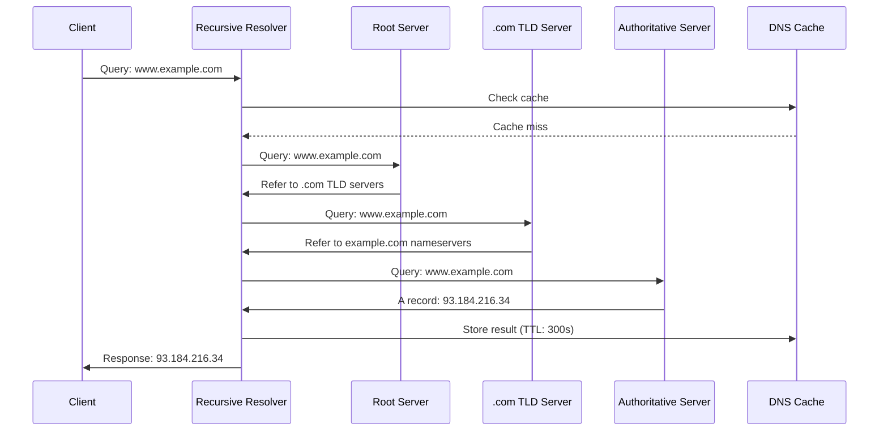
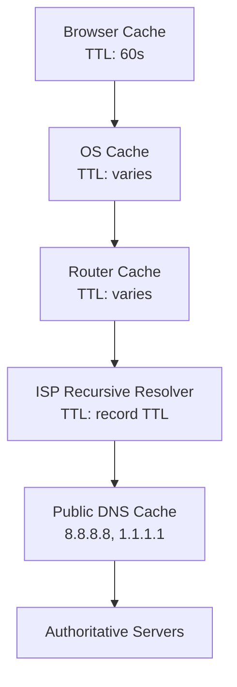

# DNS & Domain Name Resolution

## Introduction

The Domain Name System (DNS) is one of the most critical components of the internet infrastructure. It translates human-readable domain names like `www.example.com` into IP addresses that computers use to communicate. Understanding DNS is essential for system design because it affects performance, reliability, security, and user experience of distributed systems.

DNS is often called the "phonebook of the internet," but it's much more sophisticated than a simple lookup table. It's a distributed, hierarchical system that provides not just name resolution, but also load balancing, service discovery, and geographic routing capabilities.

## How DNS Works

### DNS Resolution Process



### DNS Hierarchy

```
                    Root (.)
                   /    |    \
                .com   .org   .net   .edu   .gov   country codes (.uk, .de, .jp)
               /   |    \
         example google amazon
         /   |    \
       www  mail   ftp
```

### Step-by-Step Resolution Example

1. **User types**: `www.example.com` in browser
2. **Browser checks**: Local DNS cache
3. **OS checks**: System DNS cache
4. **Recursive resolver**: Queries root servers
5. **Root server**: Returns .com TLD servers
6. **TLD server**: Returns example.com authoritative servers
7. **Authoritative server**: Returns IP address
8. **Response cached**: At multiple levels with TTL
9. **Connection established**: Browser connects to IP address

## DNS Record Types

### Common Record Types

#### A Record (Address)
Maps domain name to IPv4 address:
```
www.example.com.    300    IN    A    93.184.216.34
```

#### AAAA Record (IPv6 Address)
Maps domain name to IPv6 address:
```
www.example.com.    300    IN    AAAA    2606:2800:220:1:248:1893:25c8:1946
```

#### CNAME Record (Canonical Name)
Creates an alias for another domain name:
```
blog.example.com.    300    IN    CNAME    www.example.com.
```

#### MX Record (Mail Exchange)
Specifies mail servers for the domain:
```
example.com.    300    IN    MX    10 mail.example.com.
example.com.    300    IN    MX    20 backup-mail.example.com.
```

#### NS Record (Name Server)
Specifies authoritative name servers:
```
example.com.    86400    IN    NS    ns1.example.com.
example.com.    86400    IN    NS    ns2.example.com.
```

#### TXT Record (Text)
Stores arbitrary text data (often used for verification):
```
example.com.    300    IN    TXT    "v=spf1 include:_spf.google.com ~all"
_dmarc.example.com.    300    IN    TXT    "v=DMARC1; p=quarantine; rua=mailto:dmarc@example.com"
```

#### SRV Record (Service)
Specifies services available in the domain:
```
_http._tcp.example.com.    300    IN    SRV    10 5 80 www.example.com.
_https._tcp.example.com.   300    IN    SRV    10 5 443 www.example.com.
```

#### PTR Record (Pointer)
Used for reverse DNS lookups:
```
34.216.184.93.in-addr.arpa.    300    IN    PTR    www.example.com.
```

### Advanced Record Types

#### CAA Record (Certificate Authority Authorization)
Specifies which CAs can issue certificates:
```
example.com.    300    IN    CAA    0 issue "letsencrypt.org"
example.com.    300    IN    CAA    0 iodef "mailto:security@example.com"
```

### DNS Record Management Example

```python
import dns.resolver
import dns.zone
from datetime import datetime, timedelta

class DNSManager:
    def __init__(self, domain):
        self.domain = domain
        self.records = {}
    
    def add_record(self, name, record_type, value, ttl=300):
        """Add DNS record"""
        if name not in self.records:
            self.records[name] = {}
        
        if record_type not in self.records[name]:
            self.records[name][record_type] = []
        
        record = {
            'value': value,
            'ttl': ttl,
            'created': datetime.now(),
            'last_modified': datetime.now()
        }
        
        self.records[name][record_type].append(record)
    
    def get_records(self, name, record_type=None):
        """Get DNS records for a name"""
        if name not in self.records:
            return []
        
        if record_type:
            return self.records[name].get(record_type, [])
        else:
            return self.records[name]
    
    def update_record(self, name, record_type, old_value, new_value):
        """Update existing DNS record"""
        if name in self.records and record_type in self.records[name]:
            for record in self.records[name][record_type]:
                if record['value'] == old_value:
                    record['value'] = new_value
                    record['last_modified'] = datetime.now()
                    return True
        return False
    
    def delete_record(self, name, record_type, value=None):
        """Delete DNS record(s)"""
        if name not in self.records or record_type not in self.records[name]:
            return False
        
        if value:
            # Delete specific record
            self.records[name][record_type] = [
                r for r in self.records[name][record_type] 
                if r['value'] != value
            ]
        else:
            # Delete all records of this type
            del self.records[name][record_type]
        
        return True
    
    def generate_zone_file(self):
        """Generate BIND zone file format"""
        zone_content = [
            f"$ORIGIN {self.domain}.",
            f"$TTL 300",
            f"@    IN    SOA    ns1.{self.domain}. admin.{self.domain}. (",
            f"                2023010101    ; Serial",
            f"                3600         ; Refresh",
            f"                1800         ; Retry", 
            f"                604800       ; Expire",
            f"                300 )        ; Minimum TTL",
            "",
            f"@    IN    NS     ns1.{self.domain}.",
            f"@    IN    NS     ns2.{self.domain}.",
            ""
        ]
        
        for name, record_types in self.records.items():
            for record_type, records in record_types.items():
                for record in records:
                    zone_content.append(
                        f"{name}    {record['ttl']}    IN    {record_type}    {record['value']}"
                    )
        
        return "\n".join(zone_content)
    
    def validate_records(self):
        """Validate DNS records for common issues"""
        issues = []
        
        for name, record_types in self.records.items():
            # Check for CNAME conflicts
            if 'CNAME' in record_types and len(record_types) > 1:
                issues.append({
                    'type': 'cname_conflict',
                    'name': name,
                    'message': 'CNAME record cannot coexist with other record types'
                })
            
            # Check MX record priorities
            if 'MX' in record_types:
                priorities = [int(r['value'].split()[0]) for r in record_types['MX']]
                if len(set(priorities)) != len(priorities):
                    issues.append({
                        'type': 'duplicate_mx_priority',
                        'name': name,
                        'message': 'Duplicate MX record priorities found'
                    })
        
        return issues

# Example usage
dns_manager = DNSManager("example.com")

# Add various record types
dns_manager.add_record("@", "A", "93.184.216.34")
dns_manager.add_record("www", "A", "93.184.216.34")
dns_manager.add_record("mail", "A", "93.184.216.35")
dns_manager.add_record("@", "MX", "10 mail.example.com.")
dns_manager.add_record("@", "MX", "20 backup-mail.example.com.")
dns_manager.add_record("blog", "CNAME", "www.example.com.")
dns_manager.add_record("@", "TXT", "v=spf1 include:_spf.google.com ~all")

# Generate zone file
zone_file = dns_manager.generate_zone_file()
print("Generated Zone File:")
print(zone_file)

# Validate records
issues = dns_manager.validate_records()
if issues:
    print("\nValidation Issues:")
    for issue in issues:
        print(f"- {issue['type']}: {issue['message']}")
```

## DNS Caching and TTL

### Time To Live (TTL) Strategy

TTL determines how long DNS records are cached:

```python
class TTLStrategy:
    def __init__(self):
        self.ttl_recommendations = {
            'A': {
                'static_content': 3600,      # 1 hour
                'dynamic_content': 300,      # 5 minutes
                'load_balanced': 60,         # 1 minute
                'failover': 30               # 30 seconds
            },
            'CNAME': {
                'permanent_alias': 3600,     # 1 hour
                'temporary_alias': 300       # 5 minutes
            },
            'MX': {
                'stable_mail': 86400,        # 24 hours
                'changing_mail': 3600        # 1 hour
            },
            'TXT': {
                'verification': 300,         # 5 minutes
                'policy_records': 3600       # 1 hour
            },
            'NS': {
                'stable_nameservers': 86400, # 24 hours
                'migration_period': 300      # 5 minutes
            }
        }
    
    def recommend_ttl(self, record_type, use_case, change_frequency='low'):
        """Recommend TTL based on record type and use case"""
        base_ttl = self.ttl_recommendations.get(record_type, {}).get(use_case, 300)
        
        # Adjust based on change frequency
        if change_frequency == 'high':
            return min(base_ttl, 300)  # Max 5 minutes for frequently changing records
        elif change_frequency == 'medium':
            return min(base_ttl, 1800)  # Max 30 minutes
        else:
            return base_ttl
    
    def calculate_cache_impact(self, ttl, queries_per_second, cache_hit_ratio=0.8):
        """Calculate caching impact on DNS server load"""
        # Queries that hit cache vs queries that need resolution
        cached_queries = queries_per_second * cache_hit_ratio
        resolution_queries = queries_per_second * (1 - cache_hit_ratio)
        
        # Cache refresh rate (queries per second that refresh cache)
        cache_refresh_rate = 1 / ttl if ttl > 0 else queries_per_second
        
        return {
            'total_qps': queries_per_second,
            'cached_qps': cached_queries,
            'resolution_qps': resolution_queries,
            'cache_refresh_qps': cache_refresh_rate,
            'server_load_reduction': (cached_queries / queries_per_second) * 100
        }

# Example TTL optimization
ttl_strategy = TTLStrategy()

# Get TTL recommendations
web_ttl = ttl_strategy.recommend_ttl('A', 'load_balanced', 'high')
mail_ttl = ttl_strategy.recommend_ttl('MX', 'stable_mail', 'low')

print(f"Recommended TTL for load-balanced web servers: {web_ttl} seconds")
print(f"Recommended TTL for stable mail servers: {mail_ttl} seconds")

# Calculate cache impact
cache_impact = ttl_strategy.calculate_cache_impact(300, 1000, 0.85)
print(f"Cache impact: {cache_impact['server_load_reduction']:.1f}% load reduction")
```

### DNS Cache Hierarchy



## DNS in System Design

### Load Balancing with DNS

#### Round Robin DNS
```python
class DNSLoadBalancer:
    def __init__(self, domain):
        self.domain = domain
        self.servers = []
        self.current_index = 0
        self.health_checks = {}
    
    def add_server(self, ip_address, weight=1, health_check_url=None):
        """Add server to DNS load balancing pool"""
        server = {
            'ip': ip_address,
            'weight': weight,
            'health_check_url': health_check_url,
            'healthy': True,
            'last_check': None
        }
        self.servers.append(server)
    
    def get_dns_records(self):
        """Generate DNS A records for load balancing"""
        healthy_servers = [s for s in self.servers if s['healthy']]
        
        if not healthy_servers:
            # Return all servers if none are healthy (fail open)
            healthy_servers = self.servers
        
        records = []
        for server in healthy_servers:
            # Create multiple records based on weight
            for _ in range(server['weight']):
                records.append({
                    'name': self.domain,
                    'type': 'A',
                    'value': server['ip'],
                    'ttl': 60  # Short TTL for load balancing
                })
        
        return records
    
    def perform_health_checks(self):
        """Check health of all servers"""
        import requests
        from datetime import datetime
        
        for server in self.servers:
            if server['health_check_url']:
                try:
                    response = requests.get(
                        server['health_check_url'],
                        timeout=5
                    )
                    server['healthy'] = response.status_code == 200
                except requests.RequestException:
                    server['healthy'] = False
                
                server['last_check'] = datetime.now()
    
    def get_weighted_server(self):
        """Get server based on weighted round-robin"""
        healthy_servers = [s for s in self.servers if s['healthy']]
        
        if not healthy_servers:
            return None
        
        # Create weighted list
        weighted_servers = []
        for server in healthy_servers:
            weighted_servers.extend([server] * server['weight'])
        
        # Round-robin selection
        if weighted_servers:
            server = weighted_servers[self.current_index % len(weighted_servers)]
            self.current_index += 1
            return server
        
        return None

# Example usage
lb = DNSLoadBalancer("api.example.com")
lb.add_server("10.0.1.10", weight=3, health_check_url="http://10.0.1.10/health")
lb.add_server("10.0.1.11", weight=2, health_check_url="http://10.0.1.11/health")
lb.add_server("10.0.1.12", weight=1, health_check_url="http://10.0.1.12/health")

# Perform health checks
lb.perform_health_checks()

# Generate DNS records
dns_records = lb.get_dns_records()
print(f"Generated {len(dns_records)} DNS records for load balancing")
```

#### Geographic DNS Routing
```python
class GeoDNSRouter:
    def __init__(self, domain):
        self.domain = domain
        self.regions = {}
        self.default_region = None
    
    def add_region(self, region_name, ip_addresses, countries=None, continents=None):
        """Add geographic region with servers"""
        self.regions[region_name] = {
            'ips': ip_addresses,
            'countries': countries or [],
            'continents': continents or [],
            'latency_targets': {}
        }
    
    def set_default_region(self, region_name):
        """Set default region for unmatched locations"""
        self.default_region = region_name
    
    def route_request(self, client_country, client_continent):
        """Route DNS request based on client location"""
        # First, try to match by country
        for region_name, region_config in self.regions.items():
            if client_country in region_config['countries']:
                return region_config['ips']
        
        # Then, try to match by continent
        for region_name, region_config in self.regions.items():
            if client_continent in region_config['continents']:
                return region_config['ips']
        
        # Fall back to default region
        if self.default_region and self.default_region in self.regions:
            return self.regions[self.default_region]['ips']
        
        # Return all IPs if no match
        all_ips = []
        for region_config in self.regions.values():
            all_ips.extend(region_config['ips'])
        return all_ips
    
    def generate_geo_dns_config(self):
        """Generate geographic DNS configuration"""
        config = {
            'domain': self.domain,
            'policies': []
        }
        
        for region_name, region_config in self.regions.items():
            policy = {
                'name': f"{region_name}_policy",
                'countries': region_config['countries'],
                'continents': region_config['continents'],
                'answers': [
                    {'type': 'A', 'value': ip, 'ttl': 300}
                    for ip in region_config['ips']
                ]
            }
            config['policies'].append(policy)
        
        # Default policy
        if self.default_region:
            default_ips = self.regions[self.default_region]['ips']
            config['default_policy'] = {
                'answers': [
                    {'type': 'A', 'value': ip, 'ttl': 300}
                    for ip in default_ips
                ]
            }
        
        return config

# Example geographic DNS setup
geo_dns = GeoDNSRouter("www.example.com")

# Add regions
geo_dns.add_region(
    "us_east",
    ["54.239.28.85", "54.239.26.128"],
    countries=["US", "CA"],
    continents=["NA"]
)

geo_dns.add_region(
    "eu_west", 
    ["52.84.150.20", "52.84.150.21"],
    countries=["GB", "DE", "FR", "IT", "ES"],
    continents=["EU"]
)

geo_dns.add_region(
    "ap_southeast",
    ["13.35.177.25", "13.35.177.26"],
    countries=["JP", "KR", "SG", "AU"],
    continents=["AS", "OC"]
)

geo_dns.set_default_region("us_east")

# Route requests
us_ips = geo_dns.route_request("US", "NA")
eu_ips = geo_dns.route_request("DE", "EU")
print(f"US client routed to: {us_ips}")
print(f"German client routed to: {eu_ips}")
```

### Service Discovery with DNS

#### DNS-Based Service Discovery
```python
class DNSServiceDiscovery:
    def __init__(self, domain):
        self.domain = domain
        self.services = {}
    
    def register_service(self, service_name, protocol, port, targets):
        """Register service with DNS SRV records"""
        service_key = f"_{service_name}._{protocol}"
        
        self.services[service_key] = {
            'service': service_name,
            'protocol': protocol,
            'port': port,
            'targets': targets
        }
    
    def generate_srv_records(self):
        """Generate SRV records for service discovery"""
        records = []
        
        for service_key, service_config in self.services.items():
            for i, target in enumerate(service_config['targets']):
                # Priority: lower numbers have higher priority
                # Weight: higher numbers have higher weight
                priority = 10
                weight = 100 // len(service_config['targets'])  # Equal weight distribution
                
                srv_record = {
                    'name': f"{service_key}.{self.domain}",
                    'type': 'SRV',
                    'value': f"{priority} {weight} {service_config['port']} {target}",
                    'ttl': 300
                }
                records.append(srv_record)
        
        return records
    
    def discover_service(self, service_name, protocol):
        """Discover service endpoints"""
        service_key = f"_{service_name}._{protocol}"
        
        if service_key in self.services:
            service_config = self.services[service_key]
            return {
                'service': service_name,
                'protocol': protocol,
                'port': service_config['port'],
                'endpoints': service_config['targets']
            }
        
        return None
    
    def generate_consul_dns_config(self):
        """Generate Consul DNS configuration"""
        config = {
            'datacenter': 'dc1',
            'domain': self.domain,
            'services': {}
        }
        
        for service_key, service_config in self.services.items():
            service_name = service_config['service']
            
            config['services'][service_name] = {
                'port': service_config['port'],
                'tags': [service_config['protocol']],
                'checks': [
                    {
                        'http': f"http://{{{{.Address}}}}:{service_config['port']}/health",
                        'interval': '10s'
                    }
                ]
            }
        
        return config

# Example service discovery setup
service_discovery = DNSServiceDiscovery("internal.example.com")

# Register services
service_discovery.register_service(
    "api", "tcp", 8080,
    ["api-1.internal.example.com", "api-2.internal.example.com", "api-3.internal.example.com"]
)

service_discovery.register_service(
    "database", "tcp", 5432,
    ["db-primary.internal.example.com", "db-replica.internal.example.com"]
)

service_discovery.register_service(
    "cache", "tcp", 6379,
    ["redis-1.internal.example.com", "redis-2.internal.example.com"]
)

# Generate SRV records
srv_records = service_discovery.generate_srv_records()
print("Generated SRV Records:")
for record in srv_records:
    print(f"{record['name']} {record['ttl']} IN {record['type']} {record['value']}")

# Discover services
api_service = service_discovery.discover_service("api", "tcp")
print(f"\nAPI Service Discovery: {api_service}")
```

## DNS Security

### DNS Security Threats

#### DNS Spoofing/Cache Poisoning
```python
class DNSSecurityMonitor:
    def __init__(self):
        self.suspicious_queries = []
        self.cache_entries = {}
        self.security_policies = {}
    
    def detect_cache_poisoning(self, query_log):
        """Detect potential DNS cache poisoning attempts"""
        suspicious_patterns = []
        
        for entry in query_log:
            # Check for unusual query patterns
            if entry['query_type'] in ['ANY', 'AXFR']:
                suspicious_patterns.append({
                    'type': 'unusual_query_type',
                    'query': entry['query'],
                    'source_ip': entry['source_ip'],
                    'timestamp': entry['timestamp']
                })
            
            # Check for queries to suspicious domains
            if any(bad_domain in entry['query'] for bad_domain in ['bit.ly', 'tinyurl.com']):
                suspicious_patterns.append({
                    'type': 'suspicious_domain',
                    'query': entry['query'],
                    'source_ip': entry['source_ip'],
                    'timestamp': entry['timestamp']
                })
            
            # Check for high query volume from single IP
            source_queries = [e for e in query_log if e['source_ip'] == entry['source_ip']]
            if len(source_queries) > 100:  # Threshold
                suspicious_patterns.append({
                    'type': 'high_query_volume',
                    'source_ip': entry['source_ip'],
                    'query_count': len(source_queries),
                    'timestamp': entry['timestamp']
                })
        
        return suspicious_patterns
    
    def implement_dns_filtering(self, blocklist_domains):
        """Implement DNS-based content filtering"""
        filtering_rules = {}
        
        for domain in blocklist_domains:
            filtering_rules[domain] = {
                'action': 'block',
                'response': 'NXDOMAIN',  # or redirect to warning page
                'reason': 'blocked_by_policy'
            }
        
        return filtering_rules
    
    def generate_dns_firewall_rules(self):
        """Generate DNS firewall rules"""
        rules = [
            {
                'rule_id': 1,
                'action': 'rate_limit',
                'condition': 'queries_per_minute > 60',
                'target': 'source_ip',
                'response': 'drop'
            },
            {
                'rule_id': 2,
                'action': 'block',
                'condition': 'query_type == "ANY"',
                'target': 'query',
                'response': 'refused'
            },
            {
                'rule_id': 3,
                'action': 'monitor',
                'condition': 'query contains suspicious_tld',
                'target': 'query',
                'response': 'log_and_allow'
            }
        ]
        
        return rules

# Example security monitoring
security_monitor = DNSSecurityMonitor()

# Sample query log
query_log = [
    {'query': 'example.com', 'query_type': 'A', 'source_ip': '192.168.1.100', 'timestamp': '2023-01-01T10:00:00Z'},
    {'query': 'malicious.bit.ly', 'query_type': 'A', 'source_ip': '192.168.1.101', 'timestamp': '2023-01-01T10:01:00Z'},
    {'query': 'example.com', 'query_type': 'ANY', 'source_ip': '10.0.0.1', 'timestamp': '2023-01-01T10:02:00Z'}
]

# Detect suspicious activity
suspicious_activity = security_monitor.detect_cache_poisoning(query_log)
print(f"Detected {len(suspicious_activity)} suspicious patterns")

# Generate firewall rules
firewall_rules = security_monitor.generate_dns_firewall_rules()
print(f"Generated {len(firewall_rules)} DNS firewall rules")
```

### DNSSEC (DNS Security Extensions)

```python
class DNSSECManager:
    def __init__(self, domain):
        self.domain = domain
        self.keys = {}
        self.signatures = {}
    
    def generate_key_pair(self, key_type='ZSK'):
        """Generate DNSSEC key pair"""
        import hashlib
        import random
        
        # Simplified key generation (use proper crypto libraries in production)
        key_id = random.randint(1000, 9999)
        
        self.keys[key_id] = {
            'type': key_type,  # ZSK (Zone Signing Key) or KSK (Key Signing Key)
            'algorithm': 'RSASHA256',
            'key_size': 2048,
            'created': datetime.now(),
            'status': 'active'
        }
        
        return key_id
    
    def sign_zone(self, zone_records):
        """Sign DNS zone with DNSSEC"""
        signed_records = []
        
        # Add DNSKEY records
        for key_id, key_info in self.keys.items():
            dnskey_record = {
                'name': self.domain,
                'type': 'DNSKEY',
                'value': f"256 3 8 {key_id}...",  # Simplified
                'ttl': 86400
            }
            signed_records.append(dnskey_record)
        
        # Sign each record with RRSIG
        for record in zone_records:
            signed_records.append(record)
            
            # Create RRSIG record
            rrsig_record = {
                'name': record['name'],
                'type': 'RRSIG',
                'value': f"{record['type']} 8 2 {record['ttl']} 20231201000000 20231101000000 {list(self.keys.keys())[0]} {self.domain} signature...",
                'ttl': record['ttl']
            }
            signed_records.append(rrsig_record)
        
        return signed_records
    
    def validate_signature(self, record, signature):
        """Validate DNSSEC signature"""
        # Simplified validation logic
        # In practice, this would involve cryptographic verification
        return True
    
    def generate_ds_record(self, parent_zone):
        """Generate DS record for parent zone"""
        if not self.keys:
            return None
        
        # Use KSK for DS record
        ksk_keys = [k for k, v in self.keys.items() if v['type'] == 'KSK']
        if not ksk_keys:
            return None
        
        key_id = ksk_keys[0]
        
        ds_record = {
            'name': self.domain,
            'type': 'DS',
            'value': f"{key_id} 8 2 hash_of_dnskey...",
            'ttl': 86400
        }
        
        return ds_record

# Example DNSSEC implementation
dnssec = DNSSECManager("example.com")

# Generate keys
zsk_id = dnssec.generate_key_pair('ZSK')
ksk_id = dnssec.generate_key_pair('KSK')

print(f"Generated ZSK: {zsk_id}, KSK: {ksk_id}")

# Sample zone records
zone_records = [
    {'name': 'example.com', 'type': 'A', 'value': '93.184.216.34', 'ttl': 300},
    {'name': 'www.example.com', 'type': 'A', 'value': '93.184.216.34', 'ttl': 300}
]

# Sign the zone
signed_zone = dnssec.sign_zone(zone_records)
print(f"Signed zone contains {len(signed_zone)} records")
```

## DNS Performance Optimization

### DNS Query Optimization

```python
class DNSPerformanceOptimizer:
    def __init__(self):
        self.query_stats = {}
        self.cache_stats = {}
    
    def analyze_query_patterns(self, query_log):
        """Analyze DNS query patterns for optimization"""
        analysis = {
            'total_queries': len(query_log),
            'unique_domains': set(),
            'query_types': {},
            'top_domains': {},
            'temporal_patterns': {}
        }
        
        for query in query_log:
            # Track unique domains
            analysis['unique_domains'].add(query['domain'])
            
            # Count query types
            query_type = query['type']
            analysis['query_types'][query_type] = analysis['query_types'].get(query_type, 0) + 1
            
            # Count domain frequency
            domain = query['domain']
            analysis['top_domains'][domain] = analysis['top_domains'].get(domain, 0) + 1
            
            # Analyze temporal patterns
            hour = query['timestamp'].split('T')[1].split(':')[0]
            analysis['temporal_patterns'][hour] = analysis['temporal_patterns'].get(hour, 0) + 1
        
        # Convert to lists for sorting
        analysis['unique_domains'] = len(analysis['unique_domains'])
        analysis['top_domains'] = sorted(
            analysis['top_domains'].items(), 
            key=lambda x: x[1], 
            reverse=True
        )[:10]
        
        return analysis
    
    def optimize_ttl_values(self, domain_stats):
        """Optimize TTL values based on query patterns"""
        ttl_recommendations = {}
        
        for domain, query_count in domain_stats:
            if query_count > 1000:  # High traffic
                ttl_recommendations[domain] = {
                    'current_ttl': 300,
                    'recommended_ttl': 60,  # Short TTL for load balancing
                    'reason': 'High traffic domain - enable quick failover'
                }
            elif query_count > 100:  # Medium traffic
                ttl_recommendations[domain] = {
                    'current_ttl': 300,
                    'recommended_ttl': 300,  # Keep current
                    'reason': 'Medium traffic - current TTL is appropriate'
                }
            else:  # Low traffic
                ttl_recommendations[domain] = {
                    'current_ttl': 300,
                    'recommended_ttl': 3600,  # Longer TTL to reduce queries
                    'reason': 'Low traffic - increase TTL to reduce server load'
                }
        
        return ttl_recommendations
    
    def calculate_cache_efficiency(self, cache_stats):
        """Calculate DNS cache efficiency metrics"""
        total_queries = cache_stats.get('total_queries', 0)
        cache_hits = cache_stats.get('cache_hits', 0)
        cache_misses = cache_stats.get('cache_misses', 0)
        
        if total_queries == 0:
            return None
        
        hit_ratio = cache_hits / total_queries
        miss_ratio = cache_misses / total_queries
        
        return {
            'hit_ratio': hit_ratio,
            'miss_ratio': miss_ratio,
            'efficiency_score': hit_ratio * 100,
            'recommendations': self._generate_cache_recommendations(hit_ratio)
        }
    
    def _generate_cache_recommendations(self, hit_ratio):
        """Generate cache optimization recommendations"""
        recommendations = []
        
        if hit_ratio < 0.7:  # Less than 70% hit ratio
            recommendations.extend([
                'Increase cache size to store more records',
                'Optimize TTL values to balance freshness and caching',
                'Implement cache warming for popular domains'
            ])
        
        if hit_ratio < 0.5:  # Less than 50% hit ratio
            recommendations.extend([
                'Review DNS query patterns for optimization opportunities',
                'Consider implementing local DNS caching',
                'Analyze and reduce unnecessary DNS queries'
            ])
        
        return recommendations
    
    def generate_performance_report(self, query_log, cache_stats):
        """Generate comprehensive DNS performance report"""
        query_analysis = self.analyze_query_patterns(query_log)
        cache_efficiency = self.calculate_cache_efficiency(cache_stats)
        ttl_recommendations = self.optimize_ttl_values(query_analysis['top_domains'])
        
        report = {
            'summary': {
                'total_queries': query_analysis['total_queries'],
                'unique_domains': query_analysis['unique_domains'],
                'cache_hit_ratio': cache_efficiency['hit_ratio'] if cache_efficiency else 0,
                'top_query_type': max(query_analysis['query_types'].items(), key=lambda x: x[1])[0]
            },
            'query_analysis': query_analysis,
            'cache_efficiency': cache_efficiency,
            'ttl_recommendations': ttl_recommendations,
            'optimization_priorities': self._prioritize_optimizations(query_analysis, cache_efficiency)
        }
        
        return report
    
    def _prioritize_optimizations(self, query_analysis, cache_efficiency):
        """Prioritize optimization actions"""
        priorities = []
        
        # High priority: Poor cache performance
        if cache_efficiency and cache_efficiency['hit_ratio'] < 0.6:
            priorities.append({
                'priority': 'HIGH',
                'action': 'Improve DNS caching',
                'impact': 'Reduce DNS server load and improve response times'
            })
        
        # Medium priority: TTL optimization
        if query_analysis['total_queries'] > 10000:
            priorities.append({
                'priority': 'MEDIUM',
                'action': 'Optimize TTL values',
                'impact': 'Balance between cache efficiency and data freshness'
            })
        
        # Low priority: Query pattern optimization
        if len(query_analysis['query_types']) > 5:
            priorities.append({
                'priority': 'LOW',
                'action': 'Optimize query patterns',
                'impact': 'Reduce unnecessary DNS queries'
            })
        
        return priorities

# Example performance optimization
optimizer = DNSPerformanceOptimizer()

# Sample query log
query_log = [
    {'domain': 'api.example.com', 'type': 'A', 'timestamp': '2023-01-01T10:00:00Z'},
    {'domain': 'www.example.com', 'type': 'A', 'timestamp': '2023-01-01T10:01:00Z'},
    {'domain': 'api.example.com', 'type': 'A', 'timestamp': '2023-01-01T10:02:00Z'},
    # ... more queries
]

# Sample cache statistics
cache_stats = {
    'total_queries': 10000,
    'cache_hits': 7500,
    'cache_misses': 2500
}

# Generate performance report
performance_report = optimizer.generate_performance_report(query_log, cache_stats)
print(f"DNS Performance Report:")
print(f"Cache Hit Ratio: {performance_report['summary']['cache_hit_ratio']:.2%}")
print(f"Optimization Priorities: {len(performance_report['optimization_priorities'])}")
```

## DNS Monitoring and Troubleshooting

### DNS Monitoring Tools

```python
import subprocess
import time
import json
from datetime import datetime

class DNSMonitor:
    def __init__(self):
        self.monitoring_targets = []
        self.alerts = []
        self.metrics = {}
    
    def add_monitoring_target(self, domain, record_type='A', expected_values=None):
        """Add domain to monitoring"""
        target = {
            'domain': domain,
            'record_type': record_type,
            'expected_values': expected_values or [],
            'last_check': None,
            'status': 'unknown',
            'response_time': None
        }
        self.monitoring_targets.append(target)
    
    def check_dns_resolution(self, domain, record_type='A', nameserver='8.8.8.8'):
        """Check DNS resolution for a domain"""
        try:
            start_time = time.time()
            
            # Use dig command for DNS lookup
            result = subprocess.run([
                'dig', f'@{nameserver}', domain, record_type, '+short'
            ], capture_output=True, text=True, timeout=10)
            
            end_time = time.time()
            response_time = (end_time - start_time) * 1000  # Convert to milliseconds
            
            if result.returncode == 0:
                values = [line.strip() for line in result.stdout.strip().split('\n') if line.strip()]
                return {
                    'success': True,
                    'values': values,
                    'response_time_ms': response_time,
                    'nameserver': nameserver
                }
            else:
                return {
                    'success': False,
                    'error': result.stderr,
                    'response_time_ms': response_time,
                    'nameserver': nameserver
                }
        
        except subprocess.TimeoutExpired:
            return {
                'success': False,
                'error': 'DNS query timeout',
                'response_time_ms': 10000,  # Timeout value
                'nameserver': nameserver
            }
        except Exception as e:
            return {
                'success': False,
                'error': str(e),
                'response_time_ms': None,
                'nameserver': nameserver
            }
    
    def monitor_all_targets(self):
        """Monitor all configured targets"""
        results = []
        
        for target in self.monitoring_targets:
            result = self.check_dns_resolution(
                target['domain'], 
                target['record_type']
            )
            
            # Update target status
            target['last_check'] = datetime.now()
            target['status'] = 'healthy' if result['success'] else 'unhealthy'
            target['response_time'] = result['response_time_ms']
            
            # Check if values match expected
            if result['success'] and target['expected_values']:
                if not any(expected in result['values'] for expected in target['expected_values']):
                    self.generate_alert(
                        target['domain'],
                        'unexpected_dns_values',
                        f"Expected {target['expected_values']}, got {result['values']}"
                    )
            
            # Check response time
            if result['response_time_ms'] and result['response_time_ms'] > 1000:  # 1 second threshold
                self.generate_alert(
                    target['domain'],
                    'slow_dns_response',
                    f"DNS response time: {result['response_time_ms']:.2f}ms"
                )
            
            results.append({
                'domain': target['domain'],
                'record_type': target['record_type'],
                'result': result,
                'status': target['status']
            })
        
        return results
    
    def generate_alert(self, domain, alert_type, message):
        """Generate monitoring alert"""
        alert = {
            'timestamp': datetime.now().isoformat(),
            'domain': domain,
            'type': alert_type,
            'message': message,
            'severity': self._determine_severity(alert_type)
        }
        
        self.alerts.append(alert)
        
        # In production, send to alerting system
        print(f"ALERT [{alert['severity']}]: {alert['message']}")
    
    def _determine_severity(self, alert_type):
        """Determine alert severity"""
        severity_map = {
            'dns_resolution_failed': 'CRITICAL',
            'unexpected_dns_values': 'HIGH',
            'slow_dns_response': 'MEDIUM',
            'dns_timeout': 'HIGH'
        }
        
        return severity_map.get(alert_type, 'LOW')
    
    def generate_health_report(self):
        """Generate DNS health report"""
        healthy_targets = [t for t in self.monitoring_targets if t['status'] == 'healthy']
        unhealthy_targets = [t for t in self.monitoring_targets if t['status'] == 'unhealthy']
        
        avg_response_time = None
        response_times = [t['response_time'] for t in self.monitoring_targets if t['response_time']]
        if response_times:
            avg_response_time = sum(response_times) / len(response_times)
        
        report = {
            'timestamp': datetime.now().isoformat(),
            'total_targets': len(self.monitoring_targets),
            'healthy_targets': len(healthy_targets),
            'unhealthy_targets': len(unhealthy_targets),
            'health_percentage': (len(healthy_targets) / len(self.monitoring_targets)) * 100 if self.monitoring_targets else 0,
            'average_response_time_ms': avg_response_time,
            'recent_alerts': len([a for a in self.alerts if a['timestamp'] > (datetime.now() - timedelta(hours=1)).isoformat()]),
            'unhealthy_domains': [t['domain'] for t in unhealthy_targets]
        }
        
        return report

# Example DNS monitoring setup
monitor = DNSMonitor()

# Add monitoring targets
monitor.add_monitoring_target('www.example.com', 'A', ['93.184.216.34'])
monitor.add_monitoring_target('mail.example.com', 'MX', ['10 mail.example.com.'])
monitor.add_monitoring_target('example.com', 'NS', ['ns1.example.com.', 'ns2.example.com.'])

# Run monitoring
monitoring_results = monitor.monitor_all_targets()
print(f"Monitored {len(monitoring_results)} DNS targets")

# Generate health report
health_report = monitor.generate_health_report()
print(f"DNS Health: {health_report['health_percentage']:.1f}% healthy")
print(f"Average Response Time: {health_report['average_response_time_ms']:.2f}ms")
```

## Best Practices for DNS in System Design

### 1. DNS Architecture Design
```python
def design_dns_architecture(requirements):
    """Design DNS architecture based on requirements"""
    architecture = {
        'authoritative_servers': [],
        'recursive_resolvers': [],
        'caching_strategy': {},
        'security_measures': [],
        'monitoring_setup': {}
    }
    
    # Determine number of authoritative servers
    if requirements['availability_target'] >= 99.9:
        architecture['authoritative_servers'] = [
            'Primary authoritative server',
            'Secondary authoritative server (different provider)',
            'Tertiary authoritative server (different geographic region)'
        ]
    
    # Configure caching strategy
    if requirements['query_volume'] > 100000:  # High volume
        architecture['caching_strategy'] = {
            'cdn_integration': True,
            'anycast_dns': True,
            'edge_caching': True,
            'ttl_optimization': 'aggressive'
        }
    
    # Security measures
    if requirements['security_level'] == 'high':
        architecture['security_measures'] = [
            'DNSSEC implementation',
            'DNS filtering',
            'Rate limiting',
            'DDoS protection',
            'Query logging and analysis'
        ]
    
    return architecture

# Example requirements
requirements = {
    'availability_target': 99.95,
    'query_volume': 500000,
    'security_level': 'high',
    'global_presence': True
}

dns_architecture = design_dns_architecture(requirements)
print("Recommended DNS Architecture:")
for component, details in dns_architecture.items():
    print(f"{component}: {details}")
```

### 2. DNS Failover and Disaster Recovery
```python
class DNSFailoverManager:
    def __init__(self):
        self.primary_servers = []
        self.backup_servers = []
        self.health_checks = {}
        self.failover_policies = {}
    
    def configure_failover(self, service_name, primary_ips, backup_ips, health_check_config):
        """Configure DNS failover for a service"""
        self.failover_policies[service_name] = {
            'primary_ips': primary_ips,
            'backup_ips': backup_ips,
            'health_check': health_check_config,
            'current_state': 'primary',
            'last_check': None
        }
    
    def check_service_health(self, service_name):
        """Check health of service endpoints"""
        if service_name not in self.failover_policies:
            return False
        
        policy = self.failover_policies[service_name]
        health_check = policy['health_check']
        
        # Check primary servers
        primary_healthy = self._check_endpoints_health(
            policy['primary_ips'], 
            health_check
        )
        
        # Determine if failover is needed
        if not primary_healthy and policy['current_state'] == 'primary':
            # Failover to backup
            self._execute_failover(service_name, 'backup')
        elif primary_healthy and policy['current_state'] == 'backup':
            # Failback to primary
            self._execute_failover(service_name, 'primary')
        
        policy['last_check'] = datetime.now()
        return primary_healthy
    
    def _check_endpoints_health(self, endpoints, health_check):
        """Check health of multiple endpoints"""
        healthy_count = 0
        
        for endpoint in endpoints:
            try:
                import requests
                response = requests.get(
                    f"http://{endpoint}:{health_check['port']}{health_check['path']}",
                    timeout=health_check['timeout']
                )
                if response.status_code == 200:
                    healthy_count += 1
            except:
                continue
        
        # Require majority of endpoints to be healthy
        return healthy_count >= (len(endpoints) / 2)
    
    def _execute_failover(self, service_name, target_state):
        """Execute DNS failover"""
        policy = self.failover_policies[service_name]
        
        if target_state == 'backup':
            # Update DNS to point to backup servers
            new_ips = policy['backup_ips']
            ttl = 60  # Short TTL during failover
        else:
            # Failback to primary servers
            new_ips = policy['primary_ips']
            ttl = 300  # Normal TTL
        
        # Generate new DNS records
        dns_records = []
        for ip in new_ips:
            dns_records.append({
                'name': service_name,
                'type': 'A',
                'value': ip,
                'ttl': ttl
            })
        
        policy['current_state'] = target_state
        
        print(f"Executed failover for {service_name} to {target_state} state")
        return dns_records
    
    def generate_failover_report(self):
        """Generate failover status report"""
        report = {
            'services': {},
            'summary': {
                'total_services': len(self.failover_policies),
                'services_on_primary': 0,
                'services_on_backup': 0
            }
        }
        
        for service_name, policy in self.failover_policies.items():
            report['services'][service_name] = {
                'current_state': policy['current_state'],
                'last_check': policy['last_check'].isoformat() if policy['last_check'] else None,
                'primary_ips': policy['primary_ips'],
                'backup_ips': policy['backup_ips']
            }
            
            if policy['current_state'] == 'primary':
                report['summary']['services_on_primary'] += 1
            else:
                report['summary']['services_on_backup'] += 1
        
        return report

# Example failover configuration
failover_manager = DNSFailoverManager()

# Configure failover for web service
failover_manager.configure_failover(
    'www.example.com',
    primary_ips=['10.0.1.10', '10.0.1.11'],
    backup_ips=['10.0.2.10', '10.0.2.11'],
    health_check_config={
        'port': 80,
        'path': '/health',
        'timeout': 5
    }
)

# Check service health (would be run periodically)
health_status = failover_manager.check_service_health('www.example.com')
print(f"Service health status: {'Healthy' if health_status else 'Unhealthy'}")

# Generate failover report
failover_report = failover_manager.generate_failover_report()
print(f"Failover Report: {failover_report['summary']}")
```

## Summary

DNS is a critical component of distributed systems that affects performance, reliability, and user experience:

### Key Takeaways
1. **Hierarchical system**: DNS uses a distributed, hierarchical architecture for scalability
2. **Caching is crucial**: TTL values and caching strategies significantly impact performance
3. **Security matters**: Implement DNSSEC, filtering, and monitoring to protect against attacks
4. **Load balancing**: DNS can provide geographic routing and load distribution
5. **Monitoring required**: Continuous monitoring ensures DNS health and performance

### Practical Applications
- **Global load balancing**: Route users to nearest data centers
- **Service discovery**: Enable microservices to find each other
- **Failover automation**: Automatically route traffic away from failed services
- **Content delivery**: Integrate with CDNs for optimal performance
- **Security enforcement**: Block malicious domains and implement policies

### System Design Implications
- DNS resolution adds latency to every request
- Proper TTL configuration balances performance and flexibility
- Geographic DNS routing improves user experience
- DNS monitoring is essential for system reliability
- Security considerations must be built into DNS architecture

In the next section, we'll explore HTTP/HTTPS protocols, which build on DNS to enable web communication.
