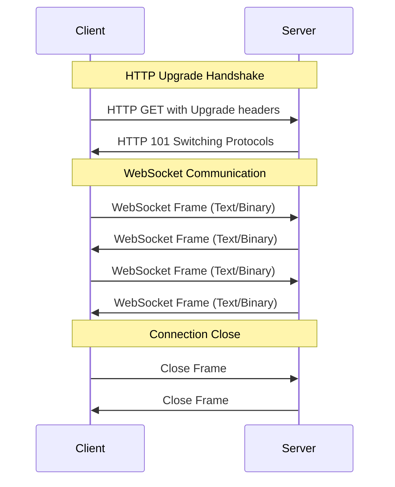

# WebSockets & Real-time Communication

## Introduction

WebSockets provide full-duplex communication channels over a single TCP connection, enabling real-time, bidirectional communication between clients and servers. Unlike traditional HTTP request-response patterns, WebSockets allow both the client and server to send data at any time, making them ideal for applications requiring real-time updates.

Understanding WebSockets is crucial for system design because they enable:
- Real-time chat applications
- Live data feeds (stock prices, sports scores)
- Collaborative editing tools
- Gaming applications
- IoT device communication
- Live notifications and alerts

## WebSocket Protocol Fundamentals

### WebSocket Handshake Process

WebSockets start as HTTP connections and then upgrade to the WebSocket protocol:



### WebSocket Handshake Example

**Client Request:**
```http
GET /chat HTTP/1.1
Host: example.com
Upgrade: websocket
Connection: Upgrade
Sec-WebSocket-Key: dGhlIHNhbXBsZSBub25jZQ==
Sec-WebSocket-Version: 13
Sec-WebSocket-Protocol: chat, superchat
Origin: https://example.com
```

**Server Response:**
```http
HTTP/1.1 101 Switching Protocols
Upgrade: websocket
Connection: Upgrade
Sec-WebSocket-Accept: s3pPLMBiTxaQ9kYGzzhZRbK+xOo=
Sec-WebSocket-Protocol: chat
```

### WebSocket Frame Structure

WebSocket data is transmitted in frames with the following structure:

```
 0                   1                   2                   3
 0 1 2 3 4 5 6 7 8 9 0 1 2 3 4 5 6 7 8 9 0 1 2 3 4 5 6 7 8 9 0 1
+-+-+-+-+-------+-+-------------+-------------------------------+
|F|R|R|R| opcode|M| Payload len |    Extended payload length    |
|I|S|S|S|  (4)  |A|     (7)     |             (16/64)           |
|N|V|V|V|       |S|             |   (if payload len==126/127)   |
| |1|2|3|       |K|             |                               |
+-+-+-+-+-------+-+-------------+ - - - - - - - - - - - - - - - +
|     Extended payload length continued, if payload len == 127  |
+ - - - - - - - - - - - - - - - +-------------------------------+
|                               |Masking-key, if MASK set to 1  |
+-------------------------------+-------------------------------+
| Masking-key (continued)       |          Payload Data         |
+-------------------------------- - - - - - - - - - - - - - - - +
:                     Payload Data continued ...                :
+ - - - - - - - - - - - - - - - - - - - - - - - - - - - - - - - +
|                     Payload Data continued ...                |
+---------------------------------------------------------------+
```

**Frame Types (Opcodes):**
- `0x0`: Continuation frame
- `0x1`: Text frame (UTF-8)
- `0x2`: Binary frame
- `0x8`: Connection close
- `0x9`: Ping frame
- `0xA`: Pong frame

## WebSocket Implementation

### Server-Side WebSocket Implementation

```python
import asyncio
import websockets
import json
import logging
from datetime import datetime
from typing import Set, Dict, Any

class WebSocketServer:
    def __init__(self, host='localhost', port=8765):
        self.host = host
        self.port = port
        self.clients: Set[websockets.WebSocketServerProtocol] = set()
        self.rooms: Dict[str, Set[websockets.WebSocketServerProtocol]] = {}
        self.client_info: Dict[websockets.WebSocketServerProtocol, Dict[str, Any]] = {}
        
        # Configure logging
        logging.basicConfig(level=logging.INFO)
        self.logger = logging.getLogger(__name__)
    
    async def register_client(self, websocket, path):
        """Register new WebSocket client"""
        self.clients.add(websocket)
        self.client_info[websocket] = {
            'connected_at': datetime.now(),
            'remote_address': websocket.remote_address,
            'path': path,
            'rooms': set()
        }
        
        self.logger.info(f"Client connected: {websocket.remote_address}")
        
        try:
            # Send welcome message
            await self.send_message(websocket, {
                'type': 'welcome',
                'message': 'Connected to WebSocket server',
                'client_id': id(websocket)
            })
            
            # Handle client messages
            await self.handle_client_messages(websocket)
        
        except websockets.exceptions.ConnectionClosed:
            self.logger.info(f"Client disconnected: {websocket.remote_address}")
        except Exception as e:
            self.logger.error(f"Error handling client {websocket.remote_address}: {e}")
        finally:
            await self.unregister_client(websocket)
    
    async def unregister_client(self, websocket):
        """Unregister WebSocket client"""
        # Remove from all rooms
        if websocket in self.client_info:
            for room in self.client_info[websocket]['rooms'].copy():
                await self.leave_room(websocket, room)
        
        # Remove from clients set
        self.clients.discard(websocket)
        self.client_info.pop(websocket, None)
    
    async def handle_client_messages(self, websocket):
        """Handle incoming messages from client"""
        async for message in websocket:
            try:
                data = json.loads(message)
                await self.process_message(websocket, data)
            except json.JSONDecodeError:
                await self.send_error(websocket, "Invalid JSON format")
            except Exception as e:
                self.logger.error(f"Error processing message: {e}")
                await self.send_error(websocket, "Internal server error")
    
    async def process_message(self, websocket, data):
        """Process different message types"""
        message_type = data.get('type')
        
        if message_type == 'join_room':
            await self.join_room(websocket, data.get('room'))
        elif message_type == 'leave_room':
            await self.leave_room(websocket, data.get('room'))
        elif message_type == 'chat_message':
            await self.handle_chat_message(websocket, data)
        elif message_type == 'broadcast':
            await self.broadcast_message(data.get('message'), exclude=websocket)
        elif message_type == 'ping':
            await self.send_message(websocket, {'type': 'pong'})
        elif message_type == 'get_stats':
            await self.send_server_stats(websocket)
        else:
            await self.send_error(websocket, f"Unknown message type: {message_type}")
    
    async def join_room(self, websocket, room_name):
        """Add client to a room"""
        if not room_name:
            await self.send_error(websocket, "Room name is required")
            return
        
        if room_name not in self.rooms:
            self.rooms[room_name] = set()
        
        self.rooms[room_name].add(websocket)
        self.client_info[websocket]['rooms'].add(room_name)
        
        await self.send_message(websocket, {
            'type': 'room_joined',
            'room': room_name,
            'members_count': len(self.rooms[room_name])
        })
        
        # Notify other room members
        await self.broadcast_to_room(room_name, {
            'type': 'user_joined',
            'room': room_name,
            'user_id': id(websocket),
            'members_count': len(self.rooms[room_name])
        }, exclude=websocket)
        
        self.logger.info(f"Client {websocket.remote_address} joined room: {room_name}")
    
    async def leave_room(self, websocket, room_name):
        """Remove client from a room"""
        if room_name in self.rooms and websocket in self.rooms[room_name]:
            self.rooms[room_name].remove(websocket)
            self.client_info[websocket]['rooms'].discard(room_name)
            
            # Remove empty rooms
            if not self.rooms[room_name]:
                del self.rooms[room_name]
            else:
                # Notify remaining room members
                await self.broadcast_to_room(room_name, {
                    'type': 'user_left',
                    'room': room_name,
                    'user_id': id(websocket),
                    'members_count': len(self.rooms[room_name])
                })
            
            await self.send_message(websocket, {
                'type': 'room_left',
                'room': room_name
            })
            
            self.logger.info(f"Client {websocket.remote_address} left room: {room_name}")
    
    async def handle_chat_message(self, websocket, data):
        """Handle chat message"""
        room = data.get('room')
        message = data.get('message')
        
        if not room or not message:
            await self.send_error(websocket, "Room and message are required")
            return
        
        if room not in self.rooms or websocket not in self.rooms[room]:
            await self.send_error(websocket, "You are not in this room")
            return
        
        # Broadcast message to room
        chat_data = {
            'type': 'chat_message',
            'room': room,
            'user_id': id(websocket),
            'message': message,
            'timestamp': datetime.now().isoformat()
        }
        
        await self.broadcast_to_room(room, chat_data)
    
    async def broadcast_to_room(self, room_name, message, exclude=None):
        """Broadcast message to all clients in a room"""
        if room_name not in self.rooms:
            return
        
        disconnected_clients = set()
        
        for client in self.rooms[room_name]:
            if client != exclude:
                try:
                    await self.send_message(client, message)
                except websockets.exceptions.ConnectionClosed:
                    disconnected_clients.add(client)
        
        # Clean up disconnected clients
        for client in disconnected_clients:
            await self.unregister_client(client)
    
    async def broadcast_message(self, message, exclude=None):
        """Broadcast message to all connected clients"""
        disconnected_clients = set()
        
        for client in self.clients.copy():
            if client != exclude:
                try:
                    await self.send_message(client, {
                        'type': 'broadcast',
                        'message': message,
                        'timestamp': datetime.now().isoformat()
                    })
                except websockets.exceptions.ConnectionClosed:
                    disconnected_clients.add(client)
        
        # Clean up disconnected clients
        for client in disconnected_clients:
            await self.unregister_client(client)
    
    async def send_message(self, websocket, message):
        """Send message to specific client"""
        try:
            await websocket.send(json.dumps(message))
        except websockets.exceptions.ConnectionClosed:
            # Client disconnected, will be cleaned up elsewhere
            pass
    
    async def send_error(self, websocket, error_message):
        """Send error message to client"""
        await self.send_message(websocket, {
            'type': 'error',
            'message': error_message,
            'timestamp': datetime.now().isoformat()
        })
    
    async def send_server_stats(self, websocket):
        """Send server statistics to client"""
        stats = {
            'type': 'server_stats',
            'total_clients': len(self.clients),
            'total_rooms': len(self.rooms),
            'rooms': {
                room: len(clients) for room, clients in self.rooms.items()
            },
            'uptime': datetime.now().isoformat()
        }
        
        await self.send_message(websocket, stats)
    
    async def heartbeat(self):
        """Send periodic heartbeat to all clients"""
        while True:
            await asyncio.sleep(30)  # Send heartbeat every 30 seconds
            
            disconnected_clients = set()
            
            for client in self.clients.copy():
                try:
                    await self.send_message(client, {
                        'type': 'heartbeat',
                        'timestamp': datetime.now().isoformat()
                    })
                except websockets.exceptions.ConnectionClosed:
                    disconnected_clients.add(client)
            
            # Clean up disconnected clients
            for client in disconnected_clients:
                await self.unregister_client(client)
    
    def start_server(self):
        """Start the WebSocket server"""
        self.logger.info(f"Starting WebSocket server on {self.host}:{self.port}")
        
        # Start heartbeat task
        asyncio.create_task(self.heartbeat())
        
        # Start server
        start_server = websockets.serve(
            self.register_client,
            self.host,
            self.port,
            ping_interval=20,
            ping_timeout=10
        )
        
        return start_server

# Example usage
if __name__ == "__main__":
    server = WebSocketServer()
    
    # Start the server
    start_server = server.start_server()
    
    # Run the event loop
    asyncio.get_event_loop().run_until_complete(start_server)
    asyncio.get_event_loop().run_forever()
```

### Client-Side WebSocket Implementation

```javascript
class WebSocketClient {
    constructor(url, options = {}) {
        this.url = url;
        this.options = {
            reconnectInterval: 5000,
            maxReconnectAttempts: 5,
            heartbeatInterval: 30000,
            ...options
        };
        
        this.ws = null;
        this.reconnectAttempts = 0;
        this.isConnected = false;
        this.messageQueue = [];
        this.eventListeners = {};
        this.heartbeatTimer = null;
        
        this.connect();
    }
    
    connect() {
        try {
            this.ws = new WebSocket(this.url);
            this.setupEventHandlers();
        } catch (error) {
            console.error('WebSocket connection error:', error);
            this.handleReconnect();
        }
    }
    
    setupEventHandlers() {
        this.ws.onopen = (event) => {
            console.log('WebSocket connected');
            this.isConnected = true;
            this.reconnectAttempts = 0;
            
            // Send queued messages
            this.flushMessageQueue();
            
            // Start heartbeat
            this.startHeartbeat();
            
            this.emit('open', event);
        };
        
        this.ws.onmessage = (event) => {
            try {
                const data = JSON.parse(event.data);
                this.handleMessage(data);
            } catch (error) {
                console.error('Error parsing WebSocket message:', error);
            }
        };
        
        this.ws.onclose = (event) => {
            console.log('WebSocket disconnected:', event.code, event.reason);
            this.isConnected = false;
            this.stopHeartbeat();
            
            this.emit('close', event);
            
            // Attempt reconnection if not a clean close
            if (event.code !== 1000) {
                this.handleReconnect();
            }
        };
        
        this.ws.onerror = (error) => {
            console.error('WebSocket error:', error);
            this.emit('error', error);
        };
    }
    
    handleMessage(data) {
        const messageType = data.type;
        
        switch (messageType) {
            case 'welcome':
                console.log('Received welcome message:', data.message);
                break;
            case 'heartbeat':
                // Respond to server heartbeat
                this.send({ type: 'pong' });
                break;
            case 'pong':
                // Server responded to our ping
                break;
            case 'error':
                console.error('Server error:', data.message);
                break;
            default:
                // Emit custom event for application-specific messages
                this.emit(messageType, data);
        }
        
        // Emit general message event
        this.emit('message', data);
    }
    
    send(data) {
        const message = JSON.stringify(data);
        
        if (this.isConnected && this.ws.readyState === WebSocket.OPEN) {
            this.ws.send(message);
        } else {
            // Queue message for later sending
            this.messageQueue.push(message);
        }
    }
    
    flushMessageQueue() {
        while (this.messageQueue.length > 0) {
            const message = this.messageQueue.shift();
            this.ws.send(message);
        }
    }
    
    handleReconnect() {
        if (this.reconnectAttempts < this.options.maxReconnectAttempts) {
            this.reconnectAttempts++;
            console.log(`Attempting to reconnect (${this.reconnectAttempts}/${this.options.maxReconnectAttempts})...`);
            
            setTimeout(() => {
                this.connect();
            }, this.options.reconnectInterval);
        } else {
            console.error('Max reconnection attempts reached');
            this.emit('maxReconnectAttemptsReached');
        }
    }
    
    startHeartbeat() {
        this.heartbeatTimer = setInterval(() => {
            if (this.isConnected) {
                this.send({ type: 'ping' });
            }
        }, this.options.heartbeatInterval);
    }
    
    stopHeartbeat() {
        if (this.heartbeatTimer) {
            clearInterval(this.heartbeatTimer);
            this.heartbeatTimer = null;
        }
    }
    
    // Event system
    on(event, callback) {
        if (!this.eventListeners[event]) {
            this.eventListeners[event] = [];
        }
        this.eventListeners[event].push(callback);
    }
    
    off(event, callback) {
        if (this.eventListeners[event]) {
            this.eventListeners[event] = this.eventListeners[event].filter(cb => cb !== callback);
        }
    }
    
    emit(event, data) {
        if (this.eventListeners[event]) {
            this.eventListeners[event].forEach(callback => {
                try {
                    callback(data);
                } catch (error) {
                    console.error('Error in event callback:', error);
                }
            });
        }
    }
    
    // Utility methods
    joinRoom(roomName) {
        this.send({
            type: 'join_room',
            room: roomName
        });
    }
    
    leaveRoom(roomName) {
        this.send({
            type: 'leave_room',
            room: roomName
        });
    }
    
    sendChatMessage(room, message) {
        this.send({
            type: 'chat_message',
            room: room,
            message: message
        });
    }
    
    getServerStats() {
        this.send({
            type: 'get_stats'
        });
    }
    
    close() {
        this.stopHeartbeat();
        if (this.ws) {
            this.ws.close(1000, 'Client closing connection');
        }
    }
}

// Example usage
const client = new WebSocketClient('ws://localhost:8765');

// Set up event listeners
client.on('open', () => {
    console.log('Connected to server');
    client.joinRoom('general');
});

client.on('room_joined', (data) => {
    console.log(`Joined room: ${data.room} (${data.members_count} members)`);
});

client.on('chat_message', (data) => {
    console.log(`[${data.room}] User ${data.user_id}: ${data.message}`);
});

client.on('user_joined', (data) => {
    console.log(`User ${data.user_id} joined room ${data.room}`);
});

client.on('error', (error) => {
    console.error('WebSocket error:', error);
});

// Send a chat message after 2 seconds
setTimeout(() => {
    client.sendChatMessage('general', 'Hello, everyone!');
}, 2000);
```

## WebSocket Use Cases and Patterns

### Real-Time Chat Application

```python
class ChatApplication:
    def __init__(self):
        self.rooms = {}
        self.users = {}
        self.message_history = {}
    
    async def handle_user_join(self, websocket, user_data):
        """Handle user joining the chat"""
        user_id = user_data.get('user_id')
        username = user_data.get('username')
        room = user_data.get('room', 'general')
        
        # Store user information
        self.users[websocket] = {
            'user_id': user_id,
            'username': username,
            'room': room,
            'joined_at': datetime.now()
        }
        
        # Add to room
        if room not in self.rooms:
            self.rooms[room] = set()
            self.message_history[room] = []
        
        self.rooms[room].add(websocket)
        
        # Send recent message history
        await self.send_message_history(websocket, room)
        
        # Notify room members
        await self.broadcast_to_room(room, {
            'type': 'user_joined',
            'user_id': user_id,
            'username': username,
            'timestamp': datetime.now().isoformat()
        }, exclude=websocket)
    
    async def handle_chat_message(self, websocket, message_data):
        """Handle incoming chat message"""
        user = self.users.get(websocket)
        if not user:
            return
        
        message = {
            'type': 'chat_message',
            'user_id': user['user_id'],
            'username': user['username'],
            'message': message_data.get('message'),
            'timestamp': datetime.now().isoformat(),
            'room': user['room']
        }
        
        # Store message in history
        room = user['room']
        self.message_history[room].append(message)
        
        # Keep only last 100 messages
        if len(self.message_history[room]) > 100:
            self.message_history[room] = self.message_history[room][-100:]
        
        # Broadcast to room
        await self.broadcast_to_room(room, message)
    
    async def send_message_history(self, websocket, room):
        """Send recent message history to user"""
        if room in self.message_history:
            await self.send_message(websocket, {
                'type': 'message_history',
                'messages': self.message_history[room][-20:]  # Last 20 messages
            })
    
    async def handle_typing_indicator(self, websocket, typing_data):
        """Handle typing indicator"""
        user = self.users.get(websocket)
        if not user:
            return
        
        typing_message = {
            'type': 'typing_indicator',
            'user_id': user['user_id'],
            'username': user['username'],
            'is_typing': typing_data.get('is_typing', False),
            'room': user['room']
        }
        
        await self.broadcast_to_room(user['room'], typing_message, exclude=websocket)
```

### Live Data Feed

```python
import asyncio
import random
import json

class LiveDataFeed:
    def __init__(self):
        self.subscribers = {}
        self.data_sources = {}
        self.is_running = False
    
    def add_data_source(self, source_name, generator_func, interval=1.0):
        """Add a data source with update interval"""
        self.data_sources[source_name] = {
            'generator': generator_func,
            'interval': interval,
            'subscribers': set()
        }
    
    async def subscribe_to_feed(self, websocket, feed_name):
        """Subscribe client to data feed"""
        if feed_name not in self.data_sources:
            await self.send_error(websocket, f"Unknown feed: {feed_name}")
            return
        
        if websocket not in self.subscribers:
            self.subscribers[websocket] = set()
        
        self.subscribers[websocket].add(feed_name)
        self.data_sources[feed_name]['subscribers'].add(websocket)
        
        await self.send_message(websocket, {
            'type': 'subscription_confirmed',
            'feed': feed_name
        })
    
    async def unsubscribe_from_feed(self, websocket, feed_name):
        """Unsubscribe client from data feed"""
        if websocket in self.subscribers:
            self.subscribers[websocket].discard(feed_name)
        
        if feed_name in self.data_sources:
            self.data_sources[feed_name]['subscribers'].discard(websocket)
    
    async def start_data_feeds(self):
        """Start all data feed generators"""
        self.is_running = True
        
        # Start a task for each data source
        tasks = []
        for source_name, source_config in self.data_sources.items():
            task = asyncio.create_task(
                self.run_data_generator(source_name, source_config)
            )
            tasks.append(task)
        
        await asyncio.gather(*tasks)
    
    async def run_data_generator(self, source_name, source_config):
        """Run data generator for a specific source"""
        while self.is_running:
            try:
                # Generate new data
                data = source_config['generator']()
                
                # Send to all subscribers
                message = {
                    'type': 'data_update',
                    'source': source_name,
                    'data': data,
                    'timestamp': datetime.now().isoformat()
                }
                
                disconnected_clients = set()
                
                for client in source_config['subscribers'].copy():
                    try:
                        await self.send_message(client, message)
                    except:
                        disconnected_clients.add(client)
                
                # Clean up disconnected clients
                for client in disconnected_clients:
                    source_config['subscribers'].discard(client)
                
                await asyncio.sleep(source_config['interval'])
            
            except Exception as e:
                print(f"Error in data generator {source_name}: {e}")
                await asyncio.sleep(1)
    
    def stop_data_feeds(self):
        """Stop all data feeds"""
        self.is_running = False

# Example data generators
def stock_price_generator():
    """Generate fake stock price data"""
    return {
        'symbol': 'AAPL',
        'price': round(150 + random.uniform(-5, 5), 2),
        'change': round(random.uniform(-2, 2), 2),
        'volume': random.randint(1000000, 5000000)
    }

def weather_data_generator():
    """Generate fake weather data"""
    return {
        'temperature': round(20 + random.uniform(-10, 15), 1),
        'humidity': random.randint(30, 90),
        'pressure': round(1013 + random.uniform(-20, 20), 1),
        'wind_speed': round(random.uniform(0, 30), 1)
    }

# Usage example
data_feed = LiveDataFeed()
data_feed.add_data_source('stocks', stock_price_generator, interval=1.0)
data_feed.add_data_source('weather', weather_data_generator, interval=5.0)
```

### Collaborative Editing

```python
class CollaborativeEditor:
    def __init__(self):
        self.documents = {}
        self.document_subscribers = {}
        self.operation_history = {}
    
    async def join_document(self, websocket, doc_id, user_info):
        """User joins a document for collaborative editing"""
        if doc_id not in self.documents:
            self.documents[doc_id] = {
                'content': '',
                'version': 0,
                'users': {}
            }
            self.document_subscribers[doc_id] = set()
            self.operation_history[doc_id] = []
        
        # Add user to document
        user_id = user_info.get('user_id')
        self.documents[doc_id]['users'][user_id] = {
            'websocket': websocket,
            'username': user_info.get('username'),
            'cursor_position': 0,
            'selection': None
        }
        
        self.document_subscribers[doc_id].add(websocket)
        
        # Send current document state
        await self.send_message(websocket, {
            'type': 'document_state',
            'doc_id': doc_id,
            'content': self.documents[doc_id]['content'],
            'version': self.documents[doc_id]['version'],
            'users': {
                uid: {
                    'username': user['username'],
                    'cursor_position': user['cursor_position']
                }
                for uid, user in self.documents[doc_id]['users'].items()
            }
        })
        
        # Notify other users
        await self.broadcast_to_document(doc_id, {
            'type': 'user_joined',
            'user_id': user_id,
            'username': user_info.get('username')
        }, exclude=websocket)
    
    async def handle_text_operation(self, websocket, operation_data):
        """Handle text editing operation"""
        doc_id = operation_data.get('doc_id')
        operation = operation_data.get('operation')
        
        if doc_id not in self.documents:
            return
        
        document = self.documents[doc_id]
        
        # Apply operation to document
        if operation['type'] == 'insert':
            position = operation['position']
            text = operation['text']
            
            # Insert text at position
            content = document['content']
            new_content = content[:position] + text + content[position:]
            document['content'] = new_content
            
        elif operation['type'] == 'delete':
            start = operation['start']
            end = operation['end']
            
            # Delete text from start to end
            content = document['content']
            new_content = content[:start] + content[end:]
            document['content'] = new_content
        
        # Increment version
        document['version'] += 1
        
        # Store operation in history
        operation_record = {
            'operation': operation,
            'version': document['version'],
            'timestamp': datetime.now().isoformat(),
            'user_id': operation_data.get('user_id')
        }
        self.operation_history[doc_id].append(operation_record)
        
        # Broadcast operation to other users
        await self.broadcast_to_document(doc_id, {
            'type': 'text_operation',
            'doc_id': doc_id,
            'operation': operation,
            'version': document['version'],
            'user_id': operation_data.get('user_id')
        }, exclude=websocket)
    
    async def handle_cursor_update(self, websocket, cursor_data):
        """Handle cursor position update"""
        doc_id = cursor_data.get('doc_id')
        user_id = cursor_data.get('user_id')
        position = cursor_data.get('position')
        
        if doc_id in self.documents and user_id in self.documents[doc_id]['users']:
            self.documents[doc_id]['users'][user_id]['cursor_position'] = position
            
            # Broadcast cursor update
            await self.broadcast_to_document(doc_id, {
                'type': 'cursor_update',
                'user_id': user_id,
                'position': position
            }, exclude=websocket)
    
    async def broadcast_to_document(self, doc_id, message, exclude=None):
        """Broadcast message to all users in a document"""
        if doc_id not in self.document_subscribers:
            return
        
        disconnected_clients = set()
        
        for client in self.document_subscribers[doc_id]:
            if client != exclude:
                try:
                    await self.send_message(client, message)
                except:
                    disconnected_clients.add(client)
        
        # Clean up disconnected clients
        for client in disconnected_clients:
            await self.remove_user_from_document(client, doc_id)
    
    async def remove_user_from_document(self, websocket, doc_id):
        """Remove user from document"""
        if doc_id in self.documents:
            # Find and remove user
            user_to_remove = None
            for user_id, user_info in self.documents[doc_id]['users'].items():
                if user_info['websocket'] == websocket:
                    user_to_remove = user_id
                    break
            
            if user_to_remove:
                del self.documents[doc_id]['users'][user_to_remove]
                
                # Notify other users
                await self.broadcast_to_document(doc_id, {
                    'type': 'user_left',
                    'user_id': user_to_remove
                })
        
        if doc_id in self.document_subscribers:
            self.document_subscribers[doc_id].discard(websocket)
```

## WebSocket Performance and Scaling

### Connection Management and Load Balancing

```python
class WebSocketLoadBalancer:
    def __init__(self):
        self.servers = []
        self.connection_counts = {}
        self.health_status = {}
    
    def add_server(self, server_url, max_connections=1000):
        """Add WebSocket server to load balancer"""
        self.servers.append({
            'url': server_url,
            'max_connections': max_connections,
            'current_connections': 0
        })
        self.connection_counts[server_url] = 0
        self.health_status[server_url] = True
    
    def get_best_server(self):
        """Get server with lowest load"""
        available_servers = [
            server for server in self.servers
            if (self.health_status[server['url']] and 
                server['current_connections'] < server['max_connections'])
        ]
        
        if not available_servers:
            return None
        
        # Return server with lowest connection count
        return min(available_servers, key=lambda s: s['current_connections'])
    
    async def check_server_health(self):
        """Check health of all servers"""
        for server in self.servers:
            try:
                # Implement health check logic
                # This could be a simple WebSocket connection test
                self.health_status[server['url']] = True
            except:
                self.health_status[server['url']] = False
    
    def update_connection_count(self, server_url, delta):
        """Update connection count for server"""
        for server in self.servers:
            if server['url'] == server_url:
                server['current_connections'] += delta
                break
        
        self.connection_counts[server_url] += delta

class WebSocketConnectionPool:
    def __init__(self, max_connections_per_server=1000):
        self.max_connections_per_server = max_connections_per_server
        self.connections = {}
        self.connection_metadata = {}
    
    async def add_connection(self, websocket, server_id):
        """Add connection to pool"""
        if server_id not in self.connections:
            self.connections[server_id] = set()
        
        if len(self.connections[server_id]) >= self.max_connections_per_server:
            raise Exception("Server connection limit reached")
        
        self.connections[server_id].add(websocket)
        self.connection_metadata[websocket] = {
            'server_id': server_id,
            'connected_at': datetime.now(),
            'last_activity': datetime.now()
        }
    
    async def remove_connection(self, websocket):
        """Remove connection from pool"""
        if websocket in self.connection_metadata:
            server_id = self.connection_metadata[websocket]['server_id']
            self.connections[server_id].discard(websocket)
            del self.connection_metadata[websocket]
    
    def get_connection_stats(self):
        """Get connection statistics"""
        stats = {
            'total_connections': sum(len(conns) for conns in self.connections.values()),
            'servers': {}
        }
        
        for server_id, connections in self.connections.items():
            stats['servers'][server_id] = {
                'connection_count': len(connections),
                'utilization': len(connections) / self.max_connections_per_server
            }
        
        return stats
    
    async def cleanup_idle_connections(self, idle_timeout=300):
        """Clean up idle connections"""
        current_time = datetime.now()
        idle_connections = []
        
        for websocket, metadata in self.connection_metadata.items():
            if (current_time - metadata['last_activity']).seconds > idle_timeout:
                idle_connections.append(websocket)
        
        for websocket in idle_connections:
            try:
                await websocket.close(code=1000, reason="Idle timeout")
            except:
                pass
            await self.remove_connection(websocket)
```

### WebSocket Security

```python
import jwt
import hashlib
import hmac
from datetime import datetime, timedelta

class WebSocketSecurity:
    def __init__(self, secret_key):
        self.secret_key = secret_key
        self.rate_limits = {}
        self.blocked_ips = set()
    
    def generate_auth_token(self, user_id, expires_in=3600):
        """Generate JWT token for WebSocket authentication"""
        payload = {
            'user_id': user_id,
            'exp': datetime.utcnow() + timedelta(seconds=expires_in),
            'iat': datetime.utcnow()
        }
        
        return jwt.encode(payload, self.secret_key, algorithm='HS256')
    
    def verify_auth_token(self, token):
        """Verify JWT token"""
        try:
            payload = jwt.decode(token, self.secret_key, algorithms=['HS256'])
            return payload
        except jwt.ExpiredSignatureError:
            raise Exception("Token has expired")
        except jwt.InvalidTokenError:
            raise Exception("Invalid token")
    
    def check_rate_limit(self, client_ip, max_requests=100, window_seconds=60):
        """Check rate limiting for client IP"""
        current_time = datetime.now()
        
        if client_ip in self.blocked_ips:
            return False
        
        if client_ip not in self.rate_limits:
            self.rate_limits[client_ip] = []
        
        # Remove old requests outside the window
        self.rate_limits[client_ip] = [
            timestamp for timestamp in self.rate_limits[client_ip]
            if (current_time - timestamp).seconds < window_seconds
        ]
        
        # Check if limit exceeded
        if len(self.rate_limits[client_ip]) >= max_requests:
            self.blocked_ips.add(client_ip)
            return False
        
        # Add current request
        self.rate_limits[client_ip].append(current_time)
        return True
    
    def validate_message(self, message, max_size=1024*1024):  # 1MB default
        """Validate incoming WebSocket message"""
        # Check message size
        if len(message) > max_size:
            raise Exception("Message too large")
        
        # Check for malicious content
        if self._contains_malicious_content(message):
            raise Exception("Malicious content detected")
        
        return True
    
    def _contains_malicious_content(self, message):
        """Check for potentially malicious content"""
        malicious_patterns = [
            '<script',
            'javascript:',
            'eval(',
            'document.cookie',
            'window.location'
        ]
        
        message_lower = message.lower()
        return any(pattern in message_lower for pattern in malicious_patterns)
    
    def generate_message_signature(self, message, user_id):
        """Generate HMAC signature for message integrity"""
        message_data = f"{user_id}:{message}:{datetime.now().isoformat()}"
        signature = hmac.new(
            self.secret_key.encode('utf-8'),
            message_data.encode('utf-8'),
            hashlib.sha256
        ).hexdigest()
        
        return signature
    
    def verify_message_signature(self, message, user_id, signature, timestamp, max_age=300):
        """Verify message signature and timestamp"""
        # Check message age
        message_time = datetime.fromisoformat(timestamp)
        if (datetime.now() - message_time).seconds > max_age:
            return False
        
        # Verify signature
        expected_signature = self.generate_message_signature(message, user_id)
        return hmac.compare_digest(signature, expected_signature)

# Example secure WebSocket server
class SecureWebSocketServer(WebSocketServer):
    def __init__(self, host='localhost', port=8765, secret_key='your-secret-key'):
        super().__init__(host, port)
        self.security = WebSocketSecurity(secret_key)
    
    async def authenticate_client(self, websocket, path):
        """Authenticate client before allowing connection"""
        # Extract token from query parameters or headers
        query_params = parse_qs(urlparse(path).query)
        token = query_params.get('token', [None])[0]
        
        if not token:
            await websocket.close(code=1008, reason="Authentication required")
            return None
        
        try:
            payload = self.security.verify_auth_token(token)
            return payload['user_id']
        except Exception as e:
            await websocket.close(code=1008, reason=str(e))
            return None
    
    async def register_client(self, websocket, path):
        """Register client with authentication"""
        # Check rate limiting
        client_ip = websocket.remote_address[0]
        if not self.security.check_rate_limit(client_ip):
            await websocket.close(code=1008, reason="Rate limit exceeded")
            return
        
        # Authenticate client
        user_id = await self.authenticate_client(websocket, path)
        if not user_id:
            return
        
        # Store user ID with client info
        self.clients.add(websocket)
        self.client_info[websocket] = {
            'user_id': user_id,
            'connected_at': datetime.now(),
            'remote_address': websocket.remote_address,
            'path': path,
            'rooms': set()
        }
        
        try:
            await self.handle_client_messages(websocket)
        except websockets.exceptions.ConnectionClosed:
            pass
        finally:
            await self.unregister_client(websocket)
    
    async def process_message(self, websocket, data):
        """Process message with security validation"""
        try:
            # Validate message
            message_str = json.dumps(data)
            self.security.validate_message(message_str)
            
            # Process message normally
            await super().process_message(websocket, data)
            
        except Exception as e:
            await self.send_error(websocket, f"Security validation failed: {str(e)}")
```

## Best Practices for WebSocket Implementation

### 1. Connection Management
```python
class WebSocketBestPractices:
    def __init__(self):
        self.best_practices = {
            'connection_management': [
                'Implement connection pooling for scalability',
                'Use heartbeat/ping-pong to detect dead connections',
                'Set appropriate timeouts for connection establishment',
                'Implement graceful connection closure',
                'Handle reconnection logic on client side'
            ],
            'message_handling': [
                'Validate all incoming messages',
                'Implement message queuing for offline clients',
                'Use binary frames for non-text data',
                'Compress large messages when possible',
                'Implement message acknowledgments for critical data'
            ],
            'security': [
                'Always use WSS (WebSocket Secure) in production',
                'Implement proper authentication and authorization',
                'Validate message content and size limits',
                'Use rate limiting to prevent abuse',
                'Implement CSRF protection for WebSocket handshake'
            ],
            'performance': [
                'Use connection pooling and load balancing',
                'Implement efficient message routing',
                'Monitor connection counts and resource usage',
                'Use appropriate buffer sizes',
                'Implement backpressure handling'
            ],
            'error_handling': [
                'Implement comprehensive error handling',
                'Log connection events and errors',
                'Provide meaningful error messages to clients',
                'Implement circuit breaker pattern for external dependencies',
                'Handle partial message delivery'
            ]
        }
    
    def get_recommendations(self, category=None):
        """Get best practice recommendations"""
        if category:
            return self.best_practices.get(category, [])
        return self.best_practices
```

### 2. Monitoring and Metrics
```python
class WebSocketMetrics:
    def __init__(self):
        self.metrics = {
            'connections': {
                'total': 0,
                'active': 0,
                'peak': 0
            },
            'messages': {
                'sent': 0,
                'received': 0,
                'errors': 0
            },
            'performance': {
                'avg_response_time': 0,
                'message_throughput': 0
            }
        }
        self.start_time = datetime.now()
    
    def record_connection(self, event_type):
        """Record connection event"""
        if event_type == 'connect':
            self.metrics['connections']['total'] += 1
            self.metrics['connections']['active'] += 1
            
            if self.metrics['connections']['active'] > self.metrics['connections']['peak']:
                self.metrics['connections']['peak'] = self.metrics['connections']['active']
        
        elif event_type == 'disconnect':
            self.metrics['connections']['active'] -= 1
    
    def record_message(self, direction, success=True):
        """Record message event"""
        if direction == 'sent':
            self.metrics['messages']['sent'] += 1
        elif direction == 'received':
            self.metrics['messages']['received'] += 1
        
        if not success:
            self.metrics['messages']['errors'] += 1
    
    def get_metrics_summary(self):
        """Get metrics summary"""
        uptime = datetime.now() - self.start_time
        
        return {
            'uptime_seconds': uptime.total_seconds(),
            'connections': self.metrics['connections'],
            'messages': self.metrics['messages'],
            'error_rate': self.metrics['messages']['errors'] / max(1, self.metrics['messages']['received']),
            'messages_per_second': self.metrics['messages']['received'] / max(1, uptime.total_seconds())
        }
```

## Summary

WebSockets enable real-time, bidirectional communication essential for modern interactive applications:

### Key Takeaways
1. **Full-duplex communication**: Both client and server can send data at any time
2. **Low latency**: Eliminates HTTP request-response overhead for real-time updates
3. **Connection management**: Proper handling of connections, reconnections, and cleanup is crucial
4. **Security considerations**: Authentication, rate limiting, and message validation are essential
5. **Scalability challenges**: Connection pooling and load balancing required for high-scale applications

### Practical Applications
- **Real-time chat**: Instant messaging and group communication
- **Live data feeds**: Stock prices, sports scores, IoT sensor data
- **Collaborative tools**: Real-time document editing, shared whiteboards
- **Gaming**: Multiplayer games requiring low-latency communication
- **Notifications**: Push notifications and real-time alerts

### System Design Implications
- WebSockets maintain persistent connections, affecting server resource usage
- Proper error handling and reconnection logic ensure reliable communication
- Security measures must be implemented at both protocol and application levels
- Monitoring and metrics help optimize performance and detect issues
- Load balancing strategies differ from traditional HTTP load balancing

In the next section, we'll explore network troubleshooting tools and techniques that help diagnose and resolve networking issues in distributed systems.
