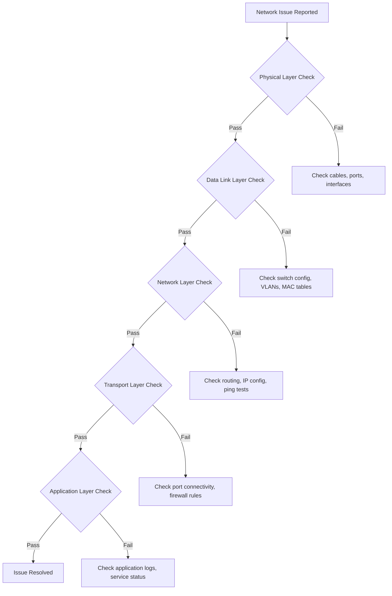

# Network Troubleshooting & Tools

## Introduction

Network troubleshooting is a critical skill for system designers and engineers working with distributed systems. When networks fail or perform poorly, applications become unreachable, data doesn't sync, and users experience frustration. Understanding how to systematically diagnose and resolve network issues is essential for maintaining reliable systems.

This section covers the tools, techniques, and methodologies used to identify, diagnose, and resolve network problems. You'll learn both command-line tools and programmatic approaches to network troubleshooting that are essential for modern system operations.

## Systematic Troubleshooting Methodology

### The OSI Layer Approach

Use the OSI model as a systematic framework for troubleshooting:



### Bottom-Up vs Top-Down Approach

#### Bottom-Up Troubleshooting
Start from Physical Layer (Layer 1) and work up:
1. **Physical**: Check cables, interfaces, link lights
2. **Data Link**: Verify switch connectivity, VLAN configuration
3. **Network**: Test IP connectivity, routing
4. **Transport**: Check port accessibility
5. **Application**: Verify service functionality

#### Top-Down Troubleshooting
Start from Application Layer (Layer 7) and work down:
1. **Application**: Can users access the service?
2. **Transport**: Are the required ports open?
3. **Network**: Can we reach the server IP?
4. **Data Link**: Is the local network working?
5. **Physical**: Are network interfaces up?

### Troubleshooting Framework Implementation

```python
import subprocess
import socket
import time
import json
import requests
from datetime import datetime
from typing import Dict, List, Optional, Tuple

class NetworkTroubleshooter:
    def __init__(self):
        self.test_results = {}
        self.recommendations = []
    
    def diagnose_connectivity_issue(self, target_host: str, target_port: Optional[int] = None) -> Dict:
        """Comprehensive network connectivity diagnosis"""
        print(f"Diagnosing connectivity to {target_host}:{target_port or 'N/A'}")
        
        results = {
            'target': target_host,
            'port': target_port,
            'timestamp': datetime.now().isoformat(),
            'tests': {},
            'summary': {},
            'recommendations': []
        }
        
        # Layer 1-2: Basic connectivity
        results['tests']['ping'] = self._test_ping(target_host)
        
        # Layer 3: Network layer
        results['tests']['traceroute'] = self._test_traceroute(target_host)
        results['tests']['dns_resolution'] = self._test_dns_resolution(target_host)
        
        # Layer 4: Transport layer
        if target_port:
            results['tests']['port_connectivity'] = self._test_port_connectivity(target_host, target_port)
        
        # Layer 7: Application layer
        if target_port in [80, 443, 8080, 8443]:
            results['tests']['http_connectivity'] = self._test_http_connectivity(target_host, target_port)
        
        # Generate summary and recommendations
        results['summary'] = self._generate_summary(results['tests'])
        results['recommendations'] = self._generate_recommendations(results['tests'])
        
        return results
    
    def _test_ping(self, host: str) -> Dict:
        """Test ICMP connectivity"""
        try:
            result = subprocess.run(
                ['ping', '-c', '4', '-W', '3', host],
                capture_output=True,
                text=True,
                timeout=15
            )
            
            success = result.returncode == 0
            
            # Parse ping statistics
            output_lines = result.stdout.split('\n')
            stats = {}
            
            for line in output_lines:
                if 'packets transmitted' in line:
                    # Extract packet loss
                    parts = line.split(',')
                    for part in parts:
                        if '% packet loss' in part:
                            stats['packet_loss'] = part.strip()
                
                if 'min/avg/max' in line:
                    # Extract timing statistics
                    timing_part = line.split('=')[1].strip()
                    min_time, avg_time, max_time, _ = timing_part.split('/')
                    stats['min_time'] = float(min_time)
                    stats['avg_time'] = float(avg_time)
                    stats['max_time'] = float(max_time)
            
            return {
                'success': success,
                'output': result.stdout if success else result.stderr,
                'statistics': stats,
                'test_type': 'ICMP Ping'
            }
        
        except subprocess.TimeoutExpired:
            return {
                'success': False,
                'error': 'Ping timeout',
                'test_type': 'ICMP Ping'
            }
        except Exception as e:
            return {
                'success': False,
                'error': str(e),
                'test_type': 'ICMP Ping'
            }
    
    def _test_traceroute(self, host: str) -> Dict:
        """Test network path to destination"""
        try:
            result = subprocess.run(
                ['traceroute', '-n', '-w', '3', '-m', '15', host],
                capture_output=True,
                text=True,
                timeout=30
            )
            
            # Parse traceroute output
            hops = []
            lines = result.stdout.split('\n')
            
            for line in lines[1:]:  # Skip header
                if line.strip() and not line.startswith('traceroute'):
                    parts = line.split()
                    if len(parts) >= 2:
                        hop_num = parts[0]
                        if hop_num.isdigit():
                            hop_info = {
                                'hop': int(hop_num),
                                'ip': parts[1] if len(parts) > 1 else 'unknown',
                                'times': []
                            }
                            
                            # Extract timing information
                            for part in parts[2:]:
                                if part.replace('.', '').isdigit():
                                    hop_info['times'].append(float(part))
                            
                            hops.append(hop_info)
            
            return {
                'success': result.returncode == 0,
                'hops': hops,
                'total_hops': len(hops),
                'output': result.stdout,
                'test_type': 'Traceroute'
            }
        
        except subprocess.TimeoutExpired:
            return {
                'success': False,
                'error': 'Traceroute timeout',
                'test_type': 'Traceroute'
            }
        except Exception as e:
            return {
                'success': False,
                'error': str(e),
                'test_type': 'Traceroute'
            }
    
    def _test_dns_resolution(self, host: str) -> Dict:
        """Test DNS resolution"""
        try:
            start_time = time.time()
            
            # Try to resolve hostname
            ip_address = socket.gethostbyname(host)
            
            resolution_time = (time.time() - start_time) * 1000  # Convert to milliseconds
            
            # Try reverse DNS lookup
            try:
                reverse_hostname = socket.gethostbyaddr(ip_address)[0]
            except:
                reverse_hostname = None
            
            return {
                'success': True,
                'resolved_ip': ip_address,
                'reverse_hostname': reverse_hostname,
                'resolution_time_ms': resolution_time,
                'test_type': 'DNS Resolution'
            }
        
        except socket.gaierror as e:
            return {
                'success': False,
                'error': f'DNS resolution failed: {str(e)}',
                'test_type': 'DNS Resolution'
            }
        except Exception as e:
            return {
                'success': False,
                'error': str(e),
                'test_type': 'DNS Resolution'
            }
    
    def _test_port_connectivity(self, host: str, port: int) -> Dict:
        """Test TCP port connectivity"""
        try:
            start_time = time.time()
            
            sock = socket.socket(socket.AF_INET, socket.SOCK_STREAM)
            sock.settimeout(10)
            
            result = sock.connect_ex((host, port))
            
            connection_time = (time.time() - start_time) * 1000
            
            sock.close()
            
            return {
                'success': result == 0,
                'port': port,
                'connection_time_ms': connection_time,
                'error': None if result == 0 else f'Connection failed (error code: {result})',
                'test_type': 'Port Connectivity'
            }
        
        except Exception as e:
            return {
                'success': False,
                'port': port,
                'error': str(e),
                'test_type': 'Port Connectivity'
            }
    
    def _test_http_connectivity(self, host: str, port: int) -> Dict:
        """Test HTTP/HTTPS connectivity"""
        try:
            protocol = 'https' if port in [443, 8443] else 'http'
            url = f"{protocol}://{host}:{port}/"
            
            start_time = time.time()
            
            response = requests.get(url, timeout=10, verify=False)
            
            response_time = (time.time() - start_time) * 1000
            
            return {
                'success': True,
                'status_code': response.status_code,
                'response_time_ms': response_time,
                'headers': dict(response.headers),
                'url': url,
                'test_type': 'HTTP Connectivity'
            }
        
        except requests.exceptions.RequestException as e:
            return {
                'success': False,
                'error': str(e),
                'url': f"{protocol}://{host}:{port}/",
                'test_type': 'HTTP Connectivity'
            }
    
    def _generate_summary(self, tests: Dict) -> Dict:
        """Generate test summary"""
        total_tests = len(tests)
        passed_tests = sum(1 for test in tests.values() if test.get('success', False))
        
        return {
            'total_tests': total_tests,
            'passed_tests': passed_tests,
            'failed_tests': total_tests - passed_tests,
            'success_rate': (passed_tests / total_tests) * 100 if total_tests > 0 else 0
        }
    
    def _generate_recommendations(self, tests: Dict) -> List[str]:
        """Generate troubleshooting recommendations"""
        recommendations = []
        
        # DNS issues
        if 'dns_resolution' in tests and not tests['dns_resolution']['success']:
            recommendations.append("DNS resolution failed - check DNS server configuration")
            recommendations.append("Try using a different DNS server (8.8.8.8, 1.1.1.1)")
        
        # Ping issues
        if 'ping' in tests and not tests['ping']['success']:
            recommendations.append("ICMP ping failed - check network connectivity")
            recommendations.append("Verify firewall rules allow ICMP traffic")
        
        # Port connectivity issues
        if 'port_connectivity' in tests and not tests['port_connectivity']['success']:
            recommendations.append(f"Port {tests['port_connectivity']['port']} is not accessible")
            recommendations.append("Check if service is running on target port")
            recommendations.append("Verify firewall rules allow traffic on this port")
        
        # HTTP issues
        if 'http_connectivity' in tests and not tests['http_connectivity']['success']:
            recommendations.append("HTTP service is not responding")
            recommendations.append("Check web server configuration and logs")
        
        # Traceroute analysis
        if 'traceroute' in tests and tests['traceroute']['success']:
            hops = tests['traceroute']['hops']
            if len(hops) > 20:
                recommendations.append("High hop count detected - may indicate routing issues")
        
        return recommendations

# Example usage and testing
def demonstrate_network_troubleshooting():
    """Demonstrate network troubleshooting capabilities"""
    troubleshooter = NetworkTroubleshooter()
    
    # Test connectivity to various services
    test_targets = [
        ('google.com', 80),
        ('github.com', 443),
        ('nonexistent-domain-12345.com', 80),
        ('127.0.0.1', 22)
    ]
    
    for host, port in test_targets:
        print(f"\n{'='*50}")
        print(f"Testing connectivity to {host}:{port}")
        print('='*50)
        
        results = troubleshooter.diagnose_connectivity_issue(host, port)
        
        # Print summary
        summary = results['summary']
        print(f"Test Results: {summary['passed_tests']}/{summary['total_tests']} passed "
              f"({summary['success_rate']:.1f}% success rate)")
        
        # Print failed tests
        for test_name, test_result in results['tests'].items():
            if not test_result.get('success', False):
                print(f"❌ {test_name}: {test_result.get('error', 'Failed')}")
            else:
                print(f"✅ {test_name}: Success")
        
        # Print recommendations
        if results['recommendations']:
            print("\nRecommendations:")
            for rec in results['recommendations']:
                print(f"  • {rec}")

if __name__ == "__main__":
    demonstrate_network_troubleshooting()
```

## Essential Network Troubleshooting Tools

### Command-Line Tools

#### ping - Test Basic Connectivity
```bash
# Basic ping test
ping google.com

# Ping with specific count and timeout
ping -c 4 -W 3 google.com

# Ping with specific packet size (test MTU)
ping -s 1472 google.com

# Continuous ping with timestamp
ping -D google.com

# IPv6 ping
ping6 google.com
```

#### traceroute/tracepath - Trace Network Path
```bash
# Basic traceroute
traceroute google.com

# Traceroute with numeric output (no DNS lookups)
traceroute -n google.com

# Traceroute with specific port (TCP)
traceroute -T -p 80 google.com

# Tracepath (alternative to traceroute)
tracepath google.com
```

#### nslookup/dig - DNS Troubleshooting
```bash
# Basic DNS lookup
nslookup google.com

# Lookup specific record type
nslookup -type=MX google.com

# Use specific DNS server
nslookup google.com 8.8.8.8

# Dig command (more detailed)
dig google.com

# Dig with specific record type
dig google.com MX

# Reverse DNS lookup
dig -x 8.8.8.8

# Trace DNS resolution path
dig +trace google.com
```

#### netstat - Network Connections and Statistics
```bash
# Show all listening ports
netstat -tuln

# Show all connections
netstat -tuna

# Show network statistics
netstat -s

# Show routing table
netstat -rn

# Show processes using network connections
netstat -tulnp
```

#### ss - Modern Socket Statistics
```bash
# Show all TCP connections
ss -t

# Show listening sockets
ss -l

# Show UDP sockets
ss -u

# Show processes using sockets
ss -p

# Show socket statistics
ss -s

# Filter by port
ss -tuln sport = :80
```

### Advanced Troubleshooting Tools

#### tcpdump - Packet Capture and Analysis
```bash
# Capture packets on interface
tcpdump -i eth0

# Capture HTTP traffic
tcpdump -i eth0 port 80

# Capture traffic to/from specific host
tcpdump -i eth0 host google.com

# Capture and save to file
tcpdump -i eth0 -w capture.pcap

# Read from capture file
tcpdump -r capture.pcap

# Capture with verbose output
tcpdump -i eth0 -v port 443
```

#### Wireshark - GUI Packet Analysis
```bash
# Start Wireshark (GUI)
wireshark

# Command-line version (tshark)
tshark -i eth0

# Capture specific protocols
tshark -i eth0 -f "tcp port 80"

# Export to different formats
tshark -r capture.pcap -T json
```

### Network Troubleshooting Automation

```python
import subprocess
import json
import time
from concurrent.futures import ThreadPoolExecutor
from typing import List, Dict

class NetworkMonitor:
    def __init__(self):
        self.monitoring_targets = []
        self.alert_thresholds = {
            'packet_loss': 5.0,  # 5% packet loss
            'latency': 200.0,    # 200ms latency
            'dns_time': 1000.0   # 1 second DNS resolution
        }
    
    def add_monitoring_target(self, host: str, port: int = None, check_interval: int = 60):
        """Add target for continuous monitoring"""
        target = {
            'host': host,
            'port': port,
            'check_interval': check_interval,
            'last_check': None,
            'status': 'unknown',
            'metrics': {}
        }
        self.monitoring_targets.append(target)
    
    def check_target_health(self, target: Dict) -> Dict:
        """Check health of a single target"""
        host = target['host']
        port = target['port']
        
        health_data = {
            'timestamp': time.time(),
            'host': host,
            'port': port,
            'checks': {}
        }
        
        # Ping test
        ping_result = self._ping_test(host)
        health_data['checks']['ping'] = ping_result
        
        # DNS resolution test
        dns_result = self._dns_test(host)
        health_data['checks']['dns'] = dns_result
        
        # Port connectivity test (if port specified)
        if port:
            port_result = self._port_test(host, port)
            health_data['checks']['port'] = port_result
        
        # Determine overall health
        health_data['healthy'] = all(
            check.get('success', False) 
            for check in health_data['checks'].values()
        )
        
        return health_data
    
    def _ping_test(self, host: str) -> Dict:
        """Perform ping test"""
        try:
            result = subprocess.run(
                ['ping', '-c', '3', '-W', '2', host],
                capture_output=True,
                text=True,
                timeout=10
            )
            
            if result.returncode == 0:
                # Parse ping output for statistics
                lines = result.stdout.split('\n')
                for line in lines:
                    if 'min/avg/max' in line:
                        stats = line.split('=')[1].strip().split('/')
                        return {
                            'success': True,
                            'min_time': float(stats[0]),
                            'avg_time': float(stats[1]),
                            'max_time': float(stats[2])
                        }
            
            return {'success': False, 'error': result.stderr}
        
        except Exception as e:
            return {'success': False, 'error': str(e)}
    
    def _dns_test(self, host: str) -> Dict:
        """Perform DNS resolution test"""
        try:
            import socket
            start_time = time.time()
            
            ip = socket.gethostbyname(host)
            resolution_time = (time.time() - start_time) * 1000
            
            return {
                'success': True,
                'resolved_ip': ip,
                'resolution_time_ms': resolution_time
            }
        
        except Exception as e:
            return {'success': False, 'error': str(e)}
    
    def _port_test(self, host: str, port: int) -> Dict:
        """Perform port connectivity test"""
        try:
            import socket
            
            sock = socket.socket(socket.AF_INET, socket.SOCK_STREAM)
            sock.settimeout(5)
            
            start_time = time.time()
            result = sock.connect_ex((host, port))
            connection_time = (time.time() - start_time) * 1000
            
            sock.close()
            
            return {
                'success': result == 0,
                'connection_time_ms': connection_time,
                'error': None if result == 0 else f'Connection failed: {result}'
            }
        
        except Exception as e:
            return {'success': False, 'error': str(e)}
    
    def monitor_all_targets(self) -> List[Dict]:
        """Monitor all targets concurrently"""
        with ThreadPoolExecutor(max_workers=10) as executor:
            futures = []
            
            for target in self.monitoring_targets:
                future = executor.submit(self.check_target_health, target)
                futures.append(future)
            
            results = []
            for future in futures:
                try:
                    result = future.result(timeout=30)
                    results.append(result)
                except Exception as e:
                    results.append({
                        'error': str(e),
                        'healthy': False
                    })
            
            return results
    
    def generate_health_report(self, results: List[Dict]) -> Dict:
        """Generate health report from monitoring results"""
        total_targets = len(results)
        healthy_targets = sum(1 for r in results if r.get('healthy', False))
        
        report = {
            'timestamp': time.time(),
            'total_targets': total_targets,
            'healthy_targets': healthy_targets,
            'unhealthy_targets': total_targets - healthy_targets,
            'health_percentage': (healthy_targets / total_targets) * 100 if total_targets > 0 else 0,
            'alerts': [],
            'target_details': results
        }
        
        # Generate alerts based on thresholds
        for result in results:
            if not result.get('healthy', False):
                report['alerts'].append({
                    'type': 'target_down',
                    'host': result.get('host'),
                    'port': result.get('port'),
                    'message': f"Target {result.get('host')} is unreachable"
                })
            
            # Check latency alerts
            ping_check = result.get('checks', {}).get('ping', {})
            if ping_check.get('success') and ping_check.get('avg_time', 0) > self.alert_thresholds['latency']:
                report['alerts'].append({
                    'type': 'high_latency',
                    'host': result.get('host'),
                    'latency': ping_check.get('avg_time'),
                    'message': f"High latency detected: {ping_check.get('avg_time')}ms"
                })
        
        return report
    
    def start_continuous_monitoring(self, report_interval: int = 300):
        """Start continuous monitoring with periodic reports"""
        print(f"Starting continuous monitoring of {len(self.monitoring_targets)} targets")
        
        while True:
            try:
                # Monitor all targets
                results = self.monitor_all_targets()
                
                # Generate report
                report = self.generate_health_report(results)
                
                # Print summary
                print(f"\n[{time.strftime('%Y-%m-%d %H:%M:%S')}] Health Report:")
                print(f"  Healthy: {report['healthy_targets']}/{report['total_targets']} "
                      f"({report['health_percentage']:.1f}%)")
                
                # Print alerts
                if report['alerts']:
                    print("  Alerts:")
                    for alert in report['alerts']:
                        print(f"    ⚠️  {alert['message']}")
                else:
                    print("  ✅ No alerts")
                
                # Wait for next check
                time.sleep(report_interval)
            
            except KeyboardInterrupt:
                print("\nMonitoring stopped by user")
                break
            except Exception as e:
                print(f"Error in monitoring loop: {e}")
                time.sleep(60)  # Wait before retrying

# Example usage
monitor = NetworkMonitor()

# Add targets to monitor
monitor.add_monitoring_target('google.com', 80)
monitor.add_monitoring_target('github.com', 443)
monitor.add_monitoring_target('stackoverflow.com', 80)

# Run single check
results = monitor.monitor_all_targets()
report = monitor.generate_health_report(results)

print("Network Health Report:")
print(f"Overall Health: {report['health_percentage']:.1f}%")
print(f"Alerts: {len(report['alerts'])}")
```

## Performance Analysis Tools

### Bandwidth Testing

```python
import time
import threading
import socket
from typing import Tuple

class BandwidthTester:
    def __init__(self):
        self.test_data = b'0' * 1024  # 1KB test data
    
    def test_throughput(self, host: str, port: int, duration: int = 10) -> Dict:
        """Test network throughput to a target"""
        try:
            # Connect to target
            sock = socket.socket(socket.AF_INET, socket.SOCK_STREAM)
            sock.connect((host, port))
            
            start_time = time.time()
            bytes_sent = 0
            
            # Send data for specified duration
            while time.time() - start_time < duration:
                try:
                    sent = sock.send(self.test_data)
                    bytes_sent += sent
                except socket.error:
                    break
            
            elapsed_time = time.time() - start_time
            sock.close()
            
            # Calculate throughput
            throughput_bps = bytes_sent / elapsed_time
            throughput_mbps = (throughput_bps * 8) / (1024 * 1024)
            
            return {
                'success': True,
                'bytes_sent': bytes_sent,
                'duration': elapsed_time,
                'throughput_bps': throughput_bps,
                'throughput_mbps': throughput_mbps
            }
        
        except Exception as e:
            return {
                'success': False,
                'error': str(e)
            }
    
    def test_latency_distribution(self, host: str, count: int = 100) -> Dict:
        """Test latency distribution with multiple samples"""
        latencies = []
        
        for i in range(count):
            try:
                start_time = time.time()
                
                sock = socket.socket(socket.AF_INET, socket.SOCK_STREAM)
                sock.settimeout(5)
                sock.connect((host, 80))
                
                latency = (time.time() - start_time) * 1000
                latencies.append(latency)
                
                sock.close()
                
            except Exception:
                continue
            
            # Small delay between tests
            time.sleep(0.1)
        
        if latencies:
            latencies.sort()
            return {
                'success': True,
                'samples': len(latencies),
                'min_latency': min(latencies),
                'max_latency': max(latencies),
                'avg_latency': sum(latencies) / len(latencies),
                'p50_latency': latencies[len(latencies) // 2],
                'p95_latency': latencies[int(len(latencies) * 0.95)],
                'p99_latency': latencies[int(len(latencies) * 0.99)]
            }
        else:
            return {
                'success': False,
                'error': 'No successful latency measurements'
            }

# Example usage
bandwidth_tester = BandwidthTester()

# Test latency distribution
latency_results = bandwidth_tester.test_latency_distribution('google.com')
if latency_results['success']:
    print(f"Latency Statistics:")
    print(f"  Average: {latency_results['avg_latency']:.2f}ms")
    print(f"  P95: {latency_results['p95_latency']:.2f}ms")
    print(f"  P99: {latency_results['p99_latency']:.2f}ms")
```

### Network Interface Monitoring

```python
import psutil
import time
from collections import defaultdict

class NetworkInterfaceMonitor:
    def __init__(self):
        self.previous_stats = {}
        self.interface_history = defaultdict(list)
    
    def get_interface_stats(self) -> Dict:
        """Get current network interface statistics"""
        stats = {}
        
        # Get network I/O statistics
        net_io = psutil.net_io_counters(pernic=True)
        
        for interface, counters in net_io.items():
            stats[interface] = {
                'bytes_sent': counters.bytes_sent,
                'bytes_recv': counters.bytes_recv,
                'packets_sent': counters.packets_sent,
                'packets_recv': counters.packets_recv,
                'errin': counters.errin,
                'errout': counters.errout,
                'dropin': counters.dropin,
                'dropout': counters.dropout
            }
        
        return stats
    
    def calculate_rates(self, current_stats: Dict, time_delta: float) -> Dict:
        """Calculate transfer rates from statistics"""
        rates = {}
        
        for interface, current in current_stats.items():
            if interface in self.previous_stats:
                previous = self.previous_stats[interface]
                
                rates[interface] = {
                    'bytes_sent_rate': (current['bytes_sent'] - previous['bytes_sent']) / time_delta,
                    'bytes_recv_rate': (current['bytes_recv'] - previous['bytes_recv']) / time_delta,
                    'packets_sent_rate': (current['packets_sent'] - previous['packets_sent']) / time_delta,
                    'packets_recv_rate': (current['packets_recv'] - previous['packets_recv']) / time_delta
                }
            else:
                rates[interface] = {
                    'bytes_sent_rate': 0,
                    'bytes_recv_rate': 0,
                    'packets_sent_rate': 0,
                    'packets_recv_rate': 0
                }
        
        return rates
    
    def monitor_interfaces(self, duration: int = 60, interval: int = 5):
        """Monitor network interfaces for specified duration"""
        print(f"Monitoring network interfaces for {duration} seconds...")
        
        start_time = time.time()
        
        while time.time() - start_time < duration:
            current_time = time.time()
            current_stats = self.get_interface_stats()
            
            if self.previous_stats:
                time_delta = current_time - self.last_check_time
                rates = self.calculate_rates(current_stats, time_delta)
                
                # Display current rates
                print(f"\n[{time.strftime('%H:%M:%S')}] Network Interface Rates:")
                for interface, rate_data in rates.items():
                    if rate_data['bytes_recv_rate'] > 0 or rate_data['bytes_sent_rate'] > 0:
                        recv_mbps = (rate_data['bytes_recv_rate'] * 8) / (1024 * 1024)
                        sent_mbps = (rate_data['bytes_sent_rate'] * 8) / (1024 * 1024)
                        
                        print(f"  {interface}:")
                        print(f"    RX: {recv_mbps:.2f} Mbps ({rate_data['packets_recv_rate']:.1f} pps)")
                        print(f"    TX: {sent_mbps:.2f} Mbps ({rate_data['packets_sent_rate']:.1f} pps)")
                
                # Store history
                for interface, rate_data in rates.items():
                    self.interface_history[interface].append({
                        'timestamp': current_time,
                        'rates': rate_data
                    })
            
            self.previous_stats = current_stats
            self.last_check_time = current_time
            
            time.sleep(interval)
    
    def generate_interface_report(self) -> Dict:
        """Generate summary report of interface activity"""
        report = {
            'interfaces': {},
            'summary': {
                'total_interfaces': len(self.interface_history),
                'active_interfaces': 0,
                'peak_throughput': 0
            }
        }
        
        for interface, history in self.interface_history.items():
            if not history:
                continue
            
            # Calculate statistics
            recv_rates = [h['rates']['bytes_recv_rate'] for h in history]
            sent_rates = [h['rates']['bytes_sent_rate'] for h in history]
            
            max_recv = max(recv_rates) if recv_rates else 0
            max_sent = max(sent_rates) if sent_rates else 0
            avg_recv = sum(recv_rates) / len(recv_rates) if recv_rates else 0
            avg_sent = sum(sent_rates) / len(sent_rates) if sent_rates else 0
            
            report['interfaces'][interface] = {
                'max_recv_bps': max_recv,
                'max_sent_bps': max_sent,
                'avg_recv_bps': avg_recv,
                'avg_sent_bps': avg_sent,
                'max_recv_mbps': (max_recv * 8) / (1024 * 1024),
                'max_sent_mbps': (max_sent * 8) / (1024 * 1024),
                'samples': len(history)
            }
            
            # Update summary
            if max_recv > 0 or max_sent > 0:
                report['summary']['active_interfaces'] += 1
            
            peak_throughput = max(max_recv, max_sent)
            if peak_throughput > report['summary']['peak_throughput']:
                report['summary']['peak_throughput'] = peak_throughput
        
        return report

# Example usage
interface_monitor = NetworkInterfaceMonitor()

# Monitor for 30 seconds
interface_monitor.monitor_interfaces(duration=30, interval=2)

# Generate report
report = interface_monitor.generate_interface_report()
print(f"\nInterface Monitoring Report:")
print(f"Active Interfaces: {report['summary']['active_interfaces']}")
print(f"Peak Throughput: {(report['summary']['peak_throughput'] * 8) / (1024 * 1024):.2f} Mbps")
```

## Common Network Issues and Solutions

### DNS Resolution Problems

```python
class DNSTroubleshooter:
    def __init__(self):
        self.common_dns_servers = [
            '8.8.8.8',      # Google DNS
            '1.1.1.1',      # Cloudflare DNS
            '208.67.222.222', # OpenDNS
            '9.9.9.9'       # Quad9 DNS
        ]
    
    def diagnose_dns_issues(self, domain: str) -> Dict:
        """Comprehensive DNS troubleshooting"""
        results = {
            'domain': domain,
            'tests': {},
            'recommendations': []
        }
        
        # Test resolution with different DNS servers
        for dns_server in self.common_dns_servers:
            result = self._test_dns_server(domain, dns_server)
            results['tests'][dns_server] = result
        
        # Test different record types
        record_types = ['A', 'AAAA', 'MX', 'NS', 'TXT']
        results['record_tests'] = {}
        
        for record_type in record_types:
            result = self._test_record_type(domain, record_type)
            results['record_tests'][record_type] = result
        
        # Generate recommendations
        results['recommendations'] = self._generate_dns_recommendations(results)
        
        return results
    
    def _test_dns_server(self, domain: str, dns_server: str) -> Dict:
        """Test DNS resolution with specific server"""
        try:
            import subprocess
            
            result = subprocess.run(
                ['nslookup', domain, dns_server],
                capture_output=True,
                text=True,
                timeout=10
            )
            
            return {
                'success': result.returncode == 0,
                'output': result.stdout,
                'error': result.stderr if result.returncode != 0 else None
            }
        
        except Exception as e:
            return {
                'success': False,
                'error': str(e)
            }
    
    def _test_record_type(self, domain: str, record_type: str) -> Dict:
        """Test specific DNS record type"""
        try:
            import subprocess
            
            result = subprocess.run(
                ['dig', '+short', domain, record_type],
                capture_output=True,
                text=True,
                timeout=10
            )
            
            records = [line.strip() for line in result.stdout.split('\n') if line.strip()]
            
            return {
                'success': result.returncode == 0 and len(records) > 0,
                'records': records,
                'count': len(records)
            }
        
        except Exception as e:
            return {
                'success': False,
                'error': str(e)
            }
    
    def _generate_dns_recommendations(self, results: Dict) -> List[str]:
        """Generate DNS troubleshooting recommendations"""
        recommendations = []
        
        # Check if any DNS servers work
        working_servers = [
            server for server, result in results['tests'].items()
            if result.get('success', False)
        ]
        
        if not working_servers:
            recommendations.append("No DNS servers can resolve the domain")
            recommendations.append("Check if the domain exists and is properly configured")
        elif len(working_servers) < len(self.common_dns_servers):
            recommendations.append("Some DNS servers cannot resolve the domain")
            recommendations.append("Consider using a different DNS server")
        
        # Check record types
        missing_records = [
            record_type for record_type, result in results['record_tests'].items()
            if not result.get('success', False)
        ]
        
        if 'A' in missing_records:
            recommendations.append("No A record found - domain may not have IPv4 address")
        
        if 'MX' in missing_records:
            recommendations.append("No MX record found - domain cannot receive email")
        
        return recommendations

# Example DNS troubleshooting
dns_troubleshooter = DNSTroubleshooter()
dns_results = dns_troubleshooter.diagnose_dns_issues('example.com')

print("DNS Troubleshooting Results:")
print(f"Domain: {dns_results['domain']}")

# Show working DNS servers
working_servers = [
    server for server, result in dns_results['tests'].items()
    if result.get('success', False)
]
print(f"Working DNS servers: {', '.join(working_servers)}")

# Show recommendations
if dns_results['recommendations']:
    print("Recommendations:")
    for rec in dns_results['recommendations']:
        print(f"  • {rec}")
```

### Firewall and Port Issues

```python
class FirewallTroubleshooter:
    def __init__(self):
        self.common_ports = {
            22: 'SSH',
            23: 'Telnet',
            25: 'SMTP',
            53: 'DNS',
            80: 'HTTP',
            110: 'POP3',
            143: 'IMAP',
            443: 'HTTPS',
            993: 'IMAPS',
            995: 'POP3S'
        }
    
    def scan_ports(self, host: str, ports: List[int] = None) -> Dict:
        """Scan ports on target host"""
        if ports is None:
            ports = list(self.common_ports.keys())
        
        results = {
            'host': host,
            'scanned_ports': len(ports),
            'open_ports': [],
            'closed_ports': [],
            'filtered_ports': []
        }
        
        for port in ports:
            port_result = self._test_port(host, port)
            
            if port_result['open']:
                results['open_ports'].append({
                    'port': port,
                    'service': self.common_ports.get(port, 'Unknown'),
                    'response_time': port_result['response_time']
                })
            elif port_result['filtered']:
                results['filtered_ports'].append(port)
            else:
                results['closed_ports'].append(port)
        
        return results
    
    def _test_port(self, host: str, port: int, timeout: int = 3) -> Dict:
        """Test individual port connectivity"""
        import socket
        
        try:
            start_time = time.time()
            
            sock = socket.socket(socket.AF_INET, socket.SOCK_STREAM)
            sock.settimeout(timeout)
            
            result = sock.connect_ex((host, port))
            response_time = (time.time() - start_time) * 1000
            
            sock.close()
            
            return {
                'open': result == 0,
                'filtered': False,
                'response_time': response_time
            }
        
        except socket.timeout:
            return {
                'open': False,
                'filtered': True,  # Likely filtered by firewall
                'response_time': timeout * 1000
            }
        except Exception:
            return {
                'open': False,
                'filtered': False,
                'response_time': 0
            }
    
    def check_local_firewall(self) -> Dict:
        """Check local firewall configuration"""
        firewall_info = {
            'iptables': self._check_iptables(),
            'ufw': self._check_ufw(),
            'firewalld': self._check_firewalld()
        }
        
        return firewall_info
    
    def _check_iptables(self) -> Dict:
        """Check iptables configuration"""
        try:
            result = subprocess.run(
                ['iptables', '-L', '-n'],
                capture_output=True,
                text=True,
                timeout=10
            )
            
            return {
                'available': result.returncode == 0,
                'rules': result.stdout.split('\n') if result.returncode == 0 else [],
                'error': result.stderr if result.returncode != 0 else None
            }
        
        except Exception as e:
            return {
                'available': False,
                'error': str(e)
            }
    
    def _check_ufw(self) -> Dict:
        """Check UFW (Uncomplicated Firewall) status"""
        try:
            result = subprocess.run(
                ['ufw', 'status', 'verbose'],
                capture_output=True,
                text=True,
                timeout=10
            )
            
            return {
                'available': result.returncode == 0,
                'status': result.stdout,
                'error': result.stderr if result.returncode != 0 else None
            }
        
        except Exception as e:
            return {
                'available': False,
                'error': str(e)
            }
    
    def _check_firewalld(self) -> Dict:
        """Check firewalld status"""
        try:
            result = subprocess.run(
                ['firewall-cmd', '--state'],
                capture_output=True,
                text=True,
                timeout=10
            )
            
            return {
                'available': result.returncode == 0,
                'running': 'running' in result.stdout.lower(),
                'error': result.stderr if result.returncode != 0 else None
            }
        
        except Exception as e:
            return {
                'available': False,
                'error': str(e)
            }

# Example firewall troubleshooting
firewall_troubleshooter = FirewallTroubleshooter()

# Scan common ports
port_scan_results = firewall_troubleshooter.scan_ports('google.com')
print(f"Port Scan Results for {port_scan_results['host']}:")
print(f"Open ports: {len(port_scan_results['open_ports'])}")
print(f"Closed ports: {len(port_scan_results['closed_ports'])}")
print(f"Filtered ports: {len(port_scan_results['filtered_ports'])}")

# Check local firewall
firewall_status = firewall_troubleshooter.check_local_firewall()
print(f"\nLocal Firewall Status:")
for fw_type, status in firewall_status.items():
    if status.get('available'):
        print(f"  {fw_type}: Available")
    else:
        print(f"  {fw_type}: Not available")
```

## Network Performance Optimization

### Bandwidth Optimization

```python
class NetworkOptimizer:
    def __init__(self):
        self.optimization_recommendations = []
    
    def analyze_network_performance(self, interface_stats: Dict) -> Dict:
        """Analyze network performance and suggest optimizations"""
        analysis = {
            'interface_analysis': {},
            'bottlenecks': [],
            'recommendations': []
        }
        
        for interface, stats in interface_stats.items():
            interface_analysis = self._analyze_interface(interface, stats)
            analysis['interface_analysis'][interface] = interface_analysis
            
            # Check for bottlenecks
            if interface_analysis['utilization'] > 80:
                analysis['bottlenecks'].append({
                    'interface': interface,
                    'type': 'high_utilization',
                    'utilization': interface_analysis['utilization']
                })
            
            if interface_analysis['error_rate'] > 0.1:
                analysis['bottlenecks'].append({
                    'interface': interface,
                    'type': 'high_error_rate',
                    'error_rate': interface_analysis['error_rate']
                })
        
        # Generate recommendations
        analysis['recommendations'] = self._generate_optimization_recommendations(analysis)
        
        return analysis
    
    def _analyze_interface(self, interface: str, stats: Dict) -> Dict:
        """Analyze individual interface performance"""
        total_packets = stats.get('packets_sent', 0) + stats.get('packets_recv', 0)
        total_errors = stats.get('errin', 0) + stats.get('errout', 0)
        total_drops = stats.get('dropin', 0) + stats.get('dropout', 0)
        
        error_rate = (total_errors / total_packets) * 100 if total_packets > 0 else 0
        drop_rate = (total_drops / total_packets) * 100 if total_packets > 0 else 0
        
        # Estimate utilization (simplified)
        total_bytes = stats.get('bytes_sent', 0) + stats.get('bytes_recv', 0)
        # Assume 1Gbps interface for calculation
        max_bytes_per_second = 125000000  # 1Gbps in bytes/second
        utilization = (total_bytes / max_bytes_per_second) * 100
        
        return {
            'total_packets': total_packets,
            'total_bytes': total_bytes,
            'error_rate': error_rate,
            'drop_rate': drop_rate,
            'utilization': min(utilization, 100)  # Cap at 100%
        }
    
    def _generate_optimization_recommendations(self, analysis: Dict) -> List[str]:
        """Generate network optimization recommendations"""
        recommendations = []
        
        # Check for high utilization
        high_util_interfaces = [
            interface for interface, data in analysis['interface_analysis'].items()
            if data['utilization'] > 70
        ]
        
        if high_util_interfaces:
            recommendations.append(
                f"High utilization detected on interfaces: {', '.join(high_util_interfaces)}. "
                "Consider upgrading bandwidth or load balancing."
            )
        
        # Check for errors
        high_error_interfaces = [
            interface for interface, data in analysis['interface_analysis'].items()
            if data['error_rate'] > 0.1
        ]
        
        if high_error_interfaces:
            recommendations.append(
                f"High error rates on interfaces: {', '.join(high_error_interfaces)}. "
                "Check cable quality and network hardware."
            )
        
        # Check for packet drops
        high_drop_interfaces = [
            interface for interface, data in analysis['interface_analysis'].items()
            if data['drop_rate'] > 0.1
        ]
        
        if high_drop_interfaces:
            recommendations.append(
                f"Packet drops detected on interfaces: {', '.join(high_drop_interfaces)}. "
                "Check buffer sizes and network congestion."
            )
        
        # General recommendations
        recommendations.extend([
            "Enable TCP window scaling for high-bandwidth connections",
            "Consider using jumbo frames for high-throughput applications",
            "Implement QoS policies for critical traffic",
            "Monitor network performance regularly"
        ])
        
        return recommendations
    
    def optimize_tcp_settings(self) -> Dict:
        """Suggest TCP optimization settings"""
        tcp_optimizations = {
            'tcp_window_scaling': {
                'setting': 'net.ipv4.tcp_window_scaling = 1',
                'description': 'Enable TCP window scaling for high-bandwidth connections'
            },
            'tcp_congestion_control': {
                'setting': 'net.ipv4.tcp_congestion_control = bbr',
                'description': 'Use BBR congestion control algorithm'
            },
            'tcp_rmem': {
                'setting': 'net.ipv4.tcp_rmem = 4096 87380 16777216',
                'description': 'Optimize TCP receive buffer sizes'
            },
            'tcp_wmem': {
                'setting': 'net.ipv4.tcp_wmem = 4096 65536 16777216',
                'description': 'Optimize TCP send buffer sizes'
            },
            'tcp_max_syn_backlog': {
                'setting': 'net.ipv4.tcp_max_syn_backlog = 8192',
                'description': 'Increase SYN backlog for high connection rates'
            }
        }
        
        return tcp_optimizations

# Example network optimization
optimizer = NetworkOptimizer()

# Get current interface stats (simplified example)
sample_stats = {
    'eth0': {
        'bytes_sent': 1000000000,
        'bytes_recv': 2000000000,
        'packets_sent': 1000000,
        'packets_recv': 2000000,
        'errin': 100,
        'errout': 50,
        'dropin': 10,
        'dropout': 5
    }
}

# Analyze performance
performance_analysis = optimizer.analyze_network_performance(sample_stats)
print("Network Performance Analysis:")
print(f"Bottlenecks detected: {len(performance_analysis['bottlenecks'])}")

if performance_analysis['recommendations']:
    print("Optimization Recommendations:")
    for rec in performance_analysis['recommendations']:
        print(f"  • {rec}")

# Get TCP optimizations
tcp_opts = optimizer.optimize_tcp_settings()
print("\nTCP Optimization Settings:")
for setting, config in tcp_opts.items():
    print(f"  {setting}: {config['setting']}")
```

## Best Practices for Network Troubleshooting

### 1. Systematic Approach
```python
class TroubleshootingBestPractices:
    def __init__(self):
        self.troubleshooting_steps = [
            "Define the problem clearly",
            "Gather information about the issue",
            "Identify what has changed recently",
            "Develop a hypothesis",
            "Test the hypothesis systematically",
            "Document findings and solutions",
            "Implement preventive measures"
        ]
        
        self.common_mistakes = [
            "Skipping basic connectivity tests",
            "Not documenting the troubleshooting process",
            "Making multiple changes simultaneously",
            "Ignoring error logs and monitoring data",
            "Not testing after implementing fixes"
        ]
    
    def create_troubleshooting_checklist(self, issue_type: str) -> List[str]:
        """Create issue-specific troubleshooting checklist"""
        base_checklist = [
            "Verify physical connectivity",
            "Check network interface status",
            "Test basic connectivity (ping)",
            "Verify DNS resolution",
            "Check routing tables",
            "Test port connectivity",
            "Review firewall rules",
            "Check application logs",
            "Verify service status"
        ]
        
        if issue_type == 'dns':
            base_checklist.extend([
                "Test with different DNS servers",
                "Check DNS record types",
                "Verify DNS server configuration",
                "Test reverse DNS lookup"
            ])
        elif issue_type == 'performance':
            base_checklist.extend([
                "Monitor bandwidth utilization",
                "Check for packet loss",
                "Analyze latency patterns",
                "Review QoS settings",
                "Check for network congestion"
            ])
        elif issue_type == 'connectivity':
            base_checklist.extend([
                "Verify cable connections",
                "Check switch port status",
                "Test with different cables",
                "Verify VLAN configuration"
            ])
        
        return base_checklist
```

### 2. Documentation and Monitoring
```python
class NetworkDocumentation:
    def __init__(self):
        self.network_inventory = {}
        self.incident_log = []
        self.performance_baselines = {}
    
    def document_network_topology(self, topology_data: Dict):
        """Document network topology and configuration"""
        self.network_inventory = {
            'devices': topology_data.get('devices', {}),
            'connections': topology_data.get('connections', []),
            'subnets': topology_data.get('subnets', {}),
            'vlans': topology_data.get('vlans', {}),
            'last_updated': time.time()
        }
    
    def log_incident(self, incident_data: Dict):
        """Log network incident for future reference"""
        incident = {
            'timestamp': time.time(),
            'incident_id': len(self.incident_log) + 1,
            'description': incident_data.get('description'),
            'affected_systems': incident_data.get('affected_systems', []),
            'root_cause': incident_data.get('root_cause'),
            'resolution': incident_data.get('resolution'),
            'lessons_learned': incident_data.get('lessons_learned', []),
            'prevention_measures': incident_data.get('prevention_measures', [])
        }
        
        self.incident_log.append(incident)
    
    def establish_performance_baseline(self, metrics: Dict):
        """Establish performance baselines for comparison"""
        self.performance_baselines = {
            'timestamp': time.time(),
            'metrics': metrics,
            'thresholds': {
                'latency_warning': metrics.get('avg_latency', 0) * 1.5,
                'latency_critical': metrics.get('avg_latency', 0) * 2.0,
                'packet_loss_warning': 1.0,  # 1% packet loss
                'packet_loss_critical': 5.0,  # 5% packet loss
                'bandwidth_warning': metrics.get('bandwidth_utilization', 0) * 0.8,
                'bandwidth_critical': metrics.get('bandwidth_utilization', 0) * 0.9
            }
        }
    
    def generate_network_report(self) -> Dict:
        """Generate comprehensive network status report"""
        report = {
            'timestamp': time.time(),
            'network_inventory': self.network_inventory,
            'recent_incidents': self.incident_log[-10:],  # Last 10 incidents
            'performance_baselines': self.performance_baselines,
            'recommendations': self._generate_maintenance_recommendations()
        }
        
        return report
    
    def _generate_maintenance_recommendations(self) -> List[str]:
        """Generate network maintenance recommendations"""
        recommendations = []
        
        # Check if inventory is outdated
        if self.network_inventory.get('last_updated', 0) < time.time() - 2592000:  # 30 days
            recommendations.append("Network inventory is outdated - schedule topology review")
        
        # Check incident patterns
        if len(self.incident_log) > 5:
            recent_incidents = self.incident_log[-5:]
            common_causes = {}
            
            for incident in recent_incidents:
                cause = incident.get('root_cause', 'unknown')
                common_causes[cause] = common_causes.get(cause, 0) + 1
            
            if common_causes:
                most_common = max(common_causes.items(), key=lambda x: x[1])
                if most_common[1] > 1:
                    recommendations.append(f"Recurring issue detected: {most_common[0]} - implement preventive measures")
        
        # General recommendations
        recommendations.extend([
            "Regularly update network documentation",
            "Implement automated monitoring and alerting",
            "Conduct periodic network performance reviews",
            "Maintain spare hardware inventory",
            "Schedule regular firmware updates"
        ])
        
        return recommendations
```

## Summary

Network troubleshooting is an essential skill for maintaining reliable distributed systems:

### Key Takeaways
1. **Systematic approach**: Use structured methodologies like the OSI layer model for troubleshooting
2. **Essential tools**: Master command-line tools (ping, traceroute, netstat) and monitoring utilities
3. **Documentation**: Maintain accurate network documentation and incident logs
4. **Proactive monitoring**: Implement continuous monitoring to detect issues early
5. **Performance optimization**: Regular analysis and tuning improve network performance

### Practical Applications
- **Incident response**: Quickly diagnose and resolve network outages
- **Performance tuning**: Optimize network settings for better application performance
- **Capacity planning**: Monitor trends to predict when upgrades are needed
- **Security analysis**: Detect and investigate network security incidents
- **Change management**: Validate network changes and rollback if needed

### System Design Implications
- Network issues can cascade through distributed systems
- Proper monitoring and alerting prevent small issues from becoming major outages
- Understanding network behavior helps design more resilient systems
- Performance optimization at the network level benefits all applications
- Documentation and runbooks enable faster incident resolution

Network troubleshooting skills are fundamental for anyone working with distributed systems, as network issues are often the root cause of application problems. The tools and techniques covered in this section provide a solid foundation for diagnosing and resolving network issues in production environments.

Now I'll mark the task as completed.
