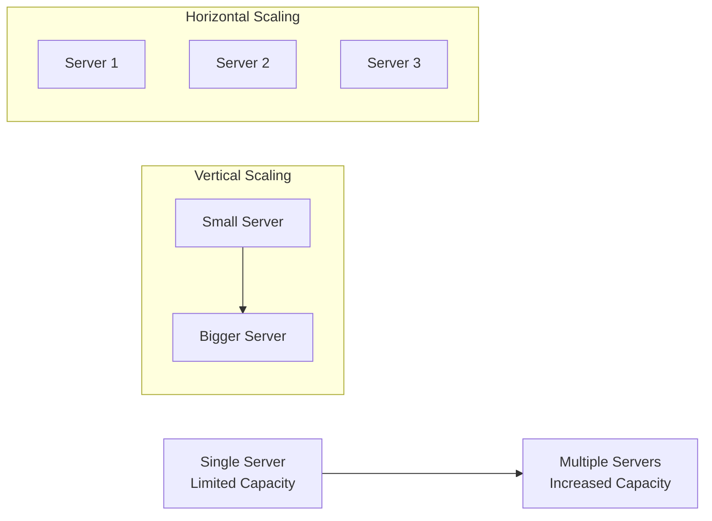
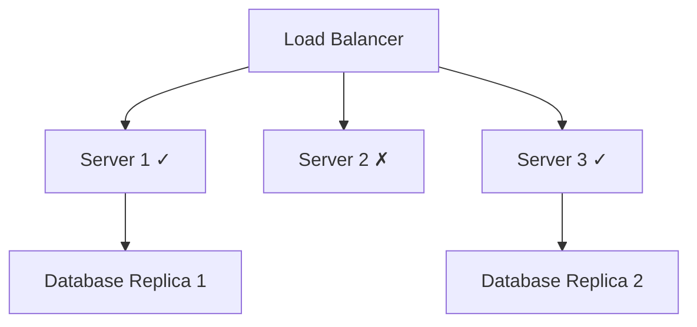
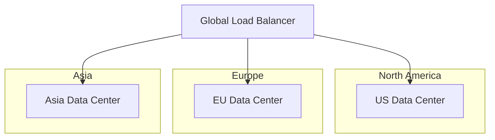
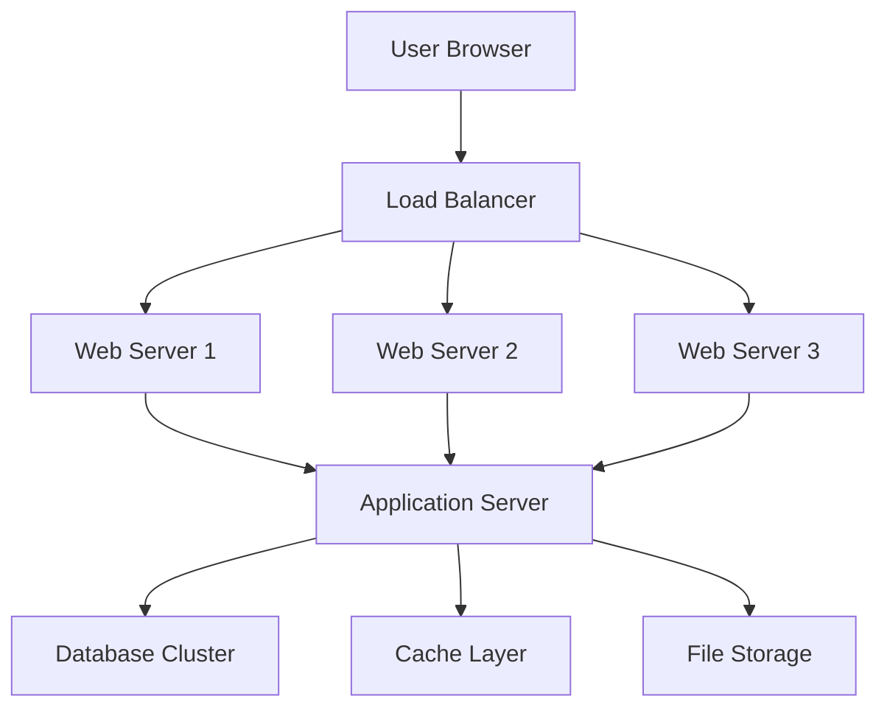
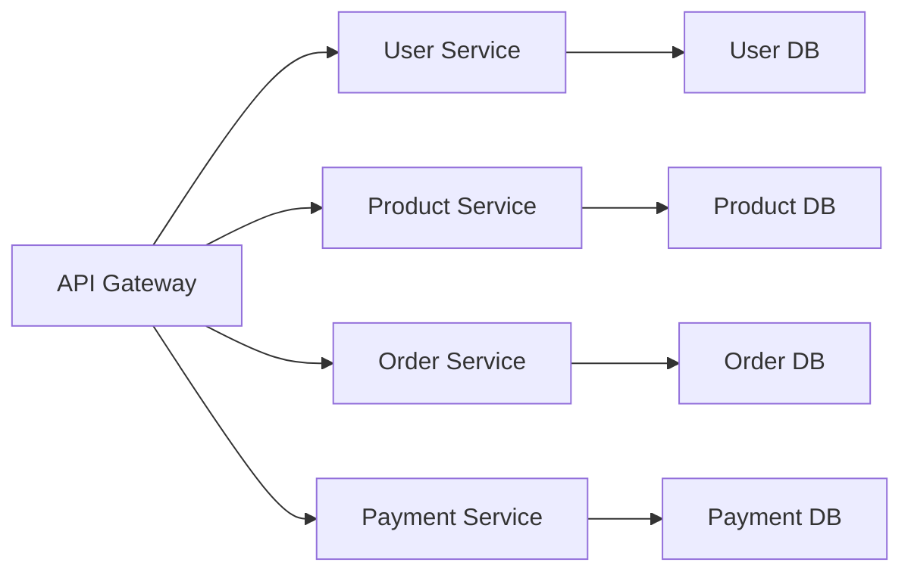

# What are Distributed Systems & Why Use Them

## Introduction

A **distributed system** is a collection of independent computers that appears to its users as a single coherent system. These computers, called nodes, communicate and coordinate their actions by passing messages over a network to achieve a common goal.

Think of it like a team of people working together on a project - each person has their own skills and responsibilities, but they must communicate and coordinate to deliver the final result successfully.

## Key Characteristics

### 1. Multiple Independent Nodes
- Each node operates independently with its own CPU, memory, and storage
- Nodes can be physical machines, virtual machines, or containers
- Failure of one node doesn't necessarily bring down the entire system

### 2. Network Communication
- Nodes communicate exclusively through message passing
- No shared memory between nodes (unlike multi-threaded applications)
- Network communication is inherently unreliable and has latency

### 3. Shared State and Coordination
- Nodes must coordinate to maintain consistent system behavior
- Shared state must be synchronized across multiple nodes
- Coordination mechanisms handle concurrent operations

## Why Use Distributed Systems?

### 1. **Scalability**
Handle more load by adding more machines rather than upgrading a single machine.

**Example**: Netflix serves millions of users simultaneously by distributing video content across thousands of servers worldwide.

### 2. **Reliability and Fault Tolerance**
If one component fails, others can continue operating.

**Example**: Google's search service remains available even when individual data centers go offline.

### 3. **Geographic Distribution**
Serve users from locations closer to them for better performance.

**Example**: Amazon's CloudFront CDN has edge locations worldwide to serve content with low latency.

### 4. **Resource Sharing**
Multiple applications can share expensive resources like databases or specialized hardware.

### 5. **Modularity and Specialization**
Different components can be optimized for specific tasks.

**Example**: An e-commerce system might have:
- Specialized servers for user authentication
- Dedicated servers for product catalog
- Separate servers for payment processing
- Optimized servers for recommendation algorithms

## Common Examples of Distributed Systems

### Web Applications

### Microservices Architecture

### Content Delivery Networks (CDNs)
- Origin servers store the master copy of content
- Edge servers cache content closer to users
- Global distribution for fast content delivery

### Blockchain Networks
- Decentralized ledger maintained across multiple nodes
- Consensus mechanisms ensure agreement on transaction history
- No single point of control or failure

## Trade-offs and Challenges

While distributed systems offer many benefits, they also introduce complexity:

| Benefits | Challenges |
|----------|------------|
| **Scalability** | **Complexity** - More moving parts to manage |
| **Reliability** | **Network Issues** - Latency, partitions, message loss |
| **Performance** | **Consistency** - Keeping data synchronized |
| **Availability** | **Debugging** - Harder to trace issues across nodes |
| **Geographic Reach** | **Security** - More attack surfaces |

## When to Use Distributed Systems

### ✅ Good Candidates
- **High traffic applications** (millions of users)
- **Large datasets** that don't fit on a single machine
- **Global applications** serving users worldwide
- **High availability requirements** (99.9%+ uptime)
- **Specialized workloads** requiring different types of hardware

### ❌ Avoid When
- **Simple applications** with low traffic
- **Small datasets** that fit comfortably on one machine
- **Tight consistency requirements** where any inconsistency is unacceptable
- **Limited development resources** to handle complexity
- **Real-time systems** where network latency is prohibitive

## Key Principles for Success

### 1. **Design for Failure**
Assume components will fail and design accordingly.

### 2. **Embrace Eventual Consistency**
Accept that perfect consistency across all nodes may not be immediately achievable.

### 3. **Minimize Network Calls**
Reduce dependencies between components to improve performance and reliability.

### 4. **Use Idempotent Operations**
Ensure operations can be safely retried without side effects.

### 5. **Monitor Everything**
Comprehensive monitoring is essential for understanding system behavior.

## Summary

Distributed systems are essential for building modern, scalable applications that serve millions of users globally. While they introduce complexity, the benefits of scalability, reliability, and performance make them necessary for large-scale systems.

The key is understanding when the benefits outweigh the costs and designing systems that embrace the inherent challenges of distribution rather than fighting against them.

**Next**: Learn about [Network Partitions & Failure Modes](02-network-partitions.md) to understand one of the most critical challenges in distributed systems.
