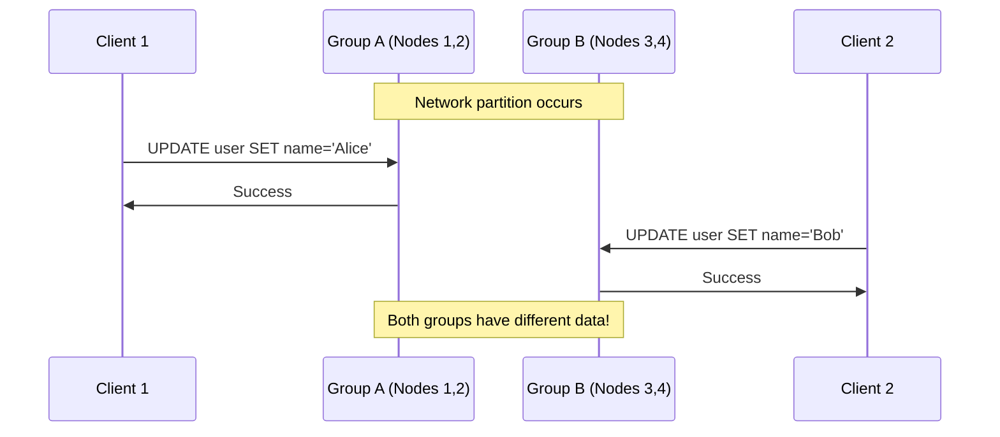
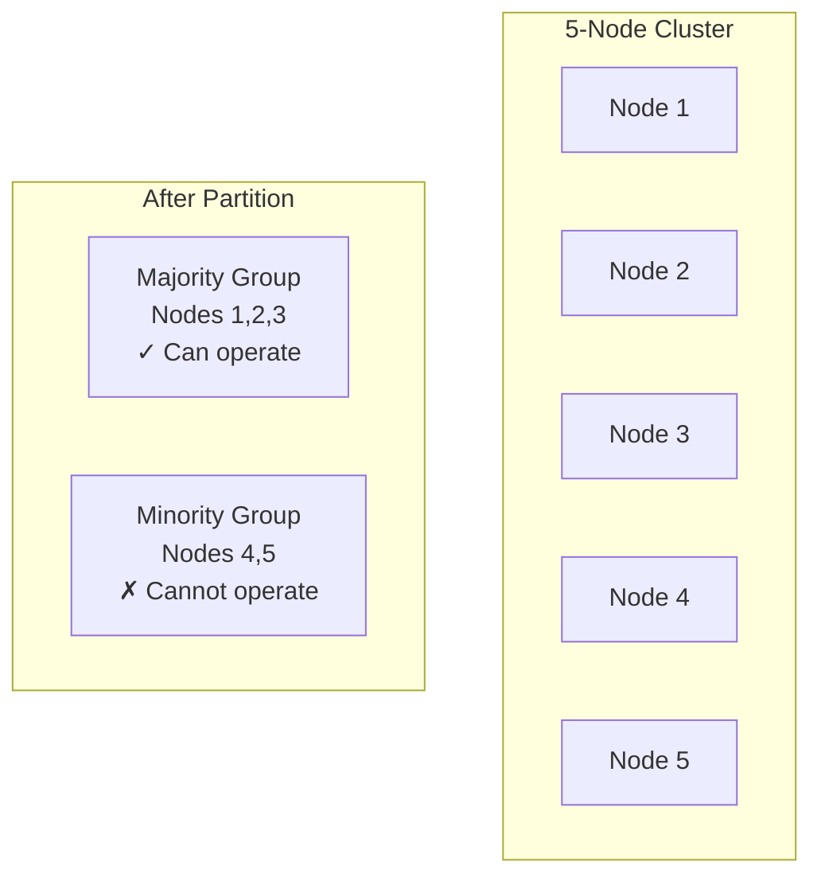
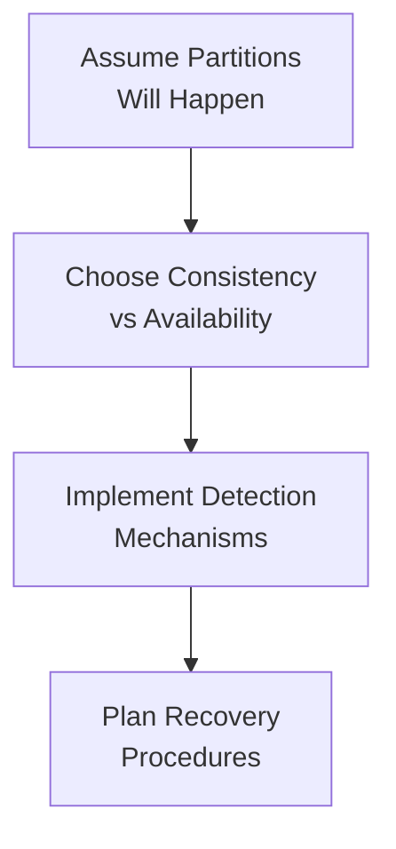

# Network Partitions & Failure Modes

## Introduction

In distributed systems, **network partitions** are one of the most challenging failure modes to handle. A network partition occurs when network failures prevent some nodes from communicating with others, effectively splitting the system into isolated groups.

Understanding partitions is crucial because they're inevitable in any distributed system that spans multiple network segments, data centers, or geographic regions.

## What is a Network Partition?

A **network partition** (or "split-brain" scenario) happens when:
- Network connectivity is lost between groups of nodes
- Each group can communicate internally but not with other groups
- The system is effectively "split" into multiple isolated clusters

```mermaid
graph TB
    subgraph "Before Partition"
        A1[Node A] --- B1[Node B]
        B1 --- C1[Node C]
        A1 --- C1
    end
    
    subgraph "After Partition"
        A2[Node A] --- B2[Node B]
        A2 -.x C2[Node C]
        B2 -.x C2
    end
    
    style A2 fill:#e1f5fe
    style B2 fill:#e1f5fe
    style C2 fill:#fff3e0
```

## Common Causes of Network Partitions

### 1. **Hardware Failures**
- Network switch failures
- Router malfunctions
- Cable cuts or damage
- Network interface card failures

### 2. **Software Issues**
- Firewall misconfigurations
- Network driver bugs
- Operating system network stack issues
- DNS resolution failures

### 3. **Infrastructure Problems**
- Data center power outages
- Internet service provider (ISP) issues
- Submarine cable cuts (for intercontinental connections)
- Cloud provider network issues

### 4. **Overload Conditions**
- Network congestion causing packet loss
- High latency making nodes appear unreachable
- Resource exhaustion (CPU, memory) preventing network processing

## Types of Network Partitions

### 1. **Complete Partition**
No communication possible between groups.

```mermaid
graph LR
    subgraph "Group A"
        A[Node 1]
        B[Node 2]
    end
    
    subgraph "Group B"
        C[Node 3]
        D[Node 4]
    end
    
    A --- B
    C --- D
    A -.x C
    B -.x D
```

### 2. **Partial Partition**
Some nodes can communicate with both groups.

```mermaid
graph TB
    A[Node 1] --- B[Node 2]
    B --- C[Node 3]
    C --- D[Node 4]
    A -.x D
    B -.x D
```

### 3. **Asymmetric Partition**
Communication works in one direction but not the other.

```mermaid
graph LR
    A[Node A] --> B[Node B]
    B -.x A
```

## The Split-Brain Problem

When a partition occurs, each group of nodes may:
1. **Continue operating independently**
2. **Accept writes and modifications**
3. **Believe they are the "correct" group**

This leads to **divergent state** - different groups have different versions of the data.

### Example: Database Split-Brain



## Partition Detection

### 1. **Heartbeat Mechanisms**
Nodes send periodic "I'm alive" messages to each other.

```python
# Simplified heartbeat example
class Node:
    def __init__(self, node_id):
        self.node_id = node_id
        self.last_heartbeat = {}
        self.timeout = 5  # seconds
    
    def send_heartbeat(self, other_nodes):
        for node in other_nodes:
            node.receive_heartbeat(self.node_id)
    
    def receive_heartbeat(self, from_node):
        self.last_heartbeat[from_node] = time.now()
    
    def detect_failures(self):
        failed_nodes = []
        for node_id, last_seen in self.last_heartbeat.items():
            if time.now() - last_seen > self.timeout:
                failed_nodes.append(node_id)
        return failed_nodes
```

### 2. **Quorum-Based Detection**
Require majority agreement to make decisions.



### 3. **External Coordination Services**
Use external systems (like ZooKeeper) to coordinate and detect partitions.

## Partition Handling Strategies

### 1. **Fail-Stop Approach**
Stop accepting writes when partition is detected.

**Pros**: Prevents data inconsistency
**Cons**: Reduces availability

```python
class FailStopService:
    def __init__(self, required_nodes):
        self.required_nodes = required_nodes
        self.available_nodes = set()
    
    def handle_request(self, request):
        if len(self.available_nodes) < self.required_nodes:
            raise ServiceUnavailableError("Insufficient nodes available")
        
        return self.process_request(request)
```

### 2. **Continue Operating**
Keep accepting writes, resolve conflicts later.

**Pros**: Maintains availability
**Cons**: May create data inconsistencies

### 3. **Quorum-Based Decisions**
Only allow operations if majority of nodes agree.

```python
class QuorumService:
    def __init__(self, total_nodes):
        self.total_nodes = total_nodes
        self.quorum_size = (total_nodes // 2) + 1
    
    def write_data(self, key, value):
        responses = []
        for node in self.available_nodes:
            try:
                response = node.write(key, value)
                responses.append(response)
            except NetworkError:
                continue
        
        if len(responses) >= self.quorum_size:
            return "Success"
        else:
            raise InsufficientNodesError("Cannot achieve quorum")
```

## Real-World Examples

### 1. **AWS Multi-AZ Outage (2017)**
- Network partition between availability zones
- Some services continued operating in single AZ
- Others failed-stop to prevent inconsistency
- **Lesson**: Different strategies for different service requirements

### 2. **GitHub Split-Brain (2012)**
- Network partition in data center
- Both database clusters accepted writes
- Required manual data reconciliation
- **Lesson**: Importance of automated conflict resolution

### 3. **MongoDB Replica Set Partitions**
- Primary node becomes unreachable
- Secondary nodes elect new primary
- Original primary may continue accepting writes
- **Solution**: Use majority-based elections

## Best Practices for Partition Tolerance

### 1. **Design for Partitions**


### 2. **Use Appropriate Consistency Models**
- **Strong consistency**: Sacrifice availability during partitions
- **Eventual consistency**: Maintain availability, resolve conflicts later

### 3. **Implement Circuit Breakers**
```python
class CircuitBreaker:
    def __init__(self, failure_threshold=5, timeout=60):
        self.failure_count = 0
        self.failure_threshold = failure_threshold
        self.timeout = timeout
        self.last_failure_time = None
        self.state = "CLOSED"  # CLOSED, OPEN, HALF_OPEN
    
    def call(self, func, *args, **kwargs):
        if self.state == "OPEN":
            if time.now() - self.last_failure_time > self.timeout:
                self.state = "HALF_OPEN"
            else:
                raise CircuitBreakerOpenError()
        
        try:
            result = func(*args, **kwargs)
            self.reset()
            return result
        except Exception as e:
            self.record_failure()
            raise e
```

### 4. **Monitor Network Health**
- Track network latency and packet loss
- Monitor partition events and recovery times
- Set up alerts for partition detection

### 5. **Test Partition Scenarios**
- Use chaos engineering tools (like Chaos Monkey)
- Simulate network partitions in testing
- Practice partition recovery procedures

## Partition Recovery

When network connectivity is restored:

### 1. **Detect Recovery**
- Nodes can communicate again
- Heartbeats resume
- Quorum is re-established

### 2. **Reconcile State**
- Compare data versions across nodes
- Resolve conflicts using predetermined rules
- Merge or choose winning versions

### 3. **Resume Normal Operations**
- Re-enable full functionality
- Redistribute load across all nodes
- Monitor for stability

## Summary

Network partitions are an inevitable reality in distributed systems. The key is not to prevent them (which is impossible) but to:

1. **Detect partitions quickly** using heartbeats and quorum mechanisms
2. **Choose appropriate responses** based on your consistency and availability requirements
3. **Plan for recovery** with automated reconciliation procedures
4. **Test partition scenarios** regularly to ensure your system behaves as expected

Understanding partitions is essential for grasping the CAP theorem, which we'll explore in the next section.

**Next**: Learn about the [CAP Theorem](03-cap-theorem.md) and how it formalizes the trade-offs between consistency, availability, and partition tolerance.
