# CAP Theorem Explained

## Introduction

The **CAP Theorem** (also known as Brewer's Theorem) is one of the most important concepts in distributed systems. Formulated by computer scientist Eric Brewer in 2000, it states that any distributed system can guarantee at most two of the following three properties simultaneously:

- **C**onsistency
- **A**vailability  
- **P**artition tolerance

Understanding CAP is crucial for making informed architectural decisions in distributed systems.

## The Three Properties

### Consistency (C)

**Definition**: All nodes see the same data at the same time. Every read receives the most recent write or an error.

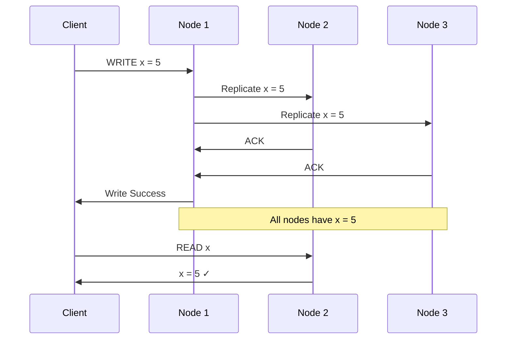

**Strong Consistency Example**: Traditional RDBMS with ACID transactions
- All replicas must be updated before confirming a write
- Reads always return the latest written value
- System may become unavailable during updates

### Availability (A)

**Definition**: The system remains operational and responsive. Every request receives a response (success or failure) without guarantee that it contains the most recent write.

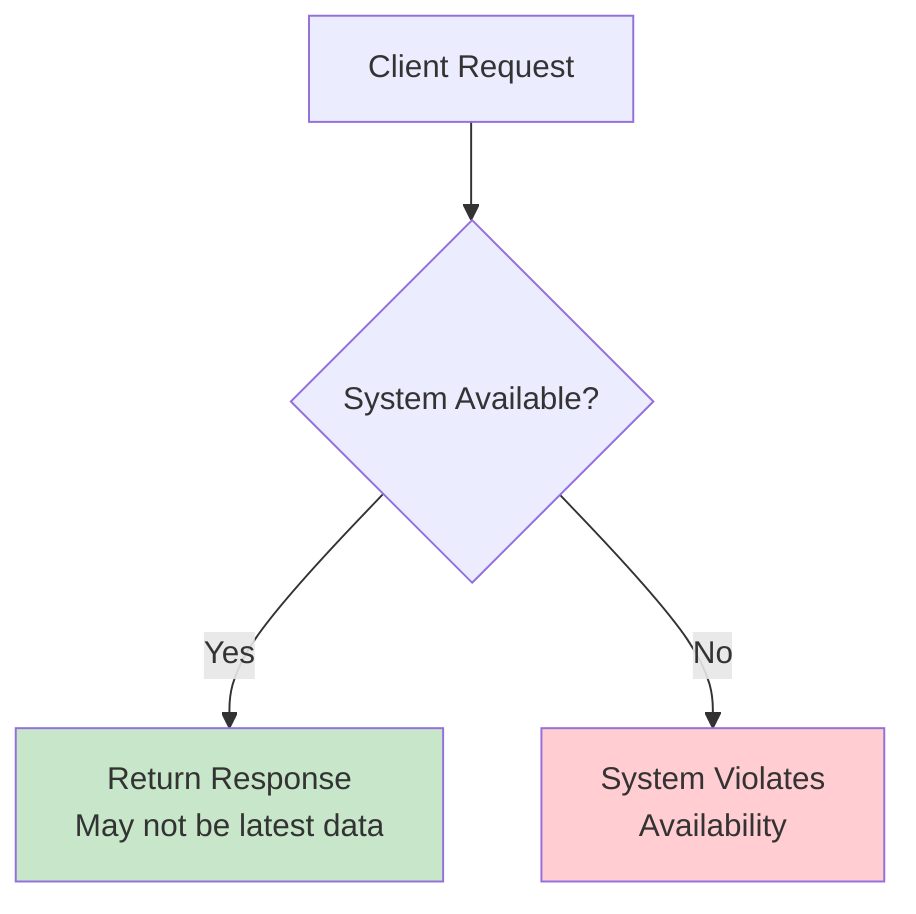

**High Availability Example**: DNS system
- DNS servers always respond to queries
- May return slightly outdated IP addresses
- Eventual consistency across DNS servers worldwide

### Partition Tolerance (P)

**Definition**: The system continues to operate despite network failures that prevent some nodes from communicating with others.

```mermaid
graph TB
    subgraph "Before Partition"
        A1[Node A] --- B1[Node B]
        B1 --- C1[Node C]
    end
    
    subgraph "During Partition"
        A2[Node A] --- B2[Node B]
        A2 -.x C2[Node C]
        B2 -.x C2
        
        D[System continues<br/>operating in both<br/>partitions]
    end
    
    style D fill:#fff3e0
```

## The CAP Trade-off

The CAP theorem states you can only guarantee **two out of three** properties:

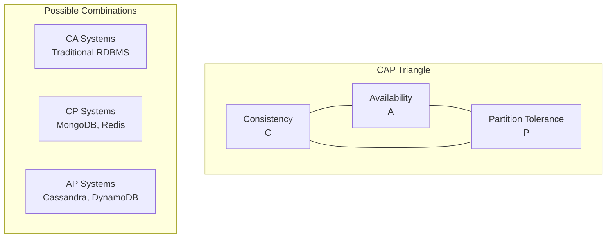

### Why Only Two?

When a network partition occurs, you must choose:

1. **Maintain Consistency**: Reject requests to prevent inconsistent data (sacrifice Availability)
2. **Maintain Availability**: Accept requests even if data might be inconsistent (sacrifice Consistency)

You cannot maintain both because:
- Ensuring consistency requires coordination between all nodes
- Network partitions prevent this coordination
- Staying available means accepting requests without full coordination

## CAP System Categories

### CA Systems (Consistency + Availability)

**Characteristics**:
- Strong consistency and high availability
- Cannot tolerate network partitions
- Typically single-node or tightly coupled systems

**Examples**:
- Traditional RDBMS (MySQL, PostgreSQL) in single-node setup
- LDAP directories
- File systems

**Trade-off**: System becomes unavailable during network issues

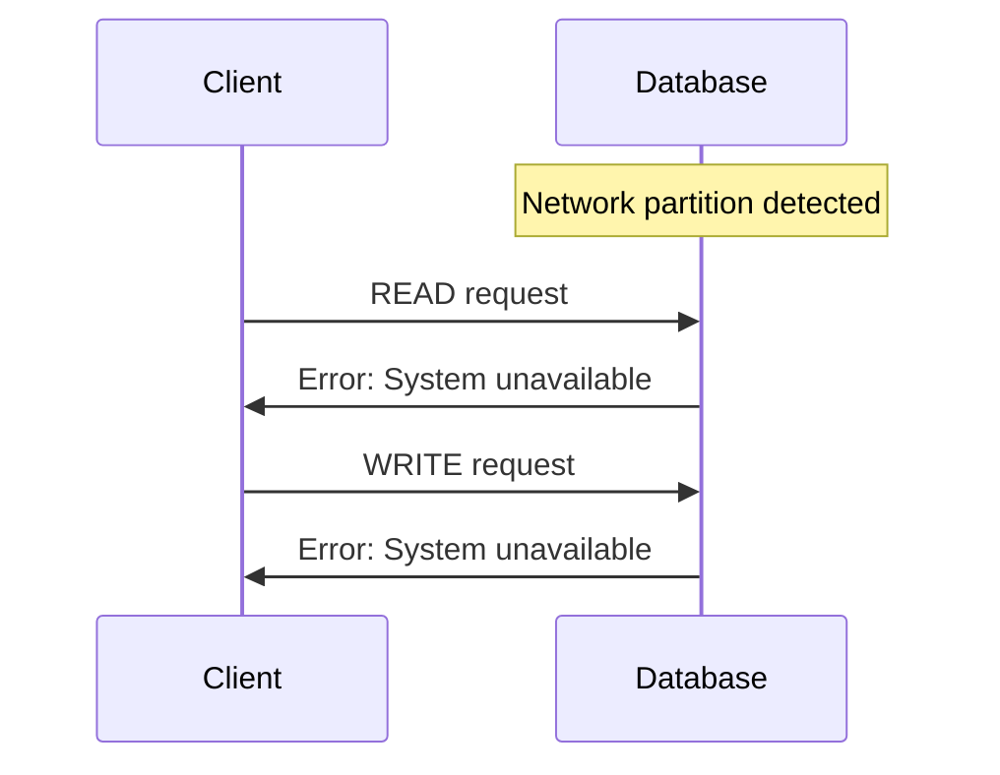

**Real-world Example**: Traditional banking systems
- Require strong consistency for account balances
- May go offline during network issues
- Prefer accuracy over availability

### CP Systems (Consistency + Partition Tolerance)

**Characteristics**:
- Maintain data consistency during partitions
- Sacrifice availability when necessary
- Use quorum-based decisions

**Examples**:
- MongoDB (with strong consistency settings)
- Redis Cluster
- Consul
- Zookeeper

**Trade-off**: System may become unavailable to maintain consistency

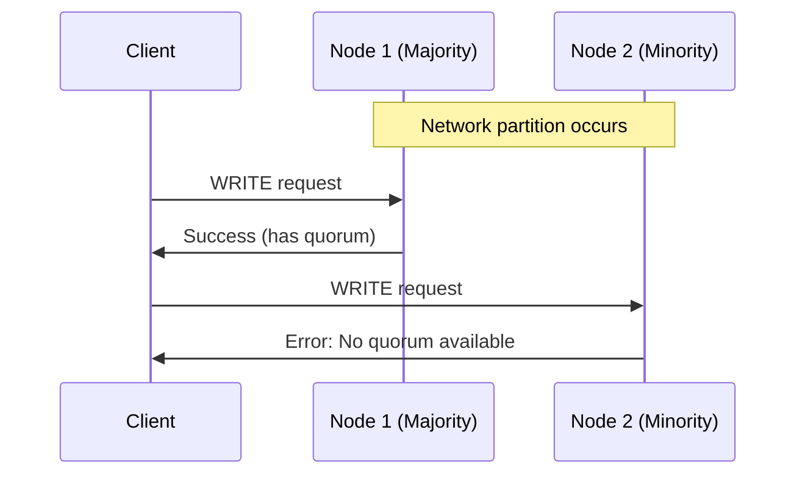

**Real-world Example**: Configuration management systems
- Need consistent configuration across all services
- Better to be unavailable than serve wrong config
- Eventual availability when partition heals

### AP Systems (Availability + Partition Tolerance)

**Characteristics**:
- Always available and partition tolerant
- Accept eventual consistency
- Use conflict resolution strategies

**Examples**:
- Cassandra
- DynamoDB
- CouchDB
- DNS

**Trade-off**: May serve stale or conflicting data

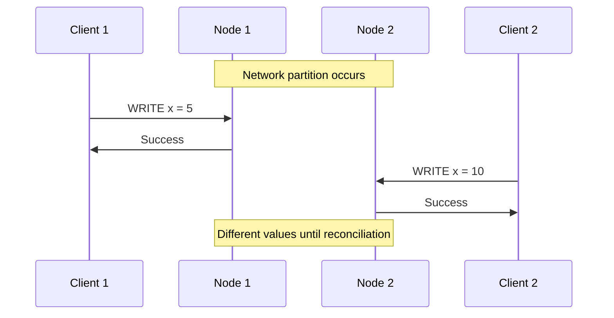

**Real-world Example**: Social media feeds
- Users can always post and read content
- Temporary inconsistencies are acceptable
- Eventually all users see all posts

## Real-World CAP Decisions

### Amazon DynamoDB (AP)

**Design Choice**: Prioritize availability and partition tolerance

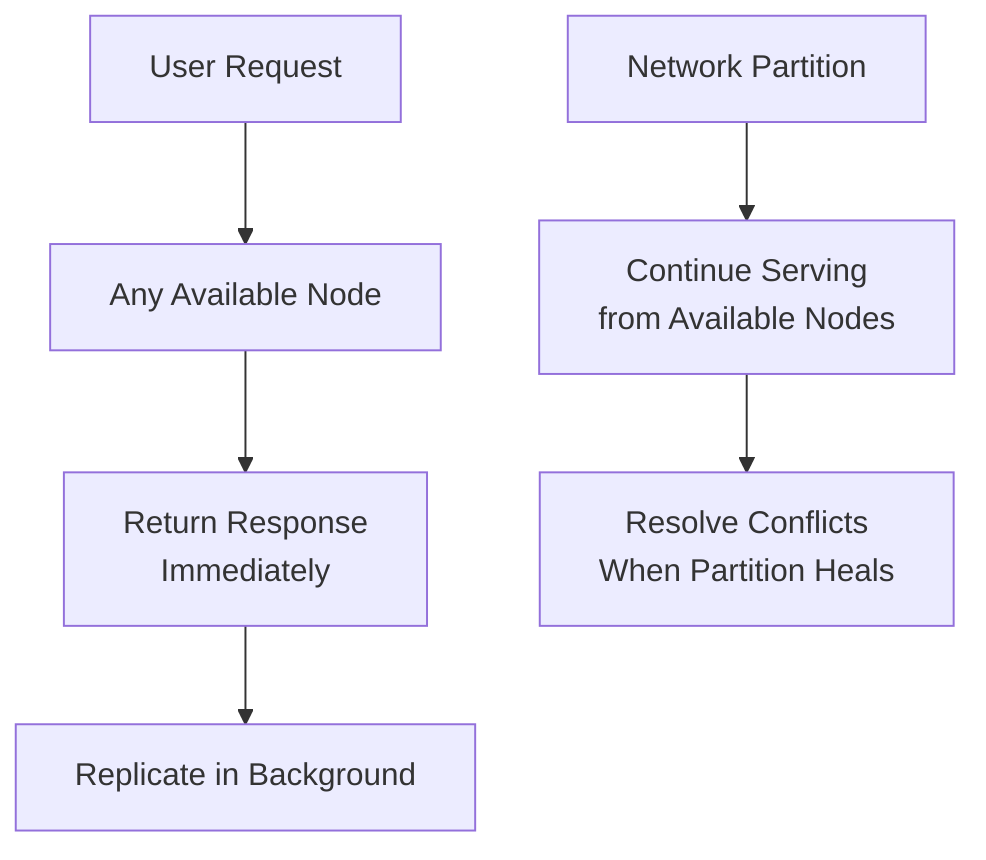

**Benefits**:
- Always responsive to user requests
- Scales globally across regions
- Handles network issues gracefully

**Trade-offs**:
- May read stale data temporarily
- Requires application-level conflict resolution
- Eventually consistent model

### Google Spanner (CP)

**Design Choice**: Prioritize consistency and partition tolerance

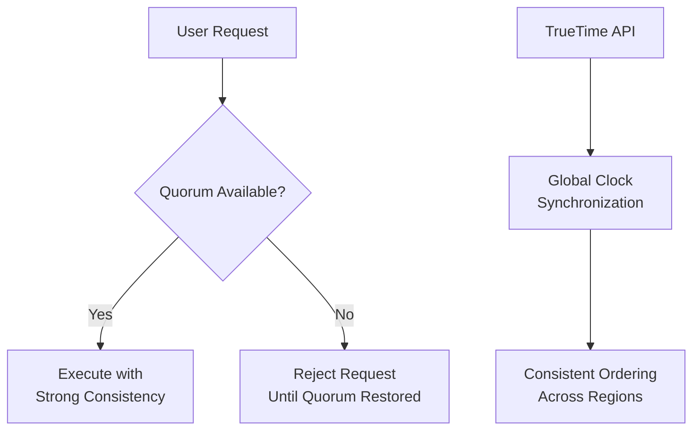

**Benefits**:
- Strong consistency guarantees
- ACID transactions across regions
- Predictable behavior for applications

**Trade-offs**:
- May become unavailable during partitions
- Higher latency due to coordination
- More complex infrastructure requirements

### Cassandra (AP with Tunable Consistency)

**Design Choice**: Configurable consistency levels

```python
# Cassandra consistency levels
CONSISTENCY_LEVELS = {
    'ONE': 'Any single replica',
    'QUORUM': 'Majority of replicas', 
    'ALL': 'All replicas',
    'LOCAL_QUORUM': 'Majority in local datacenter'
}

# Example: Tunable consistency per operation
session.execute(
    "INSERT INTO users (id, name) VALUES (?, ?)",
    [user_id, name],
    consistency_level=ConsistencyLevel.QUORUM  # CP behavior
)

result = session.execute(
    "SELECT * FROM users WHERE id = ?",
    [user_id],
    consistency_level=ConsistencyLevel.ONE     # AP behavior
)
```

**Benefits**:
- Flexibility to choose per operation
- Can optimize for different use cases
- Gradual consistency trade-offs

## Beyond CAP: PACELC

The **PACELC** theorem extends CAP to consider latency:

- **P**artition tolerance: When partitions occur, choose between **A**vailability and **C**onsistency
- **E**lse: When no partitions, choose between **L**atency and **C**onsistency

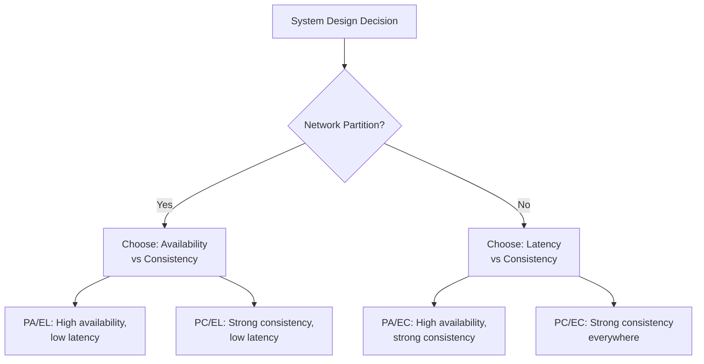

**Examples**:
- **PA/EL**: Cassandra, DynamoDB (available and fast)
- **PC/EL**: MongoDB (consistent but may sacrifice availability)
- **PA/EC**: Traditional RDBMS with async replication
- **PC/EC**: Google Spanner (consistent everywhere)

## Practical Guidelines

### 1. **Identify Your Requirements**

Ask these questions:
- Can your application tolerate stale data?
- Is it acceptable to be temporarily unavailable?
- How critical is immediate consistency?
- What are your latency requirements?

### 2. **Choose Based on Use Case**

| Use Case | Recommended | Reasoning |
|----------|-------------|-----------|
| **Financial Transactions** | CP | Consistency is critical, temporary unavailability acceptable |
| **Social Media Feeds** | AP | Availability matters more than perfect consistency |
| **Configuration Systems** | CP | Wrong config is worse than no config |
| **Content Delivery** | AP | Users expect fast, always-available content |
| **Inventory Management** | CP | Overselling due to inconsistency is costly |
| **User Profiles** | AP | Profile updates can be eventually consistent |

### 3. **Hybrid Approaches**

Many systems use different strategies for different data:

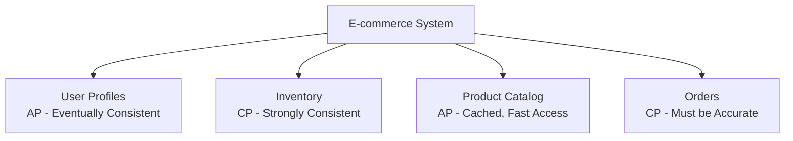

### 4. **Evolution Over Time**

Systems often start simple and evolve:

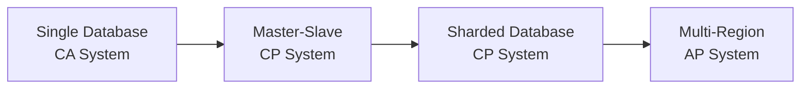

## Common Misconceptions

### ❌ "NoSQL databases are always AP"
**Reality**: Many NoSQL databases offer tunable consistency
- MongoDB can be configured for strong consistency (CP)
- Cassandra allows per-query consistency levels

### ❌ "You must choose one category forever"
**Reality**: Different parts of your system can make different choices
- User authentication: CP (consistency critical)
- User posts: AP (availability preferred)

### ❌ "CAP means you can't have all three ever"
**Reality**: You can have all three when there are no partitions
- CAP only applies during network partition scenarios
- Most of the time, systems can be consistent, available, and partition-ready

## Summary

The CAP theorem provides a framework for understanding trade-offs in distributed systems:

1. **Consistency**: All nodes see the same data simultaneously
2. **Availability**: System remains responsive to requests
3. **Partition Tolerance**: System continues operating despite network failures

**Key Takeaways**:
- You can only guarantee two properties during network partitions
- Different parts of your system can make different CAP choices
- Modern systems often provide tunable consistency levels
- Consider PACELC for a more complete picture including latency

**Design Strategy**:
1. Identify your consistency and availability requirements
2. Choose the appropriate CAP category for each component
3. Plan for partition scenarios and recovery procedures
4. Monitor and test your system's behavior during network issues

**Next**: Learn about [Consistency Models](04-consistency-models.md) to understand the spectrum of consistency guarantees available in distributed systems.
