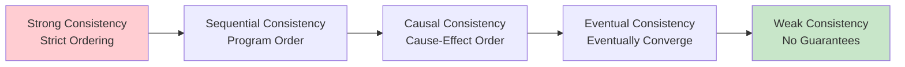
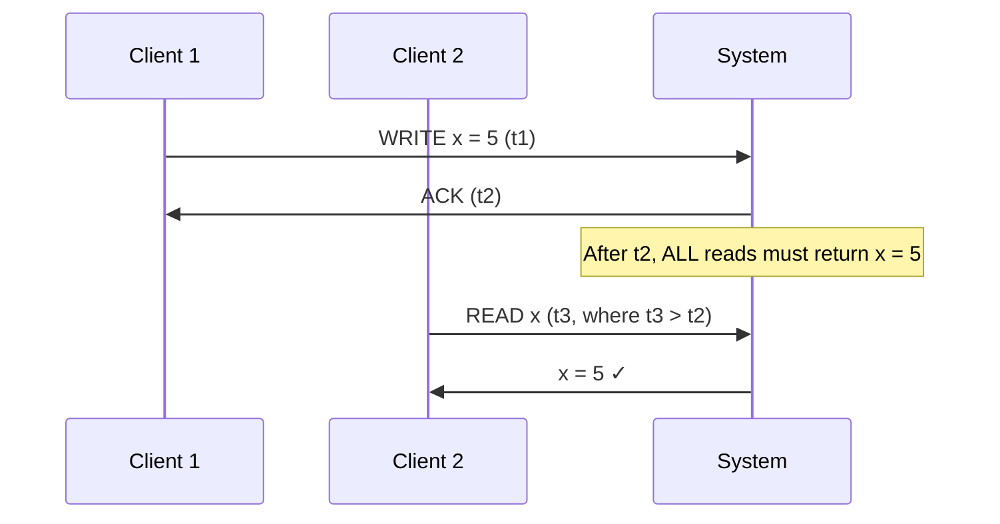
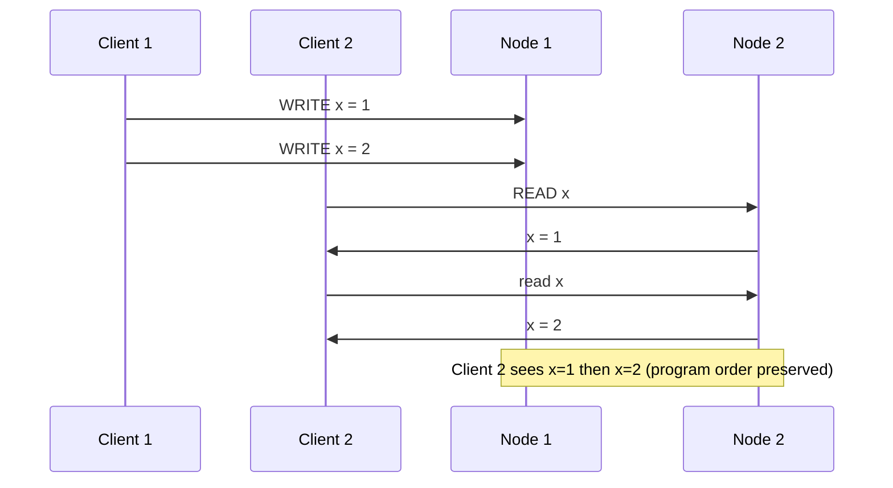
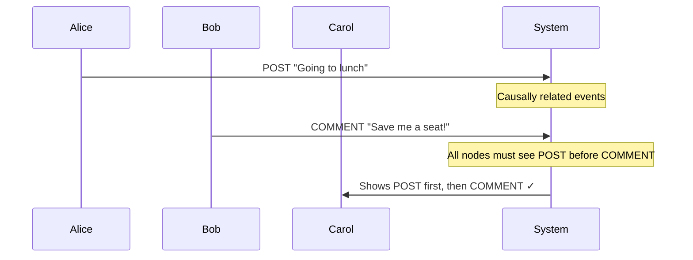
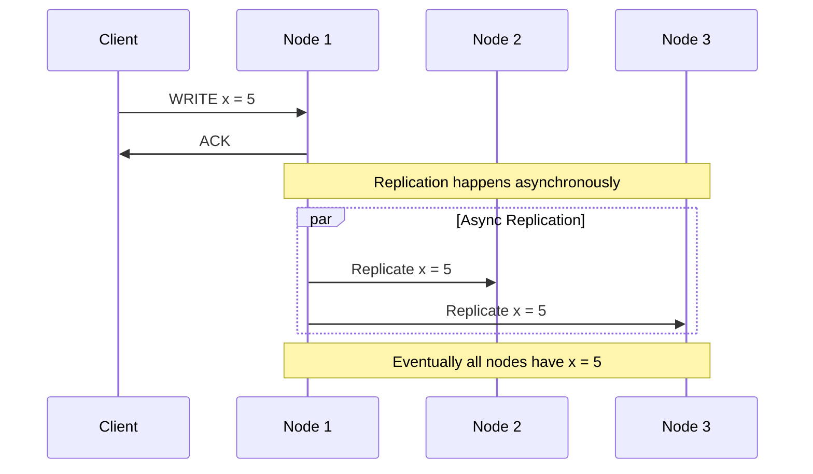
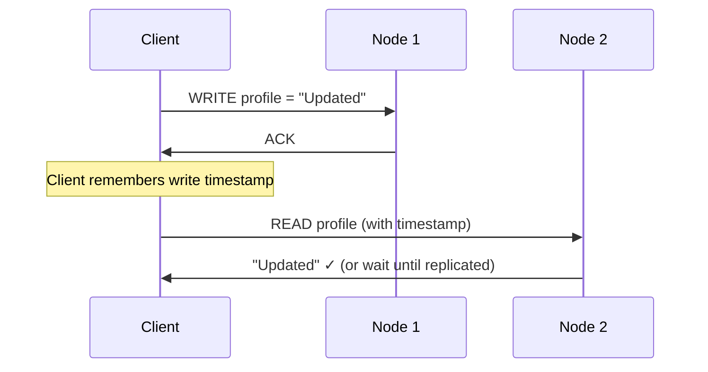
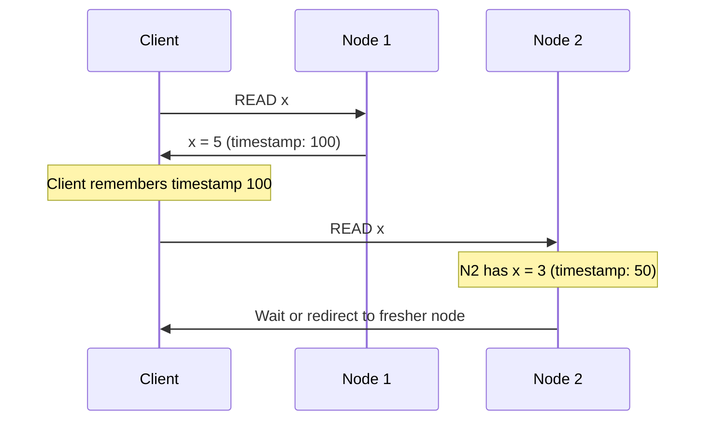
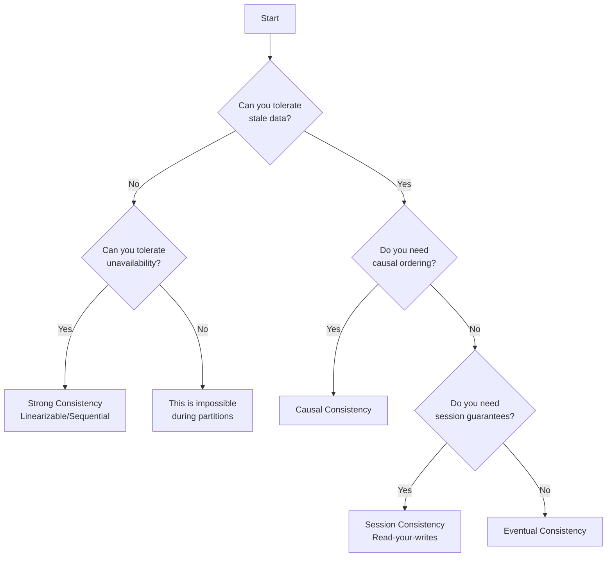

# Consistency Models

## Introduction

**Consistency models** define the rules about when and how data changes become visible across different nodes in a distributed system. They represent a spectrum of guarantees, from strict consistency (all nodes always see the same data) to eventual consistency (nodes will eventually see the same data).

Understanding consistency models is crucial for designing distributed systems because they directly impact performance, availability, and the complexity of application logic.

## The Consistency Spectrum



**Trade-off**: Stronger consistency → Higher latency, Lower availability
**Trade-off**: Weaker consistency → Lower latency, Higher availability

## Strong Consistency Models

### 1. Strict Consistency (Linearizability)

**Definition**: All operations appear to execute atomically in some sequential order, and this order respects the real-time ordering of operations.



**Characteristics**:
- Strongest possible consistency guarantee
- Operations appear instantaneous to all clients
- Matches intuition from single-machine systems

**Implementation Requirements**:
- Global coordination for every operation
- Consensus protocols (Raft, Paxos)
- Significant performance overhead

**Example**: Google Spanner
```sql
-- All reads see the same data globally
BEGIN TRANSACTION;
  SELECT balance FROM accounts WHERE id = 123;  -- Always current
  UPDATE accounts SET balance = balance - 100 WHERE id = 123;
COMMIT;
```

**Use Cases**:
- Financial systems requiring exact consistency
- Configuration management systems
- Systems where correctness is more important than performance

### 2. Sequential Consistency

**Definition**: All operations appear to execute in some sequential order, and operations from each client appear in the order they were issued.



**Characteristics**:
- Preserves program order for each client
- Global order may differ from real-time order
- Easier to implement than strict consistency

**Example**: Some distributed databases with strong consistency settings

### 3. Causal Consistency

**Definition**: Operations that are causally related are seen in the same order by all nodes. Concurrent operations may be seen in different orders.



**Causal Relationships**:
1. **Program Order**: Operations from same client
2. **Read-Write**: Reading a value, then writing based on it
3. **Transitivity**: If A causes B and B causes C, then A causes C

**Implementation**: Vector clocks or logical timestamps

```python
# Vector clock example
class VectorClock:
    def __init__(self, node_id, num_nodes):
        self.node_id = node_id
        self.clock = [0] * num_nodes
    
    def tick(self):
        self.clock[self.node_id] += 1
        return self.clock.copy()
    
    def update(self, other_clock):
        for i in range(len(self.clock)):
            self.clock[i] = max(self.clock[i], other_clock[i])
        self.tick()
    
    def happens_before(self, other_clock):
        return (all(self.clock[i] <= other_clock[i] for i in range(len(self.clock))) 
                and any(self.clock[i] < other_clock[i] for i in range(len(self.clock))))
```

**Use Cases**:
- Social media systems (comments after posts)
- Collaborative editing (operation ordering)
- Chat systems (message ordering)

## Weak Consistency Models

### 1. Eventual Consistency

**Definition**: If no new updates are made, eventually all nodes will converge to the same value. No guarantees about when convergence occurs.



**Characteristics**:
- High availability and performance
- Temporary inconsistencies are acceptable
- Requires conflict resolution mechanisms

**Conflict Resolution Strategies**:

#### Last-Writer-Wins (LWW)
```python
class LWWRegister:
    def __init__(self):
        self.value = None
        self.timestamp = 0
    
    def write(self, value, timestamp):
        if timestamp > self.timestamp:
            self.value = value
            self.timestamp = timestamp
    
    def merge(self, other):
        if other.timestamp > self.timestamp:
            self.value = other.value
            self.timestamp = other.timestamp
```

#### Multi-Value Register
```python
class MultiValueRegister:
    def __init__(self):
        self.values = {}  # {timestamp: value}
    
    def write(self, value, timestamp):
        self.values[timestamp] = value
    
    def read(self):
        if len(self.values) == 1:
            return list(self.values.values())[0]
        else:
            return list(self.values.values())  # Return all conflicting values
```

**Examples**:
- Amazon DynamoDB
- Cassandra (default mode)
- DNS system
- Email systems

### 2. Weak Consistency

**Definition**: No guarantees about when data will be consistent. Applications must handle all possible inconsistencies.

**Example**: Memcached
- Cache may have stale data
- Applications must handle cache misses
- No coordination between cache nodes

## Consistency Model Comparison

| Model | Ordering Guarantees | Performance | Availability | Complexity | Use Cases |
|-------|-------------------|-------------|--------------|------------|-----------|
| **Strict** | Global real-time order | Low | Low | High | Financial systems, critical config |
| **Sequential** | Program order preserved | Medium | Medium | Medium | Distributed databases |
| **Causal** | Causal relationships | Medium-High | High | Medium | Social media, collaboration |
| **Eventual** | Eventually converge | High | High | Low-Medium | Content distribution, user profiles |
| **Weak** | No guarantees | Highest | Highest | Low | Caching, best-effort systems |

## Advanced Consistency Concepts

### 1. Read-Your-Writes Consistency

**Guarantee**: A client always sees their own writes.



**Implementation**:
```python
class ReadYourWritesClient:
    def __init__(self):
        self.last_write_timestamp = 0
    
    def write(self, key, value):
        timestamp = time.now()
        result = self.cluster.write(key, value, timestamp)
        self.last_write_timestamp = max(self.last_write_timestamp, timestamp)
        return result
    
    def read(self, key):
        return self.cluster.read(key, min_timestamp=self.last_write_timestamp)
```

### 2. Monotonic Read Consistency

**Guarantee**: If a client reads a value, subsequent reads will not return older values.



### 3. Session Consistency

**Guarantee**: Within a client session, reads and writes are consistent.

**Implementation**: Combine read-your-writes and monotonic reads for session duration.

## Tunable Consistency

Many modern systems allow configuring consistency per operation:

### Cassandra Example
```python
from cassandra.cluster import Cluster
from cassandra import ConsistencyLevel

cluster = Cluster(['127.0.0.1'])
session = cluster.connect('keyspace')

# Strong consistency write
session.execute(
    "INSERT INTO users (id, email) VALUES (?, ?)",
    [user_id, email],
    consistency_level=ConsistencyLevel.QUORUM
)

# Fast, eventually consistent read
session.execute(
    "SELECT * FROM user_posts WHERE user_id = ?",
    [user_id],
    consistency_level=ConsistencyLevel.ONE
)
```

### DynamoDB Example
```python
import boto3

dynamodb = boto3.resource('dynamodb')
table = dynamodb.Table('Users')

# Eventually consistent read (default)
response = table.get_item(
    Key={'user_id': '123'},
    ConsistentRead=False  # Eventually consistent
)

# Strongly consistent read
response = table.get_item(
    Key={'user_id': '123'},
    ConsistentRead=True   # Strong consistency
)
```

## Choosing the Right Consistency Model

### Decision Framework



### Use Case Guidelines

| Application Type | Recommended Model | Reasoning |
|------------------|-------------------|-----------|
| **Banking/Finance** | Strong | Accuracy critical, temporary unavailability acceptable |
| **Social Media Posts** | Eventual | High availability needed, eventual consistency OK |
| **User Profiles** | Session | Users should see their own changes immediately |
| **Chat Messages** | Causal | Message ordering important, but not global consistency |
| **Product Catalog** | Eventual | Read-heavy, updates can propagate slowly |
| **Shopping Cart** | Session | User should see their own cart changes |
| **Configuration** | Strong | Wrong config worse than no config |
| **Analytics** | Eventual | Approximate data acceptable for insights |

## Implementation Patterns

### 1. Hybrid Consistency
Different consistency for different operations:

```python
class HybridStore:
    def __init__(self):
        self.strong_store = StrongConsistencyStore()
        self.eventual_store = EventualConsistencyStore()
    
    def write_critical(self, key, value):
        # Financial data - strong consistency
        return self.strong_store.write(key, value)
    
    def write_profile(self, key, value):
        # User profile - eventual consistency
        return self.eventual_store.write(key, value)
    
    def read_critical(self, key):
        return self.strong_store.read(key)
    
    def read_profile(self, key):
        return self.eventual_store.read(key)
```

### 2. Consistency Levels per Client
```python
class ConfigurableClient:
    def __init__(self, default_consistency='eventual'):
        self.default_consistency = default_consistency
        self.store = DistributedStore()
    
    def read(self, key, consistency=None):
        level = consistency or self.default_consistency
        return self.store.read(key, consistency_level=level)
    
    def write(self, key, value, consistency=None):
        level = consistency or self.default_consistency
        return self.store.write(key, value, consistency_level=level)

# Usage
client = ConfigurableClient(default_consistency='eventual')

# Fast read for user feed
posts = client.read('user_feed:123')

# Strong consistency for payment
client.write('account_balance:123', new_balance, consistency='strong')
```

## Summary

Consistency models provide a framework for understanding the trade-offs between data accuracy, performance, and availability in distributed systems:

**Key Models**:
- **Strong Consistency**: All nodes always agree (high cost)
- **Causal Consistency**: Preserve cause-effect relationships (balanced)
- **Eventual Consistency**: Nodes eventually agree (high performance)
- **Session Consistency**: Consistency within user sessions (practical)

**Design Principles**:
1. **Match consistency to requirements**: Not all data needs strong consistency
2. **Use hybrid approaches**: Different consistency for different data types
3. **Consider user experience**: Users should see their own changes
4. **Plan for conflicts**: Implement resolution strategies for weak consistency

**Next Steps**:
- Understand your application's consistency requirements
- Choose appropriate models for different data types
- Implement conflict resolution for eventually consistent data
- Monitor and measure consistency behavior in production

**Next**: Learn about [Distributed System Challenges](05-challenges.md) to understand the practical difficulties of implementing these consistency models.
