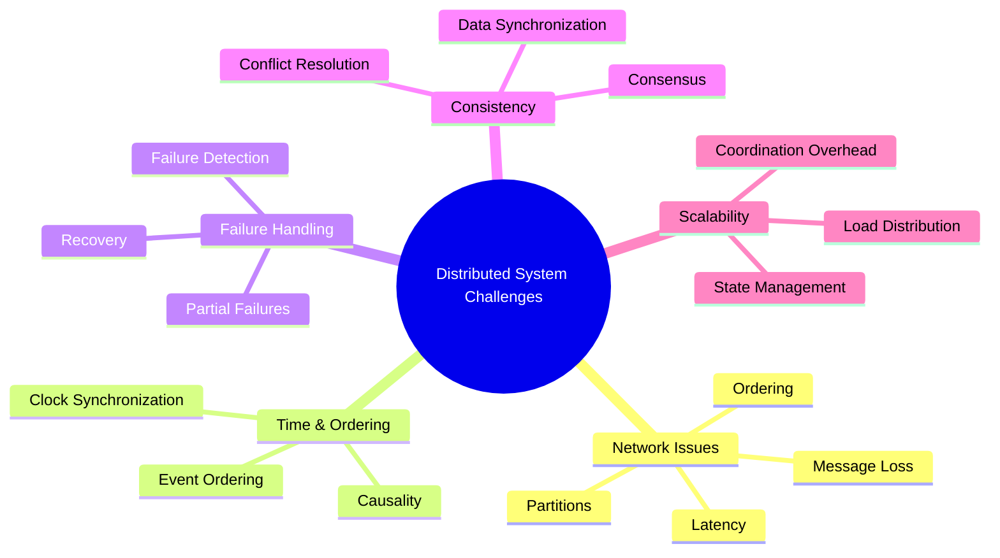
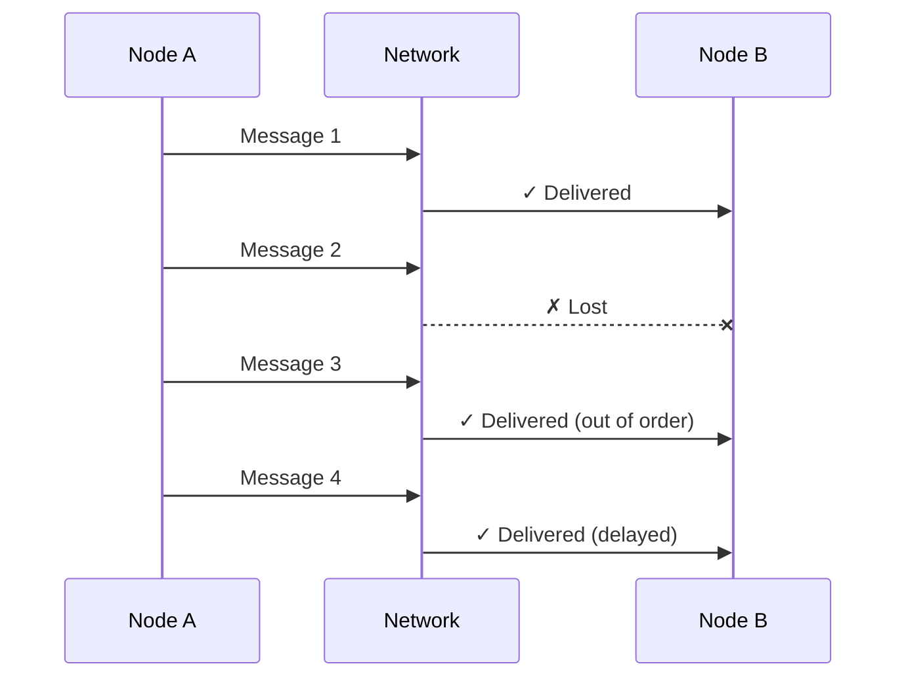
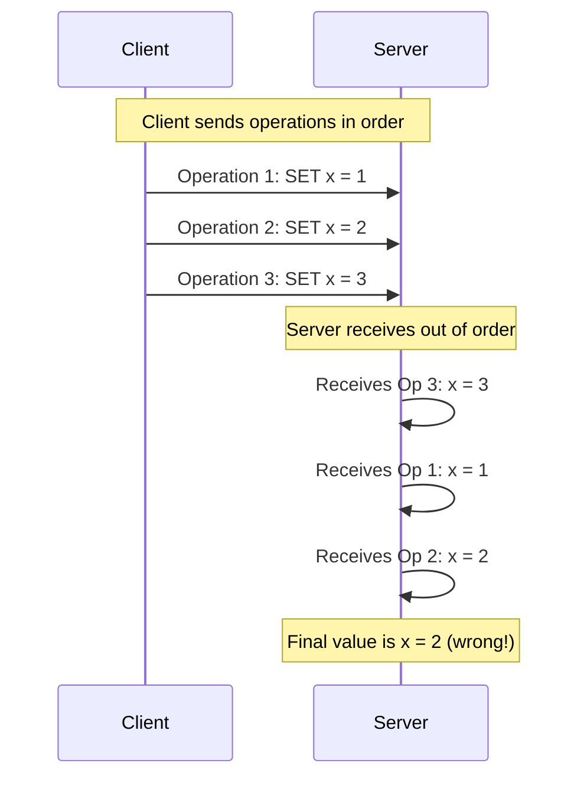
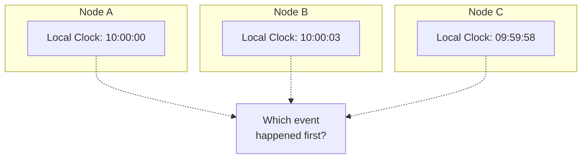
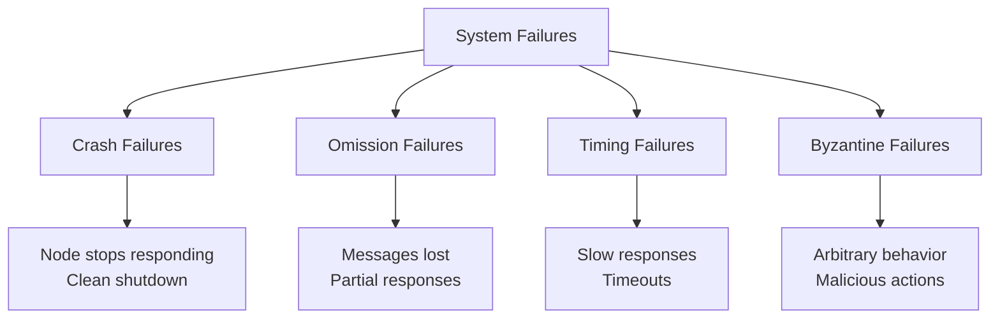
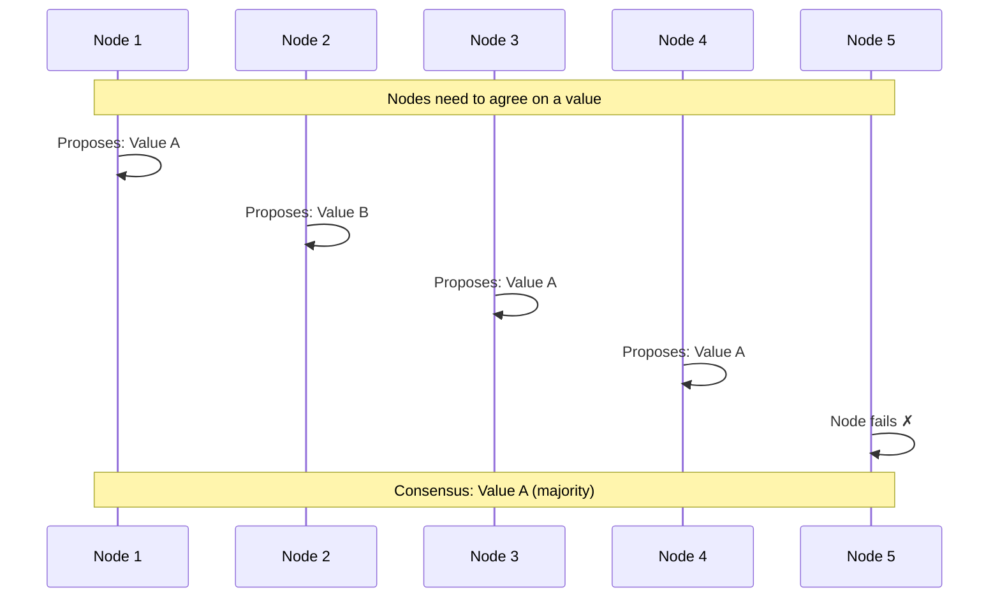
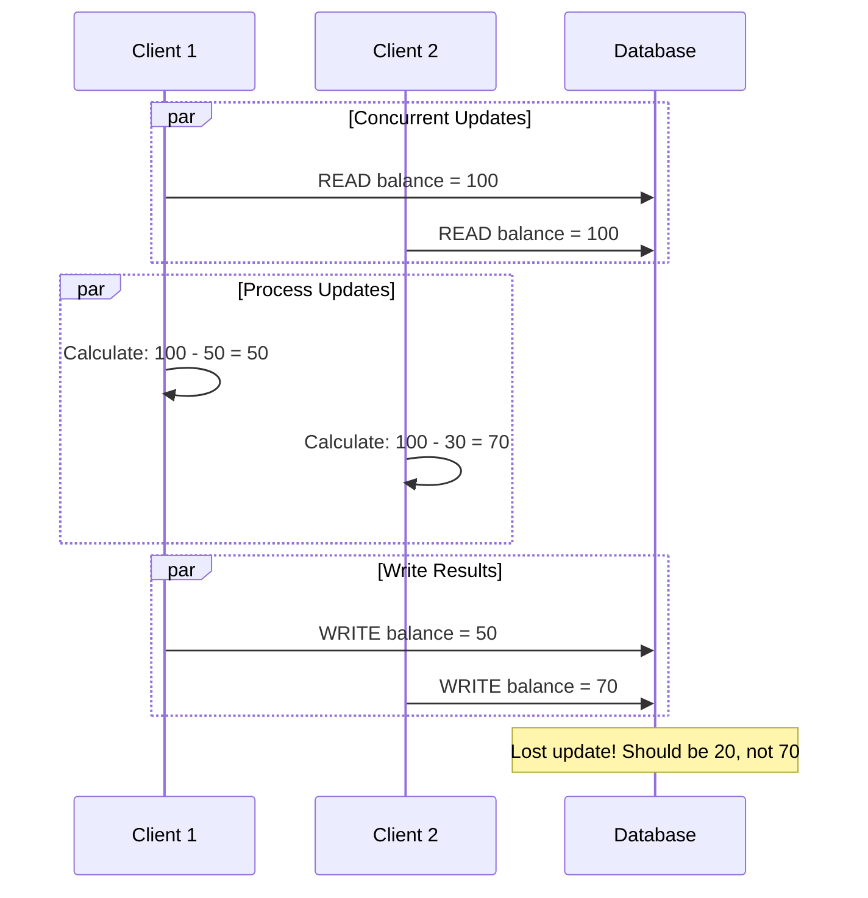
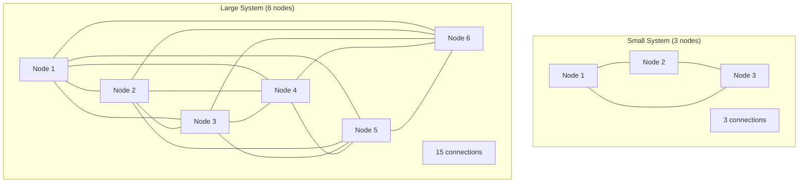

# Distributed System Challenges

## Introduction

Building distributed systems introduces a unique set of challenges that don't exist in single-machine applications. These challenges stem from the fundamental properties of distributed environments: network communication, independent failures, and the lack of global state.

Understanding these challenges is crucial for designing robust distributed systems and avoiding common pitfalls that can lead to data loss, inconsistencies, or system failures.

## Core Challenges Overview



## 1. Network Communication Challenges

### Unreliable Networks

Networks are inherently unreliable and can exhibit various failure modes:



**Common Network Issues**:
- **Packet Loss**: Messages disappear in transit
- **Reordering**: Messages arrive out of order
- **Duplication**: Messages arrive multiple times
- **Corruption**: Message content gets altered
- **Partitions**: Network splits into isolated groups

### Latency and Performance

Network communication is orders of magnitude slower than local operations:

| Operation | Typical Latency |
|-----------|----------------|
| L1 cache reference | 0.5 ns |
| Main memory reference | 100 ns |
| SSD random read | 150,000 ns |
| Network round trip (same datacenter) | 500,000 ns |
| Network round trip (cross-country) | 150,000,000 ns |

**Impact on Design**:
```python
# Bad: Synchronous calls for each item
def get_user_data_sync(user_ids):
    users = []
    for user_id in user_ids:
        user = remote_service.get_user(user_id)  # Network call each time
        users.append(user)
    return users

# Good: Batch requests to minimize network calls
def get_user_data_batch(user_ids):
    return remote_service.get_users_batch(user_ids)  # Single network call

# Better: Asynchronous parallel requests
async def get_user_data_async(user_ids):
    tasks = [remote_service.get_user_async(user_id) for user_id in user_ids]
    return await asyncio.gather(*tasks)
```

### Message Ordering

Without careful design, messages can arrive out of order:



**Solutions**:
- **Sequence Numbers**: Attach monotonic sequence numbers to messages
- **Vector Clocks**: Track causal relationships between events
- **Message Queues**: Use ordered delivery guarantees

## 2. Time and Clock Synchronization

### The Problem with Time

In distributed systems, there's no global clock, and local clocks can drift:



**Clock Drift Issues**:
```python
# Problematic: Using local timestamps for ordering
class EventLog:
    def __init__(self):
        self.events = []
    
    def add_event(self, event):
        timestamp = time.time()  # Local time - unreliable!
        self.events.append((timestamp, event))
    
    def get_ordered_events(self):
        return sorted(self.events, key=lambda x: x[0])  # Wrong order possible
```

### Logical Clocks

**Lamport Timestamps**: Provide logical ordering of events

```python
class LamportClock:
    def __init__(self):
        self.time = 0
    
    def tick(self):
        self.time += 1
        return self.time
    
    def update(self, received_time):
        self.time = max(self.time, received_time) + 1
        return self.time

# Usage
class DistributedNode:
    def __init__(self, node_id):
        self.node_id = node_id
        self.clock = LamportClock()
        self.events = []
    
    def local_event(self, event):
        timestamp = self.clock.tick()
        self.events.append((timestamp, event, self.node_id))
    
    def send_message(self, message, recipient):
        timestamp = self.clock.tick()
        recipient.receive_message(message, timestamp, self.node_id)
    
    def receive_message(self, message, sender_timestamp, sender_id):
        timestamp = self.clock.update(sender_timestamp)
        self.events.append((timestamp, f"Received: {message}", sender_id))
```

**Vector Clocks**: Capture causal relationships more precisely

```python
class VectorClock:
    def __init__(self, node_id, num_nodes):
        self.node_id = node_id
        self.clock = [0] * num_nodes
    
    def tick(self):
        self.clock[self.node_id] += 1
        return self.clock.copy()
    
    def update(self, other_clock):
        for i in range(len(self.clock)):
            self.clock[i] = max(self.clock[i], other_clock[i])
        self.clock[self.node_id] += 1
        return self.clock.copy()
    
    def compare(self, other_clock):
        if all(self.clock[i] <= other_clock[i] for i in range(len(self.clock))):
            if any(self.clock[i] < other_clock[i] for i in range(len(self.clock))):
                return "BEFORE"  # This happened before other
        elif all(self.clock[i] >= other_clock[i] for i in range(len(self.clock))):
            if any(self.clock[i] > other_clock[i] for i in range(len(self.clock))):
                return "AFTER"   # This happened after other
        return "CONCURRENT"      # Events are concurrent
```

## 3. Failure Detection and Handling

### Types of Failures



### Failure Detection

**Heartbeat Mechanism**:
```python
import time
import threading
from enum import Enum

class NodeStatus(Enum):
    ALIVE = "alive"
    SUSPECTED = "suspected" 
    FAILED = "failed"

class FailureDetector:
    def __init__(self, timeout=5.0, cleanup_interval=10.0):
        self.timeout = timeout
        self.cleanup_interval = cleanup_interval
        self.nodes = {}  # node_id -> (last_heartbeat, status)
        self.lock = threading.Lock()
        
        # Start background cleanup thread
        self.cleanup_thread = threading.Thread(target=self._cleanup_loop, daemon=True)
        self.cleanup_thread.start()
    
    def heartbeat(self, node_id):
        with self.lock:
            current_time = time.time()
            self.nodes[node_id] = (current_time, NodeStatus.ALIVE)
    
    def get_node_status(self, node_id):
        with self.lock:
            if node_id not in self.nodes:
                return NodeStatus.FAILED
            
            last_heartbeat, status = self.nodes[node_id]
            current_time = time.time()
            
            if current_time - last_heartbeat > self.timeout:
                if status == NodeStatus.ALIVE:
                    self.nodes[node_id] = (last_heartbeat, NodeStatus.SUSPECTED)
                    return NodeStatus.SUSPECTED
                else:
                    self.nodes[node_id] = (last_heartbeat, NodeStatus.FAILED)
                    return NodeStatus.FAILED
            
            return status
    
    def get_alive_nodes(self):
        alive_nodes = []
        with self.lock:
            for node_id in list(self.nodes.keys()):
                if self.get_node_status(node_id) == NodeStatus.ALIVE:
                    alive_nodes.append(node_id)
        return alive_nodes
    
    def _cleanup_loop(self):
        while True:
            time.sleep(self.cleanup_interval)
            with self.lock:
                current_time = time.time()
                failed_nodes = []
                
                for node_id, (last_heartbeat, status) in self.nodes.items():
                    if current_time - last_heartbeat > self.timeout * 3:
                        failed_nodes.append(node_id)
                
                for node_id in failed_nodes:
                    del self.nodes[node_id]
```

### Handling Partial Failures

**Circuit Breaker Pattern**:
```python
import time
from enum import Enum

class CircuitState(Enum):
    CLOSED = "closed"      # Normal operation
    OPEN = "open"          # Failing, reject requests
    HALF_OPEN = "half_open" # Testing if service recovered

class CircuitBreaker:
    def __init__(self, failure_threshold=5, recovery_timeout=60, success_threshold=3):
        self.failure_threshold = failure_threshold
        self.recovery_timeout = recovery_timeout
        self.success_threshold = success_threshold
        
        self.failure_count = 0
        self.success_count = 0
        self.last_failure_time = None
        self.state = CircuitState.CLOSED
    
    def call(self, func, *args, **kwargs):
        if self.state == CircuitState.OPEN:
            if self._should_attempt_reset():
                self.state = CircuitState.HALF_OPEN
            else:
                raise CircuitBreakerOpenError("Circuit breaker is OPEN")
        
        try:
            result = func(*args, **kwargs)
            self._on_success()
            return result
        except Exception as e:
            self._on_failure()
            raise e
    
    def _should_attempt_reset(self):
        return (self.last_failure_time and 
                time.time() - self.last_failure_time >= self.recovery_timeout)
    
    def _on_success(self):
        self.failure_count = 0
        
        if self.state == CircuitState.HALF_OPEN:
            self.success_count += 1
            if self.success_count >= self.success_threshold:
                self.state = CircuitState.CLOSED
                self.success_count = 0
    
    def _on_failure(self):
        self.failure_count += 1
        self.last_failure_time = time.time()
        
        if self.failure_count >= self.failure_threshold:
            self.state = CircuitState.OPEN
            self.success_count = 0

class CircuitBreakerOpenError(Exception):
    pass

# Usage
circuit_breaker = CircuitBreaker()

def call_external_service():
    try:
        return circuit_breaker.call(external_api.get_data)
    except CircuitBreakerOpenError:
        return get_cached_data()  # Fallback to cache
```

## 4. Consensus and Coordination

### The Consensus Problem

Getting distributed nodes to agree on a single value despite failures:



**Raft Consensus Algorithm** (Simplified):
```python
import random
import time
from enum import Enum

class NodeState(Enum):
    FOLLOWER = "follower"
    CANDIDATE = "candidate"
    LEADER = "leader"

class RaftNode:
    def __init__(self, node_id, cluster_nodes):
        self.node_id = node_id
        self.cluster_nodes = cluster_nodes
        self.state = NodeState.FOLLOWER
        
        # Persistent state
        self.current_term = 0
        self.voted_for = None
        self.log = []
        
        # Volatile state
        self.commit_index = 0
        self.last_applied = 0
        
        # Leader state
        self.next_index = {}
        self.match_index = {}
        
        self.election_timeout = random.uniform(150, 300)  # ms
        self.last_heartbeat = time.time()
    
    def start_election(self):
        """Start leader election process"""
        self.state = NodeState.CANDIDATE
        self.current_term += 1
        self.voted_for = self.node_id
        
        votes = 1  # Vote for self
        
        # Request votes from other nodes
        for node in self.cluster_nodes:
            if node != self.node_id:
                if self.request_vote(node):
                    votes += 1
        
        # Check if won election
        if votes > len(self.cluster_nodes) // 2:
            self.become_leader()
        else:
            self.state = NodeState.FOLLOWER
    
    def request_vote(self, node):
        """Request vote from another node"""
        # Simplified - in real implementation, this would be a network call
        # Return True if vote granted, False otherwise
        return random.choice([True, False])
    
    def become_leader(self):
        """Become the leader"""
        self.state = NodeState.LEADER
        
        # Initialize leader state
        for node in self.cluster_nodes:
            if node != self.node_id:
                self.next_index[node] = len(self.log) + 1
                self.match_index[node] = 0
        
        # Start sending heartbeats
        self.send_heartbeats()
    
    def send_heartbeats(self):
        """Send heartbeat messages to followers"""
        if self.state == NodeState.LEADER:
            for node in self.cluster_nodes:
                if node != self.node_id:
                    self.send_append_entries(node)
    
    def send_append_entries(self, node):
        """Send append entries (heartbeat or log replication)"""
        # Simplified implementation
        pass
    
    def check_election_timeout(self):
        """Check if election timeout has occurred"""
        if (self.state in [NodeState.FOLLOWER, NodeState.CANDIDATE] and
            time.time() - self.last_heartbeat > self.election_timeout / 1000):
            self.start_election()
```

## 5. Data Consistency Challenges

### Concurrent Updates

Multiple clients updating the same data simultaneously:



**Solutions**:

1. **Optimistic Locking**:
```python
class OptimisticLockingStore:
    def __init__(self):
        self.data = {}
        self.versions = {}
    
    def read(self, key):
        value = self.data.get(key)
        version = self.versions.get(key, 0)
        return value, version
    
    def write(self, key, value, expected_version):
        current_version = self.versions.get(key, 0)
        
        if current_version != expected_version:
            raise ConflictError(f"Version mismatch: expected {expected_version}, got {current_version}")
        
        self.data[key] = value
        self.versions[key] = current_version + 1
        return current_version + 1

# Usage
store = OptimisticLockingStore()

def transfer_money(from_account, to_account, amount):
    max_retries = 3
    
    for attempt in range(max_retries):
        try:
            # Read current balances with versions
            from_balance, from_version = store.read(from_account)
            to_balance, to_version = store.read(to_account)
            
            if from_balance < amount:
                raise InsufficientFundsError()
            
            # Update balances
            store.write(from_account, from_balance - amount, from_version)
            store.write(to_account, to_balance + amount, to_version)
            
            return True  # Success
            
        except ConflictError:
            if attempt == max_retries - 1:
                raise
            time.sleep(0.1 * (2 ** attempt))  # Exponential backoff
```

2. **Compare-and-Swap (CAS)**:
```python
class CASStore:
    def __init__(self):
        self.data = {}
    
    def compare_and_swap(self, key, expected_value, new_value):
        current_value = self.data.get(key)
        
        if current_value == expected_value:
            self.data[key] = new_value
            return True
        return False
    
    def atomic_increment(self, key, increment=1):
        max_retries = 100
        
        for _ in range(max_retries):
            current_value = self.data.get(key, 0)
            new_value = current_value + increment
            
            if self.compare_and_swap(key, current_value, new_value):
                return new_value
        
        raise MaxRetriesExceededError()
```

## 6. Scalability Challenges

### Coordination Overhead

As systems grow, coordination becomes expensive:



**Coordination grows as O(n²)** - becomes prohibitive for large systems.

**Solutions**:
- **Hierarchical coordination**: Use coordinator nodes
- **Gossip protocols**: Probabilistic information dissemination
- **Partitioning**: Reduce coordination scope

### State Management

Keeping shared state synchronized across many nodes:

```python
class DistributedCounter:
    """Example of challenging distributed state management"""
    
    def __init__(self, node_id, cluster_nodes):
        self.node_id = node_id
        self.cluster_nodes = cluster_nodes
        self.local_count = 0
        self.vector_clock = VectorClock(node_id, len(cluster_nodes))
    
    def increment(self):
        """Increment counter - requires coordination"""
        # Option 1: Broadcast to all nodes (expensive)
        self.broadcast_increment()
        
        # Option 2: Use consensus (slow but consistent)
        # self.consensus_increment()
        
        # Option 3: Local increment + gossip (fast but eventually consistent)
        # self.local_increment_with_gossip()
    
    def broadcast_increment(self):
        """Synchronous broadcast - expensive but consistent"""
        timestamp = self.vector_clock.tick()
        
        # Send to all nodes and wait for acknowledgment
        acks = 0
        for node in self.cluster_nodes:
            if node != self.node_id:
                if self.send_increment(node, timestamp):
                    acks += 1
        
        # Only commit if majority acknowledges
        if acks >= len(self.cluster_nodes) // 2:
            self.local_count += 1
        else:
            raise ConsensusError("Failed to get majority agreement")
```

## Best Practices for Handling Challenges

### 1. Design for Failure
```python
class ResilientService:
    def __init__(self):
        self.circuit_breaker = CircuitBreaker()
        self.retry_policy = ExponentialBackoff()
        self.fallback_cache = Cache()
    
    def get_data(self, key):
        try:
            return self.circuit_breaker.call(self._fetch_from_primary, key)
        except (CircuitBreakerOpenError, NetworkError):
            # Fallback to cache
            cached_data = self.fallback_cache.get(key)
            if cached_data:
                return cached_data
            
            # Last resort: try secondary service
            return self._fetch_from_secondary(key)
```

### 2. Embrace Eventual Consistency
```python
class EventuallyConsistentStore:
    def __init__(self):
        self.local_store = {}
        self.pending_updates = []
        self.conflict_resolver = LastWriterWinsResolver()
    
    def write(self, key, value):
        # Write locally immediately
        timestamp = time.time()
        self.local_store[key] = (value, timestamp)
        
        # Queue for async replication
        self.pending_updates.append((key, value, timestamp))
        
        # Return immediately (don't wait for replication)
        return True
    
    def read(self, key):
        # Return local value (may be stale)
        if key in self.local_store:
            return self.local_store[key][0]
        return None
```

### 3. Use Idempotent Operations
```python
class IdempotentOperations:
    def __init__(self):
        self.processed_operations = set()
    
    def transfer_money(self, operation_id, from_account, to_account, amount):
        # Check if already processed
        if operation_id in self.processed_operations:
            return self.get_operation_result(operation_id)
        
        try:
            # Perform the transfer
            result = self._do_transfer(from_account, to_account, amount)
            
            # Mark as processed
            self.processed_operations.add(operation_id)
            self.store_operation_result(operation_id, result)
            
            return result
        except Exception as e:
            # Don't mark as processed on failure
            raise e
```

### 4. Monitor and Observe
```python
class DistributedSystemMonitor:
    def __init__(self):
        self.metrics = MetricsCollector()
        self.logger = StructuredLogger()
        self.tracer = DistributedTracer()
    
    def track_operation(self, operation_name):
        def decorator(func):
            def wrapper(*args, **kwargs):
                start_time = time.time()
                trace_id = self.tracer.start_trace(operation_name)
                
                try:
                    result = func(*args, **kwargs)
                    
                    # Record success metrics
                    duration = time.time() - start_time
                    self.metrics.record_success(operation_name, duration)
                    
                    return result
                    
                except Exception as e:
                    # Record failure metrics
                    self.metrics.record_failure(operation_name, str(e))
                    self.logger.error(f"Operation {operation_name} failed", 
                                    trace_id=trace_id, error=str(e))
                    raise
                finally:
                    self.tracer.end_trace(trace_id)
            
            return wrapper
        return decorator
```

## Summary

Distributed systems face fundamental challenges that require careful design and implementation:

**Key Challenges**:
1. **Network Issues**: Unreliability, latency, partitions, message ordering
2. **Time Synchronization**: No global clock, logical ordering needed
3. **Failure Handling**: Detection, partial failures, recovery strategies
4. **Consensus**: Getting nodes to agree despite failures
5. **Data Consistency**: Concurrent updates, conflict resolution
6. **Scalability**: Coordination overhead, state management complexity

**Design Principles**:
- **Assume failures will happen** and design accordingly
- **Use appropriate consistency models** for different data types
- **Implement proper monitoring** and observability
- **Design idempotent operations** to handle retries safely
- **Use proven patterns** like circuit breakers and exponential backoff

**Next Steps**:
- Study specific consensus algorithms (Raft, Paxos)
- Learn about distributed system patterns and architectures
- Practice implementing failure detection and recovery mechanisms
- Understand monitoring and debugging distributed systems

**Next**: Explore [Real-world Examples & Case Studies](06-case-studies.md) to see how major companies handle these challenges in practice.
