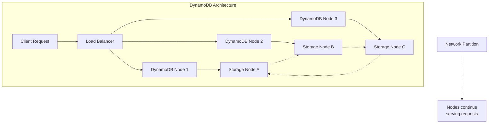
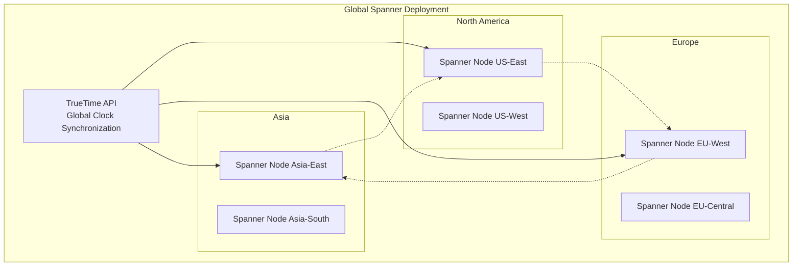
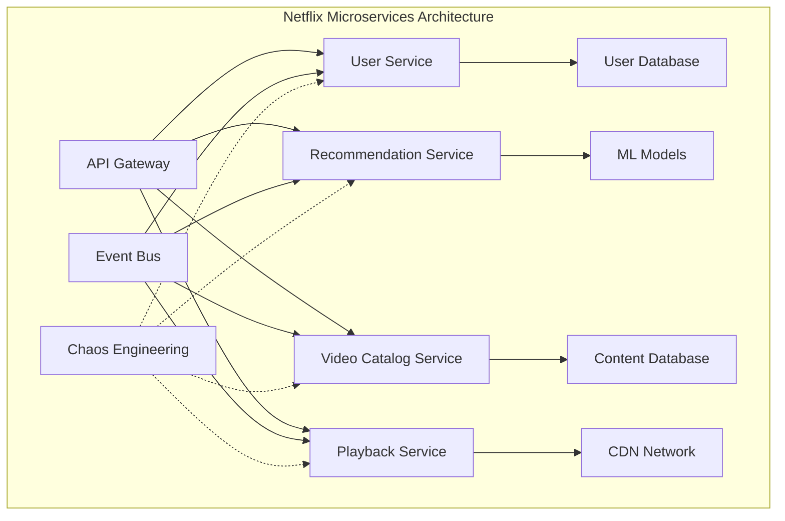
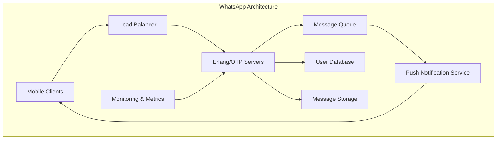

# Real-world Examples & Case Studies

## Introduction

Understanding distributed systems theory is important, but seeing how real companies apply these concepts at scale provides invaluable insights. This section examines how major technology companies have solved distributed systems challenges, the trade-offs they made, and the lessons learned from their experiences.

These case studies demonstrate that there's no one-size-fits-all solution - each system makes different trade-offs based on their specific requirements, scale, and constraints.

## Case Study 1: Amazon DynamoDB - Choosing Availability

### Background
Amazon DynamoDB is a fully managed NoSQL database service that prioritizes availability and partition tolerance over strong consistency. It was designed to handle Amazon's massive e-commerce workload during peak shopping events.

### System Requirements
- **Scale**: Handle millions of requests per second
- **Availability**: 99.99% uptime requirement
- **Global**: Serve customers worldwide with low latency
- **Predictable Performance**: Consistent response times under load

### CAP Theorem Choice: AP (Availability + Partition Tolerance)



### Key Design Decisions

#### 1. Eventual Consistency Model
```python
# DynamoDB consistency example
import boto3

dynamodb = boto3.resource('dynamodb')
table = dynamodb.Table('UserProfiles')

# Eventually consistent read (default) - faster, may be stale
response = table.get_item(
    Key={'user_id': '12345'},
    ConsistentRead=False  # Eventually consistent
)

# Strongly consistent read - slower, always current
response = table.get_item(
    Key={'user_id': '12345'},
    ConsistentRead=True   # Strong consistency
)
```

#### 2. Consistent Hashing for Partitioning
```python
class ConsistentHashing:
    def __init__(self, nodes, replicas=3):
        self.replicas = replicas
        self.ring = {}
        self.sorted_keys = []
        
        for node in nodes:
            self.add_node(node)
    
    def add_node(self, node):
        for i in range(self.replicas):
            key = self.hash(f"{node}:{i}")
            self.ring[key] = node
            self.sorted_keys.append(key)
        self.sorted_keys.sort()
    
    def get_node(self, key):
        if not self.ring:
            return None
        
        hash_key = self.hash(key)
        
        # Find the first node clockwise from the hash
        for ring_key in self.sorted_keys:
            if hash_key <= ring_key:
                return self.ring[ring_key]
        
        # Wrap around to the first node
        return self.ring[self.sorted_keys[0]]
    
    def hash(self, key):
        return hash(key) % (2**32)

# Usage for DynamoDB-style partitioning
nodes = ['node1', 'node2', 'node3', 'node4']
hash_ring = ConsistentHashing(nodes)

# Data is distributed across nodes
user_data_node = hash_ring.get_node('user:12345')
order_data_node = hash_ring.get_node('order:67890')
```

#### 3. Vector Clocks for Conflict Resolution
```python
class DynamoDBVectorClock:
    def __init__(self):
        self.clock = {}  # node_id -> timestamp
    
    def increment(self, node_id):
        self.clock[node_id] = self.clock.get(node_id, 0) + 1
    
    def update(self, other_clock):
        for node_id, timestamp in other_clock.clock.items():
            self.clock[node_id] = max(self.clock.get(node_id, 0), timestamp)
    
    def compare(self, other_clock):
        # Determine if this clock happens before, after, or concurrent with other
        self_dominates = False
        other_dominates = False
        
        all_nodes = set(self.clock.keys()) | set(other_clock.clock.keys())
        
        for node_id in all_nodes:
            self_time = self.clock.get(node_id, 0)
            other_time = other_clock.clock.get(node_id, 0)
            
            if self_time > other_time:
                self_dominates = True
            elif self_time < other_time:
                other_dominates = True
        
        if self_dominates and not other_dominates:
            return "AFTER"
        elif other_dominates and not self_dominates:
            return "BEFORE"
        else:
            return "CONCURRENT"
```

### Lessons Learned

**✅ What Worked**:
- **High Availability**: Achieved 99.99% uptime even during massive traffic spikes
- **Predictable Performance**: Consistent latency regardless of data size
- **Automatic Scaling**: Handles traffic spikes without manual intervention
- **Global Distribution**: Low latency worldwide through regional replicas

**⚠️ Trade-offs Made**:
- **Eventual Consistency**: Applications must handle stale reads
- **Limited Query Patterns**: No complex joins or aggregations
- **Conflict Resolution**: Applications must handle concurrent updates

**📚 Key Insights**:
- Choosing AP over CP enabled massive scale and availability
- Consistent hashing allows seamless scaling without downtime
- Vector clocks provide a principled approach to conflict resolution
- Tunable consistency gives applications flexibility

## Case Study 2: Google Spanner - Global Strong Consistency

### Background
Google Spanner is a globally distributed database that provides strong consistency across multiple continents. It was designed to support Google's global applications like Gmail and Google Ads.

### System Requirements
- **Global Scale**: Span multiple continents
- **Strong Consistency**: ACID transactions across regions
- **High Availability**: Survive datacenter outages
- **SQL Support**: Familiar query interface for developers

### CAP Theorem Choice: CP (Consistency + Partition Tolerance)



### Key Design Decisions

#### 1. TrueTime API for Global Ordering
```python
class TrueTimeAPI:
    """Simplified version of Google's TrueTime API"""
    
    def __init__(self, uncertainty_ms=7):
        self.uncertainty_ms = uncertainty_ms
    
    def now(self):
        """Returns time interval [earliest, latest] for current time"""
        current_time = time.time() * 1000  # Convert to milliseconds
        uncertainty = self.uncertainty_ms
        
        return {
            'earliest': current_time - uncertainty,
            'latest': current_time + uncertainty
        }
    
    def after(self, timestamp):
        """Returns True if current time is definitely after timestamp"""
        current = self.now()
        return current['earliest'] > timestamp
    
    def before(self, timestamp):
        """Returns True if current time is definitely before timestamp"""
        current = self.now()
        return current['latest'] < timestamp

class SpannerTransaction:
    def __init__(self, truetime_api):
        self.truetime = truetime_api
        self.start_time = None
        self.commit_timestamp = None
    
    def begin(self):
        """Begin transaction with TrueTime timestamp"""
        time_interval = self.truetime.now()
        self.start_time = time_interval['latest']  # Use latest for safety
    
    def commit(self):
        """Commit transaction with globally unique timestamp"""
        # Wait until we're sure the timestamp is in the past everywhere
        commit_time = self.truetime.now()['latest']
        
        # Wait for uncertainty to pass
        while not self.truetime.after(commit_time):
            time.sleep(0.001)  # Wait 1ms
        
        self.commit_timestamp = commit_time
        return self.commit_timestamp
```

#### 2. Paxos for Consensus
```python
class PaxosNode:
    """Simplified Paxos implementation for Spanner"""
    
    def __init__(self, node_id, cluster_nodes):
        self.node_id = node_id
        self.cluster_nodes = cluster_nodes
        self.promised_proposal = None
        self.accepted_proposal = None
        self.accepted_value = None
    
    def prepare(self, proposal_number):
        """Phase 1: Prepare"""
        if (self.promised_proposal is None or 
            proposal_number > self.promised_proposal):
            
            self.promised_proposal = proposal_number
            
            return {
                'promise': True,
                'accepted_proposal': self.accepted_proposal,
                'accepted_value': self.accepted_value
            }
        else:
            return {'promise': False}
    
    def accept(self, proposal_number, value):
        """Phase 2: Accept"""
        if (self.promised_proposal is None or 
            proposal_number >= self.promised_proposal):
            
            self.promised_proposal = proposal_number
            self.accepted_proposal = proposal_number
            self.accepted_value = value
            
            return {'accepted': True}
        else:
            return {'accepted': False}
    
    def propose_value(self, value):
        """Full Paxos protocol to propose a value"""
        proposal_number = self.generate_proposal_number()
        
        # Phase 1: Prepare
        promises = []
        for node in self.cluster_nodes:
            response = node.prepare(proposal_number)
            if response['promise']:
                promises.append(response)
        
        # Need majority to proceed
        if len(promises) <= len(self.cluster_nodes) // 2:
            return False  # Failed to get majority
        
        # Choose value (use highest accepted value if any)
        chosen_value = value
        highest_proposal = -1
        
        for promise in promises:
            if (promise['accepted_proposal'] is not None and
                promise['accepted_proposal'] > highest_proposal):
                highest_proposal = promise['accepted_proposal']
                chosen_value = promise['accepted_value']
        
        # Phase 2: Accept
        accepts = []
        for node in self.cluster_nodes:
            response = node.accept(proposal_number, chosen_value)
            if response['accepted']:
                accepts.append(response)
        
        # Need majority to commit
        return len(accepts) > len(self.cluster_nodes) // 2
```

#### 3. Multi-Version Concurrency Control
```python
class SpannerMVCC:
    """Multi-Version Concurrency Control for Spanner"""
    
    def __init__(self):
        self.data = {}  # key -> [(timestamp, value), ...]
        self.locks = {}  # key -> lock_info
    
    def read(self, key, timestamp):
        """Read value as of specific timestamp"""
        if key not in self.data:
            return None
        
        versions = self.data[key]
        
        # Find the latest version at or before timestamp
        for ts, value in reversed(versions):
            if ts <= timestamp:
                return value
        
        return None  # No version available at that timestamp
    
    def write(self, key, value, timestamp):
        """Write value with timestamp"""
        if key not in self.data:
            self.data[key] = []
        
        # Insert in timestamp order
        versions = self.data[key]
        versions.append((timestamp, value))
        versions.sort(key=lambda x: x[0])
    
    def acquire_lock(self, key, transaction_id, lock_type='write'):
        """Acquire lock for transaction"""
        if key in self.locks:
            existing_lock = self.locks[key]
            if existing_lock['transaction_id'] != transaction_id:
                return False  # Lock held by another transaction
        
        self.locks[key] = {
            'transaction_id': transaction_id,
            'lock_type': lock_type,
            'timestamp': time.time()
        }
        return True
    
    def release_lock(self, key, transaction_id):
        """Release lock held by transaction"""
        if (key in self.locks and 
            self.locks[key]['transaction_id'] == transaction_id):
            del self.locks[key]
```

### Lessons Learned

**✅ What Worked**:
- **Global Strong Consistency**: Enables complex multi-region transactions
- **SQL Interface**: Familiar to developers, easier adoption
- **Automatic Sharding**: Transparent scaling without application changes
- **High Availability**: Survives datacenter failures through replication

**⚠️ Trade-offs Made**:
- **Higher Latency**: Global coordination adds latency to transactions
- **Complex Infrastructure**: Requires atomic clocks and specialized hardware
- **Reduced Availability**: System may become unavailable during partitions

**📚 Key Insights**:
- TrueTime API enables global ordering without perfect clock synchronization
- Strong consistency is possible at global scale with proper infrastructure
- Paxos provides the foundation for distributed consensus
- Multi-version concurrency control enables high read throughput

## Case Study 3: Netflix - Microservices and Eventual Consistency

### Background
Netflix transformed from a DVD-by-mail service to a global streaming platform serving over 200 million subscribers. Their architecture evolved to handle massive scale while maintaining high availability.

### System Requirements
- **Global Scale**: Serve 200+ million users worldwide
- **High Availability**: 99.99% uptime for streaming
- **Rapid Development**: Deploy hundreds of times per day
- **Personalization**: Real-time recommendations for each user

### Architecture Evolution



### Key Design Decisions

#### 1. Microservices with Eventual Consistency
```python
class NetflixEventDrivenArchitecture:
    """Example of Netflix's event-driven microservices"""
    
    def __init__(self):
        self.event_bus = EventBus()
        self.services = {
            'user_service': UserService(self.event_bus),
            'recommendation_service': RecommendationService(self.event_bus),
            'viewing_service': ViewingService(self.event_bus)
        }
    
    def handle_user_action(self, user_id, action, data):
        """Handle user action with eventual consistency"""
        
        # Publish event immediately
        event = {
            'event_type': action,
            'user_id': user_id,
            'data': data,
            'timestamp': time.time()
        }
        
        self.event_bus.publish(event)
        
        # Services process asynchronously
        return {'status': 'accepted'}

class RecommendationService:
    def __init__(self, event_bus):
        self.event_bus = event_bus
        self.user_profiles = {}
        self.event_bus.subscribe('user_watched_video', self.update_recommendations)
    
    def update_recommendations(self, event):
        """Update recommendations based on viewing history"""
        user_id = event['user_id']
        video_id = event['data']['video_id']
        
        # Update user profile asynchronously
        if user_id not in self.user_profiles:
            self.user_profiles[user_id] = {'watched': [], 'preferences': {}}
        
        self.user_profiles[user_id]['watched'].append(video_id)
        
        # Trigger ML model update (async)
        self.schedule_model_update(user_id)
    
    def get_recommendations(self, user_id):
        """Get current recommendations (may be stale)"""
        profile = self.user_profiles.get(user_id, {})
        
        # Return best available recommendations
        # May not include very recent viewing history
        return self.generate_recommendations(profile)
```

#### 2. Circuit Breaker Pattern
```python
class NetflixCircuitBreaker:
    """Netflix's Hystrix-inspired circuit breaker"""
    
    def __init__(self, failure_threshold=50, request_threshold=20, timeout=60):
        self.failure_threshold = failure_threshold  # Percentage
        self.request_threshold = request_threshold   # Minimum requests
        self.timeout = timeout                      # Seconds
        
        self.failure_count = 0
        self.success_count = 0
        self.last_failure_time = None
        self.state = 'CLOSED'
    
    def call(self, func, fallback=None, *args, **kwargs):
        """Execute function with circuit breaker protection"""
        
        if self.state == 'OPEN':
            if self._should_attempt_reset():
                self.state = 'HALF_OPEN'
            else:
                if fallback:
                    return fallback(*args, **kwargs)
                raise CircuitBreakerOpenError()
        
        try:
            result = func(*args, **kwargs)
            self._on_success()
            return result
            
        except Exception as e:
            self._on_failure()
            
            if fallback:
                return fallback(*args, **kwargs)
            raise e
    
    def _on_success(self):
        self.success_count += 1
        
        if self.state == 'HALF_OPEN':
            # Reset to closed after successful call
            self.state = 'CLOSED'
            self.failure_count = 0
    
    def _on_failure(self):
        self.failure_count += 1
        self.last_failure_time = time.time()
        
        total_requests = self.success_count + self.failure_count
        
        if (total_requests >= self.request_threshold and
            (self.failure_count / total_requests) * 100 >= self.failure_threshold):
            self.state = 'OPEN'

# Usage in Netflix services
recommendation_circuit = NetflixCircuitBreaker()

def get_recommendations_with_fallback(user_id):
    def get_personalized_recommendations():
        return ml_service.get_recommendations(user_id)
    
    def fallback_recommendations():
        # Return popular content as fallback
        return content_service.get_trending_content()
    
    return recommendation_circuit.call(
        get_personalized_recommendations,
        fallback=fallback_recommendations
    )
```

#### 3. Chaos Engineering
```python
class ChaosMonkey:
    """Netflix's Chaos Engineering approach"""
    
    def __init__(self, failure_probability=0.01):
        self.failure_probability = failure_probability
        self.active_failures = {}
    
    def maybe_inject_failure(self, service_name, operation):
        """Randomly inject failures to test resilience"""
        
        if random.random() < self.failure_probability:
            failure_type = random.choice([
                'network_timeout',
                'service_unavailable', 
                'high_latency',
                'partial_failure'
            ])
            
            return self._inject_failure(service_name, operation, failure_type)
        
        return None  # No failure injected
    
    def _inject_failure(self, service_name, operation, failure_type):
        failure_id = f"{service_name}:{operation}:{time.time()}"
        
        if failure_type == 'network_timeout':
            raise TimeoutError("Chaos Monkey: Network timeout")
        elif failure_type == 'service_unavailable':
            raise ServiceUnavailableError("Chaos Monkey: Service down")
        elif failure_type == 'high_latency':
            time.sleep(random.uniform(2, 5))  # Inject latency
        elif failure_type == 'partial_failure':
            if random.random() < 0.5:
                raise PartialFailureError("Chaos Monkey: Partial failure")

# Integration with services
chaos_monkey = ChaosMonkey()

class ResilientService:
    def __init__(self, service_name):
        self.service_name = service_name
        self.circuit_breaker = NetflixCircuitBreaker()
    
    def call_external_service(self, operation, *args, **kwargs):
        # Chaos engineering
        chaos_monkey.maybe_inject_failure(self.service_name, operation)
        
        # Circuit breaker protection
        return self.circuit_breaker.call(
            self._actual_service_call,
            fallback=self._fallback_response,
            operation, *args, **kwargs
        )
```

### Lessons Learned

**✅ What Worked**:
- **Microservices**: Independent scaling and deployment
- **Eventual Consistency**: High availability with acceptable trade-offs
- **Circuit Breakers**: Graceful degradation during failures
- **Chaos Engineering**: Proactive resilience testing

**⚠️ Trade-offs Made**:
- **Complexity**: Hundreds of services to manage
- **Eventual Consistency**: Users may see stale recommendations
- **Operational Overhead**: Sophisticated monitoring and tooling required

**📚 Key Insights**:
- Embrace failure as inevitable and design for it
- Eventual consistency enables independent service scaling
- Fallback mechanisms provide graceful degradation
- Chaos engineering builds confidence in system resilience

## Case Study 4: WhatsApp - Simplicity at Scale

### Background
WhatsApp handles over 100 billion messages per day with a remarkably small engineering team (50 engineers when acquired by Facebook). Their success demonstrates that simple, well-designed systems can achieve massive scale.

### System Requirements
- **Massive Scale**: Billions of messages daily
- **Low Latency**: Real-time message delivery
- **High Availability**: Always-on communication
- **Simplicity**: Small team, minimal complexity

### Architecture Philosophy: Keep It Simple



### Key Design Decisions

#### 1. Erlang/OTP for Concurrency
```erlang
% Simplified WhatsApp message handling in Erlang
-module(whatsapp_message_handler).
-behaviour(gen_server).

% Handle incoming message
handle_cast({send_message, From, To, Message}, State) ->
    % Validate message
    case validate_message(Message) of
        {ok, ValidMessage} ->
            % Store message
            store_message(From, To, ValidMessage),
            
            % Route to recipient
            route_message(To, ValidMessage),
            
            % Send delivery confirmation
            send_ack(From, ValidMessage#message.id);
        
        {error, Reason} ->
            send_error(From, Reason)
    end,
    {noreply, State}.

% Route message to recipient
route_message(UserId, Message) ->
    case user_connection_manager:get_connection(UserId) of
        {ok, ConnectionPid} ->
            % User is online, deliver immediately
            ConnectionPid ! {deliver_message, Message};
        
        {error, offline} ->
            % User is offline, queue for later delivery
            message_queue:enqueue(UserId, Message),
            
            % Send push notification
            push_notification_service:send_notification(UserId, Message)
    end.
```

#### 2. Simple Message Protocol
```python
class WhatsAppMessage:
    """Simplified WhatsApp message structure"""
    
    def __init__(self, from_user, to_user, content, message_type='text'):
        self.id = self.generate_message_id()
        self.from_user = from_user
        self.to_user = to_user
        self.content = content
        self.message_type = message_type
        self.timestamp = time.time()
        self.status = 'sent'
    
    def generate_message_id(self):
        """Generate unique message ID"""
        return f"{int(time.time() * 1000)}_{random.randint(1000, 9999)}"
    
    def to_protocol_buffer(self):
        """Convert to efficient binary format"""
        return {
            'id': self.id,
            'from': self.from_user,
            'to': self.to_user,
            'content': self.content,
            'type': self.message_type,
            'timestamp': self.timestamp
        }

class MessageDeliveryService:
    def __init__(self):
        self.connection_manager = ConnectionManager()
        self.message_queue = MessageQueue()
        self.push_service = PushNotificationService()
    
    def send_message(self, message):
        """Send message with delivery guarantees"""
        
        # Store message for reliability
        self.store_message(message)
        
        # Try immediate delivery
        if self.connection_manager.is_user_online(message.to_user):
            success = self.deliver_immediately(message)
            if success:
                message.status = 'delivered'
                return True
        
        # Queue for later delivery
        self.message_queue.enqueue(message.to_user, message)
        
        # Send push notification
        self.push_service.notify_user(message.to_user, message)
        
        return True
    
    def deliver_immediately(self, message):
        """Deliver message to online user"""
        try:
            connection = self.connection_manager.get_connection(message.to_user)
            connection.send(message.to_protocol_buffer())
            return True
        except ConnectionError:
            return False
```

#### 3. Efficient Resource Usage
```python
class WhatsAppResourceOptimization:
    """WhatsApp's approach to resource efficiency"""
    
    def __init__(self):
        self.connection_pools = {}
        self.message_cache = LRUCache(maxsize=1000000)
        self.user_sessions = {}
    
    def optimize_memory_usage(self):
        """Aggressive memory optimization"""
        
        # Use connection pooling
        self.manage_connection_pools()
        
        # Cache frequently accessed messages
        self.optimize_message_cache()
        
        # Compress stored data
        self.compress_message_storage()
    
    def manage_connection_pools(self):
        """Efficient connection management"""
        
        # Pool connections by region/server
        for region in ['us-east', 'eu-west', 'asia-south']:
            if region not in self.connection_pools:
                self.connection_pools[region] = ConnectionPool(
                    max_connections=1000,
                    idle_timeout=300,  # 5 minutes
                    max_lifetime=3600  # 1 hour
                )
    
    def optimize_message_cache(self):
        """Cache recent messages for fast delivery"""
        
        # Keep recent messages in memory
        # Older messages stored in database
        cache_policy = {
            'recent_messages': '1 hour',
            'user_conversations': '24 hours',
            'group_messages': '6 hours'
        }
        
        return cache_policy
    
    def compress_message_storage(self):
        """Compress messages for storage efficiency"""
        
        compression_strategies = {
            'text_messages': 'gzip',
            'images': 'jpeg_optimization',
            'videos': 'h264_compression',
            'documents': 'zip_compression'
        }
        
        return compression_strategies

# Erlang-style process supervision in Python
class SupervisorTree:
    """Simplified version of Erlang's supervision tree"""
    
    def __init__(self):
        self.children = {}
        self.restart_strategies = {}
    
    def start_child(self, child_id, child_class, restart_strategy='permanent'):
        """Start supervised child process"""
        
        self.restart_strategies[child_id] = restart_strategy
        
        try:
            child = child_class()
            child.start()
            self.children[child_id] = child
            
        except Exception as e:
            self.handle_child_failure(child_id, e)
    
    def handle_child_failure(self, child_id, error):
        """Handle child process failure"""
        
        strategy = self.restart_strategies.get(child_id, 'permanent')
        
        if strategy == 'permanent':
            # Always restart
            self.restart_child(child_id)
            
        elif strategy == 'temporary':
            # Don't restart, just log
            self.log_failure(child_id, error)
            
        elif strategy == 'transient':
            # Restart only if abnormal termination
            if not isinstance(error, NormalShutdown):
                self.restart_child(child_id)
    
    def restart_child(self, child_id):
        """Restart failed child process"""
        
        # Clean up old process
        if child_id in self.children:
            del self.children[child_id]
        
        # Start new instance
        child_class = self.get_child_class(child_id)
        self.start_child(child_id, child_class)
```

### Lessons Learned

**✅ What Worked**:
- **Simplicity**: Fewer moving parts, easier to debug and scale
- **Erlang/OTP**: Excellent for concurrent, fault-tolerant systems
- **Efficient Protocols**: Binary protocols reduce bandwidth
- **Let It Crash**: Embrace failures and restart quickly

**⚠️ Trade-offs Made**:
- **Limited Features**: Focus on core messaging functionality
- **Technology Lock-in**: Heavy investment in Erlang ecosystem
- **Scaling Challenges**: Eventually needed Facebook's infrastructure

**📚 Key Insights**:
- Simple systems can achieve massive scale
- Choose the right technology for your problem domain
- Operational simplicity is as important as technical simplicity
- Focus on core functionality before adding features

## Comparative Analysis

| System | CAP Choice | Consistency Model | Key Innovation | Primary Trade-off |
|--------|------------|-------------------|----------------|-------------------|
| **DynamoDB** | AP | Eventual | Consistent Hashing | Consistency for Availability |
| **Spanner** | CP | Strong | TrueTime API | Availability for Consistency |
| **Netflix** | AP | Eventual | Circuit Breakers | Complexity for Resilience |
| **WhatsApp** | CP | Strong | Erlang/OTP | Features for Simplicity |

## Key Takeaways

### 1. **No Universal Solution**
Each system made different trade-offs based on their specific requirements:
- **DynamoDB**: Chose availability for e-commerce workloads
- **Spanner**: Chose consistency for financial applications
- **Netflix**: Chose resilience for entertainment streaming
- **WhatsApp**: Chose simplicity for messaging

### 2. **Technology Choices Matter**
The right technology can make complex problems simpler:
- **Erlang/OTP**: Natural fit for concurrent messaging systems
- **TrueTime**: Enables global consistency without perfect clocks
- **Consistent Hashing**: Elegant solution for distributed partitioning

### 3. **Operational Considerations**
System design must consider operational complexity:
- **Monitoring and Debugging**: Essential for distributed systems
- **Deployment and Updates**: Must work with system architecture
- **Team Size and Skills**: Influence technology choices

### 4. **Evolution Over Time**
Systems evolve as requirements change:
- Start simple and add complexity as needed
- Be prepared to re-architect as scale increases
- Learn from failures and iterate

## Summary

Real-world distributed systems demonstrate that:

1. **Requirements Drive Design**: Each system optimized for different priorities
2. **Trade-offs Are Inevitable**: No system gets everything for free
3. **Simplicity Has Value**: Simple systems are easier to operate and debug
4. **Technology Matters**: Choose tools that fit your problem domain
5. **Operations Are Critical**: Design for monitoring, debugging, and maintenance

**Next Steps**:
- Study the specific technologies used by these systems
- Practice implementing similar patterns in your own projects
- Consider how these lessons apply to your system requirements
- Experiment with different consistency models and trade-offs

This concludes Chapter 3 on Distributed Systems Basics. You now have a solid foundation for understanding how distributed systems work, their challenges, and how real companies solve them at scale.
