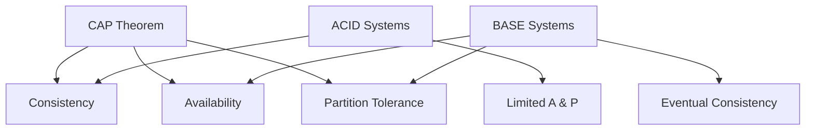

# BASE Properties

## Introduction

BASE properties represent a different approach to data consistency, prioritizing availability and partition tolerance over immediate consistency. Coined by Dan Pritchett in 2008, BASE stands for **Basically Available**, **Soft state**, and **Eventual consistency**.

BASE emerged as a response to the limitations of ACID in web-scale distributed systems. While ACID provides strong guarantees, it can become a bottleneck when dealing with millions of users across global networks. BASE offers a more flexible approach that enables systems to remain operational even during network partitions or node failures.

The BASE model aligns with the CAP theorem, choosing Availability and Partition tolerance over Consistency, making it ideal for large-scale distributed systems like social media platforms, content delivery networks, and e-commerce sites.

## The Three BASE Properties

### Basically Available: System Remains Operational

**Definition**: The system remains available and responsive, even if some components fail or become temporarily unavailable.

**Key Principle**: Partial functionality is better than complete system failure. The system degrades gracefully rather than becoming completely unavailable.

**Implementation Strategies**:

1. **Redundancy and Replication**:
```
User Request → Load Balancer → [Server 1] [Server 2] [Server 3]
                                  ↓         ↓         ↓
                              [Database] [Database] [Database]
                               Replica 1  Replica 2  Replica 3
```

2. **Graceful Degradation**:
```javascript
// E-commerce example
function getProductRecommendations(userId) {
  try {
    return aiRecommendationService.getRecommendations(userId);
  } catch (ServiceUnavailableError) {
    // Fallback to basic recommendations
    return popularProductsService.getTopProducts();
  } catch (AllServicesDownError) {
    // Minimal fallback
    return defaultProductList;
  }
}
```

**Real-World Examples**:

- **Amazon**: If recommendation service fails, show popular products instead
- **Netflix**: If personalized content fails, show trending content
- **Twitter**: If timeline service is slow, show cached tweets
- **Google Search**: If some data centers are down, serve results from available ones

**Availability Patterns**:
- **Circuit Breaker**: Stop calling failing services temporarily
- **Bulkhead**: Isolate critical resources from non-critical ones
- **Timeout and Retry**: Handle temporary failures gracefully
- **Fallback**: Provide alternative responses when primary service fails

### Soft State: Data May Change Over Time

**Definition**: The system's state may change over time, even without new input, as the system works toward consistency.

**Key Principle**: Unlike ACID's hard state (data is consistent at all times), BASE allows temporary inconsistencies that resolve themselves over time.

**Characteristics of Soft State**:

1. **Temporary Inconsistencies**: Different nodes may have different values temporarily
2. **Self-Healing**: System automatically resolves inconsistencies
3. **Time-Bounded**: Inconsistencies have a maximum duration
4. **Application-Aware**: Applications must handle inconsistent reads

**Example - Social Media Friend Count**:
```javascript
// User A adds User B as friend
// Different services may show different friend counts temporarily

// User Service (immediately updated)
userService.getFriendCount('userA'); // Returns 151

// Analytics Service (updated asynchronously)  
analyticsService.getFriendCount('userA'); // Still returns 150

// Notification Service (batch updated every 5 minutes)
notificationService.getFriendCount('userA'); // Still returns 150

// After eventual consistency (within minutes)
// All services return 151
```

**Soft State Management**:
- **Version Vectors**: Track causality between updates
- **Conflict Resolution**: Automatic or manual resolution of conflicts
- **Reconciliation**: Background processes to sync data
- **Timestamps**: Last-write-wins or other ordering strategies

### Eventual Consistency: Convergence Over Time

**Definition**: The system will become consistent over time, provided no new updates are made. All nodes will eventually converge to the same state.

**Key Principle**: Consistency is achieved asynchronously, allowing for temporary divergence but guaranteeing eventual convergence.

**Types of Eventual Consistency**:

1. **Strong Eventual Consistency**:
   - Nodes that have received the same updates are in the same state
   - Conflicts are resolved deterministically
   - Example: CRDTs (Conflict-free Replicated Data Types)

2. **Weak Eventual Consistency**:
   - Nodes will converge if updates stop
   - May require manual conflict resolution
   - Example: Git merge conflicts

**Eventual Consistency Patterns**:

**1. Last-Write-Wins (LWW)**:
```javascript
// Simple timestamp-based resolution
const resolveConflict = (value1, value2) => {
  return value1.timestamp > value2.timestamp ? value1 : value2;
};

// Example: User profile updates
{
  userId: "user123",
  name: "John Doe",
  timestamp: "2024-01-15T10:30:00Z"
}
```

**2. Multi-Value Resolution**:
```javascript
// Amazon DynamoDB approach - return all conflicting values
const getUser = (userId) => {
  const conflicts = database.getConflicts(userId);
  if (conflicts.length > 1) {
    // Application decides how to resolve
    return {
      userId: userId,
      conflicts: conflicts,
      needsResolution: true
    };
  }
  return conflicts[0];
};
```

**3. Operational Transformation**:
```javascript
// Google Docs collaborative editing
const applyOperation = (document, operation) => {
  // Transform operation based on concurrent operations
  const transformedOp = transform(operation, concurrentOps);
  return document.apply(transformedOp);
};
```

## BASE in Distributed Systems

### CAP Theorem Alignment

BASE systems typically choose **AP** (Availability + Partition tolerance) over **C** (Consistency):



### Implementation Architectures

**1. Master-Slave Replication**:
```
Write → [Master DB] → Async Replication → [Slave DB 1]
                                      → [Slave DB 2]
                                      → [Slave DB 3]

Reads ← [Load Balancer] ← [Slave DB 1, 2, 3]
```

**2. Multi-Master Replication**:
```
[Master 1] ←→ Bidirectional Sync ←→ [Master 2]
    ↓                                   ↓
[Slaves]                            [Slaves]
```

**3. Event Sourcing with CQRS**:
```
Commands → [Event Store] → Event Stream → [Read Models]
                                      → [Projections]
                                      → [Analytics]
```

## Real-World BASE Examples

### Amazon DynamoDB
```javascript
// Eventually consistent reads (default)
const params = {
  TableName: 'Users',
  Key: { userId: 'user123' },
  ConsistentRead: false // Eventually consistent
};

// Strongly consistent reads (when needed)
const strongParams = {
  TableName: 'Users', 
  Key: { userId: 'user123' },
  ConsistentRead: true // Strongly consistent (higher latency)
};
```

### Cassandra
```sql
-- Tunable consistency levels
-- Write with ONE replica acknowledgment
INSERT INTO users (id, name, email) VALUES (123, 'John', 'john@example.com')
USING CONSISTENCY ONE;

-- Read from QUORUM of replicas
SELECT * FROM users WHERE id = 123
USING CONSISTENCY QUORUM;
```

### MongoDB
```javascript
// Read preference options
db.users.find({userId: "user123"}).readPref("secondary"); // May be stale
db.users.find({userId: "user123"}).readPref("primary");   // Always current

// Write concern options
db.users.insertOne(
  {userId: "user123", name: "John"},
  {writeConcern: {w: 1, j: false}} // Fast, less durable
);
```

## BASE vs ACID Comparison

| Aspect | ACID | BASE |
|--------|------|------|
| **Consistency** | Strong, immediate | Eventual, flexible |
| **Availability** | May be limited during failures | High, graceful degradation |
| **Partition Tolerance** | Limited | High |
| **Performance** | May have bottlenecks | Highly scalable |
| **Complexity** | Simpler application logic | Complex conflict resolution |
| **Use Cases** | Financial, critical data | Social media, content, analytics |

## When to Use BASE

### Ideal Scenarios for BASE:
- **Social Media Platforms**: Friend lists, likes, comments
- **Content Management**: Blog posts, articles, media files
- **E-commerce Catalogs**: Product information, reviews, ratings
- **Analytics and Logging**: User behavior, system metrics
- **Collaborative Tools**: Document editing, shared workspaces
- **IoT and Sensor Data**: Telemetry, monitoring data

### BASE Implementation Patterns:

**1. Read-Heavy Workloads**:
```javascript
// Cache-aside pattern with eventual consistency
const getUserProfile = async (userId) => {
  // Try cache first
  let profile = await cache.get(`user:${userId}`);
  if (!profile) {
    // Fallback to database
    profile = await database.getUser(userId);
    // Cache for future reads (may be stale)
    cache.set(`user:${userId}`, profile, {ttl: 300});
  }
  return profile;
};
```

**2. Write-Heavy Workloads**:
```javascript
// Asynchronous processing with message queues
const updateUserActivity = async (userId, activity) => {
  // Immediate acknowledgment
  await messageQueue.publish('user-activity', {
    userId: userId,
    activity: activity,
    timestamp: Date.now()
  });
  
  // Background processing updates analytics
  // User sees immediate feedback, analytics updated eventually
  return {status: 'accepted'};
};
```

## Challenges and Solutions

### Challenge 1: Handling Inconsistent Reads
```javascript
// Problem: User sees old data after update
const handleInconsistentReads = async (userId) => {
  const user = await getUserFromCache(userId);
  
  // Add metadata to help users understand
  return {
    ...user,
    lastUpdated: user.timestamp,
    dataFreshness: Date.now() - user.timestamp,
    isRealTime: (Date.now() - user.timestamp) < 1000
  };
};
```

### Challenge 2: Conflict Resolution
```javascript
// Automatic conflict resolution strategies
const resolveUserProfileConflict = (local, remote) => {
  return {
    userId: local.userId,
    // Keep most recent name change
    name: local.nameTimestamp > remote.nameTimestamp ? local.name : remote.name,
    // Merge preferences
    preferences: {...remote.preferences, ...local.preferences},
    // Union of tags
    tags: [...new Set([...local.tags, ...remote.tags])],
    // Keep highest score
    score: Math.max(local.score, remote.score)
  };
};
```

### Challenge 3: User Experience
```javascript
// Provide feedback about data freshness
const renderUserInterface = (data) => {
  return {
    content: data,
    indicators: {
      isLoading: data.isStale,
      lastSync: data.lastUpdated,
      syncStatus: data.isRealTime ? 'live' : 'syncing'
    }
  };
};
```

## Summary

BASE properties enable web-scale systems by trading immediate consistency for availability and partition tolerance:

- **Basically Available**: Systems remain operational during failures through redundancy and graceful degradation
- **Soft State**: Data may be temporarily inconsistent but self-heals over time
- **Eventual Consistency**: All nodes converge to the same state given enough time

**Key Benefits**:
- High availability and fault tolerance
- Horizontal scalability across geographic regions
- Better performance for read-heavy workloads
- Graceful handling of network partitions

**Key Challenges**:
- Complex application logic for handling inconsistencies
- Potential for temporary data conflicts
- User experience considerations for stale data
- Debugging and monitoring complexity

**When to Choose BASE**:
- High-scale web applications
- Global distributed systems
- Non-critical data that can tolerate temporary inconsistencies
- Systems prioritizing availability over immediate consistency

**Next**: Learn about [Transaction Isolation Levels](03-isolation-levels.md) and how they provide a middle ground between ACID and BASE approaches.
