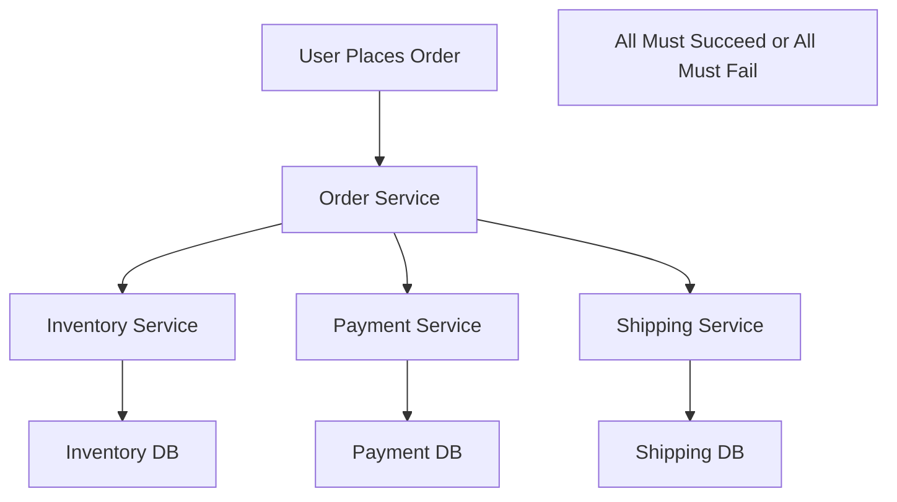
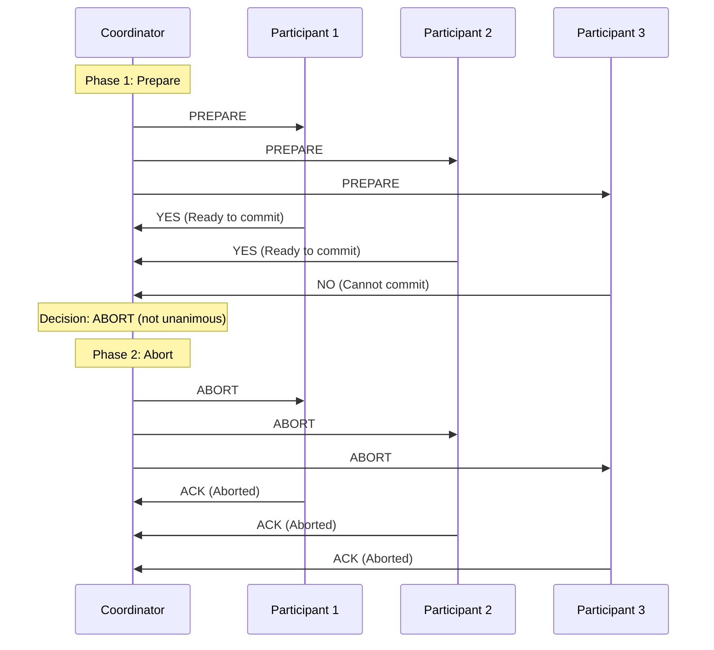

# Distributed Transactions & Two-Phase Commit

## Introduction

Distributed transactions extend the ACID properties across multiple databases, services, or systems that may be geographically distributed. While single-database transactions are well-understood, distributed transactions introduce significant complexity due to network failures, partial failures, and the need to coordinate multiple independent systems.

The challenge of distributed transactions is maintaining atomicity and consistency when operations span multiple systems that can fail independently. Unlike local transactions where a single database manager controls all resources, distributed transactions require coordination protocols to ensure all participants either commit or abort together.

This coordination becomes critical in microservices architectures, multi-database applications, and any system where business operations span multiple services or data stores.

## The Distributed Transaction Problem

### Why Distributed Transactions Are Hard

**1. Network Partitions**: Systems may become temporarily unreachable
**2. Partial Failures**: Some participants may fail while others succeed
**3. Coordinator Failures**: The coordinating system itself may fail
**4. Performance Impact**: Coordination adds latency and reduces throughput
**5. Deadlock Complexity**: Deadlocks can span multiple systems

### Example Scenario: E-commerce Order Processing



**The Challenge**:
```javascript
// This operation spans multiple services and databases
const processOrder = async (orderData) => {
  // Step 1: Reserve inventory (Inventory Service + DB)
  const inventoryReservation = await inventoryService.reserve(orderData.items);
  
  // Step 2: Process payment (Payment Service + DB)  
  const paymentResult = await paymentService.charge(orderData.payment);
  
  // Step 3: Create shipping label (Shipping Service + DB)
  const shippingLabel = await shippingService.createLabel(orderData.address);
  
  // What if payment succeeds but shipping fails?
  // How do we rollback inventory and payment?
};
```

## Two-Phase Commit Protocol (2PC)

Two-Phase Commit is the most common protocol for implementing distributed transactions. It ensures atomicity across multiple participants through a coordinator that manages the transaction lifecycle.

### Protocol Overview

**Phase 1: Prepare (Voting Phase)**
1. Coordinator sends PREPARE message to all participants
2. Each participant prepares the transaction and votes YES or NO
3. Participants must be ready to commit or abort

**Phase 2: Commit/Abort (Decision Phase)**
1. If all participants vote YES, coordinator sends COMMIT
2. If any participant votes NO, coordinator sends ABORT
3. Participants execute the decision and acknowledge

### Detailed Protocol Flow



### Implementation Example

```javascript
class TwoPhaseCommitCoordinator {
  constructor(participants) {
    this.participants = participants;
    this.transactionId = generateTransactionId();
  }
  
  async executeTransaction(operations) {
    const transaction = {
      id: this.transactionId,
      operations: operations,
      state: 'PREPARING'
    };
    
    try {
      // Phase 1: Prepare
      const votes = await this.preparePhase(transaction);
      
      if (votes.every(vote => vote === 'YES')) {
        // Phase 2: Commit
        await this.commitPhase(transaction);
        return { status: 'COMMITTED' };
      } else {
        // Phase 2: Abort
        await this.abortPhase(transaction);
        return { status: 'ABORTED', reason: 'Participant voted NO' };
      }
      
    } catch (error) {
      await this.abortPhase(transaction);
      return { status: 'ABORTED', reason: error.message };
    }
  }
  
  async preparePhase(transaction) {
    const votes = [];
    
    for (const participant of this.participants) {
      try {
        const vote = await participant.prepare(transaction);
        votes.push(vote);
        
        if (vote === 'NO') {
          // Early abort if any participant votes NO
          break;
        }
      } catch (error) {
        votes.push('NO');
        break;
      }
    }
    
    return votes;
  }
  
  async commitPhase(transaction) {
    const promises = this.participants.map(participant => 
      participant.commit(transaction.id)
    );
    
    // Wait for all participants to commit
    await Promise.all(promises);
  }
  
  async abortPhase(transaction) {
    const promises = this.participants.map(participant => 
      participant.abort(transaction.id)
    );
    
    // Wait for all participants to abort
    await Promise.all(promises);
  }
}

class TransactionParticipant {
  constructor(name, database) {
    this.name = name;
    this.database = database;
    this.preparedTransactions = new Map();
  }
  
  async prepare(transaction) {
    try {
      // Begin local transaction
      const localTx = await this.database.beginTransaction();
      
      // Execute operations but don't commit yet
      for (const operation of transaction.operations[this.name] || []) {
        await localTx.execute(operation);
      }
      
      // Store prepared transaction
      this.preparedTransactions.set(transaction.id, localTx);
      
      return 'YES';
    } catch (error) {
      console.error(`${this.name} prepare failed:`, error);
      return 'NO';
    }
  }
  
  async commit(transactionId) {
    const localTx = this.preparedTransactions.get(transactionId);
    if (localTx) {
      await localTx.commit();
      this.preparedTransactions.delete(transactionId);
    }
  }
  
  async abort(transactionId) {
    const localTx = this.preparedTransactions.get(transactionId);
    if (localTx) {
      await localTx.rollback();
      this.preparedTransactions.delete(transactionId);
    }
  }
}
```

### Real-World Example: Banking Transfer

```javascript
// Distributed money transfer between different banks
const distributedBankTransfer = async (fromBank, toBank, amount) => {
  const coordinator = new TwoPhaseCommitCoordinator([
    new BankParticipant('SourceBank', fromBank),
    new BankParticipant('DestinationBank', toBank)
  ]);
  
  const operations = {
    SourceBank: [
      { type: 'DEBIT', account: fromAccount, amount: amount }
    ],
    DestinationBank: [
      { type: 'CREDIT', account: toAccount, amount: amount }
    ]
  };
  
  const result = await coordinator.executeTransaction(operations);
  
  if (result.status === 'COMMITTED') {
    console.log('Transfer completed successfully');
  } else {
    console.log('Transfer failed:', result.reason);
  }
  
  return result;
};
```

## Problems with Two-Phase Commit

### 1. Blocking Protocol

**Problem**: If the coordinator fails after sending PREPARE but before sending the decision, participants are blocked.

```javascript
// Participants are stuck in prepared state
class BlockingScenario {
  async demonstrateBlocking() {
    // Coordinator sends PREPARE
    const votes = await this.preparePhase();
    
    // Coordinator crashes here!
    // Participants are now blocked - they can't commit or abort
    // without knowing the coordinator's decision
    
    // Participants must wait for coordinator recovery
    // or implement timeout mechanisms
  }
}
```

**Solution**: Coordinator recovery and participant timeouts
```javascript
class ParticipantWithTimeout {
  async prepare(transaction) {
    const result = await super.prepare(transaction);
    
    // Set timeout for coordinator decision
    setTimeout(() => {
      if (this.preparedTransactions.has(transaction.id)) {
        console.warn('Coordinator timeout - aborting transaction');
        this.abort(transaction.id);
      }
    }, 30000); // 30 second timeout
    
    return result;
  }
}
```

### 2. Performance Overhead

**Latency Impact**:
- Two network round-trips minimum
- Participants hold locks during both phases
- Coordinator becomes a bottleneck

**Throughput Impact**:
```javascript
// Performance comparison
const performanceTest = {
  localTransaction: {
    latency: '1-5ms',
    throughput: '10,000+ TPS',
    locks: 'Short duration'
  },
  
  distributedTransaction: {
    latency: '50-200ms',
    throughput: '100-1,000 TPS', 
    locks: 'Long duration (both phases)'
  }
};
```

### 3. Coordinator Single Point of Failure

**Problem**: Coordinator failure can block or lose transactions

**Solution**: Coordinator replication and recovery
```javascript
class ReplicatedCoordinator {
  constructor(replicas) {
    this.replicas = replicas;
    this.primary = replicas[0];
  }
  
  async executeTransaction(operations) {
    try {
      return await this.primary.executeTransaction(operations);
    } catch (error) {
      // Failover to backup coordinator
      console.log('Primary coordinator failed, failing over...');
      this.primary = this.replicas[1];
      return await this.primary.recoverAndExecute(operations);
    }
  }
}
```

## Alternatives to Two-Phase Commit

### 1. Saga Pattern

**Concept**: Break distributed transaction into a series of local transactions, each with a compensating action.

```javascript
class SagaOrchestrator {
  constructor() {
    this.steps = [];
    this.compensations = [];
  }
  
  addStep(action, compensation) {
    this.steps.push(action);
    this.compensations.unshift(compensation); // Reverse order
  }
  
  async execute() {
    const completedSteps = [];
    
    try {
      for (const step of this.steps) {
        const result = await step();
        completedSteps.push(result);
      }
      
      return { status: 'SUCCESS', results: completedSteps };
      
    } catch (error) {
      // Compensate completed steps in reverse order
      for (let i = completedSteps.length - 1; i >= 0; i--) {
        try {
          await this.compensations[i](completedSteps[i]);
        } catch (compensationError) {
          console.error('Compensation failed:', compensationError);
        }
      }
      
      return { status: 'FAILED', error: error.message };
    }
  }
}

// Example: Order processing saga
const orderProcessingSaga = new SagaOrchestrator();

orderProcessingSaga.addStep(
  // Step: Reserve inventory
  async () => await inventoryService.reserve(orderData.items),
  // Compensation: Release inventory
  async (reservation) => await inventoryService.release(reservation.id)
);

orderProcessingSaga.addStep(
  // Step: Process payment
  async () => await paymentService.charge(orderData.payment),
  // Compensation: Refund payment
  async (payment) => await paymentService.refund(payment.id)
);

orderProcessingSaga.addStep(
  // Step: Create shipping
  async () => await shippingService.create(orderData.shipping),
  // Compensation: Cancel shipping
  async (shipping) => await shippingService.cancel(shipping.id)
);

const result = await orderProcessingSaga.execute();
```

### 2. Event Sourcing with Eventual Consistency

**Concept**: Store events instead of state, allow systems to eventually converge.

```javascript
class EventSourcingApproach {
  async processOrder(orderData) {
    // Publish event - don't wait for all services
    await eventBus.publish('OrderRequested', {
      orderId: generateOrderId(),
      customerId: orderData.customerId,
      items: orderData.items,
      payment: orderData.payment,
      timestamp: Date.now()
    });
    
    // Return immediately - processing happens asynchronously
    return { status: 'ACCEPTED', orderId: orderData.orderId };
  }
}

// Services react to events independently
class InventoryService {
  async handleOrderRequested(event) {
    try {
      const reservation = await this.reserveItems(event.items);
      
      await eventBus.publish('InventoryReserved', {
        orderId: event.orderId,
        reservationId: reservation.id,
        items: event.items
      });
    } catch (error) {
      await eventBus.publish('InventoryReservationFailed', {
        orderId: event.orderId,
        reason: error.message
      });
    }
  }
}
```

### 3. Try-Confirm/Cancel (TCC)

**Concept**: Three-phase protocol with explicit try, confirm, and cancel operations.

```javascript
class TCCCoordinator {
  async executeTransaction(operations) {
    const reservations = [];
    
    try {
      // Phase 1: Try (reserve resources)
      for (const operation of operations) {
        const reservation = await operation.try();
        reservations.push({ operation, reservation });
      }
      
      // Phase 2: Confirm (commit reservations)
      for (const { operation, reservation } of reservations) {
        await operation.confirm(reservation);
      }
      
      return { status: 'SUCCESS' };
      
    } catch (error) {
      // Phase 3: Cancel (release reservations)
      for (const { operation, reservation } of reservations) {
        try {
          await operation.cancel(reservation);
        } catch (cancelError) {
          console.error('Cancel failed:', cancelError);
        }
      }
      
      return { status: 'FAILED', error: error.message };
    }
  }
}

class TCCInventoryService {
  async try(items) {
    // Reserve items without committing
    const reservation = await this.createReservation(items);
    return reservation.id;
  }
  
  async confirm(reservationId) {
    // Commit the reservation
    await this.commitReservation(reservationId);
  }
  
  async cancel(reservationId) {
    // Release the reservation
    await this.releaseReservation(reservationId);
  }
}
```

## Choosing the Right Approach

### Decision Matrix

| Approach | Consistency | Performance | Complexity | Use Cases |
|----------|-------------|-------------|------------|-----------|
| **2PC** | Strong | Low | Medium | Financial, Critical |
| **Saga** | Eventual | High | High | E-commerce, Workflows |
| **Event Sourcing** | Eventual | Very High | High | Analytics, Audit |
| **TCC** | Strong | Medium | Medium | Reservations, Bookings |

### Guidelines for Selection

**Use 2PC when**:
- Strong consistency is absolutely required
- Number of participants is small (2-3)
- Network is reliable and low-latency
- Performance is not the primary concern

**Use Saga when**:
- Long-running business processes
- Many participants involved
- Compensating actions are well-defined
- Eventual consistency is acceptable

**Use Event Sourcing when**:
- Audit trail is important
- System needs to be highly scalable
- Complex event processing is required
- Eventual consistency is acceptable

**Use TCC when**:
- Resources can be reserved
- Strong consistency is needed
- Better performance than 2PC is required
- Participants support try/confirm/cancel semantics

## Best Practices

### 1. Minimize Distributed Transactions
```javascript
// Bad: Frequent distributed transactions
const badDesign = async () => {
  for (const item of cartItems) {
    await distributedTransaction([
      () => inventory.reserve(item),
      () => pricing.calculate(item),
      () => tax.calculate(item)
    ]);
  }
};

// Good: Batch operations
const goodDesign = async () => {
  await distributedTransaction([
    () => inventory.reserveAll(cartItems),
    () => pricing.calculateAll(cartItems),
    () => tax.calculateAll(cartItems)
  ]);
};
```

### 2. Design for Idempotency
```javascript
class IdempotentService {
  async processPayment(paymentId, amount) {
    // Check if already processed
    const existing = await this.getPayment(paymentId);
    if (existing) {
      return existing; // Idempotent response
    }
    
    // Process payment
    const result = await this.chargeCard(amount);
    await this.savePayment(paymentId, result);
    
    return result;
  }
}
```

### 3. Implement Circuit Breakers
```javascript
class CircuitBreaker {
  constructor(threshold = 5, timeout = 60000) {
    this.threshold = threshold;
    this.timeout = timeout;
    this.failures = 0;
    this.state = 'CLOSED'; // CLOSED, OPEN, HALF_OPEN
    this.nextAttempt = 0;
  }
  
  async call(operation) {
    if (this.state === 'OPEN') {
      if (Date.now() < this.nextAttempt) {
        throw new Error('Circuit breaker is OPEN');
      }
      this.state = 'HALF_OPEN';
    }
    
    try {
      const result = await operation();
      this.onSuccess();
      return result;
    } catch (error) {
      this.onFailure();
      throw error;
    }
  }
  
  onSuccess() {
    this.failures = 0;
    this.state = 'CLOSED';
  }
  
  onFailure() {
    this.failures++;
    if (this.failures >= this.threshold) {
      this.state = 'OPEN';
      this.nextAttempt = Date.now() + this.timeout;
    }
  }
}
```

### 4. Monitor and Alert
```javascript
class TransactionMonitor {
  constructor() {
    this.metrics = {
      totalTransactions: 0,
      successfulTransactions: 0,
      failedTransactions: 0,
      averageLatency: 0,
      timeouts: 0
    };
  }
  
  recordTransaction(duration, success) {
    this.metrics.totalTransactions++;
    
    if (success) {
      this.metrics.successfulTransactions++;
    } else {
      this.metrics.failedTransactions++;
    }
    
    // Update average latency
    this.metrics.averageLatency = 
      (this.metrics.averageLatency + duration) / 2;
    
    // Alert on high failure rate
    const failureRate = this.metrics.failedTransactions / 
                       this.metrics.totalTransactions;
    
    if (failureRate > 0.1) { // 10% failure rate
      this.sendAlert('High transaction failure rate', failureRate);
    }
  }
}
```

## Summary

Distributed transactions are essential for maintaining consistency across multiple systems but come with significant complexity and performance costs:

**Two-Phase Commit**:
- Provides strong consistency guarantees
- Suffers from blocking behavior and performance overhead
- Suitable for critical operations with few participants

**Alternative Patterns**:
- **Saga**: Eventual consistency with compensating actions
- **Event Sourcing**: Asynchronous processing with event streams
- **TCC**: Try-Confirm-Cancel for resource reservations

**Key Takeaways**:
1. Avoid distributed transactions when possible through better service boundaries
2. Choose the right pattern based on consistency requirements and performance needs
3. Design for failure with timeouts, retries, and circuit breakers
4. Implement comprehensive monitoring and alerting
5. Consider eventual consistency alternatives for non-critical operations

**Next**: Learn about [Consensus Algorithms](05-consensus-algorithms.md) and how they enable coordination in distributed systems without the limitations of 2PC.
