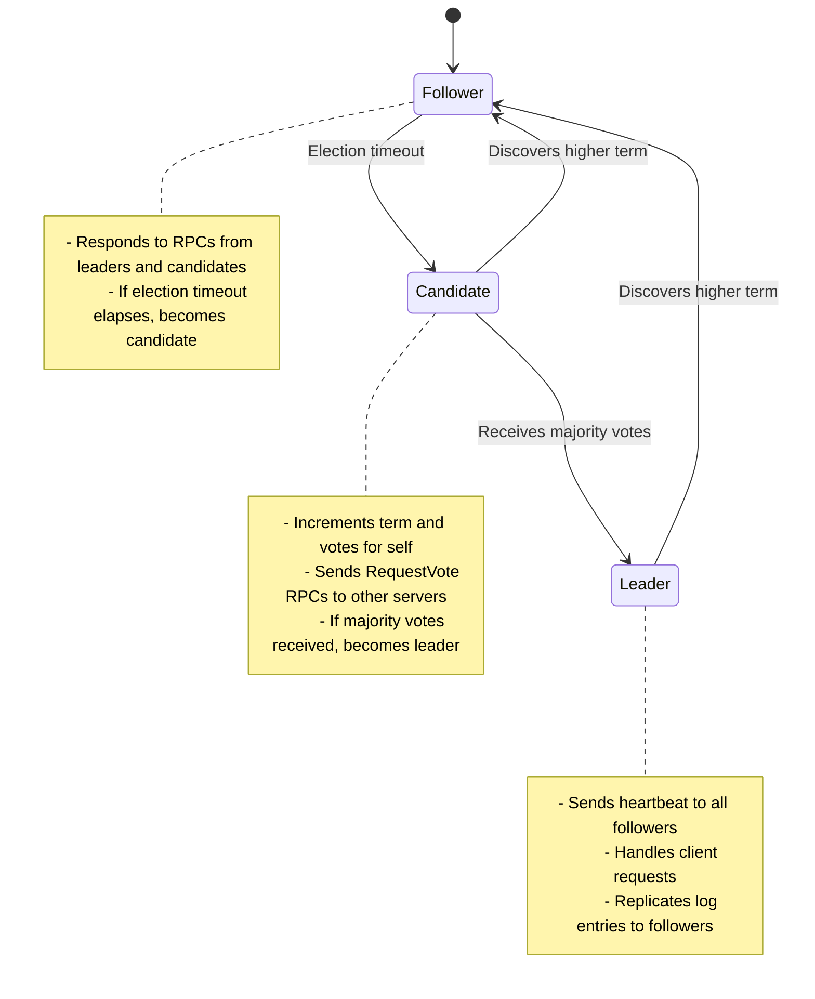

# Consensus Algorithms Basics

## Introduction

Consensus algorithms solve one of the fundamental problems in distributed systems: how to get multiple nodes to agree on a single value or decision, even when some nodes may fail or become unreachable. Unlike two-phase commit, consensus algorithms are designed to make progress even when some participants are unavailable.

The consensus problem is critical for building reliable distributed systems. It enables features like leader election, distributed locking, configuration management, and maintaining consistent replicated state machines. Modern distributed databases, coordination services, and blockchain systems all rely on consensus algorithms.

The key insight is that consensus can be achieved with a majority of nodes, rather than requiring all nodes to participate. This makes systems more resilient to failures and network partitions.

## The Consensus Problem

### Formal Definition

A consensus algorithm must satisfy three properties:

1. **Agreement**: All correct nodes decide on the same value
2. **Validity**: The decided value must be proposed by some node
3. **Termination**: All correct nodes eventually decide

### Why Consensus is Hard

**Network Asynchrony**: Messages can be delayed, reordered, or lost
**Node Failures**: Nodes can crash, restart, or become temporarily unreachable
**Byzantine Failures**: Nodes may behave maliciously (in some scenarios)
**Split-Brain**: Network partitions can create isolated groups of nodes

### Real-World Scenarios Requiring Consensus

```javascript
// Leader Election: Who should be the primary database?
const leaderElection = {
  candidates: ['node1', 'node2', 'node3'],
  requirement: 'Exactly one leader at any time',
  challenge: 'Network partition might elect multiple leaders'
};

// Configuration Management: What's the current system configuration?
const configConsensus = {
  proposals: [
    { maxConnections: 1000, timeout: 30 },
    { maxConnections: 2000, timeout: 60 }
  ],
  requirement: 'All nodes use same configuration',
  challenge: 'Conflicting configuration updates'
};

// Distributed Locking: Who owns the critical resource?
const distributedLock = {
  resource: 'database-backup-process',
  contenders: ['backup-service-1', 'backup-service-2'],
  requirement: 'Only one process can hold lock',
  challenge: 'Lock holder might crash while holding lock'
};
```

## Raft Consensus Algorithm

Raft is designed to be understandable while providing strong consistency guarantees. It divides consensus into three subproblems: leader election, log replication, and safety.

### Raft Overview

**Key Concepts**:
- **Leader**: Handles all client requests and log replication
- **Follower**: Passively receives updates from leader
- **Candidate**: Competes to become leader during elections
- **Term**: Logical time periods with at most one leader per term
- **Log**: Sequence of commands replicated across all nodes

### Raft State Machine



### Leader Election Process

```javascript
class RaftNode {
  constructor(nodeId, peers) {
    this.nodeId = nodeId;
    this.peers = peers;
    this.state = 'FOLLOWER';
    this.currentTerm = 0;
    this.votedFor = null;
    this.log = [];
    this.commitIndex = 0;
    this.lastApplied = 0;
    
    // Leader state
    this.nextIndex = {};
    this.matchIndex = {};
    
    this.startElectionTimer();
  }
  
  startElectionTimer() {
    // Random timeout between 150-300ms
    const timeout = 150 + Math.random() * 150;
    
    this.electionTimer = setTimeout(() => {
      if (this.state !== 'LEADER') {
        this.startElection();
      }
    }, timeout);
  }
  
  async startElection() {
    console.log(`${this.nodeId}: Starting election for term ${this.currentTerm + 1}`);
    
    // Become candidate
    this.state = 'CANDIDATE';
    this.currentTerm++;
    this.votedFor = this.nodeId;
    
    // Vote for self
    let votes = 1;
    const majority = Math.floor(this.peers.length / 2) + 1;
    
    // Request votes from all peers
    const votePromises = this.peers.map(peer => 
      this.requestVote(peer)
    );
    
    try {
      const voteResults = await Promise.allSettled(votePromises);
      
      for (const result of voteResults) {
        if (result.status === 'fulfilled' && result.value.voteGranted) {
          votes++;
        }
      }
      
      if (votes >= majority && this.state === 'CANDIDATE') {
        this.becomeLeader();
      } else {
        this.becomeFollower();
      }
      
    } catch (error) {
      console.error(`${this.nodeId}: Election failed:`, error);
      this.becomeFollower();
    }
  }
  
  async requestVote(peer) {
    const request = {
      term: this.currentTerm,
      candidateId: this.nodeId,
      lastLogIndex: this.log.length - 1,
      lastLogTerm: this.log.length > 0 ? this.log[this.log.length - 1].term : 0
    };
    
    try {
      const response = await peer.requestVote(request);
      
      // Update term if we discover a higher term
      if (response.term > this.currentTerm) {
        this.currentTerm = response.term;
        this.votedFor = null;
        this.becomeFollower();
      }
      
      return response;
    } catch (error) {
      return { term: this.currentTerm, voteGranted: false };
    }
  }
  
  handleRequestVote(request) {
    let voteGranted = false;
    
    // Update term if we discover a higher term
    if (request.term > this.currentTerm) {
      this.currentTerm = request.term;
      this.votedFor = null;
      this.becomeFollower();
    }
    
    // Grant vote if:
    // 1. Haven't voted in this term, or already voted for this candidate
    // 2. Candidate's log is at least as up-to-date as ours
    if (request.term === this.currentTerm &&
        (this.votedFor === null || this.votedFor === request.candidateId) &&
        this.isLogUpToDate(request.lastLogIndex, request.lastLogTerm)) {
      
      voteGranted = true;
      this.votedFor = request.candidateId;
      this.resetElectionTimer();
    }
    
    return {
      term: this.currentTerm,
      voteGranted: voteGranted
    };
  }
  
  becomeLeader() {
    console.log(`${this.nodeId}: Became leader for term ${this.currentTerm}`);
    this.state = 'LEADER';
    
    // Initialize leader state
    for (const peer of this.peers) {
      this.nextIndex[peer.nodeId] = this.log.length;
      this.matchIndex[peer.nodeId] = 0;
    }
    
    // Send heartbeats immediately and periodically
    this.sendHeartbeats();
    this.heartbeatTimer = setInterval(() => {
      this.sendHeartbeats();
    }, 50); // 50ms heartbeat interval
  }
  
  becomeFollower() {
    this.state = 'FOLLOWER';
    if (this.heartbeatTimer) {
      clearInterval(this.heartbeatTimer);
    }
    this.startElectionTimer();
  }
}
```

### Log Replication

```javascript
class RaftLogReplication {
  async appendEntries(entries) {
    if (this.state !== 'LEADER') {
      throw new Error('Only leader can append entries');
    }
    
    // Add entries to local log
    for (const entry of entries) {
      entry.term = this.currentTerm;
      entry.index = this.log.length;
      this.log.push(entry);
    }
    
    // Replicate to followers
    await this.replicateToFollowers();
  }
  
  async replicateToFollowers() {
    const replicationPromises = this.peers.map(peer => 
      this.replicateToPeer(peer)
    );
    
    const results = await Promise.allSettled(replicationPromises);
    
    // Count successful replications
    let successCount = 1; // Leader counts as success
    for (const result of results) {
      if (result.status === 'fulfilled' && result.value.success) {
        successCount++;
      }
    }
    
    // Commit if majority of nodes have replicated
    const majority = Math.floor(this.peers.length / 2) + 1;
    if (successCount >= majority) {
      this.commitIndex = this.log.length - 1;
      this.applyCommittedEntries();
    }
  }
  
  async replicateToPeer(peer) {
    const nextIndex = this.nextIndex[peer.nodeId];
    const prevLogIndex = nextIndex - 1;
    const prevLogTerm = prevLogIndex >= 0 ? this.log[prevLogIndex].term : 0;
    
    const request = {
      term: this.currentTerm,
      leaderId: this.nodeId,
      prevLogIndex: prevLogIndex,
      prevLogTerm: prevLogTerm,
      entries: this.log.slice(nextIndex),
      leaderCommit: this.commitIndex
    };
    
    try {
      const response = await peer.appendEntries(request);
      
      if (response.success) {
        // Update next and match indices
        this.nextIndex[peer.nodeId] = this.log.length;
        this.matchIndex[peer.nodeId] = this.log.length - 1;
      } else {
        // Decrement nextIndex and retry
        this.nextIndex[peer.nodeId] = Math.max(0, this.nextIndex[peer.nodeId] - 1);
      }
      
      return response;
    } catch (error) {
      return { success: false, term: this.currentTerm };
    }
  }
  
  handleAppendEntries(request) {
    // Update term if we discover a higher term
    if (request.term > this.currentTerm) {
      this.currentTerm = request.term;
      this.votedFor = null;
      this.becomeFollower();
    }
    
    // Reject if term is lower
    if (request.term < this.currentTerm) {
      return { term: this.currentTerm, success: false };
    }
    
    // Reset election timer (valid leader exists)
    this.resetElectionTimer();
    
    // Check log consistency
    if (request.prevLogIndex >= 0) {
      if (this.log.length <= request.prevLogIndex ||
          this.log[request.prevLogIndex].term !== request.prevLogTerm) {
        return { term: this.currentTerm, success: false };
      }
    }
    
    // Append new entries
    if (request.entries.length > 0) {
      // Remove conflicting entries
      this.log = this.log.slice(0, request.prevLogIndex + 1);
      
      // Append new entries
      this.log.push(...request.entries);
    }
    
    // Update commit index
    if (request.leaderCommit > this.commitIndex) {
      this.commitIndex = Math.min(request.leaderCommit, this.log.length - 1);
      this.applyCommittedEntries();
    }
    
    return { term: this.currentTerm, success: true };
  }
}
```

## Paxos Algorithm (Overview)

Paxos is the foundational consensus algorithm, though more complex than Raft. It's used in systems like Google's Chubby and Apache Cassandra.

### Paxos Phases

**Phase 1: Prepare**
1. Proposer selects proposal number n
2. Sends PREPARE(n) to majority of acceptors
3. Acceptors respond with promise not to accept proposals < n

**Phase 2: Accept**
1. If majority responds, proposer sends ACCEPT(n, value)
2. Acceptors accept if they haven't promised a higher number
3. If majority accepts, value is chosen

### Paxos Example

```javascript
class PaxosProposer {
  async propose(value) {
    const proposalNumber = this.generateProposalNumber();
    
    // Phase 1: Prepare
    const prepareResponses = await this.sendPrepare(proposalNumber);
    
    if (prepareResponses.length < this.majority) {
      throw new Error('Prepare phase failed - insufficient responses');
    }
    
    // Choose value (use highest-numbered accepted value, or our value)
    const chosenValue = this.chooseValue(prepareResponses, value);
    
    // Phase 2: Accept
    const acceptResponses = await this.sendAccept(proposalNumber, chosenValue);
    
    if (acceptResponses.length >= this.majority) {
      return { success: true, value: chosenValue };
    } else {
      throw new Error('Accept phase failed - insufficient acceptances');
    }
  }
  
  chooseValue(responses, proposedValue) {
    let highestNumber = -1;
    let acceptedValue = null;
    
    for (const response of responses) {
      if (response.acceptedNumber > highestNumber) {
        highestNumber = response.acceptedNumber;
        acceptedValue = response.acceptedValue;
      }
    }
    
    return acceptedValue !== null ? acceptedValue : proposedValue;
  }
}

class PaxosAcceptor {
  constructor() {
    this.promisedNumber = -1;
    this.acceptedNumber = -1;
    this.acceptedValue = null;
  }
  
  handlePrepare(proposalNumber) {
    if (proposalNumber > this.promisedNumber) {
      this.promisedNumber = proposalNumber;
      
      return {
        success: true,
        acceptedNumber: this.acceptedNumber,
        acceptedValue: this.acceptedValue
      };
    } else {
      return { success: false };
    }
  }
  
  handleAccept(proposalNumber, value) {
    if (proposalNumber >= this.promisedNumber) {
      this.promisedNumber = proposalNumber;
      this.acceptedNumber = proposalNumber;
      this.acceptedValue = value;
      
      return { success: true };
    } else {
      return { success: false };
    }
  }
}
```

## Practical Applications

### 1. Distributed Configuration Management

```javascript
class ConsensusConfigManager {
  constructor(raftCluster) {
    this.raftCluster = raftCluster;
    this.config = {};
  }
  
  async updateConfig(key, value) {
    const command = {
      type: 'SET_CONFIG',
      key: key,
      value: value,
      timestamp: Date.now()
    };
    
    // Use Raft to achieve consensus on configuration change
    const result = await this.raftCluster.appendEntry(command);
    
    if (result.committed) {
      this.config[key] = value;
      return { success: true };
    } else {
      throw new Error('Failed to achieve consensus on configuration change');
    }
  }
  
  getConfig(key) {
    return this.config[key];
  }
  
  // Apply committed configuration changes
  applyCommand(command) {
    if (command.type === 'SET_CONFIG') {
      this.config[command.key] = command.value;
      console.log(`Config updated: ${command.key} = ${command.value}`);
    }
  }
}
```

### 2. Distributed Locking Service

```javascript
class ConsensusLockService {
  constructor(raftCluster) {
    this.raftCluster = raftCluster;
    this.locks = new Map();
  }
  
  async acquireLock(lockName, clientId, ttl = 30000) {
    const command = {
      type: 'ACQUIRE_LOCK',
      lockName: lockName,
      clientId: clientId,
      ttl: ttl,
      timestamp: Date.now()
    };
    
    const result = await this.raftCluster.appendEntry(command);
    
    if (result.committed) {
      const lock = this.locks.get(lockName);
      return { 
        success: lock && lock.owner === clientId,
        lockId: lock ? lock.id : null
      };
    }
    
    return { success: false };
  }
  
  async releaseLock(lockName, clientId) {
    const command = {
      type: 'RELEASE_LOCK',
      lockName: lockName,
      clientId: clientId,
      timestamp: Date.now()
    };
    
    const result = await this.raftCluster.appendEntry(command);
    return { success: result.committed };
  }
  
  applyCommand(command) {
    switch (command.type) {
      case 'ACQUIRE_LOCK':
        const existingLock = this.locks.get(command.lockName);
        
        if (!existingLock || this.isLockExpired(existingLock)) {
          this.locks.set(command.lockName, {
            id: generateLockId(),
            owner: command.clientId,
            acquiredAt: command.timestamp,
            ttl: command.ttl
          });
        }
        break;
        
      case 'RELEASE_LOCK':
        const lock = this.locks.get(command.lockName);
        if (lock && lock.owner === command.clientId) {
          this.locks.delete(command.lockName);
        }
        break;
    }
  }
  
  isLockExpired(lock) {
    return Date.now() - lock.acquiredAt > lock.ttl;
  }
}
```

### 3. Leader Election Service

```javascript
class LeaderElectionService {
  constructor(nodeId, raftCluster) {
    this.nodeId = nodeId;
    this.raftCluster = raftCluster;
    this.isLeader = false;
    this.leadershipCallbacks = [];
  }
  
  async campaignForLeadership(service) {
    const command = {
      type: 'LEADERSHIP_CAMPAIGN',
      service: service,
      candidateId: this.nodeId,
      timestamp: Date.now()
    };
    
    const result = await this.raftCluster.appendEntry(command);
    
    if (result.committed) {
      // Check if we became the leader
      return this.checkLeadership(service);
    }
    
    return { isLeader: false };
  }
  
  onLeadershipChange(callback) {
    this.leadershipCallbacks.push(callback);
  }
  
  applyCommand(command) {
    if (command.type === 'LEADERSHIP_CAMPAIGN') {
      const wasLeader = this.isLeader;
      
      // Simple leader election: most recent candidate wins
      // In practice, you'd use more sophisticated logic
      this.currentLeader = command.candidateId;
      this.isLeader = (command.candidateId === this.nodeId);
      
      if (wasLeader !== this.isLeader) {
        this.notifyLeadershipChange();
      }
    }
  }
  
  notifyLeadershipChange() {
    for (const callback of this.leadershipCallbacks) {
      callback(this.isLeader, this.currentLeader);
    }
  }
}
```

## Consensus Algorithm Comparison

| Algorithm | Complexity | Performance | Fault Tolerance | Use Cases |
|-----------|------------|-------------|-----------------|-----------|
| **Raft** | Low | Good | f+1 from 2f+1 nodes | General purpose, easy to understand |
| **Paxos** | High | Good | f+1 from 2f+1 nodes | Academic interest, complex systems |
| **PBFT** | Very High | Lower | f+1 from 3f+1 nodes | Byzantine fault tolerance |
| **Tendermint** | Medium | Good | f+1 from 3f+1 nodes | Blockchain applications |

## Best Practices

### 1. Handle Network Partitions
```javascript
class PartitionTolerantRaft extends RaftNode {
  handleNetworkPartition() {
    // Only the partition with majority can make progress
    const reachableNodes = this.countReachableNodes();
    const majority = Math.floor(this.totalNodes / 2) + 1;
    
    if (reachableNodes < majority) {
      console.log('Network partition detected - stepping down as leader');
      this.becomeFollower();
      this.stopAcceptingWrites();
    }
  }
  
  stopAcceptingWrites() {
    this.acceptingWrites = false;
    // Reject client write requests until partition heals
  }
}
```

### 2. Implement Proper Timeouts
```javascript
class TimeoutConfiguration {
  constructor() {
    // Election timeout should be much larger than heartbeat interval
    this.heartbeatInterval = 50;    // 50ms
    this.electionTimeout = {
      min: 150,  // 150ms minimum
      max: 300   // 300ms maximum
    };
    
    // Network timeout for RPCs
    this.rpcTimeout = 100;  // 100ms
  }
  
  getRandomElectionTimeout() {
    const min = this.electionTimeout.min;
    const max = this.electionTimeout.max;
    return min + Math.random() * (max - min);
  }
}
```

### 3. Monitor Consensus Health
```javascript
class ConsensusMonitor {
  constructor(raftCluster) {
    this.raftCluster = raftCluster;
    this.metrics = {
      leaderElections: 0,
      failedElections: 0,
      logReplicationLatency: [],
      consensusFailures: 0
    };
  }
  
  recordLeaderElection(successful) {
    if (successful) {
      this.metrics.leaderElections++;
    } else {
      this.metrics.failedElections++;
    }
    
    // Alert if too many failed elections
    const failureRate = this.metrics.failedElections / 
                       (this.metrics.leaderElections + this.metrics.failedElections);
    
    if (failureRate > 0.2) { // 20% failure rate
      this.sendAlert('High leader election failure rate', failureRate);
    }
  }
  
  recordLogReplication(latency) {
    this.metrics.logReplicationLatency.push(latency);
    
    // Keep only recent measurements
    if (this.metrics.logReplicationLatency.length > 1000) {
      this.metrics.logReplicationLatency.shift();
    }
    
    // Alert on high latency
    const avgLatency = this.getAverageLatency();
    if (avgLatency > 1000) { // 1 second
      this.sendAlert('High log replication latency', avgLatency);
    }
  }
}
```

## Summary

Consensus algorithms are fundamental building blocks for distributed systems, enabling coordination and agreement despite failures:

**Raft Algorithm**:
- Designed for understandability and practical implementation
- Strong leader model with clear roles (leader, follower, candidate)
- Handles leader election, log replication, and safety guarantees
- Widely adopted in production systems

**Paxos Algorithm**:
- Foundational consensus algorithm with strong theoretical properties
- More complex but handles more general scenarios
- Used in systems requiring Byzantine fault tolerance

**Key Applications**:
- **Configuration Management**: Consistent system configuration across nodes
- **Leader Election**: Selecting a single coordinator in distributed systems
- **Distributed Locking**: Coordinating access to shared resources
- **State Machine Replication**: Keeping multiple replicas in sync

**Best Practices**:
1. Choose appropriate timeouts to balance availability and consistency
2. Handle network partitions gracefully by requiring majority consensus
3. Monitor consensus health and alert on anomalies
4. Design for failure scenarios and implement proper recovery mechanisms
5. Consider the trade-offs between consistency guarantees and performance

**Next**: Learn about [When to Use Each Approach](06-when-to-use.md) and decision frameworks for choosing the right consistency model for your system.
