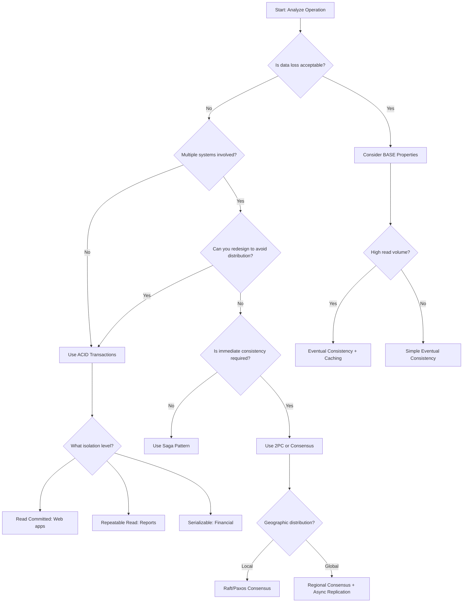

# When to Use Each Approach

## Introduction

Choosing the right consistency model is one of the most critical architectural decisions in distributed system design. The choice affects everything from user experience to system scalability, operational complexity, and development velocity. There's no one-size-fits-all solution—the optimal approach depends on your specific business requirements, technical constraints, and operational capabilities.

This section provides a practical decision framework to help you navigate the trade-offs between ACID transactions, BASE properties, isolation levels, distributed transactions, and consensus algorithms. We'll explore real-world scenarios and provide concrete guidelines for making these crucial architectural decisions.

## Decision Framework

### 1. Analyze Business Requirements

**Data Criticality Assessment**:
```javascript
const dataCriticalityMatrix = {
  CRITICAL: {
    examples: ['Financial transactions', 'Medical records', 'Legal documents'],
    consistency: 'Strong (ACID/Serializable)',
    tolerance: 'Zero data loss acceptable',
    approach: 'ACID transactions with strict isolation'
  },
  
  IMPORTANT: {
    examples: ['User profiles', 'Inventory levels', 'Order status'],
    consistency: 'Strong with some flexibility',
    tolerance: 'Brief inconsistencies acceptable',
    approach: 'ACID with Read Committed or Saga patterns'
  },
  
  USEFUL: {
    examples: ['Social media posts', 'Comments', 'Analytics data'],
    consistency: 'Eventual consistency acceptable',
    tolerance: 'Temporary inconsistencies fine',
    approach: 'BASE properties with eventual consistency'
  },
  
  NICE_TO_HAVE: {
    examples: ['View counts', 'Recommendations', 'Cached data'],
    consistency: 'Best effort',
    tolerance: 'Data loss acceptable in some cases',
    approach: 'Eventual consistency or no guarantees'
  }
};
```

**Consistency Requirements Analysis**:
```javascript
const analyzeConsistencyNeeds = (operation) => {
  const questions = {
    dataLoss: 'Can you tolerate any data loss?',
    temporaryInconsistency: 'Can users see temporarily inconsistent data?',
    conflictResolution: 'How should conflicts be resolved?',
    userExperience: 'How does inconsistency affect user experience?',
    regulatoryCompliance: 'Are there regulatory requirements?'
  };
  
  // Example scoring system
  const scores = {
    financialTransfer: { dataLoss: 0, temporaryInconsistency: 0, conflicts: 0 },
    socialMediaPost: { dataLoss: 3, temporaryInconsistency: 5, conflicts: 4 },
    productCatalog: { dataLoss: 2, temporaryInconsistency: 4, conflicts: 3 }
  };
  
  return scores[operation] || 'needs_analysis';
};
```

### 2. Evaluate Technical Constraints

**Scale and Performance Requirements**:
```javascript
const scaleAnalysis = {
  LOW_SCALE: {
    users: '< 10K',
    transactions: '< 1K TPS',
    data: '< 100GB',
    recommendation: 'ACID transactions with single database'
  },
  
  MEDIUM_SCALE: {
    users: '10K - 1M',
    transactions: '1K - 10K TPS', 
    data: '100GB - 10TB',
    recommendation: 'Mixed approach: ACID for critical, BASE for non-critical'
  },
  
  HIGH_SCALE: {
    users: '1M - 100M',
    transactions: '10K - 100K TPS',
    data: '10TB - 1PB',
    recommendation: 'Primarily BASE with selective ACID for critical operations'
  },
  
  WEB_SCALE: {
    users: '> 100M',
    transactions: '> 100K TPS',
    data: '> 1PB',
    recommendation: 'BASE properties with eventual consistency'
  }
};
```

**Geographic Distribution**:
```javascript
const geographicConsiderations = {
  SINGLE_REGION: {
    latency: '< 50ms',
    approach: 'ACID transactions feasible',
    consensus: 'Raft/Paxos work well'
  },
  
  MULTI_REGION: {
    latency: '50-200ms',
    approach: 'Regional ACID, global eventual consistency',
    consensus: 'Regional consensus with async replication'
  },
  
  GLOBAL: {
    latency: '200ms+',
    approach: 'Eventual consistency with conflict resolution',
    consensus: 'Avoid global consensus for user-facing operations'
  }
};
```

## Use Case Decision Matrix

### Financial Services

**Banking Core Systems**:
```javascript
const bankingSystemDesign = {
  accountTransfers: {
    consistency: 'ACID with Serializable isolation',
    pattern: 'Two-phase commit for cross-bank transfers',
    rationale: 'Money must never be lost or duplicated',
    implementation: `
      // Strict ACID for money movement
      await db.transaction({ isolation: 'SERIALIZABLE' }, async (tx) => {
        const fromBalance = await tx.getAccountBalance(fromAccount);
        if (fromBalance < amount) throw new Error('Insufficient funds');
        
        await tx.debitAccount(fromAccount, amount);
        await tx.creditAccount(toAccount, amount);
        
        // Both operations succeed or both fail
      });
    `
  },
  
  accountStatements: {
    consistency: 'Read Committed with eventual consistency for analytics',
    pattern: 'CQRS with event sourcing',
    rationale: 'Statements need consistency but can tolerate slight delays',
    implementation: `
      // Separate read and write models
      const writeModel = new AccountTransactionService(); // ACID
      const readModel = new AccountStatementService();   // Eventually consistent
    `
  },
  
  fraudDetection: {
    consistency: 'Eventual consistency with real-time processing',
    pattern: 'Event streaming with BASE properties',
    rationale: 'Speed more important than perfect consistency',
    implementation: `
      // Process transactions in real-time stream
      transactionStream
        .filter(tx => tx.amount > suspiciousThreshold)
        .forEach(tx => fraudDetectionService.analyze(tx));
    `
  }
};
```

### E-commerce Platforms

**Order Processing System**:
```javascript
const ecommerceSystemDesign = {
  orderPlacement: {
    consistency: 'Saga pattern with compensating transactions',
    rationale: 'Multiple services involved, need graceful failure handling',
    implementation: `
      const orderSaga = new Saga()
        .addStep(
          () => inventoryService.reserve(items),
          (reservation) => inventoryService.release(reservation)
        )
        .addStep(
          () => paymentService.charge(payment),
          (charge) => paymentService.refund(charge)
        )
        .addStep(
          () => shippingService.schedule(address),
          (shipment) => shippingService.cancel(shipment)
        );
      
      const result = await orderSaga.execute();
    `
  },
  
  productCatalog: {
    consistency: 'Eventual consistency with caching',
    rationale: 'High read volume, updates can be delayed',
    implementation: `
      // Write-through cache with eventual consistency
      const updateProduct = async (productId, updates) => {
        await productService.update(productId, updates);
        
        // Async cache invalidation
        cacheInvalidationQueue.publish({
          type: 'PRODUCT_UPDATED',
          productId: productId
        });
      };
    `
  },
  
  inventory: {
    consistency: 'Strong consistency for reservations, eventual for display',
    rationale: 'Prevent overselling while allowing fast browsing',
    implementation: `
      // Strong consistency for reservations
      const reserveInventory = async (productId, quantity) => {
        return await db.transaction({ isolation: 'SERIALIZABLE' }, async (tx) => {
          const available = await tx.getAvailableStock(productId);
          if (available < quantity) throw new Error('Insufficient stock');
          
          return await tx.reserveStock(productId, quantity);
        });
      };
      
      // Eventual consistency for display
      const getProductStock = async (productId) => {
        return await cache.get(\`stock:\${productId}\`) || 
               await stockService.getApproximateStock(productId);
      };
    `
  }
};
```

### Social Media Platforms

**Content Management**:
```javascript
const socialMediaDesign = {
  userPosts: {
    consistency: 'Eventual consistency with optimistic updates',
    rationale: 'User experience prioritized over immediate consistency',
    implementation: `
      const createPost = async (userId, content) => {
        // Optimistic update - show immediately to user
        const postId = generatePostId();
        userInterface.showPost({ id: postId, content, status: 'posting' });
        
        // Async processing
        try {
          await postService.create({ id: postId, userId, content });
          await feedService.distribute(postId, userId);
          userInterface.updatePostStatus(postId, 'posted');
        } catch (error) {
          userInterface.updatePostStatus(postId, 'failed');
        }
      };
    `
  },
  
  friendConnections: {
    consistency: 'Strong consistency for connections, eventual for counts',
    rationale: 'Friend relationships are critical, counts are not',
    implementation: `
      const addFriend = async (userId1, userId2) => {
        // Strong consistency for relationship
        await db.transaction(async (tx) => {
          await tx.addFriendship(userId1, userId2);
          await tx.addFriendship(userId2, userId1);
        });
        
        // Eventual consistency for friend counts
        friendCountUpdateQueue.publish({
          type: 'FRIENDSHIP_ADDED',
          users: [userId1, userId2]
        });
      };
    `
  },
  
  contentFeed: {
    consistency: 'Eventual consistency with personalization',
    rationale: 'Feed freshness more important than perfect ordering',
    implementation: `
      const generateFeed = async (userId) => {
        // Combine multiple eventually consistent sources
        const [
          friendPosts,
          recommendedPosts,
          trendingPosts
        ] = await Promise.all([
          friendPostService.getRecent(userId),
          recommendationService.getPersonalized(userId),
          trendingService.getPopular()
        ]);
        
        return feedAlgorithm.merge(friendPosts, recommendedPosts, trendingPosts);
      };
    `
  }
};
```

## Technology-Specific Recommendations

### Database Selection Guide

**Relational Databases (ACID)**:
```javascript
const rdbmsRecommendations = {
  PostgreSQL: {
    strengths: ['Full ACID compliance', 'Advanced isolation levels', 'JSON support'],
    useWhen: ['Complex transactions', 'Strong consistency required', 'Rich query needs'],
    isolationLevels: {
      default: 'READ COMMITTED',
      financial: 'SERIALIZABLE',
      reporting: 'REPEATABLE READ'
    }
  },
  
  MySQL: {
    strengths: ['High performance', 'Mature ecosystem', 'Good replication'],
    useWhen: ['Web applications', 'Read-heavy workloads', 'Simple transactions'],
    isolationLevels: {
      default: 'REPEATABLE READ',
      webApps: 'READ COMMITTED'
    }
  }
};
```

**NoSQL Databases (BASE)**:
```javascript
const nosqlRecommendations = {
  MongoDB: {
    consistency: 'Configurable (strong to eventual)',
    useWhen: ['Document storage', 'Rapid development', 'Flexible schema'],
    consistencyConfig: `
      // Strong consistency
      db.collection.find().readConcern("majority");
      
      // Eventual consistency  
      db.collection.find().readPreference("secondary");
    `
  },
  
  Cassandra: {
    consistency: 'Tunable consistency levels',
    useWhen: ['High write volume', 'Geographic distribution', 'Time-series data'],
    consistencyConfig: `
      // Strong consistency
      SELECT * FROM users WHERE id = ? USING CONSISTENCY QUORUM;
      
      // Eventual consistency
      SELECT * FROM users WHERE id = ? USING CONSISTENCY ONE;
    `
  },
  
  DynamoDB: {
    consistency: 'Eventually consistent by default, strongly consistent available',
    useWhen: ['Serverless applications', 'Predictable performance', 'AWS ecosystem'],
    consistencyConfig: `
      // Eventually consistent (default)
      const params = { TableName: 'Users', Key: { id: 'user123' } };
      
      // Strongly consistent
      const strongParams = { ...params, ConsistentRead: true };
    `
  }
};
```

### Microservices Architecture Patterns

**Service Boundary Design**:
```javascript
const serviceBoundaryPatterns = {
  strongConsistency: {
    pattern: 'Keep related data in same service',
    example: `
      // Good: User and UserProfile in same service
      class UserService {
        async updateUser(userId, userData, profileData) {
          return await db.transaction(async (tx) => {
            await tx.updateUser(userId, userData);
            await tx.updateProfile(userId, profileData);
          });
        }
      }
    `
  },
  
  eventualConsistency: {
    pattern: 'Separate services with event-driven communication',
    example: `
      // User Service
      class UserService {
        async updateUser(userId, userData) {
          await db.updateUser(userId, userData);
          
          await eventBus.publish('UserUpdated', {
            userId: userId,
            userData: userData
          });
        }
      }
      
      // Profile Service (separate)
      class ProfileService {
        async handleUserUpdated(event) {
          await this.syncUserData(event.userId, event.userData);
        }
      }
    `
  }
};
```

## Common Anti-Patterns and Solutions

### Anti-Pattern 1: Distributed Transactions Everywhere

**Problem**:
```javascript
// Bad: Every operation uses distributed transactions
const badOrderService = {
  async createOrder(orderData) {
    return await distributedTransaction([
      () => inventoryService.reserve(orderData.items),
      () => userService.validateUser(orderData.userId),
      () => pricingService.calculateTotal(orderData.items),
      () => taxService.calculateTax(orderData.total),
      () => orderService.create(orderData)
    ]);
  }
};
```

**Solution**:
```javascript
// Good: Minimize distributed transactions
const goodOrderService = {
  async createOrder(orderData) {
    // Pre-validate without transactions
    const [user, pricing] = await Promise.all([
      userService.getUser(orderData.userId),
      pricingService.calculatePricing(orderData.items)
    ]);
    
    if (!user.isValid) throw new Error('Invalid user');
    
    // Only critical operations in distributed transaction
    return await distributedTransaction([
      () => inventoryService.reserve(orderData.items),
      () => orderService.create({ ...orderData, ...pricing })
    ]);
  }
};
```

### Anti-Pattern 2: Eventual Consistency for Critical Data

**Problem**:
```javascript
// Bad: Using eventual consistency for account balances
const badBankingService = {
  async transfer(fromAccount, toAccount, amount) {
    // This can lead to negative balances!
    await Promise.all([
      accountService.debit(fromAccount, amount),
      accountService.credit(toAccount, amount)
    ]);
  }
};
```

**Solution**:
```javascript
// Good: Strong consistency for critical operations
const goodBankingService = {
  async transfer(fromAccount, toAccount, amount) {
    return await db.transaction({ isolation: 'SERIALIZABLE' }, async (tx) => {
      const balance = await tx.getBalance(fromAccount);
      if (balance < amount) throw new Error('Insufficient funds');
      
      await tx.debit(fromAccount, amount);
      await tx.credit(toAccount, amount);
    });
  }
};
```

### Anti-Pattern 3: Ignoring CAP Theorem Implications

**Problem**:
```javascript
// Bad: Expecting strong consistency during network partitions
const badDistributedService = {
  async updateGlobalConfig(config) {
    // This will fail during network partitions
    const results = await Promise.all(
      allRegions.map(region => region.updateConfig(config))
    );
    
    if (results.some(r => !r.success)) {
      throw new Error('Failed to update all regions');
    }
  }
};
```

**Solution**:
```javascript
// Good: Design for partition tolerance
const goodDistributedService = {
  async updateGlobalConfig(config) {
    const results = await Promise.allSettled(
      allRegions.map(region => region.updateConfig(config))
    );
    
    const successful = results.filter(r => r.status === 'fulfilled');
    const failed = results.filter(r => r.status === 'rejected');
    
    if (successful.length >= Math.ceil(allRegions.length / 2)) {
      // Majority succeeded - continue with eventual consistency
      this.scheduleRetryForFailedRegions(failed);
      return { status: 'success', partialFailures: failed.length };
    } else {
      throw new Error('Majority of regions failed');
    }
  }
};
```

## Decision Tree



## Practical Implementation Checklist

### Before Implementation

**Requirements Analysis**:
- [ ] Identify critical vs non-critical data
- [ ] Define acceptable consistency windows
- [ ] Analyze failure scenarios and impact
- [ ] Consider regulatory and compliance requirements
- [ ] Evaluate user experience implications

**Technical Assessment**:
- [ ] Measure current system scale and growth projections
- [ ] Assess network latency between components
- [ ] Evaluate team expertise with different approaches
- [ ] Consider operational complexity and monitoring needs
- [ ] Plan for testing and validation strategies

### During Implementation

**Gradual Migration Strategy**:
```javascript
const migrationStrategy = {
  phase1: {
    scope: 'Non-critical operations',
    approach: 'Implement eventual consistency',
    validation: 'Monitor user experience and data quality'
  },
  
  phase2: {
    scope: 'Important but not critical operations',
    approach: 'Implement saga patterns',
    validation: 'Test failure scenarios and compensation'
  },
  
  phase3: {
    scope: 'Critical operations',
    approach: 'Optimize existing ACID or implement consensus',
    validation: 'Extensive testing and gradual rollout'
  }
};
```

**Monitoring and Observability**:
```javascript
const consistencyMonitoring = {
  metrics: [
    'Transaction success/failure rates',
    'Consistency lag measurements',
    'Conflict resolution frequency',
    'User-visible inconsistencies',
    'System availability during partitions'
  ],
  
  alerts: [
    'High transaction failure rate',
    'Excessive consistency lag',
    'Frequent conflict resolution',
    'User complaints about data inconsistency'
  ]
};
```

## Summary

Choosing the right consistency approach requires careful analysis of business requirements, technical constraints, and operational capabilities:

**Key Decision Factors**:
1. **Data Criticality**: How important is immediate consistency for this specific data?
2. **Scale Requirements**: What are your current and projected scale needs?
3. **Geographic Distribution**: Are users and systems globally distributed?
4. **Failure Tolerance**: What happens when systems fail or become partitioned?
5. **Team Expertise**: What approaches can your team implement and maintain effectively?

**General Guidelines**:
- **Start Simple**: Begin with ACID transactions and evolve as needed
- **Be Selective**: Use strong consistency only where truly required
- **Design for Failure**: Always consider what happens during network partitions
- **Monitor Continuously**: Implement comprehensive observability for consistency behavior
- **Test Thoroughly**: Validate behavior under various failure scenarios

**Common Patterns by Domain**:
- **Financial Services**: ACID with selective distributed transactions
- **E-commerce**: Mixed approach with saga patterns for workflows
- **Social Media**: Primarily eventual consistency with selective strong consistency
- **IoT/Analytics**: Eventual consistency with conflict resolution
- **Gaming**: Strong consistency for critical state, eventual for non-critical

The key is to match your consistency approach to your specific business needs rather than applying a one-size-fits-all solution. Start with the simplest approach that meets your requirements, and evolve your architecture as your system grows and requirements change.
