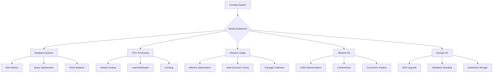

# Understanding Scale

## Introduction

Scale is not just about handling more users—it's a multi-dimensional challenge that affects every aspect of system design. Understanding the different dimensions of scale helps you identify bottlenecks early and choose appropriate scaling strategies. This section explores the various types of scale your system might encounter and how to measure and plan for growth.

## Types of Scale

### 1. User Scale
The number of concurrent and total users your system serves.

**Characteristics:**
- **Concurrent Users**: Active users at any given moment
- **Total Users**: Registered user base
- **Growth Patterns**: Linear, exponential, or seasonal spikes

**Example Growth Patterns:**
```
Startup Phase:     100 concurrent users
Growth Phase:      10,000 concurrent users  
Scale Phase:       1,000,000 concurrent users
Global Phase:      100,000,000 concurrent users
```

**Challenges:**
- Authentication and session management
- User-specific data storage and retrieval
- Personalization at scale
- Geographic distribution of users

### 2. Data Scale
The volume of data your system stores, processes, and serves.

**Dimensions:**
- **Storage Volume**: Total data stored (GB, TB, PB)
- **Data Velocity**: Rate of data ingestion
- **Data Variety**: Different types and formats of data
- **Data Complexity**: Relationships and processing requirements

**Growth Examples:**
```
Small Scale:    1 GB database, 1K records/day
Medium Scale:   100 GB database, 100K records/day
Large Scale:    10 TB database, 10M records/day
Web Scale:      1 PB+ database, 1B+ records/day
```

**Challenges:**
- Query performance degradation
- Storage cost optimization
- Data backup and recovery
- Data consistency across replicas

### 3. Request Scale
The volume and frequency of requests your system handles.

**Metrics:**
- **Requests Per Second (RPS)**: Peak and average request rates
- **Queries Per Second (QPS)**: Database query load
- **Transactions Per Second (TPS)**: Business transaction volume
- **Bandwidth**: Data transfer requirements

**Typical Scaling Thresholds:**
```
Low Traffic:     < 100 RPS
Medium Traffic:  100 - 10,000 RPS
High Traffic:    10,000 - 100,000 RPS
Web Scale:       > 100,000 RPS
```

**Request Patterns:**
- **Steady State**: Consistent traffic throughout the day
- **Peak Hours**: Predictable daily/weekly spikes
- **Flash Traffic**: Sudden, unpredictable surges
- **Seasonal**: Holiday or event-driven patterns

### 4. Geographic Scale
The global distribution of users and infrastructure.

**Considerations:**
- **Latency**: Network distance affects response times
- **Compliance**: Data residency and privacy regulations
- **Infrastructure**: Regional data centers and CDNs
- **Cultural**: Localization and time zone differences

**Geographic Scaling Stages:**
```
Local:      Single city/region
National:   Country-wide distribution
Regional:   Continental coverage (e.g., North America, Europe)
Global:     Worldwide presence with local infrastructure
```

## Measuring Scale

### Key Performance Indicators (KPIs)

**User Metrics:**
- Daily Active Users (DAU)
- Monthly Active Users (MAU)
- Peak Concurrent Users
- User Growth Rate

**System Metrics:**
- Response Time (P50, P95, P99)
- Throughput (RPS, QPS)
- Error Rate
- Availability (uptime percentage)

**Resource Metrics:**
- CPU Utilization
- Memory Usage
- Disk I/O
- Network Bandwidth

### Capacity Planning Formula

```
Required Capacity = Peak Load × Safety Factor × Growth Factor

Where:
- Peak Load: Maximum expected traffic
- Safety Factor: 1.5-3x buffer for unexpected spikes
- Growth Factor: Projected growth over planning period
```

**Example Calculation:**
```
Current Peak: 10,000 RPS
Safety Factor: 2x (100% buffer)
Growth Factor: 3x (200% growth expected)
Required Capacity: 10,000 × 2 × 3 = 60,000 RPS
```

## Scale Challenges and Patterns

### Common Scaling Bottlenecks



### Scaling Decision Matrix

| Scale Type | Low Volume | Medium Volume | High Volume | Web Scale |
|------------|------------|---------------|-------------|-----------|
| **Users** | < 1K | 1K - 100K | 100K - 10M | > 10M |
| **Data** | < 1 GB | 1 GB - 1 TB | 1 TB - 100 TB | > 100 TB |
| **Requests** | < 100 RPS | 100 - 10K RPS | 10K - 100K RPS | > 100K RPS |
| **Strategy** | Vertical Scale | Hybrid Approach | Horizontal Scale | Distributed Systems |
| **Complexity** | Low | Medium | High | Very High |
| **Cost** | Low | Medium | High | Very High |

## Real-World Scale Examples

### Social Media Platform Growth
```
Phase 1 (Startup):
- 1,000 users, 10 GB data, 50 RPS
- Single server with database

Phase 2 (Growth):
- 100,000 users, 500 GB data, 1,000 RPS
- Load balancer + multiple app servers + database

Phase 3 (Scale):
- 10,000,000 users, 50 TB data, 50,000 RPS
- Microservices + database sharding + CDN

Phase 4 (Global):
- 1,000,000,000 users, 5 PB data, 500,000 RPS
- Global infrastructure + advanced caching + ML optimization
```

### E-commerce Platform Scaling
```
Black Friday Traffic Pattern:
- Normal Day: 5,000 RPS
- Black Friday: 50,000 RPS (10x spike)
- Duration: 24-48 hours
- Strategy: Auto-scaling + CDN + queue systems
```

## Planning for Scale

### Scaling Roadmap Template

**Phase 1: Foundation (0-1K users)**
- [ ] Establish monitoring and alerting
- [ ] Implement basic caching
- [ ] Set up automated deployments
- [ ] Create performance baselines

**Phase 2: Growth (1K-100K users)**
- [ ] Add load balancing
- [ ] Implement database read replicas
- [ ] Introduce CDN for static assets
- [ ] Optimize database queries

**Phase 3: Scale (100K-10M users)**
- [ ] Implement horizontal scaling
- [ ] Add database sharding
- [ ] Introduce microservices architecture
- [ ] Implement advanced caching strategies

**Phase 4: Optimization (10M+ users)**
- [ ] Global infrastructure deployment
- [ ] Advanced data partitioning
- [ ] Machine learning optimization
- [ ] Real-time analytics and adaptation

### Early Warning Signs

**Performance Degradation Indicators:**
- Response times increasing consistently
- Database query times growing
- Memory usage approaching limits
- Error rates climbing
- User complaints about slowness

**Capacity Indicators:**
- CPU utilization > 70% sustained
- Memory usage > 80% sustained
- Database connections near limit
- Disk space < 20% free
- Network bandwidth > 80% utilized

## Summary

Understanding scale is the foundation of building systems that can grow. The four dimensions of scale—users, data, requests, and geography—each present unique challenges that require different solutions. By measuring the right metrics, planning for growth, and recognizing early warning signs, you can make informed decisions about when and how to scale your system.

**Key Takeaways:**
- Scale is multi-dimensional: users, data, requests, and geography
- Different scale levels require different architectural approaches
- Capacity planning should include safety and growth factors
- Early monitoring and planning prevent scaling crises
- Scaling decisions should be data-driven, not assumption-based

**Next Steps:**
In the following sections, we'll explore specific scaling strategies, starting with vertical scaling approaches and their trade-offs.
