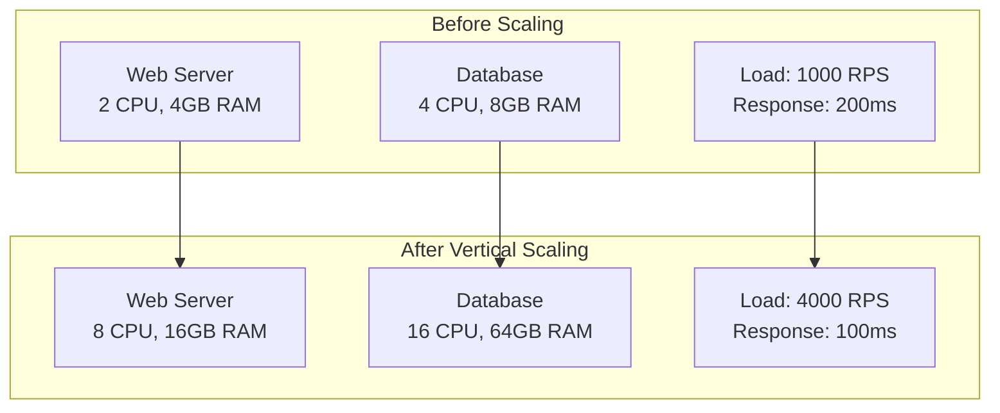
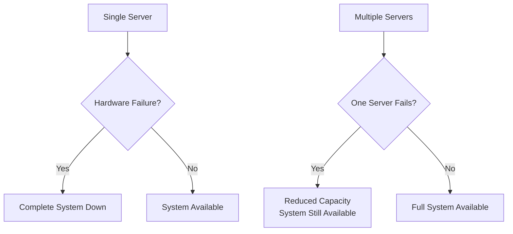

# Vertical Scaling (Scale Up)

## Introduction

Vertical scaling, also known as "scaling up," involves increasing the capacity of existing hardware by adding more CPU, RAM, storage, or network bandwidth to a single machine. It's often the first scaling approach teams consider because it's conceptually simple and doesn't require architectural changes. However, vertical scaling has both significant advantages and fundamental limitations that every system designer must understand.

## Core Concepts

### What is Vertical Scaling?

Vertical scaling means enhancing the capabilities of existing infrastructure rather than adding more infrastructure. Instead of adding more servers, you upgrade the servers you have.

**Common Vertical Scaling Upgrades:**
- **CPU**: More cores or faster processors
- **Memory (RAM)**: Additional memory capacity
- **Storage**: Faster SSDs or larger storage capacity
- **Network**: Higher bandwidth network interfaces

### Vertical Scaling Architecture



## Benefits of Vertical Scaling

### 1. Simplicity
**No Architectural Changes Required**
- Existing application code works unchanged
- No need to handle distributed system complexity
- Database transactions remain ACID compliant
- Session management stays simple

**Example:**
```python
# Application code remains identical
def process_user_request(user_id):
    user = database.get_user(user_id)  # Same database connection
    result = expensive_computation(user.data)  # More CPU power available
    return result
```

### 2. Immediate Performance Gains
**Linear Performance Improvements**
- More CPU cores = better parallel processing
- More RAM = larger caches and fewer disk reads
- Faster storage = quicker database operations
- Higher network bandwidth = faster data transfer

**Performance Impact Examples:**
```
Database Query Performance:
- 8GB RAM:  Query cache hit rate 60%, avg query time 50ms
- 32GB RAM: Query cache hit rate 90%, avg query time 15ms

Web Server Throughput:
- 4 CPU cores:  1,000 RPS max throughput
- 16 CPU cores: 4,000 RPS max throughput
```

### 3. Cost-Effective for Small to Medium Scale
**Lower Operational Complexity**
- Single server to monitor and maintain
- Simplified backup and disaster recovery
- Reduced network complexity
- Lower licensing costs for some software

### 4. Strong Consistency
**ACID Guarantees Maintained**
- All data operations on single machine
- No distributed transaction complexity
- Immediate consistency for all operations
- Simplified error handling

## Limitations of Vertical Scaling

### 1. Hardware Limits
**Physical Constraints**
Every machine has maximum specifications that cannot be exceeded.

**Current Hardware Limits (2024):**
```
CPU:     Up to 128+ cores per socket
RAM:     Up to 24TB per server (high-end systems)
Storage: Up to 100TB+ SSD per server
Network: Up to 400Gbps per interface
```

**Cost Scaling:**
```
Linear Resource Increase ≠ Linear Cost Increase

Example Server Costs:
- 4 CPU, 16GB RAM:   $200/month
- 8 CPU, 32GB RAM:   $500/month  (2.5x cost for 2x resources)
- 16 CPU, 64GB RAM:  $1,200/month (6x cost for 4x resources)
- 32 CPU, 128GB RAM: $3,000/month (15x cost for 8x resources)
```

### 2. Single Point of Failure
**Availability Risk**
- Hardware failure affects entire system
- Maintenance requires complete downtime
- No redundancy at application level



### 3. Diminishing Returns
**Performance vs. Cost Curve**

```
Performance Gain = f(Resource Increase)

Where f(x) follows diminishing returns:
- First 2x resources: ~80% performance gain
- Next 2x resources:  ~40% performance gain  
- Next 2x resources:  ~20% performance gain
```

**Real-World Example:**
```
Database Performance with RAM Increases:
- 8GB → 16GB:  50% query performance improvement
- 16GB → 32GB: 25% query performance improvement
- 32GB → 64GB: 12% query performance improvement
- 64GB → 128GB: 6% query performance improvement
```

### 4. Downtime for Upgrades
**Maintenance Windows Required**
- Hardware upgrades require server shutdown
- Memory upgrades need system restart
- Storage upgrades may require data migration
- CPU upgrades often need motherboard changes

## When to Use Vertical Scaling

### Ideal Scenarios

**1. Early Stage Applications**
```
Characteristics:
- < 10,000 concurrent users
- < 1TB data
- < 1,000 RPS
- Predictable growth patterns
```

**2. CPU-Intensive Applications**
```
Examples:
- Scientific computing
- Image/video processing
- Machine learning training
- Cryptographic operations
```

**3. Memory-Intensive Applications**
```
Examples:
- In-memory databases (Redis, Memcached)
- Large dataset analytics
- Real-time data processing
- Caching layers
```

**4. Applications Requiring Strong Consistency**
```
Examples:
- Financial systems
- Inventory management
- Booking systems
- Transactional applications
```

### Decision Matrix

| Factor | Vertical Scaling Suitable | Consider Horizontal |
|--------|---------------------------|-------------------|
| **Current Scale** | < 10K users | > 100K users |
| **Growth Rate** | Predictable, gradual | Rapid, unpredictable |
| **Consistency Needs** | Strong ACID required | Eventual consistency OK |
| **Budget** | Limited operational budget | Higher operational budget OK |
| **Team Size** | Small team | Large engineering team |
| **Complexity Tolerance** | Low | High |

## Implementation Strategies

### 1. Gradual Scaling Approach

**Phase 1: Baseline Optimization**
```bash
# Before scaling hardware, optimize software
# Database query optimization
EXPLAIN ANALYZE SELECT * FROM users WHERE active = true;

# Application profiling
# Identify CPU and memory bottlenecks
# Optimize algorithms and data structures
```

**Phase 2: Memory Scaling**
```
Current: 8GB RAM → Target: 32GB RAM
Expected Impact:
- Database cache hit ratio: 70% → 95%
- Application response time: 200ms → 100ms
- Concurrent user capacity: 1,000 → 4,000
```

**Phase 3: CPU Scaling**
```
Current: 4 cores → Target: 16 cores
Expected Impact:
- Request processing capacity: 500 RPS → 2,000 RPS
- Background job processing: 2x faster
- Concurrent connection handling: 4x improvement
```

**Phase 4: Storage Scaling**
```
Current: HDD → Target: NVMe SSD
Expected Impact:
- Database query time: 50ms → 10ms
- File I/O operations: 10x faster
- Application startup time: 5x faster
```

### 2. Monitoring and Measurement

**Key Metrics to Track:**
```python
# Resource utilization monitoring
metrics = {
    'cpu_usage': 'Average and peak CPU utilization',
    'memory_usage': 'RAM usage and swap activity',
    'disk_io': 'Read/write operations per second',
    'network_io': 'Bandwidth utilization',
    'application_metrics': {
        'response_time': 'P50, P95, P99 response times',
        'throughput': 'Requests per second',
        'error_rate': 'Percentage of failed requests',
        'concurrent_users': 'Active user sessions'
    }
}
```

**Scaling Triggers:**
```
Scale Up When:
- CPU usage > 70% sustained for 15+ minutes
- Memory usage > 80% sustained
- Disk I/O wait time > 20ms average
- Response time degradation > 50% from baseline
- Error rate increase due to resource constraints
```

### 3. Cost Optimization

**Right-Sizing Strategy:**
```python
def calculate_optimal_resources(current_metrics, growth_projection):
    """
    Calculate optimal resource allocation for vertical scaling
    """
    current_cpu_usage = current_metrics['cpu_usage']
    current_memory_usage = current_metrics['memory_usage']
    
    # Target 60-70% utilization for optimal cost/performance
    target_utilization = 0.65
    
    required_cpu = current_cpu_usage / target_utilization
    required_memory = current_memory_usage / target_utilization
    
    # Apply growth factor
    growth_factor = growth_projection['expected_growth_6_months']
    
    recommended_cpu = required_cpu * growth_factor
    recommended_memory = required_memory * growth_factor
    
    return {
        'cpu_cores': math.ceil(recommended_cpu),
        'memory_gb': math.ceil(recommended_memory),
        'estimated_cost': calculate_cost(recommended_cpu, recommended_memory)
    }
```

## Best Practices

### 1. Plan for Limits
```python
# Define scaling roadmap with clear limits
scaling_plan = {
    'phase_1': {'cpu': 4, 'ram': 16, 'users': 5000},
    'phase_2': {'cpu': 8, 'ram': 32, 'users': 15000},
    'phase_3': {'cpu': 16, 'ram': 64, 'users': 40000},
    'transition_to_horizontal': {'users': 50000, 'reason': 'cost_effectiveness'}
}
```

### 2. Implement Monitoring Early
```yaml
# Monitoring configuration
alerts:
  cpu_high:
    threshold: 70%
    duration: 15m
    action: "Consider CPU upgrade"
  
  memory_high:
    threshold: 80%
    duration: 10m
    action: "Consider RAM upgrade"
  
  response_time_degraded:
    threshold: 2x_baseline
    duration: 5m
    action: "Investigate performance bottleneck"
```

### 3. Optimize Before Scaling
```python
# Performance optimization checklist
optimization_checklist = [
    "Database query optimization and indexing",
    "Application code profiling and optimization",
    "Caching implementation (Redis, Memcached)",
    "Connection pooling configuration",
    "Garbage collection tuning",
    "Static asset optimization and CDN",
    "Algorithm and data structure improvements"
]
```

### 4. Plan Migration Path
```python
# Prepare for eventual horizontal scaling
migration_preparation = {
    'database': 'Design for eventual sharding',
    'sessions': 'Use external session store (Redis)',
    'file_storage': 'Use object storage (S3) instead of local files',
    'caching': 'Implement distributed caching',
    'monitoring': 'Use centralized logging and metrics'
}
```

## Common Pitfalls and Solutions

### 1. Over-Provisioning
**Problem:** Buying more resources than needed
**Solution:** Use monitoring data to make informed decisions

```python
# Resource utilization analysis
def analyze_resource_needs(metrics_30_days):
    peak_cpu = max(metrics_30_days['cpu_usage'])
    avg_cpu = sum(metrics_30_days['cpu_usage']) / len(metrics_30_days['cpu_usage'])
    
    if peak_cpu < 50 and avg_cpu < 30:
        return "Over-provisioned: Consider downsizing"
    elif peak_cpu > 80 or avg_cpu > 60:
        return "Under-provisioned: Scale up needed"
    else:
        return "Appropriately sized"
```

### 2. Ignoring Bottlenecks
**Problem:** Scaling the wrong resource
**Solution:** Profile and identify actual bottlenecks

```bash
# Bottleneck identification tools
# CPU profiling
top -p <process_id>
htop

# Memory analysis
free -h
vmstat 1

# Disk I/O monitoring
iostat -x 1

# Database performance
SHOW PROCESSLIST;
EXPLAIN ANALYZE <query>;
```

### 3. Delayed Scaling Decisions
**Problem:** Waiting too long to scale or transition to horizontal scaling
**Solution:** Set clear thresholds and automate decisions

```python
# Automated scaling decision framework
def scaling_decision(current_metrics, cost_analysis):
    vertical_cost = cost_analysis['next_vertical_upgrade']
    horizontal_cost = cost_analysis['horizontal_alternative']
    
    if vertical_cost > horizontal_cost * 1.5:
        return "transition_to_horizontal"
    elif current_metrics['resource_utilization'] > 0.8:
        return "scale_up_vertical"
    else:
        return "maintain_current"
```

## Summary

Vertical scaling is a powerful and simple scaling strategy that works well for many applications, especially in their early stages. It provides immediate performance benefits without requiring architectural changes, making it an attractive first option for growing systems.

**Key Advantages:**
- Simple implementation with no code changes
- Immediate performance improvements
- Maintains strong consistency guarantees
- Lower operational complexity

**Key Limitations:**
- Hardware limits create scaling ceiling
- Single point of failure risk
- Diminishing returns on investment
- Downtime required for upgrades

**When to Use Vertical Scaling:**
- Early-stage applications with predictable growth
- CPU or memory-intensive workloads
- Applications requiring strong consistency
- Teams with limited operational resources

**When to Consider Alternatives:**
- Approaching hardware limits
- Cost per performance unit becomes prohibitive
- High availability requirements
- Rapid or unpredictable growth patterns

Understanding these trade-offs helps you make informed decisions about when vertical scaling is appropriate and when it's time to consider horizontal scaling approaches, which we'll explore in the next section.
