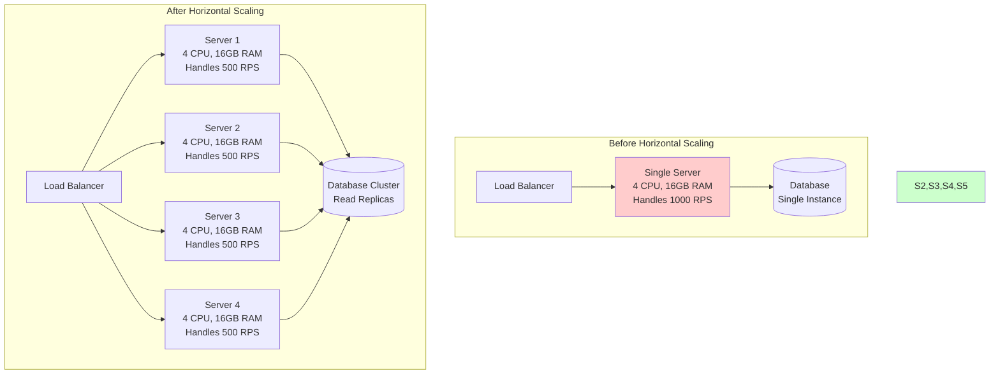
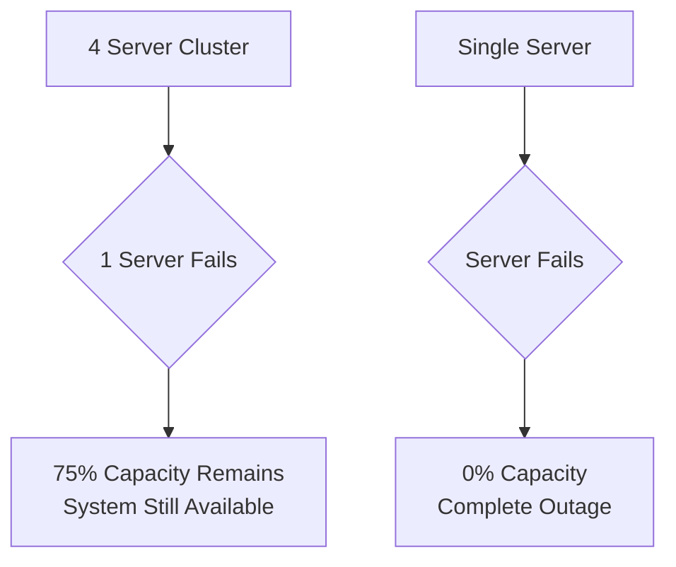
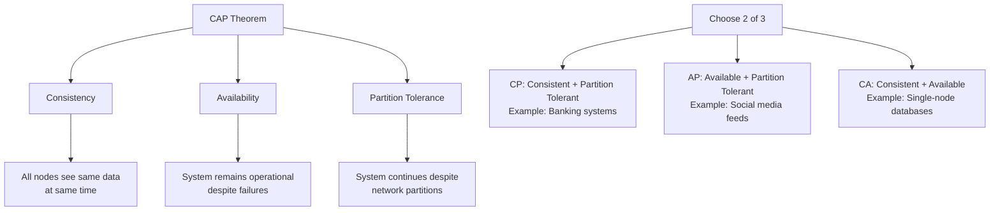
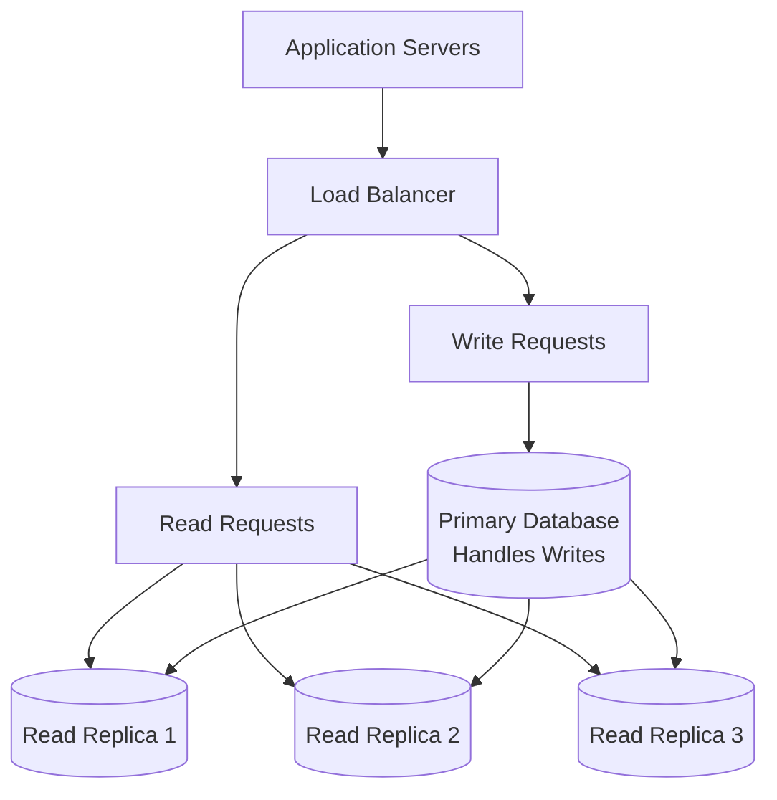

# Horizontal Scaling (Scale Out)

## Introduction

Horizontal scaling, also known as "scaling out," involves adding more machines to your resource pool to handle increased load. Unlike vertical scaling which enhances existing hardware, horizontal scaling distributes the workload across multiple servers. This approach is fundamental to building systems that can handle web-scale traffic and provides the foundation for modern distributed architectures.

## Core Concepts

### What is Horizontal Scaling?

Horizontal scaling means increasing capacity by adding more servers to your infrastructure rather than upgrading existing servers. The workload is distributed across multiple machines, each handling a portion of the total load.

**Key Characteristics:**
- **Distributed Processing**: Work is split across multiple machines
- **Redundancy**: Multiple servers provide fault tolerance
- **Linear Scalability**: Adding more servers increases capacity
- **Shared-Nothing Architecture**: Each server operates independently

### Horizontal Scaling Architecture



## Benefits of Horizontal Scaling

### 1. Unlimited Theoretical Scaling
**No Hardware Ceiling**
Unlike vertical scaling, horizontal scaling has no theoretical upper limit. You can continue adding servers as long as your architecture supports distribution.

**Scaling Examples:**
```
Small Scale:    2-5 servers
Medium Scale:   10-100 servers
Large Scale:    100-1,000 servers
Web Scale:      1,000-100,000+ servers

Real Examples:
- Google: 1M+ servers globally
- Facebook: 100K+ servers
- Netflix: 10K+ servers across multiple regions
```

### 2. Fault Tolerance and High Availability
**Redundancy Through Distribution**
Multiple servers mean that failure of one server doesn't bring down the entire system.



**Availability Calculation:**
```
Single Server Availability: 99.9% (8.76 hours downtime/year)

4-Server Cluster with Redundancy:
- Individual server availability: 99.9%
- Cluster availability: 99.9999% (0.52 minutes downtime/year)
- Improvement: 1000x better availability
```

### 3. Cost Effectiveness at Scale
**Linear Cost Scaling**
Horizontal scaling often provides better cost-performance ratios, especially using commodity hardware.

**Cost Comparison:**
```
Vertical Scaling (Single Server):
- 32 CPU, 128GB RAM: $3,000/month
- Performance: 4,000 RPS

Horizontal Scaling (4 Servers):
- 4x (8 CPU, 32GB RAM): 4 × $500 = $2,000/month
- Performance: 4,000 RPS (1,000 RPS each)
- Additional Benefits: Fault tolerance, geographic distribution
```

### 4. Geographic Distribution
**Global Presence**
Horizontal scaling enables deploying servers in multiple geographic regions, reducing latency for global users.

```
Geographic Distribution Example:
- US East: 10 servers (handles North American traffic)
- EU West: 8 servers (handles European traffic)  
- Asia Pacific: 6 servers (handles Asian traffic)

Benefits:
- Reduced latency: 50-200ms improvement per region
- Compliance: Data residency requirements
- Disaster recovery: Regional failover capability
```

## Challenges of Horizontal Scaling

### 1. Distributed System Complexity
**CAP Theorem Implications**
Horizontal scaling introduces distributed system challenges governed by the CAP theorem.



### 2. Data Consistency Challenges
**Eventual Consistency vs Strong Consistency**

**Strong Consistency Example:**
```python
# Banking transaction - requires strong consistency
def transfer_money(from_account, to_account, amount):
    # Must be atomic across all servers
    with distributed_transaction():
        from_balance = get_balance(from_account)  # Must be current
        if from_balance >= amount:
            debit(from_account, amount)
            credit(to_account, amount)
        else:
            raise InsufficientFundsError()
```

**Eventual Consistency Example:**
```python
# Social media post - eventual consistency acceptable
def create_post(user_id, content):
    post_id = generate_id()
    
    # Write to primary database
    primary_db.insert_post(post_id, user_id, content)
    
    # Asynchronously replicate to read replicas
    async_replicate_to_followers(post_id, user_id, content)
    
    # Users might see post at different times (eventual consistency)
    return post_id
```

### 3. Session Management
**Stateless vs Stateful Services**

**Problem with Stateful Services:**
```python
# Problematic: Server-specific session storage
class StatefulServer:
    def __init__(self):
        self.user_sessions = {}  # Stored in server memory
    
    def login(self, user_id, credentials):
        if authenticate(user_id, credentials):
            session_id = generate_session()
            self.user_sessions[session_id] = user_id  # Tied to this server
            return session_id
    
    def get_user(self, session_id):
        return self.user_sessions.get(session_id)  # Only works on same server
```

**Solution with Stateless Services:**
```python
# Better: External session storage
class StatelessServer:
    def __init__(self, session_store):
        self.session_store = session_store  # Redis, database, etc.
    
    def login(self, user_id, credentials):
        if authenticate(user_id, credentials):
            session_id = generate_session()
            self.session_store.set(session_id, user_id)  # Shared across servers
            return session_id
    
    def get_user(self, session_id):
        return self.session_store.get(session_id)  # Works from any server
```

### 4. Load Distribution Complexity
**Load Balancing Challenges**

```python
# Load balancing considerations
load_balancing_strategies = {
    'round_robin': {
        'description': 'Requests distributed evenly across servers',
        'pros': 'Simple, fair distribution',
        'cons': 'Ignores server capacity differences',
        'use_case': 'Homogeneous servers with similar workloads'
    },
    'weighted_round_robin': {
        'description': 'Distribution based on server capacity',
        'pros': 'Accounts for different server capabilities',
        'cons': 'Requires capacity configuration',
        'use_case': 'Mixed server configurations'
    },
    'least_connections': {
        'description': 'Route to server with fewest active connections',
        'pros': 'Adapts to varying request processing times',
        'cons': 'More complex tracking required',
        'use_case': 'Requests with varying processing times'
    },
    'ip_hash': {
        'description': 'Route based on client IP hash',
        'pros': 'Session affinity without external storage',
        'cons': 'Uneven distribution possible',
        'use_case': 'Stateful applications requiring session affinity'
    }
}
```

## Implementation Strategies

### 1. Stateless Application Design

**Design Principles:**
```python
# Stateless service design patterns
class StatelessUserService:
    def __init__(self, database, cache, session_store):
        self.db = database
        self.cache = cache
        self.sessions = session_store
    
    def get_user_profile(self, session_token):
        # Validate session (external storage)
        user_id = self.sessions.get_user_id(session_token)
        if not user_id:
            raise UnauthorizedError()
        
        # Check cache first (shared cache)
        profile = self.cache.get(f"user_profile:{user_id}")
        if profile:
            return profile
        
        # Fetch from database (shared database)
        profile = self.db.get_user_profile(user_id)
        
        # Cache for future requests (shared cache)
        self.cache.set(f"user_profile:{user_id}", profile, ttl=300)
        
        return profile
```

### 2. Database Scaling Patterns

**Read Replicas Pattern:**


**Implementation:**
```python
class DatabaseService:
    def __init__(self, primary_db, read_replicas):
        self.primary = primary_db
        self.replicas = read_replicas
        self.replica_index = 0
    
    def write(self, query, params):
        # All writes go to primary
        return self.primary.execute(query, params)
    
    def read(self, query, params):
        # Distribute reads across replicas
        replica = self.replicas[self.replica_index % len(self.replicas)]
        self.replica_index += 1
        return replica.execute(query, params)
```

### 3. Auto-Scaling Implementation

**Horizontal Pod Autoscaler (Kubernetes Example):**
```yaml
apiVersion: autoscaling/v2
kind: HorizontalPodAutoscaler
metadata:
  name: web-app-hpa
spec:
  scaleTargetRef:
    apiVersion: apps/v1
    kind: Deployment
    name: web-app
  minReplicas: 3
  maxReplicas: 50
  metrics:
  - type: Resource
    resource:
      name: cpu
      target:
        type: Utilization
        averageUtilization: 70
  - type: Resource
    resource:
      name: memory
      target:
        type: Utilization
        averageUtilization: 80
  behavior:
    scaleUp:
      stabilizationWindowSeconds: 60
      policies:
      - type: Percent
        value: 100
        periodSeconds: 15
    scaleDown:
      stabilizationWindowSeconds: 300
      policies:
      - type: Percent
        value: 10
        periodSeconds: 60
```

**Custom Auto-Scaling Logic:**
```python
class AutoScaler:
    def __init__(self, min_instances=2, max_instances=20):
        self.min_instances = min_instances
        self.max_instances = max_instances
        self.current_instances = min_instances
    
    def evaluate_scaling(self, metrics):
        cpu_usage = metrics['avg_cpu_usage']
        memory_usage = metrics['avg_memory_usage']
        response_time = metrics['avg_response_time']
        error_rate = metrics['error_rate']
        
        # Scale up conditions
        if (cpu_usage > 70 or memory_usage > 80 or 
            response_time > 500 or error_rate > 0.01):
            return self.scale_up()
        
        # Scale down conditions
        elif (cpu_usage < 30 and memory_usage < 40 and 
              response_time < 100 and error_rate < 0.001):
            return self.scale_down()
        
        return "no_action"
    
    def scale_up(self):
        if self.current_instances < self.max_instances:
            new_instances = min(
                self.current_instances * 2,  # Double capacity
                self.max_instances
            )
            self.add_instances(new_instances - self.current_instances)
            self.current_instances = new_instances
            return f"scaled_up_to_{new_instances}"
        return "max_capacity_reached"
    
    def scale_down(self):
        if self.current_instances > self.min_instances:
            new_instances = max(
                self.current_instances // 2,  # Halve capacity
                self.min_instances
            )
            self.remove_instances(self.current_instances - new_instances)
            self.current_instances = new_instances
            return f"scaled_down_to_{new_instances}"
        return "min_capacity_reached"
```

## Best Practices

### 1. Design for Failure
**Circuit Breaker Pattern:**
```python
class CircuitBreaker:
    def __init__(self, failure_threshold=5, timeout=60):
        self.failure_threshold = failure_threshold
        self.timeout = timeout
        self.failure_count = 0
        self.last_failure_time = None
        self.state = "CLOSED"  # CLOSED, OPEN, HALF_OPEN
    
    def call(self, func, *args, **kwargs):
        if self.state == "OPEN":
            if time.time() - self.last_failure_time > self.timeout:
                self.state = "HALF_OPEN"
            else:
                raise CircuitBreakerOpenError()
        
        try:
            result = func(*args, **kwargs)
            self.on_success()
            return result
        except Exception as e:
            self.on_failure()
            raise e
    
    def on_success(self):
        self.failure_count = 0
        self.state = "CLOSED"
    
    def on_failure(self):
        self.failure_count += 1
        self.last_failure_time = time.time()
        if self.failure_count >= self.failure_threshold:
            self.state = "OPEN"
```

### 2. Implement Health Checks
**Comprehensive Health Monitoring:**
```python
class HealthChecker:
    def __init__(self, services):
        self.services = services
    
    def check_health(self):
        health_status = {
            'status': 'healthy',
            'timestamp': datetime.utcnow().isoformat(),
            'services': {}
        }
        
        overall_healthy = True
        
        for service_name, service in self.services.items():
            try:
                service_health = self.check_service_health(service)
                health_status['services'][service_name] = service_health
                
                if service_health['status'] != 'healthy':
                    overall_healthy = False
                    
            except Exception as e:
                health_status['services'][service_name] = {
                    'status': 'unhealthy',
                    'error': str(e)
                }
                overall_healthy = False
        
        if not overall_healthy:
            health_status['status'] = 'unhealthy'
        
        return health_status
    
    def check_service_health(self, service):
        # Database connectivity
        if hasattr(service, 'ping'):
            service.ping()
        
        # Response time check
        start_time = time.time()
        service.health_check()
        response_time = (time.time() - start_time) * 1000
        
        return {
            'status': 'healthy' if response_time < 1000 else 'degraded',
            'response_time_ms': response_time
        }
```

### 3. Implement Graceful Degradation
**Service Degradation Strategy:**
```python
class GracefulDegradationService:
    def __init__(self, primary_service, fallback_service, cache):
        self.primary = primary_service
        self.fallback = fallback_service
        self.cache = cache
    
    def get_user_recommendations(self, user_id):
        try:
            # Try primary ML-based recommendations
            recommendations = self.primary.get_recommendations(user_id)
            self.cache.set(f"recommendations:{user_id}", recommendations)
            return recommendations
            
        except ServiceUnavailableError:
            # Fallback to cached recommendations
            cached = self.cache.get(f"recommendations:{user_id}")
            if cached:
                return cached
            
            # Final fallback to simple rule-based recommendations
            return self.fallback.get_popular_items()
```

### 4. Monitor and Observe
**Distributed Tracing:**
```python
import opentelemetry.trace as trace

class DistributedService:
    def __init__(self):
        self.tracer = trace.get_tracer(__name__)
    
    def process_request(self, request_id, user_id):
        with self.tracer.start_as_current_span("process_request") as span:
            span.set_attribute("request.id", request_id)
            span.set_attribute("user.id", user_id)
            
            # Call downstream services with trace context
            user_data = self.get_user_data(user_id)
            recommendations = self.get_recommendations(user_id)
            
            return self.build_response(user_data, recommendations)
    
    def get_user_data(self, user_id):
        with self.tracer.start_as_current_span("get_user_data") as span:
            span.set_attribute("user.id", user_id)
            # Service call with automatic trace propagation
            return self.user_service.get_user(user_id)
```

## Common Patterns and Anti-Patterns

### Patterns ✅

**1. Microservices Architecture**
```python
# Good: Single responsibility services
class UserService:
    def get_user(self, user_id): pass
    def update_user(self, user_id, data): pass

class OrderService:
    def create_order(self, user_id, items): pass
    def get_order_history(self, user_id): pass

class PaymentService:
    def process_payment(self, order_id, payment_info): pass
```

**2. Event-Driven Architecture**
```python
# Good: Loose coupling through events
class OrderService:
    def create_order(self, order_data):
        order = self.save_order(order_data)
        
        # Publish event instead of direct service calls
        self.event_bus.publish("order.created", {
            "order_id": order.id,
            "user_id": order.user_id,
            "total": order.total
        })
        
        return order

class InventoryService:
    def handle_order_created(self, event):
        # React to order creation
        self.reserve_inventory(event['order_id'])

class EmailService:
    def handle_order_created(self, event):
        # Send confirmation email
        self.send_order_confirmation(event['user_id'], event['order_id'])
```

### Anti-Patterns ❌

**1. Distributed Monolith**
```python
# Bad: Tight coupling between services
class OrderService:
    def create_order(self, order_data):
        # Synchronous calls to multiple services
        user = self.user_service.get_user(order_data['user_id'])  # Network call
        inventory = self.inventory_service.check_availability(order_data['items'])  # Network call
        payment = self.payment_service.validate_payment(order_data['payment'])  # Network call
        
        # If any service is down, entire operation fails
        if user and inventory and payment:
            return self.save_order(order_data)
        else:
            raise OrderCreationError()
```

**2. Chatty Interfaces**
```python
# Bad: Multiple round trips for single operation
def get_user_dashboard(user_id):
    user = user_service.get_user(user_id)          # Call 1
    profile = user_service.get_profile(user_id)    # Call 2
    preferences = user_service.get_preferences(user_id)  # Call 3
    orders = order_service.get_recent_orders(user_id)    # Call 4
    recommendations = ml_service.get_recommendations(user_id)  # Call 5
    
    return build_dashboard(user, profile, preferences, orders, recommendations)

# Good: Batch operations or composite services
def get_user_dashboard(user_id):
    # Single call returning all needed data
    dashboard_data = dashboard_service.get_dashboard_data(user_id)
    return dashboard_data
```

## Summary

Horizontal scaling is essential for building systems that can handle web-scale traffic and provide high availability. While it introduces complexity in terms of distributed system challenges, the benefits of unlimited scaling potential, fault tolerance, and cost effectiveness make it the preferred approach for large-scale systems.

**Key Advantages:**
- Unlimited theoretical scaling capacity
- Built-in fault tolerance and redundancy
- Cost-effective at scale using commodity hardware
- Geographic distribution capabilities

**Key Challenges:**
- Distributed system complexity (CAP theorem)
- Data consistency management
- Session and state management
- Load distribution complexity

**Success Factors:**
- Design stateless services from the beginning
- Implement proper load balancing strategies
- Plan for failure with circuit breakers and graceful degradation
- Use comprehensive monitoring and observability
- Choose appropriate consistency models for your use case

**When to Use Horizontal Scaling:**
- High availability requirements
- Unpredictable or rapid growth
- Global user base
- Cost optimization at scale
- When vertical scaling limits are reached

The key to successful horizontal scaling is embracing distributed system principles early in your architecture design. This includes designing for failure, implementing proper observability, and choosing the right consistency models for your specific use case requirements.
