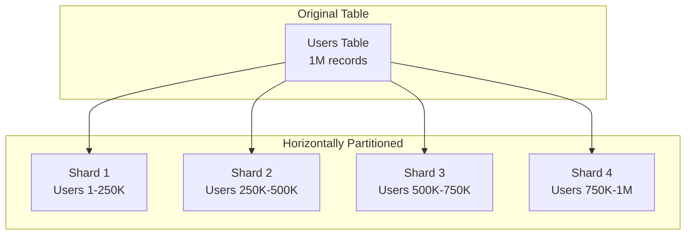
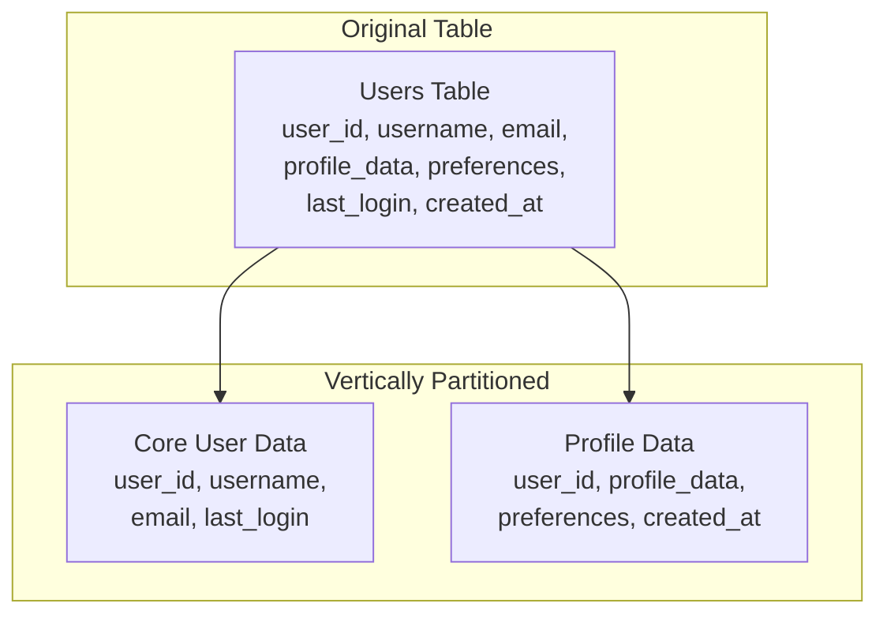
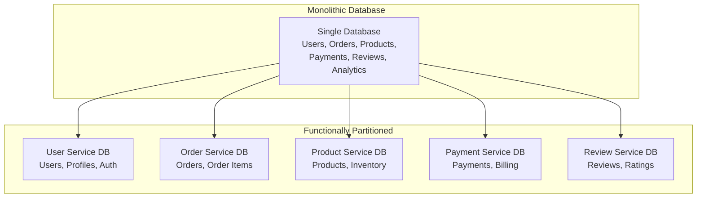

# Data Partitioning Strategies

## Introduction

Data partitioning is the practice of dividing large datasets across multiple storage systems to improve performance, scalability, and manageability. As systems grow, a single database server becomes a bottleneck for both storage capacity and query performance. Partitioning distributes data strategically to enable parallel processing, reduce query times, and scale beyond the limits of a single machine.

Understanding different partitioning strategies is crucial for designing scalable systems, as the choice of partitioning method significantly impacts performance, consistency, and operational complexity.

## Types of Data Partitioning

### 1. Horizontal Partitioning (Sharding)

Horizontal partitioning divides data by rows, distributing records across multiple databases based on a partitioning key.



**Example Implementation:**
```sql
-- Original table
CREATE TABLE users (
    user_id BIGINT PRIMARY KEY,
    username VARCHAR(50),
    email VARCHAR(100),
    created_at TIMESTAMP
);

-- Horizontally partitioned across 4 shards
-- Shard 1: user_id % 4 = 0
-- Shard 2: user_id % 4 = 1  
-- Shard 3: user_id % 4 = 2
-- Shard 4: user_id % 4 = 3
```

**Advantages:**
- Linear scalability with data growth
- Parallel query processing
- Improved write performance
- Fault isolation (one shard failure doesn't affect others)

**Disadvantages:**
- Complex cross-shard queries
- Rebalancing challenges when adding shards
- Application complexity for routing queries

### 2. Vertical Partitioning

Vertical partitioning divides data by columns, separating frequently accessed columns from rarely accessed ones.



**Example Implementation:**
```sql
-- Frequently accessed core data
CREATE TABLE users_core (
    user_id BIGINT PRIMARY KEY,
    username VARCHAR(50),
    email VARCHAR(100),
    last_login TIMESTAMP
);

-- Less frequently accessed profile data
CREATE TABLE users_profile (
    user_id BIGINT PRIMARY KEY,
    profile_data JSON,
    preferences JSON,
    created_at TIMESTAMP,
    FOREIGN KEY (user_id) REFERENCES users_core(user_id)
);
```

**Advantages:**
- Improved cache efficiency
- Reduced I/O for common queries
- Better security (sensitive data isolation)
- Optimized storage for different access patterns

**Disadvantages:**
- Joins required for complete data
- Increased complexity for full-record operations
- Potential for data inconsistency

### 3. Functional Partitioning

Functional partitioning separates data by feature or service domain, aligning with microservices architecture.



**Example Implementation:**
```python
# User Service Database
class UserDatabase:
    def __init__(self):
        self.connection = connect_to_user_db()
    
    def get_user(self, user_id):
        return self.connection.execute(
            "SELECT * FROM users WHERE user_id = %s", [user_id]
        )

# Order Service Database  
class OrderDatabase:
    def __init__(self):
        self.connection = connect_to_order_db()
    
    def get_user_orders(self, user_id):
        return self.connection.execute(
            "SELECT * FROM orders WHERE user_id = %s", [user_id]
        )
```

**Advantages:**
- Clear service boundaries
- Independent scaling per service
- Technology diversity (different databases per service)
- Team autonomy and ownership

**Disadvantages:**
- Cross-service queries require API calls
- Distributed transaction complexity
- Data consistency challenges
- Operational overhead

## Partitioning Methods

### 1. Range-Based Partitioning

Data is partitioned based on ranges of the partition key values.

**Implementation Example:**
```python
class RangePartitioner:
    def __init__(self):
        self.partitions = [
            {'name': 'shard_1', 'min': 0, 'max': 25000},
            {'name': 'shard_2', 'min': 25001, 'max': 50000},
            {'name': 'shard_3', 'min': 50001, 'max': 75000},
            {'name': 'shard_4', 'min': 75001, 'max': 100000}
        ]
    
    def get_partition(self, user_id):
        for partition in self.partitions:
            if partition['min'] <= user_id <= partition['max']:
                return partition['name']
        raise ValueError(f"No partition found for user_id: {user_id}")
    
    def range_query(self, min_id, max_id):
        # Efficiently query across relevant partitions only
        relevant_partitions = []
        for partition in self.partitions:
            if not (max_id < partition['min'] or min_id > partition['max']):
                relevant_partitions.append(partition['name'])
        return relevant_partitions
```

**Advantages:**
- Efficient range queries
- Simple to understand and implement
- Good for time-series data
- Easy to add new partitions for new ranges

**Disadvantages:**
- Potential for hotspots if data is not evenly distributed
- Difficult to rebalance existing partitions
- Requires knowledge of data distribution patterns

**Use Cases:**
- Time-series data (partition by date/time)
- Geographic data (partition by region)
- User data with predictable ID ranges

### 2. Hash-Based Partitioning

Data is partitioned using a hash function applied to the partition key.

**Implementation Example:**
```python
import hashlib

class HashPartitioner:
    def __init__(self, num_partitions=4):
        self.num_partitions = num_partitions
    
    def get_partition(self, key):
        # Use consistent hashing for better distribution
        hash_value = int(hashlib.md5(str(key).encode()).hexdigest(), 16)
        partition_id = hash_value % self.num_partitions
        return f"shard_{partition_id}"
    
    def get_partition_for_query(self, key):
        # Single key lookup - route to specific partition
        return self.get_partition(key)
    
    def get_all_partitions_for_scan(self):
        # Full table scan - query all partitions
        return [f"shard_{i}" for i in range(self.num_partitions)]

# Usage example
partitioner = HashPartitioner(num_partitions=8)

# User data distribution
users = [1001, 1002, 1003, 1004, 1005]
for user_id in users:
    partition = partitioner.get_partition(user_id)
    print(f"User {user_id} -> {partition}")

# Output might be:
# User 1001 -> shard_3
# User 1002 -> shard_7  
# User 1003 -> shard_1
# User 1004 -> shard_5
# User 1005 -> shard_2
```

**Advantages:**
- Even data distribution
- No hotspots (assuming good hash function)
- Simple partition routing logic
- Works well with unknown data patterns

**Disadvantages:**
- Range queries require scanning all partitions
- Difficult to add/remove partitions (resharding required)
- No locality for related data
- Complex rebalancing when scaling

**Use Cases:**
- User data with random access patterns
- Session data
- Cache partitioning
- Any scenario where even distribution is more important than range queries

### 3. Directory-Based Partitioning

A lookup service maintains the mapping between data and partitions.

**Implementation Example:**
```python
class DirectoryPartitioner:
    def __init__(self):
        self.directory = {}  # Could be Redis, database, etc.
        self.partitions = ['shard_1', 'shard_2', 'shard_3', 'shard_4']
        self.current_partition_index = 0
    
    def assign_partition(self, key):
        if key not in self.directory:
            # Assign to next partition in round-robin fashion
            partition = self.partitions[self.current_partition_index]
            self.directory[key] = partition
            self.current_partition_index = (self.current_partition_index + 1) % len(self.partitions)
        
        return self.directory[key]
    
    def get_partition(self, key):
        return self.directory.get(key)
    
    def migrate_key(self, key, new_partition):
        # Support for data migration
        old_partition = self.directory.get(key)
        self.directory[key] = new_partition
        return old_partition
    
    def get_keys_in_partition(self, partition):
        return [key for key, part in self.directory.items() if part == partition]

# Advanced directory with load balancing
class LoadBalancedDirectoryPartitioner:
    def __init__(self):
        self.directory = {}
        self.partition_loads = {'shard_1': 0, 'shard_2': 0, 'shard_3': 0, 'shard_4': 0}
    
    def assign_partition(self, key, estimated_load=1):
        if key not in self.directory:
            # Assign to least loaded partition
            least_loaded_partition = min(self.partition_loads, key=self.partition_loads.get)
            self.directory[key] = least_loaded_partition
            self.partition_loads[least_loaded_partition] += estimated_load
        
        return self.directory[key]
```

**Advantages:**
- Flexible partition assignment
- Support for data migration
- Can optimize for load balancing
- Easy to implement custom partitioning logic

**Disadvantages:**
- Directory service becomes a bottleneck
- Additional complexity and failure point
- Requires maintaining directory consistency
- Potential performance overhead for lookups

**Use Cases:**
- Complex partitioning requirements
- Frequent data migration needs
- Load-aware partitioning
- Multi-tenant systems with custom partition assignment

## Partitioning Strategy Selection

### Decision Matrix

| Factor | Range-Based | Hash-Based | Directory-Based |
|--------|-------------|------------|-----------------|
| **Even Distribution** | ❌ Depends on data | ✅ Excellent | ⚠️ Configurable |
| **Range Queries** | ✅ Excellent | ❌ Poor | ⚠️ Depends on implementation |
| **Hotspot Avoidance** | ❌ Prone to hotspots | ✅ Good | ✅ Can be optimized |
| **Rebalancing** | ⚠️ Moderate | ❌ Difficult | ✅ Flexible |
| **Complexity** | ✅ Simple | ✅ Simple | ❌ Complex |
| **Operational Overhead** | ✅ Low | ✅ Low | ❌ High |

### Use Case Guidelines

**Choose Range-Based When:**
```python
use_cases = {
    'time_series_data': {
        'example': 'Log data partitioned by date',
        'partition_key': 'timestamp',
        'query_pattern': 'Recent data queries, time range analytics'
    },
    'geographic_data': {
        'example': 'User data partitioned by region',
        'partition_key': 'region_id',
        'query_pattern': 'Location-based queries, regional analytics'
    },
    'sequential_ids': {
        'example': 'Orders partitioned by order_id ranges',
        'partition_key': 'order_id',
        'query_pattern': 'Recent orders, order range queries'
    }
}
```

**Choose Hash-Based When:**
```python
use_cases = {
    'user_data': {
        'example': 'User profiles with random access',
        'partition_key': 'user_id',
        'query_pattern': 'Individual user lookups, even load distribution'
    },
    'session_data': {
        'example': 'Web session storage',
        'partition_key': 'session_id',
        'query_pattern': 'Session lookups, no range queries needed'
    },
    'cache_partitioning': {
        'example': 'Distributed cache keys',
        'partition_key': 'cache_key',
        'query_pattern': 'Key-value lookups, even distribution critical'
    }
}
```

**Choose Directory-Based When:**
```python
use_cases = {
    'multi_tenant': {
        'example': 'SaaS application with tenant isolation',
        'partition_key': 'tenant_id',
        'query_pattern': 'Tenant-specific queries, custom partition assignment'
    },
    'load_balancing': {
        'example': 'Uneven data sizes requiring load balancing',
        'partition_key': 'entity_id',
        'query_pattern': 'Need to balance load across partitions'
    },
    'migration_heavy': {
        'example': 'System requiring frequent data migration',
        'partition_key': 'data_id',
        'query_pattern': 'Flexible partition assignment and migration'
    }
}
```

## Implementation Best Practices

### 1. Partition Key Selection

**Good Partition Key Characteristics:**
```python
def evaluate_partition_key(key_candidate, data_characteristics):
    """
    Evaluate the quality of a partition key
    """
    score = 0
    
    # High cardinality (many unique values)
    if data_characteristics['unique_values'] > 1000:
        score += 20
    
    # Even distribution
    if data_characteristics['distribution_skew'] < 0.1:
        score += 25
    
    # Stable over time (doesn't change)
    if data_characteristics['immutable']:
        score += 15
    
    # Frequently used in queries
    if data_characteristics['query_frequency'] > 0.8:
        score += 20
    
    # Supports common access patterns
    if data_characteristics['supports_common_queries']:
        score += 20
    
    return {
        'key': key_candidate,
        'score': score,
        'recommendation': 'good' if score >= 70 else 'poor'
    }

# Example evaluations
user_id_evaluation = evaluate_partition_key('user_id', {
    'unique_values': 1000000,
    'distribution_skew': 0.05,
    'immutable': True,
    'query_frequency': 0.9,
    'supports_common_queries': True
})
# Result: score = 100, recommendation = 'good'

timestamp_evaluation = evaluate_partition_key('created_at', {
    'unique_values': 100000,
    'distribution_skew': 0.3,  # Recent data accessed more
    'immutable': True,
    'query_frequency': 0.6,
    'supports_common_queries': True
})
# Result: score = 75, recommendation = 'good'
```

### 2. Handling Cross-Partition Queries

**Query Router Implementation:**
```python
class PartitionedQueryRouter:
    def __init__(self, partitioner, shard_connections):
        self.partitioner = partitioner
        self.shards = shard_connections
    
    def execute_single_partition_query(self, partition_key, query, params):
        """Execute query on single partition"""
        partition = self.partitioner.get_partition(partition_key)
        return self.shards[partition].execute(query, params)
    
    def execute_cross_partition_query(self, query, params):
        """Execute query across all partitions and merge results"""
        results = []
        
        # Execute on all partitions in parallel
        with ThreadPoolExecutor(max_workers=len(self.shards)) as executor:
            futures = []
            for partition_name, connection in self.shards.items():
                future = executor.submit(connection.execute, query, params)
                futures.append((partition_name, future))
            
            # Collect results
            for partition_name, future in futures:
                try:
                    result = future.result(timeout=30)
                    results.extend(result)
                except Exception as e:
                    logger.error(f"Query failed on partition {partition_name}: {e}")
                    # Decide whether to fail fast or continue with partial results
        
        return results
    
    def execute_aggregation_query(self, query, params, aggregation_func):
        """Execute aggregation across partitions"""
        partial_results = self.execute_cross_partition_query(query, params)
        return aggregation_func(partial_results)

# Usage examples
router = PartitionedQueryRouter(hash_partitioner, shard_connections)

# Single partition query
user_data = router.execute_single_partition_query(
    partition_key=user_id,
    query="SELECT * FROM users WHERE user_id = %s",
    params=[user_id]
)

# Cross-partition aggregation
total_users = router.execute_aggregation_query(
    query="SELECT COUNT(*) as count FROM users",
    params=[],
    aggregation_func=lambda results: sum(r['count'] for r in results)
)
```

### 3. Rebalancing Strategies

**Online Rebalancing Implementation:**
```python
class OnlineRebalancer:
    def __init__(self, source_shard, target_shard, partition_key_range):
        self.source = source_shard
        self.target = target_shard
        self.key_range = partition_key_range
        self.migration_batch_size = 1000
    
    def migrate_partition_range(self):
        """Migrate data range from source to target shard"""
        
        # Phase 1: Copy data while allowing writes to source
        self.copy_existing_data()
        
        # Phase 2: Sync incremental changes
        self.sync_incremental_changes()
        
        # Phase 3: Switch traffic atomically
        self.switch_traffic()
        
        # Phase 4: Cleanup source data
        self.cleanup_source_data()
    
    def copy_existing_data(self):
        """Copy existing data in batches"""
        offset = 0
        
        while True:
            # Read batch from source
            batch = self.source.execute(
                """SELECT * FROM users 
                   WHERE user_id BETWEEN %s AND %s 
                   ORDER BY user_id 
                   LIMIT %s OFFSET %s""",
                [self.key_range['min'], self.key_range['max'], 
                 self.migration_batch_size, offset]
            )
            
            if not batch:
                break
            
            # Write batch to target
            self.target.bulk_insert('users', batch)
            
            offset += self.migration_batch_size
            
            # Rate limiting to avoid overwhelming systems
            time.sleep(0.1)
    
    def sync_incremental_changes(self):
        """Sync changes that occurred during initial copy"""
        # Implementation depends on change capture mechanism
        # Could use database change streams, application-level logging, etc.
        pass
    
    def switch_traffic(self):
        """Atomically switch read/write traffic to target"""
        # Update partition routing configuration
        # This should be atomic to avoid split-brain scenarios
        pass
    
    def cleanup_source_data(self):
        """Remove migrated data from source shard"""
        self.source.execute(
            "DELETE FROM users WHERE user_id BETWEEN %s AND %s",
            [self.key_range['min'], self.key_range['max']]
        )
```

### 4. Monitoring and Alerting

**Partition Health Monitoring:**
```python
class PartitionMonitor:
    def __init__(self, partitions):
        self.partitions = partitions
        self.metrics_collector = MetricsCollector()
    
    def collect_partition_metrics(self):
        """Collect health metrics for all partitions"""
        metrics = {}
        
        for partition_name, connection in self.partitions.items():
            try:
                partition_metrics = {
                    'size_gb': self.get_partition_size(connection),
                    'row_count': self.get_row_count(connection),
                    'avg_query_time': self.get_avg_query_time(connection),
                    'cpu_usage': self.get_cpu_usage(connection),
                    'memory_usage': self.get_memory_usage(connection),
                    'connection_count': self.get_connection_count(connection)
                }
                
                metrics[partition_name] = partition_metrics
                
            except Exception as e:
                logger.error(f"Failed to collect metrics for {partition_name}: {e}")
                metrics[partition_name] = {'status': 'error', 'error': str(e)}
        
        return metrics
    
    def detect_imbalances(self, metrics):
        """Detect partition imbalances that may require rebalancing"""
        sizes = [m.get('size_gb', 0) for m in metrics.values() if 'size_gb' in m]
        row_counts = [m.get('row_count', 0) for m in metrics.values() if 'row_count' in m]
        
        if not sizes or not row_counts:
            return []
        
        avg_size = sum(sizes) / len(sizes)
        avg_rows = sum(row_counts) / len(row_counts)
        
        imbalances = []
        
        for partition_name, partition_metrics in metrics.items():
            if 'size_gb' not in partition_metrics:
                continue
                
            size_ratio = partition_metrics['size_gb'] / avg_size
            row_ratio = partition_metrics['row_count'] / avg_rows
            
            # Flag partitions that are significantly larger than average
            if size_ratio > 2.0 or row_ratio > 2.0:
                imbalances.append({
                    'partition': partition_name,
                    'size_ratio': size_ratio,
                    'row_ratio': row_ratio,
                    'recommendation': 'consider_rebalancing'
                })
        
        return imbalances
```

## Common Pitfalls and Solutions

### 1. Hotspot Creation

**Problem:** Uneven data distribution causing some partitions to be overloaded.

**Example of Poor Partitioning:**
```python
# Bad: Partitioning by timestamp creates hotspots
# All recent data goes to the same partition
def bad_timestamp_partitioner(timestamp):
    date = timestamp.date()
    return f"shard_{date.year}_{date.month}"

# Recent data hotspot:
# shard_2024_01 -> 90% of traffic (current month)
# shard_2023_12 -> 5% of traffic  
# shard_2023_11 -> 3% of traffic
# Other shards -> 2% of traffic
```

**Solution: Composite Partitioning:**
```python
# Good: Combine timestamp with hash for even distribution
def improved_partitioner(user_id, timestamp):
    # Use hash of user_id for even distribution
    hash_part = hash(user_id) % 4
    
    # Use timestamp for time-based queries
    date_part = timestamp.strftime("%Y_%m")
    
    return f"shard_{hash_part}_{date_part}"

# Results in even distribution:
# shard_0_2024_01, shard_1_2024_01, shard_2_2024_01, shard_3_2024_01
# Each gets ~25% of current traffic
```

### 2. Cross-Partition Query Performance

**Problem:** Queries spanning multiple partitions are slow and resource-intensive.

**Solution: Denormalization and Caching:**
```python
# Problem: Cross-partition join
def get_user_order_summary(user_id):
    # User data in one partition
    user = user_service.get_user(user_id)
    
    # Orders might be in different partitions
    orders = order_service.get_user_orders(user_id)  # Expensive cross-partition query
    
    return build_summary(user, orders)

# Solution: Denormalize frequently accessed data
class UserOrderSummaryCache:
    def __init__(self, cache, user_service, order_service):
        self.cache = cache
        self.user_service = user_service
        self.order_service = order_service
    
    def get_user_order_summary(self, user_id):
        # Check cache first
        cached = self.cache.get(f"user_summary:{user_id}")
        if cached:
            return cached
        
        # Build summary and cache it
        user = self.user_service.get_user(user_id)
        orders = self.order_service.get_user_orders(user_id)
        summary = build_summary(user, orders)
        
        # Cache for future requests
        self.cache.set(f"user_summary:{user_id}", summary, ttl=3600)
        
        return summary
```

### 3. Partition Key Changes

**Problem:** Need to change partition key after system is in production.

**Solution: Gradual Migration Strategy:**
```python
class PartitionKeyMigration:
    def __init__(self, old_partitioner, new_partitioner):
        self.old_partitioner = old_partitioner
        self.new_partitioner = new_partitioner
        self.migration_status = {}
    
    def migrate_gradually(self, data_range):
        """Migrate partition key gradually without downtime"""
        
        # Phase 1: Dual write to both old and new partitions
        self.enable_dual_writes(data_range)
        
        # Phase 2: Migrate existing data
        self.migrate_existing_data(data_range)
        
        # Phase 3: Switch reads to new partitions
        self.switch_reads(data_range)
        
        # Phase 4: Stop dual writes, cleanup old partitions
        self.cleanup_old_partitions(data_range)
    
    def enable_dual_writes(self, data_range):
        """Write to both old and new partition schemes"""
        for key in data_range:
            old_partition = self.old_partitioner.get_partition(key)
            new_partition = self.new_partitioner.get_partition(key)
            
            # Mark for dual writing
            self.migration_status[key] = {
                'old_partition': old_partition,
                'new_partition': new_partition,
                'phase': 'dual_write'
            }
```

## Summary

Data partitioning is essential for scaling systems beyond single-machine limits. The choice of partitioning strategy significantly impacts system performance, scalability, and operational complexity.

**Key Takeaways:**

**Partitioning Types:**
- **Horizontal**: Distribute rows across partitions (most common for scaling)
- **Vertical**: Separate columns by access patterns (optimize for specific queries)
- **Functional**: Separate by business domain (align with microservices)

**Partitioning Methods:**
- **Range-based**: Best for time-series and sequential data with range queries
- **Hash-based**: Best for even distribution and random access patterns
- **Directory-based**: Best for complex requirements and frequent migrations

**Success Factors:**
- Choose partition keys with high cardinality and even distribution
- Design for your most common query patterns
- Plan for cross-partition queries and their performance implications
- Implement monitoring to detect imbalances early
- Design migration strategies before you need them

**Common Pitfalls to Avoid:**
- Creating hotspots through poor partition key selection
- Ignoring cross-partition query performance
- Not planning for partition key changes
- Over-engineering partitioning for small datasets

The key to successful partitioning is understanding your data access patterns and choosing the strategy that best aligns with your system's requirements for consistency, performance, and scalability.
