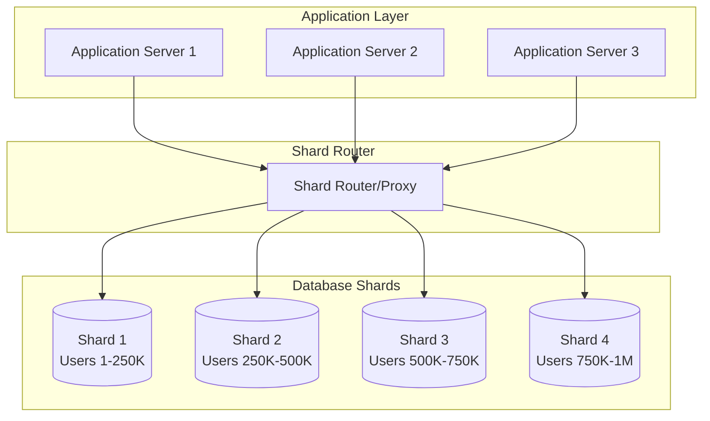

# Database Sharding Basics

## Introduction

Database sharding is a specific type of horizontal partitioning where data is distributed across multiple database instances (shards), each running on separate servers. Unlike simple partitioning within a single database, sharding involves completely separate database instances that can be scaled independently. This approach is essential for applications that have outgrown the capacity of a single database server and need to distribute both data storage and query processing load.

Sharding is one of the most effective techniques for achieving horizontal scalability in database systems, but it also introduces significant complexity in terms of data management, query routing, and maintaining consistency across shards.

## Core Sharding Concepts

### What is Database Sharding?

Database sharding splits a large database into smaller, more manageable pieces called shards. Each shard:
- Contains a subset of the total data
- Runs on a separate database server
- Can be scaled independently
- Operates as an autonomous database instance



### Shard Key Selection

The shard key (or sharding key) determines how data is distributed across shards. It's the most critical decision in sharding design.

**Good Shard Key Characteristics:**
```python
def evaluate_shard_key(key_name, data_analysis):
    """
    Evaluate the quality of a potential shard key
    """
    criteria = {
        'high_cardinality': data_analysis['unique_values'] > 10000,
        'even_distribution': data_analysis['distribution_coefficient'] < 0.2,
        'immutable': data_analysis['change_frequency'] == 0,
        'query_friendly': data_analysis['used_in_queries_percent'] > 80,
        'monotonic_safe': not data_analysis['is_monotonically_increasing']
    }
    
    score = sum(criteria.values())
    
    return {
        'key': key_name,
        'score': score,
        'max_score': len(criteria),
        'recommendation': 'excellent' if score >= 4 else 'good' if score >= 3 else 'poor',
        'criteria_met': criteria
    }

# Example evaluations
user_id_eval = evaluate_shard_key('user_id', {
    'unique_values': 1000000,
    'distribution_coefficient': 0.05,  # Very even
    'change_frequency': 0,  # Never changes
    'used_in_queries_percent': 95,
    'is_monotonically_increasing': True  # Potential issue
})

email_hash_eval = evaluate_shard_key('email_hash', {
    'unique_values': 1000000,
    'distribution_coefficient': 0.02,  # Excellent distribution
    'change_frequency': 0.001,  # Rarely changes
    'used_in_queries_percent': 85,
    'is_monotonically_increasing': False  # Good
})
```

## Sharding Strategies

### 1. Range-Based Sharding

Data is distributed based on ranges of the shard key values.

**Implementation Example:**
```python
class RangeBasedSharder:
    def __init__(self):
        self.shard_ranges = [
            {'shard_id': 'shard_1', 'min_key': 1, 'max_key': 250000, 'server': 'db1.example.com'},
            {'shard_id': 'shard_2', 'min_key': 250001, 'max_key': 500000, 'server': 'db2.example.com'},
            {'shard_id': 'shard_3', 'min_key': 500001, 'max_key': 750000, 'server': 'db3.example.com'},
            {'shard_id': 'shard_4', 'min_key': 750001, 'max_key': 1000000, 'server': 'db4.example.com'}
        ]
    
    def get_shard(self, shard_key):
        """Route single key to appropriate shard"""
        for shard_range in self.shard_ranges:
            if shard_range['min_key'] <= shard_key <= shard_range['max_key']:
                return shard_range
        raise ValueError(f"No shard found for key: {shard_key}")
    
    def get_shards_for_range(self, min_key, max_key):
        """Get all shards that contain data in the specified range"""
        relevant_shards = []
        for shard_range in self.shard_ranges:
            # Check if ranges overlap
            if not (max_key < shard_range['min_key'] or min_key > shard_range['max_key']):
                relevant_shards.append(shard_range)
        return relevant_shards
    
    def add_shard(self, new_shard_config):
        """Add a new shard and rebalance ranges"""
        # This is complex and typically requires data migration
        # Implementation depends on specific requirements
        pass

# Usage example
sharder = RangeBasedSharder()

# Single user lookup
user_shard = sharder.get_shard(user_id=123456)
print(f"User 123456 is in {user_shard['shard_id']} on {user_shard['server']}")

# Range query
recent_users_shards = sharder.get_shards_for_range(min_key=900000, max_key=1000000)
print(f"Recent users query needs to hit {len(recent_users_shards)} shards")
```

**Advantages:**
- Excellent for range queries
- Simple to understand and debug
- Easy to add new shards for new ranges
- Good locality for sequential data

**Disadvantages:**
- Prone to hotspots (e.g., recent data gets more traffic)
- Difficult to rebalance existing ranges
- Requires good understanding of data distribution

**Best Use Cases:**
```python
range_sharding_use_cases = {
    'time_series_data': {
        'example': 'Log entries sharded by timestamp',
        'shard_key': 'created_at',
        'benefit': 'Recent logs queries hit single shard'
    },
    'geographic_data': {
        'example': 'Users sharded by geographic region',
        'shard_key': 'region_code',
        'benefit': 'Location-based queries are efficient'
    },
    'sequential_ids': {
        'example': 'Orders sharded by order_id ranges',
        'shard_key': 'order_id',
        'benefit': 'Recent orders and range queries are fast'
    }
}
```

### 2. Hash-Based Sharding

Data is distributed using a hash function applied to the shard key.

**Implementation Example:**
```python
import hashlib
import bisect

class ConsistentHashSharder:
    def __init__(self, shards, virtual_nodes=150):
        self.shards = shards
        self.virtual_nodes = virtual_nodes
        self.ring = {}
        self.sorted_keys = []
        self._build_ring()
    
    def _hash(self, key):
        """Generate hash for a key"""
        return int(hashlib.md5(str(key).encode()).hexdigest(), 16)
    
    def _build_ring(self):
        """Build the consistent hash ring"""
        for shard in self.shards:
            for i in range(self.virtual_nodes):
                virtual_key = self._hash(f"{shard['shard_id']}:{i}")
                self.ring[virtual_key] = shard
                self.sorted_keys.append(virtual_key)
        
        self.sorted_keys.sort()
    
    def get_shard(self, shard_key):
        """Get shard for a given key using consistent hashing"""
        if not self.ring:
            raise ValueError("No shards available")
        
        key_hash = self._hash(shard_key)
        
        # Find the first shard clockwise from the key
        idx = bisect.bisect_right(self.sorted_keys, key_hash)
        if idx == len(self.sorted_keys):
            idx = 0
        
        return self.ring[self.sorted_keys[idx]]
    
    def add_shard(self, new_shard):
        """Add a new shard to the ring"""
        self.shards.append(new_shard)
        
        # Add virtual nodes for the new shard
        for i in range(self.virtual_nodes):
            virtual_key = self._hash(f"{new_shard['shard_id']}:{i}")
            self.ring[virtual_key] = new_shard
            bisect.insort(self.sorted_keys, virtual_key)
    
    def remove_shard(self, shard_id):
        """Remove a shard from the ring"""
        # Remove from shards list
        self.shards = [s for s in self.shards if s['shard_id'] != shard_id]
        
        # Remove virtual nodes from ring
        keys_to_remove = []
        for key, shard in self.ring.items():
            if shard['shard_id'] == shard_id:
                keys_to_remove.append(key)
        
        for key in keys_to_remove:
            del self.ring[key]
            self.sorted_keys.remove(key)
    
    def get_key_distribution(self, sample_keys):
        """Analyze how keys are distributed across shards"""
        distribution = {}
        for shard in self.shards:
            distribution[shard['shard_id']] = 0
        
        for key in sample_keys:
            shard = self.get_shard(key)
            distribution[shard['shard_id']] += 1
        
        return distribution

# Usage example
shards = [
    {'shard_id': 'shard_1', 'server': 'db1.example.com'},
    {'shard_id': 'shard_2', 'server': 'db2.example.com'},
    {'shard_id': 'shard_3', 'server': 'db3.example.com'},
    {'shard_id': 'shard_4', 'server': 'db4.example.com'}
]

sharder = ConsistentHashSharder(shards)

# Test distribution
sample_user_ids = range(1, 10001)
distribution = sharder.get_key_distribution(sample_user_ids)
print("Key distribution:", distribution)

# Add new shard
new_shard = {'shard_id': 'shard_5', 'server': 'db5.example.com'}
sharder.add_shard(new_shard)

# Check new distribution
new_distribution = sharder.get_key_distribution(sample_user_ids)
print("Distribution after adding shard:", new_distribution)
```

**Advantages:**
- Excellent even distribution
- No hotspots (assuming good hash function)
- Consistent hashing minimizes data movement when adding/removing shards
- Works well with unknown data patterns

**Disadvantages:**
- Range queries require hitting all shards
- More complex than range-based sharding
- Debugging and troubleshooting is harder
- Cross-shard transactions are complex

### 3. Directory-Based Sharding

A lookup service maintains the mapping between data and shards.

**Implementation Example:**
```python
class DirectoryBasedSharder:
    def __init__(self, directory_service, default_shards):
        self.directory = directory_service  # Could be Redis, database, etc.
        self.default_shards = default_shards
        self.shard_loads = {shard['shard_id']: 0 for shard in default_shards}
    
    def get_shard(self, shard_key):
        """Get shard for a key, assigning if not exists"""
        # Check directory first
        shard_id = self.directory.get(f"shard_mapping:{shard_key}")
        
        if shard_id:
            return self._get_shard_by_id(shard_id)
        
        # Assign to least loaded shard
        return self._assign_new_key(shard_key)
    
    def _assign_new_key(self, shard_key, estimated_load=1):
        """Assign key to optimal shard based on current load"""
        # Find least loaded shard
        least_loaded_shard_id = min(self.shard_loads, key=self.shard_loads.get)
        
        # Update directory
        self.directory.set(f"shard_mapping:{shard_key}", least_loaded_shard_id)
        
        # Update load tracking
        self.shard_loads[least_loaded_shard_id] += estimated_load
        
        return self._get_shard_by_id(least_loaded_shard_id)
    
    def migrate_key(self, shard_key, target_shard_id, estimated_load=1):
        """Migrate a key to a different shard"""
        current_shard_id = self.directory.get(f"shard_mapping:{shard_key}")
        
        if current_shard_id:
            # Update load tracking
            self.shard_loads[current_shard_id] -= estimated_load
            self.shard_loads[target_shard_id] += estimated_load
        
        # Update directory
        self.directory.set(f"shard_mapping:{shard_key}", target_shard_id)
        
        return {
            'old_shard': current_shard_id,
            'new_shard': target_shard_id,
            'migration_required': current_shard_id != target_shard_id
        }
    
    def get_shard_statistics(self):
        """Get current shard load statistics"""
        total_load = sum(self.shard_loads.values())
        
        stats = {}
        for shard_id, load in self.shard_loads.items():
            stats[shard_id] = {
                'load': load,
                'load_percentage': (load / total_load * 100) if total_load > 0 else 0,
                'shard_info': self._get_shard_by_id(shard_id)
            }
        
        return stats
    
    def rebalance_shards(self, target_balance_threshold=0.1):
        """Rebalance shards if load distribution is uneven"""
        stats = self.get_shard_statistics()
        
        # Calculate load imbalance
        loads = [stat['load'] for stat in stats.values()]
        avg_load = sum(loads) / len(loads)
        
        overloaded_shards = []
        underloaded_shards = []
        
        for shard_id, stat in stats.items():
            load_ratio = stat['load'] / avg_load if avg_load > 0 else 0
            
            if load_ratio > (1 + target_balance_threshold):
                overloaded_shards.append((shard_id, stat['load']))
            elif load_ratio < (1 - target_balance_threshold):
                underloaded_shards.append((shard_id, stat['load']))
        
        # Generate rebalancing plan
        rebalancing_plan = []
        for overloaded_shard, overload in overloaded_shards:
            excess_load = overload - avg_load
            
            # Find keys to migrate from this shard
            keys_to_migrate = self._get_keys_for_shard(overloaded_shard, excess_load)
            
            for key, load in keys_to_migrate:
                if underloaded_shards:
                    target_shard, target_load = underloaded_shards[0]
                    rebalancing_plan.append({
                        'key': key,
                        'from_shard': overloaded_shard,
                        'to_shard': target_shard,
                        'load': load
                    })
                    
                    # Update underloaded shard load
                    underloaded_shards[0] = (target_shard, target_load + load)
                    
                    # Remove from underloaded if it's now balanced
                    if target_load + load >= avg_load * (1 - target_balance_threshold):
                        underloaded_shards.pop(0)
        
        return rebalancing_plan

# Advanced directory with tenant awareness
class TenantAwareDirectorySharder:
    def __init__(self, directory_service, shards):
        self.directory = directory_service
        self.shards = shards
        self.tenant_shard_preferences = {}
    
    def assign_tenant_to_shard(self, tenant_id, preferred_shard_id=None):
        """Assign entire tenant to specific shard for data locality"""
        if preferred_shard_id and preferred_shard_id in [s['shard_id'] for s in self.shards]:
            assigned_shard = preferred_shard_id
        else:
            # Auto-assign based on current tenant distribution
            assigned_shard = self._auto_assign_tenant_shard(tenant_id)
        
        self.tenant_shard_preferences[tenant_id] = assigned_shard
        self.directory.set(f"tenant_shard:{tenant_id}", assigned_shard)
        
        return assigned_shard
    
    def get_shard_for_tenant_data(self, tenant_id, data_key):
        """Get shard for tenant-specific data"""
        tenant_shard = self.directory.get(f"tenant_shard:{tenant_id}")
        
        if not tenant_shard:
            tenant_shard = self.assign_tenant_to_shard(tenant_id)
        
        return self._get_shard_by_id(tenant_shard)
```

**Advantages:**
- Maximum flexibility in shard assignment
- Can optimize for load balancing
- Supports complex business rules for data placement
- Easy to implement custom migration strategies

**Disadvantages:**
- Directory service becomes a potential bottleneck
- Additional complexity and failure point
- Requires maintaining directory consistency
- Higher operational overhead

## Sharding Implementation Patterns

### 1. Application-Level Sharding

The application handles shard routing and query distribution.

```python
class ApplicationLevelSharder:
    def __init__(self, shard_configs, sharding_strategy):
        self.shards = {}
        self.sharding_strategy = sharding_strategy
        
        # Initialize database connections for each shard
        for config in shard_configs:
            self.shards[config['shard_id']] = DatabaseConnection(
                host=config['host'],
                port=config['port'],
                database=config['database'],
                username=config['username'],
                password=config['password']
            )
    
    def execute_query(self, shard_key, query, params=None):
        """Execute query on appropriate shard"""
        shard_info = self.sharding_strategy.get_shard(shard_key)
        shard_connection = self.shards[shard_info['shard_id']]
        
        try:
            return shard_connection.execute(query, params)
        except Exception as e:
            logger.error(f"Query failed on shard {shard_info['shard_id']}: {e}")
            raise
    
    def execute_cross_shard_query(self, query, params=None, aggregation_func=None):
        """Execute query across all shards"""
        results = []
        failed_shards = []
        
        # Execute on all shards in parallel
        with ThreadPoolExecutor(max_workers=len(self.shards)) as executor:
            future_to_shard = {}
            
            for shard_id, connection in self.shards.items():
                future = executor.submit(connection.execute, query, params)
                future_to_shard[future] = shard_id
            
            for future in as_completed(future_to_shard):
                shard_id = future_to_shard[future]
                try:
                    result = future.result(timeout=30)
                    results.extend(result if isinstance(result, list) else [result])
                except Exception as e:
                    failed_shards.append(shard_id)
                    logger.error(f"Cross-shard query failed on {shard_id}: {e}")
        
        if failed_shards:
            logger.warning(f"Query failed on shards: {failed_shards}")
        
        # Apply aggregation if provided
        if aggregation_func:
            return aggregation_func(results)
        
        return results
    
    def begin_distributed_transaction(self, shard_keys):
        """Begin distributed transaction across multiple shards"""
        involved_shards = []
        for key in shard_keys:
            shard_info = self.sharding_strategy.get_shard(key)
            if shard_info['shard_id'] not in involved_shards:
                involved_shards.append(shard_info['shard_id'])
        
        return DistributedTransaction(
            shards={sid: self.shards[sid] for sid in involved_shards}
        )

class DistributedTransaction:
    def __init__(self, shards):
        self.shards = shards
        self.transaction_ids = {}
        self.state = 'INIT'
    
    def __enter__(self):
        # Begin transaction on all involved shards
        for shard_id, connection in self.shards.items():
            tx_id = connection.begin_transaction()
            self.transaction_ids[shard_id] = tx_id
        
        self.state = 'ACTIVE'
        return self
    
    def __exit__(self, exc_type, exc_val, exc_tb):
        if exc_type is None:
            self.commit()
        else:
            self.rollback()
    
    def commit(self):
        """Two-phase commit across shards"""
        # Phase 1: Prepare
        prepared_shards = []
        
        for shard_id, connection in self.shards.items():
            try:
                connection.prepare_transaction(self.transaction_ids[shard_id])
                prepared_shards.append(shard_id)
            except Exception as e:
                logger.error(f"Prepare failed on shard {shard_id}: {e}")
                # Rollback all prepared shards
                for prepared_shard in prepared_shards:
                    self.shards[prepared_shard].rollback_transaction(
                        self.transaction_ids[prepared_shard]
                    )
                raise
        
        # Phase 2: Commit
        for shard_id in prepared_shards:
            try:
                self.shards[shard_id].commit_transaction(self.transaction_ids[shard_id])
            except Exception as e:
                logger.error(f"Commit failed on shard {shard_id}: {e}")
                # This is a serious issue - some shards committed, others didn't
                # Requires manual intervention or compensation logic
                raise
        
        self.state = 'COMMITTED'
    
    def rollback(self):
        """Rollback transaction on all shards"""
        for shard_id, connection in self.shards.items():
            try:
                connection.rollback_transaction(self.transaction_ids[shard_id])
            except Exception as e:
                logger.error(f"Rollback failed on shard {shard_id}: {e}")
        
        self.state = 'ROLLED_BACK'
```

### 2. Proxy-Based Sharding

A database proxy handles shard routing transparently.

```python
class DatabaseProxy:
    def __init__(self, shard_configs, sharding_strategy):
        self.sharder = ApplicationLevelSharder(shard_configs, sharding_strategy)
        self.query_parser = SQLQueryParser()
        self.connection_pool = ConnectionPool()
    
    def execute_sql(self, sql_query, params=None):
        """Parse SQL and route to appropriate shard(s)"""
        parsed_query = self.query_parser.parse(sql_query)
        
        if parsed_query.is_single_shard_query():
            # Route to single shard
            shard_key = parsed_query.extract_shard_key()
            return self.sharder.execute_query(shard_key, sql_query, params)
        
        elif parsed_query.is_cross_shard_query():
            # Execute across multiple shards
            return self.sharder.execute_cross_shard_query(
                sql_query, params, parsed_query.get_aggregation_function()
            )
        
        else:
            raise ValueError(f"Unsupported query type: {sql_query}")
    
    def handle_client_connection(self, client_socket):
        """Handle database client connection with MySQL/PostgreSQL protocol"""
        try:
            while True:
                # Read client request
                request = self.read_client_request(client_socket)
                
                if request.type == 'QUERY':
                    result = self.execute_sql(request.sql, request.params)
                    self.send_result_to_client(client_socket, result)
                
                elif request.type == 'PREPARE':
                    # Handle prepared statements
                    self.handle_prepared_statement(client_socket, request)
                
                elif request.type == 'CLOSE':
                    break
                    
        except Exception as e:
            logger.error(f"Client connection error: {e}")
            self.send_error_to_client(client_socket, e)
        finally:
            client_socket.close()

class SQLQueryParser:
    def __init__(self):
        self.shard_key_patterns = {
            'user_id': r'user_id\s*=\s*(\d+)',
            'order_id': r'order_id\s*=\s*(\d+)',
            'tenant_id': r'tenant_id\s*=\s*[\'"]([^\'"]+)[\'"]'
        }
    
    def parse(self, sql_query):
        """Parse SQL query to determine sharding requirements"""
        query_lower = sql_query.lower().strip()
        
        # Determine query type
        if query_lower.startswith('select'):
            query_type = 'SELECT'
        elif query_lower.startswith(('insert', 'update', 'delete')):
            query_type = 'MODIFY'
        else:
            query_type = 'OTHER'
        
        # Extract shard key if present
        shard_key = None
        shard_key_type = None
        
        for key_type, pattern in self.shard_key_patterns.items():
            match = re.search(pattern, sql_query, re.IGNORECASE)
            if match:
                shard_key = match.group(1)
                shard_key_type = key_type
                break
        
        return ParsedQuery(
            original_sql=sql_query,
            query_type=query_type,
            shard_key=shard_key,
            shard_key_type=shard_key_type
        )

class ParsedQuery:
    def __init__(self, original_sql, query_type, shard_key, shard_key_type):
        self.original_sql = original_sql
        self.query_type = query_type
        self.shard_key = shard_key
        self.shard_key_type = shard_key_type
    
    def is_single_shard_query(self):
        return self.shard_key is not None
    
    def is_cross_shard_query(self):
        return self.shard_key is None and self.query_type == 'SELECT'
    
    def extract_shard_key(self):
        if self.shard_key_type == 'user_id':
            return int(self.shard_key)
        else:
            return self.shard_key
    
    def get_aggregation_function(self):
        """Determine how to aggregate cross-shard results"""
        if 'count(' in self.original_sql.lower():
            return lambda results: sum(r.get('count', 0) for r in results)
        elif 'sum(' in self.original_sql.lower():
            return lambda results: sum(r.get('sum', 0) for r in results)
        else:
            return lambda results: results  # Return all results
```

## Rebalancing and Resharding

### Online Resharding Process

```python
class OnlineResharding:
    def __init__(self, source_sharder, target_sharder, migration_config):
        self.source_sharder = source_sharder
        self.target_sharder = target_sharder
        self.config = migration_config
        self.migration_state = {}
    
    def execute_resharding(self, key_ranges_to_migrate):
        """Execute online resharding with minimal downtime"""
        
        for key_range in key_ranges_to_migrate:
            logger.info(f"Starting migration of key range: {key_range}")
            
            # Phase 1: Setup dual writes
            self.setup_dual_writes(key_range)
            
            # Phase 2: Copy existing data
            self.copy_existing_data(key_range)
            
            # Phase 3: Sync incremental changes
            self.sync_incremental_changes(key_range)
            
            # Phase 4: Switch reads atomically
            self.switch_reads(key_range)
            
            # Phase 5: Stop dual writes and cleanup
            self.cleanup_migration(key_range)
            
            logger.info(f"Completed migration of key range: {key_range}")
    
    def setup_dual_writes(self, key_range):
        """Setup dual writes to both old and new shards"""
        self.migration_state[key_range['id']] = {
            'phase': 'dual_write',
            'start_time': datetime.utcnow(),
            'source_shard': self.source_sharder.get_shard(key_range['start_key']),
            'target_shard': self.target_sharder.get_shard(key_range['start_key'])
        }
        
        # Configure application to write to both shards for this key range
        self.configure_dual_writes(key_range)
    
    def copy_existing_data(self, key_range):
        """Copy existing data in batches"""
        source_shard = self.migration_state[key_range['id']]['source_shard']
        target_shard = self.migration_state[key_range['id']]['target_shard']
        
        batch_size = self.config.get('batch_size', 1000)
        offset = 0
        
        while True:
            # Read batch from source shard
            batch_query = f"""
                SELECT * FROM {key_range['table']} 
                WHERE {key_range['shard_key']} BETWEEN %s AND %s 
                ORDER BY {key_range['shard_key']} 
                LIMIT %s OFFSET %s
            """
            
            batch_data = source_shard.execute(batch_query, [
                key_range['start_key'], key_range['end_key'], 
                batch_size, offset
            ])
            
            if not batch_data:
                break
            
            # Write batch to target shard
            self.bulk_insert_to_target(target_shard, key_range['table'], batch_data)
            
            offset += batch_size
            
            # Rate limiting to avoid overwhelming systems
            time.sleep(self.config.get('batch_delay', 0.1))
            
            # Update progress
            self.update_migration_progress(key_range['id'], offset)
    
    def sync_incremental_changes(self, key_range):
        """Sync changes that occurred during bulk copy"""
        # This implementation depends on your change capture mechanism
        # Options include:
        # 1. Database change streams (MySQL binlog, PostgreSQL logical replication)
        # 2. Application-level change logging
        # 3. Timestamp-based incremental sync
        
        migration_start_time = self.migration_state[key_range['id']]['start_time']
        
        # Example using timestamp-based sync
        incremental_query = f"""
            SELECT * FROM {key_range['table']} 
            WHERE {key_range['shard_key']} BETWEEN %s AND %s 
            AND updated_at >= %s
            ORDER BY updated_at
        """
        
        source_shard = self.migration_state[key_range['id']]['source_shard']
        target_shard = self.migration_state[key_range['id']]['target_shard']
        
        incremental_data = source_shard.execute(incremental_query, [
            key_range['start_key'], key_range['end_key'], migration_start_time
        ])
        
        # Apply incremental changes to target
        for record in incremental_data:
            self.upsert_to_target(target_shard, key_range['table'], record)
    
    def switch_reads(self, key_range):
        """Atomically switch read traffic to new shard"""
        # Update routing configuration
        self.update_read_routing(key_range, 'target')
        
        # Wait for configuration to propagate
        time.sleep(self.config.get('propagation_delay', 5))
        
        # Verify reads are working on target shard
        self.verify_read_functionality(key_range)
        
        self.migration_state[key_range['id']]['phase'] = 'reads_switched'
    
    def cleanup_migration(self, key_range):
        """Stop dual writes and cleanup source data"""
        # Stop dual writes
        self.disable_dual_writes(key_range)
        
        # Wait for in-flight writes to complete
        time.sleep(self.config.get('cleanup_delay', 10))
        
        # Delete data from source shard
        if self.config.get('cleanup_source_data', True):
            source_shard = self.migration_state[key_range['id']]['source_shard']
            cleanup_query = f"""
                DELETE FROM {key_range['table']} 
                WHERE {key_range['shard_key']} BETWEEN %s AND %s
            """
            source_shard.execute(cleanup_query, [
                key_range['start_key'], key_range['end_key']
            ])
        
        self.migration_state[key_range['id']]['phase'] = 'completed'
        self.migration_state[key_range['id']]['end_time'] = datetime.utcnow()
```

## Best Practices and Common Pitfalls

### Best Practices ✅

**1. Choose the Right Shard Key**
```python
# Good: High cardinality, immutable, evenly distributed
shard_key_examples = {
    'excellent': ['user_id', 'email_hash', 'uuid'],
    'good': ['customer_id', 'order_id', 'session_id'],
    'poor': ['status', 'country', 'created_date'],  # Low cardinality
    'terrible': ['timestamp', 'auto_increment_id']  # Hotspot prone
}
```

**2. Design for Cross-Shard Queries**
```python
# Good: Denormalize frequently accessed data
class UserOrderSummary:
    def __init__(self, sharder):
        self.sharder = sharder
        self.cache = RedisCache()
    
    def get_user_summary(self, user_id):
        # Check cache first
        cached = self.cache.get(f"user_summary:{user_id}")
        if cached:
            return cached
        
        # Single shard query for user data
        user_shard = self.sharder.get_shard(user_id)
        user_data = user_shard.execute(
            "SELECT * FROM users WHERE user_id = %s", [user_id]
        )
        
        # Denormalized order summary in user shard
        order_summary = user_shard.execute(
            "SELECT COUNT(*) as order_count, SUM(total) as total_spent FROM user_order_summary WHERE user_id = %s", 
            [user_id]
        )
        
        summary = {**user_data[0], **order_summary[0]}
        self.cache.set(f"user_summary:{user_id}", summary, ttl=3600)
        
        return summary
```

**3. Implement Proper Monitoring**
```python
class ShardMonitor:
    def __init__(self, shards):
        self.shards = shards
        self.metrics = MetricsCollector()
    
    def collect_shard_metrics(self):
        """Collect comprehensive shard health metrics"""
        for shard_id, shard in self.shards.items():
            metrics = {
                'shard_id': shard_id,
                'connection_count': shard.get_connection_count(),
                'query_rate': shard.get_queries_per_second(),
                'avg_query_time': shard.get_average_query_time(),
                'error_rate': shard.get_error_rate(),
                'disk_usage': shard.get_disk_usage(),
                'memory_usage': shard.get_memory_usage(),
                'cpu_usage': shard.get_cpu_usage(),
                'replication_lag': shard.get_replication_lag()
            }
            
            self.metrics.record_shard_metrics(shard_id, metrics)
            
            # Check for alerts
            self.check_shard_health(shard_id, metrics)
    
    def check_shard_health(self, shard_id, metrics):
        """Check shard health and trigger alerts"""
        alerts = []
        
        if metrics['query_rate'] > 1000:  # High query rate
            alerts.append(f"High query rate on {shard_id}: {metrics['query_rate']} QPS")
        
        if metrics['avg_query_time'] > 1000:  # Slow queries
            alerts.append(f"Slow queries on {shard_id}: {metrics['avg_query_time']}ms avg")
        
        if metrics['error_rate'] > 0.01:  # High error rate
            alerts.append(f"High error rate on {shard_id}: {metrics['error_rate']*100}%")
        
        if metrics['disk_usage'] > 0.8:  # Disk space
            alerts.append(f"Low disk space on {shard_id}: {metrics['disk_usage']*100}% used")
        
        for alert in alerts:
            self.send_alert(alert)
```

### Common Pitfalls ❌

**1. Poor Shard Key Choice**
```python
# Bad: Monotonically increasing keys create hotspots
class BadShardingExample:
    def get_shard_for_timestamp(self, timestamp):
        # All recent data goes to the same shard
        return f"shard_{timestamp.year}_{timestamp.month}"
    
    def get_shard_for_auto_increment(self, id):
        # All new records go to the highest numbered shard
        return f"shard_{id // 100000}"

# Good: Add randomness to distribute load
class GoodShardingExample:
    def get_shard_for_timestamp_data(self, user_id, timestamp):
        # Combine user_id hash with timestamp for even distribution
        user_hash = hash(user_id) % 4
        time_bucket = timestamp.strftime("%Y_%m")
        return f"shard_{user_hash}_{time_bucket}"
```

**2. Ignoring Cross-Shard Transaction Complexity**
```python
# Bad: Assuming distributed transactions are simple
def bad_transfer_money(from_user_id, to_user_id, amount):
    # This is complex if users are on different shards
    from_shard = get_shard(from_user_id)
    to_shard = get_shard(to_user_id)
    
    # Distributed transaction required - complex and slow
    with distributed_transaction([from_shard, to_shard]):
        debit_account(from_user_id, amount)
        credit_account(to_user_id, amount)

# Good: Design to minimize cross-shard transactions
def good_transfer_money(from_user_id, to_user_id, amount):
    # Use event-driven approach with eventual consistency
    transfer_id = create_transfer_request(from_user_id, to_user_id, amount)
    
    # Process asynchronously
    async_process_transfer(transfer_id)
    
    return transfer_id
```

**3. Not Planning for Resharding**
```python
# Bad: Hard-coded shard count
def bad_hash_function(key):
    return f"shard_{hash(key) % 4}"  # Hard to change from 4 shards

# Good: Consistent hashing allows adding shards
class ConsistentHashSharding:
    def __init__(self, initial_shards):
        self.ring = ConsistentHashRing(initial_shards)
    
    def get_shard(self, key):
        return self.ring.get_node(key)
    
    def add_shard(self, new_shard):
        # Only affects keys near the new shard in the ring
        self.ring.add_node(new_shard)
```

## Summary

Database sharding is a powerful technique for achieving horizontal scalability, but it requires careful planning and implementation. The choice of sharding strategy and shard key significantly impacts system performance, complexity, and maintainability.

**Key Takeaways:**

**Sharding Strategies:**
- **Range-based**: Best for time-series data and range queries
- **Hash-based**: Best for even distribution and random access
- **Directory-based**: Best for complex requirements and frequent migrations

**Critical Success Factors:**
- Choose shard keys with high cardinality and even distribution
- Design application logic to minimize cross-shard operations
- Implement comprehensive monitoring and alerting
- Plan for resharding from the beginning
- Use consistent hashing for easier scaling

**Implementation Approaches:**
- **Application-level**: Maximum control but higher complexity
- **Proxy-based**: Transparent to applications but single point of failure
- **Database-native**: Vendor-specific but often more efficient

**Common Challenges:**
- Cross-shard queries and transactions
- Rebalancing and resharding operations
- Maintaining data consistency across shards
- Operational complexity and monitoring

The key to successful sharding is understanding your data access patterns and choosing the approach that best aligns with your consistency, performance, and scalability requirements. Start simple with range or hash-based sharding, and evolve to more complex strategies as your needs grow.
