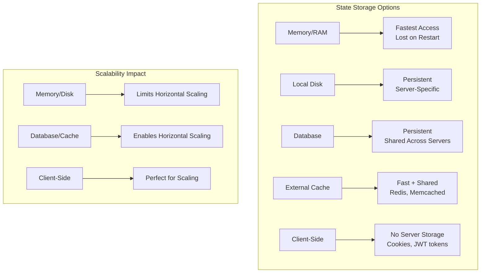

# Stateless vs Stateful Services

## Introduction

The distinction between stateless and stateful services is fundamental to building scalable distributed systems. This architectural decision affects how your services handle user sessions, store data, scale horizontally, and recover from failures. Understanding when to use each approach and how to design them properly is crucial for building systems that can scale efficiently and maintain high availability.

Stateless services don't retain any client-specific information between requests, while stateful services maintain information about client interactions across multiple requests. This seemingly simple difference has profound implications for system architecture, scalability, and operational complexity.

## Understanding State in Services

### What is Service State?

Service state refers to any information that a service retains about client interactions, user sessions, or ongoing processes between requests.

**Types of State:**
```python
class ServiceStateExamples:
    def __init__(self):
        # User session state
        self.user_sessions = {}  # login status, preferences, shopping cart
        
        # Application state  
        self.cache_data = {}     # cached database results, computed values
        
        # Connection state
        self.client_connections = {}  # WebSocket connections, database connections
        
        # Process state
        self.ongoing_tasks = {}  # background jobs, multi-step workflows
        
        # Configuration state
        self.runtime_config = {}  # feature flags, A/B test assignments
```

### State Storage Locations



## Stateless Services

### Characteristics of Stateless Services

Stateless services treat each request independently and don't retain any client-specific information between requests.

**Key Properties:**
- No server-side session storage
- Each request contains all necessary information
- Identical responses for identical requests
- No dependency on previous requests
- Easy to scale horizontally

### Stateless Service Implementation

```python
class StatelessUserService:
    def __init__(self, database, cache):
        self.db = database
        self.cache = cache
        # No instance variables for user state
    
    def get_user_profile(self, auth_token):
        """Get user profile - stateless implementation"""
        
        # 1. Validate token and extract user info (no server-side session)
        user_id = self.validate_jwt_token(auth_token)
        if not user_id:
            raise UnauthorizedError("Invalid token")
        
        # 2. Check cache (shared across all service instances)
        cache_key = f"user_profile:{user_id}"
        cached_profile = self.cache.get(cache_key)
        if cached_profile:
            return cached_profile
        
        # 3. Fetch from database (shared data store)
        profile = self.db.execute(
            "SELECT user_id, username, email, preferences FROM users WHERE user_id = %s",
            [user_id]
        )
        
        if not profile:
            raise NotFoundError("User not found")
        
        # 4. Cache result (shared cache)
        self.cache.set(cache_key, profile[0], ttl=300)
        
        return profile[0]
    
    def update_user_preferences(self, auth_token, new_preferences):
        """Update preferences - stateless implementation"""
        
        # Extract user ID from token (no server-side session lookup)
        user_id = self.validate_jwt_token(auth_token)
        if not user_id:
            raise UnauthorizedError("Invalid token")
        
        # Update in database (shared data store)
        self.db.execute(
            "UPDATE users SET preferences = %s WHERE user_id = %s",
            [json.dumps(new_preferences), user_id]
        )
        
        # Invalidate cache (shared cache)
        self.cache.delete(f"user_profile:{user_id}")
        
        return {"status": "success", "message": "Preferences updated"}
    
    def validate_jwt_token(self, token):
        """Validate JWT token without server-side session storage"""
        try:
            # JWT tokens are self-contained - no server lookup needed
            payload = jwt.decode(token, self.get_jwt_secret(), algorithms=['HS256'])
            
            # Check expiration (encoded in token)
            if payload['exp'] < time.time():
                return None
            
            return payload['user_id']
            
        except jwt.InvalidTokenError:
            return None

# Stateless shopping cart implementation
class StatelessShoppingCart:
    def __init__(self, product_service, pricing_service):
        self.product_service = product_service
        self.pricing_service = pricing_service
    
    def get_cart_total(self, cart_data):
        """Calculate cart total - cart data comes from client"""
        
        if not cart_data or 'items' not in cart_data:
            return {"total": 0, "items": []}
        
        total = 0
        enriched_items = []
        
        for item in cart_data['items']:
            # Fetch current product info (prices may change)
            product = self.product_service.get_product(item['product_id'])
            current_price = self.pricing_service.get_current_price(
                item['product_id'], 
                item.get('quantity', 1)
            )
            
            item_total = current_price * item.get('quantity', 1)
            total += item_total
            
            enriched_items.append({
                'product_id': item['product_id'],
                'product_name': product['name'],
                'quantity': item.get('quantity', 1),
                'unit_price': current_price,
                'item_total': item_total
            })
        
        return {
            'total': total,
            'items': enriched_items,
            'calculated_at': datetime.utcnow().isoformat()
        }
    
    def add_item_to_cart(self, current_cart_data, product_id, quantity=1):
        """Add item to cart - returns new cart data for client to store"""
        
        # Validate product exists
        product = self.product_service.get_product(product_id)
        if not product:
            raise NotFoundError("Product not found")
        
        # Initialize cart if empty
        if not current_cart_data:
            current_cart_data = {'items': []}
        
        # Find existing item or add new one
        existing_item = None
        for item in current_cart_data['items']:
            if item['product_id'] == product_id:
                existing_item = item
                break
        
        if existing_item:
            existing_item['quantity'] += quantity
        else:
            current_cart_data['items'].append({
                'product_id': product_id,
                'quantity': quantity,
                'added_at': datetime.utcnow().isoformat()
            })
        
        # Return updated cart data for client to store
        return current_cart_data
```

### Advantages of Stateless Services

**1. Horizontal Scalability**
```python
# Easy to scale - any server can handle any request
class LoadBalancer:
    def __init__(self, servers):
        self.servers = servers
        self.current_server = 0
    
    def route_request(self, request):
        # Simple round-robin - works because services are stateless
        server = self.servers[self.current_server % len(self.servers)]
        self.current_server += 1
        
        return server.handle_request(request)
    
    def add_server(self, new_server):
        # Can add servers instantly - no state migration needed
        self.servers.append(new_server)
    
    def remove_server(self, server_to_remove):
        # Can remove servers instantly - no state loss
        self.servers.remove(server_to_remove)
```

**2. Fault Tolerance**
```python
class StatelessServiceCluster:
    def __init__(self, service_instances):
        self.instances = service_instances
    
    def handle_request_with_failover(self, request):
        """Handle request with automatic failover"""
        
        for instance in self.instances:
            try:
                # Any instance can handle the request
                return instance.process(request)
            except ServiceUnavailableError:
                # Try next instance - no state lost
                continue
        
        raise AllInstancesUnavailableError()
```

**3. Simple Deployment and Updates**
```python
class StatelessDeployment:
    def rolling_update(self, old_instances, new_instances):
        """Rolling update without downtime"""
        
        # Gradually replace old instances with new ones
        for i, old_instance in enumerate(old_instances):
            # Deploy new instance
            new_instance = new_instances[i]
            self.deploy_instance(new_instance)
            
            # Wait for health check
            self.wait_for_health(new_instance)
            
            # Remove old instance - no state migration needed
            self.remove_instance(old_instance)
            
            # No data loss because services are stateless
```

### Disadvantages of Stateless Services

**1. Increased Request Overhead**
```python
# Every request must include all necessary context
class StatelessRequestOverhead:
    def process_request(self, request):
        # Must validate token on every request
        user = self.validate_token(request.auth_token)  # Database/cache lookup
        
        # Must fetch user preferences on every request
        preferences = self.get_user_preferences(user.id)  # Database lookup
        
        # Must recalculate derived data
        personalized_data = self.calculate_personalization(user, preferences)
        
        return self.generate_response(personalized_data)
```

**2. Limited Optimization Opportunities**
```python
# Cannot maintain expensive computations between requests
class StatelessLimitations:
    def get_recommendations(self, user_id):
        # Must recalculate recommendations every time
        user_profile = self.fetch_user_profile(user_id)  # Database call
        user_history = self.fetch_user_history(user_id)  # Database call
        
        # Expensive ML computation repeated for each request
        recommendations = self.ml_model.predict(user_profile, user_history)
        
        return recommendations
    
    # Compare with stateful version that could cache expensive computations
```

## Stateful Services

### Characteristics of Stateful Services

Stateful services maintain information about client interactions across multiple requests.

**Key Properties:**
- Server-side session storage
- Context maintained between requests
- Optimized for repeated interactions
- More complex to scale horizontally
- Can provide richer user experiences

### Stateful Service Implementation

```python
class StatefulUserService:
    def __init__(self, database, session_store):
        self.db = database
        self.session_store = session_store
        # Maintains active user sessions
        self.active_sessions = {}
        self.user_caches = {}
    
    def login(self, username, password):
        """Login creates server-side session"""
        
        # Authenticate user
        user = self.authenticate_user(username, password)
        if not user:
            raise AuthenticationError("Invalid credentials")
        
        # Create server-side session
        session_id = self.generate_session_id()
        session_data = {
            'user_id': user['user_id'],
            'username': user['username'],
            'login_time': datetime.utcnow(),
            'last_activity': datetime.utcnow(),
            'preferences': user['preferences'],
            'permissions': user['permissions']
        }
        
        # Store session server-side
        self.active_sessions[session_id] = session_data
        self.session_store.set(session_id, session_data, ttl=3600)
        
        # Pre-load user data for performance
        self.preload_user_data(user['user_id'])
        
        return {
            'session_id': session_id,
            'user': {
                'user_id': user['user_id'],
                'username': user['username']
            }
        }
    
    def get_user_dashboard(self, session_id):
        """Get dashboard using cached session data"""
        
        # Get session from server-side storage
        session = self.get_session(session_id)
        if not session:
            raise UnauthorizedError("Invalid session")
        
        user_id = session['user_id']
        
        # Use cached user data if available
        if user_id in self.user_caches:
            cached_data = self.user_caches[user_id]
            
            # Check if cache is still fresh
            if (datetime.utcnow() - cached_data['cached_at']).seconds < 300:
                return self.build_dashboard(session, cached_data['data'])
        
        # Fetch and cache user data
        user_data = self.fetch_comprehensive_user_data(user_id)
        self.user_caches[user_id] = {
            'data': user_data,
            'cached_at': datetime.utcnow()
        }
        
        return self.build_dashboard(session, user_data)
    
    def update_user_activity(self, session_id, activity_data):
        """Update user activity - benefits from session context"""
        
        session = self.get_session(session_id)
        if not session:
            raise UnauthorizedError("Invalid session")
        
        # Update session with new activity
        session['last_activity'] = datetime.utcnow()
        session['recent_actions'] = session.get('recent_actions', [])
        session['recent_actions'].append({
            'action': activity_data['action'],
            'timestamp': datetime.utcnow(),
            'details': activity_data.get('details', {})
        })
        
        # Keep only recent actions (sliding window)
        session['recent_actions'] = session['recent_actions'][-10:]
        
        # Update stored session
        self.active_sessions[session_id] = session
        self.session_store.set(session_id, session, ttl=3600)
        
        # Use session context for personalized response
        return self.generate_personalized_response(session, activity_data)
    
    def get_session(self, session_id):
        """Get session with fallback to persistent storage"""
        
        # Check in-memory cache first
        if session_id in self.active_sessions:
            return self.active_sessions[session_id]
        
        # Fallback to persistent session store
        session = self.session_store.get(session_id)
        if session:
            # Load into memory cache
            self.active_sessions[session_id] = session
        
        return session

# Stateful WebSocket connection handler
class StatefulWebSocketService:
    def __init__(self):
        self.connections = {}  # Active WebSocket connections
        self.user_subscriptions = {}  # User notification subscriptions
        self.connection_state = {}  # Per-connection state
    
    def handle_new_connection(self, websocket, user_id):
        """Handle new WebSocket connection"""
        
        connection_id = self.generate_connection_id()
        
        # Store connection state
        self.connections[connection_id] = {
            'websocket': websocket,
            'user_id': user_id,
            'connected_at': datetime.utcnow(),
            'last_ping': datetime.utcnow()
        }
        
        # Initialize user subscriptions
        self.user_subscriptions[user_id] = self.user_subscriptions.get(user_id, set())
        self.user_subscriptions[user_id].add(connection_id)
        
        # Initialize connection-specific state
        self.connection_state[connection_id] = {
            'subscribed_channels': set(),
            'message_queue': [],
            'preferences': self.load_user_preferences(user_id)
        }
        
        return connection_id
    
    def handle_message(self, connection_id, message):
        """Handle incoming WebSocket message using connection state"""
        
        if connection_id not in self.connections:
            raise ConnectionNotFoundError()
        
        connection = self.connections[connection_id]
        state = self.connection_state[connection_id]
        
        # Process message based on connection state and history
        if message['type'] == 'subscribe':
            channel = message['channel']
            state['subscribed_channels'].add(channel)
            
            # Send recent messages from channel based on user preferences
            recent_messages = self.get_recent_channel_messages(
                channel, 
                limit=state['preferences'].get('message_history_limit', 50)
            )
            
            for msg in recent_messages:
                self.send_message(connection_id, msg)
        
        elif message['type'] == 'chat':
            # Use connection state for context
            response = self.process_chat_message(
                message['content'],
                user_context=state,
                connection_history=state.get('message_history', [])
            )
            
            # Update connection state
            state['message_history'] = state.get('message_history', [])
            state['message_history'].append({
                'message': message['content'],
                'response': response,
                'timestamp': datetime.utcnow()
            })
            
            self.send_message(connection_id, response)
    
    def broadcast_to_user(self, user_id, message):
        """Broadcast message to all user's connections"""
        
        if user_id not in self.user_subscriptions:
            return
        
        for connection_id in self.user_subscriptions[user_id]:
            if connection_id in self.connections:
                self.send_message(connection_id, message)
```

### Advantages of Stateful Services

**1. Performance Optimization**
```python
class StatefulPerformanceOptimizations:
    def __init__(self):
        self.user_data_cache = {}
        self.computed_results_cache = {}
        self.connection_pools = {}
    
    def get_user_recommendations(self, session_id):
        """Optimized recommendations using cached computations"""
        
        session = self.get_session(session_id)
        user_id = session['user_id']
        
        # Check if we have cached recommendations
        cache_key = f"recommendations:{user_id}"
        if cache_key in self.computed_results_cache:
            cached = self.computed_results_cache[cache_key]
            
            # Use cached results if recent enough
            if (datetime.utcnow() - cached['computed_at']).seconds < 1800:
                return cached['recommendations']
        
        # Compute new recommendations using cached user data
        user_profile = self.user_data_cache.get(user_id)
        if not user_profile:
            user_profile = self.load_user_profile(user_id)
            self.user_data_cache[user_id] = user_profile
        
        # Expensive ML computation - cache the result
        recommendations = self.ml_model.predict(user_profile)
        
        self.computed_results_cache[cache_key] = {
            'recommendations': recommendations,
            'computed_at': datetime.utcnow()
        }
        
        return recommendations
```

**2. Rich User Experience**
```python
class StatefulUserExperience:
    def __init__(self):
        self.user_contexts = {}
        self.conversation_histories = {}
    
    def handle_user_query(self, session_id, query):
        """Handle query with full conversation context"""
        
        session = self.get_session(session_id)
        user_id = session['user_id']
        
        # Get conversation history
        history = self.conversation_histories.get(user_id, [])
        
        # Get user context (preferences, past behavior, etc.)
        context = self.user_contexts.get(user_id, {})
        
        # Process query with full context
        response = self.ai_assistant.process_query(
            query=query,
            conversation_history=history,
            user_context=context,
            session_data=session
        )
        
        # Update conversation history
        history.append({
            'query': query,
            'response': response,
            'timestamp': datetime.utcnow()
        })
        self.conversation_histories[user_id] = history[-20:]  # Keep last 20 exchanges
        
        return response
```

**3. Connection Efficiency**
```python
class StatefulConnectionManagement:
    def __init__(self):
        self.database_connections = {}
        self.prepared_statements = {}
    
    def get_user_data(self, session_id, data_type):
        """Efficient database access using connection pooling"""
        
        session = self.get_session(session_id)
        user_id = session['user_id']
        
        # Reuse database connection for this session
        if session_id not in self.database_connections:
            self.database_connections[session_id] = self.create_db_connection()
        
        db_conn = self.database_connections[session_id]
        
        # Use prepared statements for efficiency
        stmt_key = f"get_user_{data_type}"
        if stmt_key not in self.prepared_statements:
            self.prepared_statements[stmt_key] = db_conn.prepare(
                f"SELECT * FROM user_{data_type} WHERE user_id = ?"
            )
        
        stmt = self.prepared_statements[stmt_key]
        return stmt.execute([user_id])
```

### Disadvantages of Stateful Services

**1. Scaling Complexity**
```python
class StatefulScalingChallenges:
    def __init__(self):
        self.server_sessions = {}  # Sessions tied to specific servers
        self.load_balancer = StickySessionLoadBalancer()
    
    def handle_request(self, request):
        """Stateful services require sticky sessions"""
        
        session_id = request.get_session_id()
        
        # Must route to the same server that has the session
        target_server = self.load_balancer.get_server_for_session(session_id)
        
        if not target_server or not target_server.is_healthy():
            # Session lost if server goes down
            raise SessionLostError("Server with session is unavailable")
        
        return target_server.handle_request(request)
    
    def add_server(self, new_server):
        """Adding servers doesn't help existing sessions"""
        
        # New server can only handle new sessions
        # Existing sessions still tied to original servers
        self.load_balancer.add_server(new_server)
        
        # Cannot redistribute existing sessions easily
        # Limited scaling benefit for current users
```

**2. Fault Tolerance Issues**
```python
class StatefulFaultTolerance:
    def handle_server_failure(self, failed_server):
        """Server failure loses all sessions on that server"""
        
        # All sessions on failed server are lost
        lost_sessions = self.get_sessions_on_server(failed_server)
        
        for session_id in lost_sessions:
            # Users must re-login and lose their session state
            self.invalidate_session(session_id)
            self.notify_user_session_lost(session_id)
        
        # Remove failed server from load balancer
        self.load_balancer.remove_server(failed_server)
        
        return {
            'status': 'server_removed',
            'lost_sessions': len(lost_sessions),
            'affected_users': len(lost_sessions)
        }
```

## Hybrid Approaches

### Session Store Externalization

Move session state to external storage while keeping services stateless.

```python
class HybridSessionService:
    def __init__(self, redis_cluster, database):
        self.session_store = redis_cluster  # External session storage
        self.db = database
        # Service itself remains stateless
    
    def authenticate_request(self, session_token):
        """Stateless authentication with external session storage"""
        
        # Get session from external store (shared across all service instances)
        session_data = self.session_store.get(f"session:{session_token}")
        
        if not session_data:
            raise UnauthorizedError("Invalid or expired session")
        
        # Update last activity
        session_data['last_activity'] = datetime.utcnow().isoformat()
        self.session_store.set(
            f"session:{session_token}", 
            session_data, 
            ttl=3600
        )
        
        return session_data
    
    def create_session(self, user_id, user_data):
        """Create session in external storage"""
        
        session_token = self.generate_secure_token()
        session_data = {
            'user_id': user_id,
            'user_data': user_data,
            'created_at': datetime.utcnow().isoformat(),
            'last_activity': datetime.utcnow().isoformat()
        }
        
        # Store in external Redis cluster
        self.session_store.set(
            f"session:{session_token}",
            session_data,
            ttl=3600
        )
        
        return session_token

# Benefits: Stateless services + session persistence
class HybridBenefits:
    """
    Combines benefits of both approaches:
    - Services remain stateless (easy to scale)
    - Session data persists (survives server failures)
    - Any server can handle any request
    - Session data shared across all instances
    """
    pass
```

### Client-Side State Management

Push state management to the client while keeping sensitive data server-side.

```python
class ClientSideStateService:
    def __init__(self, jwt_secret, database):
        self.jwt_secret = jwt_secret
        self.db = database
    
    def create_client_token(self, user_id, permissions, preferences):
        """Create JWT token with client-side state"""
        
        # Include non-sensitive state in JWT token
        payload = {
            'user_id': user_id,
            'permissions': permissions,
            'preferences': preferences,
            'issued_at': time.time(),
            'expires_at': time.time() + 3600
        }
        
        # Sign token - client will send this with each request
        token = jwt.encode(payload, self.jwt_secret, algorithm='HS256')
        
        return token
    
    def process_request_with_client_state(self, jwt_token, request_data):
        """Process request using state from client token"""
        
        try:
            # Decode client state from JWT
            client_state = jwt.decode(jwt_token, self.jwt_secret, algorithms=['HS256'])
            
            # Validate token expiration
            if client_state['expires_at'] < time.time():
                raise UnauthorizedError("Token expired")
            
            # Use client state for request processing
            user_id = client_state['user_id']
            permissions = client_state['permissions']
            preferences = client_state['preferences']
            
            # Process request with client-provided state
            return self.handle_request(user_id, permissions, preferences, request_data)
            
        except jwt.InvalidTokenError:
            raise UnauthorizedError("Invalid token")
    
    def update_client_state(self, current_token, state_updates):
        """Update client state by issuing new token"""
        
        # Decode current state
        current_state = jwt.decode(current_token, self.jwt_secret, algorithms=['HS256'])
        
        # Apply updates
        updated_state = {**current_state, **state_updates}
        updated_state['issued_at'] = time.time()
        updated_state['expires_at'] = time.time() + 3600
        
        # Issue new token with updated state
        new_token = jwt.encode(updated_state, self.jwt_secret, algorithm='HS256')
        
        return new_token

# Client-side shopping cart with server validation
class ClientSideShoppingCart:
    def __init__(self, product_service, pricing_service):
        self.product_service = product_service
        self.pricing_service = pricing_service
    
    def validate_and_price_cart(self, client_cart_data):
        """Validate client cart and return current pricing"""
        
        if not client_cart_data or 'items' not in client_cart_data:
            return {'valid': True, 'total': 0, 'items': []}
        
        validated_items = []
        total = 0
        validation_errors = []
        
        for item in client_cart_data['items']:
            try:
                # Validate product still exists and is available
                product = self.product_service.get_product(item['product_id'])
                if not product['available']:
                    validation_errors.append(f"Product {product['name']} is no longer available")
                    continue
                
                # Get current price (may have changed since client last updated)
                current_price = self.pricing_service.get_current_price(item['product_id'])
                
                # Check if price changed significantly
                client_price = item.get('unit_price', 0)
                if abs(current_price - client_price) > 0.01:
                    validation_errors.append(
                        f"Price for {product['name']} changed from ${client_price} to ${current_price}"
                    )
                
                item_total = current_price * item['quantity']
                total += item_total
                
                validated_items.append({
                    'product_id': item['product_id'],
                    'product_name': product['name'],
                    'quantity': item['quantity'],
                    'unit_price': current_price,
                    'item_total': item_total
                })
                
            except ProductNotFoundError:
                validation_errors.append(f"Product {item['product_id']} not found")
        
        return {
            'valid': len(validation_errors) == 0,
            'validation_errors': validation_errors,
            'total': total,
            'items': validated_items
        }
```

## Design Decision Framework

### When to Choose Stateless Services

```python
class StatelessDecisionCriteria:
    """
    Choose stateless services when:
    """
    
    criteria = {
        'high_scalability_requirements': {
            'description': 'Need to scale to many servers quickly',
            'examples': ['Web APIs', 'Microservices', 'Public APIs']
        },
        
        'simple_request_response': {
            'description': 'Each request is independent',
            'examples': ['REST APIs', 'Search services', 'Data processing']
        },
        
        'fault_tolerance_priority': {
            'description': 'High availability is critical',
            'examples': ['Payment processing', 'Critical business APIs']
        },
        
        'cloud_native_deployment': {
            'description': 'Deploying in containers/serverless',
            'examples': ['Kubernetes deployments', 'AWS Lambda', 'Docker containers']
        },
        
        'simple_operations': {
            'description': 'Want simple deployment and operations',
            'examples': ['Small teams', 'Rapid development', 'CI/CD pipelines']
        }
    }

# Stateless service checklist
def should_use_stateless_service(requirements):
    """
    Decision helper for stateless services
    """
    score = 0
    
    if requirements.get('expected_concurrent_users', 0) > 10000:
        score += 3  # High scalability need
    
    if requirements.get('availability_requirement', 0) > 99.9:
        score += 2  # High availability need
    
    if requirements.get('deployment_frequency', 0) > 10:  # per month
        score += 2  # Frequent deployments
    
    if requirements.get('request_complexity', 'simple') == 'simple':
        score += 2  # Simple request/response
    
    if requirements.get('team_size', 0) < 5:
        score += 1  # Small team
    
    return {
        'recommendation': 'stateless' if score >= 5 else 'consider_stateful',
        'score': score,
        'reasoning': 'High scalability and availability requirements favor stateless design'
    }
```

### When to Choose Stateful Services

```python
class StatefulDecisionCriteria:
    """
    Choose stateful services when:
    """
    
    criteria = {
        'complex_user_interactions': {
            'description': 'Multi-step workflows or conversations',
            'examples': ['Chat applications', 'Wizards', 'Gaming sessions']
        },
        
        'performance_optimization_critical': {
            'description': 'Need to cache expensive computations',
            'examples': ['ML inference', 'Complex calculations', 'Real-time analytics']
        },
        
        'real_time_connections': {
            'description': 'Persistent connections required',
            'examples': ['WebSocket services', 'Gaming servers', 'Live streaming']
        },
        
        'rich_context_needed': {
            'description': 'Decisions depend on interaction history',
            'examples': ['Recommendation engines', 'AI assistants', 'Personalization']
        },
        
        'connection_efficiency': {
            'description': 'Database connection overhead is significant',
            'examples': ['High-frequency trading', 'Real-time data processing']
        }
    }

def should_use_stateful_service(requirements):
    """
    Decision helper for stateful services
    """
    score = 0
    
    if requirements.get('has_websockets', False):
        score += 3  # WebSocket connections are inherently stateful
    
    if requirements.get('conversation_based', False):
        score += 3  # Conversations need context
    
    if requirements.get('expensive_computations', False):
        score += 2  # Benefit from caching
    
    if requirements.get('personalization_level', 'none') == 'high':
        score += 2  # Rich personalization needs context
    
    if requirements.get('real_time_requirements', False):
        score += 2  # Real-time often needs state
    
    if requirements.get('expected_concurrent_users', 0) < 1000:
        score += 1  # Lower scale makes stateful manageable
    
    return {
        'recommendation': 'stateful' if score >= 6 else 'consider_stateless',
        'score': score,
        'reasoning': 'Complex interactions and performance requirements favor stateful design'
    }
```

## Best Practices

### For Stateless Services

```python
class StatelessBestPractices:
    """
    Best practices for stateless service design
    """
    
    def design_stateless_api(self):
        """
        Guidelines for stateless API design
        """
        return {
            'include_all_context': 'Each request must contain all necessary information',
            'use_jwt_tokens': 'Self-contained tokens avoid server-side session lookups',
            'idempotent_operations': 'Same request should produce same result',
            'stateless_authentication': 'Use token-based auth, not server sessions',
            'external_state_storage': 'Use databases/caches for persistent data',
            'avoid_instance_variables': 'Don\'t store request-specific data in service instances'
        }
    
    def implement_caching_strategy(self):
        """
        Caching strategies for stateless services
        """
        return {
            'shared_cache': 'Use Redis/Memcached shared across all instances',
            'cache_keys': 'Include user context in cache keys for personalization',
            'cache_invalidation': 'Implement proper cache invalidation strategies',
            'cache_warming': 'Pre-populate caches for common requests',
            'cache_partitioning': 'Partition cache by user/tenant for isolation'
        }

# Example: Stateless service with proper caching
class StatelessServiceWithCaching:
    def __init__(self, database, shared_cache):
        self.db = database
        self.cache = shared_cache
    
    def get_user_data(self, auth_token):
        """Stateless method with proper caching"""
        
        # Extract user ID from self-contained token
        user_id = self.validate_jwt_token(auth_token)
        
        # Check shared cache first
        cache_key = f"user_data:{user_id}"
        cached_data = self.cache.get(cache_key)
        
        if cached_data:
            return cached_data
        
        # Fetch from database
        user_data = self.db.get_user(user_id)
        
        # Cache for future requests (shared across all instances)
        self.cache.set(cache_key, user_data, ttl=300)
        
        return user_data
```

### For Stateful Services

```python
class StatefulBestPractices:
    """
    Best practices for stateful service design
    """
    
    def design_stateful_service(self):
        """
        Guidelines for stateful service design
        """
        return {
            'external_session_storage': 'Use Redis/database for session persistence',
            'session_replication': 'Replicate sessions across multiple servers',
            'graceful_degradation': 'Handle session loss gracefully',
            'session_timeout': 'Implement proper session expiration',
            'sticky_sessions': 'Use load balancer session affinity',
            'state_cleanup': 'Clean up abandoned sessions regularly'
        }
    
    def implement_session_management(self):
        """
        Session management best practices
        """
        return {
            'session_store_choice': 'Redis Cluster for high availability',
            'session_serialization': 'Use efficient serialization (JSON, MessagePack)',
            'session_security': 'Encrypt sensitive session data',
            'session_monitoring': 'Monitor session store performance and capacity',
            'session_backup': 'Backup session data for disaster recovery'
        }

# Example: Stateful service with external session storage
class StatefulServiceWithExternalSessions:
    def __init__(self, redis_cluster, database):
        self.session_store = redis_cluster  # External session storage
        self.db = database
    
    def create_session(self, user_id, user_data):
        """Create session with external storage"""
        
        session_id = self.generate_session_id()
        session_data = {
            'user_id': user_id,
            'user_data': user_data,
            'created_at': datetime.utcnow().isoformat(),
            'cached_computations': {},
            'preferences': user_data.get('preferences', {})
        }
        
        # Store in Redis cluster (replicated across nodes)
        self.session_store.set(
            f"session:{session_id}",
            json.dumps(session_data),
            ttl=3600
        )
        
        return session_id
    
    def get_session_with_fallback(self, session_id):
        """Get session with fallback and error handling"""
        
        try:
            # Try to get from Redis
            session_data = self.session_store.get(f"session:{session_id}")
            
            if session_data:
                return json.loads(session_data)
            
        except RedisConnectionError:
            # Fallback: try to reconstruct minimal session from database
            logger.warning(f"Redis unavailable, falling back to database for session {session_id}")
            
            # This is a degraded mode - limited functionality
            return self.create_minimal_session_from_db(session_id)
        
        return None
```

## Summary

The choice between stateless and stateful services is one of the most important architectural decisions in system design. Each approach has distinct advantages and trade-offs that must be carefully considered based on your specific requirements.

**Key Takeaways:**

**Stateless Services:**
- **Best for**: High scalability, fault tolerance, simple operations
- **Advantages**: Easy horizontal scaling, fault tolerance, simple deployment
- **Disadvantages**: Request overhead, limited optimization opportunities
- **Use cases**: REST APIs, microservices, public APIs, cloud-native applications

**Stateful Services:**
- **Best for**: Complex interactions, performance optimization, real-time connections
- **Advantages**: Performance optimization, rich user experience, connection efficiency
- **Disadvantages**: Scaling complexity, fault tolerance challenges
- **Use cases**: WebSocket services, gaming servers, AI assistants, real-time applications

**Hybrid Approaches:**
- **External session storage**: Combines stateless scalability with session persistence
- **Client-side state**: Pushes state to client while keeping services stateless
- **Best of both worlds**: Choose the right approach for each component

**Decision Framework:**
- Consider scalability requirements, interaction complexity, and operational constraints
- Start with stateless for simplicity, move to stateful when specific benefits are needed
- Use hybrid approaches to get benefits of both patterns
- Design for your specific use case rather than following dogma

The key is understanding that this isn't an either/or decision for your entire system. Different components can use different approaches based on their specific requirements. A well-designed system often combines both stateless and stateful services, using each where it provides the most benefit.
