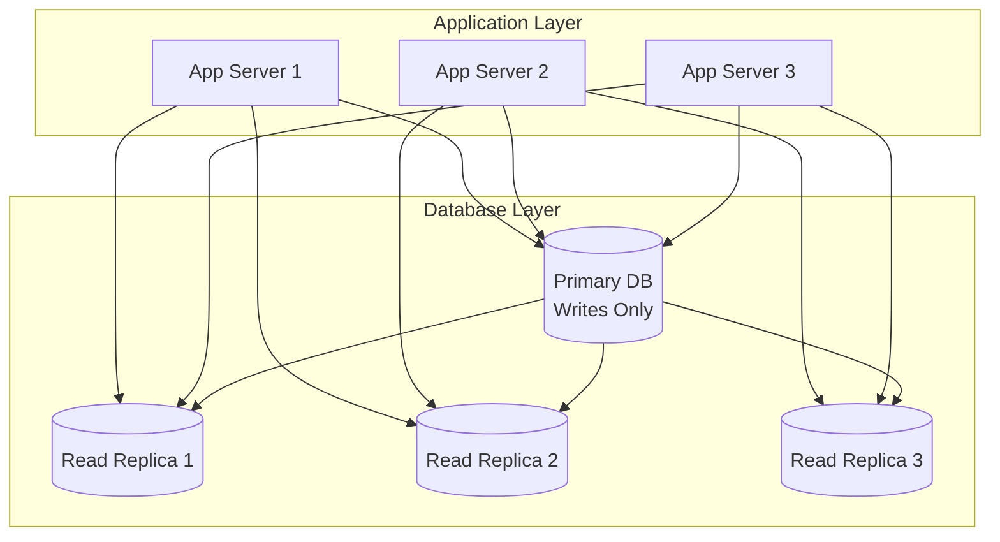

# Scaling Patterns & Anti-patterns

## Introduction

Scaling patterns are proven architectural solutions that help systems handle increased load, while anti-patterns are common mistakes that limit scalability and create operational problems. Understanding both is crucial for building systems that can grow efficiently and avoid common pitfalls that plague many scaling efforts.

This section covers the most important scaling patterns you should implement and the anti-patterns you must avoid. Each pattern includes implementation examples, trade-offs, and guidance on when to apply them.

## Scaling Patterns ✅

### 1. Database Read Replicas Pattern

Distribute read traffic across multiple database replicas while keeping writes on a primary database.



**Implementation:**
```python
class DatabaseReadReplicaPattern:
    def __init__(self, primary_db, read_replicas):
        self.primary = primary_db
        self.replicas = read_replicas
        self.replica_index = 0
    
    def write(self, query, params):
        """All writes go to primary database"""
        return self.primary.execute(query, params)
    
    def read(self, query, params, consistency_level='eventual'):
        """Distribute reads across replicas"""
        
        if consistency_level == 'strong':
            # Strong consistency requires reading from primary
            return self.primary.execute(query, params)
        
        # Eventual consistency - use read replica
        replica = self.get_next_replica()
        
        try:
            return replica.execute(query, params)
        except DatabaseConnectionError:
            # Fallback to primary if replica is unavailable
            logger.warning("Read replica unavailable, falling back to primary")
            return self.primary.execute(query, params)
    
    def get_next_replica(self):
        """Round-robin load balancing across replicas"""
        replica = self.replicas[self.replica_index % len(self.replicas)]
        self.replica_index += 1
        return replica
    
    def read_with_fallback(self, query, params, max_lag_seconds=30):
        """Read with replication lag awareness"""
        
        for replica in self.replicas:
            try:
                # Check replication lag
                lag = replica.get_replication_lag()
                
                if lag <= max_lag_seconds:
                    return replica.execute(query, params)
                    
            except Exception as e:
                logger.warning(f"Replica check failed: {e}")
                continue
        
        # All replicas too lagged or unavailable - use primary
        return self.primary.execute(query, params)

# Usage example
class UserService:
    def __init__(self, db_pattern):
        self.db = db_pattern
    
    def get_user_profile(self, user_id):
        """Read operation - can use replica"""
        return self.db.read(
            "SELECT * FROM users WHERE user_id = %s",
            [user_id],
            consistency_level='eventual'
        )
    
    def update_user_profile(self, user_id, profile_data):
        """Write operation - must use primary"""
        return self.db.write(
            "UPDATE users SET profile_data = %s WHERE user_id = %s",
            [json.dumps(profile_data), user_id]
        )
    
    def get_user_balance(self, user_id):
        """Financial data - requires strong consistency"""
        return self.db.read(
            "SELECT balance FROM user_accounts WHERE user_id = %s",
            [user_id],
            consistency_level='strong'  # Forces read from primary
        )
```

**Benefits:**
- Scales read capacity linearly with replicas
- Reduces load on primary database
- Provides read availability if primary fails
- Cost-effective scaling for read-heavy workloads

**Trade-offs:**
- Eventual consistency for replica reads
- Replication lag can cause stale data
- Increased operational complexity
- Additional infrastructure costs

### 2. Caching Layer Pattern

Implement multiple levels of caching to reduce database load and improve response times.

```python
class MultiLevelCachingPattern:
    def __init__(self, l1_cache, l2_cache, database):
        self.l1_cache = l1_cache  # In-memory cache (fastest)
        self.l2_cache = l2_cache  # Distributed cache (Redis)
        self.database = database  # Persistent storage (slowest)
    
    def get(self, key):
        """Multi-level cache lookup with fallback"""
        
        # L1 Cache (in-memory) - fastest
        value = self.l1_cache.get(key)
        if value is not None:
            self.record_cache_hit('l1', key)
            return value
        
        # L2 Cache (Redis) - fast
        value = self.l2_cache.get(key)
        if value is not None:
            # Populate L1 cache for future requests
            self.l1_cache.set(key, value, ttl=300)
            self.record_cache_hit('l2', key)
            return value
        
        # Database - slowest but authoritative
        value = self.database.get(key)
        if value is not None:
            # Populate both cache levels
            self.l2_cache.set(key, value, ttl=3600)
            self.l1_cache.set(key, value, ttl=300)
            self.record_cache_miss(key)
            return value
        
        return None
    
    def set(self, key, value, ttl=3600):
        """Write-through caching strategy"""
        
        # Write to database first (consistency)
        self.database.set(key, value)
        
        # Update both cache levels
        self.l2_cache.set(key, value, ttl=ttl)
        self.l1_cache.set(key, value, ttl=min(ttl, 300))
    
    def invalidate(self, key):
        """Invalidate key from all cache levels"""
        
        self.l1_cache.delete(key)
        self.l2_cache.delete(key)
        
        # Optionally delete from database for cache-only data
        # self.database.delete(key)
    
    def get_cache_statistics(self):
        """Get cache performance metrics"""
        
        return {
            'l1_hit_rate': self.l1_cache.get_hit_rate(),
            'l2_hit_rate': self.l2_cache.get_hit_rate(),
            'overall_hit_rate': self.calculate_overall_hit_rate(),
            'avg_response_time': self.get_avg_response_time()
        }

# Cache-aside pattern implementation
class CacheAsidePattern:
    def __init__(self, cache, database):
        self.cache = cache
        self.database = database
    
    def get_user_profile(self, user_id):
        """Cache-aside pattern for user profiles"""
        
        cache_key = f"user_profile:{user_id}"
        
        # Try cache first
        cached_profile = self.cache.get(cache_key)
        if cached_profile:
            return json.loads(cached_profile)
        
        # Cache miss - fetch from database
        profile = self.database.execute(
            "SELECT * FROM user_profiles WHERE user_id = %s",
            [user_id]
        )
        
        if profile:
            # Store in cache for future requests
            self.cache.set(
                cache_key,
                json.dumps(profile[0]),
                ttl=1800  # 30 minutes
            )
            return profile[0]
        
        return None
    
    def update_user_profile(self, user_id, profile_data):
        """Update with cache invalidation"""
        
        # Update database
        self.database.execute(
            "UPDATE user_profiles SET data = %s WHERE user_id = %s",
            [json.dumps(profile_data), user_id]
        )
        
        # Invalidate cache to ensure consistency
        cache_key = f"user_profile:{user_id}"
        self.cache.delete(cache_key)

# Write-behind caching pattern
class WriteBehindCachingPattern:
    def __init__(self, cache, database, write_queue):
        self.cache = cache
        self.database = database
        self.write_queue = write_queue
        self.pending_writes = {}
    
    def set(self, key, value):
        """Write-behind: update cache immediately, database asynchronously"""
        
        # Update cache immediately (fast response)
        self.cache.set(key, value)
        
        # Queue database write for later
        self.write_queue.enqueue({
            'operation': 'set',
            'key': key,
            'value': value,
            'timestamp': time.time()
        })
        
        # Track pending writes
        self.pending_writes[key] = value
    
    def flush_pending_writes(self):
        """Flush pending writes to database"""
        
        batch_size = 100
        writes_processed = 0
        
        while not self.write_queue.empty() and writes_processed < batch_size:
            write_operation = self.write_queue.dequeue()
            
            try:
                self.database.set(
                    write_operation['key'],
                    write_operation['value']
                )
                
                # Remove from pending writes
                if write_operation['key'] in self.pending_writes:
                    del self.pending_writes[write_operation['key']]
                
                writes_processed += 1
                
            except DatabaseError as e:
                # Re-queue failed write
                self.write_queue.enqueue(write_operation)
                logger.error(f"Database write failed: {e}")
                break
        
        return writes_processed
```

### 3. Circuit Breaker Pattern

Prevent cascading failures by failing fast when downstream services are unavailable.

```python
import time
from enum import Enum

class CircuitBreakerState(Enum):
    CLOSED = "closed"      # Normal operation
    OPEN = "open"          # Failing fast
    HALF_OPEN = "half_open"  # Testing recovery

class CircuitBreakerPattern:
    def __init__(self, failure_threshold=5, recovery_timeout=60, success_threshold=3):
        self.failure_threshold = failure_threshold
        self.recovery_timeout = recovery_timeout
        self.success_threshold = success_threshold
        
        self.failure_count = 0
        self.success_count = 0
        self.last_failure_time = None
        self.state = CircuitBreakerState.CLOSED
    
    def call(self, func, *args, **kwargs):
        """Execute function with circuit breaker protection"""
        
        if self.state == CircuitBreakerState.OPEN:
            if self._should_attempt_reset():
                self.state = CircuitBreakerState.HALF_OPEN
                self.success_count = 0
            else:
                raise CircuitBreakerOpenError("Circuit breaker is OPEN")
        
        try:
            result = func(*args, **kwargs)
            self._on_success()
            return result
            
        except Exception as e:
            self._on_failure()
            raise e
    
    def _should_attempt_reset(self):
        """Check if enough time has passed to attempt recovery"""
        return (time.time() - self.last_failure_time) >= self.recovery_timeout
    
    def _on_success(self):
        """Handle successful call"""
        
        if self.state == CircuitBreakerState.HALF_OPEN:
            self.success_count += 1
            
            if self.success_count >= self.success_threshold:
                # Recovery successful
                self.state = CircuitBreakerState.CLOSED
                self.failure_count = 0
                self.success_count = 0
        
        elif self.state == CircuitBreakerState.CLOSED:
            # Reset failure count on success
            self.failure_count = 0
    
    def _on_failure(self):
        """Handle failed call"""
        
        self.failure_count += 1
        self.last_failure_time = time.time()
        
        if self.failure_count >= self.failure_threshold:
            self.state = CircuitBreakerState.OPEN
        
        # If in HALF_OPEN state, go back to OPEN on any failure
        if self.state == CircuitBreakerState.HALF_OPEN:
            self.state = CircuitBreakerState.OPEN

# Usage with external service calls
class ExternalServiceClient:
    def __init__(self, service_url):
        self.service_url = service_url
        self.circuit_breaker = CircuitBreakerPattern(
            failure_threshold=3,
            recovery_timeout=30,
            success_threshold=2
        )
    
    def get_user_recommendations(self, user_id):
        """Get recommendations with circuit breaker protection"""
        
        try:
            return self.circuit_breaker.call(
                self._fetch_recommendations,
                user_id
            )
        except CircuitBreakerOpenError:
            # Fallback to cached or default recommendations
            return self._get_fallback_recommendations(user_id)
    
    def _fetch_recommendations(self, user_id):
        """Actual service call that might fail"""
        response = requests.get(
            f"{self.service_url}/recommendations/{user_id}",
            timeout=5
        )
        
        if response.status_code != 200:
            raise ServiceUnavailableError(f"Service returned {response.status_code}")
        
        return response.json()
    
    def _get_fallback_recommendations(self, user_id):
        """Fallback when circuit breaker is open"""
        
        # Return cached recommendations or popular items
        return {
            'recommendations': self._get_popular_items(),
            'source': 'fallback',
            'message': 'Recommendation service temporarily unavailable'
        }
```

### 4. Bulkhead Pattern

Isolate critical resources to prevent failure in one area from affecting others.

```python
class BulkheadPattern:
    def __init__(self):
        # Separate connection pools for different operations
        self.critical_pool = ConnectionPool(
            max_connections=20,
            name="critical_operations"
        )
        
        self.batch_pool = ConnectionPool(
            max_connections=10,
            name="batch_operations"
        )
        
        self.reporting_pool = ConnectionPool(
            max_connections=5,
            name="reporting_operations"
        )
    
    def execute_critical_operation(self, operation):
        """Critical operations get dedicated resources"""
        
        with self.critical_pool.get_connection() as conn:
            return operation(conn)
    
    def execute_batch_operation(self, operation):
        """Batch operations use separate pool"""
        
        with self.batch_pool.get_connection() as conn:
            return operation(conn)
    
    def execute_reporting_operation(self, operation):
        """Reporting uses lowest priority pool"""
        
        with self.reporting_pool.get_connection() as conn:
            return operation(conn)

# Thread pool bulkheads
class ThreadPoolBulkheads:
    def __init__(self):
        # Separate thread pools for different types of work
        self.user_request_executor = ThreadPoolExecutor(
            max_workers=50,
            thread_name_prefix="user-request"
        )
        
        self.background_task_executor = ThreadPoolExecutor(
            max_workers=10,
            thread_name_prefix="background-task"
        )
        
        self.analytics_executor = ThreadPoolExecutor(
            max_workers=5,
            thread_name_prefix="analytics"
        )
    
    def handle_user_request(self, request_handler, request):
        """User requests get priority thread pool"""
        
        future = self.user_request_executor.submit(request_handler, request)
        return future.result(timeout=30)  # Fail fast for user requests
    
    def process_background_task(self, task_handler, task):
        """Background tasks use separate pool"""
        
        future = self.background_task_executor.submit(task_handler, task)
        return future  # Don't block on background tasks
    
    def run_analytics(self, analytics_handler, data):
        """Analytics use lowest priority pool"""
        
        future = self.analytics_executor.submit(analytics_handler, data)
        return future  # Analytics can take longer
```

### 5. Auto-Scaling Pattern

Automatically adjust capacity based on demand metrics.

```python
class AutoScalingPattern:
    def __init__(self, min_instances=2, max_instances=20):
        self.min_instances = min_instances
        self.max_instances = max_instances
        self.current_instances = min_instances
        self.scaling_cooldown = 300  # 5 minutes
        self.last_scaling_action = 0
        
    def evaluate_scaling(self, metrics):
        """Evaluate whether scaling action is needed"""
        
        current_time = time.time()
        
        # Respect cooldown period
        if (current_time - self.last_scaling_action) < self.scaling_cooldown:
            return "cooldown_active"
        
        # Calculate scaling decision based on multiple metrics
        cpu_pressure = metrics.get('avg_cpu_usage', 0)
        memory_pressure = metrics.get('avg_memory_usage', 0)
        response_time = metrics.get('avg_response_time', 0)
        error_rate = metrics.get('error_rate', 0)
        queue_depth = metrics.get('queue_depth', 0)
        
        # Scale up conditions
        scale_up_score = 0
        
        if cpu_pressure > 70:
            scale_up_score += 2
        elif cpu_pressure > 60:
            scale_up_score += 1
            
        if memory_pressure > 80:
            scale_up_score += 2
        elif memory_pressure > 70:
            scale_up_score += 1
            
        if response_time > 1000:  # ms
            scale_up_score += 2
        elif response_time > 500:
            scale_up_score += 1
            
        if error_rate > 0.05:  # 5%
            scale_up_score += 3
        elif error_rate > 0.01:  # 1%
            scale_up_score += 1
            
        if queue_depth > 100:
            scale_up_score += 2
        elif queue_depth > 50:
            scale_up_score += 1
        
        # Scale down conditions
        scale_down_score = 0
        
        if cpu_pressure < 20 and memory_pressure < 30 and response_time < 200:
            scale_down_score = 2
        elif cpu_pressure < 30 and memory_pressure < 40 and response_time < 300:
            scale_down_score = 1
        
        # Make scaling decision
        if scale_up_score >= 3:
            return self._scale_up()
        elif scale_down_score >= 2 and error_rate < 0.001:
            return self._scale_down()
        
        return "no_action"
    
    def _scale_up(self):
        """Scale up instances"""
        
        if self.current_instances >= self.max_instances:
            return "max_capacity_reached"
        
        # Calculate new instance count (aggressive scaling up)
        new_instances = min(
            self.current_instances * 2,  # Double capacity
            self.max_instances
        )
        
        instances_to_add = new_instances - self.current_instances
        
        # Add instances
        for i in range(instances_to_add):
            self._add_instance()
        
        self.current_instances = new_instances
        self.last_scaling_action = time.time()
        
        return f"scaled_up_to_{new_instances}"
    
    def _scale_down(self):
        """Scale down instances"""
        
        if self.current_instances <= self.min_instances:
            return "min_capacity_reached"
        
        # Calculate new instance count (conservative scaling down)
        new_instances = max(
            self.current_instances - 1,  # Remove one instance at a time
            self.min_instances
        )
        
        instances_to_remove = self.current_instances - new_instances
        
        # Remove instances gracefully
        for i in range(instances_to_remove):
            self._remove_instance_gracefully()
        
        self.current_instances = new_instances
        self.last_scaling_action = time.time()
        
        return f"scaled_down_to_{new_instances}"
    
    def _add_instance(self):
        """Add a new instance"""
        # Implementation depends on infrastructure (AWS, Kubernetes, etc.)
        pass
    
    def _remove_instance_gracefully(self):
        """Remove instance after draining connections"""
        # 1. Stop sending new requests to instance
        # 2. Wait for existing requests to complete
        # 3. Terminate instance
        pass

# Predictive auto-scaling
class PredictiveAutoScaling:
    def __init__(self, historical_data_service):
        self.historical_data = historical_data_service
        self.base_scaler = AutoScalingPattern()
    
    def predict_and_scale(self, current_metrics):
        """Scale based on predicted future load"""
        
        current_time = datetime.utcnow()
        
        # Get historical patterns for this time
        historical_pattern = self.historical_data.get_pattern(
            day_of_week=current_time.weekday(),
            hour=current_time.hour,
            lookback_weeks=4
        )
        
        # Predict load for next 30 minutes
        predicted_load = self.predict_load(historical_pattern, current_metrics)
        
        # Scale proactively if significant load increase expected
        if predicted_load > current_metrics.get('current_load', 0) * 1.5:
            return self._proactive_scale_up(predicted_load)
        
        # Otherwise use reactive scaling
        return self.base_scaler.evaluate_scaling(current_metrics)
    
    def predict_load(self, historical_pattern, current_metrics):
        """Simple load prediction based on historical patterns"""
        
        # This could be replaced with ML models
        base_prediction = historical_pattern.get('avg_load', 0)
        
        # Adjust based on current trend
        current_trend = current_metrics.get('load_trend', 0)
        
        return base_prediction * (1 + current_trend)
```

## Anti-patterns ❌

### 1. Database as a Queue Anti-pattern

Using database tables as message queues leads to performance problems and scaling issues.

```python
# ❌ BAD: Using database as a queue
class DatabaseQueueAntiPattern:
    def __init__(self, database):
        self.db = database
    
    def enqueue_job(self, job_data):
        """BAD: Storing jobs in database table"""
        
        self.db.execute("""
            INSERT INTO job_queue (job_data, status, created_at)
            VALUES (%s, 'pending', NOW())
        """, [json.dumps(job_data)])
    
    def dequeue_job(self):
        """BAD: Polling database for jobs"""
        
        # This creates lock contention and performance issues
        job = self.db.execute("""
            SELECT id, job_data FROM job_queue 
            WHERE status = 'pending' 
            ORDER BY created_at 
            LIMIT 1 
            FOR UPDATE
        """)
        
        if job:
            # Mark as processing
            self.db.execute("""
                UPDATE job_queue 
                SET status = 'processing', started_at = NOW() 
                WHERE id = %s
            """, [job[0]['id']])
            
            return job[0]
        
        return None

# ✅ GOOD: Using proper message queue
class ProperMessageQueuePattern:
    def __init__(self, message_queue):
        self.queue = message_queue  # Redis, RabbitMQ, AWS SQS, etc.
    
    def enqueue_job(self, job_data):
        """GOOD: Using dedicated message queue"""
        
        self.queue.enqueue('job_queue', {
            'job_data': job_data,
            'enqueued_at': time.time(),
            'retry_count': 0
        })
    
    def dequeue_job(self):
        """GOOD: Efficient queue operations"""
        
        # No database locking, efficient FIFO operations
        return self.queue.dequeue('job_queue', timeout=30)
```

**Problems with Database as Queue:**
- Lock contention on queue table
- Poor performance with high throughput
- Difficult to implement queue features (priorities, delays, retries)
- Database bloat from queue data
- Scaling bottlenecks

### 2. Shared Database Anti-pattern

Multiple services sharing the same database creates tight coupling and scaling bottlenecks.

```python
# ❌ BAD: Shared database across services
class SharedDatabaseAntiPattern:
    def __init__(self, shared_database):
        self.db = shared_database  # Same database for all services
    
    class UserService:
        def __init__(self, db):
            self.db = db
        
        def create_user(self, user_data):
            # Directly accessing shared tables
            return self.db.execute("""
                INSERT INTO users (username, email, profile_data)
                VALUES (%s, %s, %s)
            """, [user_data['username'], user_data['email'], user_data['profile']])
    
    class OrderService:
        def __init__(self, db):
            self.db = db
        
        def create_order(self, order_data):
            # Directly joining with user table from another service
            return self.db.execute("""
                INSERT INTO orders (user_id, items, total)
                SELECT %s, %s, %s
                FROM users 
                WHERE user_id = %s AND status = 'active'
            """, [order_data['user_id'], order_data['items'], 
                  order_data['total'], order_data['user_id']])

# ✅ GOOD: Service-specific databases with APIs
class ServiceSpecificDatabasePattern:
    
    class UserService:
        def __init__(self, user_database):
            self.db = user_database  # Dedicated user database
        
        def create_user(self, user_data):
            return self.db.execute("""
                INSERT INTO users (username, email, profile_data)
                VALUES (%s, %s, %s)
            """, [user_data['username'], user_data['email'], user_data['profile']])
        
        def get_user(self, user_id):
            """API for other services to get user data"""
            return self.db.execute("""
                SELECT user_id, username, email, status
                FROM users WHERE user_id = %s
            """, [user_id])
    
    class OrderService:
        def __init__(self, order_database, user_service):
            self.db = order_database  # Dedicated order database
            self.user_service = user_service  # API dependency, not database
        
        def create_order(self, order_data):
            # Validate user through API, not direct database access
            user = self.user_service.get_user(order_data['user_id'])
            
            if not user or user['status'] != 'active':
                raise InvalidUserError()
            
            return self.db.execute("""
                INSERT INTO orders (user_id, items, total)
                VALUES (%s, %s, %s)
            """, [order_data['user_id'], order_data['items'], order_data['total']])
```

### 3. Synchronous Communication Anti-pattern

Over-reliance on synchronous service-to-service communication creates cascading failures.

```python
# ❌ BAD: Synchronous service chain
class SynchronousChainAntiPattern:
    def __init__(self, user_service, inventory_service, payment_service, email_service):
        self.user_service = user_service
        self.inventory_service = inventory_service
        self.payment_service = payment_service
        self.email_service = email_service
    
    def process_order(self, order_data):
        """BAD: Synchronous chain of service calls"""
        
        try:
            # Each call can fail and break the entire chain
            user = self.user_service.get_user(order_data['user_id'])  # Call 1
            
            inventory = self.inventory_service.reserve_items(order_data['items'])  # Call 2
            
            payment = self.payment_service.charge_user(
                user['payment_method'], order_data['total']
            )  # Call 3
            
            confirmation = self.email_service.send_confirmation(
                user['email'], order_data
            )  # Call 4
            
            return {
                'order_id': order_data['order_id'],
                'status': 'completed',
                'payment_id': payment['id'],
                'confirmation_id': confirmation['id']
            }
            
        except Exception as e:
            # If any service fails, entire order fails
            # Complex rollback logic needed
            self._rollback_order(order_data)
            raise OrderProcessingError(f"Order failed: {e}")

# ✅ GOOD: Event-driven asynchronous pattern
class EventDrivenAsyncPattern:
    def __init__(self, event_bus, order_repository):
        self.event_bus = event_bus
        self.order_repo = order_repository
    
    def process_order(self, order_data):
        """GOOD: Asynchronous event-driven processing"""
        
        # Create order in pending state
        order = self.order_repo.create_order({
            **order_data,
            'status': 'pending',
            'created_at': datetime.utcnow()
        })
        
        # Publish event for asynchronous processing
        self.event_bus.publish('order.created', {
            'order_id': order['order_id'],
            'user_id': order_data['user_id'],
            'items': order_data['items'],
            'total': order_data['total']
        })
        
        # Return immediately - processing continues asynchronously
        return {
            'order_id': order['order_id'],
            'status': 'pending',
            'message': 'Order is being processed'
        }
    
    def handle_order_created(self, event):
        """Event handler for order processing"""
        
        order_id = event['order_id']
        
        try:
            # Process steps asynchronously
            self._reserve_inventory_async(event)
            
        except Exception as e:
            # Publish failure event
            self.event_bus.publish('order.failed', {
                'order_id': order_id,
                'reason': str(e),
                'step': 'inventory_reservation'
            })
    
    def handle_inventory_reserved(self, event):
        """Continue processing after inventory reservation"""
        
        try:
            self._process_payment_async(event)
            
        except Exception as e:
            self.event_bus.publish('order.failed', {
                'order_id': event['order_id'],
                'reason': str(e),
                'step': 'payment_processing'
            })
```

### 4. God Service Anti-pattern

Creating monolithic services that handle too many responsibilities.

```python
# ❌ BAD: God service doing everything
class GodServiceAntiPattern:
    def __init__(self, database, email_client, payment_gateway, inventory_system):
        self.db = database
        self.email = email_client
        self.payment = payment_gateway
        self.inventory = inventory_system
    
    def handle_everything(self, request):
        """BAD: Single service handling all responsibilities"""
        
        if request['type'] == 'create_user':
            # User management
            user = self._create_user(request['data'])
            self._send_welcome_email(user)
            self._setup_user_preferences(user)
            return user
            
        elif request['type'] == 'process_order':
            # Order processing
            order = self._validate_order(request['data'])
            self._check_inventory(order)
            self._process_payment(order)
            self._update_inventory(order)
            self._send_confirmation_email(order)
            self._update_analytics(order)
            return order
            
        elif request['type'] == 'generate_report':
            # Reporting
            data = self._fetch_report_data(request['params'])
            report = self._generate_report(data)
            self._cache_report(report)
            self._email_report(report)
            return report
        
        # ... many more responsibilities

# ✅ GOOD: Focused microservices
class FocusedMicroservicesPattern:
    
    class UserService:
        """Focused on user management only"""
        
        def __init__(self, user_database, event_bus):
            self.db = user_database
            self.events = event_bus
        
        def create_user(self, user_data):
            user = self.db.create_user(user_data)
            
            # Publish event for other services to react
            self.events.publish('user.created', {
                'user_id': user['user_id'],
                'email': user['email'],
                'username': user['username']
            })
            
            return user
    
    class OrderService:
        """Focused on order processing only"""
        
        def __init__(self, order_database, event_bus):
            self.db = order_database
            self.events = event_bus
        
        def create_order(self, order_data):
            order = self.db.create_order(order_data)
            
            self.events.publish('order.created', {
                'order_id': order['order_id'],
                'user_id': order['user_id'],
                'items': order['items']
            })
            
            return order
    
    class EmailService:
        """Focused on email communications only"""
        
        def __init__(self, email_client, event_bus):
            self.email = email_client
            self.events = event_bus
            
            # Subscribe to relevant events
            self.events.subscribe('user.created', self.send_welcome_email)
            self.events.subscribe('order.completed', self.send_order_confirmation)
        
        def send_welcome_email(self, event):
            self.email.send_template(
                to=event['email'],
                template='welcome',
                data={'username': event['username']}
            )
```

### 5. Premature Optimization Anti-pattern

Optimizing for scale before understanding actual requirements and bottlenecks.

```python
# ❌ BAD: Premature optimization
class PrematureOptimizationAntiPattern:
    def __init__(self):
        # Over-engineered for a simple blog with 10 users
        self.cache_cluster = RedisCluster(nodes=6)  # Overkill
        self.database_shards = [DB1(), DB2(), DB3(), DB4()]  # Unnecessary
        self.load_balancer = LoadBalancer(algorithm='weighted_least_connections')
        self.cdn = CloudFrontCDN()  # For static blog content
        self.message_queue = RabbitMQCluster(nodes=3)  # No async processing needed
    
    def get_blog_post(self, post_id):
        """Over-optimized for simple blog post retrieval"""
        
        # Complex caching for simple data
        cache_key = f"post:{post_id}:v2:compressed"
        
        # Check L1 cache
        post = self.l1_cache.get(cache_key)
        if post:
            return self.decompress_post(post)
        
        # Check L2 cache
        post = self.cache_cluster.get(cache_key)
        if post:
            self.l1_cache.set(cache_key, post)
            return self.decompress_post(post)
        
        # Complex sharding for simple query
        shard = self.get_shard_for_post(post_id)
        post = shard.execute("SELECT * FROM posts WHERE id = %s", [post_id])
        
        # Unnecessary compression and caching
        compressed_post = self.compress_post(post)
        self.cache_cluster.set(cache_key, compressed_post, ttl=3600)
        
        return post

# ✅ GOOD: Start simple, optimize when needed
class SimpleStartPattern:
    def __init__(self):
        # Start with simple, single-server setup
        self.database = PostgreSQLConnection()
        self.simple_cache = {}  # In-memory cache for now
    
    def get_blog_post(self, post_id):
        """Simple implementation that works"""
        
        # Simple in-memory cache
        if post_id in self.simple_cache:
            return self.simple_cache[post_id]
        
        # Simple database query
        post = self.database.execute(
            "SELECT * FROM posts WHERE id = %s", 
            [post_id]
        )
        
        # Simple caching
        if post:
            self.simple_cache[post_id] = post[0]
            return post[0]
        
        return None
    
    def optimize_when_needed(self, metrics):
        """Add optimizations based on actual metrics"""
        
        if metrics['cache_hit_rate'] < 0.8:
            # Add Redis when in-memory cache isn't enough
            self.add_redis_cache()
        
        if metrics['database_cpu'] > 80:
            # Add read replicas when database is overloaded
            self.add_read_replicas()
        
        if metrics['response_time_p95'] > 1000:
            # Add CDN when response times are too slow
            self.add_cdn()
```

## Pattern Selection Guidelines

### Decision Matrix for Scaling Patterns

```python
class ScalingPatternSelector:
    def __init__(self):
        self.pattern_criteria = {
            'read_replicas': {
                'best_for': ['read_heavy_workloads', 'eventual_consistency_ok'],
                'avoid_when': ['strong_consistency_required', 'write_heavy'],
                'complexity': 'medium',
                'cost': 'medium'
            },
            
            'caching': {
                'best_for': ['repeated_queries', 'expensive_computations'],
                'avoid_when': ['frequently_changing_data', 'strong_consistency_required'],
                'complexity': 'low',
                'cost': 'low'
            },
            
            'circuit_breaker': {
                'best_for': ['external_dependencies', 'fault_tolerance_critical'],
                'avoid_when': ['internal_services_only', 'simple_systems'],
                'complexity': 'medium',
                'cost': 'low'
            },
            
            'bulkhead': {
                'best_for': ['mixed_workloads', 'resource_isolation_needed'],
                'avoid_when': ['homogeneous_workloads', 'resource_constrained'],
                'complexity': 'high',
                'cost': 'medium'
            },
            
            'auto_scaling': {
                'best_for': ['variable_load', 'cloud_deployment'],
                'avoid_when': ['predictable_load', 'on_premise_only'],
                'complexity': 'high',
                'cost': 'variable'
            }
        }
    
    def recommend_patterns(self, system_characteristics):
        """Recommend patterns based on system characteristics"""
        
        recommendations = []
        
        # Analyze characteristics and recommend patterns
        if system_characteristics.get('read_write_ratio', 1) > 3:
            recommendations.append({
                'pattern': 'read_replicas',
                'priority': 'high',
                'reason': 'High read-to-write ratio benefits from read replicas'
            })
        
        if system_characteristics.get('has_external_dependencies', False):
            recommendations.append({
                'pattern': 'circuit_breaker',
                'priority': 'high',
                'reason': 'External dependencies require fault tolerance'
            })
        
        if system_characteristics.get('expensive_computations', False):
            recommendations.append({
                'pattern': 'caching',
                'priority': 'high',
                'reason': 'Expensive computations benefit from caching'
            })
        
        if system_characteristics.get('variable_load', False):
            recommendations.append({
                'pattern': 'auto_scaling',
                'priority': 'medium',
                'reason': 'Variable load patterns benefit from auto-scaling'
            })
        
        return recommendations
```

### Implementation Roadmap

```python
class ScalingImplementationRoadmap:
    def __init__(self):
        self.phases = {
            'phase_1_foundation': {
                'patterns': ['caching', 'connection_pooling'],
                'timeline': '1-2 weeks',
                'complexity': 'low',
                'impact': 'high'
            },
            
            'phase_2_reliability': {
                'patterns': ['circuit_breaker', 'retry_with_backoff'],
                'timeline': '2-3 weeks',
                'complexity': 'medium',
                'impact': 'high'
            },
            
            'phase_3_scaling': {
                'patterns': ['read_replicas', 'load_balancing'],
                'timeline': '3-4 weeks',
                'complexity': 'medium',
                'impact': 'medium'
            },
            
            'phase_4_advanced': {
                'patterns': ['auto_scaling', 'bulkhead', 'sharding'],
                'timeline': '4-8 weeks',
                'complexity': 'high',
                'impact': 'medium'
            }
        }
    
    def generate_roadmap(self, current_scale, target_scale):
        """Generate implementation roadmap based on scale requirements"""
        
        roadmap = []
        
        if current_scale['users'] < 1000 and target_scale['users'] > 10000:
            roadmap.extend([
                self.phases['phase_1_foundation'],
                self.phases['phase_2_reliability'],
                self.phases['phase_3_scaling']
            ])
        
        if target_scale['users'] > 100000:
            roadmap.append(self.phases['phase_4_advanced'])
        
        return roadmap
```

## Summary

Scaling patterns and anti-patterns represent the collective wisdom of building systems that can handle growth efficiently. Understanding and applying these patterns correctly can mean the difference between a system that scales gracefully and one that collapses under load.

**Key Scaling Patterns to Implement:**
- **Read Replicas**: Scale read capacity and improve availability
- **Multi-Level Caching**: Reduce database load and improve response times
- **Circuit Breaker**: Prevent cascading failures in distributed systems
- **Bulkhead**: Isolate resources to prevent failure propagation
- **Auto-Scaling**: Automatically adjust capacity based on demand

**Critical Anti-Patterns to Avoid:**
- **Database as Queue**: Use proper message queues for asynchronous processing
- **Shared Database**: Give each service its own database for independence
- **Synchronous Chains**: Use event-driven architecture for loose coupling
- **God Services**: Keep services focused on single responsibilities
- **Premature Optimization**: Start simple and optimize based on actual needs

**Implementation Guidelines:**
- Start with simple patterns (caching, connection pooling)
- Add reliability patterns (circuit breaker, retry logic)
- Implement scaling patterns when metrics justify them
- Avoid premature optimization - measure first, then optimize
- Choose patterns based on your specific requirements, not industry trends

**Success Factors:**
- Understand your system's actual bottlenecks before optimizing
- Implement patterns incrementally and measure their impact
- Design for your current scale +1 order of magnitude
- Monitor pattern effectiveness and adjust as needed
- Balance complexity with operational capabilities

The key to successful scaling is applying the right patterns at the right time based on actual system requirements and constraints, not theoretical future needs. Start simple, measure everything, and evolve your architecture based on real data and user needs.
