# Monolithic Architecture

## Introduction

A monolithic architecture is a traditional software design pattern where an entire application is built as a single, unified unit. All components, features, and functionalities are tightly integrated and deployed together as one cohesive system. Think of it as a single executable file or deployment package that contains everything your application needs to run.

Despite the industry trend toward microservices, monolithic architectures remain relevant and are often the right choice for many applications, especially in early stages of development or for smaller teams.

## Key Concepts

### What is a Monolithic Architecture?

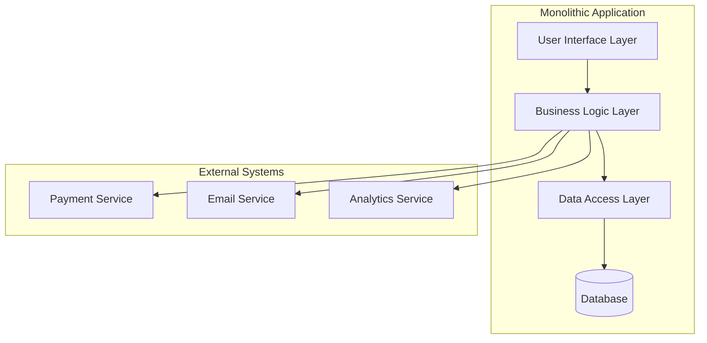

### Core Characteristics

**Single Deployment Unit**
- Entire application packaged and deployed as one unit
- All features share the same runtime environment
- Single process handles all requests

**Shared Database**
- All application modules access the same database
- Direct database calls without service boundaries
- Shared data models across features

**Unified Technology Stack**
- Single programming language and framework
- Consistent libraries and dependencies
- Uniform development and deployment tools

### Benefits of Monolithic Architecture

**Simplicity in Development**
- Easier to develop, test, and debug initially
- Straightforward IDE support and tooling
- Simple local development setup

**Performance Advantages**
- No network latency between components
- Efficient in-process communication
- Optimized database queries and transactions

**Operational Simplicity**
- Single deployment artifact
- Easier monitoring and logging
- Simplified backup and disaster recovery

**Strong Consistency**
- ACID transactions across all operations
- No distributed system complexity
- Easier to maintain data integrity

### Drawbacks and Challenges

**Scalability Limitations**
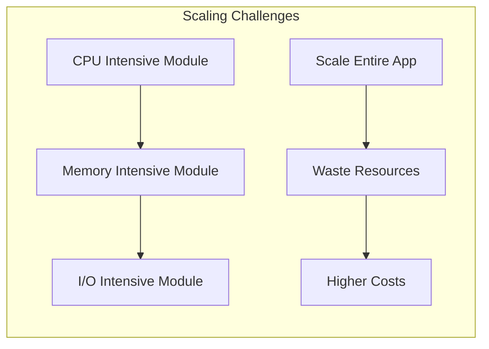

**Technology Lock-in**
- Difficult to adopt new technologies
- Entire application must use same stack
- Hard to experiment with different approaches

**Team Coordination Issues**
- Multiple teams working on same codebase
- Merge conflicts and coordination overhead
- Difficult to establish clear ownership boundaries

**Deployment Risks**
- Single point of failure for entire application
- All-or-nothing deployment strategy
- Rollback affects entire system

## Real-World Examples

### Early Netflix (Pre-2009)

**Architecture Overview**
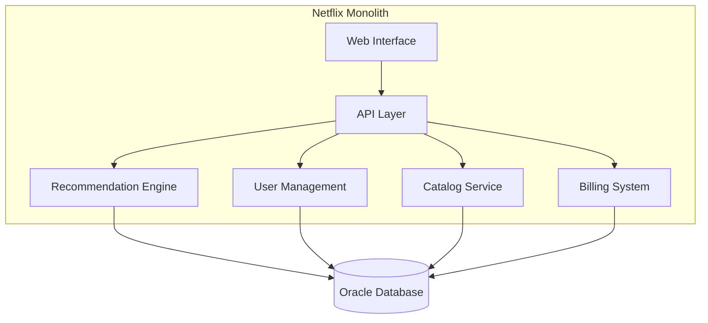

**Why It Worked Initially**
- Small team (< 100 engineers)
- Limited feature set (DVD-by-mail)
- Predictable traffic patterns
- Strong consistency requirements for billing

**Migration Triggers**
- Rapid growth in streaming demand
- Need for independent team scaling
- Different performance requirements per feature
- Global expansion requirements

### Shopify's Monolithic Core

**Current Architecture (Simplified)**
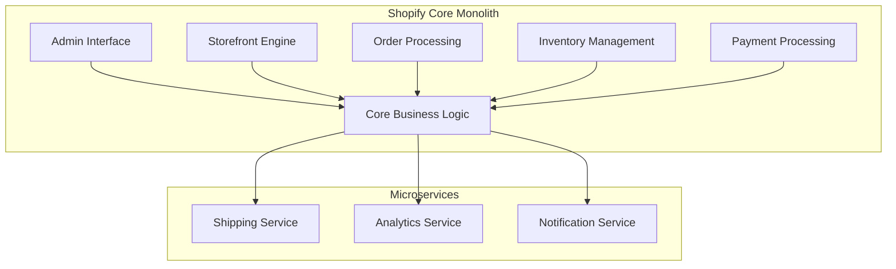

**Why Shopify Maintains a Monolith**
- Core e-commerce logic benefits from strong consistency
- Shared data models across all store operations
- Easier to maintain complex business rules
- Selective extraction of services when needed

### Stack Overflow Architecture

**System Overview**
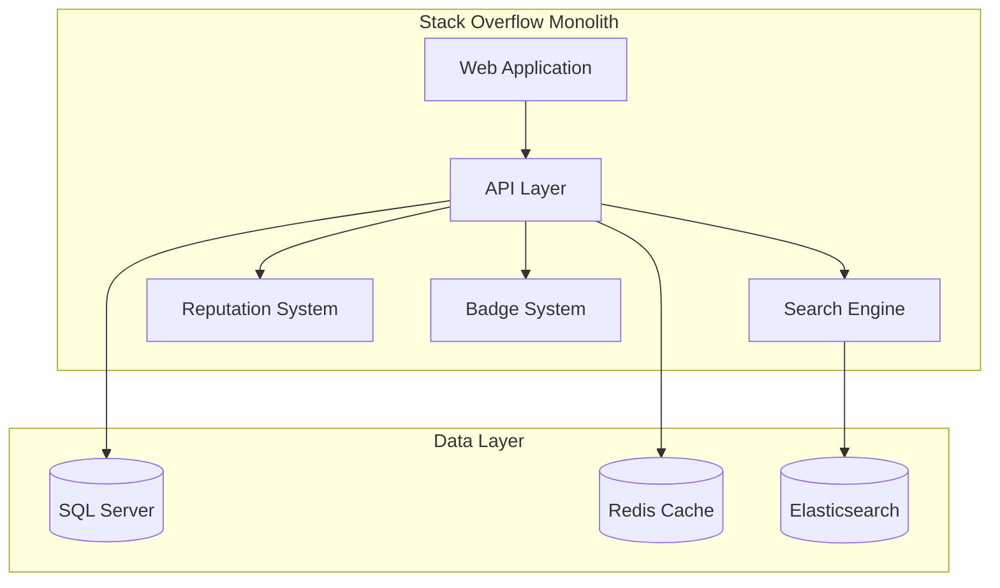

**Success Factors**
- Handles 1.3 billion page views/month with small team
- Optimized for read-heavy workloads
- Efficient caching strategies
- Strong performance focus

## Best Practices

### When to Choose Monolithic Architecture

**Ideal Scenarios**
- **Early-stage startups**: Focus on product-market fit over scalability
- **Small teams** (< 10 developers): Avoid coordination overhead
- **Simple applications**: Limited feature complexity
- **Strong consistency requirements**: Financial or transactional systems
- **Rapid prototyping**: Quick iteration and validation

**Decision Matrix**
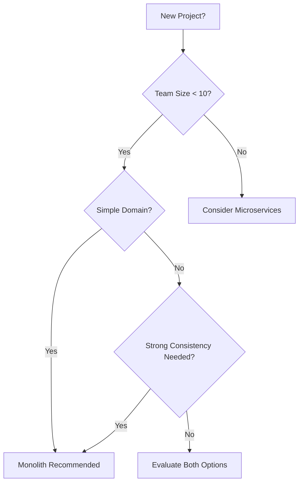

### Design Best Practices

**Modular Structure**
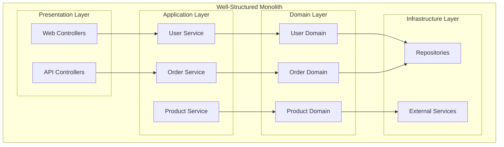

**Code Organization Principles**
- **Package by Feature**: Group related functionality together
- **Clear Layer Separation**: Maintain distinct layers with defined responsibilities
- **Dependency Injection**: Use IoC containers for loose coupling
- **Interface Segregation**: Define clear contracts between modules

**Database Design**
- **Schema Organization**: Use schemas or namespaces to separate concerns
- **Transaction Boundaries**: Keep transactions focused and short-lived
- **Indexing Strategy**: Optimize for common query patterns
- **Data Migration**: Plan for schema evolution and versioning

### Performance Optimization

**Caching Strategies**
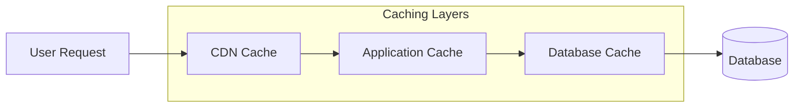

**Optimization Techniques**
- **Connection Pooling**: Reuse database connections efficiently
- **Query Optimization**: Use proper indexing and query patterns
- **Lazy Loading**: Load data only when needed
- **Batch Processing**: Group operations for efficiency

### Testing Strategies

**Testing Pyramid for Monoliths**
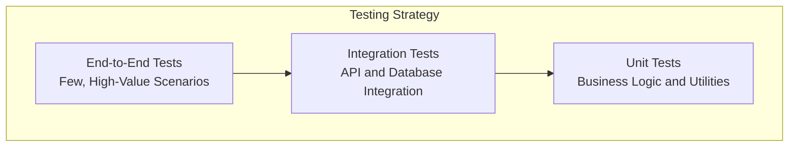

**Testing Best Practices**
- **Unit Tests**: Focus on business logic and pure functions
- **Integration Tests**: Test database interactions and external services
- **Contract Tests**: Validate API contracts and data formats
- **Performance Tests**: Load testing for critical user journeys

## Migration Considerations

### When to Consider Breaking Up a Monolith

**Warning Signs**
- **Development Velocity Decline**: Features take longer to implement
- **Deployment Bottlenecks**: Frequent deployment conflicts
- **Scaling Inefficiencies**: Over-provisioning resources for entire application
- **Team Coordination Issues**: Multiple teams blocking each other

**Migration Strategies**

**Strangler Fig Pattern**
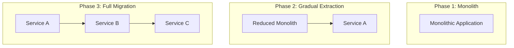

**Database Decomposition**
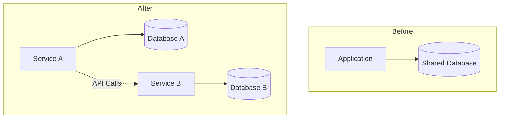

## Summary

### Key Takeaways

**Monolithic Architecture Strengths**
- **Simplicity**: Easier to develop, test, and deploy initially
- **Performance**: No network overhead between components
- **Consistency**: Strong ACID guarantees across all operations
- **Tooling**: Excellent IDE and debugging support

**When Monoliths Excel**
- Early-stage applications with evolving requirements
- Small teams that need to move quickly
- Applications requiring strong consistency
- Systems with simple, well-defined domains

**Evolution Path**
- Start with a well-structured monolith
- Extract services when clear boundaries emerge
- Use the Strangler Fig pattern for gradual migration
- Maintain monolithic core for tightly coupled functionality

**Modern Perspective**
Monolithic architecture isn't outdated—it's a valid choice that works well for many scenarios. The key is building a modular monolith that can evolve into microservices when the benefits justify the added complexity.

### Next Steps

- **Learn about SOA**: Understand how Service-Oriented Architecture addresses some monolithic limitations
- **Explore Microservices**: See how Netflix and others evolved from monoliths
- **Study Migration Patterns**: Learn strategies for evolving architectural patterns
- **Practice Design**: Apply these concepts in system design interviews

### Quick Reference

**Monolith Checklist**
- ✅ Small team (< 10 developers)
- ✅ Early-stage product
- ✅ Simple domain model
- ✅ Strong consistency requirements
- ✅ Rapid iteration needed
- ❌ Multiple independent teams
- ❌ Different scaling requirements per feature
- ❌ Technology diversity needs
