# Service-Oriented Architecture (SOA)

## Introduction

Service-Oriented Architecture (SOA) is an architectural pattern that structures applications as a collection of loosely coupled, reusable services that communicate over well-defined interfaces. SOA emerged in the early 2000s as a way to address the limitations of monolithic architectures while providing better modularity and reusability.

SOA serves as a bridge between monolithic and microservices architectures, introducing service boundaries while maintaining some centralized governance and shared infrastructure. Understanding SOA is crucial because many of its principles directly influenced modern microservices patterns.

## Key Concepts

### What is Service-Oriented Architecture?

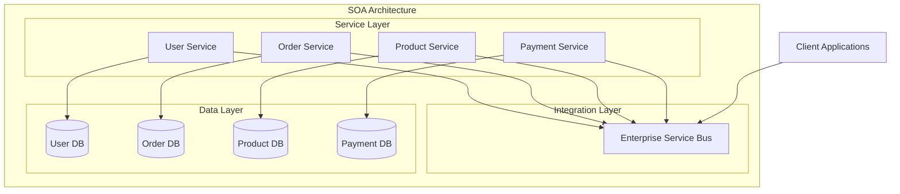

### Core SOA Principles

**Service Autonomy**
- Services have control over their own logic and data
- Independent deployment and versioning
- Self-contained business functionality

**Service Reusability**
- Services designed for multiple consumers
- Generic interfaces that support various use cases
- Shared business logic across applications

**Service Composability**
- Services can be combined to create larger business processes
- Orchestration and choreography patterns
- Workflow-driven service interactions

**Service Discoverability**
- Services publish their capabilities and interfaces
- Registry-based service discovery
- Metadata-driven service consumption

### SOA vs Monolithic Architecture

| Aspect | Monolithic | SOA |
|--------|------------|-----|
| **Deployment** | Single unit | Multiple services |
| **Communication** | In-process calls | Network protocols |
| **Data Management** | Shared database | Service-owned data |
| **Technology Stack** | Uniform | Can vary per service |
| **Team Structure** | Single team | Multiple service teams |
| **Governance** | Centralized | Distributed with standards |

## Architecture Components

### Enterprise Service Bus (ESB)

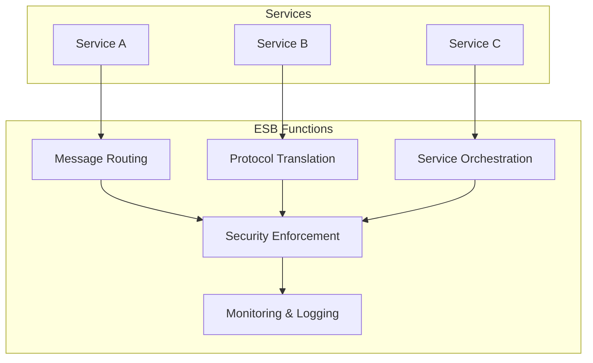

**ESB Responsibilities**
- **Message Routing**: Direct messages between services based on content or rules
- **Protocol Translation**: Convert between different communication protocols (HTTP, SOAP, JMS)
- **Data Transformation**: Transform message formats between services
- **Security**: Centralized authentication, authorization, and encryption
- **Monitoring**: Track service performance and availability

### Service Registry and Discovery

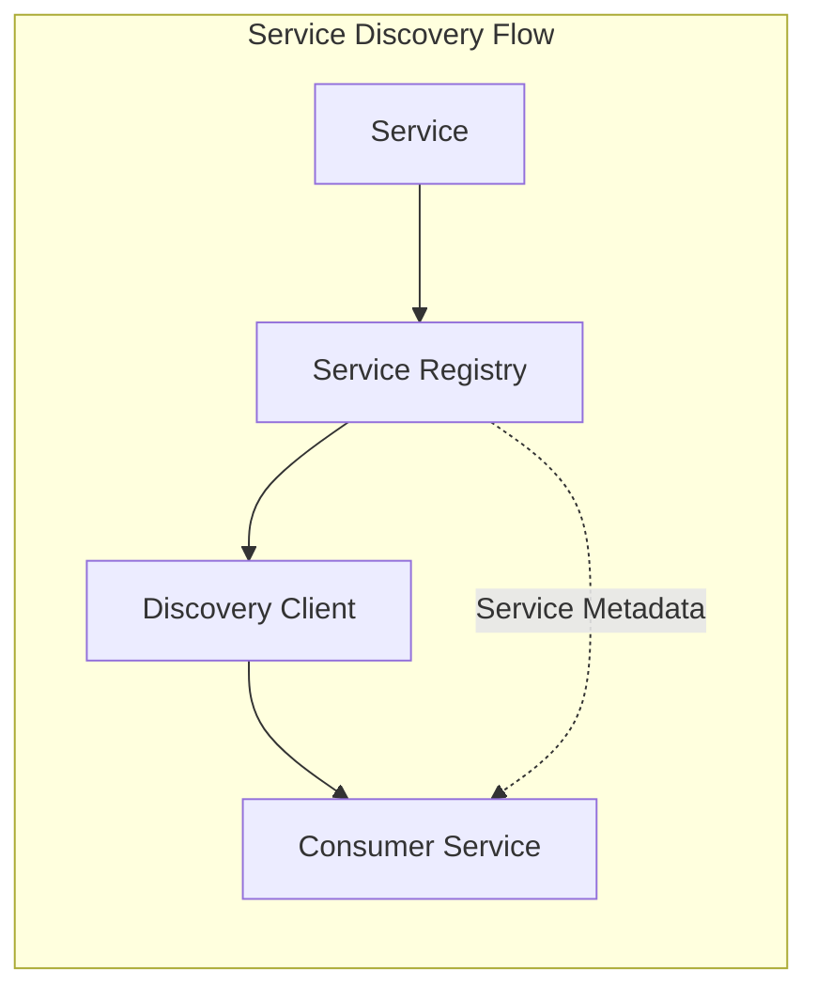

**Registry Components**
- **Service Metadata**: Interface definitions, endpoints, capabilities
- **Health Monitoring**: Service availability and performance metrics
- **Version Management**: Multiple service versions and compatibility
- **Load Balancing**: Distribution of requests across service instances

### Communication Patterns

**Synchronous Communication**
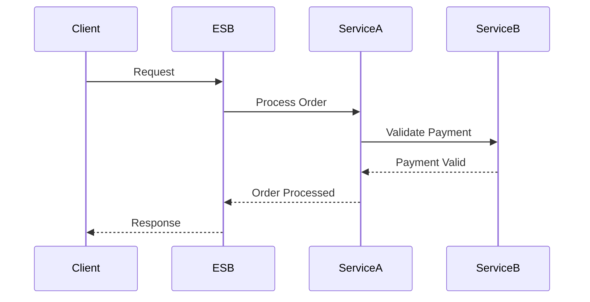

**Asynchronous Communication**
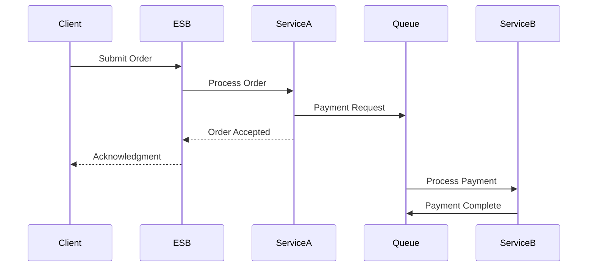

## Real-World Examples

### Amazon's Early SOA (2002-2006)

**Architecture Evolution**
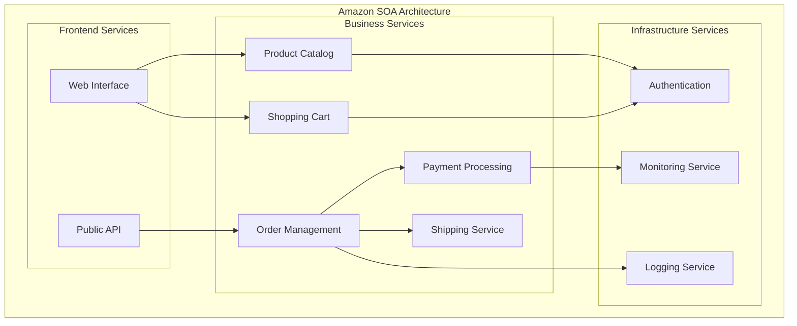

**Key SOA Principles at Amazon**
- **Service Ownership**: Each service owned by a specific team
- **API-First Design**: All services communicate through APIs
- **Decentralized Data**: Each service manages its own data
- **Autonomous Deployment**: Services deployed independently

**Benefits Realized**
- Enabled rapid scaling of different components
- Allowed teams to work independently
- Facilitated technology diversity across services
- Improved fault isolation and system resilience

### eBay's SOA Implementation

**Service Architecture**
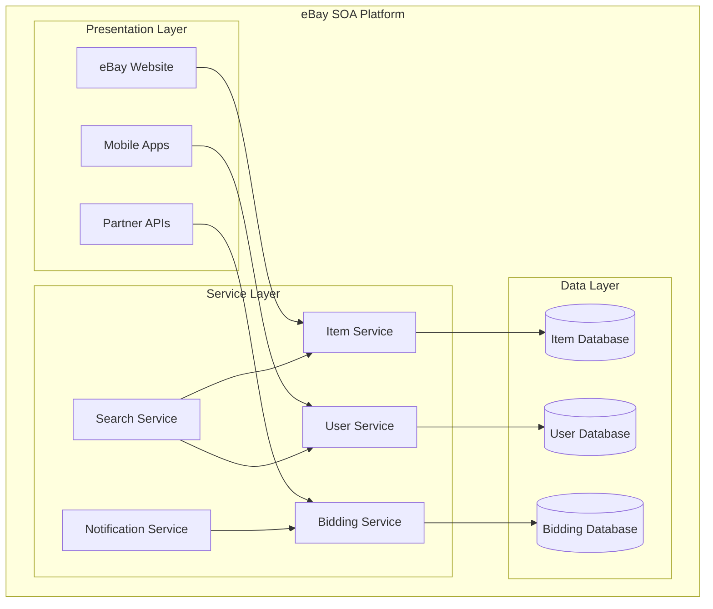

**SOA Success Factors**
- **Standardized Interfaces**: Consistent API design across all services
- **Centralized Governance**: Shared standards and best practices
- **Service Versioning**: Backward compatibility and gradual migration
- **Performance Monitoring**: Comprehensive service health tracking

### Enterprise SOA: Banking System

**Traditional Banking SOA**
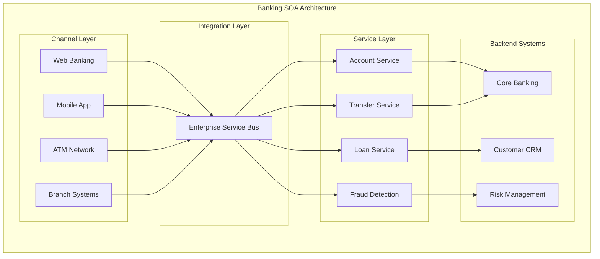

**Enterprise SOA Benefits**
- **Legacy Integration**: Gradual modernization of existing systems
- **Regulatory Compliance**: Centralized audit and compliance controls
- **Cross-Channel Consistency**: Unified business logic across channels
- **Vendor Independence**: Standardized interfaces reduce vendor lock-in

## Best Practices

### Service Design Principles

**Service Granularity**
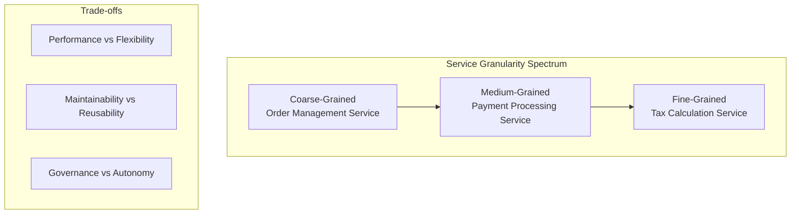

**Optimal Service Size Guidelines**
- **Business Capability Alignment**: Services should represent complete business functions
- **Team Ownership**: Service should be manageable by a single team (8-12 people)
- **Data Cohesion**: Related data should be managed by the same service
- **Change Frequency**: Frequently changing components should be separate services

### Interface Design

**Contract-First Development**
```xml
<!-- Example WSDL Service Contract -->
<definitions xmlns="http://schemas.xmlsoap.org/wsdl/"
             targetNamespace="http://example.com/orderservice">
    
    <types>
        <schema targetNamespace="http://example.com/orderservice">
            <element name="CreateOrderRequest">
                <complexType>
                    <sequence>
                        <element name="customerId" type="string"/>
                        <element name="items" type="OrderItem" maxOccurs="unbounded"/>
                        <element name="shippingAddress" type="Address"/>
                    </sequence>
                </complexType>
            </element>
        </schema>
    </types>
    
    <message name="CreateOrderRequestMessage">
        <part name="parameters" element="CreateOrderRequest"/>
    </message>
    
    <portType name="OrderServicePortType">
        <operation name="CreateOrder">
            <input message="CreateOrderRequestMessage"/>
            <output message="CreateOrderResponseMessage"/>
        </operation>
    </portType>
</definitions>
```

**Interface Best Practices**
- **Versioning Strategy**: Maintain backward compatibility with semantic versioning
- **Error Handling**: Standardized error codes and messages across services
- **Documentation**: Comprehensive API documentation with examples
- **Testing**: Contract testing to ensure interface compliance

### Governance and Standards

**SOA Governance Framework**
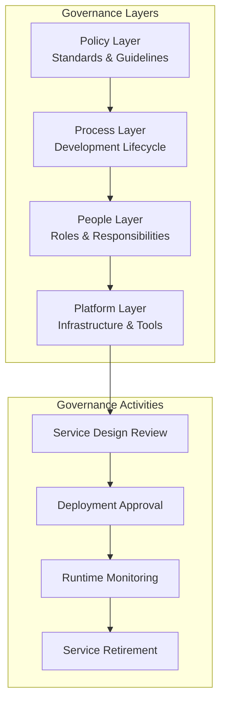

**Key Governance Areas**
- **Service Standards**: Naming conventions, interface patterns, data formats
- **Security Policies**: Authentication, authorization, encryption requirements
- **Performance SLAs**: Response time, throughput, availability targets
- **Change Management**: Version control, testing, deployment procedures

### Performance Optimization

**Caching Strategies**
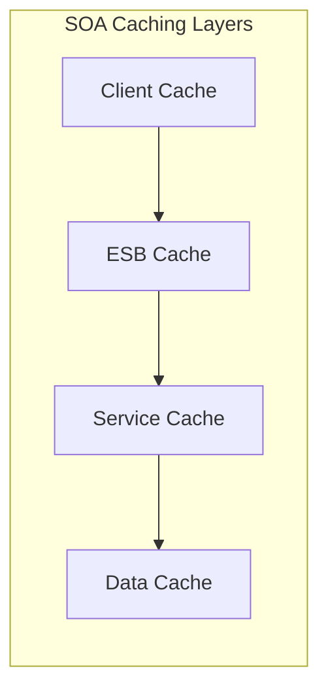

**Performance Best Practices**
- **Connection Pooling**: Reuse connections between services and ESB
- **Message Optimization**: Minimize message size and complexity
- **Asynchronous Processing**: Use async patterns for non-critical operations
- **Circuit Breakers**: Prevent cascade failures in service chains

## SOA Challenges and Solutions

### Common Challenges

**ESB as Single Point of Failure**
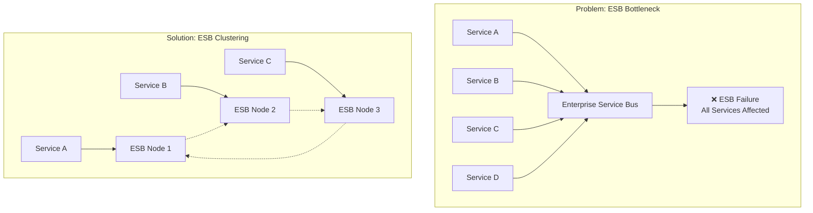

**Performance Overhead**
- **Problem**: Network latency and message transformation overhead
- **Solution**: Optimize message formats, use binary protocols, implement caching

**Governance Complexity**
- **Problem**: Centralized governance can slow development
- **Solution**: Automated governance tools, self-service capabilities

### Migration from SOA to Microservices

**Evolution Path**
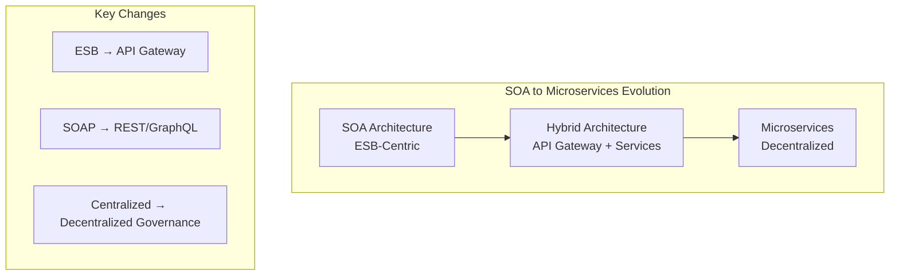

## Summary

### Key Takeaways

**SOA Strengths**
- **Service Reusability**: Well-designed services can be reused across applications
- **Legacy Integration**: Excellent for wrapping and modernizing existing systems
- **Standardization**: Enforces consistent interfaces and governance
- **Enterprise Scale**: Proven pattern for large enterprise architectures

**SOA Limitations**
- **ESB Complexity**: Central bus can become a bottleneck and single point of failure
- **Performance Overhead**: Network calls and message transformation add latency
- **Governance Burden**: Centralized governance can slow development velocity
- **Technology Lock-in**: Often tied to specific ESB vendors and technologies

**When SOA Works Best**
- **Enterprise Environments**: Large organizations with existing systems
- **Regulatory Requirements**: Industries requiring strong governance and audit trails
- **Legacy Modernization**: Gradual transformation of monolithic systems
- **Cross-System Integration**: Connecting diverse systems and technologies

### SOA's Legacy and Modern Relevance

**Influence on Microservices**
- Service boundaries and ownership concepts
- API-first design principles
- Independent deployment patterns
- Distributed system challenges and solutions

**Modern SOA Applications**
- **API Management Platforms**: Kong, Apigee, AWS API Gateway
- **Service Mesh**: Istio, Linkerd for service communication
- **Event-Driven Architecture**: Kafka, EventBridge for async communication
- **Serverless Integration**: Functions as lightweight services

### Next Steps

- **Explore Microservices**: Learn how modern architectures evolved from SOA
- **Study API Design**: Understand RESTful and GraphQL service interfaces
- **Practice Service Decomposition**: Apply service boundary identification techniques
- **Learn Integration Patterns**: Master async messaging and event-driven patterns

### Quick Reference

**SOA Decision Checklist**
- ✅ Enterprise environment with governance needs
- ✅ Legacy system integration requirements
- ✅ Multiple applications sharing business logic
- ✅ Regulatory compliance and audit requirements
- ❌ Small team needing rapid development
- ❌ Simple application with minimal integration
- ❌ High-performance, low-latency requirements
