# Microservices Architecture

## Introduction

Microservices architecture is a design approach that structures an application as a collection of small, autonomous services that communicate over well-defined APIs. Each service is independently deployable, owns its data, and is built around specific business capabilities. This pattern has become the dominant architecture for modern cloud-native applications.

Unlike SOA's centralized governance model, microservices embrace decentralized decision-making and technology diversity. This approach enables organizations to scale development teams, adopt new technologies incrementally, and deploy services independently—but it also introduces significant complexity in distributed system management.

## Key Concepts

### What are Microservices?

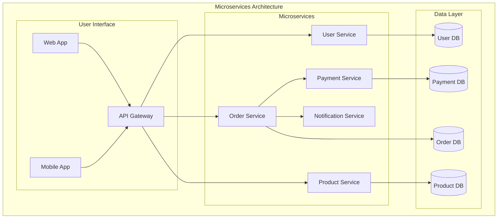

### Core Microservices Principles

**Business Capability Alignment**
- Each service represents a specific business function
- Services are organized around business domains, not technical layers
- Clear ownership and responsibility boundaries

**Decentralized Governance**
- Teams choose their own technology stacks
- Independent deployment and release cycles
- Autonomous decision-making within service boundaries

**Failure Isolation**
- Service failures don't cascade to entire system
- Circuit breakers and bulkhead patterns
- Graceful degradation strategies

**Data Ownership**
- Each service owns its data and database
- No shared databases between services
- Data consistency through eventual consistency patterns

### Microservices vs Other Architectures

| Aspect | Monolithic | SOA | Microservices |
|--------|------------|-----|---------------|
| **Service Size** | Single application | Coarse-grained services | Fine-grained services |
| **Communication** | In-process | ESB-mediated | Direct API calls |
| **Data Management** | Shared database | Service databases | Service-owned data |
| **Governance** | Centralized | Centralized standards | Decentralized |
| **Technology Stack** | Uniform | Mostly uniform | Polyglot |
| **Deployment** | Single unit | Service-level | Independent services |
| **Team Structure** | Single team | Service teams | Cross-functional teams |

## Architecture Components

### API Gateway

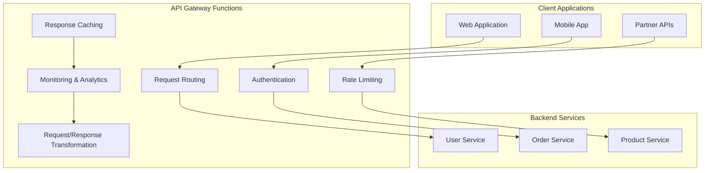

**API Gateway Responsibilities**
- **Request Routing**: Direct requests to appropriate services based on URL patterns
- **Authentication & Authorization**: Centralized security enforcement
- **Rate Limiting**: Protect services from overload and abuse
- **Request/Response Transformation**: Adapt between client and service formats
- **Monitoring & Analytics**: Track API usage and performance metrics
- **Circuit Breaking**: Prevent cascade failures in service chains

### Service Discovery

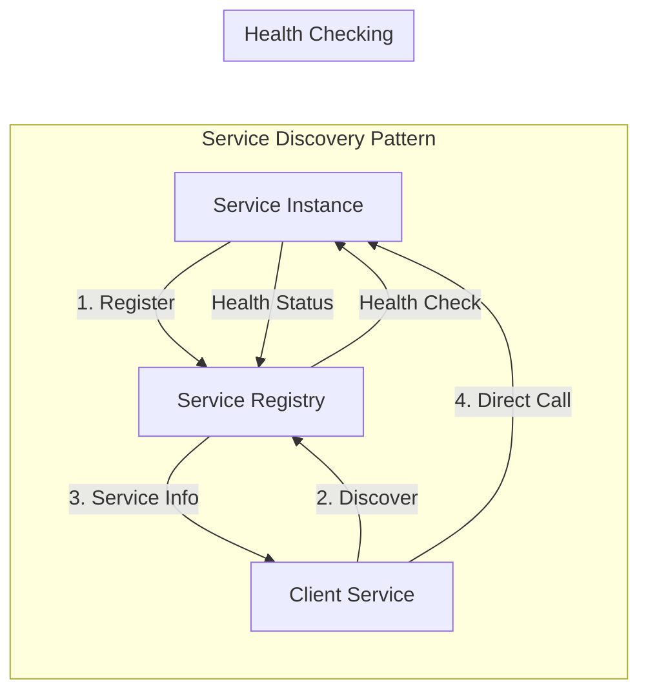

**Discovery Mechanisms**
- **Client-Side Discovery**: Clients query registry and handle load balancing
- **Server-Side Discovery**: Load balancer queries registry and routes requests
- **Service Mesh**: Infrastructure layer handles discovery and routing

### Communication Patterns

**Synchronous Communication**
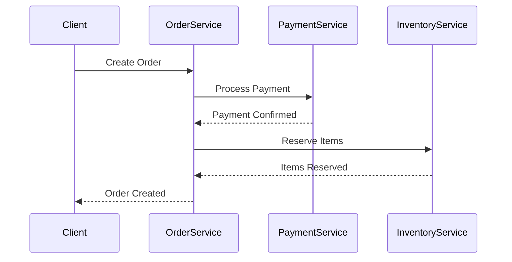

**Asynchronous Communication**
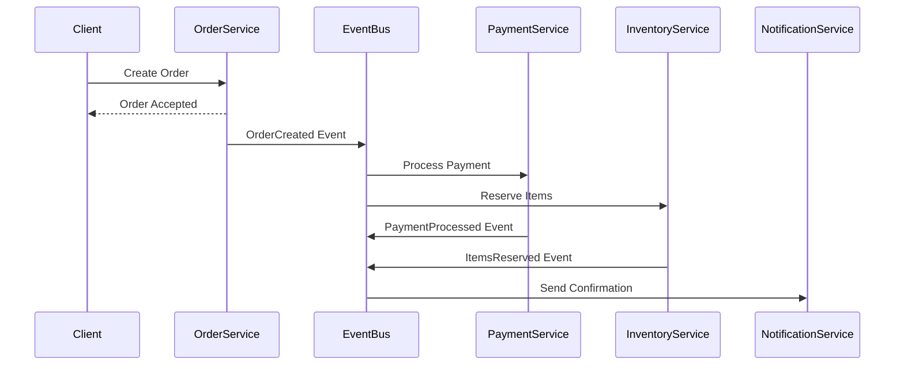

## Real-World Examples

### Netflix Microservices Evolution

**Netflix Architecture Scale**
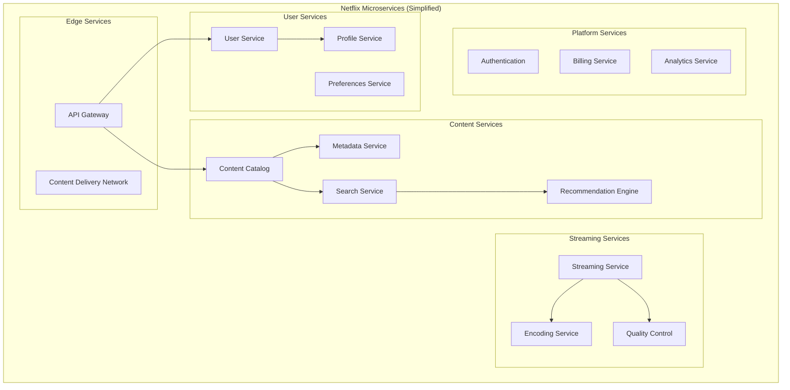

**Netflix's Microservices Journey**
- **2009**: Started migration from monolith to microservices
- **2012**: Completed migration to AWS with 100+ services
- **2020**: Running 1000+ microservices handling billions of requests daily

**Key Success Factors**
- **Chaos Engineering**: Deliberately introducing failures to test resilience
- **Circuit Breakers**: Hystrix library for fault tolerance
- **Service Mesh**: Zuul for intelligent routing and filtering
- **Observability**: Comprehensive monitoring and distributed tracing

### Uber's Microservices Architecture

**Uber Platform Overview**
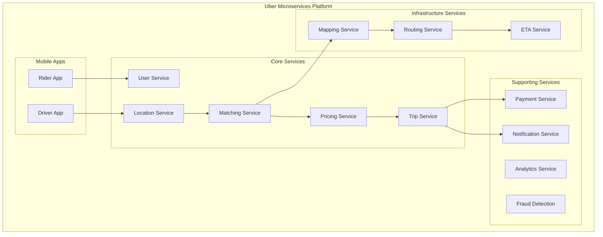

**Uber's Architecture Principles**
- **Domain-Driven Design**: Services aligned with business domains
- **Event-Driven Architecture**: Kafka for real-time event streaming
- **Polyglot Persistence**: Different databases for different service needs
- **Horizontal Scaling**: Auto-scaling based on demand patterns

### Amazon's Service-Oriented Evolution

**Amazon's Two-Pizza Team Rule**
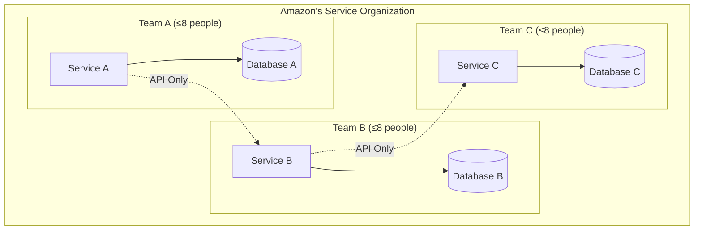

**Amazon's Microservices Principles**
- **API-First**: All service communication through APIs
- **Team Ownership**: Each team owns their service end-to-end
- **Decentralized**: No shared databases or direct service dependencies
- **Autonomous**: Teams make independent technology and deployment decisions

## Best Practices

### Service Design Principles

**Domain-Driven Design (DDD)**
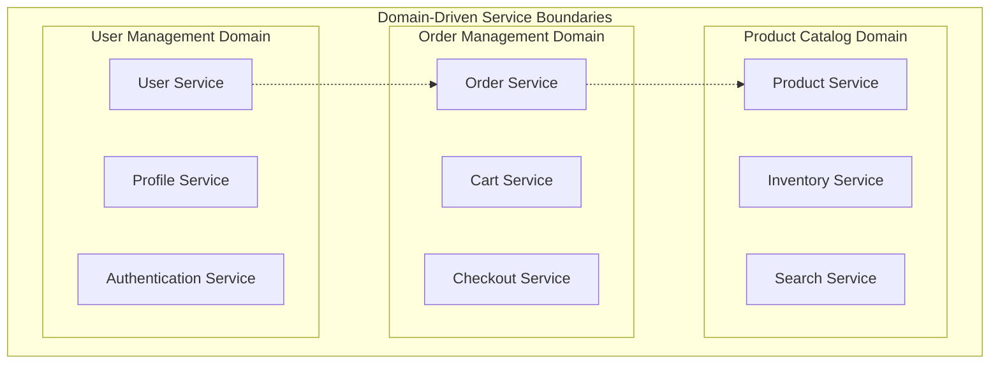

**Service Sizing Guidelines**
- **Single Responsibility**: Each service should have one clear business purpose
- **Team Ownership**: Service should be manageable by one team (2-8 people)
- **Independent Deployment**: Service should be deployable without coordinating with other teams
- **Data Cohesion**: Related data should be managed by the same service

### Data Management Strategies

**Database per Service Pattern**
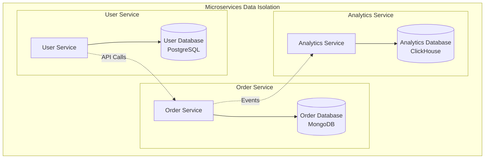

**Data Consistency Patterns**

**Saga Pattern for Distributed Transactions**
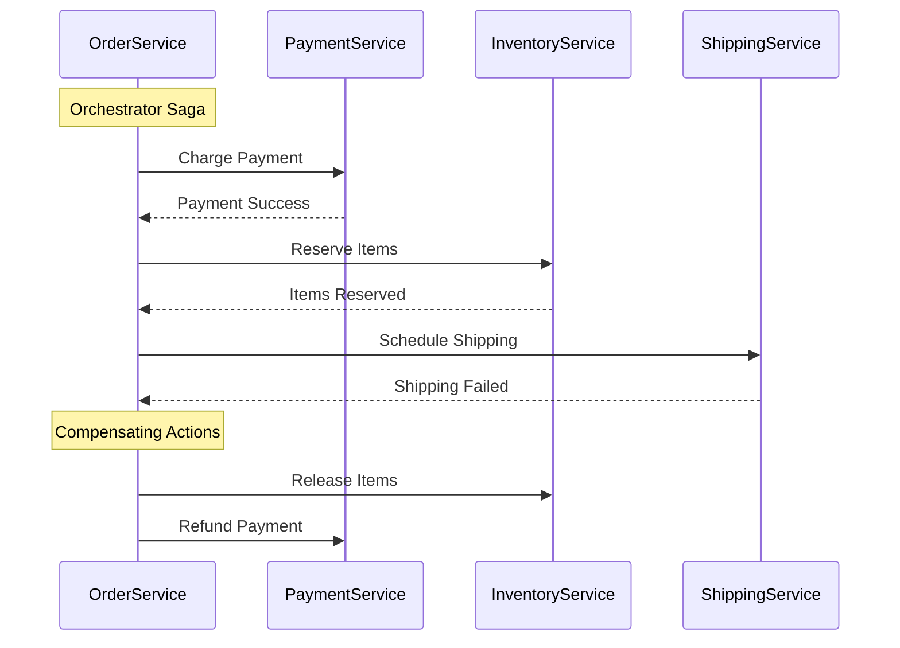

**Event Sourcing Pattern**
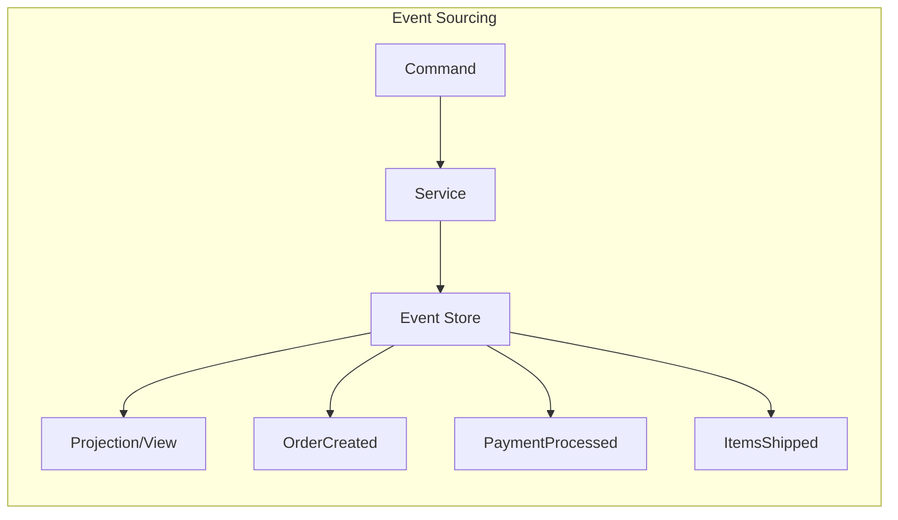

### Communication Best Practices

**API Design Guidelines**
```json
// RESTful API Example
{
  "apiVersion": "v1",
  "endpoints": {
    "orders": {
      "GET /orders": "List orders with pagination",
      "POST /orders": "Create new order",
      "GET /orders/{id}": "Get specific order",
      "PUT /orders/{id}": "Update order",
      "DELETE /orders/{id}": "Cancel order"
    }
  },
  "errorHandling": {
    "standardCodes": [400, 401, 403, 404, 409, 500],
    "errorFormat": {
      "error": {
        "code": "INVALID_ORDER_STATUS",
        "message": "Order cannot be modified in current status",
        "details": "Order is already shipped"
      }
    }
  }
}
```

**Circuit Breaker Pattern**
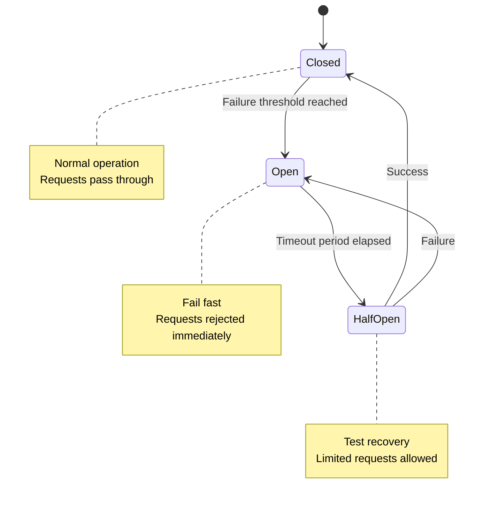

### Deployment and Operations

**Container-Based Deployment**
```yaml
# Docker Compose Example
version: '3.8'
services:
  user-service:
    image: user-service:latest
    ports:
      - "8081:8080"
    environment:
      - DATABASE_URL=postgresql://user-db:5432/users
    depends_on:
      - user-db
      
  order-service:
    image: order-service:latest
    ports:
      - "8082:8080"
    environment:
      - DATABASE_URL=mongodb://order-db:27017/orders
    depends_on:
      - order-db
      
  api-gateway:
    image: nginx:alpine
    ports:
      - "80:80"
    volumes:
      - ./nginx.conf:/etc/nginx/nginx.conf
    depends_on:
      - user-service
      - order-service
```

**Kubernetes Deployment**
```yaml
apiVersion: apps/v1
kind: Deployment
metadata:
  name: user-service
spec:
  replicas: 3
  selector:
    matchLabels:
      app: user-service
  template:
    metadata:
      labels:
        app: user-service
    spec:
      containers:
      - name: user-service
        image: user-service:v1.2.0
        ports:
        - containerPort: 8080
        env:
        - name: DATABASE_URL
          valueFrom:
            secretKeyRef:
              name: db-secret
              key: url
        resources:
          requests:
            memory: "256Mi"
            cpu: "250m"
          limits:
            memory: "512Mi"
            cpu: "500m"
```

### Monitoring and Observability

**Three Pillars of Observability**
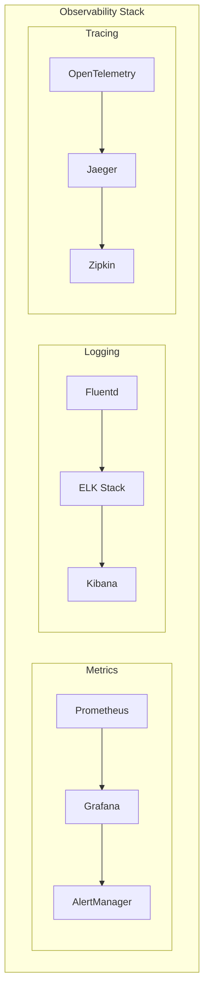

**Distributed Tracing Example**
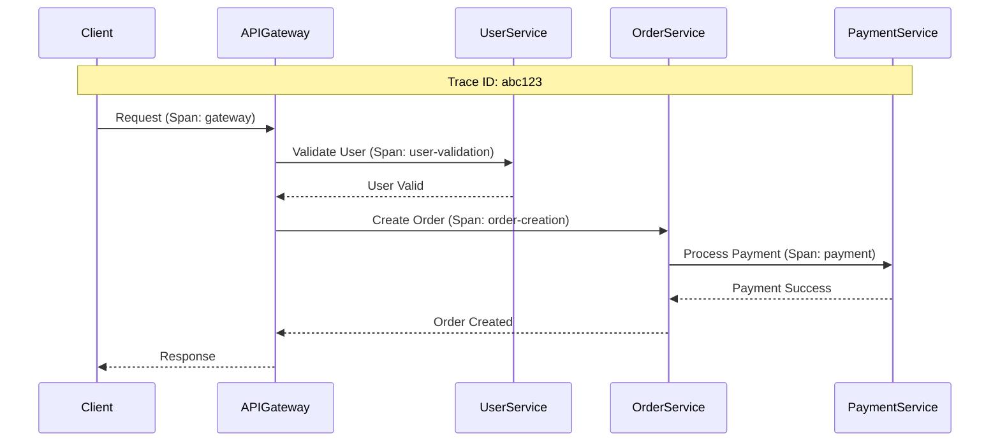

## Microservices Challenges and Solutions

### Common Challenges

**Distributed System Complexity**
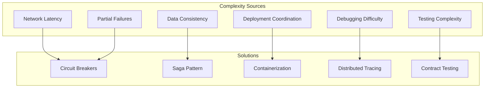

**Data Consistency Challenges**
- **Problem**: No ACID transactions across services
- **Solutions**: Saga pattern, event sourcing, eventual consistency
- **Trade-offs**: Complexity vs consistency guarantees

**Service Communication Overhead**
- **Problem**: Network calls add latency and failure points
- **Solutions**: Caching, async communication, service mesh
- **Monitoring**: Track service-to-service communication patterns

### Anti-Patterns to Avoid

**Distributed Monolith**
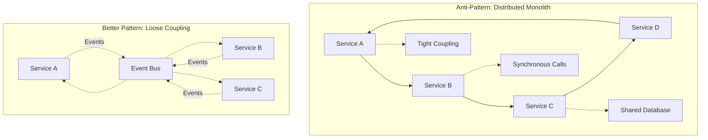

**Chatty Interfaces**
- **Problem**: Too many fine-grained API calls
- **Solution**: Aggregate APIs, batch operations, GraphQL

**Shared Databases**
- **Problem**: Services sharing the same database
- **Solution**: Database per service, event-driven data synchronization

## Migration Strategies

### Strangler Fig Pattern

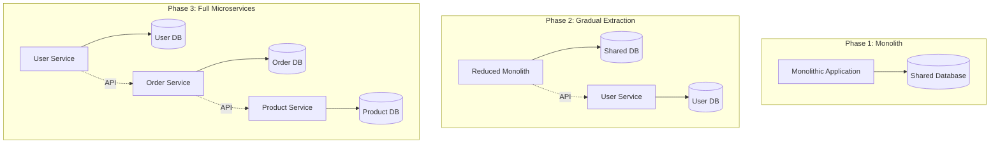

### Database Decomposition

**Step-by-Step Database Migration**
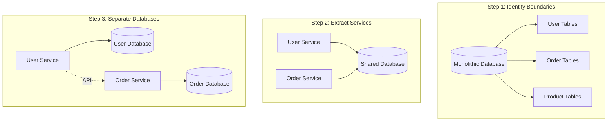

## Summary

### Key Takeaways

**Microservices Strengths**
- **Independent Scaling**: Scale services based on individual demand
- **Technology Diversity**: Choose optimal technology for each service
- **Team Autonomy**: Independent development and deployment cycles
- **Fault Isolation**: Service failures don't cascade to entire system
- **Organizational Alignment**: Services align with business capabilities

**Microservices Challenges**
- **Distributed System Complexity**: Network calls, partial failures, data consistency
- **Operational Overhead**: More services to deploy, monitor, and maintain
- **Testing Complexity**: Integration testing across service boundaries
- **Data Management**: No ACID transactions across services
- **Performance Overhead**: Network latency and serialization costs

**When Microservices Excel**
- **Large Organizations**: Multiple teams working on different business areas
- **Scalability Requirements**: Different scaling needs for different features
- **Technology Diversity**: Need to use different technologies for different problems
- **Rapid Development**: Independent team velocity and deployment cycles
- **Cloud-Native Applications**: Leveraging cloud platform capabilities

### Decision Framework

**Microservices Readiness Assessment**
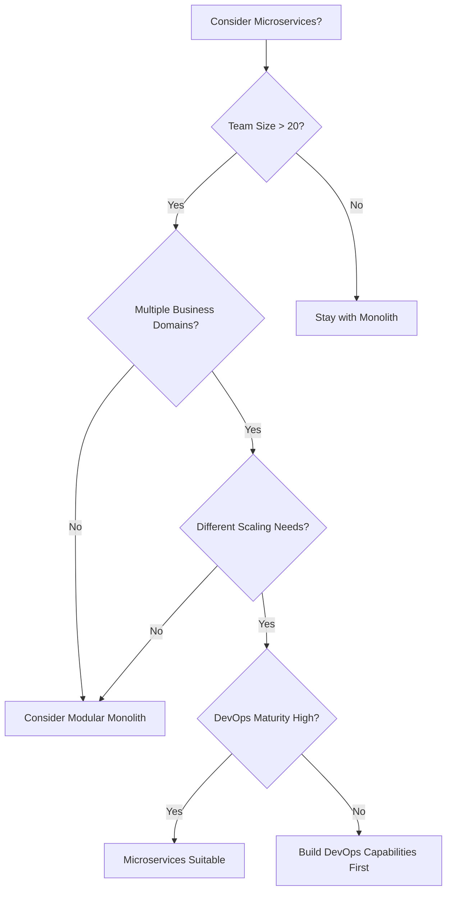

**Prerequisites for Microservices Success**
- **DevOps Maturity**: CI/CD, containerization, monitoring
- **Team Structure**: Cross-functional teams with end-to-end ownership
- **Organizational Culture**: Embrace failure, continuous learning
- **Technical Skills**: Distributed systems, cloud platforms, observability

### Modern Microservices Trends

**Service Mesh Architecture**
- **Istio, Linkerd**: Infrastructure layer for service communication
- **Benefits**: Traffic management, security, observability
- **Use Cases**: Large-scale microservices deployments

**Serverless Microservices**
- **AWS Lambda, Google Cloud Functions**: Event-driven microservices
- **Benefits**: Auto-scaling, pay-per-use, reduced operational overhead
- **Trade-offs**: Cold starts, vendor lock-in, limited runtime environments

**Event-Driven Microservices**
- **Apache Kafka, AWS EventBridge**: Async communication patterns
- **Benefits**: Loose coupling, scalability, resilience
- **Challenges**: Event ordering, duplicate processing, debugging

### Next Steps

- **Study Event-Driven Architecture**: Learn async communication patterns
- **Explore Service Mesh**: Understand infrastructure-level service management
- **Practice API Design**: Master RESTful and GraphQL service interfaces
- **Learn Container Orchestration**: Kubernetes for microservices deployment
- **Study Distributed System Patterns**: Circuit breakers, bulkheads, timeouts

### Quick Reference

**Microservices Decision Checklist**
- ✅ Large team (> 20 developers) with multiple business domains
- ✅ Different scaling requirements for different features
- ✅ Need for technology diversity and independent deployments
- ✅ Strong DevOps culture and automation capabilities
- ✅ Tolerance for distributed system complexity
- ❌ Small team (< 10 developers) with simple domain
- ❌ Strong consistency requirements across all operations
- ❌ Limited DevOps maturity or operational capabilities
- ❌ Performance-critical applications with low latency requirements
