# Event-Driven Architecture

## Introduction

Event-Driven Architecture (EDA) is a design pattern where system components communicate through the production, detection, and consumption of events. An event represents a significant change in state or an occurrence that other parts of the system might be interested in. This pattern enables loose coupling, scalability, and real-time responsiveness in distributed systems.

EDA is particularly powerful for modern applications that need to handle high volumes of data, provide real-time updates, and integrate multiple systems. It's the backbone of many successful platforms like Netflix, Uber, and Amazon, enabling them to process millions of events per second while maintaining system resilience.

## Key Concepts

### What is Event-Driven Architecture?

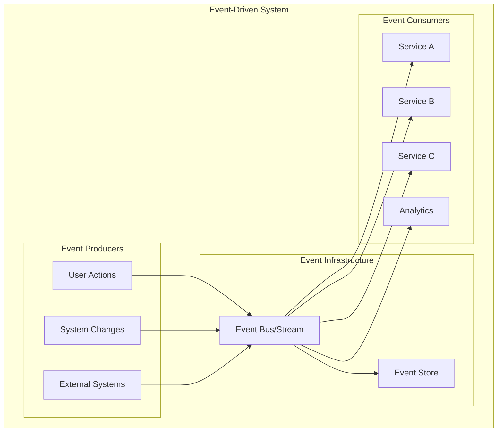

### Core EDA Components

**Events**
- Immutable records of something that happened
- Contain relevant data about the occurrence
- Timestamped and uniquely identified
- Self-contained with all necessary context

**Event Producers**
- Components that detect and publish events
- Can be user interfaces, services, or external systems
- Responsible for event schema and data quality

**Event Consumers**
- Components that subscribe to and process events
- Can perform actions, update state, or trigger workflows
- May produce new events as a result of processing

**Event Channels**
- Infrastructure for event transmission
- Provide delivery guarantees and ordering
- Handle routing, filtering, and transformation

### Event Types and Patterns

**Domain Events**
```json
{
  "eventId": "order-123-created",
  "eventType": "OrderCreated",
  "timestamp": "2024-01-15T10:30:00Z",
  "version": "1.0",
  "source": "order-service",
  "data": {
    "orderId": "order-123",
    "customerId": "customer-456",
    "items": [
      {
        "productId": "product-789",
        "quantity": 2,
        "price": 29.99
      }
    ],
    "totalAmount": 59.98,
    "status": "pending"
  }
}
```

**Integration Events**
```json
{
  "eventId": "payment-processed-789",
  "eventType": "PaymentProcessed",
  "timestamp": "2024-01-15T10:35:00Z",
  "version": "1.0",
  "source": "payment-service",
  "correlationId": "order-123",
  "data": {
    "paymentId": "payment-789",
    "orderId": "order-123",
    "amount": 59.98,
    "method": "credit_card",
    "status": "completed",
    "transactionId": "txn-abc123"
  }
}
```

## Architecture Patterns

### Publish-Subscribe Pattern

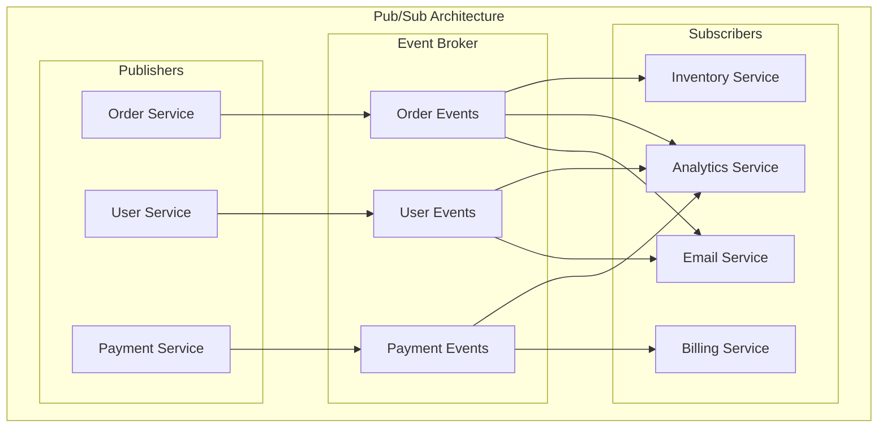

**Benefits of Pub/Sub**
- **Loose Coupling**: Publishers don't know about subscribers
- **Scalability**: Add subscribers without changing publishers
- **Flexibility**: Dynamic subscription management
- **Resilience**: Failure of one subscriber doesn't affect others

### Event Sourcing Pattern

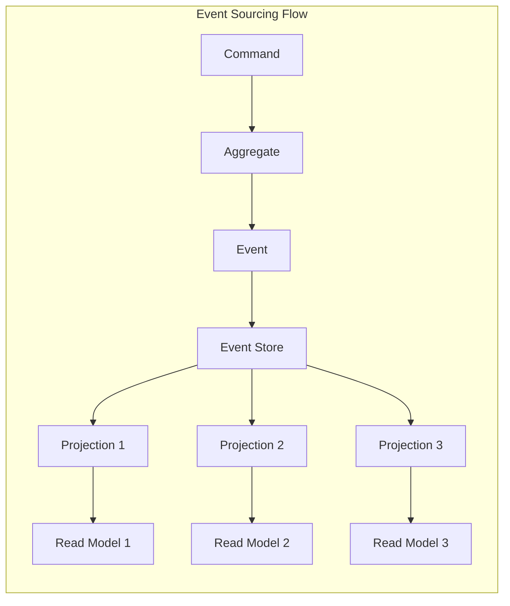

**Event Store Example**
```json
{
  "streamId": "order-123",
  "events": [
    {
      "eventNumber": 1,
      "eventType": "OrderCreated",
      "timestamp": "2024-01-15T10:30:00Z",
      "data": { "customerId": "customer-456", "items": [...] }
    },
    {
      "eventNumber": 2,
      "eventType": "PaymentProcessed",
      "timestamp": "2024-01-15T10:35:00Z",
      "data": { "paymentId": "payment-789", "amount": 59.98 }
    },
    {
      "eventNumber": 3,
      "eventType": "OrderShipped",
      "timestamp": "2024-01-15T14:20:00Z",
      "data": { "trackingNumber": "track-xyz", "carrier": "FedEx" }
    }
  ]
}
```

### CQRS (Command Query Responsibility Segregation)

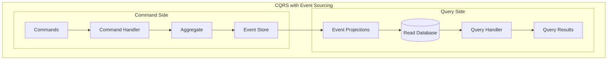

**CQRS Benefits**
- **Optimized Reads and Writes**: Separate models for different access patterns
- **Scalability**: Scale read and write sides independently
- **Flexibility**: Multiple read models from same event stream
- **Performance**: Denormalized views for fast queries

### Saga Pattern for Distributed Transactions

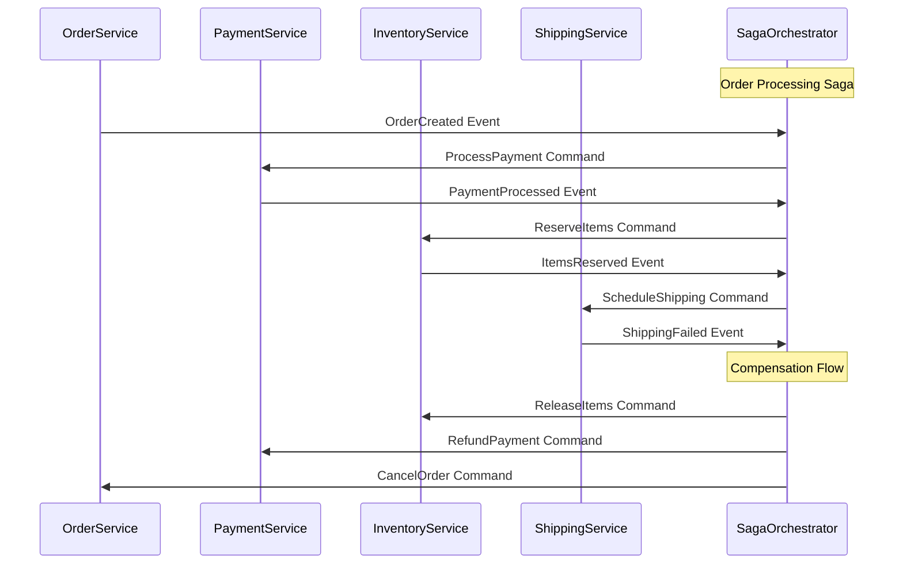

## Real-World Examples

### Netflix Event-Driven Architecture

**Netflix Streaming Platform**
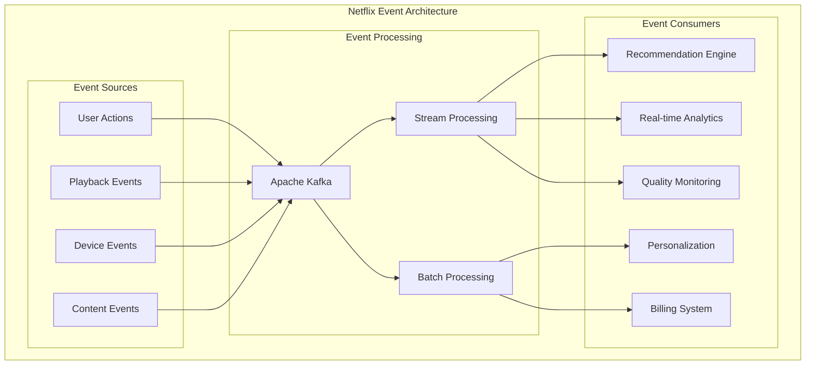

**Netflix Event Types**
- **Viewing Events**: Play, pause, stop, seek, quality changes
- **User Events**: Login, logout, profile changes, preferences
- **Content Events**: New content added, metadata updates
- **System Events**: Service health, performance metrics

**Scale and Impact**
- **500+ billion events per day** processed through Kafka
- **Real-time personalization** based on viewing behavior
- **A/B testing** driven by event data
- **Predictive analytics** for content recommendations

### Uber's Event-Driven Platform

**Uber Real-Time Architecture**
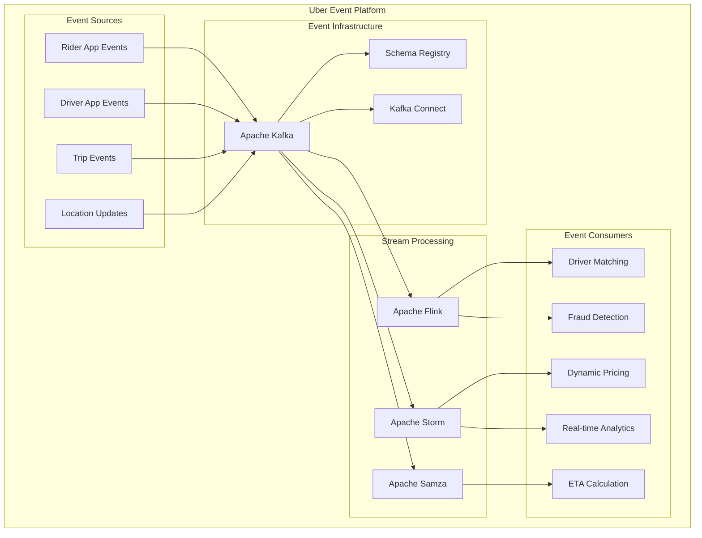

**Uber's Event Processing**
- **Location Events**: GPS coordinates updated every few seconds
- **Trip Events**: Request, acceptance, pickup, dropoff, payment
- **Supply/Demand Events**: Driver availability, rider requests
- **Pricing Events**: Surge pricing calculations based on real-time data

### Amazon's Event-Driven E-commerce

**Amazon Order Processing**
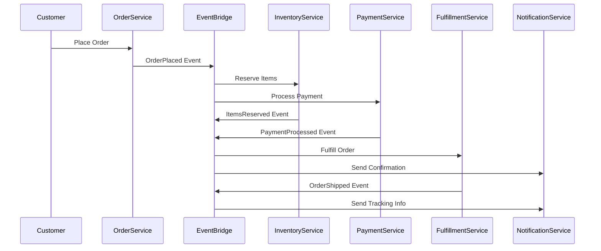

**Amazon EventBridge Usage**
- **Order Events**: Placement, modification, cancellation
- **Inventory Events**: Stock updates, reservations, replenishment
- **Fulfillment Events**: Picking, packing, shipping, delivery
- **Customer Events**: Account changes, preferences, feedback

## Best Practices

### Event Design Principles

**Event Schema Design**
```json
{
  "$schema": "http://json-schema.org/draft-07/schema#",
  "type": "object",
  "title": "OrderCreated Event Schema",
  "properties": {
    "eventId": {
      "type": "string",
      "description": "Unique identifier for this event"
    },
    "eventType": {
      "type": "string",
      "enum": ["OrderCreated"],
      "description": "Type of event"
    },
    "timestamp": {
      "type": "string",
      "format": "date-time",
      "description": "When the event occurred"
    },
    "version": {
      "type": "string",
      "description": "Schema version for backward compatibility"
    },
    "source": {
      "type": "string",
      "description": "Service that produced the event"
    },
    "correlationId": {
      "type": "string",
      "description": "ID to correlate related events"
    },
    "data": {
      "type": "object",
      "properties": {
        "orderId": { "type": "string" },
        "customerId": { "type": "string" },
        "items": {
          "type": "array",
          "items": {
            "type": "object",
            "properties": {
              "productId": { "type": "string" },
              "quantity": { "type": "integer" },
              "price": { "type": "number" }
            },
            "required": ["productId", "quantity", "price"]
          }
        },
        "totalAmount": { "type": "number" }
      },
      "required": ["orderId", "customerId", "items", "totalAmount"]
    }
  },
  "required": ["eventId", "eventType", "timestamp", "version", "source", "data"]
}
```

**Event Naming Conventions**
- **Past Tense**: Events represent things that have already happened
- **Domain Language**: Use business terminology, not technical jargon
- **Specific**: Be precise about what occurred
- **Consistent**: Follow naming patterns across the system

**Good Examples**: `OrderCreated`, `PaymentProcessed`, `UserRegistered`
**Bad Examples**: `CreateOrder`, `ProcessPayment`, `RegisterUser`

### Event Processing Patterns

**At-Least-Once Delivery**
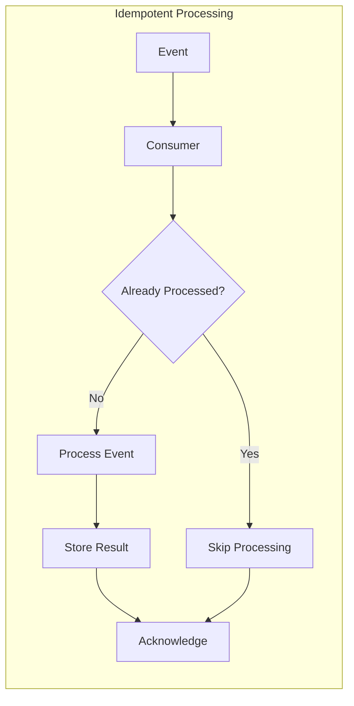

**Idempotency Implementation**
```python
class EventProcessor:
    def __init__(self, event_store, result_store):
        self.event_store = event_store
        self.result_store = result_store
    
    def process_event(self, event):
        # Check if already processed
        if self.result_store.exists(event.id):
            return self.result_store.get(event.id)
        
        # Process the event
        result = self.handle_event(event)
        
        # Store result atomically
        self.result_store.save(event.id, result)
        
        return result
    
    def handle_event(self, event):
        # Business logic here
        pass
```

**Dead Letter Queue Pattern**
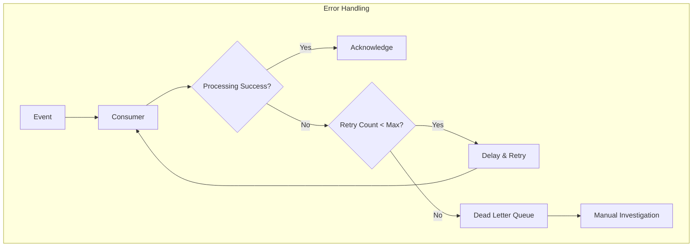

### Event Store Design

**Event Store Schema**
```sql
CREATE TABLE events (
    id UUID PRIMARY KEY,
    stream_id VARCHAR(255) NOT NULL,
    event_number BIGINT NOT NULL,
    event_type VARCHAR(255) NOT NULL,
    event_data JSONB NOT NULL,
    metadata JSONB,
    timestamp TIMESTAMP WITH TIME ZONE DEFAULT NOW(),
    version INTEGER NOT NULL,
    
    UNIQUE(stream_id, event_number),
    INDEX(stream_id, event_number),
    INDEX(event_type),
    INDEX(timestamp)
);

CREATE TABLE snapshots (
    stream_id VARCHAR(255) PRIMARY KEY,
    event_number BIGINT NOT NULL,
    snapshot_data JSONB NOT NULL,
    timestamp TIMESTAMP WITH TIME ZONE DEFAULT NOW()
);
```

**Event Store Operations**
```python
class EventStore:
    def append_events(self, stream_id, expected_version, events):
        """Append events to stream with optimistic concurrency control"""
        with self.db.transaction():
            current_version = self.get_stream_version(stream_id)
            
            if current_version != expected_version:
                raise ConcurrencyException(
                    f"Expected version {expected_version}, "
                    f"but stream is at version {current_version}"
                )
            
            for i, event in enumerate(events):
                self.db.execute("""
                    INSERT INTO events 
                    (id, stream_id, event_number, event_type, event_data, version)
                    VALUES (%s, %s, %s, %s, %s, %s)
                """, (
                    event.id,
                    stream_id,
                    current_version + i + 1,
                    event.type,
                    event.data,
                    event.version
                ))
    
    def read_events(self, stream_id, from_version=0):
        """Read events from stream starting from version"""
        return self.db.query("""
            SELECT event_type, event_data, event_number, timestamp
            FROM events
            WHERE stream_id = %s AND event_number > %s
            ORDER BY event_number
        """, (stream_id, from_version))
```

### Performance Optimization

**Event Batching**
```python
class BatchEventProcessor:
    def __init__(self, batch_size=100, flush_interval=5):
        self.batch_size = batch_size
        self.flush_interval = flush_interval
        self.batch = []
        self.last_flush = time.time()
    
    def add_event(self, event):
        self.batch.append(event)
        
        if (len(self.batch) >= self.batch_size or 
            time.time() - self.last_flush >= self.flush_interval):
            self.flush_batch()
    
    def flush_batch(self):
        if self.batch:
            self.process_batch(self.batch)
            self.batch = []
            self.last_flush = time.time()
    
    def process_batch(self, events):
        # Process events in batch for better performance
        pass
```

**Event Partitioning**
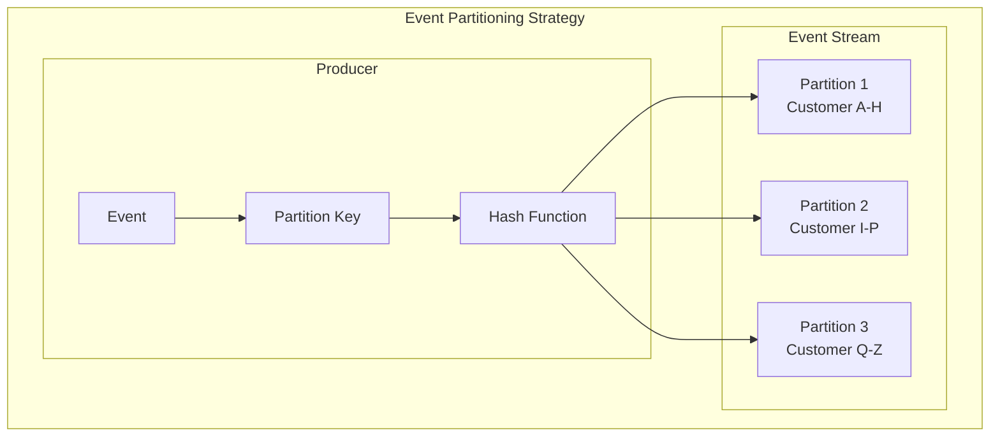

## Event Infrastructure Technologies

### Apache Kafka

**Kafka Architecture**
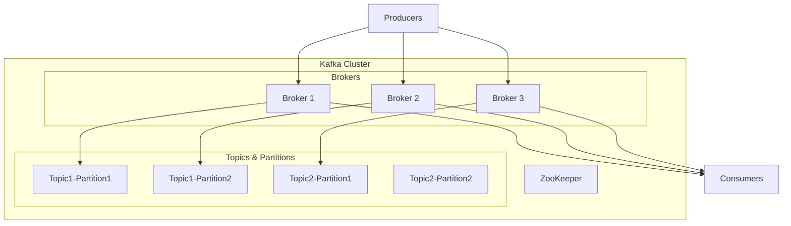

**Kafka Configuration Example**
```properties
# Server Configuration
broker.id=1
listeners=PLAINTEXT://localhost:9092
log.dirs=/var/kafka-logs
num.network.threads=8
num.io.threads=8

# Topic Configuration
num.partitions=3
default.replication.factor=3
min.insync.replicas=2

# Performance Tuning
socket.send.buffer.bytes=102400
socket.receive.buffer.bytes=102400
socket.request.max.bytes=104857600

# Retention Configuration
log.retention.hours=168
log.segment.bytes=1073741824
log.retention.check.interval.ms=300000
```

### AWS EventBridge

**EventBridge Architecture**
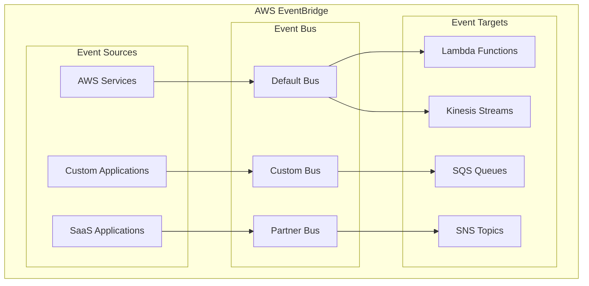

**EventBridge Rule Example**
```json
{
  "Name": "OrderProcessingRule",
  "EventPattern": {
    "source": ["ecommerce.orders"],
    "detail-type": ["Order Placed"],
    "detail": {
      "status": ["pending"],
      "amount": {
        "numeric": [">", 100]
      }
    }
  },
  "Targets": [
    {
      "Id": "1",
      "Arn": "arn:aws:lambda:us-east-1:123456789012:function:ProcessHighValueOrder"
    },
    {
      "Id": "2",
      "Arn": "arn:aws:sqs:us-east-1:123456789012:fraud-detection-queue"
    }
  ]
}
```

### Azure Event Hubs

**Event Hubs Architecture**
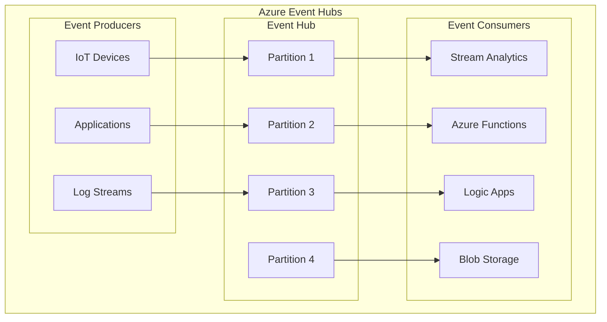

## Challenges and Solutions

### Event Ordering

**Problem: Out-of-Order Events**
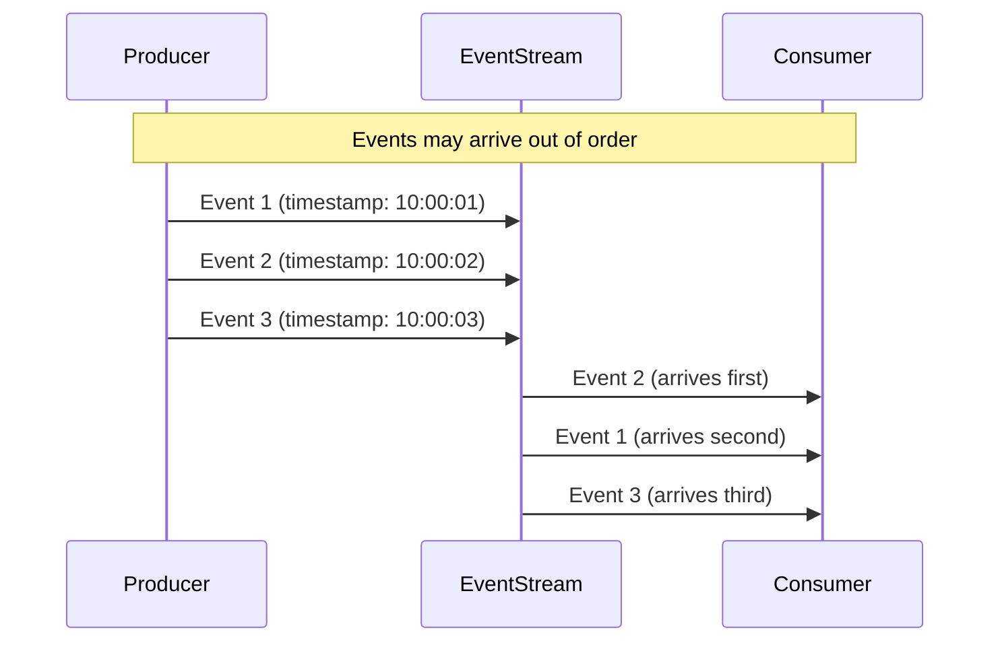

**Solution: Partitioning and Sequence Numbers**
```python
class OrderedEventProcessor:
    def __init__(self):
        self.expected_sequence = {}
        self.buffer = {}
    
    def process_event(self, event):
        partition = event.partition_key
        sequence = event.sequence_number
        
        expected = self.expected_sequence.get(partition, 0) + 1
        
        if sequence == expected:
            # Process in-order event
            self.handle_event(event)
            self.expected_sequence[partition] = sequence
            
            # Check buffer for next events
            self.process_buffered_events(partition)
        else:
            # Buffer out-of-order event
            self.buffer.setdefault(partition, {})[sequence] = event
    
    def process_buffered_events(self, partition):
        expected = self.expected_sequence[partition] + 1
        
        while expected in self.buffer.get(partition, {}):
            event = self.buffer[partition].pop(expected)
            self.handle_event(event)
            self.expected_sequence[partition] = expected
            expected += 1
```

### Event Versioning and Schema Evolution

**Schema Evolution Strategy**
```json
{
  "eventType": "OrderCreated",
  "version": "2.0",
  "data": {
    "orderId": "order-123",
    "customerId": "customer-456",
    "items": [...],
    "totalAmount": 59.98,
    "currency": "USD",  // New field in v2.0
    "shippingAddress": {  // Enhanced in v2.0
      "street": "123 Main St",
      "city": "Anytown",
      "state": "CA",
      "zipCode": "12345",
      "country": "US"  // New field in v2.0
    }
  },
  "metadata": {
    "schemaVersion": "2.0",
    "backwardCompatible": true,
    "deprecatedFields": []
  }
}
```

**Version Handling Code**
```python
class EventVersionHandler:
    def __init__(self):
        self.handlers = {
            "1.0": self.handle_v1,
            "2.0": self.handle_v2
        }
    
    def process_event(self, event):
        version = event.get("version", "1.0")
        handler = self.handlers.get(version)
        
        if not handler:
            raise UnsupportedVersionError(f"Version {version} not supported")
        
        return handler(event)
    
    def handle_v1(self, event):
        # Handle legacy format
        data = event["data"]
        # Convert to internal format
        return self.normalize_event(data)
    
    def handle_v2(self, event):
        # Handle current format
        return event["data"]
    
    def normalize_event(self, data):
        # Convert between versions
        pass
```

### Duplicate Event Handling

**Idempotency Key Pattern**
```python
class IdempotentEventProcessor:
    def __init__(self, redis_client):
        self.redis = redis_client
        self.ttl = 3600  # 1 hour
    
    def process_event(self, event):
        idempotency_key = self.generate_key(event)
        
        # Check if already processed
        if self.redis.exists(idempotency_key):
            return self.redis.get(idempotency_key)
        
        # Process event
        result = self.handle_event(event)
        
        # Store result with TTL
        self.redis.setex(idempotency_key, self.ttl, result)
        
        return result
    
    def generate_key(self, event):
        return f"event:{event['eventId']}:{event['eventType']}"
```

## Summary

### Key Takeaways

**Event-Driven Architecture Strengths**
- **Loose Coupling**: Components communicate without direct dependencies
- **Scalability**: Easy to add new consumers without changing producers
- **Real-time Processing**: Immediate response to business events
- **Resilience**: Failure isolation and graceful degradation
- **Audit Trail**: Complete history of system changes
- **Integration**: Excellent for connecting disparate systems

**EDA Challenges**
- **Complexity**: Distributed system challenges (ordering, consistency, debugging)
- **Event Design**: Schema evolution and backward compatibility
- **Performance**: Network overhead and processing latency
- **Monitoring**: Tracking events across multiple systems
- **Testing**: Integration testing across event boundaries

**When EDA Excels**
- **Real-time Systems**: Applications requiring immediate response to changes
- **Microservices Integration**: Loose coupling between services
- **High-Volume Processing**: Systems handling large numbers of events
- **Complex Workflows**: Multi-step business processes
- **Analytics and Monitoring**: Systems requiring comprehensive audit trails

### Modern EDA Trends

**Event Streaming Platforms**
- **Apache Kafka**: High-throughput, distributed streaming
- **Apache Pulsar**: Multi-tenant, geo-replicated messaging
- **AWS Kinesis**: Managed streaming for real-time analytics

**Serverless Event Processing**
- **AWS Lambda**: Event-driven functions with automatic scaling
- **Azure Functions**: Serverless compute triggered by events
- **Google Cloud Functions**: Event-driven serverless platform

**Event Mesh Architecture**
- **Distributed Event Infrastructure**: Events flow across multiple environments
- **Event Portal**: Centralized discovery and governance
- **Event-Driven APIs**: RESTful APIs enhanced with event capabilities

### Best Practices Summary

**Event Design**
- Use past tense for event names
- Include all necessary context in events
- Design for schema evolution
- Implement idempotency keys

**Processing Patterns**
- Handle duplicate events gracefully
- Implement dead letter queues for failed processing
- Use circuit breakers for resilience
- Monitor event processing metrics

**Infrastructure**
- Choose appropriate event broker for your needs
- Implement proper partitioning strategies
- Plan for event retention and archival
- Set up comprehensive monitoring and alerting

### Next Steps

- **Study Event Sourcing**: Learn how to build systems using events as the source of truth
- **Explore CQRS**: Understand command-query separation patterns
- **Practice Saga Patterns**: Master distributed transaction management
- **Learn Stream Processing**: Apache Kafka, Apache Flink for real-time processing
- **Implement Event-Driven Microservices**: Apply EDA principles in microservices architecture

### Quick Reference

**EDA Decision Checklist**
- ✅ Need for real-time processing and responsiveness
- ✅ Complex business workflows with multiple steps
- ✅ Integration between multiple systems or services
- ✅ Requirements for comprehensive audit trails
- ✅ High-volume data processing needs
- ❌ Simple CRUD applications with minimal integration
- ❌ Strong consistency requirements across all operations
- ❌ Limited team experience with distributed systems
- ❌ Applications with simple, linear workflows
