# Serverless Architecture

## Introduction

Serverless architecture is a cloud computing model where the cloud provider manages the infrastructure, automatically scaling resources based on demand, and charges only for actual usage. Despite the name, servers still exist—they're just abstracted away from developers, who can focus purely on writing business logic without worrying about server management, scaling, or infrastructure provisioning.

Serverless represents a significant shift in how we build and deploy applications, enabling rapid development, automatic scaling, and cost optimization. It's particularly powerful for event-driven applications, APIs, and workloads with variable or unpredictable traffic patterns.

## Key Concepts

### What is Serverless Architecture?

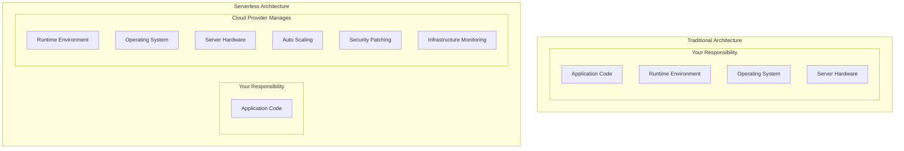

### Core Serverless Principles

**Function as a Service (FaaS)**
- Code runs in stateless compute containers
- Event-driven execution model
- Automatic scaling from zero to thousands of instances
- Pay-per-execution pricing model

**Backend as a Service (BaaS)**
- Managed services for common backend functionality
- Databases, authentication, storage, messaging
- API-driven integration
- No server management required

**Event-Driven Execution**
- Functions triggered by events (HTTP requests, file uploads, database changes)
- Asynchronous and synchronous execution models
- Built-in integration with cloud services

### Serverless vs Traditional Architecture

| Aspect | Traditional | Serverless |
|--------|-------------|------------|
| **Infrastructure Management** | Manual provisioning and scaling | Fully managed by provider |
| **Scaling** | Pre-planned capacity | Automatic, instant scaling |
| **Pricing** | Pay for reserved capacity | Pay per execution |
| **Deployment** | Server/container deployment | Function deployment |
| **State Management** | Persistent server state | Stateless functions |
| **Cold Starts** | Always warm | Cold start latency |
| **Execution Time** | Unlimited | Time-limited (15 minutes max) |

## Serverless Components

### Function as a Service (FaaS)

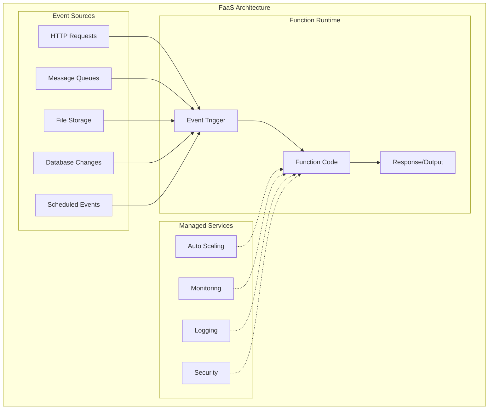

**AWS Lambda Example**
```python
import json
import boto3

def lambda_handler(event, context):
    """
    Process order creation event
    """
    # Parse the incoming event
    order_data = json.loads(event['body'])
    
    # Business logic
    order_id = process_order(order_data)
    
    # Integrate with other services
    send_confirmation_email(order_data['customer_email'], order_id)
    update_inventory(order_data['items'])
    
    # Return response
    return {
        'statusCode': 200,
        'headers': {
            'Content-Type': 'application/json',
            'Access-Control-Allow-Origin': '*'
        },
        'body': json.dumps({
            'orderId': order_id,
            'status': 'created',
            'message': 'Order processed successfully'
        })
    }

def process_order(order_data):
    # Order processing logic
    dynamodb = boto3.resource('dynamodb')
    table = dynamodb.Table('Orders')
    
    order_id = generate_order_id()
    
    table.put_item(
        Item={
            'orderId': order_id,
            'customerId': order_data['customerId'],
            'items': order_data['items'],
            'totalAmount': order_data['totalAmount'],
            'status': 'pending',
            'createdAt': datetime.utcnow().isoformat()
        }
    )
    
    return order_id
```

### Backend as a Service (BaaS)

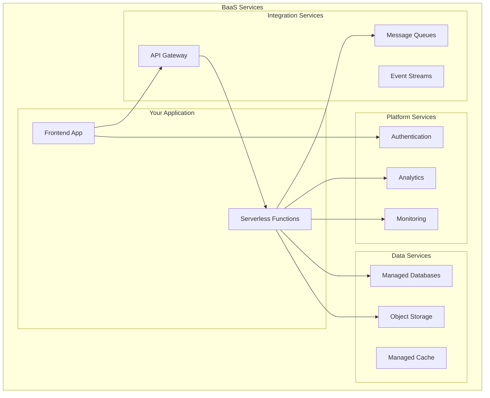

### Serverless Patterns

**API Gateway + Lambda Pattern**
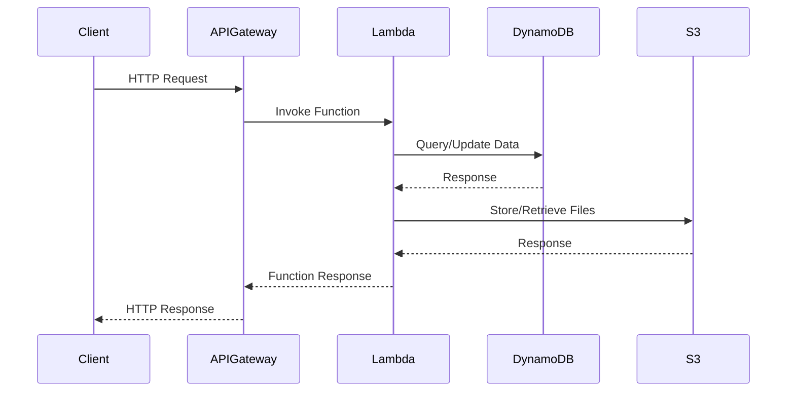

**Event-Driven Processing Pattern**
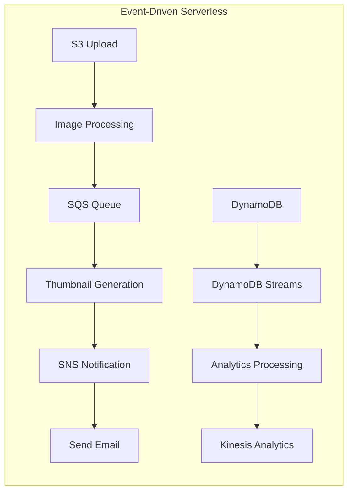

## Real-World Examples

### Netflix Serverless Architecture

**Netflix's Serverless Usage**
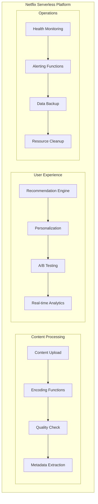

**Netflix Serverless Benefits**
- **Cost Optimization**: Pay only for actual processing time
- **Automatic Scaling**: Handle traffic spikes without pre-provisioning
- **Rapid Development**: Focus on business logic, not infrastructure
- **Fault Isolation**: Function failures don't affect entire system

### Coca-Cola's Serverless Vending Machines

**IoT Serverless Architecture**
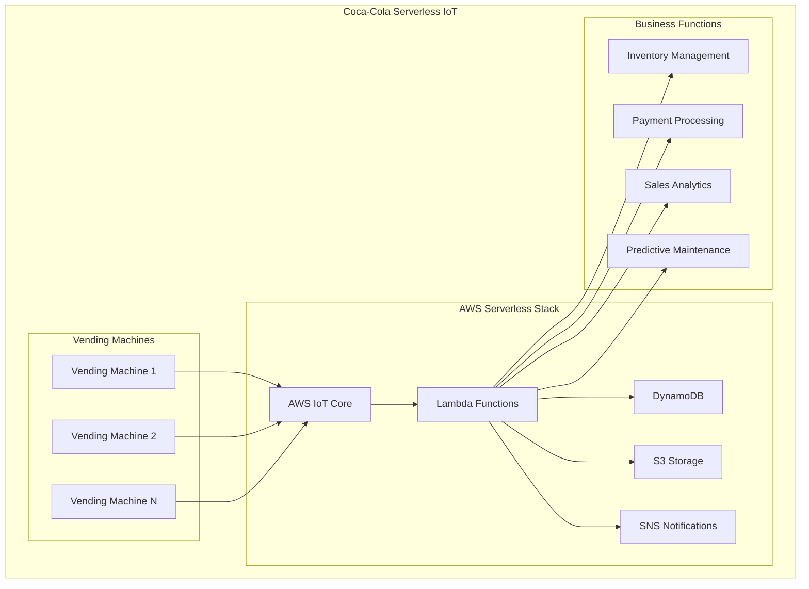

**Serverless Benefits for IoT**
- **Global Scale**: Handle millions of vending machines worldwide
- **Cost Efficiency**: Pay only for actual transactions
- **Real-time Processing**: Immediate response to machine events
- **Maintenance Automation**: Predictive maintenance based on sensor data

### Airbnb's Serverless Data Pipeline

**Data Processing Architecture**
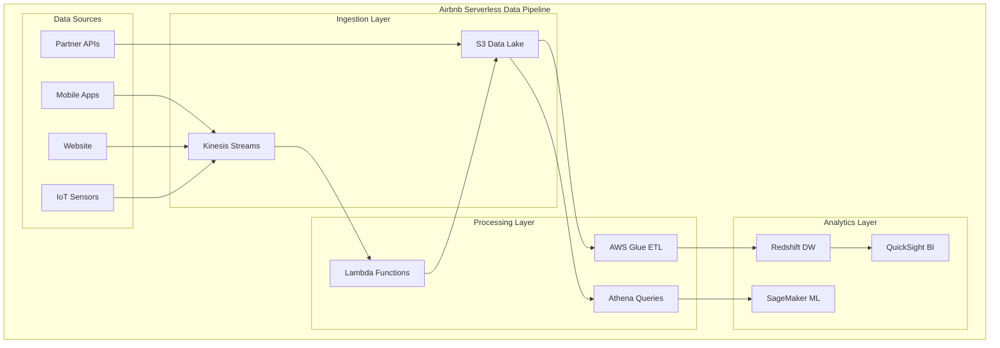

**Serverless Data Benefits**
- **Elastic Processing**: Scale data processing based on volume
- **Cost Optimization**: Pay only for data processed
- **Rapid Experimentation**: Quick deployment of new analytics
- **Managed Infrastructure**: Focus on data insights, not infrastructure

## Best Practices

### Function Design Principles

**Single Responsibility Functions**
```python
# Good: Single responsibility
def resize_image(event, context):
    """Resize uploaded image to multiple sizes"""
    bucket = event['Records'][0]['s3']['bucket']['name']
    key = event['Records'][0]['s3']['object']['key']
    
    # Download image
    image = download_from_s3(bucket, key)
    
    # Resize to different sizes
    sizes = [(150, 150), (300, 300), (800, 600)]
    for width, height in sizes:
        resized = resize(image, width, height)
        upload_to_s3(bucket, f"resized/{width}x{height}/{key}", resized)
    
    return {'statusCode': 200}

# Bad: Multiple responsibilities
def process_user_registration(event, context):
    """Handles user registration, email sending, and analytics"""
    # User registration logic
    user = create_user(event['user_data'])
    
    # Send welcome email
    send_email(user['email'], 'welcome_template')
    
    # Update analytics
    track_event('user_registered', user['id'])
    
    # Generate report
    generate_monthly_report()  # Unrelated responsibility
    
    return user
```

**Stateless Design**
```python
# Good: Stateless function
def calculate_shipping_cost(event, context):
    """Calculate shipping cost based on input parameters"""
    order_data = json.loads(event['body'])
    
    # All data comes from input or external services
    weight = order_data['weight']
    destination = order_data['destination']
    shipping_rates = get_shipping_rates()  # From external service
    
    cost = calculate_cost(weight, destination, shipping_rates)
    
    return {
        'statusCode': 200,
        'body': json.dumps({'shipping_cost': cost})
    }

# Bad: Stateful function
class ShippingCalculator:
    def __init__(self):
        self.cache = {}  # State that persists between invocations
        self.request_count = 0
    
    def calculate(self, event, context):
        self.request_count += 1  # Unreliable in serverless
        # Function logic here
        pass

calculator = ShippingCalculator()  # Global state

def lambda_handler(event, context):
    return calculator.calculate(event, context)
```

### Performance Optimization

**Cold Start Mitigation**
```python
import json
import boto3
from datetime import datetime

# Initialize outside handler for connection reuse
dynamodb = boto3.resource('dynamodb')
table = dynamodb.Table('Orders')

# Global variables for caching
SHIPPING_RATES = None
LAST_CACHE_UPDATE = None
CACHE_TTL = 300  # 5 minutes

def lambda_handler(event, context):
    """Optimized function with connection reuse and caching"""
    
    # Reuse cached data if still valid
    global SHIPPING_RATES, LAST_CACHE_UPDATE
    
    now = datetime.utcnow()
    if (SHIPPING_RATES is None or 
        LAST_CACHE_UPDATE is None or 
        (now - LAST_CACHE_UPDATE).seconds > CACHE_TTL):
        
        SHIPPING_RATES = fetch_shipping_rates()
        LAST_CACHE_UPDATE = now
    
    # Process request using cached data and reused connections
    order_data = json.loads(event['body'])
    
    # Use pre-initialized DynamoDB connection
    result = table.put_item(Item=order_data)
    
    return {
        'statusCode': 200,
        'body': json.dumps({'success': True})
    }

def fetch_shipping_rates():
    """Fetch shipping rates from external service"""
    # Implementation here
    pass
```

**Memory and Timeout Configuration**
```yaml
# AWS SAM Template
Resources:
  OrderProcessingFunction:
    Type: AWS::Serverless::Function
    Properties:
      CodeUri: src/
      Handler: order_processor.lambda_handler
      Runtime: python3.9
      MemorySize: 512  # Optimize based on profiling
      Timeout: 30      # Set appropriate timeout
      ReservedConcurrencyLimit: 100  # Control concurrency
      Environment:
        Variables:
          TABLE_NAME: !Ref OrdersTable
          CACHE_TTL: 300
      Events:
        ApiEvent:
          Type: Api
          Properties:
            Path: /orders
            Method: post
```

### Error Handling and Resilience

**Retry and Dead Letter Queue Pattern**
```python
import json
import boto3
from botocore.exceptions import ClientError

def lambda_handler(event, context):
    """Function with comprehensive error handling"""
    
    try:
        # Process the event
        result = process_order(event)
        
        return {
            'statusCode': 200,
            'body': json.dumps(result)
        }
        
    except ValidationError as e:
        # Client error - don't retry
        logger.error(f"Validation error: {str(e)}")
        return {
            'statusCode': 400,
            'body': json.dumps({'error': 'Invalid input data'})
        }
        
    except ClientError as e:
        # AWS service error - might be retryable
        error_code = e.response['Error']['Code']
        
        if error_code in ['ThrottlingException', 'ServiceUnavailable']:
            # Retryable error - let Lambda retry
            logger.warning(f"Retryable error: {error_code}")
            raise e
        else:
            # Non-retryable error
            logger.error(f"AWS service error: {error_code}")
            return {
                'statusCode': 500,
                'body': json.dumps({'error': 'Service temporarily unavailable'})
            }
            
    except Exception as e:
        # Unexpected error - log and return generic error
        logger.error(f"Unexpected error: {str(e)}", exc_info=True)
        return {
            'statusCode': 500,
            'body': json.dumps({'error': 'Internal server error'})
        }

def process_order(event):
    """Order processing logic with validation"""
    order_data = json.loads(event['body'])
    
    # Validate input
    if not order_data.get('customerId'):
        raise ValidationError("Customer ID is required")
    
    # Process order
    # Implementation here
    
    return {'orderId': 'order-123', 'status': 'created'}

class ValidationError(Exception):
    pass
```

**Circuit Breaker Pattern**
```python
import time
from enum import Enum

class CircuitState(Enum):
    CLOSED = "closed"
    OPEN = "open"
    HALF_OPEN = "half_open"

class CircuitBreaker:
    def __init__(self, failure_threshold=5, timeout=60):
        self.failure_threshold = failure_threshold
        self.timeout = timeout
        self.failure_count = 0
        self.last_failure_time = None
        self.state = CircuitState.CLOSED
    
    def call(self, func, *args, **kwargs):
        if self.state == CircuitState.OPEN:
            if time.time() - self.last_failure_time > self.timeout:
                self.state = CircuitState.HALF_OPEN
            else:
                raise Exception("Circuit breaker is OPEN")
        
        try:
            result = func(*args, **kwargs)
            self.on_success()
            return result
        except Exception as e:
            self.on_failure()
            raise e
    
    def on_success(self):
        self.failure_count = 0
        self.state = CircuitState.CLOSED
    
    def on_failure(self):
        self.failure_count += 1
        self.last_failure_time = time.time()
        
        if self.failure_count >= self.failure_threshold:
            self.state = CircuitState.OPEN

# Usage in Lambda function
external_service_breaker = CircuitBreaker(failure_threshold=3, timeout=30)

def lambda_handler(event, context):
    try:
        result = external_service_breaker.call(call_external_service, event['data'])
        return {'statusCode': 200, 'body': json.dumps(result)}
    except Exception as e:
        return {'statusCode': 503, 'body': json.dumps({'error': 'Service unavailable'})}
```

### Security Best Practices

**IAM Least Privilege**
```yaml
# AWS SAM Template - Minimal IAM permissions
Resources:
  OrderProcessingFunction:
    Type: AWS::Serverless::Function
    Properties:
      # Function configuration
      Policies:
        - DynamoDBCrudPolicy:
            TableName: !Ref OrdersTable
        - S3ReadPolicy:
            BucketName: !Ref ConfigBucket
        - SNSPublishMessagePolicy:
            TopicName: !Ref OrderNotificationTopic
        - Version: "2012-10-17"
          Statement:
            - Effect: Allow
              Action:
                - logs:CreateLogGroup
                - logs:CreateLogStream
                - logs:PutLogEvents
              Resource: !Sub "arn:aws:logs:${AWS::Region}:${AWS::AccountId}:*"
```

**Environment Variable Encryption**
```python
import boto3
import os
from botocore.exceptions import ClientError

def get_secret(secret_name):
    """Retrieve secret from AWS Secrets Manager"""
    session = boto3.session.Session()
    client = session.client('secretsmanager')
    
    try:
        response = client.get_secret_value(SecretId=secret_name)
        return response['SecretString']
    except ClientError as e:
        logger.error(f"Error retrieving secret: {e}")
        raise e

def lambda_handler(event, context):
    # Get encrypted configuration
    db_password = get_secret(os.environ['DB_PASSWORD_SECRET'])
    api_key = get_secret(os.environ['API_KEY_SECRET'])
    
    # Use secrets in application logic
    # Implementation here
```

## Serverless Challenges and Solutions

### Cold Start Latency

**Problem Analysis**
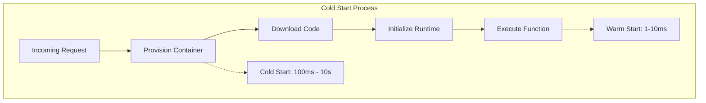

**Mitigation Strategies**
```python
# 1. Provisioned Concurrency (AWS Lambda)
# Keep functions warm with reserved capacity

# 2. Connection Pooling
import pymongo
from pymongo import MongoClient

# Initialize outside handler
client = MongoClient(os.environ['MONGODB_URI'])
db = client.get_database()

def lambda_handler(event, context):
    # Reuse existing connection
    collection = db.orders
    result = collection.insert_one(event['data'])
    return {'id': str(result.inserted_id)}

# 3. Lightweight Dependencies
# Use minimal libraries and lazy loading
def lambda_handler(event, context):
    # Import only when needed
    if event.get('type') == 'image_processing':
        from PIL import Image  # Heavy import only when needed
        return process_image(event)
    else:
        return process_text(event)
```

### State Management

**External State Storage**
```python
import redis
import json

# Redis for session state
redis_client = redis.Redis(
    host=os.environ['REDIS_HOST'],
    port=6379,
    decode_responses=True
)

def lambda_handler(event, context):
    session_id = event['headers'].get('session-id')
    
    # Retrieve state
    state = redis_client.get(f"session:{session_id}")
    if state:
        state = json.loads(state)
    else:
        state = {'step': 1, 'data': {}}
    
    # Process request and update state
    state = process_step(event, state)
    
    # Save updated state
    redis_client.setex(
        f"session:{session_id}",
        3600,  # 1 hour TTL
        json.dumps(state)
    )
    
    return {
        'statusCode': 200,
        'body': json.dumps({'next_step': state['step']})
    }
```

### Monitoring and Debugging

**Comprehensive Observability**
```python
import json
import time
import uuid
from aws_lambda_powertools import Logger, Tracer, Metrics
from aws_lambda_powertools.metrics import MetricUnit

# Initialize observability tools
logger = Logger()
tracer = Tracer()
metrics = Metrics()

@tracer.capture_lambda_handler
@logger.inject_lambda_context
@metrics.log_metrics
def lambda_handler(event, context):
    # Generate correlation ID
    correlation_id = str(uuid.uuid4())
    logger.info("Processing request", extra={"correlation_id": correlation_id})
    
    start_time = time.time()
    
    try:
        # Add custom metrics
        metrics.add_metric(name="OrderProcessingStarted", unit=MetricUnit.Count, value=1)
        
        # Process the order
        with tracer.subsegment("process_order"):
            result = process_order(event, correlation_id)
        
        # Record success metrics
        processing_time = time.time() - start_time
        metrics.add_metric(name="ProcessingTime", unit=MetricUnit.Seconds, value=processing_time)
        metrics.add_metric(name="OrderProcessingSuccess", unit=MetricUnit.Count, value=1)
        
        logger.info("Order processed successfully", 
                   extra={"correlation_id": correlation_id, "processing_time": processing_time})
        
        return {
            'statusCode': 200,
            'headers': {'X-Correlation-ID': correlation_id},
            'body': json.dumps(result)
        }
        
    except Exception as e:
        # Record error metrics
        metrics.add_metric(name="OrderProcessingError", unit=MetricUnit.Count, value=1)
        
        logger.error("Order processing failed", 
                    extra={"correlation_id": correlation_id, "error": str(e)})
        
        return {
            'statusCode': 500,
            'headers': {'X-Correlation-ID': correlation_id},
            'body': json.dumps({'error': 'Processing failed'})
        }

@tracer.capture_method
def process_order(event, correlation_id):
    """Process order with distributed tracing"""
    logger.info("Starting order processing", extra={"correlation_id": correlation_id})
    
    # Add custom annotations for tracing
    tracer.put_annotation("order_id", event.get('order_id'))
    tracer.put_metadata("order_data", event)
    
    # Processing logic here
    return {'order_id': event.get('order_id'), 'status': 'processed'}
```

## Serverless Platforms Comparison

### AWS Serverless Stack

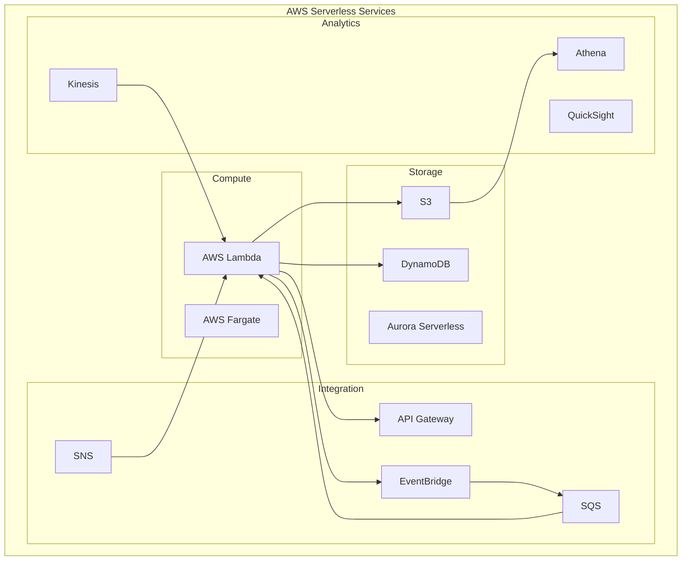

### Azure Serverless Stack

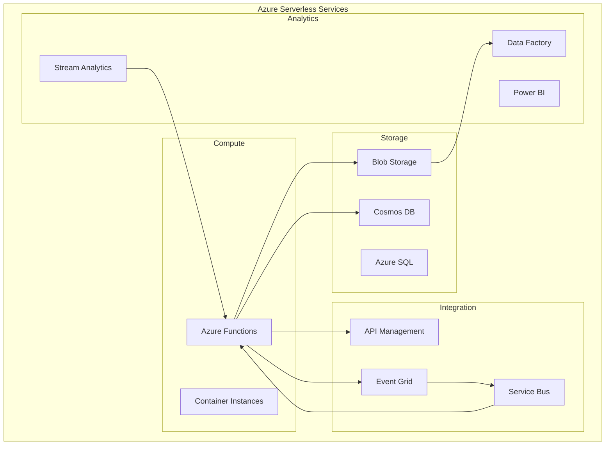

### Google Cloud Serverless Stack

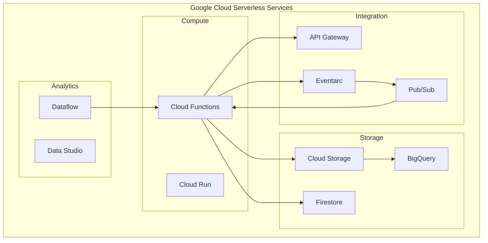

## Summary

### Key Takeaways

**Serverless Architecture Strengths**
- **No Infrastructure Management**: Focus purely on business logic
- **Automatic Scaling**: Scale from zero to thousands of instances instantly
- **Cost Optimization**: Pay only for actual execution time and resources used
- **Rapid Development**: Faster time-to-market with managed services
- **Built-in Resilience**: Automatic failover and fault tolerance
- **Event-Driven**: Natural fit for event-driven and reactive architectures

**Serverless Limitations**
- **Cold Start Latency**: Initial invocation delay for new instances
- **Execution Time Limits**: Maximum execution time (typically 15 minutes)
- **Vendor Lock-in**: Tight coupling to cloud provider services
- **Limited Control**: Less control over runtime environment and optimization
- **Debugging Complexity**: Distributed system debugging challenges
- **State Management**: Stateless nature requires external state storage

**When Serverless Excels**
- **Variable Workloads**: Applications with unpredictable or spiky traffic
- **Event-Driven Processing**: File processing, data transformation, webhooks
- **Rapid Prototyping**: Quick development and deployment of new features
- **Microservices**: Small, focused services with clear boundaries
- **Integration**: Connecting different systems and services
- **Cost-Sensitive Applications**: Applications where cost optimization is critical

### Serverless Adoption Strategy

**Migration Approach**
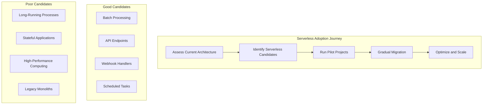

**Best Practices Summary**
- **Start Small**: Begin with simple, stateless functions
- **Design for Failure**: Implement proper error handling and retry logic
- **Monitor Everything**: Use comprehensive observability tools
- **Optimize for Cold Starts**: Minimize dependencies and initialization time
- **Security First**: Apply least privilege principles and encrypt sensitive data
- **Cost Management**: Monitor usage and optimize function configuration

### Modern Serverless Trends

**Serverless Containers**
- **AWS Fargate**: Serverless container platform
- **Google Cloud Run**: Fully managed container platform
- **Azure Container Instances**: Serverless container service

**Edge Computing**
- **AWS Lambda@Edge**: Run functions at CloudFront edge locations
- **Cloudflare Workers**: Serverless functions at the edge
- **Azure Functions**: Edge computing capabilities

**Multi-Cloud Serverless**
- **Serverless Framework**: Deploy to multiple cloud providers
- **Knative**: Kubernetes-based serverless platform
- **OpenFaaS**: Open-source serverless framework

### Next Steps

- **Practice Function Development**: Build simple serverless functions
- **Learn Cloud Provider Services**: Master AWS Lambda, Azure Functions, or Google Cloud Functions
- **Study Event-Driven Patterns**: Understand how to design event-driven serverless applications
- **Explore Serverless Frameworks**: Learn tools like Serverless Framework, SAM, or Terraform
- **Implement Observability**: Practice monitoring and debugging serverless applications

### Quick Reference

**Serverless Decision Checklist**
- ✅ Variable or unpredictable traffic patterns
- ✅ Event-driven processing requirements
- ✅ Need for rapid development and deployment
- ✅ Cost optimization is a priority
- ✅ Stateless application design
- ✅ Integration with cloud services
- ❌ Long-running processes (> 15 minutes)
- ❌ High-performance computing requirements
- ❌ Need for persistent connections or state
- ❌ Strict latency requirements (< 10ms)
- ❌ Complex deployment and configuration needs
