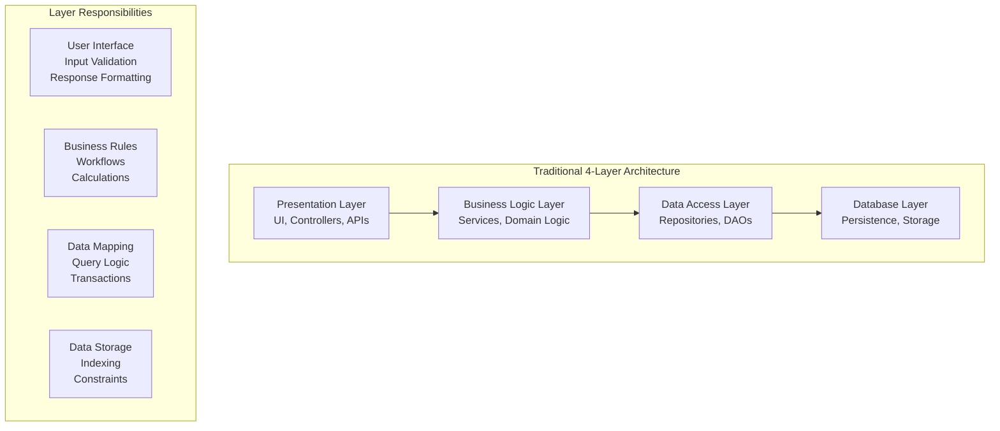
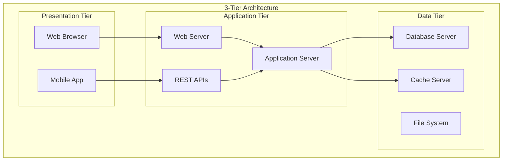
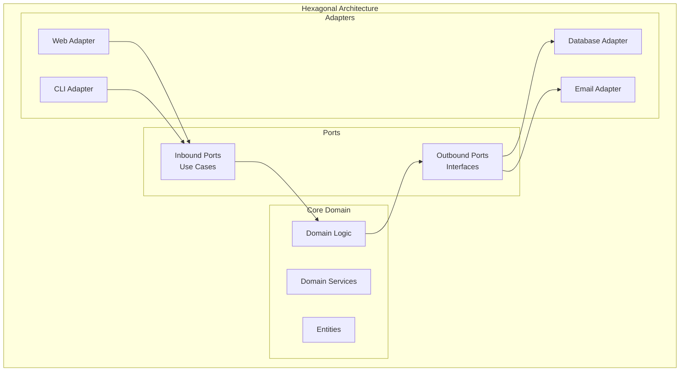
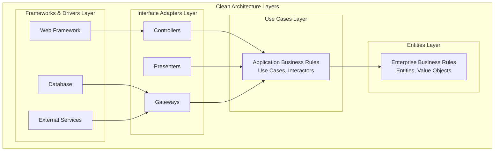
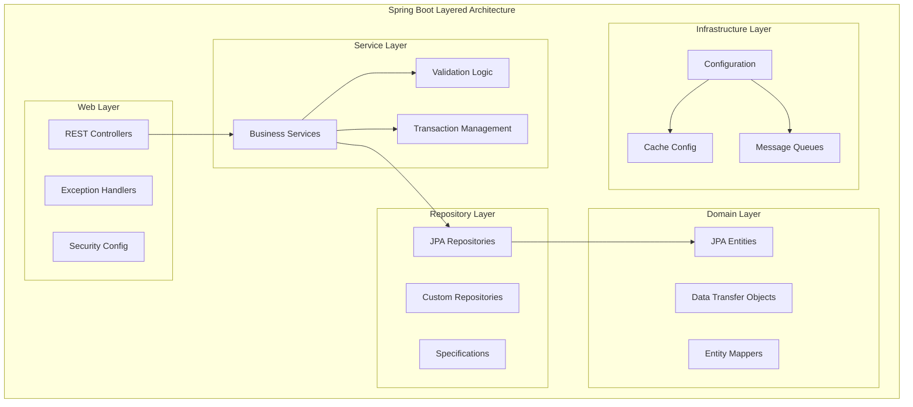
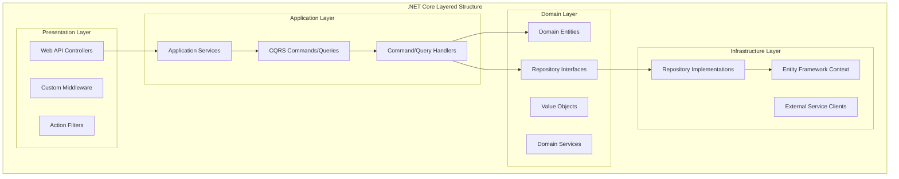

# Layered Architecture & Separation of Concerns

## Introduction

Layered architecture is a fundamental design pattern that organizes code into horizontal layers, where each layer has a specific responsibility and communicates only with adjacent layers. This pattern promotes separation of concerns, making applications more maintainable, testable, and scalable. It's one of the most widely used architectural patterns and forms the foundation for many other architectural styles.

The layered approach helps manage complexity by breaking down applications into distinct layers such as presentation, business logic, data access, and infrastructure. Each layer encapsulates specific functionality and provides a clear interface to other layers, enabling teams to work independently and modify layers without affecting the entire system.

## Key Concepts

### What is Layered Architecture?



### Core Principles

**Separation of Concerns**
- Each layer has a single, well-defined responsibility
- Changes in one layer don't affect other layers
- Clear boundaries between different aspects of the application

**Dependency Direction**
- Higher layers depend on lower layers
- Lower layers are independent of higher layers
- Dependencies flow downward through the architecture

**Abstraction Levels**
- Each layer provides a higher level of abstraction
- Implementation details are hidden from upper layers
- Interfaces define contracts between layers

### Layer Types and Responsibilities

**Presentation Layer**
```typescript
// Example: Express.js Controller
class OrderController {
    constructor(private orderService: OrderService) {}
    
    async createOrder(req: Request, res: Response) {
        try {
            // Input validation
            const orderData = this.validateOrderInput(req.body);
            
            // Delegate to business layer
            const order = await this.orderService.createOrder(orderData);
            
            // Format response
            res.status(201).json({
                success: true,
                data: this.formatOrderResponse(order)
            });
        } catch (error) {
            // Error handling
            res.status(400).json({
                success: false,
                error: error.message
            });
        }
    }
    
    private validateOrderInput(data: any): CreateOrderRequest {
        // Validation logic
        if (!data.customerId) {
            throw new Error('Customer ID is required');
        }
        return data as CreateOrderRequest;
    }
    
    private formatOrderResponse(order: Order): OrderResponse {
        // Response formatting
        return {
            id: order.id,
            status: order.status,
            total: order.total,
            createdAt: order.createdAt.toISOString()
        };
    }
}
```

**Business Logic Layer**
```typescript
// Example: Business Service
class OrderService {
    constructor(
        private orderRepository: OrderRepository,
        private inventoryService: InventoryService,
        private paymentService: PaymentService
    ) {}
    
    async createOrder(orderData: CreateOrderRequest): Promise<Order> {
        // Business rule: Validate inventory
        await this.validateInventory(orderData.items);
        
        // Business rule: Calculate totals
        const total = this.calculateOrderTotal(orderData.items);
        
        // Business rule: Apply discounts
        const discountedTotal = this.applyDiscounts(total, orderData.customerId);
        
        // Create order entity
        const order = new Order({
            customerId: orderData.customerId,
            items: orderData.items,
            total: discountedTotal,
            status: OrderStatus.PENDING
        });
        
        // Persist order
        const savedOrder = await this.orderRepository.save(order);
        
        // Business workflow: Process payment
        await this.paymentService.processPayment(savedOrder.id, discountedTotal);
        
        return savedOrder;
    }
    
    private async validateInventory(items: OrderItem[]): Promise<void> {
        for (const item of items) {
            const available = await this.inventoryService.checkAvailability(item.productId);
            if (available < item.quantity) {
                throw new Error(`Insufficient inventory for product ${item.productId}`);
            }
        }
    }
    
    private calculateOrderTotal(items: OrderItem[]): number {
        return items.reduce((total, item) => total + (item.price * item.quantity), 0);
    }
    
    private applyDiscounts(total: number, customerId: string): number {
        // Business logic for discount calculation
        // Could involve customer tier, promotional codes, etc.
        return total;
    }
}
```

**Data Access Layer**
```typescript
// Example: Repository Pattern
interface OrderRepository {
    save(order: Order): Promise<Order>;
    findById(id: string): Promise<Order | null>;
    findByCustomerId(customerId: string): Promise<Order[]>;
    update(order: Order): Promise<Order>;
    delete(id: string): Promise<void>;
}

class SqlOrderRepository implements OrderRepository {
    constructor(private db: Database) {}
    
    async save(order: Order): Promise<Order> {
        const query = `
            INSERT INTO orders (id, customer_id, items, total, status, created_at)
            VALUES ($1, $2, $3, $4, $5, $6)
            RETURNING *
        `;
        
        const result = await this.db.query(query, [
            order.id,
            order.customerId,
            JSON.stringify(order.items),
            order.total,
            order.status,
            order.createdAt
        ]);
        
        return this.mapRowToOrder(result.rows[0]);
    }
    
    async findById(id: string): Promise<Order | null> {
        const query = 'SELECT * FROM orders WHERE id = $1';
        const result = await this.db.query(query, [id]);
        
        if (result.rows.length === 0) {
            return null;
        }
        
        return this.mapRowToOrder(result.rows[0]);
    }
    
    private mapRowToOrder(row: any): Order {
        return new Order({
            id: row.id,
            customerId: row.customer_id,
            items: JSON.parse(row.items),
            total: row.total,
            status: row.status,
            createdAt: row.created_at
        });
    }
}
```

## Architecture Variations

### Traditional N-Tier Architecture



### Hexagonal Architecture (Ports and Adapters)



### Clean Architecture



## Real-World Examples

### Spring Boot Layered Application

**Spring Boot E-commerce Architecture**


**Spring Boot Implementation Example**
```java
// Controller Layer
@RestController
@RequestMapping("/api/orders")
@Validated
public class OrderController {
    
    private final OrderService orderService;
    
    public OrderController(OrderService orderService) {
        this.orderService = orderService;
    }
    
    @PostMapping
    public ResponseEntity<OrderResponse> createOrder(
            @Valid @RequestBody CreateOrderRequest request) {
        
        Order order = orderService.createOrder(request);
        OrderResponse response = OrderMapper.toResponse(order);
        
        return ResponseEntity.status(HttpStatus.CREATED).body(response);
    }
    
    @GetMapping("/{id}")
    public ResponseEntity<OrderResponse> getOrder(@PathVariable String id) {
        Order order = orderService.findById(id);
        OrderResponse response = OrderMapper.toResponse(order);
        
        return ResponseEntity.ok(response);
    }
}

// Service Layer
@Service
@Transactional
public class OrderService {
    
    private final OrderRepository orderRepository;
    private final InventoryService inventoryService;
    private final PaymentService paymentService;
    
    public OrderService(OrderRepository orderRepository,
                       InventoryService inventoryService,
                       PaymentService paymentService) {
        this.orderRepository = orderRepository;
        this.inventoryService = inventoryService;
        this.paymentService = paymentService;
    }
    
    public Order createOrder(CreateOrderRequest request) {
        // Validate business rules
        validateOrderRequest(request);
        
        // Check inventory
        inventoryService.validateAvailability(request.getItems());
        
        // Create order entity
        Order order = Order.builder()
            .customerId(request.getCustomerId())
            .items(request.getItems())
            .status(OrderStatus.PENDING)
            .total(calculateTotal(request.getItems()))
            .build();
        
        // Save order
        Order savedOrder = orderRepository.save(order);
        
        // Process payment asynchronously
        paymentService.processPaymentAsync(savedOrder.getId(), savedOrder.getTotal());
        
        return savedOrder;
    }
    
    @Transactional(readOnly = true)
    public Order findById(String id) {
        return orderRepository.findById(id)
            .orElseThrow(() -> new OrderNotFoundException("Order not found: " + id));
    }
    
    private void validateOrderRequest(CreateOrderRequest request) {
        if (request.getItems().isEmpty()) {
            throw new InvalidOrderException("Order must contain at least one item");
        }
    }
    
    private BigDecimal calculateTotal(List<OrderItem> items) {
        return items.stream()
            .map(item -> item.getPrice().multiply(BigDecimal.valueOf(item.getQuantity())))
            .reduce(BigDecimal.ZERO, BigDecimal::add);
    }
}

// Repository Layer
@Repository
public interface OrderRepository extends JpaRepository<Order, String> {
    
    List<Order> findByCustomerIdOrderByCreatedAtDesc(String customerId);
    
    List<Order> findByStatusAndCreatedAtBefore(OrderStatus status, LocalDateTime before);
    
    @Query("SELECT o FROM Order o WHERE o.total > :amount")
    List<Order> findHighValueOrders(@Param("amount") BigDecimal amount);
}

// Entity Layer
@Entity
@Table(name = "orders")
@Builder
@Data
@NoArgsConstructor
@AllArgsConstructor
public class Order {
    
    @Id
    private String id;
    
    @Column(name = "customer_id", nullable = false)
    private String customerId;
    
    @ElementCollection
    @CollectionTable(name = "order_items", joinColumns = @JoinColumn(name = "order_id"))
    private List<OrderItem> items;
    
    @Column(nullable = false, precision = 10, scale = 2)
    private BigDecimal total;
    
    @Enumerated(EnumType.STRING)
    @Column(nullable = false)
    private OrderStatus status;
    
    @CreationTimestamp
    @Column(name = "created_at")
    private LocalDateTime createdAt;
    
    @UpdateTimestamp
    @Column(name = "updated_at")
    private LocalDateTime updatedAt;
}
```

### .NET Core Layered Architecture

**.NET Core Clean Architecture**


**Implementation Example**
```csharp
// Controller (Presentation Layer)
[ApiController]
[Route("api/[controller]")]
public class OrdersController : ControllerBase
{
    private readonly IMediator _mediator;
    
    public OrdersController(IMediator mediator)
    {
        _mediator = mediator;
    }
    
    [HttpPost]
    public async Task<ActionResult<OrderResponse>> CreateOrder(
        [FromBody] CreateOrderCommand command)
    {
        var result = await _mediator.Send(command);
        return CreatedAtAction(nameof(GetOrder), new { id = result.Id }, result);
    }
    
    [HttpGet("{id}")]
    public async Task<ActionResult<OrderResponse>> GetOrder(Guid id)
    {
        var query = new GetOrderQuery { Id = id };
        var result = await _mediator.Send(query);
        return Ok(result);
    }
}

// Command Handler (Application Layer)
public class CreateOrderCommandHandler : IRequestHandler<CreateOrderCommand, OrderResponse>
{
    private readonly IOrderRepository _orderRepository;
    private readonly IInventoryService _inventoryService;
    private readonly IUnitOfWork _unitOfWork;
    
    public CreateOrderCommandHandler(
        IOrderRepository orderRepository,
        IInventoryService inventoryService,
        IUnitOfWork unitOfWork)
    {
        _orderRepository = orderRepository;
        _inventoryService = inventoryService;
        _unitOfWork = unitOfWork;
    }
    
    public async Task<OrderResponse> Handle(CreateOrderCommand request, CancellationToken cancellationToken)
    {
        // Validate inventory
        await _inventoryService.ValidateAvailabilityAsync(request.Items);
        
        // Create domain entity
        var order = Order.Create(
            customerId: request.CustomerId,
            items: request.Items.Select(i => OrderItem.Create(i.ProductId, i.Quantity, i.Price)).ToList()
        );
        
        // Save to repository
        await _orderRepository.AddAsync(order);
        await _unitOfWork.SaveChangesAsync();
        
        // Return response
        return new OrderResponse
        {
            Id = order.Id,
            CustomerId = order.CustomerId,
            Total = order.Total,
            Status = order.Status.ToString(),
            CreatedAt = order.CreatedAt
        };
    }
}

// Domain Entity (Domain Layer)
public class Order : AggregateRoot
{
    public Guid Id { get; private set; }
    public string CustomerId { get; private set; }
    public OrderStatus Status { get; private set; }
    public decimal Total { get; private set; }
    public DateTime CreatedAt { get; private set; }
    
    private readonly List<OrderItem> _items = new();
    public IReadOnlyCollection<OrderItem> Items => _items.AsReadOnly();
    
    private Order() { } // EF Constructor
    
    public static Order Create(string customerId, List<OrderItem> items)
    {
        if (string.IsNullOrEmpty(customerId))
            throw new ArgumentException("Customer ID is required", nameof(customerId));
        
        if (!items.Any())
            throw new ArgumentException("Order must contain at least one item", nameof(items));
        
        var order = new Order
        {
            Id = Guid.NewGuid(),
            CustomerId = customerId,
            Status = OrderStatus.Pending,
            CreatedAt = DateTime.UtcNow
        };
        
        order._items.AddRange(items);
        order.Total = order.CalculateTotal();
        
        // Domain event
        order.AddDomainEvent(new OrderCreatedEvent(order.Id, order.CustomerId));
        
        return order;
    }
    
    private decimal CalculateTotal()
    {
        return _items.Sum(item => item.Price * item.Quantity);
    }
    
    public void UpdateStatus(OrderStatus newStatus)
    {
        if (Status == newStatus) return;
        
        var previousStatus = Status;
        Status = newStatus;
        
        AddDomainEvent(new OrderStatusChangedEvent(Id, previousStatus, newStatus));
    }
}

// Repository Implementation (Infrastructure Layer)
public class OrderRepository : IOrderRepository
{
    private readonly ApplicationDbContext _context;
    
    public OrderRepository(ApplicationDbContext context)
    {
        _context = context;
    }
    
    public async Task<Order> GetByIdAsync(Guid id)
    {
        return await _context.Orders
            .Include(o => o.Items)
            .FirstOrDefaultAsync(o => o.Id == id);
    }
    
    public async Task AddAsync(Order order)
    {
        await _context.Orders.AddAsync(order);
    }
    
    public void Update(Order order)
    {
        _context.Orders.Update(order);
    }
    
    public async Task<List<Order>> GetByCustomerIdAsync(string customerId)
    {
        return await _context.Orders
            .Where(o => o.CustomerId == customerId)
            .OrderByDescending(o => o.CreatedAt)
            .ToListAsync();
    }
}
```

## Best Practices

### Layer Design Principles

**Single Responsibility Principle**
```typescript
// Good: Each layer has a single responsibility
class OrderController {
    // Only handles HTTP concerns
    async createOrder(req: Request, res: Response) {
        const orderData = this.validateInput(req.body);
        const order = await this.orderService.createOrder(orderData);
        res.json(this.formatResponse(order));
    }
}

class OrderService {
    // Only handles business logic
    async createOrder(orderData: CreateOrderRequest): Promise<Order> {
        this.validateBusinessRules(orderData);
        const order = this.buildOrder(orderData);
        return await this.orderRepository.save(order);
    }
}

class OrderRepository {
    // Only handles data access
    async save(order: Order): Promise<Order> {
        const query = 'INSERT INTO orders...';
        const result = await this.db.query(query, order);
        return this.mapToEntity(result);
    }
}

// Bad: Mixed responsibilities
class OrderController {
    async createOrder(req: Request, res: Response) {
        // HTTP validation
        if (!req.body.customerId) {
            return res.status(400).json({error: 'Customer ID required'});
        }
        
        // Business logic (should be in service layer)
        const total = req.body.items.reduce((sum, item) => sum + item.price, 0);
        
        // Data access (should be in repository layer)
        const query = 'INSERT INTO orders (customer_id, total) VALUES ($1, $2)';
        const result = await this.db.query(query, [req.body.customerId, total]);
        
        res.json(result);
    }
}
```

**Dependency Inversion**
```typescript
// Good: Depend on abstractions
interface OrderRepository {
    save(order: Order): Promise<Order>;
    findById(id: string): Promise<Order | null>;
}

class OrderService {
    constructor(private orderRepository: OrderRepository) {}
    
    async createOrder(orderData: CreateOrderRequest): Promise<Order> {
        // Business logic using abstraction
        const order = new Order(orderData);
        return await this.orderRepository.save(order);
    }
}

class SqlOrderRepository implements OrderRepository {
    async save(order: Order): Promise<Order> {
        // SQL implementation
    }
    
    async findById(id: string): Promise<Order | null> {
        // SQL implementation
    }
}

class MongoOrderRepository implements OrderRepository {
    async save(order: Order): Promise<Order> {
        // MongoDB implementation
    }
    
    async findById(id: string): Promise<Order | null> {
        // MongoDB implementation
    }
}

// Bad: Depend on concretions
class OrderService {
    constructor(private sqlDatabase: SqlDatabase) {}
    
    async createOrder(orderData: CreateOrderRequest): Promise<Order> {
        // Tightly coupled to SQL database
        const query = 'INSERT INTO orders...';
        return await this.sqlDatabase.query(query, orderData);
    }
}
```

### Error Handling Across Layers

**Layered Error Handling Strategy**
```typescript
// Domain Layer - Business Errors
class DomainError extends Error {
    constructor(message: string) {
        super(message);
        this.name = 'DomainError';
    }
}

class InsufficientInventoryError extends DomainError {
    constructor(productId: string, requested: number, available: number) {
        super(`Insufficient inventory for product ${productId}. Requested: ${requested}, Available: ${available}`);
    }
}

// Application Layer - Use Case Errors
class ApplicationError extends Error {
    constructor(message: string) {
        super(message);
        this.name = 'ApplicationError';
    }
}

class OrderNotFoundError extends ApplicationError {
    constructor(orderId: string) {
        super(`Order not found: ${orderId}`);
    }
}

// Infrastructure Layer - Technical Errors
class InfrastructureError extends Error {
    constructor(message: string, public readonly cause?: Error) {
        super(message);
        this.name = 'InfrastructureError';
    }
}

class DatabaseConnectionError extends InfrastructureError {
    constructor(cause: Error) {
        super('Database connection failed', cause);
    }
}

// Service Layer - Error Translation
class OrderService {
    async createOrder(orderData: CreateOrderRequest): Promise<Order> {
        try {
            // Business validation
            await this.validateInventory(orderData.items);
            
            // Create and save order
            const order = new Order(orderData);
            return await this.orderRepository.save(order);
            
        } catch (error) {
            if (error instanceof InfrastructureError) {
                // Log technical error and throw application error
                this.logger.error('Infrastructure error during order creation', error);
                throw new ApplicationError('Order creation temporarily unavailable');
            }
            
            // Re-throw domain errors as-is
            throw error;
        }
    }
}

// Presentation Layer - Error Response
class OrderController {
    async createOrder(req: Request, res: Response) {
        try {
            const order = await this.orderService.createOrder(req.body);
            res.status(201).json(order);
            
        } catch (error) {
            if (error instanceof DomainError) {
                res.status(400).json({
                    error: 'Business rule violation',
                    message: error.message
                });
            } else if (error instanceof ApplicationError) {
                res.status(500).json({
                    error: 'Application error',
                    message: error.message
                });
            } else {
                // Unexpected error
                this.logger.error('Unexpected error', error);
                res.status(500).json({
                    error: 'Internal server error'
                });
            }
        }
    }
}
```

### Testing Strategies for Layered Architecture

**Unit Testing by Layer**
```typescript
// Domain Layer Tests
describe('Order Domain Entity', () => {
    it('should calculate total correctly', () => {
        const items = [
            new OrderItem('product1', 2, 10.00),
            new OrderItem('product2', 1, 15.00)
        ];
        
        const order = new Order('customer1', items);
        
        expect(order.total).toBe(35.00);
    });
    
    it('should throw error for empty items', () => {
        expect(() => new Order('customer1', [])).toThrow('Order must contain at least one item');
    });
});

// Service Layer Tests
describe('OrderService', () => {
    let orderService: OrderService;
    let mockOrderRepository: jest.Mocked<OrderRepository>;
    let mockInventoryService: jest.Mocked<InventoryService>;
    
    beforeEach(() => {
        mockOrderRepository = {
            save: jest.fn(),
            findById: jest.fn()
        };
        
        mockInventoryService = {
            checkAvailability: jest.fn()
        };
        
        orderService = new OrderService(mockOrderRepository, mockInventoryService);
    });
    
    it('should create order when inventory is available', async () => {
        // Arrange
        const orderData = {
            customerId: 'customer1',
            items: [{ productId: 'product1', quantity: 2, price: 10.00 }]
        };
        
        mockInventoryService.checkAvailability.mockResolvedValue(10);
        mockOrderRepository.save.mockResolvedValue(new Order(orderData));
        
        // Act
        const result = await orderService.createOrder(orderData);
        
        // Assert
        expect(mockInventoryService.checkAvailability).toHaveBeenCalledWith('product1');
        expect(mockOrderRepository.save).toHaveBeenCalled();
        expect(result).toBeInstanceOf(Order);
    });
    
    it('should throw error when inventory is insufficient', async () => {
        // Arrange
        const orderData = {
            customerId: 'customer1',
            items: [{ productId: 'product1', quantity: 5, price: 10.00 }]
        };
        
        mockInventoryService.checkAvailability.mockResolvedValue(2);
        
        // Act & Assert
        await expect(orderService.createOrder(orderData))
            .rejects.toThrow(InsufficientInventoryError);
    });
});

// Integration Tests
describe('Order API Integration', () => {
    let app: Application;
    let database: TestDatabase;
    
    beforeEach(async () => {
        database = await TestDatabase.create();
        app = createApp(database);
    });
    
    afterEach(async () => {
        await database.cleanup();
    });
    
    it('should create order end-to-end', async () => {
        // Arrange
        await database.seed({
            products: [{ id: 'product1', inventory: 10 }],
            customers: [{ id: 'customer1', name: 'John Doe' }]
        });
        
        const orderData = {
            customerId: 'customer1',
            items: [{ productId: 'product1', quantity: 2, price: 10.00 }]
        };
        
        // Act
        const response = await request(app)
            .post('/api/orders')
            .send(orderData)
            .expect(201);
        
        // Assert
        expect(response.body).toMatchObject({
            customerId: 'customer1',
            total: 20.00,
            status: 'pending'
        });
        
        // Verify database state
        const savedOrder = await database.orders.findById(response.body.id);
        expect(savedOrder).toBeTruthy();
    });
});
```

## Common Anti-Patterns and Solutions

### Skip Layer Anti-Pattern

```typescript
// Anti-Pattern: Controller directly accessing repository
class OrderController {
    constructor(
        private orderRepository: OrderRepository,  // BAD: Skipping service layer
        private inventoryRepository: InventoryRepository
    ) {}
    
    async createOrder(req: Request, res: Response) {
        // Business logic in controller (BAD)
        const items = req.body.items;
        for (const item of items) {
            const inventory = await this.inventoryRepository.findByProductId(item.productId);
            if (inventory.quantity < item.quantity) {
                return res.status(400).json({error: 'Insufficient inventory'});
            }
        }
        
        const order = await this.orderRepository.save(new Order(req.body));
        res.json(order);
    }
}

// Solution: Proper layering
class OrderController {
    constructor(private orderService: OrderService) {}  // GOOD: Use service layer
    
    async createOrder(req: Request, res: Response) {
        try {
            const order = await this.orderService.createOrder(req.body);
            res.status(201).json(order);
        } catch (error) {
            res.status(400).json({error: error.message});
        }
    }
}

class OrderService {
    constructor(
        private orderRepository: OrderRepository,
        private inventoryService: InventoryService
    ) {}
    
    async createOrder(orderData: CreateOrderRequest): Promise<Order> {
        // Business logic in appropriate layer
        await this.inventoryService.validateAvailability(orderData.items);
        
        const order = new Order(orderData);
        return await this.orderRepository.save(order);
    }
}
```

### Anemic Domain Model

```typescript
// Anti-Pattern: Anemic domain model
class Order {
    id: string;
    customerId: string;
    items: OrderItem[];
    total: number;
    status: string;
    
    // No behavior, just data
}

class OrderService {
    // All business logic in service
    calculateTotal(order: Order): number {
        return order.items.reduce((sum, item) => sum + (item.price * item.quantity), 0);
    }
    
    canCancel(order: Order): boolean {
        return order.status === 'pending' || order.status === 'confirmed';
    }
    
    applyDiscount(order: Order, discount: number): void {
        order.total = order.total * (1 - discount);
    }
}

// Solution: Rich domain model
class Order {
    private constructor(
        private readonly id: string,
        private readonly customerId: string,
        private readonly items: OrderItem[],
        private total: number,
        private status: OrderStatus
    ) {}
    
    static create(customerId: string, items: OrderItem[]): Order {
        if (!items.length) {
            throw new Error('Order must contain at least one item');
        }
        
        const total = items.reduce((sum, item) => sum + item.getSubtotal(), 0);
        
        return new Order(
            generateId(),
            customerId,
            items,
            total,
            OrderStatus.PENDING
        );
    }
    
    // Business logic in domain entity
    calculateTotal(): number {
        return this.items.reduce((sum, item) => sum + item.getSubtotal(), 0);
    }
    
    canCancel(): boolean {
        return this.status === OrderStatus.PENDING || this.status === OrderStatus.CONFIRMED;
    }
    
    cancel(): void {
        if (!this.canCancel()) {
            throw new Error(`Cannot cancel order in ${this.status} status`);
        }
        this.status = OrderStatus.CANCELLED;
    }
    
    applyDiscount(discount: Discount): void {
        if (!discount.isValidFor(this)) {
            throw new Error('Discount is not valid for this order');
        }
        
        this.total = discount.apply(this.total);
    }
}

class OrderService {
    // Service focuses on orchestration, not business rules
    async createOrder(orderData: CreateOrderRequest): Promise<Order> {
        await this.inventoryService.validateAvailability(orderData.items);
        
        const order = Order.create(orderData.customerId, orderData.items);
        
        return await this.orderRepository.save(order);
    }
}
```

## Summary

### Key Takeaways

**Layered Architecture Strengths**
- **Clear Separation of Concerns**: Each layer has a well-defined responsibility
- **Maintainability**: Changes in one layer don't affect others
- **Testability**: Easy to unit test individual layers in isolation
- **Team Productivity**: Teams can work on different layers independently
- **Reusability**: Business logic can be reused across different presentation layers
- **Understandability**: Familiar pattern that's easy for developers to understand

**Layered Architecture Challenges**
- **Performance Overhead**: Multiple layer calls can add latency
- **Rigid Structure**: Can be over-engineered for simple applications
- **Data Transformation**: Mapping between layer models can be tedious
- **Circular Dependencies**: Risk of creating dependencies between layers
- **Anemic Domain Models**: Business logic may leak into service layers

**When Layered Architecture Works Best**
- **Enterprise Applications**: Large applications with complex business rules
- **Team Environments**: Multiple developers working on the same codebase
- **Long-term Projects**: Applications that need to evolve over time
- **Regulated Industries**: Applications requiring clear audit trails and separation
- **Educational Projects**: Learning proper software architecture principles

### Modern Adaptations

**Hexagonal Architecture Evolution**
- **Ports and Adapters**: More flexible than traditional layers
- **Dependency Inversion**: Core business logic independent of external concerns
- **Testability**: Easy to mock external dependencies

**Clean Architecture Principles**
- **Independence**: Business rules don't depend on frameworks or databases
- **Testability**: Business rules can be tested without external elements
- **Framework Independence**: Architecture doesn't depend on specific frameworks

**Domain-Driven Design Integration**
- **Rich Domain Models**: Business logic encapsulated in domain entities
- **Bounded Contexts**: Clear boundaries between different business areas
- **Ubiquitous Language**: Consistent terminology across layers

### Best Practices Summary

**Layer Design**
- Keep layers focused on single responsibilities
- Use dependency inversion to depend on abstractions
- Avoid skip-layer calls and maintain proper layer boundaries
- Design rich domain models with encapsulated business logic

**Error Handling**
- Define error types appropriate to each layer
- Translate technical errors to business errors at layer boundaries
- Provide meaningful error messages to users

**Testing Strategy**
- Unit test each layer in isolation
- Use integration tests for cross-layer interactions
- Mock dependencies to test layer boundaries
- Test business rules in domain layer tests

### Next Steps

- **Study Domain-Driven Design**: Learn how to create rich domain models
- **Explore Clean Architecture**: Understand dependency inversion principles
- **Practice SOLID Principles**: Apply single responsibility and dependency inversion
- **Learn Design Patterns**: Master patterns like Repository, Factory, and Strategy
- **Study CQRS**: Understand command-query separation for complex domains

### Quick Reference

**Layered Architecture Decision Checklist**
- ✅ Complex business logic that benefits from separation
- ✅ Multiple developers working on the same codebase
- ✅ Long-term project that will evolve over time
- ✅ Need for clear testing boundaries and maintainability
- ✅ Enterprise environment with governance requirements
- ❌ Simple CRUD applications with minimal business logic
- ❌ Small team or single developer projects
- ❌ Performance-critical applications with strict latency requirements
- ❌ Rapid prototyping where flexibility is more important than structure
