# Choosing the Right Architecture Style

## Introduction

Selecting the right architectural pattern is one of the most critical decisions in system design. The choice affects everything from development velocity and team productivity to system performance, scalability, and maintenance costs. There's no one-size-fits-all solution—each pattern comes with trade-offs that must be carefully evaluated against your specific requirements, constraints, and organizational context.

This section provides a comprehensive framework for making informed architectural decisions. We'll explore decision trees, evaluation criteria, real-world case studies, and migration strategies to help you choose and evolve your architecture over time.

## Decision Framework

### Architecture Decision Matrix

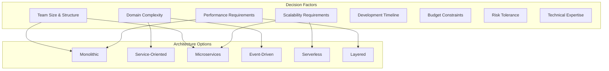

### Primary Decision Tree

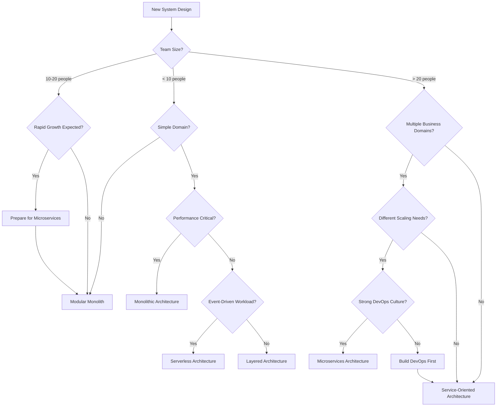

### Detailed Evaluation Criteria

**Team and Organizational Factors**

| Factor | Monolithic | SOA | Microservices | Event-Driven | Serverless | Layered |
|--------|------------|-----|---------------|--------------|------------|---------|
| **Team Size** | < 10 | 10-50 | > 20 | Any | < 15 | Any |
| **Team Structure** | Single team | Multiple teams | Cross-functional teams | Distributed teams | Small teams | Hierarchical teams |
| **DevOps Maturity** | Low-Medium | Medium | High | Medium-High | Medium | Low-Medium |
| **Release Frequency** | Weekly/Monthly | Bi-weekly | Daily/Continuous | Continuous | Continuous | Weekly |
| **Coordination Overhead** | Low | Medium | High | Medium | Low | Low |

**Technical Requirements**

| Factor | Monolithic | SOA | Microservices | Event-Driven | Serverless | Layered |
|--------|------------|-----|---------------|--------------|------------|---------|
| **Performance** | Excellent | Good | Fair | Good | Variable | Good |
| **Scalability** | Limited | Good | Excellent | Excellent | Excellent | Limited |
| **Consistency** | Strong | Strong | Eventual | Eventual | Eventual | Strong |
| **Complexity** | Low | Medium | High | High | Medium | Low |
| **Technology Diversity** | None | Limited | High | Medium | Medium | None |

**Business Requirements**

| Factor | Monolithic | SOA | Microservices | Event-Driven | Serverless | Layered |
|--------|------------|-----|---------------|--------------|------------|---------|
| **Time to Market** | Fast | Medium | Slow initially | Medium | Fast | Fast |
| **Cost (Initial)** | Low | Medium | High | Medium | Low | Low |
| **Cost (Operational)** | Low | Medium | High | Medium | Variable | Low |
| **Risk Tolerance** | Low | Medium | High | Medium | Medium | Low |
| **Vendor Lock-in** | None | Low | Low | Low | High | None |

## Architecture Selection Scenarios

### Scenario 1: Early-Stage Startup

**Context**
- Team: 3-5 developers
- Product: MVP for market validation
- Timeline: 3-6 months to launch
- Budget: Limited
- Uncertainty: High product pivot risk

**Decision Process**
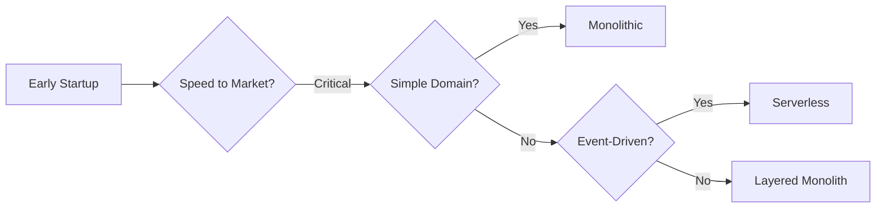

**Recommended Architecture: Monolithic**

**Rationale**
- **Fast Development**: Single codebase, simple deployment
- **Low Complexity**: Minimal operational overhead
- **Cost Effective**: Single server, simple infrastructure
- **Easy Debugging**: All code in one place
- **Rapid Iteration**: Quick changes and deployments

**Implementation Strategy**
```typescript
// Simple Express.js monolith structure
src/
├── controllers/     // HTTP request handling
├── services/       // Business logic
├── models/         // Data models
├── routes/         // API routes
├── middleware/     // Cross-cutting concerns
├── config/         // Configuration
└── app.ts          // Application entry point

// Example structure
class UserController {
    constructor(private userService: UserService) {}
    
    async createUser(req: Request, res: Response) {
        const user = await this.userService.createUser(req.body);
        res.status(201).json(user);
    }
}

class UserService {
    constructor(private userRepository: UserRepository) {}
    
    async createUser(userData: CreateUserRequest): Promise<User> {
        // Business logic
        const user = new User(userData);
        return await this.userRepository.save(user);
    }
}
```

**Evolution Path**


### Scenario 2: Growing SaaS Company

**Context**
- Team: 15-25 developers
- Product: Established SaaS platform
- Growth: 100% year-over-year
- Multiple features with different scaling needs
- Need for independent team velocity

**Decision Process**
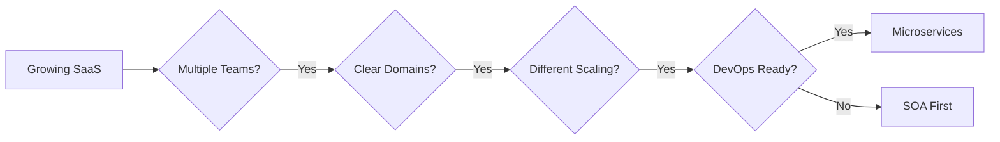

**Recommended Architecture: Microservices (with gradual migration)**

**Migration Strategy**
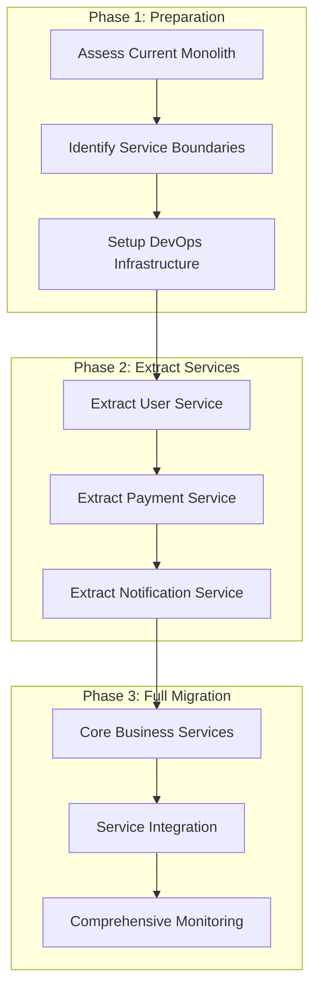

**Service Decomposition Example**
```yaml
# Service boundaries based on business capabilities
services:
  user-service:
    responsibility: User management, authentication
    team: Identity Team
    database: PostgreSQL
    
  billing-service:
    responsibility: Subscriptions, payments, invoicing
    team: Billing Team
    database: PostgreSQL
    
  analytics-service:
    responsibility: Usage tracking, reporting
    team: Analytics Team
    database: ClickHouse
    
  notification-service:
    responsibility: Email, SMS, push notifications
    team: Platform Team
    database: MongoDB
    
  api-gateway:
    responsibility: Request routing, authentication
    team: Platform Team
    technology: Kong/Nginx
```

### Scenario 3: Enterprise Integration Platform

**Context**
- Organization: Large enterprise
- Requirement: Integrate 20+ legacy systems
- Compliance: Strict regulatory requirements
- Team: 50+ developers across multiple departments
- Timeline: 2-3 years implementation

**Decision Process**
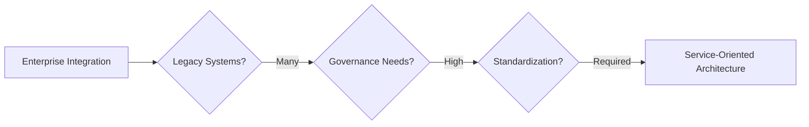

**Recommended Architecture: Service-Oriented Architecture (SOA)**

**SOA Implementation**
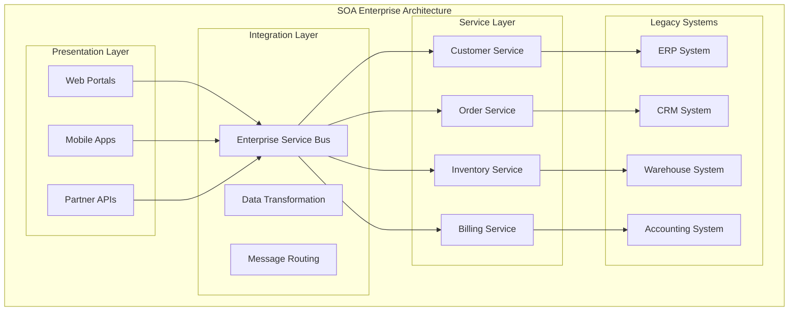

**Governance Framework**
```yaml
# SOA Governance Structure
governance:
  architecture_board:
    - Chief Architect
    - Domain Architects
    - Security Architect
    
  service_standards:
    - SOAP/REST API standards
    - Data format specifications
    - Security requirements
    - Performance SLAs
    
  lifecycle_management:
    - Service design review
    - Implementation guidelines
    - Testing requirements
    - Deployment approval
    - Retirement process
    
  monitoring:
    - Service health monitoring
    - Performance metrics
    - Usage analytics
    - Compliance reporting
```

### Scenario 4: High-Traffic Media Platform

**Context**
- Product: Video streaming platform
- Scale: Millions of concurrent users
- Requirements: Low latency, high availability
- Content: Global content delivery
- Team: 100+ engineers

**Decision Process**
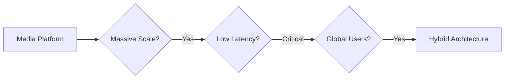

**Recommended Architecture: Hybrid (Microservices + Event-Driven + CDN)**

**Hybrid Architecture Design**
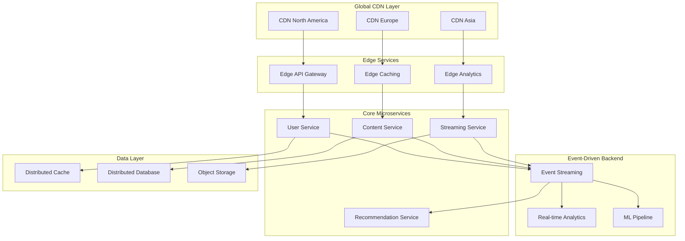

**Performance Optimization Strategy**
```yaml
# Performance-focused architecture decisions
optimization:
  caching:
    - Multi-level caching (CDN, Edge, Application, Database)
    - Cache warming strategies
    - Intelligent cache invalidation
    
  data_storage:
    - Read replicas for user data
    - Sharded databases by region
    - Object storage for media files
    
  streaming:
    - Adaptive bitrate streaming
    - Edge-based transcoding
    - Predictive content pre-loading
    
  monitoring:
    - Real-time performance metrics
    - User experience monitoring
    - Automated scaling triggers
```

## Migration Strategies

### Monolith to Microservices Migration

**Strangler Fig Pattern Implementation**
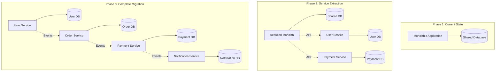

**Migration Checklist**
```yaml
# Pre-migration preparation
preparation:
  - [ ] Identify service boundaries using Domain-Driven Design
  - [ ] Set up CI/CD pipeline for multiple services
  - [ ] Implement comprehensive monitoring and logging
  - [ ] Establish service communication patterns
  - [ ] Create data migration strategy
  - [ ] Train team on microservices patterns

# Service extraction process
extraction:
  - [ ] Start with leaf services (minimal dependencies)
  - [ ] Implement API contracts before extraction
  - [ ] Use database-per-service pattern
  - [ ] Implement circuit breakers and timeouts
  - [ ] Add distributed tracing
  - [ ] Monitor performance impact

# Post-migration validation
validation:
  - [ ] Verify functional requirements
  - [ ] Validate performance benchmarks
  - [ ] Test failure scenarios
  - [ ] Confirm monitoring coverage
  - [ ] Document service dependencies
  - [ ] Plan rollback procedures
```

### Legacy System Modernization

**Modernization Approaches**
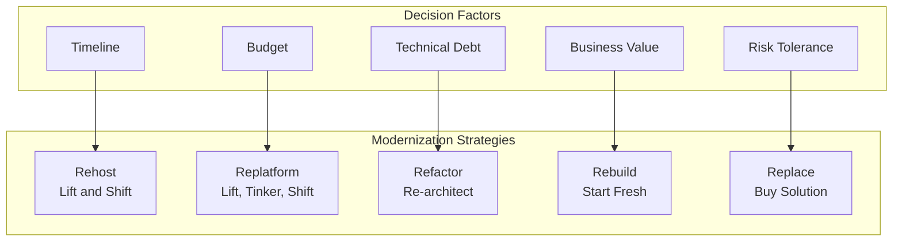

**Modernization Roadmap Example**
```yaml
# 3-year modernization plan
year_1:
  quarter_1:
    - Assess current architecture
    - Identify modernization candidates
    - Set up cloud infrastructure
    
  quarter_2:
    - Rehost non-critical systems
    - Implement monitoring and logging
    - Train team on cloud technologies
    
  quarter_3:
    - Extract user management service
    - Implement API gateway
    - Set up CI/CD pipelines
    
  quarter_4:
    - Extract payment processing
    - Implement event-driven communication
    - Performance optimization

year_2:
  focus: Core business logic modernization
  approach: Strangler fig pattern
  services: [order-management, inventory, billing]
  
year_3:
  focus: Complete migration and optimization
  approach: Full microservices architecture
  goals: [performance, scalability, maintainability]
```

## Architecture Evolution Patterns

### Evolutionary Architecture Principles

**Fitness Functions**
```typescript
// Example: Performance fitness function
class PerformanceFitnessFunction {
    async evaluate(): Promise<FitnessResult> {
        const metrics = await this.performanceMonitor.getMetrics();
        
        const results = {
            responseTime: this.evaluateResponseTime(metrics.avgResponseTime),
            throughput: this.evaluateThroughput(metrics.requestsPerSecond),
            errorRate: this.evaluateErrorRate(metrics.errorRate)
        };
        
        return {
            score: this.calculateOverallScore(results),
            details: results,
            recommendations: this.generateRecommendations(results)
        };
    }
    
    private evaluateResponseTime(avgResponseTime: number): FitnessScore {
        if (avgResponseTime < 100) return { score: 1.0, status: 'excellent' };
        if (avgResponseTime < 500) return { score: 0.8, status: 'good' };
        if (avgResponseTime < 1000) return { score: 0.6, status: 'acceptable' };
        return { score: 0.3, status: 'poor' };
    }
}

// Example: Security fitness function
class SecurityFitnessFunction {
    async evaluate(): Promise<FitnessResult> {
        const vulnerabilities = await this.securityScanner.scan();
        const compliance = await this.complianceChecker.check();
        
        return {
            score: this.calculateSecurityScore(vulnerabilities, compliance),
            vulnerabilities: vulnerabilities,
            complianceStatus: compliance
        };
    }
}
```

**Architecture Decision Records (ADRs)**
```markdown
# ADR-001: Adopt Microservices Architecture

## Status
Accepted

## Context
Our monolithic application is becoming difficult to maintain and deploy. 
We have 25+ developers working on the codebase, leading to frequent 
merge conflicts and coordination issues.

## Decision
We will migrate to a microservices architecture using the strangler 
fig pattern over 18 months.

## Consequences

### Positive
- Independent team velocity
- Technology diversity
- Better fault isolation
- Improved scalability

### Negative
- Increased operational complexity
- Network latency between services
- Distributed system challenges
- Higher infrastructure costs

## Implementation Plan
1. Extract user service (Q1)
2. Extract payment service (Q2)
3. Extract order service (Q3)
4. Complete migration (Q4)
```

### Continuous Architecture Assessment

**Architecture Health Metrics**
```yaml
# Architecture health dashboard
metrics:
  technical_debt:
    - Code complexity metrics
    - Test coverage percentage
    - Documentation coverage
    - Dependency freshness
    
  performance:
    - Response time percentiles
    - Throughput capacity
    - Error rates
    - Resource utilization
    
  maintainability:
    - Time to implement features
    - Bug fix cycle time
    - Deployment frequency
    - Mean time to recovery
    
  team_productivity:
    - Developer satisfaction
    - Onboarding time
    - Feature delivery velocity
    - Cross-team dependencies
```

**Automated Architecture Testing**
```typescript
// Example: Architecture unit tests
describe('Architecture Rules', () => {
    it('should not have circular dependencies between services', () => {
        const dependencies = analyzeDependencies();
        expect(dependencies).not.toHaveCircularReferences();
    });
    
    it('should follow layered architecture rules', () => {
        const violations = checkLayerViolations();
        expect(violations).toHaveLength(0);
    });
    
    it('should maintain service boundaries', () => {
        const crossServiceCalls = analyzeServiceCalls();
        expect(crossServiceCalls).toOnlyUsePublicAPIs();
    });
    
    it('should have acceptable performance characteristics', async () => {
        const performanceMetrics = await runPerformanceTests();
        expect(performanceMetrics.responseTime).toBeLessThan(500);
        expect(performanceMetrics.throughput).toBeGreaterThan(1000);
    });
});
```

## Common Decision Pitfalls

### Anti-Pattern: Resume-Driven Development

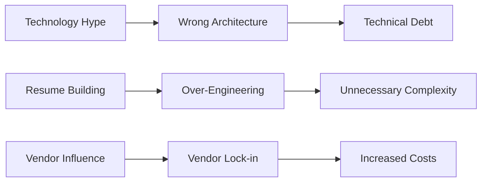

**How to Avoid**
- Focus on business requirements, not technology trends
- Evaluate total cost of ownership, not just initial development
- Consider team expertise and learning curve
- Start simple and evolve based on actual needs

### Anti-Pattern: Premature Optimization

```typescript
// Bad: Over-engineering for scale that may never come
class PrematurelyOptimizedUserService {
    constructor(
        private userRepository: UserRepository,
        private cacheCluster: RedisCluster,
        private eventBus: EventBus,
        private searchIndex: ElasticsearchClient,
        private metricsCollector: MetricsCollector
    ) {}
    
    async createUser(userData: CreateUserRequest): Promise<User> {
        // Complex caching strategy for 10 users
        const cacheKey = this.generateCacheKey(userData);
        
        // Event sourcing for simple CRUD
        const events = this.buildUserCreationEvents(userData);
        await this.eventBus.publishEvents(events);
        
        // Full-text search for basic user lookup
        await this.searchIndex.indexUser(userData);
        
        // Detailed metrics for every operation
        this.metricsCollector.recordUserCreation(userData);
        
        return user;
    }
}

// Good: Simple solution that can evolve
class SimpleUserService {
    constructor(private userRepository: UserRepository) {}
    
    async createUser(userData: CreateUserRequest): Promise<User> {
        const user = new User(userData);
        return await this.userRepository.save(user);
    }
}
```

### Anti-Pattern: Architecture Astronaut

```yaml
# Bad: Over-abstracted architecture
architecture:
  layers: 12  # Too many layers
  patterns: 
    - Factory of Factories
    - Abstract Strategy Factory
    - Composite Visitor Builder
  frameworks: 8  # Too many frameworks
  
# Good: Pragmatic architecture
architecture:
  layers: 4  # Presentation, Business, Data, Infrastructure
  patterns:
    - Repository
    - Factory
    - Strategy (when needed)
  frameworks: 2-3  # Core framework + essential libraries
```

## Summary

### Key Decision Principles

**Start Simple, Evolve Gradually**
- Begin with the simplest architecture that meets current needs
- Plan for evolution, but don't over-engineer for unknown futures
- Use fitness functions to guide architectural evolution
- Make reversible decisions when possible

**Align Architecture with Organization**
- Conway's Law: Architecture reflects communication structure
- Match service boundaries to team boundaries
- Consider team size, skills, and maturity
- Plan for organizational growth and change

**Optimize for Change**
- Prioritize maintainability over premature optimization
- Design for testability and deployability
- Minimize coupling between components
- Invest in automation and tooling

### Architecture Selection Framework

**Step 1: Assess Current State**
- Team size and structure
- Technical expertise and maturity
- Existing systems and constraints
- Business requirements and timeline

**Step 2: Define Success Criteria**
- Performance requirements
- Scalability needs
- Maintainability goals
- Cost constraints

**Step 3: Evaluate Options**
- Use decision matrix with weighted criteria
- Consider total cost of ownership
- Assess risks and mitigation strategies
- Plan migration path if needed

**Step 4: Implement and Monitor**
- Start with pilot project or proof of concept
- Implement fitness functions and monitoring
- Gather feedback and iterate
- Document decisions and lessons learned

### Modern Architecture Trends

**Hybrid Architectures**
- Combine multiple patterns based on specific needs
- Microservices for business logic, serverless for integration
- Event-driven backbone with synchronous APIs

**Platform Engineering**
- Internal developer platforms
- Self-service infrastructure
- Standardized deployment patterns

**AI-Assisted Architecture**
- Automated code analysis and recommendations
- Performance optimization suggestions
- Security vulnerability detection

### Final Recommendations

**For Startups**
- Start with monolithic architecture
- Focus on product-market fit over scalability
- Plan for future decomposition with modular design
- Invest in monitoring and observability early

**For Growing Companies**
- Evaluate team structure and communication patterns
- Consider service-oriented architecture as intermediate step
- Invest in DevOps capabilities before microservices
- Use strangler fig pattern for gradual migration

**For Enterprises**
- Prioritize governance and standardization
- Consider regulatory and compliance requirements
- Plan for legacy system integration
- Invest in architecture governance and fitness functions

**For High-Scale Systems**
- Design for failure and resilience
- Use hybrid architectures optimized for specific use cases
- Invest heavily in observability and automation
- Consider edge computing and global distribution

### Next Steps

- **Practice Architecture Decision Making**: Use the framework on real projects
- **Study Successful Migrations**: Learn from companies that have evolved their architectures
- **Develop Fitness Functions**: Create automated tests for architectural quality
- **Build Migration Experience**: Practice with strangler fig and other migration patterns
- **Stay Current**: Follow architecture trends and emerging patterns

### Quick Reference

**Architecture Decision Checklist**
- ✅ Clearly defined business requirements and constraints
- ✅ Honest assessment of team capabilities and maturity
- ✅ Consideration of total cost of ownership
- ✅ Plan for evolution and migration
- ✅ Defined success metrics and fitness functions
- ✅ Risk assessment and mitigation strategies
- ✅ Stakeholder buy-in and support
- ❌ Technology choices driven by hype or resume building
- ❌ Over-engineering for hypothetical future requirements
- ❌ Ignoring organizational and team constraints
- ❌ Lack of monitoring and feedback mechanisms
