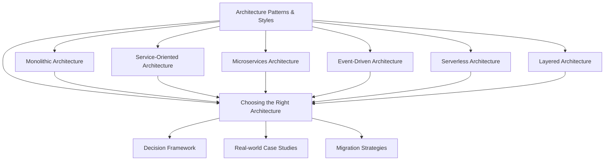

# Chapter 6: Architecture Patterns & Styles

## Overview

This chapter explores the fundamental architectural patterns and styles used in modern software systems. You'll learn about different approaches to organizing and structuring applications, from traditional monolithic architectures to modern microservices and serverless patterns. Each pattern comes with its own trade-offs, benefits, and challenges that we'll examine through real-world examples and case studies.

Understanding these patterns is crucial for system design interviews and making informed architectural decisions in your projects. We'll provide decision frameworks to help you choose the right architecture for different scenarios.

## Learning Objectives

By the end of this chapter, you will be able to:

- **Understand Core Patterns**: Explain the key characteristics, benefits, and drawbacks of major architectural patterns
- **Compare Architectures**: Analyze trade-offs between different architectural approaches using structured criteria
- **Make Informed Decisions**: Use decision trees and frameworks to select appropriate architectures for specific requirements
- **Recognize Real-world Applications**: Identify how major companies implement these patterns in their systems
- **Apply Best Practices**: Implement architectural patterns following industry-proven guidelines and avoiding common pitfalls

## Prerequisites

Before diving into this chapter, you should be familiar with:

- **Basic System Design Concepts** (Chapter 1): Understanding of system components, interfaces, and design principles
- **Distributed Systems Fundamentals** (Chapter 3): Knowledge of distributed system challenges and trade-offs
- **Scaling Concepts** (Chapter 5): Understanding of horizontal vs vertical scaling and partitioning strategies
- **Basic Software Engineering**: Familiarity with software modules, APIs, and deployment concepts

## Estimated Reading Time

- **Total Reading Time**: 45-60 minutes
- **Section Breakdown**:
  - Monolithic Architecture: 8-10 minutes
  - Service-Oriented Architecture: 6-8 minutes  
  - Microservices Architecture: 12-15 minutes
  - Event-Driven Architecture: 8-10 minutes
  - Serverless Architecture: 6-8 minutes
  - Layered Architecture: 5-7 minutes
  - Choosing Architecture: 10-12 minutes

## Chapter Structure

## Key Concepts Covered

- **Architectural Patterns**: Monolithic, SOA, Microservices, Event-Driven, Serverless, Layered
- **Design Principles**: Separation of concerns, loose coupling, high cohesion, single responsibility
- **Trade-off Analysis**: Performance vs complexity, development speed vs operational overhead
- **Decision Frameworks**: Criteria-based selection, migration strategies, risk assessment
- **Real-world Examples**: How Netflix, Amazon, Uber, and other companies structure their systems
