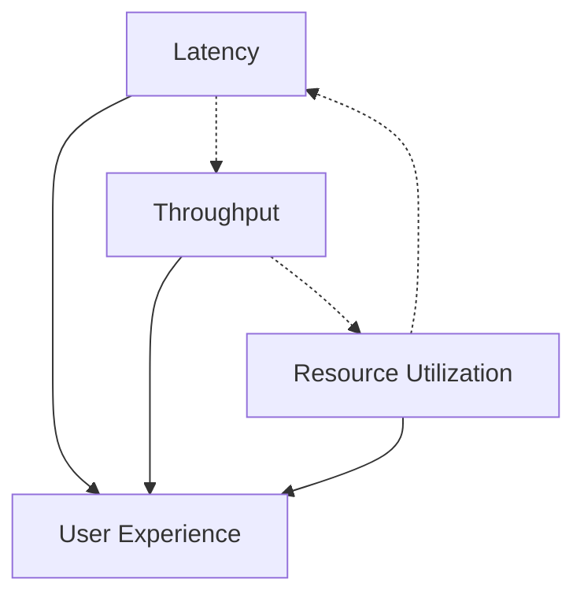

# Performance Metrics Explained

## Introduction

Performance metrics are quantitative measures that help us understand how well a system performs under various conditions. These metrics are crucial for making informed decisions about system design, optimization, and capacity planning. Understanding these metrics allows you to set realistic expectations, identify problems early, and communicate system behavior effectively to stakeholders.

## Core Performance Metrics

### 1. Latency

**Definition**: The time it takes to process a single request from start to finish.

**Formula**: 
```
Latency = Time_Response_Received - Time_Request_Sent
```

**Types of Latency**:
- **Network Latency**: Time for data to travel across the network
- **Processing Latency**: Time spent processing the request
- **Queuing Latency**: Time spent waiting in queues

**Example Calculation**:
```
Request sent at: 10:00:00.000
Response received at: 10:00:00.150
Latency = 150ms
```

### 2. Throughput

**Definition**: The number of requests processed per unit of time.

**Formula**: 
```
Throughput = Total_Requests_Processed / Time_Period
```

**Common Units**:
- **QPS (Queries Per Second)**: requests/second
- **TPS (Transactions Per Second)**: transactions/second
- **RPS (Requests Per Second)**: requests/second

**Example Calculation**:
```
Requests processed in 1 minute: 6,000
Throughput = 6,000 requests / 60 seconds = 100 QPS
```

### 3. Response Time

**Definition**: The total time from when a request is made until the response is completely received.

**Formula**: 
```
Response_Time = Processing_Time + Network_Time + Queuing_Time
```

**Percentile Measurements**:
- **P50 (Median)**: 50% of requests complete within this time
- **P95**: 95% of requests complete within this time
- **P99**: 99% of requests complete within this time
- **P99.9**: 99.9% of requests complete within this time

### 4. Utilization

**Definition**: The percentage of available resources being used.

**Formula**: 
```
Utilization = (Used_Resources / Total_Available_Resources) × 100%
```

**Resource Types**:
- **CPU Utilization**: `(CPU_Time_Used / Total_CPU_Time) × 100%`
- **Memory Utilization**: `(Memory_Used / Total_Memory) × 100%`
- **Disk Utilization**: `(Disk_IO_Time / Total_Time) × 100%`
- **Network Utilization**: `(Bandwidth_Used / Total_Bandwidth) × 100%`

### 5. Concurrency

**Definition**: The number of requests being processed simultaneously.

**Formula**: 
```
Concurrency = Throughput × Average_Response_Time
```

**Little's Law**: `L = λ × W`
- L = Average number of requests in system (concurrency)
- λ = Average arrival rate (throughput)
- W = Average time spent in system (response time)

## Advanced Performance Metrics

### 1. Apdex Score (Application Performance Index)

**Definition**: A standardized method for measuring user satisfaction with application performance.

**Formula**: 
```
Apdex = (Satisfied_Count + (Tolerating_Count / 2)) / Total_Samples
```

**Thresholds**:
- **Satisfied**: Response time ≤ T (target time)
- **Tolerating**: T < Response time ≤ 4T
- **Frustrated**: Response time > 4T

**Example**:
```
Target time (T) = 500ms
100 requests total:
- 70 requests ≤ 500ms (Satisfied)
- 20 requests 500ms-2000ms (Tolerating)  
- 10 requests > 2000ms (Frustrated)

Apdex = (70 + (20/2)) / 100 = 0.8
```

### 2. Error Rate

**Definition**: The percentage of requests that result in errors.

**Formula**: 
```
Error_Rate = (Error_Count / Total_Requests) × 100%
```

**Types of Errors**:
- **4xx Errors**: Client errors (bad requests, unauthorized, not found)
- **5xx Errors**: Server errors (internal server error, service unavailable)
- **Timeout Errors**: Requests that exceed time limits

### 3. Saturation

**Definition**: How "full" a service is, often measured as the percentage of resource utilization.

**Formula**: 
```
Saturation = Current_Load / Maximum_Capacity
```

**Indicators**:
- Queue lengths
- Thread pool utilization
- Connection pool usage
- Memory pressure

## Practical Examples

### Web Application Performance

```
Scenario: E-commerce website during peak hours

Metrics Collected:
- Average Response Time: 250ms
- P95 Response Time: 800ms
- P99 Response Time: 1.2s
- Throughput: 500 QPS
- Error Rate: 0.1%
- CPU Utilization: 65%
- Memory Utilization: 78%

Analysis:
- Good average performance (250ms)
- Some slow requests (P99 at 1.2s) - investigate
- Low error rate indicates stability
- Resource utilization has headroom for growth
```

### Database Performance

```
Scenario: MySQL database serving read queries

Metrics:
- Query Latency (P50): 15ms
- Query Latency (P95): 45ms
- Query Latency (P99): 120ms
- Queries Per Second: 2,000
- Connection Pool Utilization: 40%
- Slow Query Rate: 2%

Calculations:
Concurrency = 2,000 QPS × 0.015s = 30 concurrent queries
```

### API Performance Benchmarking

```
Load Test Results:
Duration: 10 minutes
Total Requests: 300,000
Successful Requests: 299,700
Failed Requests: 300

Calculations:
Throughput = 300,000 / 600s = 500 QPS
Error Rate = (300 / 300,000) × 100% = 0.1%
Success Rate = (299,700 / 300,000) × 100% = 99.9%
```

## Performance Metric Relationships

### The Performance Triangle



**Key Relationships**:
1. **Latency vs Throughput**: Often inversely related due to queuing effects
2. **Throughput vs Utilization**: Higher throughput typically increases resource utilization
3. **Utilization vs Latency**: High utilization can lead to increased queuing and latency

### Performance Under Load

```
Light Load (< 30% utilization):
- Latency: Low and stable
- Throughput: Scales linearly with requests

Medium Load (30-70% utilization):
- Latency: Slight increase
- Throughput: Still scales well

Heavy Load (70-90% utilization):
- Latency: Noticeable increase due to queuing
- Throughput: Growth slows down

Overload (> 90% utilization):
- Latency: Dramatic increase
- Throughput: May actually decrease
- Error Rate: Increases significantly
```

## Measurement Best Practices

### 1. Choose the Right Metrics

- **User-Facing Services**: Focus on response time percentiles and error rates
- **Batch Processing**: Emphasize throughput and completion time
- **Real-Time Systems**: Prioritize latency consistency over average latency

### 2. Measure at Multiple Layers

```
Application Layer:
- Business transaction response times
- Feature-specific performance metrics
- User journey completion times

Infrastructure Layer:
- Server resource utilization
- Network performance
- Database query performance
```

### 3. Use Percentiles, Not Just Averages

```
Why P95/P99 Matter:
Average response time: 100ms
P95 response time: 500ms
P99 response time: 2000ms

Interpretation:
- Most users have good experience (100ms average)
- 5% of users wait up to 500ms
- 1% of users have poor experience (2s+)
```

### 4. Establish Baselines

```
Performance Baseline Process:
1. Measure current performance under normal load
2. Document typical patterns and variations
3. Set performance targets based on business requirements
4. Monitor for deviations from baseline
5. Update baselines as system evolves
```

## Common Pitfalls

### 1. Vanity Metrics

❌ **Wrong**: "Our average response time is 50ms"
✅ **Right**: "P95 response time is 200ms, P99 is 500ms"

### 2. Ignoring Context

❌ **Wrong**: Measuring performance during off-peak hours only
✅ **Right**: Measuring across different load patterns and time periods

### 3. Over-Optimization

❌ **Wrong**: Optimizing for unrealistic performance targets
✅ **Right**: Optimizing based on actual user requirements and business impact

## Tools for Performance Measurement

### Application Performance Monitoring (APM)
- **New Relic**: Full-stack monitoring with detailed transaction traces
- **Datadog**: Infrastructure and application monitoring with custom metrics
- **AppDynamics**: Business transaction monitoring with code-level visibility

### Load Testing Tools
- **Apache JMeter**: Open-source load testing with GUI and command-line options
- **k6**: Modern load testing tool with JavaScript scripting
- **Artillery**: Lightweight, npm-based load testing framework

### System Monitoring
- **Prometheus + Grafana**: Time-series metrics collection and visualization
- **CloudWatch**: AWS native monitoring with custom metrics support
- **Nagios**: Traditional infrastructure monitoring with alerting

## Summary

Performance metrics are the foundation of system optimization and reliability. Key takeaways:

- **Latency, throughput, and utilization** are the core metrics every system designer should understand
- **Percentiles (P95, P99)** provide better insights than averages for user experience
- **Little's Law** helps understand the relationship between concurrency, throughput, and response time
- **Context matters** - measure performance under realistic conditions
- **Multiple layers** - monitor both application and infrastructure metrics
- **Baselines and trends** are more valuable than point-in-time measurements

Understanding these metrics enables you to make data-driven decisions about system design, identify performance bottlenecks, and ensure your system meets user expectations as it scales.
