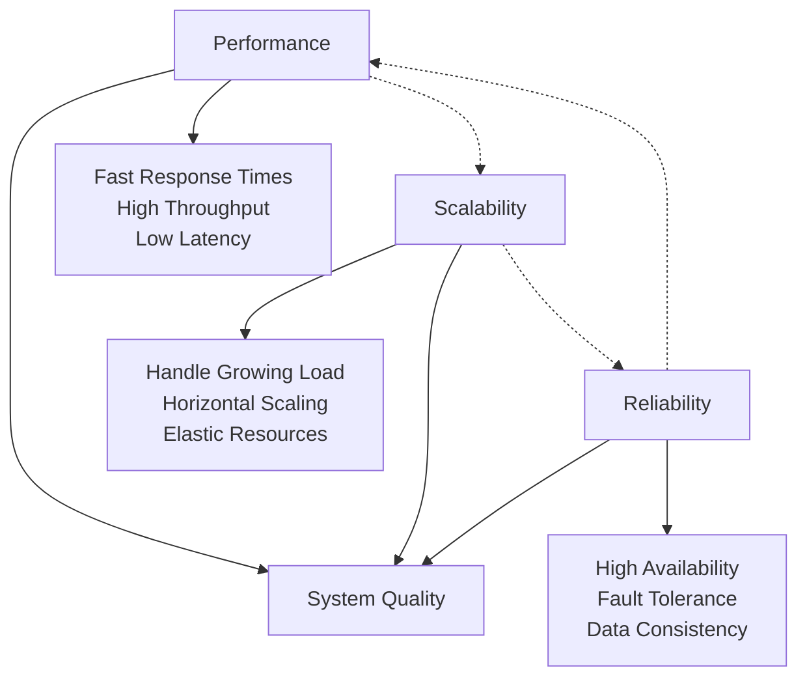

# Performance vs Scalability vs Reliability Trade-offs

## Introduction

In system design, you constantly face trade-offs between performance, scalability, and reliability. These three qualities are interconnected and often compete with each other. Understanding these trade-offs helps you make informed decisions based on your specific requirements, constraints, and business priorities. There's no universal "best" choice - only the right choice for your particular context.

## The Performance-Scalability-Reliability Triangle



## Core Trade-off Relationships

### 1. Performance vs Reliability

**The Tension**:
- **Performance optimization** often involves cutting corners, reducing redundancy, and aggressive resource utilization
- **Reliability** requires safety checks, redundancy, and conservative resource allocation

**Common Trade-offs**:

**Caching vs Consistency**:
```
High Performance Approach:
✅ Aggressive caching with long TTL
✅ Eventually consistent data
✅ Fast read operations
❌ Potential stale data
❌ Complex cache invalidation

High Reliability Approach:
✅ Strong consistency guarantees
✅ Always fresh data
✅ Predictable behavior
❌ Higher latency
❌ More database load
```

**Error Handling vs Speed**:
```
Performance-Focused:
- Minimal error checking
- Fail fast approach
- Optimistic processing
- Risk: Silent failures, data corruption

Reliability-Focused:
- Comprehensive validation
- Defensive programming
- Pessimistic checks
- Cost: Higher latency, more CPU usage
```

**Example Decision Matrix**:
```
Financial Trading System:
- Reliability Priority: 90%
- Performance Priority: 10%
- Decision: Choose strong consistency over speed

Gaming Leaderboard:
- Performance Priority: 70%
- Reliability Priority: 30%
- Decision: Accept eventual consistency for speed
```

### 2. Performance vs Scalability

**The Tension**:
- **Performance optimization** often involves specialized, tightly-coupled solutions
- **Scalability** requires loose coupling, distributed architectures, and coordination overhead

**Common Trade-offs**:

**Vertical vs Horizontal Scaling**:
```
Vertical Scaling (Performance Focus):
✅ Lower latency (no network calls)
✅ Simpler architecture
✅ Better single-node performance
❌ Limited scaling ceiling
❌ Single point of failure
❌ Expensive high-end hardware

Horizontal Scaling (Scalability Focus):
✅ Unlimited scaling potential
✅ Better fault tolerance
✅ Cost-effective commodity hardware
❌ Network latency overhead
❌ Complex distributed coordination
❌ Eventual consistency challenges
```

**Monolith vs Microservices**:
```
Monolithic Architecture:
Performance Benefits:
- In-process method calls (no network overhead)
- Shared memory and resources
- Optimized data access patterns
- Single deployment unit

Scalability Limitations:
- Scale entire application together
- Resource contention between features
- Technology stack lock-in

Microservices Architecture:
Scalability Benefits:
- Independent scaling of services
- Technology diversity
- Team autonomy
- Fault isolation

Performance Costs:
- Network communication overhead
- Serialization/deserialization
- Distributed transaction complexity
- Service discovery latency
```

### 3. Scalability vs Reliability

**The Tension**:
- **Scalability** introduces complexity and more failure points
- **Reliability** becomes harder to achieve as system complexity increases

**Common Trade-offs**:

**Distributed Systems Challenges**:
```
CAP Theorem Trade-offs:

Consistency + Availability (CA):
- Traditional RDBMS approach
- Works well in single data center
- Fails during network partitions
- Example: PostgreSQL with synchronous replication

Consistency + Partition Tolerance (CP):
- Strong consistency during partitions
- May become unavailable
- Good for financial systems
- Example: MongoDB with majority write concern

Availability + Partition Tolerance (AP):
- Always available during partitions
- Eventually consistent data
- Good for social media, content delivery
- Example: Cassandra, DynamoDB
```

**Replication Strategies**:
```
Synchronous Replication:
Reliability Benefits:
- Strong consistency
- No data loss
- Immediate failover capability

Scalability Costs:
- Higher write latency
- Reduced write throughput
- Blocking on slow replicas

Asynchronous Replication:
Scalability Benefits:
- Lower write latency
- Higher write throughput
- Non-blocking operations

Reliability Costs:
- Potential data loss
- Eventual consistency
- Complex conflict resolution
```

## Decision Framework for Trade-offs

### 1. Business Requirements Analysis

**Priority Matrix Template**:
```
Requirement Assessment:
┌─────────────────┬──────────┬──────────┬──────────┬──────────┐
│ System Aspect   │ Critical │ High     │ Medium   │ Low      │
├─────────────────┼──────────┼──────────┼──────────┼──────────┤
│ Response Time   │    ✓     │          │          │          │
│ Availability    │    ✓     │          │          │          │
│ Data Consistency│          │    ✓     │          │          │
│ Throughput      │          │          │    ✓     │          │
│ Cost Efficiency │          │          │          │    ✓     │
│ Scalability     │          │    ✓     │          │          │
└─────────────────┴──────────┴──────────┴──────────┴──────────┘

Business Context:
- Industry: E-commerce
- Peak Traffic: Black Friday (10x normal)
- Revenue Impact: $1M/hour during peak
- User Expectations: < 2s page load time
- Compliance: PCI DSS (financial data)
```

### 2. Use Case Patterns

**Read-Heavy Systems**:
```
Characteristics:
- 90%+ read operations
- Infrequent writes
- Examples: News sites, documentation, catalogs

Optimal Trade-offs:
✅ Prioritize read performance
✅ Use aggressive caching
✅ Accept eventual consistency
✅ Scale read replicas horizontally
❌ Don't over-optimize write performance
```

**Write-Heavy Systems**:
```
Characteristics:
- High write volume
- Real-time data ingestion
- Examples: Logging, analytics, IoT data

Optimal Trade-offs:
✅ Prioritize write throughput
✅ Use asynchronous processing
✅ Accept eventual consistency
✅ Partition data effectively
❌ Don't require immediate consistency
```

**Mission-Critical Systems**:
```
Characteristics:
- High availability requirements
- Data integrity crucial
- Examples: Banking, healthcare, aviation

Optimal Trade-offs:
✅ Prioritize reliability over performance
✅ Use synchronous replication
✅ Implement comprehensive monitoring
✅ Plan for graceful degradation
❌ Don't sacrifice safety for speed
```

## Practical Trade-off Examples

### Example 1: Social Media Feed

**Scenario**: Building a social media timeline feature

**Option A: Pull Model (Performance Focus)**
```
Architecture:
- Generate feed on-demand when user requests
- Query follows table + posts table
- Apply ranking algorithm in real-time

Trade-offs:
✅ Always fresh content
✅ Simple write operations
✅ No storage overhead for feeds
❌ Slow for users with many follows
❌ High CPU usage during peak times
❌ Difficult to scale read operations

Best for: Small user base, real-time requirements
```

**Option B: Push Model (Scalability Focus)**
```
Architecture:
- Pre-compute feeds when posts are created
- Store materialized feeds in cache/database
- Serve feeds from pre-computed data

Trade-offs:
✅ Fast feed generation
✅ Predictable read performance
✅ Easy to scale reads
❌ Storage overhead for all user feeds
❌ Complex write operations (fan-out)
❌ Potential stale content

Best for: Large user base, performance requirements
```

**Option C: Hybrid Model (Balanced)**
```
Architecture:
- Push model for active users
- Pull model for inactive users
- Celebrity users use pull model to avoid fan-out storm

Trade-offs:
✅ Balanced performance and storage
✅ Handles different user patterns
✅ Scalable architecture
❌ Complex implementation
❌ Multiple code paths to maintain
❌ Harder to debug and monitor

Best for: Large-scale systems with diverse user patterns
```

### Example 2: E-commerce Inventory Management

**Scenario**: Managing product inventory across multiple warehouses

**Option A: Strong Consistency (Reliability Focus)**
```
Architecture:
- Distributed transactions across all warehouses
- Synchronous inventory updates
- ACID guarantees for all operations

Implementation:
BEGIN TRANSACTION;
  UPDATE inventory SET quantity = quantity - 1 
  WHERE product_id = ? AND warehouse_id = ? AND quantity > 0;
  
  IF @@ROWCOUNT = 0 THEN
    ROLLBACK;
    RETURN 'Out of stock';
  END IF;
  
  INSERT INTO orders (product_id, warehouse_id, quantity);
COMMIT;

Trade-offs:
✅ No overselling
✅ Accurate inventory counts
✅ Simple business logic
❌ High latency during peak times
❌ System unavailable during network partitions
❌ Poor scalability under load

Best for: High-value items, strict inventory control
```

**Option A: Eventual Consistency (Performance Focus)**
```
Architecture:
- Optimistic inventory management
- Asynchronous inventory reconciliation
- Compensation transactions for overselling

Implementation:
// Fast path - optimistic update
UPDATE inventory SET quantity = quantity - 1 
WHERE product_id = ? AND warehouse_id = ?;

// Async reconciliation
IF (actual_quantity < 0) {
  // Compensation logic
  cancel_recent_orders();
  notify_customers();
  restock_from_other_warehouses();
}

Trade-offs:
✅ Fast order processing
✅ High availability
✅ Good scalability
❌ Potential overselling
❌ Complex compensation logic
❌ Customer experience issues

Best for: High-volume, low-margin items
```

**Option C: Hybrid Approach (Balanced)**
```
Architecture:
- Reserve inventory optimistically
- Confirm reservation within time window
- Different strategies by product category

Implementation:
// Step 1: Optimistic reservation
reservation_id = reserve_inventory(product_id, quantity, ttl=300);

// Step 2: Process payment (async)
payment_result = process_payment_async(order_details);

// Step 3: Confirm or release reservation
if (payment_successful) {
  confirm_reservation(reservation_id);
} else {
  release_reservation(reservation_id);
}

Trade-offs:
✅ Fast user experience
✅ Reduced overselling
✅ Flexible per-product policies
❌ Complex reservation system
❌ Inventory temporarily locked
❌ Timeout handling complexity

Best for: Mixed inventory with different business rules
```

### Example 3: Real-time Analytics Dashboard

**Scenario**: Building a real-time analytics dashboard for business metrics

**Option A: Real-time Processing (Performance Focus)**
```
Architecture:
- Stream processing with Apache Kafka + Apache Flink
- In-memory aggregations
- WebSocket updates to dashboard

Data Flow:
Events → Kafka → Flink → Redis → WebSocket → Dashboard

Trade-offs:
✅ Real-time updates (< 1 second)
✅ Interactive dashboard experience
✅ Up-to-date business insights
❌ Complex stream processing
❌ High infrastructure costs
❌ Potential data loss during failures

Best for: Trading systems, fraud detection, live monitoring
```

**Option B: Batch Processing (Reliability Focus)**
```
Architecture:
- Scheduled batch jobs (hourly/daily)
- Data warehouse with historical accuracy
- Static dashboard with refresh intervals

Data Flow:
Events → Database → ETL Jobs → Data Warehouse → Dashboard

Trade-offs:
✅ Accurate historical data
✅ Simple, reliable architecture
✅ Cost-effective processing
❌ Delayed insights (hours/days)
❌ Static dashboard experience
❌ Missed real-time opportunities

Best for: Financial reporting, compliance, historical analysis
```

**Option C: Lambda Architecture (Balanced)**
```
Architecture:
- Real-time stream for recent data
- Batch processing for historical accuracy
- Merge results in serving layer

Data Flow:
Events → {Stream Processing, Batch Processing} → Serving Layer → Dashboard

Trade-offs:
✅ Real-time + accurate historical data
✅ Fault tolerance through redundancy
✅ Flexible query capabilities
❌ Complex architecture (two systems)
❌ Data consistency challenges
❌ Higher operational overhead

Best for: Large-scale analytics with both real-time and historical needs
```

## Trade-off Decision Tools

### 1. Performance Budget Framework

```
Performance Budget Template:
┌─────────────────┬──────────┬──────────┬──────────┬──────────┐
│ Metric          │ Target   │ Warning  │ Critical │ Action   │
├─────────────────┼──────────┼──────────┼──────────┼──────────┤
│ Response Time   │ < 200ms  │ 200-500ms│ > 500ms  │ Scale up │
│ Error Rate      │ < 0.1%   │ 0.1-1%   │ > 1%     │ Rollback │
│ Availability    │ > 99.9%  │ 99-99.9% │ < 99%    │ Failover │
│ Throughput      │ > 1000   │ 500-1000 │ < 500    │ Add nodes│
│ CPU Usage       │ < 70%    │ 70-85%   │ > 85%    │ Scale out│
└─────────────────┴──────────┴──────────┴──────────┴──────────┘

Budget Allocation:
- Performance: 40% of engineering effort
- Scalability: 35% of engineering effort  
- Reliability: 25% of engineering effort
```

### 2. Risk Assessment Matrix

```
Risk vs Impact Analysis:
┌─────────────────┬──────────┬──────────┬──────────┬──────────┐
│ Risk Scenario   │ Prob.    │ Impact   │ Risk     │ Mitigation│
├─────────────────┼──────────┼──────────┼──────────┼──────────┤
│ Database Failure│ Low      │ High     │ Medium   │ Replicas │
│ Traffic Spike   │ High     │ Medium   │ High     │ Auto-scale│
│ Network Partition│ Medium   │ High     │ High     │ Multi-AZ │
│ Code Bug        │ Medium   │ Medium   │ Medium   │ Testing  │
│ DDoS Attack     │ Low      │ High     │ Medium   │ CDN/WAF  │
└─────────────────┴──────────┴──────────┴──────────┴──────────┘

Risk Tolerance by System Type:
- Financial: Low risk tolerance → Prioritize reliability
- Gaming: Medium risk tolerance → Balance performance/reliability
- Analytics: High risk tolerance → Prioritize performance
```

### 3. Cost-Benefit Analysis

```
Trade-off Cost Analysis:
┌─────────────────┬──────────┬──────────┬──────────┬──────────┐
│ Approach        │ Dev Cost │ Ops Cost │ Risk Cost│ Total    │
├─────────────────┼──────────┼──────────┼──────────┼──────────┤
│ High Performance│ $50K     │ $20K/mo  │ $100K    │ $390K/yr │
│ High Reliability│ $80K     │ $35K/mo  │ $10K     │ $510K/yr │
│ High Scalability│ $100K    │ $15K/mo  │ $50K     │ $330K/yr │
│ Balanced        │ $75K     │ $25K/mo  │ $30K     │ $405K/yr │
└─────────────────┴──────────┴──────────┴──────────┴──────────┘

ROI Calculation:
Revenue Impact = Performance_Gain × Conversion_Rate × Revenue_Per_User
Cost Savings = Reliability_Improvement × Downtime_Cost_Avoided
Total Benefit = Revenue_Impact + Cost_Savings - Implementation_Cost
```

## Industry-Specific Trade-off Patterns

### Financial Services
```
Priority Order: Reliability > Performance > Scalability

Typical Choices:
✅ Strong consistency over eventual consistency
✅ Synchronous replication over asynchronous
✅ Conservative resource allocation
✅ Comprehensive audit trails
✅ Multi-region disaster recovery

Example: Payment processing system chooses 2-second response time 
with 99.99% reliability over 200ms with 99.9% reliability
```

### Social Media
```
Priority Order: Scalability > Performance > Reliability

Typical Choices:
✅ Eventual consistency for most features
✅ Aggressive caching strategies
✅ Horizontal scaling over vertical
✅ Graceful degradation during failures
✅ A/B testing for optimization

Example: News feed accepts 5-minute delay in updates to handle 
10x traffic spikes during major events
```

### E-commerce
```
Priority Order: Performance > Reliability > Scalability (during peak)
                Reliability > Performance > Scalability (normal times)

Typical Choices:
✅ Dynamic trade-off adjustment based on traffic
✅ Performance optimization during peak seasons
✅ Reliability focus during normal operations
✅ Inventory consistency varies by product value
✅ Personalization vs performance trade-offs

Example: Black Friday mode prioritizes fast checkout over 
real-time inventory accuracy
```

### Gaming
```
Priority Order: Performance > Scalability > Reliability

Typical Choices:
✅ Low latency over strong consistency
✅ Regional servers over global consistency
✅ Client-side prediction with server reconciliation
✅ Graceful degradation for non-critical features
✅ Performance monitoring and optimization

Example: Multiplayer game accepts occasional desync issues 
to maintain 16ms frame times
```

## Monitoring Trade-off Decisions

### Key Metrics to Track

**Performance Metrics**:
```
- Response time percentiles (P50, P95, P99)
- Throughput (requests/second)
- Resource utilization (CPU, memory, disk)
- Cache hit rates
- Database query performance
```

**Scalability Metrics**:
```
- Horizontal scaling efficiency
- Load distribution across nodes
- Queue lengths and processing rates
- Auto-scaling trigger frequency
- Resource allocation efficiency
```

**Reliability Metrics**:
```
- Availability and uptime
- Error rates by type
- Mean time to recovery (MTTR)
- Data consistency violations
- Failover success rates
```

### Trade-off Dashboards

```
Trade-off Monitoring Dashboard:
┌─────────────────────────────────────────┐
│ Performance vs Reliability Balance      │
├─────────────────────────────────────────┤
│ Current Mode: [Performance Optimized]   │
│ Response Time: 150ms (Target: <200ms)   │
│ Error Rate: 0.05% (Target: <0.1%)      │
│ Availability: 99.95% (Target: >99.9%)   │
├─────────────────────────────────────────┤
│ Trade-off Alerts:                       │
│ ⚠️  Approaching error rate threshold     │
│ ✅ Performance within targets           │
│ ✅ Reliability within targets           │
├─────────────────────────────────────────┤
│ Recommendations:                        │
│ • Consider reliability mode for next    │
│   deployment                            │
│ • Monitor error rate trend closely      │
└─────────────────────────────────────────┘
```

## Summary

Understanding and managing trade-offs is crucial for successful system design:

- **No perfect solution exists** - every choice involves trade-offs between performance, scalability, and reliability
- **Context matters** - the right trade-off depends on your specific business requirements, user expectations, and constraints
- **Trade-offs are dynamic** - optimal choices may change based on traffic patterns, business priorities, and system evolution
- **Measurement is essential** - you need metrics to understand the impact of your trade-off decisions
- **Flexibility helps** - design systems that can adjust trade-offs based on changing conditions
- **Communication is key** - ensure stakeholders understand the implications of trade-off decisions

Remember: The goal is not to eliminate trade-offs but to make conscious, informed decisions that align with your business objectives and user needs. Good system design involves understanding these trade-offs and choosing the right balance for your specific context.
