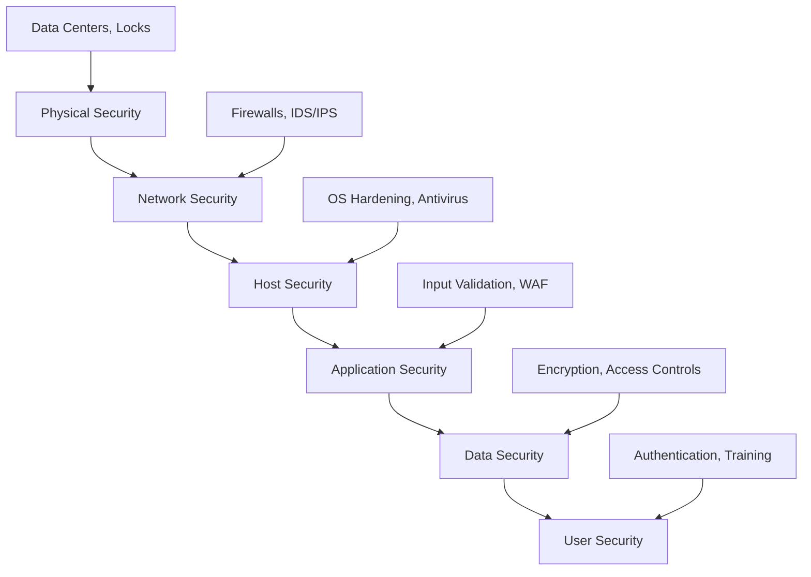
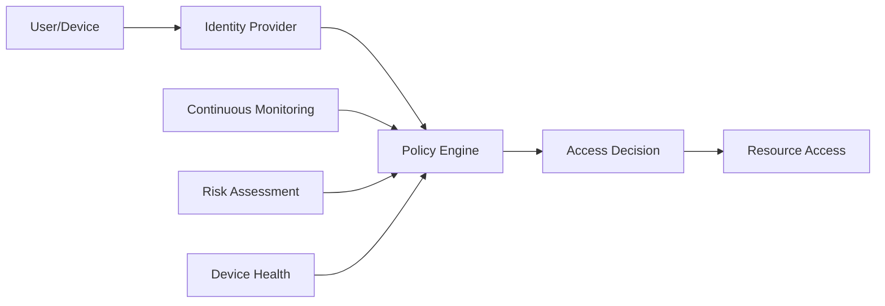

# Security Principles

## The CIA Triad

The foundation of information security rests on three core principles, known as the CIA Triad:

### Confidentiality
**Definition**: Ensuring that information is accessible only to those authorized to have access.

**System Design Applications**:
- Encrypt sensitive data both at rest and in transit
- Implement proper access controls and authentication
- Use secure communication channels (HTTPS, VPNs)
- Apply data classification and handling policies

**Example**: A healthcare system must ensure patient records are only accessible to authorized medical staff, not to unauthorized users or external attackers.

### Integrity
**Definition**: Safeguarding the accuracy and completeness of information and processing methods.

**System Design Applications**:
- Use checksums and digital signatures to verify data hasn't been tampered with
- Implement audit trails and logging
- Use database constraints and validation
- Apply version control and change management

**Example**: A financial system must ensure transaction records cannot be modified without detection, maintaining accurate account balances.

### Availability
**Definition**: Ensuring that authorized users have access to information and associated assets when required.

**System Design Applications**:
- Design for high availability with redundancy
- Implement DDoS protection and rate limiting
- Use load balancing and failover mechanisms
- Plan for disaster recovery and business continuity

**Example**: An e-commerce platform must remain accessible to customers even during peak shopping periods or attempted attacks.

## Defense in Depth

**Principle**: Implement multiple layers of security controls so that if one layer fails, others continue to provide protection.

### Security Layers



### Implementation Strategy
1. **Perimeter Security**: Firewalls, intrusion detection systems
2. **Network Segmentation**: VLANs, subnets, micro-segmentation
3. **Host Protection**: Endpoint security, patch management
4. **Application Security**: Input validation, secure coding practices
5. **Data Protection**: Encryption, access controls, data loss prevention
6. **Identity Management**: Strong authentication, authorization controls

## Principle of Least Privilege

**Definition**: Users, processes, and systems should be granted only the minimum levels of access necessary to perform their functions.

### Implementation Guidelines

**User Access**:
- Grant permissions based on job requirements
- Regularly review and revoke unnecessary permissions
- Use role-based access control (RBAC)
- Implement just-in-time (JIT) access for administrative tasks

**System Access**:
- Run services with minimal required privileges
- Use service accounts with limited permissions
- Implement network segmentation to limit lateral movement
- Apply the principle to API access and database connections

**Example Implementation**:
```yaml
# Example RBAC Configuration
roles:
  - name: "read-only-user"
    permissions:
      - "read:user-profile"
      - "read:public-content"
  
  - name: "content-moderator"
    permissions:
      - "read:user-content"
      - "update:content-status"
      - "delete:inappropriate-content"
  
  - name: "admin"
    permissions:
      - "read:*"
      - "write:*"
      - "delete:*"
```

## Zero Trust Architecture

**Principle**: "Never trust, always verify" - assume no implicit trust based on network location.

### Core Components

**Identity Verification**:
- Multi-factor authentication (MFA)
- Continuous authentication and authorization
- Device identity and health verification

**Least Privilege Access**:
- Just-in-time and just-enough access
- Risk-based conditional access
- Micro-segmentation of networks

**Assume Breach**:
- Continuous monitoring and analytics
- Encrypted communications everywhere
- Detailed logging and audit trails

### Zero Trust Implementation



## Security by Design

**Principle**: Integrate security considerations into every phase of system development, not as an afterthought.

### Design Phase Security Considerations

**Threat Modeling**:
- Identify potential threats and attack vectors
- Analyze system components and data flows
- Prioritize risks based on likelihood and impact
- Design countermeasures for identified threats

**Secure Architecture Patterns**:
- Use established secure design patterns
- Implement proper separation of concerns
- Design for security monitoring and incident response
- Plan for security updates and patches

### Security Requirements Integration

**Functional Requirements**:
- Authentication and authorization mechanisms
- Data encryption and protection requirements
- Audit logging and monitoring capabilities
- Incident response and recovery procedures

**Non-Functional Requirements**:
- Performance impact of security controls
- Scalability of security mechanisms
- Usability of security features
- Compliance with regulatory requirements

## Risk Management Framework

### Risk Assessment Process

1. **Asset Identification**: Catalog all system assets and their value
2. **Threat Identification**: Identify potential threats to each asset
3. **Vulnerability Assessment**: Identify weaknesses that could be exploited
4. **Risk Analysis**: Calculate risk = Threat × Vulnerability × Impact
5. **Risk Treatment**: Accept, avoid, transfer, or mitigate risks

### Risk Treatment Strategies

**Accept**: Acknowledge the risk but take no action (low impact/probability)
**Avoid**: Eliminate the risk by removing the threat or vulnerability
**Transfer**: Share the risk through insurance or outsourcing
**Mitigate**: Reduce the likelihood or impact through controls

## Compliance and Regulatory Considerations

### Common Frameworks and Standards

**SOC 2**: Security, availability, processing integrity, confidentiality, privacy
**ISO 27001**: Information security management systems
**NIST Cybersecurity Framework**: Identify, protect, detect, respond, recover
**PCI DSS**: Payment card industry data security standard

### Compliance Integration

- Map security controls to regulatory requirements
- Implement continuous compliance monitoring
- Maintain documentation and evidence collection
- Regular audits and assessments

## Key Takeaways

1. **Security is foundational**: Build security into your system from the ground up
2. **Multiple layers**: No single security control is sufficient
3. **Least privilege**: Grant only necessary access and permissions
4. **Continuous verification**: Don't trust based on location or previous authentication
5. **Risk-based approach**: Focus security efforts where they matter most
6. **Compliance awareness**: Understand regulatory requirements for your domain

## Next Steps

Now that you understand the fundamental security principles, let's explore how to implement [Authentication & Authorization](02-auth-concepts.md) in distributed systems.