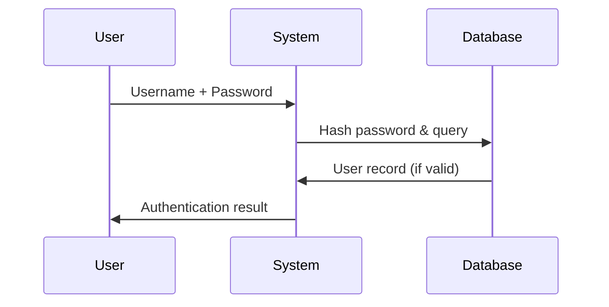
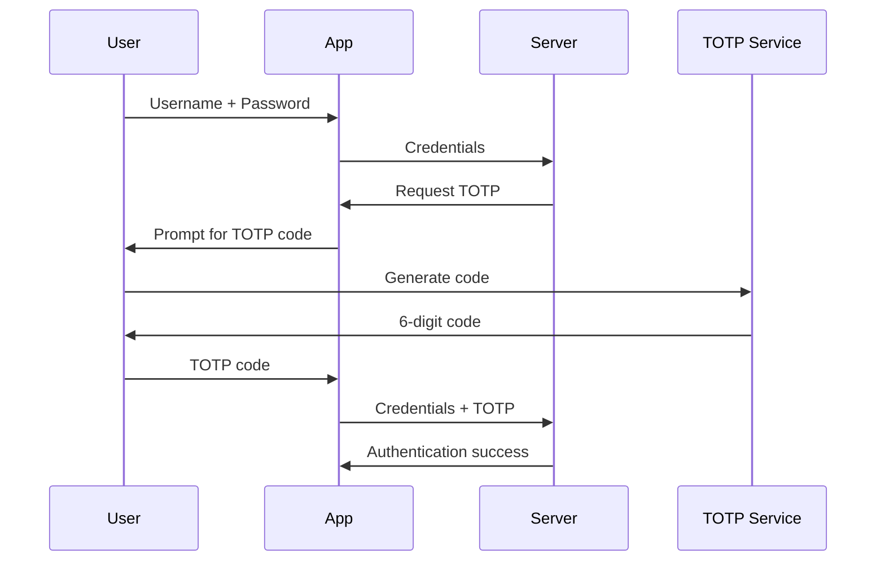
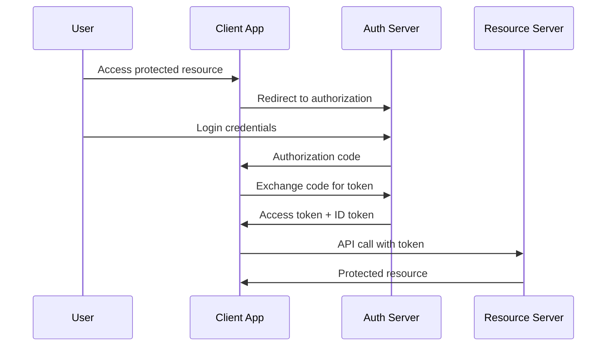
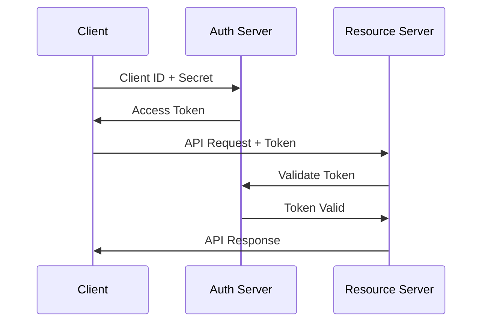
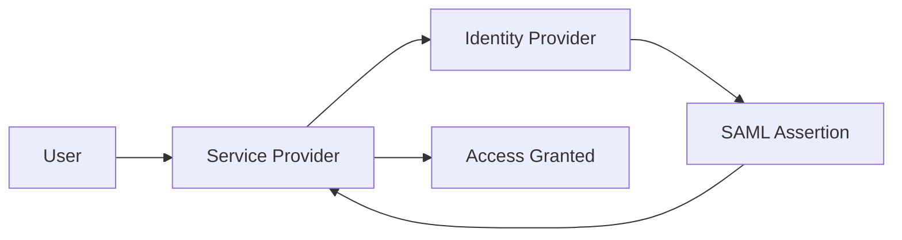
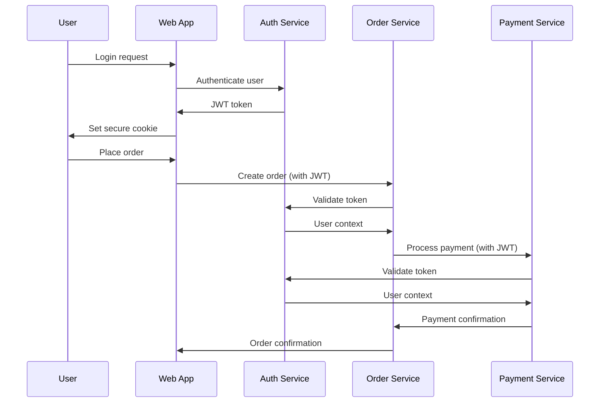

# Authentication & Authorization Concepts

## Authentication vs Authorization

Understanding the distinction between authentication and authorization is crucial for designing secure systems.

### Authentication (AuthN)
**"Who are you?"** - The process of verifying the identity of a user, device, or system.

**Methods**:
- **Something you know**: Passwords, PINs, security questions
- **Something you have**: Smart cards, tokens, mobile devices
- **Something you are**: Biometrics (fingerprints, facial recognition)
- **Somewhere you are**: Location-based authentication

### Authorization (AuthZ)
**"What can you do?"** - The process of determining what actions an authenticated user is allowed to perform.

**Models**:
- **Role-Based Access Control (RBAC)**: Permissions based on user roles
- **Attribute-Based Access Control (ABAC)**: Permissions based on attributes
- **Discretionary Access Control (DAC)**: Resource owners control access
- **Mandatory Access Control (MAC)**: System-enforced access policies

## Authentication Mechanisms

### Password-Based Authentication

**Traditional Approach**:


**Security Considerations**:
- Store password hashes, never plaintext
- Use strong hashing algorithms (bcrypt, Argon2)
- Implement password complexity requirements
- Protect against brute force attacks

**Password Hashing Example**:
```python
import bcrypt

# Hashing a password
password = "user_password"
salt = bcrypt.gensalt()
hashed = bcrypt.hashpw(password.encode('utf-8'), salt)

# Verifying a password
def verify_password(password, hashed):
    return bcrypt.checkpw(password.encode('utf-8'), hashed)
```

### Multi-Factor Authentication (MFA)

**Two-Factor Authentication (2FA)**:
Combines two different authentication factors for enhanced security.

**Common 2FA Methods**:
- SMS codes (less secure due to SIM swapping)
- Time-based One-Time Passwords (TOTP) - Google Authenticator, Authy
- Hardware tokens (YubiKey, RSA SecurID)
- Push notifications to mobile apps

**TOTP Implementation Flow**:


### Single Sign-On (SSO)

**Benefits**:
- Improved user experience (one login for multiple services)
- Centralized authentication management
- Reduced password fatigue
- Better security monitoring

**Common SSO Protocols**:

#### SAML (Security Assertion Markup Language)
```xml
<!-- Example SAML Assertion -->
<saml:Assertion>
    <saml:Subject>
        <saml:NameID Format="urn:oasis:names:tc:SAML:1.1:nameid-format:emailAddress">
            user@example.com
        </saml:NameID>
    </saml:Subject>
    <saml:AttributeStatement>
        <saml:Attribute Name="Role">
            <saml:AttributeValue>Admin</saml:AttributeValue>
        </saml:Attribute>
    </saml:AttributeStatement>
</saml:Assertion>
```

#### OAuth 2.0 / OpenID Connect


## Authorization Models

### Role-Based Access Control (RBAC)

**Components**:
- **Users**: Individual entities requiring access
- **Roles**: Job functions with associated permissions
- **Permissions**: Specific actions on resources
- **Sessions**: User activates subset of roles

**RBAC Example**:
```yaml
# User-Role Assignments
users:
  - username: "alice"
    roles: ["editor", "reviewer"]
  - username: "bob"
    roles: ["admin"]

# Role-Permission Assignments
roles:
  - name: "editor"
    permissions:
      - "create:article"
      - "update:own-article"
      - "read:article"
  
  - name: "reviewer"
    permissions:
      - "read:article"
      - "approve:article"
  
  - name: "admin"
    permissions:
      - "create:*"
      - "read:*"
      - "update:*"
      - "delete:*"
```

### Attribute-Based Access Control (ABAC)

**More flexible than RBAC**, uses attributes of users, resources, and environment to make access decisions.

**ABAC Policy Example**:
```json
{
  "policy": {
    "description": "Doctors can access patient records during business hours",
    "rule": {
      "effect": "permit",
      "condition": {
        "and": [
          {"equals": {"user.role": "doctor"}},
          {"equals": {"resource.type": "patient-record"}},
          {"between": {"environment.time": ["09:00", "17:00"]}},
          {"equals": {"user.department": "resource.department"}}
        ]
      }
    }
  }
}
```

## Token-Based Authentication

### JSON Web Tokens (JWT)

**Structure**: Header.Payload.Signature

**JWT Example**:
```javascript
// Header
{
  "alg": "HS256",
  "typ": "JWT"
}

// Payload
{
  "sub": "1234567890",
  "name": "John Doe",
  "role": "admin",
  "iat": 1516239022,
  "exp": 1516242622
}

// Signature
HMACSHA256(
  base64UrlEncode(header) + "." +
  base64UrlEncode(payload),
  secret
)
```

**JWT Validation Process**:
```python
import jwt
import datetime

def create_jwt_token(user_id, role, secret_key):
    payload = {
        'user_id': user_id,
        'role': role,
        'exp': datetime.datetime.utcnow() + datetime.timedelta(hours=1),
        'iat': datetime.datetime.utcnow()
    }
    return jwt.encode(payload, secret_key, algorithm='HS256')

def validate_jwt_token(token, secret_key):
    try:
        payload = jwt.decode(token, secret_key, algorithms=['HS256'])
        return payload
    except jwt.ExpiredSignatureError:
        return None  # Token expired
    except jwt.InvalidTokenError:
        return None  # Invalid token
```

### Session-Based vs Token-Based Authentication

| Aspect | Session-Based | Token-Based |
|--------|---------------|-------------|
| **Storage** | Server-side session store | Client-side token |
| **Scalability** | Requires sticky sessions or shared storage | Stateless, easily scalable |
| **Security** | Session ID in cookie | Token in header/cookie |
| **Revocation** | Immediate (delete session) | Challenging (token blacklist) |
| **Cross-Domain** | Limited by cookie policies | Flexible with headers |

## API Authentication Patterns

### API Keys

**Simple but limited approach**:
```http
GET /api/users
Authorization: Bearer api_key_here
```

**Limitations**:
- No user context
- Difficult to rotate
- All-or-nothing permissions

### OAuth 2.0 for APIs

**Grant Types**:

1. **Authorization Code**: For web applications
2. **Client Credentials**: For service-to-service
3. **Resource Owner Password**: For trusted applications
4. **Implicit**: For single-page applications (deprecated)

**Client Credentials Flow**:


## Identity Providers and Federation

### Enterprise Identity Providers

**Active Directory (AD)**:
- On-premises identity management
- Kerberos authentication
- Group-based authorization

**Azure Active Directory (Azure AD)**:
- Cloud-based identity service
- SAML, OAuth, OpenID Connect support
- Conditional access policies

### Social Identity Providers

**Benefits**:
- Reduced friction for user registration
- Leverages existing user accounts
- Offloads identity management complexity

**Common Providers**:
- Google (OpenID Connect)
- Facebook (OAuth 2.0)
- GitHub (OAuth 2.0)
- Microsoft (Azure AD)

### Identity Federation

**SAML Federation Example**:


## Security Considerations

### Authentication Security

**Password Security**:
- Enforce strong password policies
- Implement account lockout mechanisms
- Use secure password reset processes
- Monitor for credential stuffing attacks

**Token Security**:
- Use short-lived access tokens
- Implement token refresh mechanisms
- Secure token storage (HttpOnly cookies, secure storage)
- Validate tokens on every request

### Authorization Security

**Privilege Escalation Prevention**:
- Regular access reviews and audits
- Implement separation of duties
- Use principle of least privilege
- Monitor for unusual access patterns

**Common Vulnerabilities**:
- **Broken Authentication**: Weak session management
- **Broken Access Control**: Inadequate authorization checks
- **Security Misconfiguration**: Default credentials, open permissions
- **Insecure Direct Object References**: Missing authorization checks

## Implementation Best Practices

### Authentication Best Practices

1. **Use established protocols**: OAuth 2.0, OpenID Connect, SAML
2. **Implement MFA**: Especially for privileged accounts
3. **Secure credential storage**: Hash passwords, encrypt tokens
4. **Monitor authentication events**: Failed logins, unusual patterns
5. **Implement rate limiting**: Prevent brute force attacks

### Authorization Best Practices

1. **Default deny**: Explicitly grant permissions, deny by default
2. **Centralized policy management**: Single source of truth for permissions
3. **Regular access reviews**: Audit and update permissions regularly
4. **Implement RBAC/ABAC**: Use structured access control models
5. **Log authorization decisions**: Audit trail for compliance

## Real-World Examples

### E-commerce Platform Authentication Flow



### Microservices Authorization

```yaml
# Service mesh authorization policy
apiVersion: security.istio.io/v1beta1
kind: AuthorizationPolicy
metadata:
  name: order-service-policy
spec:
  selector:
    matchLabels:
      app: order-service
  rules:
  - from:
    - source:
        principals: ["cluster.local/ns/default/sa/web-app"]
  - to:
    - operation:
        methods: ["GET", "POST"]
        paths: ["/orders/*"]
  - when:
    - key: request.headers[authorization]
      values: ["Bearer *"]
```

## Key Takeaways

1. **Authentication verifies identity**, authorization controls access
2. **MFA significantly improves security** over passwords alone
3. **Token-based authentication scales better** than session-based
4. **Use established protocols** (OAuth 2.0, OpenID Connect, SAML)
5. **Implement least privilege** and regular access reviews
6. **Monitor and audit** authentication and authorization events

## Next Steps

Understanding authentication and authorization is crucial, but you also need to protect against various security threats. Let's explore [Common Security Threats](03-threats.md) and their mitigation strategies.