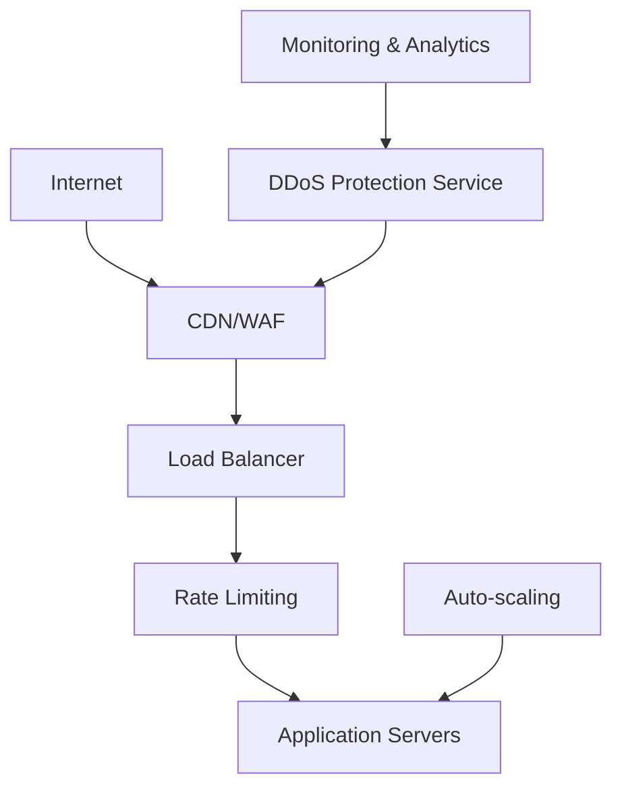

# Common Security Threats

## OWASP Top 10 Web Application Security Risks

The Open Web Application Security Project (OWASP) maintains a list of the most critical web application security risks. Understanding these threats is essential for building secure systems.

### 1. Broken Access Control

**Description**: Restrictions on what authenticated users are allowed to do are often not properly enforced.

**Examples**:
- Accessing other users' accounts by modifying URLs
- Viewing or editing someone else's data
- Privilege escalation (acting as admin without proper authorization)

**Attack Example**:
```http
# Attacker changes user ID in URL
GET /api/users/123/profile  # Legitimate request
GET /api/users/456/profile  # Unauthorized access to another user
```

**Mitigation Strategies**:
- Implement proper authorization checks on every request
- Use centralized access control mechanisms
- Deny by default, explicitly grant permissions
- Log and monitor access control failures

```python
# Secure implementation example
def get_user_profile(user_id, requesting_user):
    # Always verify the requesting user can access this profile
    if not can_access_profile(requesting_user, user_id):
        raise UnauthorizedError("Access denied")
    
    return database.get_user_profile(user_id)

def can_access_profile(requesting_user, target_user_id):
    # Users can access their own profile
    if requesting_user.id == target_user_id:
        return True
    
    # Admins can access any profile
    if requesting_user.has_role('admin'):
        return True
    
    return False
```

### 2. Cryptographic Failures

**Description**: Failures related to cryptography that often lead to sensitive data exposure.

**Common Issues**:
- Storing sensitive data in plaintext
- Using weak or outdated cryptographic algorithms
- Poor key management practices
- Insufficient protection of data in transit

**Vulnerable Code Example**:
```python
# BAD: Storing passwords in plaintext
user = {
    'username': 'alice',
    'password': 'mypassword123'  # Never do this!
}

# BAD: Using weak hashing
import hashlib
password_hash = hashlib.md5(password.encode()).hexdigest()  # MD5 is broken
```

**Secure Implementation**:
```python
# GOOD: Using strong password hashing
import bcrypt

def hash_password(password):
    salt = bcrypt.gensalt()
    return bcrypt.hashpw(password.encode('utf-8'), salt)

def verify_password(password, hashed):
    return bcrypt.checkpw(password.encode('utf-8'), hashed)

# GOOD: Encrypting sensitive data at rest
from cryptography.fernet import Fernet

def encrypt_sensitive_data(data, key):
    f = Fernet(key)
    return f.encrypt(data.encode())

def decrypt_sensitive_data(encrypted_data, key):
    f = Fernet(key)
    return f.decrypt(encrypted_data).decode()
```

### 3. Injection Attacks

**Description**: Untrusted data is sent to an interpreter as part of a command or query.

#### SQL Injection

**Vulnerable Code**:
```python
# BAD: Direct string concatenation
def get_user(username):
    query = f"SELECT * FROM users WHERE username = '{username}'"
    return database.execute(query)

# Attack: username = "admin'; DROP TABLE users; --"
```

**Secure Implementation**:
```python
# GOOD: Using parameterized queries
def get_user(username):
    query = "SELECT * FROM users WHERE username = ?"
    return database.execute(query, (username,))

# GOOD: Using ORM with built-in protection
def get_user(username):
    return User.objects.filter(username=username).first()
```

#### NoSQL Injection

**Vulnerable Code**:
```javascript
// BAD: Direct object construction
app.post('/login', (req, res) => {
    const { username, password } = req.body;
    
    db.collection('users').findOne({
        username: username,
        password: password
    });
});

// Attack payload: {"username": {"$ne": null}, "password": {"$ne": null}}
```

**Secure Implementation**:
```javascript
// GOOD: Input validation and sanitization
app.post('/login', (req, res) => {
    const { username, password } = req.body;
    
    // Validate input types
    if (typeof username !== 'string' || typeof password !== 'string') {
        return res.status(400).json({ error: 'Invalid input' });
    }
    
    db.collection('users').findOne({
        username: username,
        password: hashPassword(password)
    });
});
```

### 4. Insecure Design

**Description**: Missing or ineffective control design that cannot be fixed by implementation.

**Examples**:
- Lack of rate limiting on password reset
- Missing step-up authentication for sensitive operations
- Insufficient logging and monitoring

**Secure Design Patterns**:

**Rate Limiting Implementation**:
```python
from functools import wraps
import time
from collections import defaultdict

class RateLimiter:
    def __init__(self, max_requests=5, window_seconds=300):
        self.max_requests = max_requests
        self.window_seconds = window_seconds
        self.requests = defaultdict(list)
    
    def is_allowed(self, identifier):
        now = time.time()
        # Clean old requests
        self.requests[identifier] = [
            req_time for req_time in self.requests[identifier]
            if now - req_time < self.window_seconds
        ]
        
        if len(self.requests[identifier]) >= self.max_requests:
            return False
        
        self.requests[identifier].append(now)
        return True

# Usage in password reset
password_reset_limiter = RateLimiter(max_requests=3, window_seconds=3600)

def reset_password(email):
    if not password_reset_limiter.is_allowed(email):
        raise TooManyRequestsError("Too many password reset attempts")
    
    # Proceed with password reset
    send_reset_email(email)
```

### 5. Security Misconfiguration

**Description**: Missing appropriate security hardening or improperly configured permissions.

**Common Misconfigurations**:
- Default credentials still in use
- Unnecessary features enabled
- Missing security headers
- Verbose error messages revealing system information

**Security Headers Implementation**:
```python
# Flask example with security headers
from flask import Flask
from flask_talisman import Talisman

app = Flask(__name__)

# Configure security headers
Talisman(app, {
    'force_https': True,
    'strict_transport_security': True,
    'content_security_policy': {
        'default-src': "'self'",
        'script-src': "'self' 'unsafe-inline'",
        'style-src': "'self' 'unsafe-inline'"
    },
    'referrer_policy': 'strict-origin-when-cross-origin'
})

@app.after_request
def add_security_headers(response):
    response.headers['X-Content-Type-Options'] = 'nosniff'
    response.headers['X-Frame-Options'] = 'DENY'
    response.headers['X-XSS-Protection'] = '1; mode=block'
    return response
```

### 6. Vulnerable and Outdated Components

**Description**: Using components with known vulnerabilities or that are no longer supported.

**Mitigation Strategies**:
- Maintain an inventory of all components and versions
- Regularly update dependencies
- Use automated vulnerability scanning
- Subscribe to security advisories

**Dependency Management Example**:
```yaml
# GitHub Dependabot configuration
version: 2
updates:
  - package-ecosystem: "npm"
    directory: "/"
    schedule:
      interval: "weekly"
    open-pull-requests-limit: 10
    
  - package-ecosystem: "pip"
    directory: "/"
    schedule:
      interval: "weekly"
```

### 7. Identification and Authentication Failures

**Description**: Confirmation of user identity, authentication, and session management is critical.

**Common Issues**:
- Weak password requirements
- Credential stuffing attacks
- Session fixation
- Missing or ineffective multi-factor authentication

**Secure Session Management**:
```python
import secrets
import hashlib
from datetime import datetime, timedelta

class SessionManager:
    def __init__(self):
        self.sessions = {}
        self.session_timeout = timedelta(hours=2)
    
    def create_session(self, user_id):
        session_id = secrets.token_urlsafe(32)
        session_data = {
            'user_id': user_id,
            'created_at': datetime.utcnow(),
            'last_accessed': datetime.utcnow()
        }
        self.sessions[session_id] = session_data
        return session_id
    
    def validate_session(self, session_id):
        if session_id not in self.sessions:
            return None
        
        session = self.sessions[session_id]
        
        # Check if session has expired
        if datetime.utcnow() - session['last_accessed'] > self.session_timeout:
            del self.sessions[session_id]
            return None
        
        # Update last accessed time
        session['last_accessed'] = datetime.utcnow()
        return session['user_id']
    
    def invalidate_session(self, session_id):
        if session_id in self.sessions:
            del self.sessions[session_id]
```

## Distributed Denial of Service (DDoS) Attacks

### Types of DDoS Attacks

**Volume-Based Attacks**:
- UDP floods
- ICMP floods
- Amplification attacks (DNS, NTP, Memcached)

**Protocol Attacks**:
- SYN floods
- Ping of Death
- Smurf attacks

**Application Layer Attacks**:
- HTTP floods
- Slowloris attacks
- Application-specific attacks

### DDoS Mitigation Architecture



**Implementation Strategies**:

1. **Rate Limiting at Multiple Layers**:
```nginx
# Nginx rate limiting configuration
http {
    limit_req_zone $binary_remote_addr zone=api:10m rate=10r/s;
    limit_req_zone $binary_remote_addr zone=login:10m rate=1r/s;
    
    server {
        location /api/ {
            limit_req zone=api burst=20 nodelay;
        }
        
        location /login {
            limit_req zone=login burst=5;
        }
    }
}
```

2. **Application-Level Protection**:
```python
from functools import wraps
import time

def rate_limit(max_requests=100, window=60):
    def decorator(func):
        func.call_times = []
        
        @wraps(func)
        def wrapper(*args, **kwargs):
            now = time.time()
            # Remove old calls outside the window
            func.call_times = [call_time for call_time in func.call_times 
                             if now - call_time < window]
            
            if len(func.call_times) >= max_requests:
                raise TooManyRequestsError("Rate limit exceeded")
            
            func.call_times.append(now)
            return func(*args, **kwargs)
        
        return wrapper
    return decorator

@rate_limit(max_requests=50, window=60)
def api_endpoint():
    # Your API logic here
    pass
```

## Cross-Site Scripting (XSS)

### Types of XSS

**Stored XSS**: Malicious script stored on the server
**Reflected XSS**: Script reflected from user input
**DOM-based XSS**: Client-side script manipulation

### XSS Prevention

**Input Validation and Sanitization**:
```python
import html
import re

def sanitize_input(user_input):
    # HTML encode special characters
    sanitized = html.escape(user_input)
    
    # Remove potentially dangerous patterns
    sanitized = re.sub(r'javascript:', '', sanitized, flags=re.IGNORECASE)
    sanitized = re.sub(r'on\w+\s*=', '', sanitized, flags=re.IGNORECASE)
    
    return sanitized

# Content Security Policy header
def add_csp_header(response):
    csp = (
        "default-src 'self'; "
        "script-src 'self' 'unsafe-inline'; "
        "style-src 'self' 'unsafe-inline'; "
        "img-src 'self' data: https:; "
        "font-src 'self' https:; "
        "connect-src 'self'"
    )
    response.headers['Content-Security-Policy'] = csp
    return response
```

## Cross-Site Request Forgery (CSRF)

### CSRF Attack Example

```html
<!-- Malicious website -->
<form action="https://bank.com/transfer" method="POST" style="display:none">
    <input name="to" value="attacker_account">
    <input name="amount" value="1000">
</form>
<script>document.forms[0].submit();</script>
```

### CSRF Protection

**CSRF Token Implementation**:
```python
import secrets
import hmac
import hashlib

class CSRFProtection:
    def __init__(self, secret_key):
        self.secret_key = secret_key
    
    def generate_token(self, session_id):
        # Generate a random token
        random_token = secrets.token_urlsafe(32)
        
        # Create HMAC signature
        message = f"{session_id}:{random_token}"
        signature = hmac.new(
            self.secret_key.encode(),
            message.encode(),
            hashlib.sha256
        ).hexdigest()
        
        return f"{random_token}:{signature}"
    
    def validate_token(self, token, session_id):
        try:
            random_token, signature = token.split(':', 1)
            
            # Recreate the message and signature
            message = f"{session_id}:{random_token}"
            expected_signature = hmac.new(
                self.secret_key.encode(),
                message.encode(),
                hashlib.sha256
            ).hexdigest()
            
            # Use constant-time comparison
            return hmac.compare_digest(signature, expected_signature)
        except ValueError:
            return False

# Usage in web framework
@csrf_protection.required
def transfer_money(request):
    # This endpoint is protected against CSRF
    pass
```

## Server-Side Request Forgery (SSRF)

### SSRF Attack Example

```python
# Vulnerable code
import requests

def fetch_url(user_provided_url):
    # Dangerous: No validation of URL
    response = requests.get(user_provided_url)
    return response.text

# Attack: user_provided_url = "http://169.254.169.254/latest/meta-data/"
# This could access AWS metadata service
```

### SSRF Prevention

```python
import requests
import ipaddress
from urllib.parse import urlparse

class SSRFProtection:
    def __init__(self):
        self.blocked_networks = [
            ipaddress.ip_network('127.0.0.0/8'),    # Loopback
            ipaddress.ip_network('10.0.0.0/8'),     # Private
            ipaddress.ip_network('172.16.0.0/12'),  # Private
            ipaddress.ip_network('192.168.0.0/16'), # Private
            ipaddress.ip_network('169.254.0.0/16'), # Link-local
        ]
        self.allowed_schemes = ['http', 'https']
    
    def is_safe_url(self, url):
        try:
            parsed = urlparse(url)
            
            # Check scheme
            if parsed.scheme not in self.allowed_schemes:
                return False
            
            # Resolve hostname to IP
            import socket
            ip = socket.gethostbyname(parsed.hostname)
            ip_addr = ipaddress.ip_address(ip)
            
            # Check if IP is in blocked networks
            for network in self.blocked_networks:
                if ip_addr in network:
                    return False
            
            return True
        except Exception:
            return False
    
    def safe_fetch(self, url, timeout=10):
        if not self.is_safe_url(url):
            raise SecurityError("URL not allowed")
        
        return requests.get(url, timeout=timeout)
```

## Security Monitoring and Incident Response

### Security Event Logging

```python
import logging
import json
from datetime import datetime

class SecurityLogger:
    def __init__(self):
        self.logger = logging.getLogger('security')
        handler = logging.FileHandler('security.log')
        formatter = logging.Formatter('%(asctime)s - %(message)s')
        handler.setFormatter(formatter)
        self.logger.addHandler(handler)
        self.logger.setLevel(logging.INFO)
    
    def log_security_event(self, event_type, user_id=None, ip_address=None, 
                          details=None, severity='INFO'):
        event = {
            'timestamp': datetime.utcnow().isoformat(),
            'event_type': event_type,
            'user_id': user_id,
            'ip_address': ip_address,
            'details': details,
            'severity': severity
        }
        
        self.logger.info(json.dumps(event))
    
    def log_failed_login(self, username, ip_address):
        self.log_security_event(
            'FAILED_LOGIN',
            user_id=username,
            ip_address=ip_address,
            details={'reason': 'Invalid credentials'},
            severity='WARNING'
        )
    
    def log_privilege_escalation_attempt(self, user_id, requested_resource):
        self.log_security_event(
            'PRIVILEGE_ESCALATION',
            user_id=user_id,
            details={'requested_resource': requested_resource},
            severity='CRITICAL'
        )
```

### Automated Threat Detection

```python
from collections import defaultdict
import time

class ThreatDetector:
    def __init__(self):
        self.failed_logins = defaultdict(list)
        self.suspicious_ips = set()
    
    def analyze_login_attempt(self, username, ip_address, success):
        if not success:
            now = time.time()
            self.failed_logins[ip_address].append(now)
            
            # Remove old attempts (older than 1 hour)
            self.failed_logins[ip_address] = [
                attempt for attempt in self.failed_logins[ip_address]
                if now - attempt < 3600
            ]
            
            # Check for brute force attack
            if len(self.failed_logins[ip_address]) > 10:
                self.suspicious_ips.add(ip_address)
                self.trigger_alert('BRUTE_FORCE_DETECTED', {
                    'ip_address': ip_address,
                    'failed_attempts': len(self.failed_logins[ip_address])
                })
    
    def trigger_alert(self, alert_type, details):
        # Send alert to security team
        print(f"SECURITY ALERT: {alert_type} - {details}")
        # In real implementation, send to SIEM, email, Slack, etc.
```

## Key Takeaways

1. **Input validation is crucial** - Never trust user input
2. **Use parameterized queries** to prevent injection attacks
3. **Implement proper access controls** and validate on every request
4. **Keep dependencies updated** and monitor for vulnerabilities
5. **Use security headers** to protect against common web attacks
6. **Implement rate limiting** to prevent abuse and DDoS
7. **Log security events** and monitor for suspicious activity
8. **Follow secure coding practices** from the start

## Next Steps

Now that you understand common threats and their mitigations, let's dive deeper into [Encryption Fundamentals](04-encryption.md) to learn how to protect data at rest and in transit.