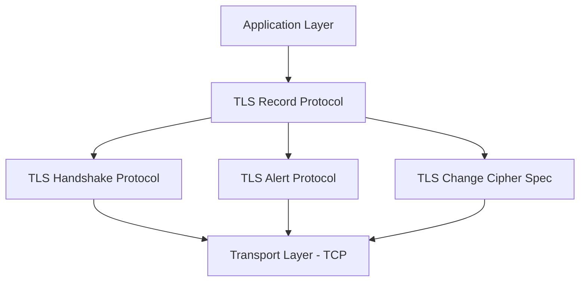
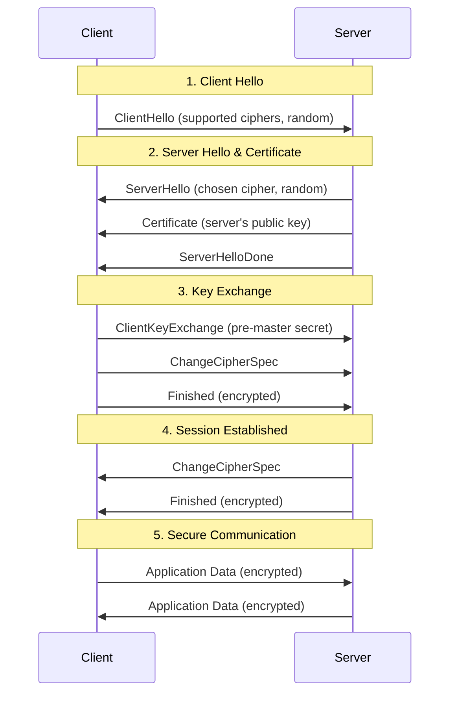
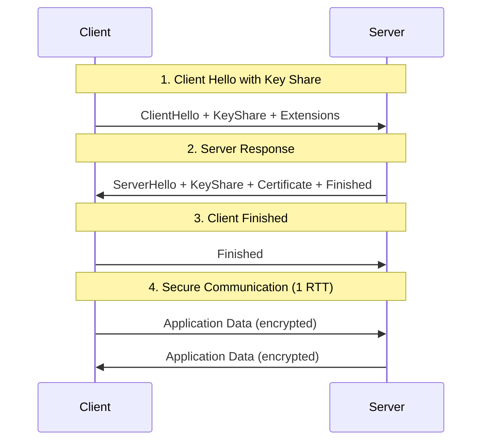

# HTTPS & TLS/SSL

## Introduction to Transport Layer Security

Transport Layer Security (TLS) and its predecessor Secure Sockets Layer (SSL) are cryptographic protocols that provide secure communication over computer networks. HTTPS is HTTP over TLS/SSL, ensuring that web traffic is encrypted and authenticated.

## TLS/SSL Protocol Overview

### Protocol Versions

**SSL Versions (Deprecated)**:
- SSL 1.0: Never released (had security flaws)
- SSL 2.0: Deprecated (1995, serious security vulnerabilities)
- SSL 3.0: Deprecated (1996, vulnerable to POODLE attack)

**TLS Versions**:
- TLS 1.0: Deprecated (1999, vulnerable to BEAST attack)
- TLS 1.1: Deprecated (2006, vulnerable to BEAST attack)
- TLS 1.2: Current standard (2008, widely supported)
- TLS 1.3: Latest version (2018, improved security and performance)

### TLS Architecture



## TLS Handshake Process

### TLS 1.2 Handshake



### TLS 1.3 Handshake (Simplified)



### Detailed Handshake Analysis

**1. ClientHello Message**:
```
ClientHello {
    protocol_version: TLS 1.2
    random: 32-byte random value
    session_id: session identifier (for resumption)
    cipher_suites: [
        TLS_ECDHE_RSA_WITH_AES_256_GCM_SHA384,
        TLS_ECDHE_RSA_WITH_AES_128_GCM_SHA256,
        TLS_RSA_WITH_AES_256_CBC_SHA256
    ]
    compression_methods: [null]
    extensions: [
        server_name: example.com
        supported_groups: [secp256r1, secp384r1]
        signature_algorithms: [rsa_pkcs1_sha256, ecdsa_secp256r1_sha256]
    ]
}
```

**2. ServerHello Message**:
```
ServerHello {
    protocol_version: TLS 1.2
    random: 32-byte random value
    session_id: session identifier
    cipher_suite: TLS_ECDHE_RSA_WITH_AES_256_GCM_SHA384
    compression_method: null
    extensions: [
        renegotiation_info: empty
    ]
}
```

## Certificate Management

### X.509 Certificates

**Certificate Structure**:
```
Certificate {
    Version: 3
    Serial Number: 0x1a2b3c4d5e6f
    Signature Algorithm: sha256WithRSAEncryption
    Issuer: CN=DigiCert SHA2 Extended Validation Server CA
    Validity:
        Not Before: Jan 1 00:00:00 2023 GMT
        Not After: Jan 1 23:59:59 2024 GMT
    Subject: CN=example.com, O=Example Corp, C=US
    Subject Public Key Info:
        Public Key Algorithm: rsaEncryption
        RSA Public Key: (2048 bit)
    Extensions:
        Subject Alternative Name: DNS:example.com, DNS:www.example.com
        Key Usage: Digital Signature, Key Encipherment
        Extended Key Usage: TLS Web Server Authentication
}
```

### Certificate Validation Process

```python
import ssl
import socket
from cryptography import x509
from cryptography.hazmat.backends import default_backend
import datetime

class CertificateValidator:
    def __init__(self):
        self.trusted_cas = self._load_trusted_cas()
    
    def _load_trusted_cas(self):
        """Load trusted Certificate Authorities"""
        # In practice, load from system trust store
        return []
    
    def validate_certificate_chain(self, hostname, port=443):
        """Validate certificate chain for a hostname"""
        try:
            # Get certificate chain
            context = ssl.create_default_context()
            with socket.create_connection((hostname, port)) as sock:
                with context.wrap_socket(sock, server_hostname=hostname) as ssock:
                    cert_der = ssock.getpeercert(binary_form=True)
                    cert_chain = ssock.getpeercert_chain()
            
            # Parse certificate
            cert = x509.load_der_x509_certificate(cert_der, default_backend())
            
            # Validation checks
            validation_results = {
                'hostname_match': self._validate_hostname(cert, hostname),
                'expiry_valid': self._validate_expiry(cert),
                'signature_valid': self._validate_signature(cert),
                'chain_valid': self._validate_chain(cert_chain),
                'revocation_status': self._check_revocation(cert)
            }
            
            return all(validation_results.values()), validation_results
            
        except Exception as e:
            return False, {'error': str(e)}
    
    def _validate_hostname(self, cert, hostname):
        """Validate certificate hostname matches"""
        try:
            # Check Subject Common Name
            subject = cert.subject
            for attribute in subject:
                if attribute.oid == x509.NameOID.COMMON_NAME:
                    if attribute.value == hostname:
                        return True
            
            # Check Subject Alternative Names
            try:
                san_ext = cert.extensions.get_extension_for_oid(
                    x509.oid.ExtensionOID.SUBJECT_ALTERNATIVE_NAME
                )
                for name in san_ext.value:
                    if isinstance(name, x509.DNSName) and name.value == hostname:
                        return True
            except x509.ExtensionNotFound:
                pass
            
            return False
        except Exception:
            return False
    
    def _validate_expiry(self, cert):
        """Check if certificate is within validity period"""
        now = datetime.datetime.utcnow()
        return cert.not_valid_before <= now <= cert.not_valid_after
    
    def _validate_signature(self, cert):
        """Validate certificate signature"""
        # Simplified - in practice, verify against issuer's public key
        try:
            # Check signature algorithm is secure
            sig_alg = cert.signature_algorithm_oid._name
            weak_algorithms = ['md5', 'sha1']
            return not any(weak in sig_alg.lower() for weak in weak_algorithms)
        except Exception:
            return False
    
    def _validate_chain(self, cert_chain):
        """Validate certificate chain"""
        # Simplified validation - check chain length and basic structure
        return len(cert_chain) >= 2  # At least server cert + intermediate
    
    def _check_revocation(self, cert):
        """Check certificate revocation status (OCSP/CRL)"""
        # Simplified - in practice, check OCSP responder or CRL
        return True  # Assume not revoked for this example

# Usage example
validator = CertificateValidator()
is_valid, details = validator.validate_certificate_chain("google.com")
print(f"Certificate valid: {is_valid}")
print(f"Validation details: {details}")
```

### Certificate Pinning

**Purpose**: Prevent man-in-the-middle attacks by pinning specific certificates or public keys.

```python
import hashlib
import ssl
import socket
from cryptography import x509
from cryptography.hazmat.backends import default_backend

class CertificatePinner:
    def __init__(self):
        # Store pinned certificate fingerprints or public key hashes
        self.pinned_certs = {
            'google.com': [
                'sha256:KwccWaCgrnaw6tsrrSO61FgLacNgG2MMLq8GE6+oP5I=',  # Example pin
                'sha256:FEzVOUp4dF3gI0ZVPRJhFbSD608T8ETpYSKqahvGZPo='   # Backup pin
            ]
        }
    
    def get_certificate_pin(self, cert_der):
        """Generate SHA-256 pin for certificate"""
        cert = x509.load_der_x509_certificate(cert_der, default_backend())
        public_key_der = cert.public_key().public_bytes(
            encoding=x509.Encoding.DER,
            format=x509.PublicFormat.SubjectPublicKeyInfo
        )
        
        # Create SHA-256 hash of public key
        pin_hash = hashlib.sha256(public_key_der).digest()
        return base64.b64encode(pin_hash).decode()
    
    def validate_pin(self, hostname, port=443):
        """Validate certificate pin for hostname"""
        if hostname not in self.pinned_certs:
            return True  # No pinning configured
        
        try:
            # Get server certificate
            context = ssl.create_default_context()
            with socket.create_connection((hostname, port)) as sock:
                with context.wrap_socket(sock, server_hostname=hostname) as ssock:
                    cert_der = ssock.getpeercert(binary_form=True)
            
            # Calculate pin
            actual_pin = self.get_certificate_pin(cert_der)
            
            # Check against pinned certificates
            expected_pins = self.pinned_certs[hostname]
            return actual_pin in expected_pins
            
        except Exception as e:
            print(f"Pin validation error: {e}")
            return False

# Usage
pinner = CertificatePinner()
pin_valid = pinner.validate_pin("google.com")
print(f"Certificate pin valid: {pin_valid}")
```

## Cipher Suites

### Cipher Suite Components

A cipher suite defines the cryptographic algorithms used in a TLS connection:

**Format**: `TLS_[Key Exchange]_[Authentication]_WITH_[Encryption]_[Hash]`

**Example**: `TLS_ECDHE_RSA_WITH_AES_256_GCM_SHA384`
- **Key Exchange**: ECDHE (Elliptic Curve Diffie-Hellman Ephemeral)
- **Authentication**: RSA
- **Encryption**: AES-256 in GCM mode
- **Hash**: SHA-384

### Cipher Suite Security Levels

**Strong Cipher Suites (Recommended)**:
```
TLS_ECDHE_ECDSA_WITH_AES_256_GCM_SHA384
TLS_ECDHE_RSA_WITH_AES_256_GCM_SHA384
TLS_ECDHE_ECDSA_WITH_AES_128_GCM_SHA256
TLS_ECDHE_RSA_WITH_AES_128_GCM_SHA256
TLS_ECDHE_ECDSA_WITH_CHACHA20_POLY1305_SHA256
TLS_ECDHE_RSA_WITH_CHACHA20_POLY1305_SHA256
```

**Weak Cipher Suites (Avoid)**:
```
TLS_RSA_WITH_RC4_128_SHA                    # RC4 is broken
TLS_RSA_WITH_3DES_EDE_CBC_SHA              # 3DES is weak
TLS_RSA_WITH_AES_128_CBC_SHA               # No forward secrecy
TLS_DHE_RSA_WITH_DES_CBC_SHA               # DES is broken
```

### Server Configuration Examples

**Nginx Configuration**:
```nginx
server {
    listen 443 ssl http2;
    server_name example.com;
    
    # Certificate configuration
    ssl_certificate /path/to/certificate.crt;
    ssl_certificate_key /path/to/private.key;
    
    # Protocol configuration
    ssl_protocols TLSv1.2 TLSv1.3;
    ssl_prefer_server_ciphers on;
    
    # Cipher suite configuration
    ssl_ciphers ECDHE-ECDSA-AES256-GCM-SHA384:ECDHE-RSA-AES256-GCM-SHA384:ECDHE-ECDSA-CHACHA20-POLY1305:ECDHE-RSA-CHACHA20-POLY1305:ECDHE-ECDSA-AES128-GCM-SHA256:ECDHE-RSA-AES128-GCM-SHA256;
    
    # Security headers
    add_header Strict-Transport-Security "max-age=31536000; includeSubDomains" always;
    add_header X-Frame-Options DENY;
    add_header X-Content-Type-Options nosniff;
    
    # OCSP stapling
    ssl_stapling on;
    ssl_stapling_verify on;
    ssl_trusted_certificate /path/to/chain.crt;
    
    location / {
        # Your application configuration
    }
}
```

**Apache Configuration**:
```apache
<VirtualHost *:443>
    ServerName example.com
    
    # Enable SSL
    SSLEngine on
    
    # Certificate configuration
    SSLCertificateFile /path/to/certificate.crt
    SSLCertificateKeyFile /path/to/private.key
    SSLCertificateChainFile /path/to/chain.crt
    
    # Protocol configuration
    SSLProtocol -all +TLSv1.2 +TLSv1.3
    SSLHonorCipherOrder on
    
    # Cipher suite configuration
    SSLCipherSuite ECDHE-ECDSA-AES256-GCM-SHA384:ECDHE-RSA-AES256-GCM-SHA384:ECDHE-ECDSA-CHACHA20-POLY1305:ECDHE-RSA-CHACHA20-POLY1305
    
    # Security headers
    Header always set Strict-Transport-Security "max-age=31536000; includeSubDomains"
    Header always set X-Frame-Options DENY
    Header always set X-Content-Type-Options nosniff
    
    # OCSP stapling
    SSLUseStapling on
    SSLStaplingCache shmcb:/tmp/stapling_cache(128000)
</VirtualHost>
```

## Perfect Forward Secrecy

### Concept

Perfect Forward Secrecy (PFS) ensures that session keys are not compromised even if the server's private key is compromised in the future.

**Without PFS**:
- Server uses its private key to decrypt the pre-master secret
- If private key is compromised, all past sessions can be decrypted

**With PFS**:
- Ephemeral keys are generated for each session
- Session keys are derived from ephemeral keys
- Compromising the server's private key doesn't affect past sessions

### Diffie-Hellman Key Exchange

```python
import os
from cryptography.hazmat.primitives.asymmetric import dh
from cryptography.hazmat.primitives import hashes, serialization

class DHKeyExchange:
    def __init__(self):
        # Generate DH parameters (in practice, use standard parameters)
        self.parameters = dh.generate_parameters(
            generator=2,
            key_size=2048
        )
    
    def generate_keypair(self):
        """Generate ephemeral DH key pair"""
        private_key = self.parameters.generate_private_key()
        public_key = private_key.public_key()
        return private_key, public_key
    
    def compute_shared_secret(self, private_key, peer_public_key):
        """Compute shared secret from private key and peer's public key"""
        shared_key = private_key.exchange(peer_public_key)
        
        # Derive session key from shared secret
        digest = hashes.Hash(hashes.SHA256())
        digest.update(shared_key)
        session_key = digest.finalize()
        
        return session_key[:32]  # 256-bit key

# Simulate key exchange between client and server
dh_exchange = DHKeyExchange()

# Server generates key pair
server_private, server_public = dh_exchange.generate_keypair()

# Client generates key pair
client_private, client_public = dh_exchange.generate_keypair()

# Both parties compute the same shared secret
server_shared = dh_exchange.compute_shared_secret(server_private, client_public)
client_shared = dh_exchange.compute_shared_secret(client_private, server_public)

print(f"Shared secrets match: {server_shared == client_shared}")
```

## HTTPS Implementation

### Python HTTPS Server

```python
import ssl
import http.server
import socketserver
from cryptography import x509
from cryptography.x509.oid import NameOID
from cryptography.hazmat.primitives import hashes, serialization
from cryptography.hazmat.primitives.asymmetric import rsa
import datetime
import ipaddress

class HTTPSServer:
    def __init__(self, host='localhost', port=8443):
        self.host = host
        self.port = port
        self.cert_file = 'server.crt'
        self.key_file = 'server.key'
    
    def generate_self_signed_cert(self):
        """Generate self-signed certificate for development"""
        # Generate private key
        private_key = rsa.generate_private_key(
            public_exponent=65537,
            key_size=2048
        )
        
        # Create certificate
        subject = issuer = x509.Name([
            x509.NameAttribute(NameOID.COUNTRY_NAME, "US"),
            x509.NameAttribute(NameOID.STATE_OR_PROVINCE_NAME, "CA"),
            x509.NameAttribute(NameOID.LOCALITY_NAME, "San Francisco"),
            x509.NameAttribute(NameOID.ORGANIZATION_NAME, "Test Company"),
            x509.NameAttribute(NameOID.COMMON_NAME, self.host),
        ])
        
        cert = x509.CertificateBuilder().subject_name(
            subject
        ).issuer_name(
            issuer
        ).public_key(
            private_key.public_key()
        ).serial_number(
            x509.random_serial_number()
        ).not_valid_before(
            datetime.datetime.utcnow()
        ).not_valid_after(
            datetime.datetime.utcnow() + datetime.timedelta(days=365)
        ).add_extension(
            x509.SubjectAlternativeName([
                x509.DNSName(self.host),
                x509.IPAddress(ipaddress.ip_address("127.0.0.1")),
            ]),
            critical=False,
        ).sign(private_key, hashes.SHA256())
        
        # Save certificate and key
        with open(self.cert_file, "wb") as f:
            f.write(cert.public_bytes(serialization.Encoding.PEM))
        
        with open(self.key_file, "wb") as f:
            f.write(private_key.private_bytes(
                encoding=serialization.Encoding.PEM,
                format=serialization.PrivateFormat.PKCS8,
                encryption_algorithm=serialization.NoEncryption()
            ))
    
    def create_ssl_context(self):
        """Create SSL context with security best practices"""
        context = ssl.SSLContext(ssl.PROTOCOL_TLS_SERVER)
        
        # Load certificate and key
        context.load_cert_chain(self.cert_file, self.key_file)
        
        # Security configuration
        context.minimum_version = ssl.TLSVersion.TLSv1_2
        context.set_ciphers('ECDHE+AESGCM:ECDHE+CHACHA20:DHE+AESGCM:DHE+CHACHA20:!aNULL:!MD5:!DSS')
        
        # Prefer server cipher order
        context.options |= ssl.OP_CIPHER_SERVER_PREFERENCE
        
        # Disable compression to prevent CRIME attack
        context.options |= ssl.OP_NO_COMPRESSION
        
        return context
    
    def start_server(self):
        """Start HTTPS server"""
        # Generate certificate if it doesn't exist
        import os
        if not os.path.exists(self.cert_file) or not os.path.exists(self.key_file):
            print("Generating self-signed certificate...")
            self.generate_self_signed_cert()
        
        # Create SSL context
        ssl_context = self.create_ssl_context()
        
        # Create HTTP handler
        class SecureHTTPRequestHandler(http.server.SimpleHTTPRequestHandler):
            def do_GET(self):
                self.send_response(200)
                self.send_header('Content-type', 'text/html')
                self.send_header('Strict-Transport-Security', 'max-age=31536000; includeSubDomains')
                self.send_header('X-Frame-Options', 'DENY')
                self.send_header('X-Content-Type-Options', 'nosniff')
                self.end_headers()
                
                response = """
                <html>
                <head><title>Secure HTTPS Server</title></head>
                <body>
                    <h1>Secure HTTPS Server</h1>
                    <p>This connection is secured with TLS.</p>
                    <p>Connection details:</p>
                    <ul>
                        <li>Protocol: HTTPS</li>
                        <li>Cipher: {}</li>
                        <li>TLS Version: {}</li>
                    </ul>
                </body>
                </html>
                """.format(
                    getattr(self.connection, 'cipher', ['Unknown'])[0] if hasattr(self.connection, 'cipher') else 'Unknown',
                    getattr(self.connection, 'version', lambda: 'Unknown')() if hasattr(self.connection, 'version') else 'Unknown'
                )
                
                self.wfile.write(response.encode())
        
        # Start server
        with socketserver.TCPServer((self.host, self.port), SecureHTTPRequestHandler) as httpd:
            httpd.socket = ssl_context.wrap_socket(httpd.socket, server_side=True)
            print(f"HTTPS Server running on https://{self.host}:{self.port}")
            print("Press Ctrl+C to stop the server")
            
            try:
                httpd.serve_forever()
            except KeyboardInterrupt:
                print("\nServer stopped")

# Usage
if __name__ == "__main__":
    server = HTTPSServer()
    server.start_server()
```

### HTTPS Client with Certificate Validation

```python
import ssl
import socket
import urllib.request
import urllib.parse
from cryptography import x509
from cryptography.hazmat.backends import default_backend

class SecureHTTPSClient:
    def __init__(self):
        self.session_cache = {}
    
    def create_secure_context(self, verify_mode=ssl.CERT_REQUIRED):
        """Create secure SSL context"""
        context = ssl.create_default_context()
        
        # Security configuration
        context.minimum_version = ssl.TLSVersion.TLSv1_2
        context.check_hostname = True
        context.verify_mode = verify_mode
        
        # Set secure cipher suites
        context.set_ciphers('ECDHE+AESGCM:ECDHE+CHACHA20:DHE+AESGCM:DHE+CHACHA20:!aNULL:!MD5:!DSS')
        
        return context
    
    def make_request(self, url, method='GET', data=None, headers=None):
        """Make secure HTTPS request"""
        if headers is None:
            headers = {}
        
        # Parse URL
        parsed_url = urllib.parse.urlparse(url)
        if parsed_url.scheme != 'https':
            raise ValueError("Only HTTPS URLs are supported")
        
        hostname = parsed_url.hostname
        port = parsed_url.port or 443
        path = parsed_url.path or '/'
        
        if parsed_url.query:
            path += '?' + parsed_url.query
        
        # Create secure connection
        context = self.create_secure_context()
        
        with socket.create_connection((hostname, port)) as sock:
            with context.wrap_socket(sock, server_hostname=hostname) as ssock:
                # Get connection info
                cipher = ssock.cipher()
                cert = ssock.getpeercert()
                
                print(f"Connected to {hostname}:{port}")
                print(f"TLS Version: {ssock.version()}")
                print(f"Cipher: {cipher[0] if cipher else 'Unknown'}")
                print(f"Certificate Subject: {cert.get('subject', 'Unknown')}")
                
                # Prepare HTTP request
                request_line = f"{method} {path} HTTP/1.1\r\n"
                headers_str = f"Host: {hostname}\r\n"
                headers_str += "Connection: close\r\n"
                
                for key, value in headers.items():
                    headers_str += f"{key}: {value}\r\n"
                
                if data:
                    headers_str += f"Content-Length: {len(data)}\r\n"
                
                headers_str += "\r\n"
                
                # Send request
                request = request_line + headers_str
                ssock.send(request.encode())
                
                if data:
                    ssock.send(data.encode() if isinstance(data, str) else data)
                
                # Receive response
                response = b""
                while True:
                    chunk = ssock.recv(4096)
                    if not chunk:
                        break
                    response += chunk
                
                return response.decode('utf-8', errors='ignore')
    
    def validate_certificate_details(self, hostname, port=443):
        """Get detailed certificate information"""
        context = ssl.create_default_context()
        
        with socket.create_connection((hostname, port)) as sock:
            with context.wrap_socket(sock, server_hostname=hostname) as ssock:
                # Get certificate in DER format
                cert_der = ssock.getpeercert(binary_form=True)
                cert = x509.load_der_x509_certificate(cert_der, default_backend())
                
                # Extract certificate details
                details = {
                    'subject': cert.subject.rfc4514_string(),
                    'issuer': cert.issuer.rfc4514_string(),
                    'serial_number': str(cert.serial_number),
                    'not_valid_before': cert.not_valid_before.isoformat(),
                    'not_valid_after': cert.not_valid_after.isoformat(),
                    'signature_algorithm': cert.signature_algorithm_oid._name,
                    'public_key_algorithm': cert.public_key().key_size if hasattr(cert.public_key(), 'key_size') else 'Unknown',
                    'extensions': []
                }
                
                # Extract extensions
                for ext in cert.extensions:
                    try:
                        details['extensions'].append({
                            'oid': ext.oid._name,
                            'critical': ext.critical,
                            'value': str(ext.value)
                        })
                    except Exception as e:
                        details['extensions'].append({
                            'oid': str(ext.oid),
                            'critical': ext.critical,
                            'value': f'Error parsing: {e}'
                        })
                
                return details

# Usage example
client = SecureHTTPSClient()

try:
    # Make secure request
    response = client.make_request('https://httpbin.org/get')
    print("Response received:")
    print(response[:500] + "..." if len(response) > 500 else response)
    
    # Get certificate details
    cert_details = client.validate_certificate_details('httpbin.org')
    print(f"\nCertificate Details:")
    print(f"Subject: {cert_details['subject']}")
    print(f"Issuer: {cert_details['issuer']}")
    print(f"Valid from: {cert_details['not_valid_before']}")
    print(f"Valid until: {cert_details['not_valid_after']}")
    
except Exception as e:
    print(f"Error: {e}")
```

## Security Best Practices

### Server-Side Configuration

**1. Use Strong TLS Versions**:
- Disable SSLv2, SSLv3, TLS 1.0, TLS 1.1
- Use TLS 1.2 and TLS 1.3 only

**2. Configure Secure Cipher Suites**:
- Prefer AEAD ciphers (GCM, ChaCha20-Poly1305)
- Enable Perfect Forward Secrecy (ECDHE, DHE)
- Disable weak ciphers (RC4, DES, 3DES, MD5, SHA1)

**3. Implement Security Headers**:
```python
def add_security_headers(response):
    """Add security headers to HTTP response"""
    headers = {
        # Force HTTPS for future requests
        'Strict-Transport-Security': 'max-age=31536000; includeSubDomains; preload',
        
        # Prevent clickjacking
        'X-Frame-Options': 'DENY',
        
        # Prevent MIME type sniffing
        'X-Content-Type-Options': 'nosniff',
        
        # Enable XSS protection
        'X-XSS-Protection': '1; mode=block',
        
        # Control referrer information
        'Referrer-Policy': 'strict-origin-when-cross-origin',
        
        # Content Security Policy
        'Content-Security-Policy': "default-src 'self'; script-src 'self' 'unsafe-inline'; style-src 'self' 'unsafe-inline'",
        
        # Permissions policy
        'Permissions-Policy': 'geolocation=(), microphone=(), camera=()'
    }
    
    for header, value in headers.items():
        response.headers[header] = value
    
    return response
```

### Client-Side Best Practices

**1. Certificate Validation**:
```python
def validate_certificate_chain(hostname, cert_chain):
    """Comprehensive certificate validation"""
    checks = {
        'hostname_match': False,
        'not_expired': False,
        'trusted_ca': False,
        'not_revoked': False,
        'strong_signature': False
    }
    
    # Implement each validation check
    # ... validation logic
    
    return all(checks.values()), checks
```

**2. Certificate Pinning for Critical Applications**:
```python
class CriticalAppHTTPSClient:
    def __init__(self):
        self.pinned_keys = {
            'api.criticalapp.com': [
                'sha256:YLh1dUR9y6Kja30RrAn7JKnbQG/uEtLMkBgFF2Fuihg=',
                'sha256:C5+lpZ7tcVwmwQIMcRtPbsQtWLABXhQzejna0wHFr8M='
            ]
        }
    
    def validate_pin(self, hostname, cert):
        # Implement certificate pinning validation
        pass
```

## Performance Optimization

### TLS Performance Considerations

**1. Session Resumption**:
```python
class TLSSessionManager:
    def __init__(self):
        self.session_cache = {}
        self.session_timeout = 3600  # 1 hour
    
    def store_session(self, session_id, session_data):
        """Store TLS session for resumption"""
        self.session_cache[session_id] = {
            'data': session_data,
            'timestamp': time.time()
        }
    
    def get_session(self, session_id):
        """Retrieve TLS session for resumption"""
        if session_id in self.session_cache:
            session = self.session_cache[session_id]
            if time.time() - session['timestamp'] < self.session_timeout:
                return session['data']
            else:
                del self.session_cache[session_id]
        return None
```

**2. OCSP Stapling**:
- Server fetches OCSP response and includes it in TLS handshake
- Reduces client-side OCSP queries
- Improves performance and privacy

**3. HTTP/2 and TLS 1.3**:
- HTTP/2 multiplexing reduces connection overhead
- TLS 1.3 reduces handshake round trips
- 0-RTT resumption in TLS 1.3 (with security considerations)

## Common TLS/SSL Vulnerabilities

### Historical Vulnerabilities

**BEAST (2011)**: TLS 1.0 CBC vulnerability
**CRIME (2012)**: TLS compression attack
**BREACH (2013)**: HTTP compression attack
**Heartbleed (2014)**: OpenSSL buffer over-read
**POODLE (2014)**: SSL 3.0 padding attack
**FREAK (2015)**: Export-grade RSA vulnerability
**Logjam (2015)**: Weak Diffie-Hellman parameters

### Mitigation Strategies

```python
def check_tls_security(hostname, port=443):
    """Check TLS configuration security"""
    issues = []
    
    try:
        context = ssl.create_default_context()
        with socket.create_connection((hostname, port)) as sock:
            with context.wrap_socket(sock, server_hostname=hostname) as ssock:
                # Check TLS version
                version = ssock.version()
                if version in ['SSLv2', 'SSLv3', 'TLSv1', 'TLSv1.1']:
                    issues.append(f"Weak TLS version: {version}")
                
                # Check cipher suite
                cipher = ssock.cipher()
                if cipher:
                    cipher_name = cipher[0]
                    if any(weak in cipher_name for weak in ['RC4', 'DES', 'MD5', 'SHA1']):
                        issues.append(f"Weak cipher: {cipher_name}")
                
                # Check certificate
                cert = ssock.getpeercert()
                if cert:
                    # Check expiration
                    not_after = datetime.datetime.strptime(cert['notAfter'], '%b %d %H:%M:%S %Y %Z')
                    if not_after < datetime.datetime.utcnow():
                        issues.append("Certificate expired")
                    
                    # Check key size (simplified)
                    if 'RSA' in str(cert.get('subject', '')) and '1024' in str(cert):
                        issues.append("Weak RSA key size")
    
    except Exception as e:
        issues.append(f"Connection error: {e}")
    
    return issues

# Usage
security_issues = check_tls_security('example.com')
if security_issues:
    print("Security issues found:")
    for issue in security_issues:
        print(f"- {issue}")
else:
    print("No obvious security issues detected")
```

## Key Takeaways

1. **Use TLS 1.2 or 1.3** - Disable older versions
2. **Configure strong cipher suites** - Prefer AEAD and PFS
3. **Validate certificates properly** - Check hostname, expiry, chain, revocation
4. **Implement security headers** - HSTS, CSP, X-Frame-Options
5. **Consider certificate pinning** for critical applications
6. **Monitor for vulnerabilities** - Keep TLS libraries updated
7. **Optimize performance** - Session resumption, OCSP stapling, HTTP/2
8. **Test your configuration** - Use tools like SSL Labs SSL Test

## Next Steps

Understanding HTTPS and TLS is crucial for secure communications. Next, let's explore [Data Privacy Principles](06-privacy.md) to understand how to handle user data responsibly and comply with privacy regulations.