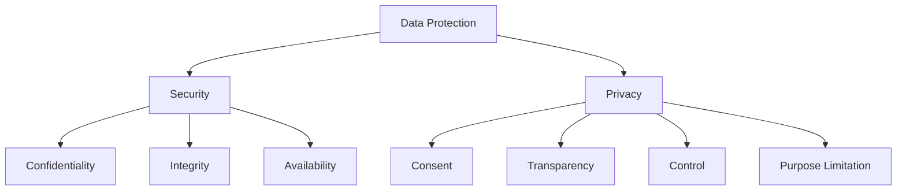

# Data Privacy Principles

## Introduction to Data Privacy

Data privacy is the right of individuals to control how their personal information is collected, used, stored, and shared. In system design, privacy considerations must be built into the architecture from the ground up, not added as an afterthought.

## Privacy vs Security

While related, privacy and security serve different purposes:

**Security**: Protects data from unauthorized access, modification, or destruction
**Privacy**: Ensures individuals have control over their personal information



## Privacy Regulations and Frameworks

### General Data Protection Regulation (GDPR)

**Scope**: EU residents' data, regardless of where processing occurs
**Key Principles**:

1. **Lawfulness, Fairness, and Transparency**
2. **Purpose Limitation**
3. **Data Minimization**
4. **Accuracy**
5. **Storage Limitation**
6. **Integrity and Confidentiality**
7. **Accountability**

**Individual Rights**:
- Right to be informed
- Right of access
- Right to rectification
- Right to erasure ("right to be forgotten")
- Right to restrict processing
- Right to data portability
- Right to object
- Rights related to automated decision-making

### California Consumer Privacy Act (CCPA)

**Scope**: California residents' data
**Key Rights**:
- Right to know what personal information is collected
- Right to delete personal information
- Right to opt-out of sale of personal information
- Right to non-discrimination

### Other Privacy Frameworks

**PIPEDA (Canada)**: Personal Information Protection and Electronic Documents Act
**LGPD (Brazil)**: Lei Geral de Proteção de Dados
**PDPA (Singapore)**: Personal Data Protection Act

## Privacy by Design

### Seven Foundational Principles

1. **Proactive not Reactive**: Anticipate and prevent privacy invasions
2. **Privacy as the Default**: Maximum privacy protection without action required
3. **Full Functionality**: Accommodate all legitimate interests without trade-offs
4. **End-to-End Security**: Secure data throughout its lifecycle
5. **Visibility and Transparency**: Ensure all stakeholders can verify privacy practices
6. **Respect for User Privacy**: Keep user interests paramount
7. **Privacy Embedded into Design**: Make privacy a core component, not an add-on

### Implementation in System Architecture

```python
class PrivacyByDesignSystem:
    def __init__(self):
        self.data_processor = DataProcessor()
        self.consent_manager = ConsentManager()
        self.audit_logger = AuditLogger()
        self.data_minimizer = DataMinimizer()
    
    def collect_data(self, user_id, data_type, data_value, purpose):
        """Collect data with privacy controls"""
        
        # 1. Check consent
        if not self.consent_manager.has_consent(user_id, data_type, purpose):
            raise ConsentRequiredError(f"Consent required for {data_type} for {purpose}")
        
        # 2. Data minimization
        minimized_data = self.data_minimizer.minimize(data_value, purpose)
        
        # 3. Purpose limitation
        if not self.is_purpose_compatible(data_type, purpose):
            raise PurposeIncompatibleError(f"Purpose {purpose} not compatible with {data_type}")
        
        # 4. Audit logging
        self.audit_logger.log_data_collection(user_id, data_type, purpose)
        
        # 5. Store with privacy controls
        return self.data_processor.store_with_privacy_controls(
            user_id, data_type, minimized_data, purpose
        )
    
    def process_data(self, user_id, data_type, processing_purpose):
        """Process data with privacy validation"""
        
        # Check if processing is allowed for this purpose
        if not self.consent_manager.allows_processing(user_id, data_type, processing_purpose):
            raise ProcessingNotAllowedError("Processing not allowed for this purpose")
        
        # Log processing activity
        self.audit_logger.log_data_processing(user_id, data_type, processing_purpose)
        
        return self.data_processor.process(user_id, data_type, processing_purpose)
    
    def is_purpose_compatible(self, data_type, purpose):
        """Check if data collection purpose is compatible"""
        compatible_purposes = {
            'email': ['authentication', 'communication', 'marketing_with_consent'],
            'location': ['service_delivery', 'analytics_anonymized'],
            'payment_info': ['transaction_processing', 'fraud_prevention']
        }
        
        return purpose in compatible_purposes.get(data_type, [])

class ConsentManager:
    def __init__(self):
        self.consent_records = {}
    
    def record_consent(self, user_id, data_types, purposes, consent_method='explicit'):
        """Record user consent"""
        consent_record = {
            'user_id': user_id,
            'data_types': data_types,
            'purposes': purposes,
            'consent_method': consent_method,
            'timestamp': datetime.utcnow(),
            'ip_address': self.get_user_ip(),  # For audit trail
            'user_agent': self.get_user_agent(),
            'consent_version': '1.0'
        }
        
        self.consent_records[user_id] = consent_record
        return consent_record
    
    def has_consent(self, user_id, data_type, purpose):
        """Check if user has given consent for specific data type and purpose"""
        if user_id not in self.consent_records:
            return False
        
        record = self.consent_records[user_id]
        return (data_type in record['data_types'] and 
                purpose in record['purposes'])
    
    def withdraw_consent(self, user_id, data_types=None, purposes=None):
        """Allow user to withdraw consent"""
        if user_id not in self.consent_records:
            return False
        
        record = self.consent_records[user_id]
        
        if data_types:
            record['data_types'] = [dt for dt in record['data_types'] if dt not in data_types]
        
        if purposes:
            record['purposes'] = [p for p in record['purposes'] if p not in purposes]
        
        # Log consent withdrawal
        self.log_consent_change(user_id, 'withdrawal', data_types, purposes)
        
        return True
```

## Data Classification and Handling

### Data Classification Framework

```python
from enum import Enum
from dataclasses import dataclass
from typing import List, Optional
import datetime

class DataSensitivity(Enum):
    PUBLIC = "public"
    INTERNAL = "internal"
    CONFIDENTIAL = "confidential"
    RESTRICTED = "restricted"

class PersonalDataCategory(Enum):
    BASIC_IDENTITY = "basic_identity"  # Name, email, phone
    SENSITIVE_IDENTITY = "sensitive_identity"  # SSN, passport, biometrics
    FINANCIAL = "financial"  # Credit card, bank account
    HEALTH = "health"  # Medical records, health data
    BEHAVIORAL = "behavioral"  # Browsing history, preferences
    LOCATION = "location"  # GPS coordinates, addresses
    BIOMETRIC = "biometric"  # Fingerprints, facial recognition

@dataclass
class DataClassification:
    sensitivity: DataSensitivity
    personal_data_category: Optional[PersonalDataCategory]
    retention_period: datetime.timedelta
    encryption_required: bool
    access_controls: List[str]
    geographic_restrictions: List[str]
    
class DataClassifier:
    def __init__(self):
        self.classification_rules = {
            'email': DataClassification(
                sensitivity=DataSensitivity.CONFIDENTIAL,
                personal_data_category=PersonalDataCategory.BASIC_IDENTITY,
                retention_period=datetime.timedelta(days=2555),  # 7 years
                encryption_required=True,
                access_controls=['authenticated_user', 'customer_service'],
                geographic_restrictions=['EU', 'US']
            ),
            'credit_card': DataClassification(
                sensitivity=DataSensitivity.RESTRICTED,
                personal_data_category=PersonalDataCategory.FINANCIAL,
                retention_period=datetime.timedelta(days=90),
                encryption_required=True,
                access_controls=['payment_processor', 'fraud_team'],
                geographic_restrictions=['processing_country_only']
            ),
            'browsing_history': DataClassification(
                sensitivity=DataSensitivity.CONFIDENTIAL,
                personal_data_category=PersonalDataCategory.BEHAVIORAL,
                retention_period=datetime.timedelta(days=365),
                encryption_required=True,
                access_controls=['analytics_team', 'user_self'],
                geographic_restrictions=[]
            )
        }
    
    def classify_data(self, data_type: str) -> DataClassification:
        """Classify data based on type"""
        return self.classification_rules.get(data_type, 
            DataClassification(
                sensitivity=DataSensitivity.INTERNAL,
                personal_data_category=None,
                retention_period=datetime.timedelta(days=365),
                encryption_required=False,
                access_controls=['system_admin'],
                geographic_restrictions=[]
            )
        )
    
    def get_handling_requirements(self, data_type: str) -> dict:
        """Get data handling requirements based on classification"""
        classification = self.classify_data(data_type)
        
        return {
            'encryption_at_rest': classification.encryption_required,
            'encryption_in_transit': classification.encryption_required,
            'access_logging': True,
            'retention_days': classification.retention_period.days,
            'allowed_regions': classification.geographic_restrictions,
            'minimum_access_level': classification.access_controls,
            'anonymization_required': classification.personal_data_category is not None
        }
```

## Data Minimization

### Principles and Implementation

**Data minimization** means collecting only the data that is necessary for the specified purpose.

```python
class DataMinimizer:
    def __init__(self):
        self.purpose_requirements = {
            'user_authentication': ['email', 'password_hash'],
            'order_processing': ['name', 'shipping_address', 'payment_method'],
            'analytics': ['user_id', 'page_views', 'session_duration'],
            'marketing': ['email', 'preferences', 'consent_status'],
            'fraud_prevention': ['ip_address', 'device_fingerprint', 'transaction_history']
        }
    
    def get_required_fields(self, purpose: str) -> List[str]:
        """Get minimum required fields for a purpose"""
        return self.purpose_requirements.get(purpose, [])
    
    def minimize_data_collection(self, requested_data: dict, purpose: str) -> dict:
        """Remove unnecessary data fields based on purpose"""
        required_fields = self.get_required_fields(purpose)
        
        minimized_data = {}
        for field in required_fields:
            if field in requested_data:
                minimized_data[field] = requested_data[field]
        
        # Log what was filtered out for audit purposes
        filtered_fields = set(requested_data.keys()) - set(minimized_data.keys())
        if filtered_fields:
            self.log_data_minimization(purpose, filtered_fields)
        
        return minimized_data
    
    def anonymize_for_analytics(self, user_data: dict) -> dict:
        """Anonymize data for analytics purposes"""
        anonymized = {}
        
        # Replace direct identifiers with hashed versions
        if 'user_id' in user_data:
            anonymized['hashed_user_id'] = self.hash_identifier(user_data['user_id'])
        
        if 'email' in user_data:
            anonymized['email_domain'] = user_data['email'].split('@')[1]
        
        # Keep non-identifying behavioral data
        behavioral_fields = ['page_views', 'session_duration', 'click_count']
        for field in behavioral_fields:
            if field in user_data:
                anonymized[field] = user_data[field]
        
        # Generalize location data
        if 'location' in user_data:
            anonymized['region'] = self.generalize_location(user_data['location'])
        
        return anonymized
    
    def hash_identifier(self, identifier: str) -> str:
        """Create one-way hash of identifier"""
        import hashlib
        return hashlib.sha256(identifier.encode()).hexdigest()
    
    def generalize_location(self, location: dict) -> str:
        """Generalize location to region level"""
        # Convert precise coordinates to general region
        if 'country' in location:
            return location['country']
        elif 'coordinates' in location:
            # Convert coordinates to country/region
            return self.coordinates_to_region(location['coordinates'])
        return 'unknown'
```

## Anonymization and Pseudonymization

### Anonymization Techniques

```python
import hashlib
import random
import string
from typing import Dict, Any

class AnonymizationEngine:
    def __init__(self, salt: str = None):
        self.salt = salt or self.generate_salt()
        self.pseudonym_mapping = {}
    
    def generate_salt(self) -> str:
        """Generate cryptographic salt"""
        return ''.join(random.choices(string.ascii_letters + string.digits, k=32))
    
    def anonymize_dataset(self, dataset: List[Dict[str, Any]]) -> List[Dict[str, Any]]:
        """Anonymize entire dataset"""
        anonymized_dataset = []
        
        for record in dataset:
            anonymized_record = self.anonymize_record(record)
            anonymized_dataset.append(anonymized_record)
        
        return anonymized_dataset
    
    def anonymize_record(self, record: Dict[str, Any]) -> Dict[str, Any]:
        """Anonymize individual record"""
        anonymized = {}
        
        for field, value in record.items():
            if self.is_direct_identifier(field):
                # Remove direct identifiers
                continue
            elif self.is_quasi_identifier(field):
                # Apply k-anonymity techniques
                anonymized[field] = self.generalize_quasi_identifier(field, value)
            else:
                # Keep non-identifying data
                anonymized[field] = value
        
        return anonymized
    
    def is_direct_identifier(self, field: str) -> bool:
        """Check if field is a direct identifier"""
        direct_identifiers = [
            'ssn', 'passport_number', 'driver_license', 'email', 
            'phone_number', 'full_name', 'address'
        ]
        return field.lower() in direct_identifiers
    
    def is_quasi_identifier(self, field: str) -> bool:
        """Check if field is a quasi-identifier"""
        quasi_identifiers = [
            'age', 'gender', 'zip_code', 'birth_date', 
            'job_title', 'salary_range'
        ]
        return field.lower() in quasi_identifiers
    
    def generalize_quasi_identifier(self, field: str, value: Any) -> Any:
        """Apply generalization to quasi-identifiers"""
        if field.lower() == 'age':
            return self.generalize_age(value)
        elif field.lower() == 'zip_code':
            return self.generalize_zip_code(value)
        elif field.lower() == 'salary_range':
            return self.generalize_salary(value)
        else:
            return value
    
    def generalize_age(self, age: int) -> str:
        """Generalize age to age ranges"""
        if age < 18:
            return "under_18"
        elif age < 25:
            return "18-24"
        elif age < 35:
            return "25-34"
        elif age < 45:
            return "35-44"
        elif age < 55:
            return "45-54"
        elif age < 65:
            return "55-64"
        else:
            return "65_plus"
    
    def generalize_zip_code(self, zip_code: str) -> str:
        """Generalize ZIP code to first 3 digits"""
        return zip_code[:3] + "**" if len(zip_code) >= 3 else "***"
    
    def generalize_salary(self, salary: float) -> str:
        """Generalize salary to ranges"""
        if salary < 30000:
            return "under_30k"
        elif salary < 50000:
            return "30k-50k"
        elif salary < 75000:
            return "50k-75k"
        elif salary < 100000:
            return "75k-100k"
        else:
            return "over_100k"

class PseudonymizationEngine:
    def __init__(self, secret_key: str):
        self.secret_key = secret_key
        self.pseudonym_cache = {}
    
    def pseudonymize(self, identifier: str) -> str:
        """Create consistent pseudonym for identifier"""
        if identifier in self.pseudonym_cache:
            return self.pseudonym_cache[identifier]
        
        # Create HMAC-based pseudonym
        import hmac
        pseudonym = hmac.new(
            self.secret_key.encode(),
            identifier.encode(),
            hashlib.sha256
        ).hexdigest()[:16]  # Use first 16 characters
        
        self.pseudonym_cache[identifier] = pseudonym
        return pseudonym
    
    def depseudonymize(self, pseudonym: str) -> str:
        """Reverse pseudonymization (if mapping exists)"""
        for original, pseudo in self.pseudonym_cache.items():
            if pseudo == pseudonym:
                return original
        return None

# Usage example
anonymizer = AnonymizationEngine()
pseudonymizer = PseudonymizationEngine("secret_key_for_pseudonyms")

# Sample dataset
dataset = [
    {
        'name': 'John Doe',
        'email': 'john@example.com',
        'age': 32,
        'zip_code': '12345',
        'salary': 75000,
        'purchase_amount': 150.00
    },
    {
        'name': 'Jane Smith',
        'email': 'jane@example.com',
        'age': 28,
        'zip_code': '12346',
        'salary': 65000,
        'purchase_amount': 200.00
    }
]

# Anonymize dataset
anonymized_data = anonymizer.anonymize_dataset(dataset)
print("Anonymized dataset:")
for record in anonymized_data:
    print(record)

# Pseudonymize identifiers
for record in dataset:
    if 'email' in record:
        record['pseudonym'] = pseudonymizer.pseudonymize(record['email'])
        del record['email']  # Remove original identifier
```

## Data Subject Rights Implementation

### Right to Access (Data Portability)

```python
class DataSubjectRightsManager:
    def __init__(self, data_store):
        self.data_store = data_store
        self.audit_logger = AuditLogger()
    
    def export_user_data(self, user_id: str, format: str = 'json') -> dict:
        """Export all user data in portable format"""
        
        # Verify user identity (in practice, use proper authentication)
        if not self.verify_user_identity(user_id):
            raise UnauthorizedError("User identity verification failed")
        
        # Collect all user data from different systems
        user_data = {
            'profile': self.data_store.get_user_profile(user_id),
            'preferences': self.data_store.get_user_preferences(user_id),
            'transaction_history': self.data_store.get_transaction_history(user_id),
            'communication_history': self.data_store.get_communication_history(user_id),
            'consent_records': self.data_store.get_consent_records(user_id)
        }
        
        # Remove internal system fields
        cleaned_data = self.clean_export_data(user_data)
        
        # Log the data export request
        self.audit_logger.log_data_export(user_id, format)
        
        if format.lower() == 'json':
            return cleaned_data
        elif format.lower() == 'csv':
            return self.convert_to_csv(cleaned_data)
        else:
            raise ValueError(f"Unsupported export format: {format}")
    
    def clean_export_data(self, data: dict) -> dict:
        """Remove internal system fields from export"""
        fields_to_remove = [
            'internal_id', 'created_by_system', 'last_modified_by',
            'encryption_key_id', 'shard_id', 'version'
        ]
        
        def clean_dict(d):
            if isinstance(d, dict):
                return {k: clean_dict(v) for k, v in d.items() 
                       if k not in fields_to_remove}
            elif isinstance(d, list):
                return [clean_dict(item) for item in d]
            else:
                return d
        
        return clean_dict(data)

    def delete_user_data(self, user_id: str, verification_code: str = None) -> bool:
        """Implement right to erasure (right to be forgotten)"""
        
        # Verify deletion request (two-factor verification recommended)
        if not self.verify_deletion_request(user_id, verification_code):
            raise UnauthorizedError("Deletion request verification failed")
        
        # Check if there are legal obligations to retain data
        retention_requirements = self.check_retention_requirements(user_id)
        if retention_requirements:
            # Anonymize instead of delete if legal retention required
            return self.anonymize_user_data(user_id, retention_requirements)
        
        # Delete user data from all systems
        deletion_results = {}
        
        try:
            # Delete from primary database
            deletion_results['profile'] = self.data_store.delete_user_profile(user_id)
            deletion_results['preferences'] = self.data_store.delete_user_preferences(user_id)
            deletion_results['history'] = self.data_store.delete_user_history(user_id)
            
            # Delete from backup systems
            deletion_results['backups'] = self.delete_from_backups(user_id)
            
            # Delete from analytics systems (if not anonymized)
            deletion_results['analytics'] = self.delete_from_analytics(user_id)
            
            # Delete from third-party systems
            deletion_results['third_party'] = self.request_third_party_deletion(user_id)
            
            # Log successful deletion
            self.audit_logger.log_data_deletion(user_id, deletion_results)
            
            return all(deletion_results.values())
            
        except Exception as e:
            # Log deletion failure
            self.audit_logger.log_deletion_failure(user_id, str(e))
            raise DataDeletionError(f"Failed to delete user data: {e}")
    
    def rectify_user_data(self, user_id: str, field: str, new_value: Any) -> bool:
        """Implement right to rectification"""
        
        # Verify user can modify this field
        if not self.can_user_modify_field(user_id, field):
            raise UnauthorizedError(f"User cannot modify field: {field}")
        
        # Validate new value
        if not self.validate_field_value(field, new_value):
            raise ValidationError(f"Invalid value for field {field}")
        
        # Update the data
        old_value = self.data_store.get_user_field(user_id, field)
        success = self.data_store.update_user_field(user_id, field, new_value)
        
        if success:
            # Log the rectification
            self.audit_logger.log_data_rectification(
                user_id, field, old_value, new_value
            )
            
            # Propagate changes to dependent systems
            self.propagate_data_change(user_id, field, new_value)
        
        return success
    
    def restrict_data_processing(self, user_id: str, restriction_type: str) -> bool:
        """Implement right to restrict processing"""
        
        valid_restrictions = [
            'marketing', 'analytics', 'profiling', 'automated_decision_making'
        ]
        
        if restriction_type not in valid_restrictions:
            raise ValueError(f"Invalid restriction type: {restriction_type}")
        
        # Update processing restrictions
        restrictions = self.data_store.get_processing_restrictions(user_id) or []
        if restriction_type not in restrictions:
            restrictions.append(restriction_type)
            
            success = self.data_store.update_processing_restrictions(user_id, restrictions)
            
            if success:
                self.audit_logger.log_processing_restriction(user_id, restriction_type)
                
                # Notify relevant systems about the restriction
                self.notify_systems_of_restriction(user_id, restriction_type)
            
            return success
        
        return True  # Already restricted
```

## Cross-Border Data Transfers

### Data Localization and Transfer Mechanisms

```python
from enum import Enum
from typing import List, Dict

class DataResidencyRegion(Enum):
    EU = "eu"
    US = "us"
    CANADA = "canada"
    APAC = "apac"
    GLOBAL = "global"

class TransferMechanism(Enum):
    ADEQUACY_DECISION = "adequacy_decision"
    STANDARD_CONTRACTUAL_CLAUSES = "scc"
    BINDING_CORPORATE_RULES = "bcr"
    CERTIFICATION = "certification"
    CONSENT = "consent"

class DataTransferManager:
    def __init__(self):
        self.adequacy_decisions = {
            DataResidencyRegion.EU: [DataResidencyRegion.CANADA],  # EU adequacy decisions
            DataResidencyRegion.US: [],
            DataResidencyRegion.CANADA: [DataResidencyRegion.EU]
        }
        
        self.transfer_restrictions = {
            DataResidencyRegion.EU: {
                'requires_mechanism': True,
                'allowed_mechanisms': [
                    TransferMechanism.ADEQUACY_DECISION,
                    TransferMechanism.STANDARD_CONTRACTUAL_CLAUSES,
                    TransferMechanism.BINDING_CORPORATE_RULES,
                    TransferMechanism.CONSENT
                ]
            }
        }
    
    def can_transfer_data(self, from_region: DataResidencyRegion, 
                         to_region: DataResidencyRegion,
                         data_type: str,
                         transfer_mechanism: TransferMechanism = None) -> bool:
        """Check if data transfer is allowed"""
        
        # Same region transfers are always allowed
        if from_region == to_region:
            return True
        
        # Check if destination has adequacy decision
        if to_region in self.adequacy_decisions.get(from_region, []):
            return True
        
        # Check if transfer mechanism is provided and valid
        if from_region in self.transfer_restrictions:
            restrictions = self.transfer_restrictions[from_region]
            
            if restrictions['requires_mechanism']:
                if not transfer_mechanism:
                    return False
                
                if transfer_mechanism not in restrictions['allowed_mechanisms']:
                    return False
        
        return True
    
    def get_required_safeguards(self, from_region: DataResidencyRegion,
                              to_region: DataResidencyRegion) -> List[str]:
        """Get required safeguards for data transfer"""
        safeguards = []
        
        if from_region == DataResidencyRegion.EU:
            if to_region not in self.adequacy_decisions.get(from_region, []):
                safeguards.extend([
                    'Standard Contractual Clauses or equivalent',
                    'Technical and organizational measures',
                    'Data subject rights protection',
                    'Onward transfer restrictions',
                    'Regular compliance monitoring'
                ])
        
        return safeguards

class DataLocalizationManager:
    def __init__(self):
        self.region_requirements = {
            DataResidencyRegion.EU: {
                'data_must_stay': ['health_data', 'financial_data'],
                'processing_allowed_outside': ['marketing_data', 'analytics_data'],
                'encryption_required': True,
                'local_representative_required': True
            },
            'russia': {  # Example of strict localization
                'data_must_stay': ['personal_data'],
                'processing_allowed_outside': [],
                'encryption_required': True,
                'local_representative_required': True
            }
        }
    
    def get_storage_requirements(self, user_region: str, data_type: str) -> Dict:
        """Get data storage requirements based on user region and data type"""
        requirements = {
            'allowed_regions': [DataResidencyRegion.GLOBAL],
            'encryption_required': False,
            'local_copy_required': False,
            'processing_restrictions': []
        }
        
        if user_region in self.region_requirements:
            region_reqs = self.region_requirements[user_region]
            
            if data_type in region_reqs.get('data_must_stay', []):
                requirements['allowed_regions'] = [user_region]
                requirements['local_copy_required'] = True
            
            requirements['encryption_required'] = region_reqs.get('encryption_required', False)
            
            if data_type not in region_reqs.get('processing_allowed_outside', []):
                requirements['processing_restrictions'].append('local_processing_only')
        
        return requirements
```

## Privacy Impact Assessment (PIA)

### Automated PIA Framework

```python
from dataclasses import dataclass
from typing import List, Dict, Optional
from enum import Enum

class RiskLevel(Enum):
    LOW = "low"
    MEDIUM = "medium"
    HIGH = "high"
    CRITICAL = "critical"

@dataclass
class PrivacyRisk:
    risk_id: str
    description: str
    likelihood: RiskLevel
    impact: RiskLevel
    overall_risk: RiskLevel
    mitigation_measures: List[str]

class PrivacyImpactAssessment:
    def __init__(self):
        self.risk_factors = {
            'data_volume': {
                'low': 'Less than 1,000 records',
                'medium': '1,000 - 100,000 records',
                'high': '100,000 - 1,000,000 records',
                'critical': 'More than 1,000,000 records'
            },
            'data_sensitivity': {
                'low': 'Non-personal data',
                'medium': 'Basic personal data',
                'high': 'Sensitive personal data',
                'critical': 'Special category data (health, biometric, etc.)'
            },
            'processing_scope': {
                'low': 'Single purpose, limited processing',
                'medium': 'Multiple related purposes',
                'high': 'Extensive processing, profiling',
                'critical': 'Automated decision-making with legal effects'
            }
        }
    
    def conduct_assessment(self, processing_activity: Dict) -> Dict:
        """Conduct privacy impact assessment"""
        
        assessment_result = {
            'activity_id': processing_activity.get('id'),
            'activity_name': processing_activity.get('name'),
            'assessment_date': datetime.utcnow().isoformat(),
            'risks_identified': [],
            'overall_risk_level': RiskLevel.LOW,
            'recommendations': [],
            'compliance_status': 'compliant'
        }
        
        # Identify risks based on processing characteristics
        risks = self.identify_risks(processing_activity)
        assessment_result['risks_identified'] = risks
        
        # Calculate overall risk level
        assessment_result['overall_risk_level'] = self.calculate_overall_risk(risks)
        
        # Generate recommendations
        assessment_result['recommendations'] = self.generate_recommendations(risks)
        
        # Check compliance requirements
        assessment_result['compliance_status'] = self.check_compliance(processing_activity, risks)
        
        return assessment_result
    
    def identify_risks(self, processing_activity: Dict) -> List[PrivacyRisk]:
        """Identify privacy risks in processing activity"""
        risks = []
        
        # Risk 1: Data breach risk
        data_volume = processing_activity.get('data_volume', 0)
        data_sensitivity = processing_activity.get('data_sensitivity', 'low')
        
        breach_risk = self.assess_breach_risk(data_volume, data_sensitivity)
        risks.append(breach_risk)
        
        # Risk 2: Unauthorized access risk
        access_controls = processing_activity.get('access_controls', [])
        access_risk = self.assess_access_risk(access_controls, data_sensitivity)
        risks.append(access_risk)
        
        # Risk 3: Data retention risk
        retention_period = processing_activity.get('retention_period_days', 0)
        retention_risk = self.assess_retention_risk(retention_period, data_sensitivity)
        risks.append(retention_risk)
        
        # Risk 4: Cross-border transfer risk
        if processing_activity.get('cross_border_transfers'):
            transfer_risk = self.assess_transfer_risk(processing_activity['cross_border_transfers'])
            risks.append(transfer_risk)
        
        return risks
    
    def assess_breach_risk(self, data_volume: int, data_sensitivity: str) -> PrivacyRisk:
        """Assess data breach risk"""
        
        # Calculate likelihood based on data volume and security measures
        if data_volume > 1000000:
            likelihood = RiskLevel.HIGH
        elif data_volume > 100000:
            likelihood = RiskLevel.MEDIUM
        else:
            likelihood = RiskLevel.LOW
        
        # Calculate impact based on data sensitivity
        impact_mapping = {
            'low': RiskLevel.LOW,
            'medium': RiskLevel.MEDIUM,
            'high': RiskLevel.HIGH,
            'critical': RiskLevel.CRITICAL
        }
        impact = impact_mapping.get(data_sensitivity, RiskLevel.MEDIUM)
        
        # Calculate overall risk
        overall_risk = self.calculate_risk_level(likelihood, impact)
        
        mitigation_measures = [
            'Implement encryption at rest and in transit',
            'Regular security audits and penetration testing',
            'Employee security training',
            'Incident response plan',
            'Access logging and monitoring'
        ]
        
        return PrivacyRisk(
            risk_id='BREACH_001',
            description='Risk of unauthorized access to personal data due to security breach',
            likelihood=likelihood,
            impact=impact,
            overall_risk=overall_risk,
            mitigation_measures=mitigation_measures
        )
    
    def calculate_risk_level(self, likelihood: RiskLevel, impact: RiskLevel) -> RiskLevel:
        """Calculate overall risk level from likelihood and impact"""
        risk_matrix = {
            (RiskLevel.LOW, RiskLevel.LOW): RiskLevel.LOW,
            (RiskLevel.LOW, RiskLevel.MEDIUM): RiskLevel.LOW,
            (RiskLevel.LOW, RiskLevel.HIGH): RiskLevel.MEDIUM,
            (RiskLevel.LOW, RiskLevel.CRITICAL): RiskLevel.MEDIUM,
            (RiskLevel.MEDIUM, RiskLevel.LOW): RiskLevel.LOW,
            (RiskLevel.MEDIUM, RiskLevel.MEDIUM): RiskLevel.MEDIUM,
            (RiskLevel.MEDIUM, RiskLevel.HIGH): RiskLevel.HIGH,
            (RiskLevel.MEDIUM, RiskLevel.CRITICAL): RiskLevel.HIGH,
            (RiskLevel.HIGH, RiskLevel.LOW): RiskLevel.MEDIUM,
            (RiskLevel.HIGH, RiskLevel.MEDIUM): RiskLevel.HIGH,
            (RiskLevel.HIGH, RiskLevel.HIGH): RiskLevel.HIGH,
            (RiskLevel.HIGH, RiskLevel.CRITICAL): RiskLevel.CRITICAL,
            (RiskLevel.CRITICAL, RiskLevel.LOW): RiskLevel.MEDIUM,
            (RiskLevel.CRITICAL, RiskLevel.MEDIUM): RiskLevel.HIGH,
            (RiskLevel.CRITICAL, RiskLevel.HIGH): RiskLevel.CRITICAL,
            (RiskLevel.CRITICAL, RiskLevel.CRITICAL): RiskLevel.CRITICAL,
        }
        
        return risk_matrix.get((likelihood, impact), RiskLevel.MEDIUM)

# Usage example
pia = PrivacyImpactAssessment()

processing_activity = {
    'id': 'USER_ANALYTICS_001',
    'name': 'User Behavior Analytics',
    'data_volume': 500000,
    'data_sensitivity': 'medium',
    'retention_period_days': 730,
    'access_controls': ['role_based_access', 'mfa_required'],
    'cross_border_transfers': [
        {'from': 'EU', 'to': 'US', 'mechanism': 'scc'}
    ]
}

assessment = pia.conduct_assessment(processing_activity)
print(f"Overall Risk Level: {assessment['overall_risk_level'].value}")
print(f"Compliance Status: {assessment['compliance_status']}")
```

## Key Takeaways

1. **Privacy by Design**: Build privacy into systems from the start
2. **Data Minimization**: Collect only what's necessary for the purpose
3. **Consent Management**: Implement granular, withdrawable consent
4. **Data Subject Rights**: Provide mechanisms for access, rectification, erasure
5. **Cross-border Transfers**: Understand and comply with transfer restrictions
6. **Regular Assessments**: Conduct privacy impact assessments for new processing
7. **Anonymization**: Use proper techniques to protect individual privacy
8. **Audit Trails**: Maintain comprehensive logs of data processing activities

## Next Steps

Privacy is a fundamental requirement in modern system design. To complete your security knowledge, let's explore [Security Best Practices](07-best-practices.md) that tie together all the security concepts we've covered.