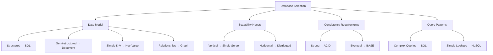
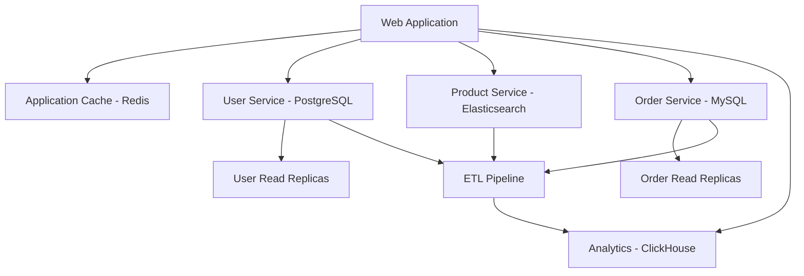
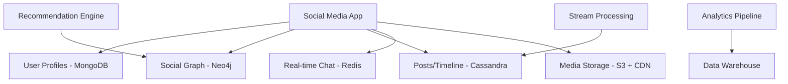

# Chapter 9: Database Systems

## Overview

Database systems are the foundation of most applications, responsible for storing, retrieving, and managing data reliably and efficiently. This chapter covers the spectrum of database technologies, from traditional relational databases to modern NoSQL solutions, along with scaling strategies and data warehousing concepts.

## Learning Objectives

By the end of this chapter, you will understand:

- **Relational Database Fundamentals**: ACID properties, normalization, indexing, and query optimization
- **NoSQL Database Types**: Document, key-value, column-family, and graph databases with their use cases
- **Database Scaling Strategies**: Vertical scaling, horizontal scaling, sharding, and replication patterns
- **Data Warehousing Concepts**: OLTP vs OLAP, ETL processes, dimensional modeling, and modern analytics architectures

## Chapter Structure

### [9.1 Relational Databases](01-relational.md)
- ACID properties and transaction management
- Database schema design and normalization
- Indexing strategies and query optimization
- Popular relational database systems comparison
- Performance tuning and best practices

### [9.2 NoSQL Databases](02-nosql.md)
- Document databases (MongoDB, CouchDB)
- Key-value stores (Redis, DynamoDB)
- Column-family databases (Cassandra, HBase)
- Graph databases (Neo4j, Neptune)
- CAP theorem and consistency models
- Data modeling patterns for each type

### [9.3 Database Scaling Strategies](03-scaling.md)
- Vertical vs horizontal scaling approaches
- Read replicas and master-slave replication
- Database sharding and partitioning strategies
- Federation and microservices database patterns
- Performance monitoring and optimization techniques

### [9.4 Data Warehousing & Analytics](04-warehousing.md)
- OLTP vs OLAP system characteristics
- ETL (Extract, Transform, Load) processes
- Dimensional modeling (Star and Snowflake schemas)
- Modern data architectures (Lambda, Kappa, Data Lakes)
- Analytics tools and performance optimization

## Key Concepts

### Database Selection Criteria



### Scaling Decision Matrix

| Scenario | Recommended Approach | Database Type | Key Considerations |
|----------|---------------------|---------------|-------------------|
| **Small to Medium App** | Vertical Scaling | PostgreSQL/MySQL | Cost-effective, simple operations |
| **Read-Heavy Workload** | Read Replicas | SQL + Caching | Geographic distribution |
| **Write-Heavy Workload** | Sharding/NoSQL | Cassandra/MongoDB | Partition strategy crucial |
| **Complex Relationships** | Optimized SQL | PostgreSQL + Graph DB | Hybrid approach |
| **Real-time Analytics** | Stream Processing | Kafka + Time-series DB | Lambda architecture |
| **Global Distribution** | Multi-region NoSQL | DynamoDB/Cassandra | Eventual consistency |

### Performance Optimization Checklist

**Relational Databases:**
- [ ] Proper indexing strategy implemented
- [ ] Query execution plans analyzed
- [ ] Connection pooling configured
- [ ] Slow query monitoring enabled
- [ ] Database statistics updated regularly

**NoSQL Databases:**
- [ ] Appropriate consistency level chosen
- [ ] Data model optimized for access patterns
- [ ] Partition/shard key designed properly
- [ ] Monitoring and alerting configured
- [ ] Backup and recovery procedures tested

**Scaling Considerations:**
- [ ] Read/write patterns analyzed
- [ ] Bottlenecks identified and addressed
- [ ] Failover procedures documented
- [ ] Data migration strategy planned
- [ ] Performance benchmarks established

## Common Patterns and Anti-Patterns

### ✅ Good Patterns

**Database Per Service (Microservices)**
```
Service A → Database A (User data)
Service B → Database B (Order data)  
Service C → Database C (Product data)
```

**CQRS (Command Query Responsibility Segregation)**
```
Write Model → Optimized for writes → Event Store
Read Model → Optimized for queries → Materialized Views
```

**Database Caching Layers**
```
Application → Cache (Redis) → Database
```

### ❌ Anti-Patterns

**Shared Database Across Services**
```
Service A ↘
Service B → Shared Database ← Tight coupling, deployment issues
Service C ↗
```

**N+1 Query Problem**
```sql
-- Bad: Multiple queries
SELECT * FROM users;
-- Then for each user:
SELECT * FROM orders WHERE user_id = ?;

-- Good: Single join query
SELECT u.*, o.* FROM users u 
LEFT JOIN orders o ON u.id = o.user_id;
```

**Premature Sharding**
```
Start simple → Scale vertically → Add read replicas → Then consider sharding
```

## Real-World Examples

### E-commerce Platform Database Architecture



### Social Media Platform Database Strategy



## Interview Focus Areas

When discussing databases in system design interviews:

1. **Start with Requirements**: Understand data model, scale, and consistency needs
2. **Choose Appropriate Technology**: Justify database selection based on requirements
3. **Design for Scale**: Discuss scaling strategies and trade-offs
4. **Consider Consistency**: Address CAP theorem implications
5. **Plan for Operations**: Include monitoring, backup, and disaster recovery

## Summary

Database systems are critical components that require careful consideration of:

- **Data model requirements** and access patterns
- **Scalability needs** and growth projections  
- **Consistency requirements** and trade-offs
- **Operational complexity** and team expertise
- **Cost implications** of different approaches

The key is to start simple and scale incrementally, choosing the right tool for each specific use case while maintaining system reliability and performance.

## Next Steps

- Practice designing database schemas for different use cases
- Experiment with different database technologies
- Study real-world scaling case studies
- Learn about database monitoring and optimization tools
- Understand the operational aspects of database management

Continue to [Chapter 10: Caching Strategies](../chapter-10-caching/README.md) to learn how caching complements database systems for improved performance.