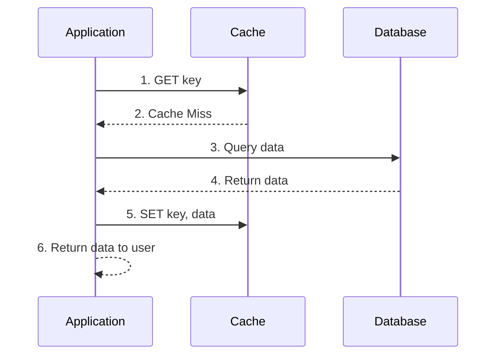
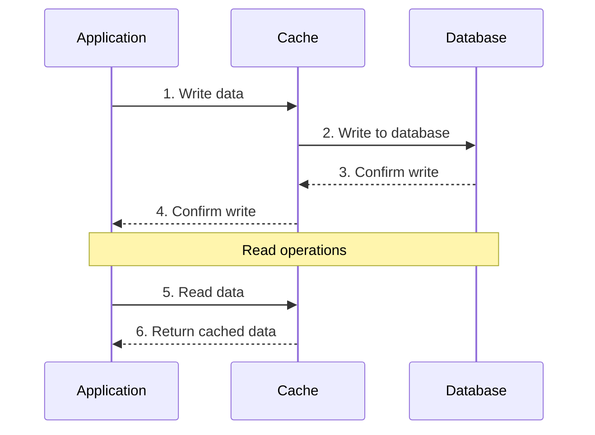
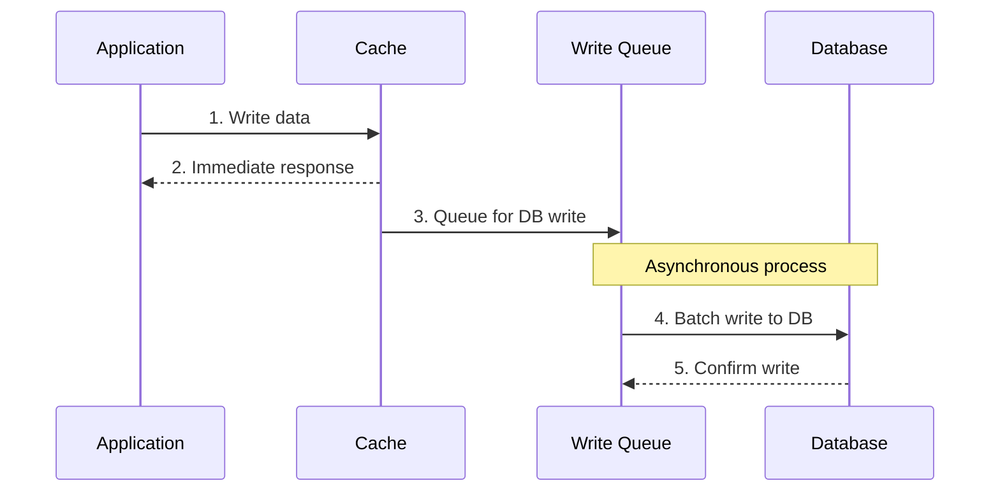
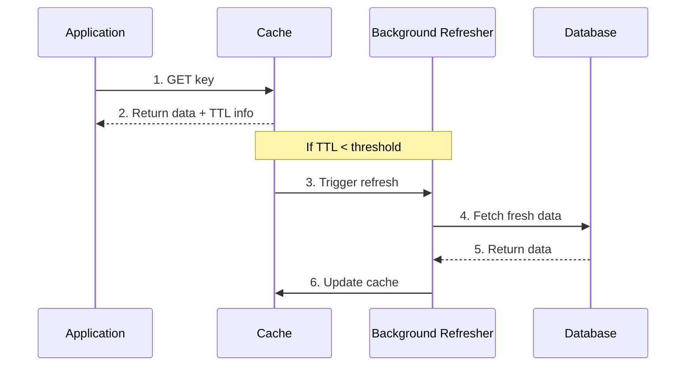
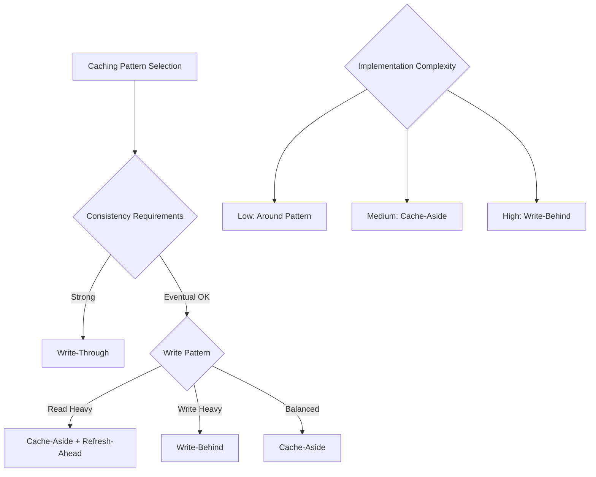

# Cache Patterns

## Overview

Caching patterns define how applications interact with cache systems to improve performance, reduce database load, and enhance user experience. Understanding different caching patterns helps choose the right approach based on your application's read/write characteristics and consistency requirements.

## Cache-Aside (Lazy Loading)

### Pattern Description

The application manages the cache directly. On a cache miss, the application loads data from the database and populates the cache.



### Implementation Example

```python
import redis
import json
import time
from typing import Optional, Any

class CacheAside:
    def __init__(self, redis_client: redis.Redis, default_ttl: int = 3600):
        self.cache = redis_client
        self.default_ttl = default_ttl
    
    def get(self, key: str, fetch_function: callable, ttl: Optional[int] = None) -> Any:
        """
        Get data with cache-aside pattern
        """
        # Try to get from cache first
        cached_data = self.cache.get(key)
        if cached_data:
            return json.loads(cached_data)
        
        # Cache miss - fetch from source
        data = fetch_function()
        if data is not None:
            # Store in cache
            self.cache.setex(
                key, 
                ttl or self.default_ttl, 
                json.dumps(data, default=str)
            )
        
        return data
    
    def invalidate(self, key: str):
        """Remove key from cache"""
        self.cache.delete(key)
    
    def set(self, key: str, data: Any, ttl: Optional[int] = None):
        """Manually set cache data"""
        self.cache.setex(
            key, 
            ttl or self.default_ttl, 
            json.dumps(data, default=str)
        )

# Usage example
cache = CacheAside(redis.Redis(host='localhost', port=6379))

def get_user_profile(user_id: int):
    def fetch_from_db():
        # Simulate database query
        return db.execute(
            "SELECT id, name, email, profile_data FROM users WHERE id = %s", 
            (user_id,)
        ).fetchone()
    
    return cache.get(f"user_profile:{user_id}", fetch_from_db, ttl=1800)

# Get user profile (will cache on first call)
profile = get_user_profile(123)
```

### Advantages and Disadvantages

| Advantages | Disadvantages |
|------------|---------------|
| Simple to implement | Cache miss penalty |
| Only caches requested data | Potential for stale data |
| Resilient to cache failures | Application manages cache logic |
| Good for read-heavy workloads | Possible cache stampede |

## Write-Through

### Pattern Description

Data is written to both cache and database simultaneously. Cache is always consistent with the database.



### Implementation Example

```python
class WriteThrough:
    def __init__(self, redis_client: redis.Redis, db_connection):
        self.cache = redis_client
        self.db = db_connection
        self.default_ttl = 3600
    
    def write(self, key: str, data: dict, table: str, primary_key: str):
        """
        Write data using write-through pattern
        """
        try:
            # Start database transaction
            with self.db.begin() as transaction:
                # Write to database first
                if 'id' in data:
                    # Update existing record
                    set_clause = ', '.join([f"{k} = %s" for k in data.keys() if k != 'id'])
                    values = [v for k, v in data.items() if k != 'id'] + [data['id']]
                    query = f"UPDATE {table} SET {set_clause} WHERE {primary_key} = %s"
                else:
                    # Insert new record
                    columns = ', '.join(data.keys())
                    placeholders = ', '.join(['%s'] * len(data))
                    values = list(data.values())
                    query = f"INSERT INTO {table} ({columns}) VALUES ({placeholders})"
                
                cursor = transaction.execute(query, values)
                
                # If insert, get the new ID
                if 'id' not in data:
                    data['id'] = cursor.lastrowid
                
                # Write to cache after successful database write
                self.cache.setex(
                    key, 
                    self.default_ttl, 
                    json.dumps(data, default=str)
                )
                
                return data
                
        except Exception as e:
            # If database write fails, don't cache
            raise e
    
    def read(self, key: str, fetch_function: callable = None):
        """Read with cache-first approach"""
        cached_data = self.cache.get(key)
        if cached_data:
            return json.loads(cached_data)
        
        # If not in cache and fetch function provided
        if fetch_function:
            data = fetch_function()
            if data:
                self.cache.setex(key, self.default_ttl, json.dumps(data, default=str))
            return data
        
        return None

# Usage example
write_through = WriteThrough(redis.Redis(), db_connection)

def update_user_profile(user_id: int, profile_data: dict):
    profile_data['id'] = user_id
    profile_data['updated_at'] = datetime.now()
    
    return write_through.write(
        key=f"user_profile:{user_id}",
        data=profile_data,
        table="users",
        primary_key="id"
    )
```

### Use Cases

- **Financial systems** where consistency is critical
- **User profiles** that are frequently read after updates
- **Configuration data** that must be immediately consistent
- **Small datasets** where write latency is acceptable

## Write-Behind (Write-Back)

### Pattern Description

Data is written to cache immediately and asynchronously written to the database later. Provides fast write performance but risks data loss.



### Implementation Example

```python
import asyncio
import queue
import threading
from datetime import datetime, timedelta

class WriteBehind:
    def __init__(self, redis_client: redis.Redis, db_connection):
        self.cache = redis_client
        self.db = db_connection
        self.write_queue = queue.Queue()
        self.batch_size = 100
        self.flush_interval = 30  # seconds
        self.default_ttl = 3600
        
        # Start background writer
        self.writer_thread = threading.Thread(target=self._background_writer, daemon=True)
        self.writer_thread.start()
    
    def write(self, key: str, data: dict, table: str, operation: str = 'upsert'):
        """
        Write data using write-behind pattern
        """
        # Write to cache immediately
        self.cache.setex(key, self.default_ttl, json.dumps(data, default=str))
        
        # Queue for database write
        write_operation = {
            'key': key,
            'data': data,
            'table': table,
            'operation': operation,
            'timestamp': datetime.now()
        }
        self.write_queue.put(write_operation)
        
        return data
    
    def _background_writer(self):
        """Background thread to process write queue"""
        batch = []
        last_flush = datetime.now()
        
        while True:
            try:
                # Get item with timeout
                item = self.write_queue.get(timeout=1)
                batch.append(item)
                
                # Flush if batch is full or time interval reached
                if (len(batch) >= self.batch_size or 
                    datetime.now() - last_flush > timedelta(seconds=self.flush_interval)):
                    self._flush_batch(batch)
                    batch = []
                    last_flush = datetime.now()
                    
            except queue.Empty:
                # Flush any remaining items on timeout
                if batch:
                    self._flush_batch(batch)
                    batch = []
                    last_flush = datetime.now()
            except Exception as e:
                print(f"Error in background writer: {e}")
    
    def _flush_batch(self, batch):
        """Flush a batch of writes to database"""
        if not batch:
            return
        
        try:
            with self.db.begin() as transaction:
                for item in batch:
                    self._execute_write(transaction, item)
                print(f"Flushed batch of {len(batch)} writes")
        except Exception as e:
            print(f"Error flushing batch: {e}")
            # Could implement retry logic here
    
    def _execute_write(self, transaction, item):
        """Execute individual write operation"""
        table = item['table']
        data = item['data']
        operation = item['operation']
        
        if operation == 'insert':
            columns = ', '.join(data.keys())
            placeholders = ', '.join(['%s'] * len(data))
            values = list(data.values())
            query = f"INSERT INTO {table} ({columns}) VALUES ({placeholders})"
            transaction.execute(query, values)
            
        elif operation == 'update':
            set_clause = ', '.join([f"{k} = %s" for k in data.keys() if k != 'id'])
            values = [v for k, v in data.items() if k != 'id'] + [data['id']]
            query = f"UPDATE {table} SET {set_clause} WHERE id = %s"
            transaction.execute(query, values)
            
        elif operation == 'upsert':
            # MySQL UPSERT example
            columns = ', '.join(data.keys())
            placeholders = ', '.join(['%s'] * len(data))
            update_clause = ', '.join([f"{k} = VALUES({k})" for k in data.keys()])
            values = list(data.values())
            query = f"""
                INSERT INTO {table} ({columns}) VALUES ({placeholders})
                ON DUPLICATE KEY UPDATE {update_clause}
            """
            transaction.execute(query, values)

# Usage example
write_behind = WriteBehind(redis.Redis(), db_connection)

def update_user_activity(user_id: int, activity_data: dict):
    activity_data['user_id'] = user_id
    activity_data['timestamp'] = datetime.now()
    
    # Fast write to cache, async write to DB
    return write_behind.write(
        key=f"user_activity:{user_id}:{int(time.time())}",
        data=activity_data,
        table="user_activities",
        operation="insert"
    )
```

### Advantages and Disadvantages

| Advantages | Disadvantages |
|------------|---------------|
| Fast write performance | Risk of data loss |
| Reduced database load | Complex error handling |
| Better write throughput | Eventual consistency |
| Batch optimization | Memory usage for queue |

## Refresh-Ahead

### Pattern Description

Cache is refreshed before expiration based on access patterns. Prevents cache misses for frequently accessed data.



### Implementation Example

```python
import threading
import time
from datetime import datetime, timedelta

class RefreshAhead:
    def __init__(self, redis_client: redis.Redis, refresh_threshold: float = 0.8):
        self.cache = redis_client
        self.refresh_threshold = refresh_threshold  # Refresh when 80% of TTL elapsed
        self.refresh_queue = queue.Queue()
        self.default_ttl = 3600
        
        # Start refresh worker
        self.refresh_worker = threading.Thread(target=self._refresh_worker, daemon=True)
        self.refresh_worker.start()
    
    def get(self, key: str, fetch_function: callable, ttl: Optional[int] = None) -> Any:
        """
        Get data with refresh-ahead pattern
        """
        # Get data and TTL from cache
        pipe = self.cache.pipeline()
        pipe.get(key)
        pipe.ttl(key)
        cached_data, remaining_ttl = pipe.execute()
        
        if cached_data:
            data = json.loads(cached_data)
            
            # Check if refresh is needed
            total_ttl = ttl or self.default_ttl
            if remaining_ttl > 0 and remaining_ttl < (total_ttl * (1 - self.refresh_threshold)):
                # Schedule refresh
                self._schedule_refresh(key, fetch_function, total_ttl)
            
            return data
        
        # Cache miss - fetch immediately
        data = fetch_function()
        if data is not None:
            self.cache.setex(key, ttl or self.default_ttl, json.dumps(data, default=str))
        
        return data
    
    def _schedule_refresh(self, key: str, fetch_function: callable, ttl: int):
        """Schedule a key for background refresh"""
        refresh_item = {
            'key': key,
            'fetch_function': fetch_function,
            'ttl': ttl,
            'scheduled_at': datetime.now()
        }
        
        try:
            self.refresh_queue.put_nowait(refresh_item)
        except queue.Full:
            # Queue is full, skip this refresh
            pass
    
    def _refresh_worker(self):
        """Background worker to refresh cache entries"""
        while True:
            try:
                item = self.refresh_queue.get(timeout=1)
                self._refresh_key(item)
                self.refresh_queue.task_done()
            except queue.Empty:
                continue
            except Exception as e:
                print(f"Error in refresh worker: {e}")
    
    def _refresh_key(self, item):
        """Refresh a single cache key"""
        try:
            key = item['key']
            fetch_function = item['fetch_function']
            ttl = item['ttl']
            
            # Fetch fresh data
            fresh_data = fetch_function()
            if fresh_data is not None:
                # Update cache with fresh data
                self.cache.setex(key, ttl, json.dumps(fresh_data, default=str))
                print(f"Refreshed cache key: {key}")
        except Exception as e:
            print(f"Error refreshing key {item['key']}: {e}")

# Usage example with access pattern tracking
class SmartRefreshAhead(RefreshAhead):
    def __init__(self, redis_client: redis.Redis):
        super().__init__(redis_client)
        self.access_patterns = {}
        self.min_access_count = 5  # Only refresh frequently accessed keys
    
    def get(self, key: str, fetch_function: callable, ttl: Optional[int] = None) -> Any:
        # Track access patterns
        self.access_patterns[key] = self.access_patterns.get(key, 0) + 1
        
        # Only use refresh-ahead for frequently accessed keys
        if self.access_patterns[key] >= self.min_access_count:
            return super().get(key, fetch_function, ttl)
        else:
            # Use simple cache-aside for infrequently accessed keys
            cached_data = self.cache.get(key)
            if cached_data:
                return json.loads(cached_data)
            
            data = fetch_function()
            if data is not None:
                self.cache.setex(key, ttl or self.default_ttl, json.dumps(data, default=str))
            return data

# Usage
refresh_cache = SmartRefreshAhead(redis.Redis())

def get_popular_products():
    def fetch_from_db():
        return db.execute(
            "SELECT * FROM products WHERE rating > 4.0 ORDER BY sales_count DESC LIMIT 20"
        ).fetchall()
    
    return refresh_cache.get("popular_products", fetch_from_db, ttl=1800)
```

## Around (Decorator Pattern)

### Pattern Description

A wrapper pattern that transparently handles caching logic around existing functions using decorators.

```python
import functools
import hashlib
import json
from typing import Any, Callable

class CacheAround:
    def __init__(self, redis_client: redis.Redis, default_ttl: int = 3600):
        self.cache = redis_client
        self.default_ttl = default_ttl
    
    def cached(self, ttl: Optional[int] = None, key_prefix: str = ""):
        """
        Decorator for caching function results
        """
        def decorator(func: Callable) -> Callable:
            @functools.wraps(func)
            def wrapper(*args, **kwargs):
                # Generate cache key from function name and arguments
                key_data = {
                    'function': func.__name__,
                    'args': args,
                    'kwargs': kwargs
                }
                key_hash = hashlib.md5(json.dumps(key_data, sort_keys=True, default=str).encode()).hexdigest()
                cache_key = f"{key_prefix}{func.__name__}:{key_hash}"
                
                # Try cache first
                cached_result = self.cache.get(cache_key)
                if cached_result is not None:
                    return json.loads(cached_result)
                
                # Execute function
                result = func(*args, **kwargs)
                
                # Cache result
                if result is not None:
                    self.cache.setex(
                        cache_key, 
                        ttl or self.default_ttl, 
                        json.dumps(result, default=str)
                    )
                
                return result
            
            # Add cache management methods
            wrapper.cache_invalidate = lambda *args, **kwargs: self._invalidate_function_cache(func, args, kwargs)
            wrapper.cache_key = lambda *args, **kwargs: self._get_cache_key(func, args, kwargs, key_prefix)
            
            return wrapper
        return decorator
    
    def _get_cache_key(self, func: Callable, args: tuple, kwargs: dict, prefix: str = ""):
        """Generate cache key for function call"""
        key_data = {
            'function': func.__name__,
            'args': args,
            'kwargs': kwargs
        }
        key_hash = hashlib.md5(json.dumps(key_data, sort_keys=True, default=str).encode()).hexdigest()
        return f"{prefix}{func.__name__}:{key_hash}"
    
    def _invalidate_function_cache(self, func: Callable, args: tuple, kwargs: dict):
        """Invalidate cache for specific function call"""
        cache_key = self._get_cache_key(func, args, kwargs)
        self.cache.delete(cache_key)

# Usage examples
cache_around = CacheAround(redis.Redis())

@cache_around.cached(ttl=1800, key_prefix="user:")
def get_user_profile(user_id: int):
    """Fetch user profile from database"""
    return db.execute(
        "SELECT id, name, email, profile_data FROM users WHERE id = %s", 
        (user_id,)
    ).fetchone()

@cache_around.cached(ttl=3600, key_prefix="product:")
def get_product_details(product_id: int, include_reviews: bool = False):
    """Fetch product details with optional reviews"""
    query = "SELECT * FROM products WHERE id = %s"
    product = db.execute(query, (product_id,)).fetchone()
    
    if include_reviews and product:
        reviews = db.execute(
            "SELECT * FROM reviews WHERE product_id = %s ORDER BY created_at DESC LIMIT 10",
            (product_id,)
        ).fetchall()
        product['reviews'] = reviews
    
    return product

# Usage
user = get_user_profile(123)  # Cached for 30 minutes
product = get_product_details(456, include_reviews=True)  # Cached for 1 hour

# Cache invalidation
get_user_profile.cache_invalidate(123)  # Invalidate specific user
```

## Pattern Comparison

### Performance Characteristics

| Pattern | Read Latency | Write Latency | Consistency | Complexity |
|---------|--------------|---------------|-------------|------------|
| **Cache-Aside** | Medium (miss penalty) | Low | Eventual | Low |
| **Write-Through** | Low | High | Strong | Medium |
| **Write-Behind** | Low | Very Low | Eventual | High |
| **Refresh-Ahead** | Very Low | Low | Eventual | Medium |
| **Around** | Medium | Low | Eventual | Low |

### Use Case Matrix



## Advanced Pattern Combinations

### Multi-Level Caching

```python
class MultiLevelCache:
    def __init__(self, l1_cache: dict, l2_cache: redis.Redis):
        self.l1 = l1_cache  # In-memory cache (fast, small)
        self.l2 = l2_cache  # Redis cache (slower, larger)
        self.l1_ttl = 300   # 5 minutes
        self.l2_ttl = 3600  # 1 hour
    
    def get(self, key: str, fetch_function: callable):
        # Try L1 cache first
        if key in self.l1:
            return self.l1[key]['data']
        
        # Try L2 cache
        l2_data = self.l2.get(key)
        if l2_data:
            data = json.loads(l2_data)
            # Populate L1 cache
            self.l1[key] = {
                'data': data,
                'expires': time.time() + self.l1_ttl
            }
            return data
        
        # Cache miss - fetch from source
        data = fetch_function()
        if data is not None:
            # Store in both levels
            self.l1[key] = {
                'data': data,
                'expires': time.time() + self.l1_ttl
            }
            self.l2.setex(key, self.l2_ttl, json.dumps(data, default=str))
        
        return data
    
    def cleanup_l1(self):
        """Remove expired entries from L1 cache"""
        current_time = time.time()
        expired_keys = [
            key for key, value in self.l1.items() 
            if value['expires'] < current_time
        ]
        for key in expired_keys:
            del self.l1[key]
```

### Cache with Circuit Breaker

```python
import time
from enum import Enum

class CircuitState(Enum):
    CLOSED = "closed"
    OPEN = "open"
    HALF_OPEN = "half_open"

class CacheWithCircuitBreaker:
    def __init__(self, redis_client: redis.Redis, failure_threshold: int = 5, timeout: int = 60):
        self.cache = redis_client
        self.failure_threshold = failure_threshold
        self.timeout = timeout
        self.failure_count = 0
        self.last_failure_time = 0
        self.state = CircuitState.CLOSED
    
    def get(self, key: str, fetch_function: callable, ttl: int = 3600):
        # Try cache first if circuit is not open
        if self.state != CircuitState.OPEN:
            try:
                cached_data = self.cache.get(key)
                if cached_data:
                    self._on_success()
                    return json.loads(cached_data)
            except Exception as e:
                self._on_failure()
                print(f"Cache failure: {e}")
        
        # Fetch from source
        try:
            data = fetch_function()
            if data is not None and self.state != CircuitState.OPEN:
                # Try to cache if circuit allows
                try:
                    self.cache.setex(key, ttl, json.dumps(data, default=str))
                    self._on_success()
                except Exception as e:
                    self._on_failure()
                    print(f"Cache write failure: {e}")
            return data
        except Exception as e:
            # If both cache and source fail, raise exception
            raise e
    
    def _on_success(self):
        """Reset circuit breaker on successful operation"""
        self.failure_count = 0
        self.state = CircuitState.CLOSED
    
    def _on_failure(self):
        """Handle failure and update circuit breaker state"""
        self.failure_count += 1
        self.last_failure_time = time.time()
        
        if self.failure_count >= self.failure_threshold:
            self.state = CircuitState.OPEN
        elif self.state == CircuitState.OPEN and time.time() - self.last_failure_time > self.timeout:
            self.state = CircuitState.HALF_OPEN
```

## Best Practices

### Pattern Selection Guidelines

1. **Cache-Aside**: Default choice for most applications
2. **Write-Through**: When strong consistency is required
3. **Write-Behind**: For high-write, eventual consistency scenarios
4. **Refresh-Ahead**: For frequently accessed, slowly changing data
5. **Around**: For simple function-level caching

### Implementation Considerations

- **Error Handling**: Always handle cache failures gracefully
- **Serialization**: Choose efficient serialization formats (JSON, MessagePack, Protocol Buffers)
- **Key Design**: Use consistent, hierarchical key naming conventions
- **TTL Strategy**: Set appropriate expiration times based on data characteristics
- **Monitoring**: Track cache hit rates, latency, and error rates

## Summary

Cache patterns provide different trade-offs between:

- **Performance** vs **Consistency**
- **Simplicity** vs **Features**
- **Memory Usage** vs **Hit Rates**
- **Write Speed** vs **Data Safety**

Choose patterns based on your specific requirements for consistency, performance, and operational complexity. Many applications benefit from combining multiple patterns for different types of data.