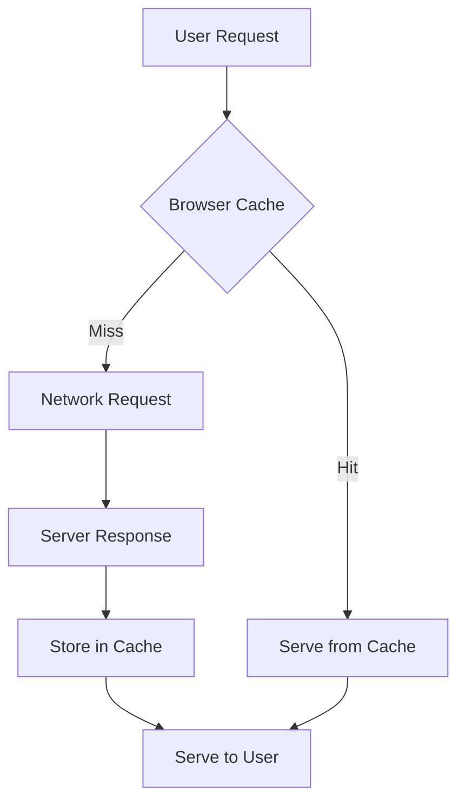
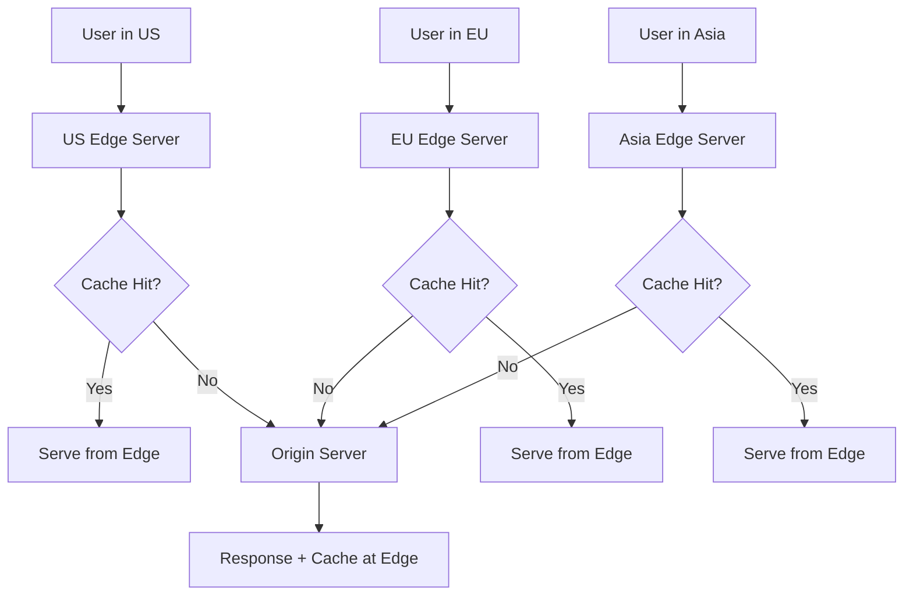
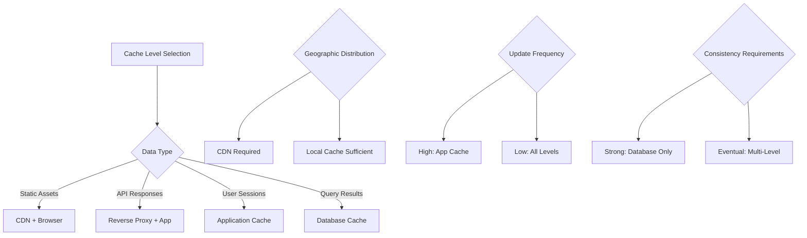

# Cache Levels

## Overview

Caching can be implemented at multiple levels in a system architecture, from the browser to the database. Understanding different cache levels helps design comprehensive caching strategies that optimize performance at each layer while managing complexity and consistency.

## Browser Cache

### Client-Side Caching

Browser caches store resources locally to reduce network requests and improve page load times.



### HTTP Cache Headers

```javascript
// Express.js server-side cache control
app.get('/api/products', (req, res) => {
    // Cache for 1 hour, allow stale content for 1 day if server is down
    res.set({
        'Cache-Control': 'public, max-age=3600, stale-while-revalidate=86400',
        'ETag': generateETag(products),
        'Last-Modified': new Date(lastModified).toUTCString()
    });
    
    res.json(products);
});

// Static assets with long-term caching
app.use('/static', express.static('public', {
    maxAge: '1y',  // Cache for 1 year
    etag: true,
    lastModified: true
}));
```

### Service Worker Caching

```javascript
// service-worker.js
const CACHE_NAME = 'app-cache-v1';
const urlsToCache = [
    '/',
    '/static/css/main.css',
    '/static/js/main.js',
    '/api/config'
];

// Install event - cache resources
self.addEventListener('install', (event) => {
    event.waitUntil(
        caches.open(CACHE_NAME)
            .then((cache) => cache.addAll(urlsToCache))
    );
});

// Fetch event - serve from cache or network
self.addEventListener('fetch', (event) => {
    event.respondWith(
        caches.match(event.request)
            .then((response) => {
                // Return cached version or fetch from network
                return response || fetch(event.request);
            })
    );
});

// Cache-first strategy for static assets
self.addEventListener('fetch', (event) => {
    if (event.request.url.includes('/static/')) {
        event.respondWith(
            caches.match(event.request)
                .then((response) => response || fetch(event.request))
        );
    }
});

// Network-first strategy for API calls
self.addEventListener('fetch', (event) => {
    if (event.request.url.includes('/api/')) {
        event.respondWith(
            fetch(event.request)
                .then((response) => {
                    // Clone response to cache
                    const responseClone = response.clone();
                    caches.open(CACHE_NAME)
                        .then((cache) => cache.put(event.request, responseClone));
                    return response;
                })
                .catch(() => caches.match(event.request))  // Fallback to cache
        );
    }
});
```

### Local Storage Caching

```javascript
class LocalStorageCache {
    constructor(prefix = 'cache_', defaultTTL = 3600000) {  // 1 hour default
        this.prefix = prefix;
        this.defaultTTL = defaultTTL;
    }
    
    set(key, data, ttl = this.defaultTTL) {
        const item = {
            data: data,
            timestamp: Date.now(),
            ttl: ttl
        };
        
        try {
            localStorage.setItem(this.prefix + key, JSON.stringify(item));
        } catch (e) {
            // Handle quota exceeded
            this.cleanup();
            localStorage.setItem(this.prefix + key, JSON.stringify(item));
        }
    }
    
    get(key) {
        try {
            const item = JSON.parse(localStorage.getItem(this.prefix + key));
            if (!item) return null;
            
            // Check if expired
            if (Date.now() - item.timestamp > item.ttl) {
                this.delete(key);
                return null;
            }
            
            return item.data;
        } catch (e) {
            return null;
        }
    }
    
    delete(key) {
        localStorage.removeItem(this.prefix + key);
    }
    
    cleanup() {
        // Remove expired items
        const keys = Object.keys(localStorage);
        keys.forEach(key => {
            if (key.startsWith(this.prefix)) {
                const shortKey = key.substring(this.prefix.length);
                if (!this.get(shortKey)) {
                    // Item was expired and removed
                }
            }
        });
    }
}

// Usage
const cache = new LocalStorageCache('api_', 1800000);  // 30 minutes

async function fetchUserProfile(userId) {
    const cacheKey = `user_profile_${userId}`;
    
    // Try cache first
    let profile = cache.get(cacheKey);
    if (profile) {
        return profile;
    }
    
    // Fetch from API
    try {
        const response = await fetch(`/api/users/${userId}`);
        profile = await response.json();
        
        // Cache the result
        cache.set(cacheKey, profile);
        return profile;
    } catch (error) {
        console.error('Failed to fetch user profile:', error);
        return null;
    }
}
```

## CDN (Content Delivery Network)

### Edge Caching

CDNs cache content at geographically distributed edge servers to reduce latency.



### CDN Configuration Examples

```javascript
// CloudFlare Workers - Edge computing and caching
addEventListener('fetch', event => {
    event.respondWith(handleRequest(event.request));
});

async function handleRequest(request) {
    const url = new URL(request.url);
    
    // Cache static assets for 1 year
    if (url.pathname.startsWith('/static/')) {
        const response = await fetch(request);
        const newResponse = new Response(response.body, response);
        newResponse.headers.set('Cache-Control', 'public, max-age=31536000');
        return newResponse;
    }
    
    // Cache API responses for 5 minutes
    if (url.pathname.startsWith('/api/')) {
        const cacheKey = new Request(url.toString(), request);
        const cache = caches.default;
        
        // Try cache first
        let response = await cache.match(cacheKey);
        if (response) {
            return response;
        }
        
        // Fetch from origin
        response = await fetch(request);
        
        // Cache successful responses
        if (response.status === 200) {
            const responseClone = response.clone();
            responseClone.headers.set('Cache-Control', 'public, max-age=300');
            event.waitUntil(cache.put(cacheKey, responseClone));
        }
        
        return response;
    }
    
    return fetch(request);
}
```

```nginx
# Nginx CDN configuration
server {
    listen 80;
    server_name cdn.example.com;
    
    # Cache static assets
    location ~* \.(jpg|jpeg|png|gif|ico|css|js)$ {
        expires 1y;
        add_header Cache-Control "public, immutable";
        add_header Vary "Accept-Encoding";
        
        # Enable gzip compression
        gzip on;
        gzip_types text/css application/javascript image/svg+xml;
    }
    
    # Cache API responses
    location /api/ {
        proxy_pass http://backend;
        proxy_cache api_cache;
        proxy_cache_valid 200 5m;
        proxy_cache_key "$scheme$request_method$host$request_uri";
        add_header X-Cache-Status $upstream_cache_status;
    }
    
    # Cache configuration
    proxy_cache_path /var/cache/nginx levels=1:2 keys_zone=api_cache:10m max_size=1g inactive=60m;
}
```

## Reverse Proxy Cache

### Nginx Caching

```nginx
# Nginx reverse proxy with caching
http {
    # Define cache zones
    proxy_cache_path /var/cache/nginx/api 
                     levels=1:2 
                     keys_zone=api_cache:100m 
                     max_size=1g 
                     inactive=60m 
                     use_temp_path=off;
    
    proxy_cache_path /var/cache/nginx/static 
                     levels=1:2 
                     keys_zone=static_cache:50m 
                     max_size=500m 
                     inactive=30d;
    
    upstream backend {
        server app1:3000;
        server app2:3000;
        server app3:3000;
    }
    
    server {
        listen 80;
        
        # Static content caching
        location /static/ {
            proxy_pass http://backend;
            proxy_cache static_cache;
            proxy_cache_valid 200 30d;
            proxy_cache_valid 404 1m;
            
            # Cache headers
            add_header X-Cache-Status $upstream_cache_status;
            expires 30d;
        }
        
        # API caching with bypass conditions
        location /api/ {
            proxy_pass http://backend;
            proxy_cache api_cache;
            proxy_cache_valid 200 5m;
            proxy_cache_valid 404 1m;
            
            # Bypass cache for authenticated requests
            proxy_cache_bypass $http_authorization;
            proxy_no_cache $http_authorization;
            
            # Custom cache key
            proxy_cache_key "$scheme$request_method$host$request_uri$is_args$args";
            
            # Headers
            add_header X-Cache-Status $upstream_cache_status;
            proxy_set_header Host $host;
            proxy_set_header X-Real-IP $remote_addr;
        }
        
        # Cache purging endpoint
        location ~ /purge(/.*) {
            allow 127.0.0.1;
            deny all;
            proxy_cache_purge api_cache "$scheme$request_method$host$1";
        }
    }
}
```

### Varnish Configuration

```vcl
# Varnish configuration (VCL)
vcl 4.1;

backend default {
    .host = "127.0.0.1";
    .port = "3000";
    .connect_timeout = 5s;
    .first_byte_timeout = 30s;
    .between_bytes_timeout = 5s;
}

sub vcl_recv {
    # Remove cookies for static content
    if (req.url ~ "^/static/") {
        unset req.http.Cookie;
    }
    
    # Don't cache authenticated requests
    if (req.http.Authorization) {
        return (pass);
    }
    
    # Cache GET and HEAD requests only
    if (req.method != "GET" && req.method != "HEAD") {
        return (pass);
    }
    
    return (hash);
}

sub vcl_backend_response {
    # Cache static content for 1 day
    if (bereq.url ~ "^/static/") {
        set beresp.ttl = 1d;
        set beresp.http.Cache-Control = "public, max-age=86400";
    }
    
    # Cache API responses for 5 minutes
    if (bereq.url ~ "^/api/") {
        set beresp.ttl = 5m;
        set beresp.http.Cache-Control = "public, max-age=300";
    }
    
    # Don't cache error responses
    if (beresp.status >= 400) {
        set beresp.ttl = 0s;
    }
    
    return (deliver);
}

sub vcl_deliver {
    # Add cache status header
    if (obj.hits > 0) {
        set resp.http.X-Cache = "HIT";
    } else {
        set resp.http.X-Cache = "MISS";
    }
    
    # Remove backend headers
    unset resp.http.X-Powered-By;
    unset resp.http.Server;
    
    return (deliver);
}
```

## Application-Level Cache

### In-Memory Caching

```python
import time
import threading
from collections import OrderedDict
from typing import Any, Optional

class LRUCache:
    def __init__(self, max_size: int = 1000, default_ttl: int = 3600):
        self.max_size = max_size
        self.default_ttl = default_ttl
        self.cache = OrderedDict()
        self.lock = threading.RLock()
    
    def get(self, key: str) -> Optional[Any]:
        with self.lock:
            if key not in self.cache:
                return None
            
            # Check expiration
            item = self.cache[key]
            if time.time() > item['expires']:
                del self.cache[key]
                return None
            
            # Move to end (most recently used)
            self.cache.move_to_end(key)
            return item['data']
    
    def set(self, key: str, data: Any, ttl: Optional[int] = None) -> None:
        with self.lock:
            # Remove oldest items if at capacity
            while len(self.cache) >= self.max_size:
                self.cache.popitem(last=False)
            
            # Add new item
            expires = time.time() + (ttl or self.default_ttl)
            self.cache[key] = {
                'data': data,
                'expires': expires
            }
    
    def delete(self, key: str) -> bool:
        with self.lock:
            return self.cache.pop(key, None) is not None
    
    def clear(self) -> None:
        with self.lock:
            self.cache.clear()
    
    def cleanup_expired(self) -> int:
        """Remove expired entries and return count"""
        with self.lock:
            current_time = time.time()
            expired_keys = [
                key for key, item in self.cache.items()
                if current_time > item['expires']
            ]
            
            for key in expired_keys:
                del self.cache[key]
            
            return len(expired_keys)

# Usage with decorator
app_cache = LRUCache(max_size=5000, default_ttl=1800)

def cached(ttl: int = None):
    def decorator(func):
        def wrapper(*args, **kwargs):
            # Create cache key
            key = f"{func.__name__}:{hash(str(args) + str(kwargs))}"
            
            # Try cache
            result = app_cache.get(key)
            if result is not None:
                return result
            
            # Execute function
            result = func(*args, **kwargs)
            
            # Cache result
            app_cache.set(key, result, ttl)
            return result
        
        return wrapper
    return decorator

@cached(ttl=600)  # Cache for 10 minutes
def expensive_calculation(x: int, y: int) -> int:
    time.sleep(1)  # Simulate expensive operation
    return x * y + x ** y
```

### Distributed Application Cache

```python
import redis
import pickle
import json
from typing import Any, Optional, Union

class DistributedCache:
    def __init__(self, redis_nodes: list, default_ttl: int = 3600):
        # Redis Cluster for distributed caching
        from rediscluster import RedisCluster
        
        self.redis = RedisCluster(
            startup_nodes=redis_nodes,
            decode_responses=False,  # Handle binary data
            skip_full_coverage_check=True
        )
        self.default_ttl = default_ttl
    
    def get(self, key: str) -> Optional[Any]:
        try:
            data = self.redis.get(key)
            if data is None:
                return None
            
            # Try JSON first, fallback to pickle
            try:
                return json.loads(data.decode('utf-8'))
            except (json.JSONDecodeError, UnicodeDecodeError):
                return pickle.loads(data)
        except Exception as e:
            print(f"Cache get error: {e}")
            return None
    
    def set(self, key: str, data: Any, ttl: Optional[int] = None) -> bool:
        try:
            # Try JSON first, fallback to pickle
            try:
                serialized = json.dumps(data, default=str).encode('utf-8')
            except (TypeError, ValueError):
                serialized = pickle.dumps(data)
            
            return self.redis.setex(key, ttl or self.default_ttl, serialized)
        except Exception as e:
            print(f"Cache set error: {e}")
            return False
    
    def delete(self, key: str) -> bool:
        try:
            return bool(self.redis.delete(key))
        except Exception as e:
            print(f"Cache delete error: {e}")
            return False
    
    def get_many(self, keys: list) -> dict:
        """Get multiple keys at once"""
        try:
            values = self.redis.mget(keys)
            result = {}
            
            for key, value in zip(keys, values):
                if value is not None:
                    try:
                        result[key] = json.loads(value.decode('utf-8'))
                    except (json.JSONDecodeError, UnicodeDecodeError):
                        result[key] = pickle.loads(value)
            
            return result
        except Exception as e:
            print(f"Cache get_many error: {e}")
            return {}
    
    def set_many(self, mapping: dict, ttl: Optional[int] = None) -> bool:
        """Set multiple key-value pairs"""
        try:
            pipe = self.redis.pipeline()
            
            for key, data in mapping.items():
                try:
                    serialized = json.dumps(data, default=str).encode('utf-8')
                except (TypeError, ValueError):
                    serialized = pickle.dumps(data)
                
                pipe.setex(key, ttl or self.default_ttl, serialized)
            
            pipe.execute()
            return True
        except Exception as e:
            print(f"Cache set_many error: {e}")
            return False

# Usage
cache_nodes = [
    {"host": "cache1", "port": 6379},
    {"host": "cache2", "port": 6379},
    {"host": "cache3", "port": 6379}
]

distributed_cache = DistributedCache(cache_nodes)

# Batch operations for efficiency
user_ids = [1, 2, 3, 4, 5]
cache_keys = [f"user_profile:{uid}" for uid in user_ids]

# Try to get all from cache
cached_profiles = distributed_cache.get_many(cache_keys)

# Fetch missing profiles
missing_ids = [
    uid for uid in user_ids 
    if f"user_profile:{uid}" not in cached_profiles
]

if missing_ids:
    # Fetch from database
    fresh_profiles = fetch_user_profiles_from_db(missing_ids)
    
    # Cache the fresh data
    cache_data = {
        f"user_profile:{profile['id']}": profile 
        for profile in fresh_profiles
    }
    distributed_cache.set_many(cache_data, ttl=1800)
    
    # Combine cached and fresh data
    all_profiles = list(cached_profiles.values()) + fresh_profiles
else:
    all_profiles = list(cached_profiles.values())
```

## Database-Level Caching

### Query Result Caching

```sql
-- MySQL Query Cache (deprecated in 8.0, but concept remains)
-- Enable query cache
SET GLOBAL query_cache_type = ON;
SET GLOBAL query_cache_size = 268435456;  -- 256MB

-- Queries that benefit from caching
SELECT SQL_CACHE id, name, email FROM users WHERE status = 'active';

-- Bypass cache for specific queries
SELECT SQL_NO_CACHE * FROM orders WHERE created_at > NOW() - INTERVAL 1 HOUR;
```

### Buffer Pool Optimization

```sql
-- PostgreSQL shared buffer configuration
-- postgresql.conf
shared_buffers = 4GB                    -- 25% of RAM
effective_cache_size = 12GB             -- 75% of RAM
work_mem = 256MB                        -- Per operation
maintenance_work_mem = 1GB              -- For maintenance

-- Monitor buffer cache hit ratio
SELECT 
    schemaname,
    tablename,
    heap_blks_read,
    heap_blks_hit,
    CASE 
        WHEN heap_blks_hit + heap_blks_read = 0 THEN 0
        ELSE ROUND(heap_blks_hit::numeric / (heap_blks_hit + heap_blks_read) * 100, 2)
    END as cache_hit_ratio
FROM pg_statio_user_tables
ORDER BY cache_hit_ratio;
```

### Materialized Views

```sql
-- PostgreSQL materialized views for caching complex queries
CREATE MATERIALIZED VIEW user_activity_summary AS
SELECT 
    user_id,
    DATE(created_at) as activity_date,
    COUNT(*) as activity_count,
    COUNT(DISTINCT activity_type) as unique_activities,
    MAX(created_at) as last_activity
FROM user_activities
WHERE created_at >= CURRENT_DATE - INTERVAL '30 days'
GROUP BY user_id, DATE(created_at);

-- Create index for fast lookups
CREATE INDEX idx_user_activity_summary_user_date 
ON user_activity_summary(user_id, activity_date);

-- Refresh materialized view (can be automated)
REFRESH MATERIALIZED VIEW user_activity_summary;

-- Concurrent refresh (PostgreSQL 9.4+)
REFRESH MATERIALIZED VIEW CONCURRENTLY user_activity_summary;
```

## Multi-Level Cache Strategy

### Hierarchical Caching Implementation

```python
class MultiLevelCacheManager:
    def __init__(self):
        # L1: In-memory cache (fastest, smallest)
        self.l1_cache = LRUCache(max_size=1000, default_ttl=300)  # 5 minutes
        
        # L2: Redis cache (fast, medium size)
        self.l2_cache = redis.Redis(host='redis', port=6379, db=0)
        self.l2_ttl = 1800  # 30 minutes
        
        # L3: Database cache (slower, largest)
        self.db = get_database_connection()
    
    async def get(self, key: str, fetch_function: callable = None) -> Any:
        """Get data from multi-level cache hierarchy"""
        
        # Try L1 cache first
        data = self.l1_cache.get(key)
        if data is not None:
            return data
        
        # Try L2 cache
        try:
            l2_data = self.l2_cache.get(key)
            if l2_data:
                data = json.loads(l2_data)
                # Populate L1 cache
                self.l1_cache.set(key, data)
                return data
        except Exception as e:
            print(f"L2 cache error: {e}")
        
        # Try L3 (database) if fetch function provided
        if fetch_function:
            try:
                data = await fetch_function()
                if data is not None:
                    # Populate both cache levels
                    self.l1_cache.set(key, data)
                    try:
                        self.l2_cache.setex(key, self.l2_ttl, json.dumps(data, default=str))
                    except Exception as e:
                        print(f"L2 cache write error: {e}")
                return data
            except Exception as e:
                print(f"Data fetch error: {e}")
        
        return None
    
    def invalidate(self, key: str):
        """Invalidate key from all cache levels"""
        self.l1_cache.delete(key)
        try:
            self.l2_cache.delete(key)
        except Exception as e:
            print(f"L2 cache invalidation error: {e}")
    
    def warm_cache(self, keys_and_functions: list):
        """Warm up cache with frequently accessed data"""
        for key, fetch_function in keys_and_functions:
            try:
                data = fetch_function()
                if data is not None:
                    self.l1_cache.set(key, data)
                    self.l2_cache.setex(key, self.l2_ttl, json.dumps(data, default=str))
            except Exception as e:
                print(f"Cache warming error for {key}: {e}")

# Usage
cache_manager = MultiLevelCacheManager()

async def get_user_profile(user_id: int):
    async def fetch_from_db():
        return await db.fetch_one(
            "SELECT id, name, email, profile_data FROM users WHERE id = $1",
            user_id
        )
    
    return await cache_manager.get(f"user_profile:{user_id}", fetch_from_db)

# Warm up cache for popular users
popular_users = [1, 2, 3, 4, 5]
warm_up_data = [
    (f"user_profile:{uid}", lambda uid=uid: fetch_user_from_db(uid))
    for uid in popular_users
]
cache_manager.warm_cache(warm_up_data)
```

## Cache Level Selection Guide

### Performance vs Cost Matrix

| Cache Level | Latency | Throughput | Cost | Capacity | Use Case |
|-------------|---------|------------|------|----------|----------|
| **Browser** | ~1ms | Very High | Free | ~50MB | Static assets, user data |
| **CDN** | ~10ms | Very High | Low | ~TB | Global content distribution |
| **Reverse Proxy** | ~1ms | High | Low | ~GB | API responses, dynamic content |
| **Application** | ~0.1ms | High | Medium | ~GB | Computed results, session data |
| **Database** | ~1ms | Medium | Included | ~TB | Query results, indexes |

### Decision Framework



## Best Practices

### Cache Level Coordination

1. **Consistent TTL Strategy**: Align expiration times across levels
2. **Invalidation Propagation**: Ensure cache invalidation reaches all levels
3. **Monitoring**: Track hit rates and performance at each level
4. **Graceful Degradation**: Handle cache failures at any level

### Performance Optimization

- **Cache Warming**: Pre-populate caches with frequently accessed data
- **Batch Operations**: Use bulk get/set operations when possible
- **Compression**: Compress large cached objects
- **Serialization**: Choose efficient serialization formats

## Summary

Multi-level caching provides:

- **Reduced Latency** through proximity to users
- **Improved Throughput** by distributing load
- **Better Resilience** through redundancy
- **Cost Optimization** by using appropriate storage tiers

The key is designing a coherent strategy that coordinates caching at all levels while managing complexity and maintaining data consistency.