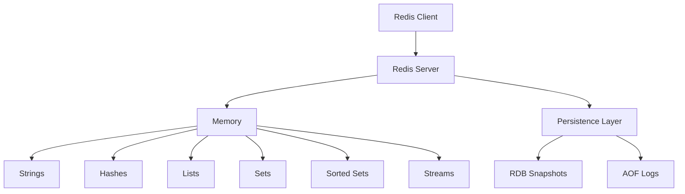
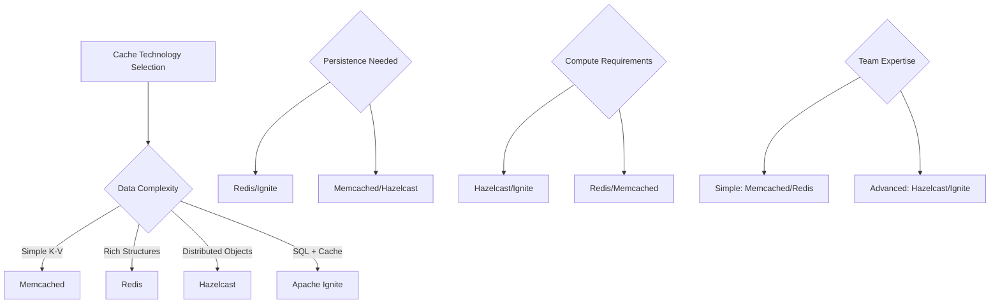

# Cache Technologies

## Overview

Different caching technologies serve various use cases, from simple in-memory stores to sophisticated distributed systems. Understanding the characteristics, strengths, and limitations of each technology helps make informed decisions for your caching architecture.

## Redis

### Overview and Architecture

Redis (Remote Dictionary Server) is an in-memory data structure store that can be used as a database, cache, and message broker.



### Core Data Structures and Operations

```python
import redis
import json
import time

# Connect to Redis
r = redis.Redis(host='localhost', port=6379, db=0, decode_responses=True)

# 1. Strings - Simple key-value pairs
r.set('user:1001:name', 'John Doe')
r.setex('session:abc123', 3600, 'user_data')  # With expiration
name = r.get('user:1001:name')

# Atomic operations
r.incr('page_views:home')  # Increment counter
r.incrby('user:1001:score', 10)  # Increment by value

# 2. Hashes - Object-like structures
user_data = {
    'name': 'John Doe',
    'email': 'john@example.com',
    'age': '30',
    'city': 'New York'
}
r.hset('user:1001', mapping=user_data)
r.hget('user:1001', 'email')
r.hgetall('user:1001')  # Get all fields

# 3. Lists - Ordered collections
r.lpush('user:1001:notifications', 'New message from Alice')
r.lpush('user:1001:notifications', 'Friend request from Bob')
notifications = r.lrange('user:1001:notifications', 0, 9)  # Get first 10

# Queue operations
r.rpush('task_queue', 'process_payment')  # Add to end
task = r.blpop('task_queue', timeout=30)  # Blocking pop from start

# 4. Sets - Unique collections
r.sadd('user:1001:interests', 'technology', 'music', 'sports')
r.sadd('user:1002:interests', 'technology', 'art', 'travel')

# Set operations
common_interests = r.sinter('user:1001:interests', 'user:1002:interests')
all_interests = r.sunion('user:1001:interests', 'user:1002:interests')

# 5. Sorted Sets - Ordered by score
r.zadd('leaderboard', {'player1': 1000, 'player2': 1500, 'player3': 800})
top_players = r.zrevrange('leaderboard', 0, 2, withscores=True)

# 6. Streams - Log-like data structure
r.xadd('events', {'user_id': '1001', 'action': 'login', 'timestamp': time.time()})
events = r.xread({'events': '0'}, count=10)
```

### Advanced Redis Features

```python
class RedisAdvancedCache:
    def __init__(self, host='localhost', port=6379):
        self.redis = redis.Redis(host=host, port=port, decode_responses=True)
    
    def cache_with_tags(self, key: str, data: any, tags: list, ttl: int = 3600):
        """Cache data with tags for group invalidation"""
        # Store the actual data
        self.redis.setex(key, ttl, json.dumps(data))
        
        # Add key to each tag set
        for tag in tags:
            self.redis.sadd(f"tag:{tag}", key)
            self.redis.expire(f"tag:{tag}", ttl + 60)  # Tag expires slightly later
    
    def invalidate_by_tag(self, tag: str):
        """Invalidate all keys associated with a tag"""
        keys = self.redis.smembers(f"tag:{tag}")
        if keys:
            # Delete all keys with this tag
            self.redis.delete(*keys)
            # Delete the tag set itself
            self.redis.delete(f"tag:{tag}")
    
    def distributed_lock(self, lock_key: str, timeout: int = 10):
        """Distributed lock implementation"""
        class RedisLock:
            def __init__(self, redis_client, key, timeout):
                self.redis = redis_client
                self.key = f"lock:{key}"
                self.timeout = timeout
                self.identifier = str(time.time())
            
            def __enter__(self):
                # Try to acquire lock
                if self.redis.set(self.key, self.identifier, nx=True, ex=self.timeout):
                    return self
                raise Exception(f"Could not acquire lock: {self.key}")
            
            def __exit__(self, exc_type, exc_val, exc_tb):
                # Release lock only if we own it
                lua_script = """
                if redis.call("get", KEYS[1]) == ARGV[1] then
                    return redis.call("del", KEYS[1])
                else
                    return 0
                end
                """
                self.redis.eval(lua_script, 1, self.key, self.identifier)
        
        return RedisLock(self.redis, lock_key, timeout)
    
    def rate_limiter(self, key: str, limit: int, window: int):
        """Sliding window rate limiter"""
        now = time.time()
        pipeline = self.redis.pipeline()
        
        # Remove expired entries
        pipeline.zremrangebyscore(key, 0, now - window)
        
        # Count current requests
        pipeline.zcard(key)
        
        # Add current request
        pipeline.zadd(key, {str(now): now})
        
        # Set expiration
        pipeline.expire(key, window)
        
        results = pipeline.execute()
        current_requests = results[1]
        
        return current_requests < limit

# Usage examples
cache = RedisAdvancedCache()

# Cache with tags
user_data = {'id': 1001, 'name': 'John', 'department': 'Engineering'}
cache.cache_with_tags(
    'user:1001', 
    user_data, 
    tags=['users', 'department:engineering'], 
    ttl=1800
)

# Invalidate all engineering department data
cache.invalidate_by_tag('department:engineering')

# Distributed lock usage
try:
    with cache.distributed_lock('process_payments', timeout=30):
        # Critical section - only one process can execute this
        process_payment_batch()
except Exception as e:
    print(f"Could not acquire lock: {e}")

# Rate limiting
user_id = 1001
if cache.rate_limiter(f"api_calls:{user_id}", limit=100, window=3600):
    # Process API request
    handle_api_request()
else:
    # Rate limit exceeded
    return {"error": "Rate limit exceeded"}
```

### Redis Clustering and High Availability

```python
from rediscluster import RedisCluster

# Redis Cluster setup
startup_nodes = [
    {"host": "redis-node1", "port": "7000"},
    {"host": "redis-node2", "port": "7000"},
    {"host": "redis-node3", "port": "7000"},
    {"host": "redis-node4", "port": "7000"},
    {"host": "redis-node5", "port": "7000"},
    {"host": "redis-node6", "port": "7000"}
]

# Connect to Redis Cluster
rc = RedisCluster(
    startup_nodes=startup_nodes,
    decode_responses=True,
    skip_full_coverage_check=True,
    health_check_interval=30
)

# Cluster operations work the same as single Redis
rc.set("user:1001", "John Doe")
rc.hset("user:1001:profile", mapping={"name": "John", "age": "30"})

# Redis Sentinel for high availability
import redis.sentinel

# Sentinel configuration
sentinels = [
    ('sentinel1', 26379),
    ('sentinel2', 26379),
    ('sentinel3', 26379)
]

sentinel = redis.sentinel.Sentinel(sentinels, socket_timeout=0.1)

# Discover master and slaves
master = sentinel.master_for('mymaster', socket_timeout=0.1)
slave = sentinel.slave_for('mymaster', socket_timeout=0.1)

# Write to master, read from slave
master.set('key', 'value')
value = slave.get('key')
```

## Memcached

### Overview and Characteristics

Memcached is a simple, high-performance distributed memory caching system designed for speed and simplicity.

```python
import memcache
import json
import hashlib

class MemcachedClient:
    def __init__(self, servers=['127.0.0.1:11211']):
        self.mc = memcache.Client(servers, debug=0)
    
    def get(self, key: str):
        """Get value from Memcached"""
        data = self.mc.get(key)
        if data:
            return json.loads(data)
        return None
    
    def set(self, key: str, data: any, ttl: int = 3600):
        """Set value in Memcached"""
        serialized = json.dumps(data, default=str)
        return self.mc.set(key, serialized, time=ttl)
    
    def get_multi(self, keys: list):
        """Get multiple keys at once"""
        results = self.mc.get_multi(keys)
        return {k: json.loads(v) for k, v in results.items()}
    
    def set_multi(self, mapping: dict, ttl: int = 3600):
        """Set multiple key-value pairs"""
        serialized_mapping = {
            k: json.dumps(v, default=str) 
            for k, v in mapping.items()
        }
        return self.mc.set_multi(serialized_mapping, time=ttl)
    
    def delete(self, key: str):
        """Delete key from cache"""
        return self.mc.delete(key)
    
    def flush_all(self):
        """Clear all cache data"""
        return self.mc.flush_all()
    
    def stats(self):
        """Get cache statistics"""
        return self.mc.get_stats()

# Consistent hashing for distributed Memcached
class ConsistentHashMemcached:
    def __init__(self, servers):
        self.servers = servers
        self.clients = {server: memcache.Client([server]) for server in servers}
        self.ring = {}
        self._build_ring()
    
    def _build_ring(self):
        """Build consistent hash ring"""
        for server in self.servers:
            for i in range(160):  # Virtual nodes for better distribution
                key = hashlib.md5(f"{server}:{i}".encode()).hexdigest()
                self.ring[key] = server
        
        self.sorted_keys = sorted(self.ring.keys())
    
    def _get_server(self, key: str):
        """Get server for a given key"""
        if not self.ring:
            return None
        
        hash_key = hashlib.md5(key.encode()).hexdigest()
        
        # Find the first server clockwise
        for ring_key in self.sorted_keys:
            if hash_key <= ring_key:
                return self.ring[ring_key]
        
        # Wrap around to the first server
        return self.ring[self.sorted_keys[0]]
    
    def get(self, key: str):
        server = self._get_server(key)
        if server:
            return self.clients[server].get(key)
        return None
    
    def set(self, key: str, value: any, ttl: int = 3600):
        server = self._get_server(key)
        if server:
            serialized = json.dumps(value, default=str)
            return self.clients[server].set(key, serialized, time=ttl)
        return False

# Usage
mc = MemcachedClient(['server1:11211', 'server2:11211', 'server3:11211'])

# Basic operations
mc.set('user:1001', {'name': 'John', 'email': 'john@example.com'})
user = mc.get('user:1001')

# Batch operations
users = {
    'user:1001': {'name': 'John', 'age': 30},
    'user:1002': {'name': 'Jane', 'age': 25},
    'user:1003': {'name': 'Bob', 'age': 35}
}
mc.set_multi(users)
cached_users = mc.get_multi(['user:1001', 'user:1002', 'user:1003'])
```

## Hazelcast

### In-Memory Data Grid

Hazelcast provides distributed in-memory computing with data structures, caching, and processing capabilities.

```java
// Java Hazelcast example
import com.hazelcast.config.Config;
import com.hazelcast.core.Hazelcast;
import com.hazelcast.core.HazelcastInstance;
import com.hazelcast.map.IMap;
import com.hazelcast.cache.ICache;

public class HazelcastCacheExample {
    public static void main(String[] args) {
        // Create Hazelcast configuration
        Config config = new Config();
        config.setClusterName("cache-cluster");
        
        // Configure distributed map
        config.getMapConfig("user-cache")
              .setTimeToLiveSeconds(3600)
              .setMaxIdleSeconds(1800)
              .setBackupCount(1);
        
        // Start Hazelcast instance
        HazelcastInstance hz = Hazelcast.newHazelcastInstance(config);
        
        // Get distributed map (acts as cache)
        IMap<String, User> userCache = hz.getMap("user-cache");
        
        // Cache operations
        User user = new User("1001", "John Doe", "john@example.com");
        userCache.put("user:1001", user);
        
        User cachedUser = userCache.get("user:1001");
        
        // Distributed operations
        userCache.putIfAbsent("user:1002", new User("1002", "Jane", "jane@example.com"));
        
        // Atomic operations
        userCache.lock("user:1001");
        try {
            User lockedUser = userCache.get("user:1001");
            lockedUser.setLastLogin(System.currentTimeMillis());
            userCache.put("user:1001", lockedUser);
        } finally {
            userCache.unlock("user:1001");
        }
        
        // Near cache for local caching
        config.getMapConfig("user-cache")
              .getNearCacheConfig()
              .setInvalidateOnChange(true)
              .setTimeToLiveSeconds(600);
        
        hz.shutdown();
    }
}
```

```python
# Python Hazelcast client
import hazelcast

# Connect to Hazelcast cluster
client = hazelcast.HazelcastClient(
    cluster_members=["127.0.0.1:5701", "127.0.0.1:5702"],
    cluster_name="cache-cluster"
)

# Get distributed map
user_cache = client.get_map("user-cache")

# Cache operations
user_data = {
    "id": "1001",
    "name": "John Doe",
    "email": "john@example.com",
    "last_login": time.time()
}

user_cache.put("user:1001", user_data)
cached_user = user_cache.get("user:1001")

# Conditional operations
user_cache.put_if_absent("user:1002", {"id": "1002", "name": "Jane"})

# Bulk operations
users_batch = {
    "user:1003": {"id": "1003", "name": "Bob"},
    "user:1004": {"id": "1004", "name": "Alice"}
}
user_cache.put_all(users_batch)

# Event listeners
def user_added(event):
    print(f"User added: {event.key} -> {event.value}")

def user_removed(event):
    print(f"User removed: {event.key}")

user_cache.add_entry_listener(added_func=user_added, removed_func=user_removed)

client.shutdown()
```

## Apache Ignite

### Distributed Cache and Compute Platform

```java
// Java Apache Ignite example
import org.apache.ignite.Ignite;
import org.apache.ignite.Ignition;
import org.apache.ignite.IgniteCache;
import org.apache.ignite.cache.CacheMode;
import org.apache.ignite.configuration.CacheConfiguration;
import org.apache.ignite.configuration.IgniteConfiguration;

public class IgniteCacheExample {
    public static void main(String[] args) {
        // Ignite configuration
        IgniteConfiguration cfg = new IgniteConfiguration();
        cfg.setClientMode(false);  // Server node
        
        // Cache configuration
        CacheConfiguration<String, User> cacheCfg = new CacheConfiguration<>();
        cacheCfg.setName("user-cache");
        cacheCfg.setCacheMode(CacheMode.PARTITIONED);
        cacheCfg.setBackups(1);
        cacheCfg.setExpiryPolicyFactory(CreatedExpiryPolicy.factoryOf(Duration.ONE_HOUR));
        
        cfg.setCacheConfiguration(cacheCfg);
        
        // Start Ignite
        Ignite ignite = Ignition.start(cfg);
        
        // Get cache
        IgniteCache<String, User> cache = ignite.cache("user-cache");
        
        // Cache operations
        User user = new User("1001", "John Doe");
        cache.put("user:1001", user);
        
        User cachedUser = cache.get("user:1001");
        
        // SQL queries on cache
        SqlFieldsQuery sql = new SqlFieldsQuery(
            "SELECT name FROM User WHERE age > ?"
        ).setArgs(25);
        
        List<List<?>> results = cache.query(sql).getAll();
        
        // Compute operations
        IgniteCompute compute = ignite.compute();
        
        // Execute computation on cache data
        Integer totalUsers = compute.call(() -> {
            return cache.size();
        });
        
        ignite.close();
    }
}
```

## Technology Comparison

### Feature Matrix

| Feature | Redis | Memcached | Hazelcast | Apache Ignite |
|---------|-------|-----------|-----------|---------------|
| **Data Structures** | Rich (String, Hash, List, Set, etc.) | Key-Value only | Rich (Map, Queue, Set, etc.) | Rich + SQL |
| **Persistence** | Optional (RDB, AOF) | None | Optional | Optional |
| **Clustering** | Redis Cluster | Client-side | Built-in | Built-in |
| **Transactions** | Limited | None | Yes | ACID |
| **SQL Support** | Limited (RedisSearch) | None | Limited | Full SQL |
| **Compute** | Lua scripts | None | Distributed compute | Distributed compute |
| **Memory Usage** | Efficient | Very efficient | Moderate | Moderate |
| **Learning Curve** | Medium | Low | High | High |

### Performance Characteristics

```python
import time
import redis
import memcache
import threading
from concurrent.futures import ThreadPoolExecutor

class CacheBenchmark:
    def __init__(self):
        self.redis_client = redis.Redis(host='localhost', port=6379)
        self.memcached_client = memcache.Client(['127.0.0.1:11211'])
    
    def benchmark_redis(self, operations=10000):
        """Benchmark Redis operations"""
        start_time = time.time()
        
        # Write operations
        for i in range(operations):
            self.redis_client.set(f"key:{i}", f"value:{i}")
        
        write_time = time.time() - start_time
        
        # Read operations
        start_time = time.time()
        for i in range(operations):
            self.redis_client.get(f"key:{i}")
        
        read_time = time.time() - start_time
        
        return {
            'write_ops_per_sec': operations / write_time,
            'read_ops_per_sec': operations / read_time,
            'write_latency_ms': (write_time / operations) * 1000,
            'read_latency_ms': (read_time / operations) * 1000
        }
    
    def benchmark_memcached(self, operations=10000):
        """Benchmark Memcached operations"""
        start_time = time.time()
        
        # Write operations
        for i in range(operations):
            self.memcached_client.set(f"key:{i}", f"value:{i}")
        
        write_time = time.time() - start_time
        
        # Read operations
        start_time = time.time()
        for i in range(operations):
            self.memcached_client.get(f"key:{i}")
        
        read_time = time.time() - start_time
        
        return {
            'write_ops_per_sec': operations / write_time,
            'read_ops_per_sec': operations / read_time,
            'write_latency_ms': (write_time / operations) * 1000,
            'read_latency_ms': (read_time / operations) * 1000
        }
    
    def concurrent_benchmark(self, cache_client, operations=1000, threads=10):
        """Benchmark with concurrent operations"""
        def worker(thread_id):
            start_idx = thread_id * operations
            end_idx = start_idx + operations
            
            for i in range(start_idx, end_idx):
                cache_client.set(f"key:{i}", f"value:{i}")
                cache_client.get(f"key:{i}")
        
        start_time = time.time()
        
        with ThreadPoolExecutor(max_workers=threads) as executor:
            futures = [executor.submit(worker, i) for i in range(threads)]
            for future in futures:
                future.result()
        
        total_time = time.time() - start_time
        total_operations = operations * threads * 2  # set + get
        
        return {
            'total_ops_per_sec': total_operations / total_time,
            'avg_latency_ms': (total_time / total_operations) * 1000
        }

# Run benchmarks
benchmark = CacheBenchmark()

print("Redis Benchmark:")
redis_results = benchmark.benchmark_redis()
print(f"Write: {redis_results['write_ops_per_sec']:.0f} ops/sec")
print(f"Read: {redis_results['read_ops_per_sec']:.0f} ops/sec")

print("\nMemcached Benchmark:")
memcached_results = benchmark.benchmark_memcached()
print(f"Write: {memcached_results['write_ops_per_sec']:.0f} ops/sec")
print(f"Read: {memcached_results['read_ops_per_sec']:.0f} ops/sec")
```

## Use Case Selection Guide

### Decision Matrix



### Specific Use Cases

**Redis - Best For:**
- Session storage with complex data
- Real-time analytics and counters
- Pub/sub messaging
- Rate limiting and queues
- Geospatial applications

**Memcached - Best For:**
- Simple object caching
- Database query result caching
- High-throughput, low-latency scenarios
- Stateless application caching
- Cost-sensitive deployments

**Hazelcast - Best For:**
- Distributed application state
- In-memory computing
- Event-driven architectures
- Microservices coordination
- Real-time stream processing

**Apache Ignite - Best For:**
- In-memory databases
- Distributed SQL processing
- Machine learning workloads
- Complex analytical queries
- Hybrid transactional/analytical processing

## Deployment and Operations

### Redis Deployment Example

```yaml
# docker-compose.yml for Redis Cluster
version: '3.8'
services:
  redis-node1:
    image: redis:7-alpine
    command: redis-server --port 7000 --cluster-enabled yes --cluster-config-file nodes.conf --cluster-node-timeout 5000 --appendonly yes
    ports:
      - "7000:7000"
    volumes:
      - redis-node1-data:/data

  redis-node2:
    image: redis:7-alpine
    command: redis-server --port 7001 --cluster-enabled yes --cluster-config-file nodes.conf --cluster-node-timeout 5000 --appendonly yes
    ports:
      - "7001:7001"
    volumes:
      - redis-node2-data:/data

  redis-node3:
    image: redis:7-alpine
    command: redis-server --port 7002 --cluster-enabled yes --cluster-config-file nodes.conf --cluster-node-timeout 5000 --appendonly yes
    ports:
      - "7002:7002"
    volumes:
      - redis-node3-data:/data

volumes:
  redis-node1-data:
  redis-node2-data:
  redis-node3-data:
```

### Monitoring and Alerting

```python
import redis
import time
import logging

class CacheMonitor:
    def __init__(self, redis_client):
        self.redis = redis_client
        self.logger = logging.getLogger(__name__)
    
    def get_redis_stats(self):
        """Get Redis performance statistics"""
        info = self.redis.info()
        
        stats = {
            'connected_clients': info['connected_clients'],
            'used_memory': info['used_memory'],
            'used_memory_human': info['used_memory_human'],
            'keyspace_hits': info['keyspace_hits'],
            'keyspace_misses': info['keyspace_misses'],
            'instantaneous_ops_per_sec': info['instantaneous_ops_per_sec'],
            'total_commands_processed': info['total_commands_processed']
        }
        
        # Calculate hit ratio
        total_requests = stats['keyspace_hits'] + stats['keyspace_misses']
        if total_requests > 0:
            stats['hit_ratio'] = stats['keyspace_hits'] / total_requests
        else:
            stats['hit_ratio'] = 0
        
        return stats
    
    def check_health(self):
        """Health check for cache"""
        try:
            # Test basic operations
            test_key = f"health_check:{int(time.time())}"
            self.redis.set(test_key, "ok", ex=60)
            result = self.redis.get(test_key)
            self.redis.delete(test_key)
            
            if result == "ok":
                return {"status": "healthy", "latency_ms": self.measure_latency()}
            else:
                return {"status": "unhealthy", "error": "Set/Get test failed"}
        
        except Exception as e:
            return {"status": "unhealthy", "error": str(e)}
    
    def measure_latency(self, samples=10):
        """Measure average latency"""
        latencies = []
        
        for i in range(samples):
            start = time.time()
            self.redis.ping()
            latency = (time.time() - start) * 1000
            latencies.append(latency)
        
        return sum(latencies) / len(latencies)
    
    def alert_on_thresholds(self, stats):
        """Check for alert conditions"""
        alerts = []
        
        # Memory usage alert
        if stats['used_memory'] > 1024 * 1024 * 1024:  # 1GB
            alerts.append(f"High memory usage: {stats['used_memory_human']}")
        
        # Hit ratio alert
        if stats['hit_ratio'] < 0.8:
            alerts.append(f"Low hit ratio: {stats['hit_ratio']:.2%}")
        
        # Connection count alert
        if stats['connected_clients'] > 1000:
            alerts.append(f"High connection count: {stats['connected_clients']}")
        
        return alerts

# Usage
monitor = CacheMonitor(redis.Redis())
stats = monitor.get_redis_stats()
health = monitor.check_health()
alerts = monitor.alert_on_thresholds(stats)

if alerts:
    for alert in alerts:
        print(f"ALERT: {alert}")
```

## Best Practices

### Technology Selection
- **Start Simple**: Begin with Redis or Memcached for most use cases
- **Consider Growth**: Plan for scaling and operational complexity
- **Evaluate Expertise**: Choose technologies your team can operate effectively
- **Benchmark**: Test performance with your specific workload patterns

### Operational Excellence
- **Monitor Key Metrics**: Hit ratio, latency, memory usage, error rates
- **Plan for Failures**: Implement graceful degradation when cache is unavailable
- **Capacity Planning**: Monitor growth trends and plan for scaling
- **Security**: Implement authentication, encryption, and network security

## Summary

Cache technology selection depends on:

- **Data Model Requirements**: Simple key-value vs complex structures
- **Performance Needs**: Latency, throughput, and consistency requirements
- **Operational Complexity**: Team expertise and operational overhead
- **Scalability Requirements**: Single node vs distributed systems
- **Feature Requirements**: Persistence, transactions, compute capabilities

The key is matching technology capabilities with your specific use case requirements while considering long-term operational and scaling needs.