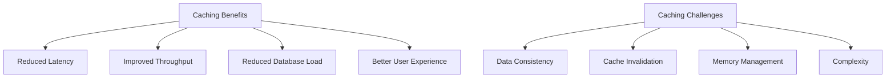
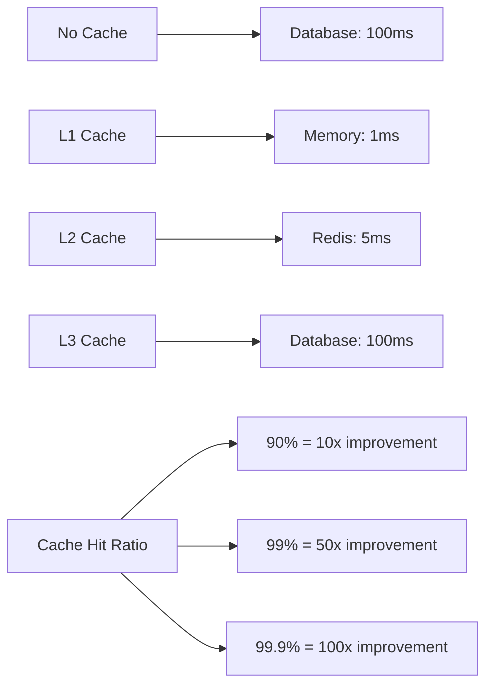
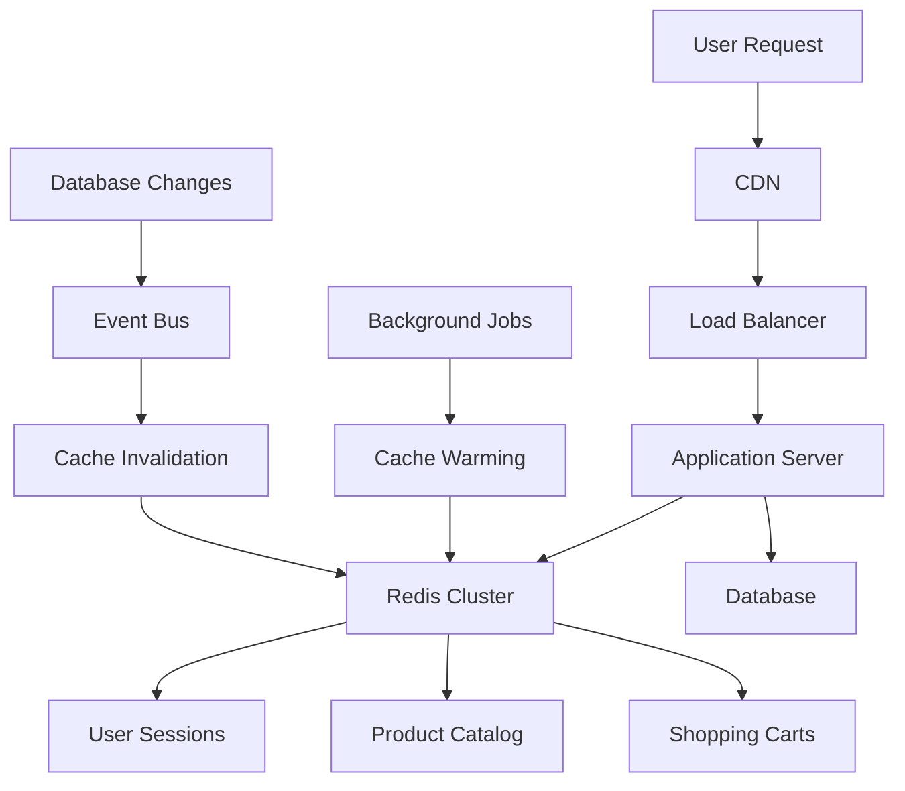
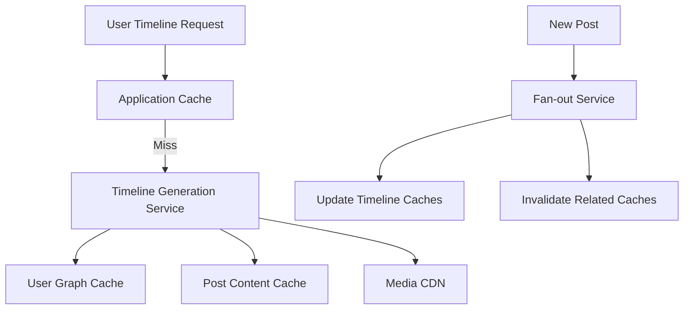

# Chapter 10: Caching Strategies

## Overview

Caching is one of the most effective techniques for improving system performance by storing frequently accessed data in fast storage layers. This chapter covers comprehensive caching strategies, from basic patterns to advanced invalidation techniques, helping you design efficient caching architectures.

## Learning Objectives

By the end of this chapter, you will understand:

- **Cache Patterns**: Different approaches to implementing caching logic in applications
- **Cache Levels**: Multi-tier caching strategies from browser to database
- **Cache Technologies**: Popular caching solutions and their trade-offs
- **Cache Invalidation**: Strategies for maintaining data consistency in cached systems

## Chapter Structure

### [10.1 Cache Patterns](01-patterns.md)
- Cache-Aside (Lazy Loading) pattern
- Write-Through and Write-Behind patterns
- Refresh-Ahead pattern
- Around (Decorator) pattern
- Pattern comparison and selection criteria

### [10.2 Cache Levels](02-levels.md)
- Browser and client-side caching
- CDN (Content Delivery Network) caching
- Reverse proxy caching (Nginx, Varnish)
- Application-level caching
- Database-level caching
- Multi-level cache coordination

### [10.3 Cache Technologies](03-technologies.md)
- Redis: Features, data structures, and clustering
- Memcached: Simple, high-performance caching
- Hazelcast: In-memory data grid capabilities
- Apache Ignite: Distributed cache and compute
- Technology comparison and selection guide

### [10.4 Cache Invalidation](04-invalidation.md)
- Time-based invalidation (TTL strategies)
- Event-based invalidation patterns
- Tag-based invalidation for related data
- Version-based invalidation and optimistic locking
- Dependency-based invalidation for complex relationships

## Key Concepts

### Caching Benefits and Trade-offs



### Cache Decision Framework

| Factor | Consideration | Impact on Strategy |
|--------|---------------|-------------------|
| **Data Volatility** | How often data changes | TTL length, invalidation strategy |
| **Access Patterns** | Read/write ratio, hotspots | Cache level, eviction policy |
| **Consistency Requirements** | Strong vs eventual consistency | Write pattern, invalidation timing |
| **Data Size** | Memory constraints | Cache technology, eviction policy |
| **Geographic Distribution** | Global vs local access | CDN usage, cache placement |

### Performance Impact Analysis



## Common Caching Patterns

### ✅ Effective Patterns

**Layered Caching Strategy**
```
Browser Cache → CDN → Application Cache → Database Cache → Database
```

**Cache-Aside with Write-Through**
```python
# Read path: Cache-aside
def get_user(user_id):
    user = cache.get(f"user:{user_id}")
    if not user:
        user = database.get_user(user_id)
        cache.set(f"user:{user_id}", user, ttl=3600)
    return user

# Write path: Write-through
def update_user(user_id, data):
    database.update_user(user_id, data)
    cache.set(f"user:{user_id}", data, ttl=3600)
```

**Smart TTL Strategy**
```python
# Different TTL based on data characteristics
TTL_STRATEGIES = {
    'user_profile': 3600,      # 1 hour - changes occasionally
    'product_price': 300,      # 5 minutes - changes frequently  
    'static_content': 86400,   # 24 hours - rarely changes
    'real_time_data': 60       # 1 minute - very dynamic
}
```

### ❌ Anti-Patterns

**Cache Stampede**
```python
# Bad: Multiple threads fetch same data simultaneously
def get_popular_data():
    data = cache.get("popular_item")
    if not data:
        # Multiple threads execute this expensive operation
        data = expensive_database_operation()
        cache.set("popular_item", data)
    return data

# Good: Use locking or single-flight pattern
def get_popular_data_safe():
    data = cache.get("popular_item")
    if not data:
        with distributed_lock("popular_item"):
            data = cache.get("popular_item")  # Double-check
            if not data:
                data = expensive_database_operation()
                cache.set("popular_item", data)
    return data
```

**Over-Caching**
```python
# Bad: Caching everything regardless of access patterns
cache.set(f"user:{user_id}:rarely_used_data", data, ttl=3600)

# Good: Cache based on access frequency
if access_count > threshold:
    cache.set(f"user:{user_id}:data", data, ttl=3600)
```

## Real-World Architecture Examples

### E-commerce Platform Caching



### Social Media Feed Caching



## Cache Sizing and Capacity Planning

### Memory Estimation

```python
class CacheCapacityPlanner:
    def __init__(self):
        self.object_sizes = {
            'user_profile': 2048,      # 2KB average
            'product_detail': 4096,    # 4KB average
            'search_result': 8192,     # 8KB average
            'session_data': 1024       # 1KB average
        }
    
    def estimate_memory_usage(self, cache_config):
        total_memory = 0
        
        for cache_type, config in cache_config.items():
            object_size = self.object_sizes.get(cache_type, 1024)
            object_count = config['estimated_objects']
            overhead = config.get('overhead_factor', 1.5)  # Redis overhead
            
            memory_usage = object_size * object_count * overhead
            total_memory += memory_usage
            
            print(f"{cache_type}: {memory_usage / (1024**2):.1f} MB")
        
        return total_memory

# Example capacity planning
cache_config = {
    'user_profile': {'estimated_objects': 100000},
    'product_detail': {'estimated_objects': 50000},
    'search_result': {'estimated_objects': 10000},
    'session_data': {'estimated_objects': 20000}
}

planner = CacheCapacityPlanner()
total_memory = planner.estimate_memory_usage(cache_config)
print(f"Total estimated memory: {total_memory / (1024**3):.2f} GB")
```

### Hit Rate Optimization

```python
class CacheMetrics:
    def __init__(self, redis_client):
        self.redis = redis_client
    
    def calculate_hit_rate(self, time_window_seconds=3600):
        """Calculate cache hit rate over time window"""
        info = self.redis.info()
        
        hits = info['keyspace_hits']
        misses = info['keyspace_misses']
        total_requests = hits + misses
        
        if total_requests == 0:
            return 0.0
        
        hit_rate = hits / total_requests
        return hit_rate
    
    def analyze_key_patterns(self):
        """Analyze which key patterns are most/least effective"""
        # Sample keys and analyze patterns
        sample_keys = []
        for key in self.redis.scan_iter(count=1000):
            ttl = self.redis.ttl(key)
            sample_keys.append({'key': key, 'ttl': ttl})
        
        # Group by pattern
        patterns = {}
        for key_info in sample_keys:
            pattern = self.extract_pattern(key_info['key'])
            if pattern not in patterns:
                patterns[pattern] = {'count': 0, 'avg_ttl': 0}
            patterns[pattern]['count'] += 1
            patterns[pattern]['avg_ttl'] += key_info['ttl']
        
        # Calculate averages
        for pattern in patterns:
            if patterns[pattern]['count'] > 0:
                patterns[pattern]['avg_ttl'] /= patterns[pattern]['count']
        
        return patterns
    
    def extract_pattern(self, key):
        """Extract pattern from key (e.g., 'user:123' -> 'user:*')"""
        parts = key.split(':')
        if len(parts) >= 2:
            return f"{parts[0]}:*"
        return key
```

## Monitoring and Alerting

### Key Metrics to Track

```python
class CacheMonitoring:
    def __init__(self, redis_client):
        self.redis = redis_client
    
    def get_health_metrics(self):
        """Get comprehensive cache health metrics"""
        info = self.redis.info()
        
        metrics = {
            # Performance metrics
            'hit_rate': self.calculate_hit_rate(),
            'ops_per_second': info.get('instantaneous_ops_per_sec', 0),
            'latency_ms': self.measure_latency(),
            
            # Resource metrics
            'memory_usage_mb': info['used_memory'] / (1024 * 1024),
            'memory_usage_percent': (info['used_memory'] / info['total_system_memory']) * 100,
            'connected_clients': info['connected_clients'],
            
            # Reliability metrics
            'keyspace_hits': info['keyspace_hits'],
            'keyspace_misses': info['keyspace_misses'],
            'expired_keys': info['expired_keys'],
            'evicted_keys': info['evicted_keys']
        }
        
        return metrics
    
    def check_alerts(self, metrics):
        """Check for alert conditions"""
        alerts = []
        
        if metrics['hit_rate'] < 0.8:
            alerts.append(f"Low hit rate: {metrics['hit_rate']:.2%}")
        
        if metrics['memory_usage_percent'] > 85:
            alerts.append(f"High memory usage: {metrics['memory_usage_percent']:.1f}%")
        
        if metrics['latency_ms'] > 10:
            alerts.append(f"High latency: {metrics['latency_ms']:.1f}ms")
        
        if metrics['evicted_keys'] > 1000:
            alerts.append(f"High eviction rate: {metrics['evicted_keys']} keys")
        
        return alerts
```

## Interview Focus Areas

When discussing caching in system design interviews:

1. **Identify Caching Opportunities**: Where would caching provide the most benefit?
2. **Choose Appropriate Patterns**: Match caching patterns to use case requirements
3. **Select Cache Technologies**: Justify technology choices based on requirements
4. **Design Invalidation Strategy**: Ensure data consistency while maintaining performance
5. **Consider Failure Scenarios**: How does the system behave when cache is unavailable?
6. **Estimate Cache Size**: Calculate memory requirements and hit rate expectations

## Best Practices Summary

### Design Principles
- **Cache Close to Usage**: Place caches near where data is consumed
- **Cache Frequently Accessed Data**: Focus on high-impact, frequently used data
- **Design for Cache Failures**: Ensure graceful degradation when cache is unavailable
- **Monitor and Optimize**: Continuously track performance and adjust strategies

### Implementation Guidelines
- **Use Consistent Key Naming**: Establish clear key naming conventions
- **Set Appropriate TTLs**: Balance freshness with performance
- **Implement Proper Error Handling**: Handle cache failures gracefully
- **Plan for Scaling**: Design cache architecture to scale with growth

### Operational Excellence
- **Monitor Key Metrics**: Track hit rates, latency, and resource usage
- **Automate Cache Warming**: Pre-populate caches with frequently accessed data
- **Test Invalidation Logic**: Ensure cache invalidation works correctly
- **Document Cache Strategies**: Maintain clear documentation of caching decisions

## Summary

Effective caching strategies require understanding:

- **Access Patterns**: How data is read and written in your application
- **Consistency Requirements**: Trade-offs between performance and data freshness
- **Technology Characteristics**: Strengths and limitations of different cache technologies
- **Operational Complexity**: Monitoring, maintenance, and troubleshooting requirements

The key is starting with simple caching patterns and evolving to more sophisticated strategies as your application grows and requirements become more complex.

## Next Steps

- Practice implementing different cache patterns
- Experiment with various cache technologies
- Study real-world caching architectures
- Learn about cache monitoring and optimization tools
- Understand the operational aspects of cache management

Continue to [Chapter 11: Load Balancing & Traffic Management](../chapter-11-load-balancing/README.md) to learn how load balancing complements caching for scalable system architectures.