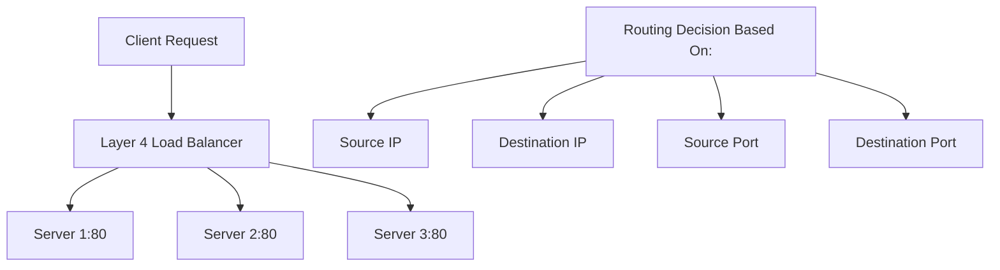
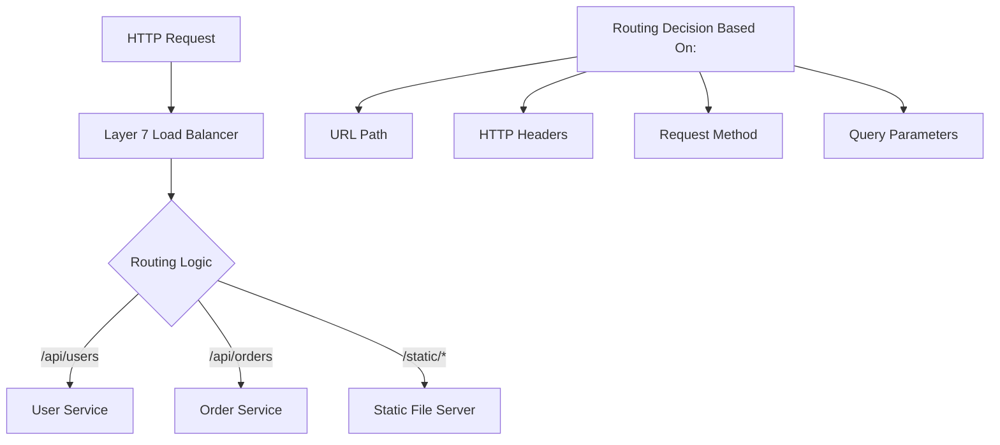

# Load Balancer Types

## Overview

Load balancers operate at different layers of the network stack and can be implemented in hardware or software. Understanding the different types helps choose the right solution for specific requirements.

## Layer 4 vs Layer 7 Load Balancing

### Layer 4 (Transport Layer) Load Balancing

Operates at the transport layer, making routing decisions based on IP addresses and port numbers.



#### Characteristics

- **Fast**: Minimal processing overhead
- **Protocol Agnostic**: Works with any TCP/UDP traffic
- **Limited Intelligence**: Cannot inspect application data
- **Connection-based**: Maintains connection state

#### Implementation Example

```python
import socket
import threading
from typing import List, Tuple

class Layer4LoadBalancer:
    def __init__(self, listen_port: int, backend_servers: List[Tuple[str, int]]):
        self.listen_port = listen_port
        self.backend_servers = backend_servers
        self.current_server = 0
    
    def start(self):
        """Start the Layer 4 load balancer"""
        server_socket = socket.socket(socket.AF_INET, socket.SOCK_STREAM)
        server_socket.setsockopt(socket.SOL_SOCKET, socket.SO_REUSEADDR, 1)
        server_socket.bind(('0.0.0.0', self.listen_port))
        server_socket.listen(100)
        
        print(f"Layer 4 Load Balancer listening on port {self.listen_port}")
        
        while True:
            client_socket, client_address = server_socket.accept()
            
            # Select backend server (round robin)
            backend_host, backend_port = self.get_next_server()
            
            # Handle connection in separate thread
            thread = threading.Thread(
                target=self.handle_connection,
                args=(client_socket, backend_host, backend_port)
            )
            thread.daemon = True
            thread.start()
    
    def get_next_server(self) -> Tuple[str, int]:
        """Get next backend server using round robin"""
        server = self.backend_servers[self.current_server]
        self.current_server = (self.current_server + 1) % len(self.backend_servers)
        return server
    
    def handle_connection(self, client_socket: socket.socket, backend_host: str, backend_port: int):
        """Proxy connection between client and backend server"""
        try:
            # Connect to backend server
            backend_socket = socket.socket(socket.AF_INET, socket.SOCK_STREAM)
            backend_socket.connect((backend_host, backend_port))
            
            # Start bidirectional data forwarding
            client_to_backend = threading.Thread(
                target=self.forward_data,
                args=(client_socket, backend_socket)
            )
            backend_to_client = threading.Thread(
                target=self.forward_data,
                args=(backend_socket, client_socket)
            )
            
            client_to_backend.daemon = True
            backend_to_client.daemon = True
            
            client_to_backend.start()
            backend_to_client.start()
            
            # Wait for threads to complete
            client_to_backend.join()
            backend_to_client.join()
            
        except Exception as e:
            print(f"Connection error: {e}")
        finally:
            client_socket.close()
            if 'backend_socket' in locals():
                backend_socket.close()
    
    def forward_data(self, source: socket.socket, destination: socket.socket):
        """Forward data between sockets"""
        try:
            while True:
                data = source.recv(4096)
                if not data:
                    break
                destination.send(data)
        except:
            pass

# Usage
backend_servers = [('192.168.1.10', 8080), ('192.168.1.11', 8080), ('192.168.1.12', 8080)]
lb = Layer4LoadBalancer(80, backend_servers)
# lb.start()  # Uncomment to run
```

### Layer 7 (Application Layer) Load Balancing

Operates at the application layer, making intelligent routing decisions based on HTTP headers, URLs, and content.



#### Characteristics

- **Intelligent**: Can inspect and route based on application data
- **Feature Rich**: SSL termination, compression, caching
- **Higher Overhead**: More processing required
- **Protocol Specific**: Typically HTTP/HTTPS

#### Implementation Example

```python
from http.server import HTTPServer, BaseHTTPRequestHandler
import requests
import urllib.parse
from typing import Dict, List

class Layer7LoadBalancer(BaseHTTPRequestHandler):
    # Class variables for configuration
    routing_rules = {}
    backend_pools = {}
    
    @classmethod
    def configure(cls, rules: Dict[str, str], pools: Dict[str, List[str]]):
        """Configure routing rules and backend pools"""
        cls.routing_rules = rules
        cls.backend_pools = pools
    
    def do_GET(self):
        self.handle_request('GET')
    
    def do_POST(self):
        self.handle_request('POST')
    
    def do_PUT(self):
        self.handle_request('PUT')
    
    def do_DELETE(self):
        self.handle_request('DELETE')
    
    def handle_request(self, method: str):
        """Handle incoming HTTP request"""
        try:
            # Parse request
            parsed_path = urllib.parse.urlparse(self.path)
            path = parsed_path.path
            
            # Find matching backend pool
            backend_pool = self.find_backend_pool(path)
            if not backend_pool:
                self.send_error(404, "Service not found")
                return
            
            # Select backend server (simple round robin)
            backend_server = self.select_backend_server(backend_pool)
            if not backend_server:
                self.send_error(503, "Service unavailable")
                return
            
            # Forward request to backend
            self.forward_request(method, backend_server, parsed_path)
            
        except Exception as e:
            print(f"Request handling error: {e}")
            self.send_error(500, "Internal server error")
    
    def find_backend_pool(self, path: str) -> str:
        """Find backend pool based on path"""
        for pattern, pool_name in self.routing_rules.items():
            if path.startswith(pattern):
                return pool_name
        return None
    
    def select_backend_server(self, pool_name: str) -> str:
        """Select backend server from pool"""
        servers = self.backend_pools.get(pool_name, [])
        if not servers:
            return None
        
        # Simple round robin (in production, use proper load balancing)
        import random
        return random.choice(servers)
    
    def forward_request(self, method: str, backend_server: str, parsed_path):
        """Forward request to backend server"""
        # Construct backend URL
        backend_url = f"http://{backend_server}{parsed_path.path}"
        if parsed_path.query:
            backend_url += f"?{parsed_path.query}"
        
        # Prepare headers
        headers = {}
        for header_name, header_value in self.headers.items():
            if header_name.lower() not in ['host', 'connection']:
                headers[header_name] = header_value
        
        # Read request body for POST/PUT
        content_length = int(self.headers.get('Content-Length', 0))
        request_body = self.rfile.read(content_length) if content_length > 0 else None
        
        try:
            # Make request to backend
            response = requests.request(
                method=method,
                url=backend_url,
                headers=headers,
                data=request_body,
                timeout=30,
                stream=True
            )
            
            # Forward response
            self.send_response(response.status_code)
            
            # Forward response headers
            for header_name, header_value in response.headers.items():
                if header_name.lower() not in ['connection', 'transfer-encoding']:
                    self.send_header(header_name, header_value)
            
            self.end_headers()
            
            # Forward response body
            for chunk in response.iter_content(chunk_size=8192):
                if chunk:
                    self.wfile.write(chunk)
            
        except requests.RequestException as e:
            print(f"Backend request failed: {e}")
            self.send_error(502, "Bad gateway")

# Configuration and usage
def start_layer7_lb():
    # Configure routing rules
    routing_rules = {
        '/api/users': 'user_service',
        '/api/orders': 'order_service',
        '/static': 'static_service'
    }
    
    # Configure backend pools
    backend_pools = {
        'user_service': ['192.168.1.10:8080', '192.168.1.11:8080'],
        'order_service': ['192.168.1.20:8080', '192.168.1.21:8080'],
        'static_service': ['192.168.1.30:8080']
    }
    
    # Configure load balancer
    Layer7LoadBalancer.configure(routing_rules, backend_pools)
    
    # Start server
    server = HTTPServer(('0.0.0.0', 80), Layer7LoadBalancer)
    print("Layer 7 Load Balancer listening on port 80")
    # server.serve_forever()  # Uncomment to run
```

## Hardware vs Software Load Balancers

### Hardware Load Balancers

Dedicated physical appliances designed specifically for load balancing.

#### Advantages
- **High Performance**: Optimized hardware for maximum throughput
- **Low Latency**: Specialized ASICs for fast packet processing
- **Reliability**: Purpose-built with redundancy features
- **Vendor Support**: Professional support and maintenance

#### Disadvantages
- **High Cost**: Expensive initial investment and maintenance
- **Limited Flexibility**: Difficult to modify or customize
- **Vendor Lock-in**: Tied to specific vendor ecosystem
- **Scaling Challenges**: Physical limitations on capacity

#### Examples
- F5 BIG-IP
- Citrix NetScaler
- A10 Thunder
- Radware Alteon

### Software Load Balancers

Load balancing implemented in software, running on standard servers.

#### Advantages
- **Cost Effective**: Lower initial cost, runs on commodity hardware
- **Flexibility**: Easy to customize and modify
- **Scalability**: Can scale horizontally by adding more instances
- **Cloud Native**: Works well in cloud and containerized environments

#### Disadvantages
- **Performance Overhead**: Software processing overhead
- **Complexity**: Requires more configuration and management
- **Resource Usage**: Consumes CPU and memory on host system

#### Examples

**Open Source:**
- Nginx
- HAProxy
- Apache HTTP Server
- Envoy Proxy

**Commercial:**
- AWS Application Load Balancer
- Google Cloud Load Balancer
- Azure Load Balancer
- Kong Gateway

## Cloud Load Balancers

### AWS Load Balancer Types

```yaml
# Application Load Balancer (Layer 7)
ApplicationLoadBalancer:
  Type: AWS::ElasticLoadBalancingV2::LoadBalancer
  Properties:
    Type: application
    Scheme: internet-facing
    SecurityGroups:
      - !Ref ALBSecurityGroup
    Subnets:
      - !Ref PublicSubnet1
      - !Ref PublicSubnet2

# Network Load Balancer (Layer 4)
NetworkLoadBalancer:
  Type: AWS::ElasticLoadBalancingV2::LoadBalancer
  Properties:
    Type: network
    Scheme: internet-facing
    Subnets:
      - !Ref PublicSubnet1
      - !Ref PublicSubnet2
```

### Google Cloud Load Balancer

```yaml
# HTTP(S) Load Balancer
apiVersion: networking.gke.io/v1
kind: ManagedCertificate
metadata:
  name: ssl-certificate
spec:
  domains:
    - example.com
---
apiVersion: networking.k8s.io/v1
kind: Ingress
metadata:
  name: web-ingress
  annotations:
    kubernetes.io/ingress.global-static-ip-name: "web-static-ip"
    networking.gke.io/managed-certificates: "ssl-certificate"
spec:
  rules:
  - host: example.com
    http:
      paths:
      - path: /
        pathType: Prefix
        backend:
          service:
            name: web-service
            port:
              number: 80
```
restart task 5.3 from the beginning| ✅ |

### Selection Criteria

1. **Performance Requirements**
   - High throughput: Hardware or Layer 4
   - Complex routing: Layer 7

2. **Budget Constraints**
   - Limited budget: Software solutions
   - Enterprise: Hardware or cloud

3. **Operational Model**
   - Self-managed: Software solutions
   - Managed service: Cloud load balancers

4. **Scalability Needs**
   - Predictable load: Hardware
   - Variable load: Cloud or software

## Configuration Examples

### Nginx Load Balancer

```nginx
# /etc/nginx/nginx.conf
upstream backend_servers {
    # Load balancing method
    least_conn;
    
    # Backend servers
    server 192.168.1.10:8080 weight=3 max_fails=3 fail_timeout=30s;
    server 192.168.1.11:8080 weight=2 max_fails=3 fail_timeout=30s;
    server 192.168.1.12:8080 weight=1 max_fails=3 fail_timeout=30s backup;
}

server {
    listen 80;
    server_name example.com;
    
    # Health check endpoint
    location /health {
        access_log off;
        return 200 "healthy\n";
        add_header Content-Type text/plain;
    }
    
    # Main application
    location / {
        proxy_pass http://backend_servers;
        proxy_set_header Host $host;
        proxy_set_header X-Real-IP $remote_addr;
        proxy_set_header X-Forwarded-For $proxy_add_x_forwarded_for;
        proxy_set_header X-Forwarded-Proto $scheme;
        
        # Timeouts
        proxy_connect_timeout 5s;
        proxy_send_timeout 10s;
        proxy_read_timeout 10s;
        
        # Retry logic
        proxy_next_upstream error timeout invalid_header http_500 http_502 http_503;
        proxy_next_upstream_tries 3;
    }
}
```

### HAProxy Configuration

```haproxy
# /etc/haproxy/haproxy.cfg
global
    daemon
    maxconn 4096
    log stdout local0

defaults
    mode http
    timeout connect 5000ms
    timeout client 50000ms
    timeout server 50000ms
    option httplog
    option dontlognull
    retries 3

# Frontend configuration
frontend web_frontend
    bind *:80
    bind *:443 ssl crt /etc/ssl/certs/example.com.pem
    redirect scheme https if !{ ssl_fc }
    
    # ACLs for routing
    acl is_api path_beg /api
    acl is_static path_beg /static
    
    # Routing rules
    use_backend api_servers if is_api
    use_backend static_servers if is_static
    default_backend web_servers

# Backend configurations
backend web_servers
    balance roundrobin
    option httpchk GET /health
    server web1 192.168.1.10:8080 check weight 100
    server web2 192.168.1.11:8080 check weight 100
    server web3 192.168.1.12:8080 check weight 50 backup

backend api_servers
    balance leastconn
    option httpchk GET /api/health
    server api1 192.168.1.20:8080 check
    server api2 192.168.1.21:8080 check

backend static_servers
    balance source
    option httpchk GET /health
    server static1 192.168.1.30:8080 check
```

## Best Practices

### Performance Optimization

1. **Connection Pooling**: Reuse connections to backend servers
2. **Keep-Alive**: Enable HTTP keep-alive for persistent connections
3. **Compression**: Enable gzip compression for text content
4. **Caching**: Implement caching for static content
5. **SSL Optimization**: Use session resumption and OCSP stapling

### Security Considerations

1. **SSL Termination**: Terminate SSL at load balancer
2. **Rate Limiting**: Implement rate limiting to prevent abuse
3. **DDoS Protection**: Use DDoS mitigation techniques
4. **Access Control**: Implement IP whitelisting/blacklisting
5. **Security Headers**: Add security headers to responses

### Monitoring and Observability

1. **Health Checks**: Implement comprehensive health checking
2. **Metrics Collection**: Monitor key performance metrics
3. **Logging**: Implement detailed access and error logging
4. **Alerting**: Set up alerts for failures and performance issues
5. **Distributed Tracing**: Implement request tracing across services

## Summary

Load balancer types offer different capabilities and trade-offs:

- **Layer 4**: High performance, protocol agnostic, limited intelligence
- **Layer 7**: Intelligent routing, feature rich, higher overhead
- **Hardware**: Maximum performance, high cost, limited flexibility
- **Software**: Cost effective, flexible, requires more management
- **Cloud**: Managed service, scalable, vendor-specific features

The choice depends on your specific requirements for performance, cost, flexibility, and operational model. Next, we'll explore service discovery mechanisms that enable dynamic load balancing in modern distributed systems.