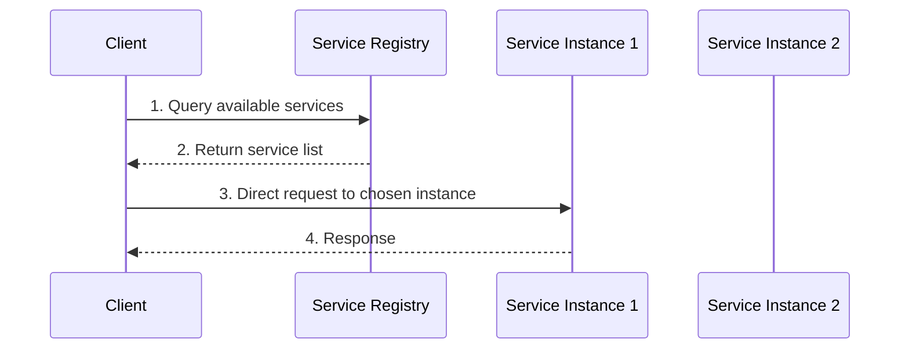
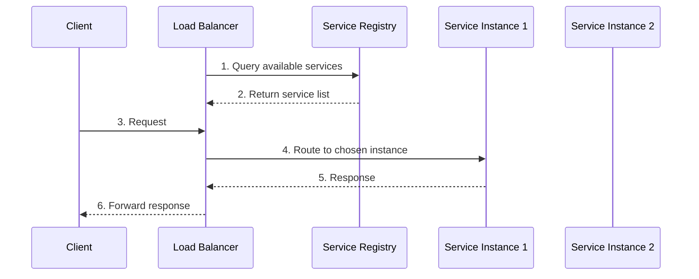

# Service Discovery

## Overview

Service discovery is the process of automatically detecting and connecting to available services in a distributed system. As systems scale and become more dynamic, manual configuration becomes impractical. Service discovery enables automatic registration, health monitoring, and dynamic routing of requests to healthy service instances.

## Service Discovery Patterns

### Client-Side Discovery

Clients are responsible for determining available service instances and load balancing between them.



#### Implementation Example

```python
import requests
import random
import time
import threading
from typing import List, Dict, Optional

class ServiceRegistry:
    def __init__(self):
        self.services = {}  # service_name -> list of instances
        self.lock = threading.RLock()
    
    def register_service(self, service_name: str, instance: Dict):
        """Register a service instance"""
        with self.lock:
            if service_name not in self.services:
                self.services[service_name] = []
            
            # Add instance if not already registered
            instance_id = instance.get('id')
            existing_instances = [inst for inst in self.services[service_name] if inst.get('id') == instance_id]
            
            if not existing_instances:
                instance['registered_at'] = time.time()
                instance['last_heartbeat'] = time.time()
                self.services[service_name].append(instance)
                print(f"Registered {service_name} instance: {instance['address']}")
    
    def deregister_service(self, service_name: str, instance_id: str):
        """Deregister a service instance"""
        with self.lock:
            if service_name in self.services:
                self.services[service_name] = [
                    inst for inst in self.services[service_name] 
                    if inst.get('id') != instance_id
                ]
                print(f"Deregistered {service_name} instance: {instance_id}")
    
    def get_service_instances(self, service_name: str) -> List[Dict]:
        """Get all healthy instances of a service"""
        with self.lock:
            if service_name not in self.services:
                return []
            
            # Filter healthy instances (heartbeat within last 30 seconds)
            current_time = time.time()
            healthy_instances = [
                inst for inst in self.services[service_name]
                if current_time - inst.get('last_heartbeat', 0) < 30
            ]
            
            return healthy_instances
    
    def heartbeat(self, service_name: str, instance_id: str):
        """Update instance heartbeat"""
        with self.lock:
            if service_name in self.services:
                for instance in self.services[service_name]:
                    if instance.get('id') == instance_id:
                        instance['last_heartbeat'] = time.time()
                        return True
            return False

class ClientSideDiscoveryClient:
    def __init__(self, registry: ServiceRegistry):
        self.registry = registry
        self.cache = {}  # Cache service instances
        self.cache_ttl = 30  # Cache for 30 seconds
        self.last_cache_update = {}
    
    def discover_service(self, service_name: str) -> List[Dict]:
        """Discover service instances with caching"""
        current_time = time.time()
        
        # Check cache first
        if (service_name in self.cache and 
            current_time - self.last_cache_update.get(service_name, 0) < self.cache_ttl):
            return self.cache[service_name]
        
        # Fetch from registry
        instances = self.registry.get_service_instances(service_name)
        
        # Update cache
        self.cache[service_name] = instances
        self.last_cache_update[service_name] = current_time
        
        return instances
    
    def call_service(self, service_name: str, endpoint: str, method: str = 'GET', **kwargs):
        """Make a request to a service with client-side load balancing"""
        instances = self.discover_service(service_name)
        
        if not instances:
            raise Exception(f"No healthy instances found for service: {service_name}")
        
        # Simple random load balancing
        instance = random.choice(instances)
        url = f"http://{instance['address']}{endpoint}"
        
        try:
            response = requests.request(method, url, timeout=5, **kwargs)
            return response
        except requests.RequestException as e:
            # Could implement retry logic with other instances
            raise Exception(f"Service call failed: {e}")

# Service instance with auto-registration
class ServiceInstance:
    def __init__(self, service_name: str, address: str, registry: ServiceRegistry):
        self.service_name = service_name
        self.address = address
        self.instance_id = f"{service_name}-{address}-{int(time.time())}"
        self.registry = registry
        self.running = False
        
        # Register with registry
        self.register()
        
        # Start heartbeat thread
        self.heartbeat_thread = threading.Thread(target=self._heartbeat_loop, daemon=True)
        self.heartbeat_thread.start()
    
    def register(self):
        """Register this instance with the registry"""
        instance_info = {
            'id': self.instance_id,
            'address': self.address,
            'service_name': self.service_name,
            'metadata': {
                'version': '1.0.0',
                'protocol': 'http'
            }
        }
        
        self.registry.register_service(self.service_name, instance_info)
        self.running = True
    
    def deregister(self):
        """Deregister this instance"""
        self.running = False
        self.registry.deregister_service(self.service_name, self.instance_id)
    
    def _heartbeat_loop(self):
        """Send periodic heartbeats to registry"""
        while self.running:
            self.registry.heartbeat(self.service_name, self.instance_id)
            time.sleep(10)  # Heartbeat every 10 seconds

# Usage example
registry = ServiceRegistry()

# Start some service instances
user_service_1 = ServiceInstance('user-service', '192.168.1.10:8080', registry)
user_service_2 = ServiceInstance('user-service', '192.168.1.11:8080', registry)
order_service_1 = ServiceInstance('order-service', '192.168.1.20:8080', registry)

# Client using service discovery
client = ClientSideDiscoveryClient(registry)

# Make service calls
try:
    response = client.call_service('user-service', '/users/123')
    print(f"User service response: {response.status_code}")
except Exception as e:
    print(f"Service call failed: {e}")
```

### Server-Side Discovery

A load balancer or API gateway handles service discovery and routing.



## Service Registry Implementations

### Consul Integration

```python
import consul
import json
import threading
import time

class ConsulServiceRegistry:
    def __init__(self, consul_host='localhost', consul_port=8500):
        self.consul = consul.Consul(host=consul_host, port=consul_port)
        self.registered_services = {}
    
    def register_service(self, service_name: str, service_id: str, address: str, port: int, 
                        health_check_url: str = None, tags: List[str] = None):
        """Register service with Consul"""
        
        # Prepare service definition
        service_def = {
            'name': service_name,
            'id': service_id,
            'address': address,
            'port': port,
            'tags': tags or []
        }
        
        # Add health check if provided
        if health_check_url:
            service_def['check'] = {
                'http': health_check_url,
                'interval': '10s',
                'timeout': '3s'
            }
        
        # Register with Consul
        success = self.consul.agent.service.register(**service_def)
        
        if success:
            self.registered_services[service_id] = service_def
            print(f"Registered service {service_name} with ID {service_id}")
        
        return success
    
    def deregister_service(self, service_id: str):
        """Deregister service from Consul"""
        success = self.consul.agent.service.deregister(service_id)
        
        if success and service_id in self.registered_services:
            del self.registered_services[service_id]
            print(f"Deregistered service with ID {service_id}")
        
        return success
    
    def discover_services(self, service_name: str, only_healthy: bool = True) -> List[Dict]:
        """Discover service instances"""
        try:
            # Get service instances
            _, services = self.consul.health.service(service_name, passing=only_healthy)
            
            instances = []
            for service in services:
                service_info = service['Service']
                instance = {
                    'id': service_info['ID'],
                    'address': service_info['Address'],
                    'port': service_info['Port'],
                    'tags': service_info['Tags'],
                    'metadata': service_info.get('Meta', {})
                }
                instances.append(instance)
            
            return instances
            
        except Exception as e:
            print(f"Service discovery failed: {e}")
            return []

# Usage example
consul_registry = ConsulServiceRegistry()

# Register a service
consul_registry.register_service(
    service_name='user-service',
    service_id='user-service-1',
    address='192.168.1.10',
    port=8080,
    health_check_url='http://192.168.1.10:8080/health',
    tags=['api', 'v1']
)
```

### Kubernetes Service Discovery

```python
from kubernetes import client, config
import threading
import time

class KubernetesServiceDiscovery:
    def __init__(self, namespace='default'):
        # Load Kubernetes config
        try:
            config.load_incluster_config()  # For pods running in cluster
        except:
            config.load_kube_config()  # For local development
        
        self.v1 = client.CoreV1Api()
        self.namespace = namespace
        self.service_cache = {}
        self.cache_lock = threading.RLock()
    
    def discover_services(self, service_name: str) -> List[Dict]:
        """Discover service endpoints"""
        try:
            # Get service endpoints
            endpoints = self.v1.read_namespaced_endpoints(
                name=service_name,
                namespace=self.namespace
            )
            
            instances = []
            if endpoints.subsets:
                for subset in endpoints.subsets:
                    if subset.addresses:
                        for address in subset.addresses:
                            for port in subset.ports:
                                instance = {
                                    'address': address.ip,
                                    'port': port.port,
                                    'protocol': port.protocol,
                                    'name': port.name,
                                    'ready': True
                                }
                                instances.append(instance)
            
            return instances
            
        except client.ApiException as e:
            print(f"Kubernetes API error: {e}")
            return []

# Usage in Kubernetes environment
k8s_discovery = KubernetesServiceDiscovery(namespace='production')

# Discover services
instances = k8s_discovery.discover_services('user-service')
print(f"Found {len(instances)} instances")
```

## DNS-Based Service Discovery

### Implementation with DNS SRV Records

```python
import dns.resolver
import random
import time
from typing import List, Tuple

class DNSServiceDiscovery:
    def __init__(self, domain_suffix='.service.consul'):
        self.domain_suffix = domain_suffix
        self.cache = {}
        self.cache_ttl = 30
        self.last_lookup = {}
    
    def discover_service(self, service_name: str) -> List[Tuple[str, int]]:
        """Discover service using DNS SRV records"""
        current_time = time.time()
        
        # Check cache
        if (service_name in self.cache and 
            current_time - self.last_lookup.get(service_name, 0) < self.cache_ttl):
            return self.cache[service_name]
        
        # Perform DNS lookup
        try:
            srv_name = f"{service_name}{self.domain_suffix}"
            answers = dns.resolver.resolve(srv_name, 'SRV')
            
            instances = []
            for answer in answers:
                # SRV record format: priority weight port target
                host = str(answer.target).rstrip('.')
                port = answer.port
                instances.append((host, port))
            
            # Cache results
            self.cache[service_name] = instances
            self.last_lookup[service_name] = current_time
            
            return instances
            
        except dns.resolver.NXDOMAIN:
            print(f"Service {service_name} not found in DNS")
            return []
        except Exception as e:
            print(f"DNS lookup failed: {e}")
            return []
    
    def call_service(self, service_name: str, endpoint: str, **kwargs):
        """Call service using DNS discovery"""
        instances = self.discover_service(service_name)
        
        if not instances:
            raise Exception(f"No instances found for service: {service_name}")
        
        # Simple random selection
        host, port = random.choice(instances)
        url = f"http://{host}:{port}{endpoint}"
        
        try:
            response = requests.get(url, timeout=10, **kwargs)
            return response
        except requests.RequestException as e:
            raise Exception(f"Service call failed: {e}")

# Usage with Consul DNS
dns_discovery = DNSServiceDiscovery('.service.consul')

try:
    response = dns_discovery.call_service('user-service', '/api/users/123')
    print(f"Response: {response.json()}")
except Exception as e:
    print(f"Service call failed: {e}")
```

## Health Checking

### Health Check Patterns

```python
import requests
import time
from enum import Enum
from concurrent.futures import ThreadPoolExecutor

class HealthStatus(Enum):
    HEALTHY = "healthy"
    UNHEALTHY = "unhealthy"
    UNKNOWN = "unknown"

class HealthChecker:
    def __init__(self, check_interval: int = 30):
        self.check_interval = check_interval
        self.health_status = {}
        self.running = False
        self.executor = ThreadPoolExecutor(max_workers=10)
    
    def start_monitoring(self, services: Dict[str, List[str]]):
        """Start health monitoring for services"""
        self.services = services
        self.running = True
        self.executor.submit(self._health_check_loop)
    
    def stop_monitoring(self):
        """Stop health monitoring"""
        self.running = False
        self.executor.shutdown(wait=True)
    
    def _health_check_loop(self):
        """Main health checking loop"""
        while self.running:
            # Check all services in parallel
            futures = []
            
            for service_name, instances in self.services.items():
                for instance in instances:
                    future = self.executor.submit(self._check_instance_health, service_name, instance)
                    futures.append(future)
            
            # Wait for all checks to complete
            for future in futures:
                try:
                    future.result(timeout=10)
                except Exception as e:
                    print(f"Health check error: {e}")
            
            time.sleep(self.check_interval)
    
    def _check_instance_health(self, service_name: str, instance: str):
        """Check health of a single instance"""
        try:
            # HTTP health check
            health_url = f"http://{instance}/health"
            response = requests.get(health_url, timeout=5)
            
            if response.status_code == 200:
                self.health_status[f"{service_name}:{instance}"] = HealthStatus.HEALTHY
            else:
                self.health_status[f"{service_name}:{instance}"] = HealthStatus.UNHEALTHY
                
        except requests.RequestException:
            self.health_status[f"{service_name}:{instance}"] = HealthStatus.UNHEALTHY
    
    def is_healthy(self, service_name: str, instance: str) -> bool:
        """Check if an instance is healthy"""
        key = f"{service_name}:{instance}"
        return self.health_status.get(key, HealthStatus.UNKNOWN) == HealthStatus.HEALTHY
    
    def get_healthy_instances(self, service_name: str, instances: List[str]) -> List[str]:
        """Get list of healthy instances for a service"""
        return [
            instance for instance in instances
            if self.is_healthy(service_name, instance)
        ]

# Usage example
health_checker = HealthChecker(check_interval=10)

services = {
    'user-service': ['192.168.1.10:8080', '192.168.1.11:8080'],
    'order-service': ['192.168.1.20:8080', '192.168.1.21:8080']
}

health_checker.start_monitoring(services)

# Get healthy instances
healthy_users = health_checker.get_healthy_instances('user-service', services['user-service'])
print(f"Healthy user service instances: {healthy_users}")
```

## Service Discovery Comparison

### Pattern Comparison

| Pattern | Pros | Cons | Use Case |
|---------|------|------|----------|
| **Client-Side** | Simple, no SPOF | Client complexity, consistency issues | Small systems, tight coupling OK |
| **Server-Side** | Client simplicity, centralized logic | Additional infrastructure, potential SPOF | Large systems, loose coupling |
| **DNS-Based** | Universal, caching | Limited metadata, TTL issues | Simple scenarios, legacy systems |

### Technology Comparison

| Technology | Type | Pros | Cons |
|------------|------|------|------|
| **Consul** | Dedicated | Feature rich, battle tested | Additional infrastructure |
| **etcd** | Dedicated | Strong consistency, simple | Limited service discovery features |
| **Kubernetes** | Platform | Integrated, automatic | Kubernetes-specific |
| **DNS** | Universal | Universal support, simple | Limited features |
| **Eureka** | Dedicated | Netflix proven, Java ecosystem | Java-centric |

## Best Practices

### Service Registration

1. **Unique IDs**: Use unique identifiers for service instances
2. **Metadata**: Include version, environment, and capability information
3. **Health Endpoints**: Implement comprehensive health check endpoints
4. **Graceful Shutdown**: Deregister services during shutdown
5. **Retry Logic**: Implement retry logic for registration failures

### Service Discovery

1. **Caching**: Cache service discovery results with appropriate TTL
2. **Fallback**: Implement fallback mechanisms for discovery failures
3. **Load Balancing**: Combine with appropriate load balancing algorithms
4. **Circuit Breakers**: Use circuit breakers for failed services
5. **Monitoring**: Monitor service discovery performance and availability

### Health Checking

1. **Comprehensive Checks**: Check dependencies, not just process health
2. **Appropriate Intervals**: Balance freshness with system load
3. **Timeout Handling**: Use appropriate timeouts for health checks
4. **Graceful Degradation**: Handle partial failures gracefully
5. **Health Check Endpoints**: Design lightweight, fast health endpoints

## Summary

Service discovery is essential for dynamic distributed systems:

- **Client-Side Discovery**: Simple but adds client complexity
- **Server-Side Discovery**: More complex infrastructure but simpler clients
- **DNS-Based**: Universal but limited features
- **Health Checking**: Critical for maintaining service quality

The choice depends on your system architecture, operational requirements, and team capabilities. Next, we'll explore traffic routing and failover strategies that build upon service discovery to create resilient systems.