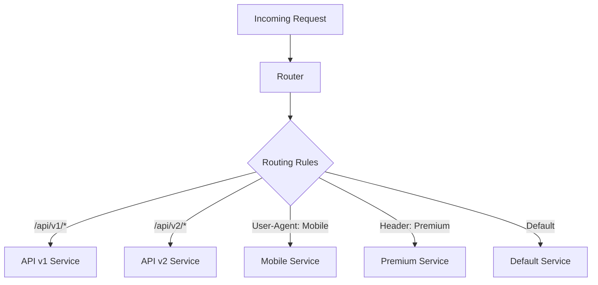

# Traffic Routing & Failover Strategies

## Overview

Traffic routing and failover strategies ensure that requests are directed to the right services and that systems remain available even when components fail. This section covers advanced routing techniques, failover mechanisms, and resilience patterns.

## Traffic Routing Strategies

### Content-Based Routing

Route requests based on request content, headers, or other attributes.



#### Implementation Example

```python
import re
from typing import Dict, List, Callable, Optional
from urllib.parse import urlparse

class RoutingRule:
    def __init__(self, name: str, condition: Callable, target: str, priority: int = 0):
        self.name = name
        self.condition = condition
        self.target = target
        self.priority = priority

class ContentBasedRouter:
    def __init__(self):
        self.rules: List[RoutingRule] = []
        self.default_target: Optional[str] = None
    
    def add_rule(self, rule: RoutingRule):
        """Add a routing rule"""
        self.rules.append(rule)
        # Sort by priority (higher priority first)
        self.rules.sort(key=lambda r: r.priority, reverse=True)
    
    def set_default_target(self, target: str):
        """Set default target for unmatched requests"""
        self.default_target = target
    
    def route_request(self, request_info: Dict) -> Optional[str]:
        """Route request based on rules"""
        for rule in self.rules:
            try:
                if rule.condition(request_info):
                    print(f"Request matched rule: {rule.name} -> {rule.target}")
                    return rule.target
            except Exception as e:
                print(f"Error evaluating rule {rule.name}: {e}")
                continue
        
        # No rule matched, use default
        if self.default_target:
            print(f"Using default target: {self.default_target}")
            return self.default_target
        
        return None

# Routing condition functions
def path_starts_with(prefix: str):
    """Create condition that matches path prefix"""
    def condition(request_info: Dict) -> bool:
        path = request_info.get('path', '')
        return path.startswith(prefix)
    return condition

def header_equals(header_name: str, value: str):
    """Create condition that matches header value"""
    def condition(request_info: Dict) -> bool:
        headers = request_info.get('headers', {})
        return headers.get(header_name, '').lower() == value.lower()
    return condition

def header_contains(header_name: str, substring: str):
    """Create condition that checks if header contains substring"""
    def condition(request_info: Dict) -> bool:
        headers = request_info.get('headers', {})
        header_value = headers.get(header_name, '').lower()
        return substring.lower() in header_value
    return condition

def query_param_equals(param_name: str, value: str):
    """Create condition that matches query parameter"""
    def condition(request_info: Dict) -> bool:
        query_params = request_info.get('query_params', {})
        return query_params.get(param_name) == value
    return condition

def method_equals(method: str):
    """Create condition that matches HTTP method"""
    def condition(request_info: Dict) -> bool:
        return request_info.get('method', '').upper() == method.upper()
    return condition

# Usage example
router = ContentBasedRouter()

# Add routing rules
router.add_rule(RoutingRule(
    name="API v2 routing",
    condition=path_starts_with('/api/v2'),
    target='api-v2-service',
    priority=100
))

router.add_rule(RoutingRule(
    name="API v1 routing",
    condition=path_starts_with('/api/v1'),
    target='api-v1-service',
    priority=90
))

router.add_rule(RoutingRule(
    name="Mobile routing",
    condition=header_contains('User-Agent', 'mobile'),
    target='mobile-service',
    priority=80
))

router.add_rule(RoutingRule(
    name="Premium user routing",
    condition=header_equals('X-User-Tier', 'premium'),
    target='premium-service',
    priority=70
))

router.add_rule(RoutingRule(
    name="Admin routing",
    condition=path_starts_with('/admin'),
    target='admin-service',
    priority=60
))

router.set_default_target('default-service')

# Test routing
test_requests = [
    {
        'path': '/api/v2/users',
        'method': 'GET',
        'headers': {'User-Agent': 'Mozilla/5.0'},
        'query_params': {}
    },
    {
        'path': '/api/v1/orders',
        'method': 'POST',
        'headers': {'User-Agent': 'Mobile App 1.0', 'X-User-Tier': 'premium'},
        'query_params': {}
    },
    {
        'path': '/admin/dashboard',
        'method': 'GET',
        'headers': {},
        'query_params': {}
    },
    {
        'path': '/static/image.jpg',
        'method': 'GET',
        'headers': {},
        'query_params': {}
    }
]

for i, request in enumerate(test_requests):
    target = router.route_request(request)
    print(f"Request {i+1}: {request['path']} -> {target}\n")
```

### Geographic Routing

Route traffic based on client location for improved performance and compliance.

```python
import geoip2.database
import geoip2.errors
from typing import Dict, List

class GeographicRouter:
    def __init__(self, geoip_db_path: str):
        self.reader = geoip2.database.Reader(geoip_db_path)
        self.region_mappings = {}
        self.default_region = None
    
    def add_region_mapping(self, countries: List[str], target_region: str):
        """Map countries to target regions"""
        for country in countries:
            self.region_mappings[country.upper()] = target_region
    
    def set_default_region(self, region: str):
        """Set default region for unmapped countries"""
        self.default_region = region
    
    def route_by_ip(self, client_ip: str) -> str:
        """Route request based on client IP geolocation"""
        try:
            response = self.reader.country(client_ip)
            country_code = response.country.iso_code
            
            # Find target region for country
            target_region = self.region_mappings.get(country_code, self.default_region)
            
            print(f"IP {client_ip} -> Country: {country_code} -> Region: {target_region}")
            return target_region
            
        except geoip2.errors.AddressNotFoundError:
            print(f"IP {client_ip} not found in database, using default region")
            return self.default_region
        except Exception as e:
            print(f"Geolocation error for IP {client_ip}: {e}")
            return self.default_region

# Usage example
geo_router = GeographicRouter('/path/to/GeoLite2-Country.mmdb')

# Configure region mappings
geo_router.add_region_mapping(['US', 'CA', 'MX'], 'us-west-2')
geo_router.add_region_mapping(['GB', 'FR', 'DE', 'IT', 'ES'], 'eu-west-1')
geo_router.add_region_mapping(['JP', 'KR', 'SG', 'AU'], 'ap-southeast-1')
geo_router.add_region_mapping(['BR', 'AR', 'CL'], 'sa-east-1')

geo_router.set_default_region('us-east-1')

# Test geographic routing
test_ips = ['8.8.8.8', '1.1.1.1', '208.67.222.222']
for ip in test_ips:
    region = geo_router.route_by_ip(ip)
    print(f"Route {ip} to region: {region}")
```

### Canary Routing

Gradually route traffic to new service versions for safe deployments.

```python
import random
from typing import Dict, List
from datetime import datetime, timedelta

class CanaryRouter:
    def __init__(self):
        self.deployments = {}  # service_name -> deployment_config
    
    def create_canary_deployment(self, service_name: str, stable_version: str, 
                                canary_version: str, canary_percentage: float,
                                duration_minutes: int = 60):
        """Create a canary deployment configuration"""
        self.deployments[service_name] = {
            'stable_version': stable_version,
            'canary_version': canary_version,
            'canary_percentage': canary_percentage,
            'start_time': datetime.now(),
            'duration': timedelta(minutes=duration_minutes),
            'total_requests': 0,
            'canary_requests': 0,
            'stable_requests': 0
        }
        
        print(f"Created canary deployment for {service_name}: "
              f"{canary_percentage}% -> {canary_version}, "
              f"{100-canary_percentage}% -> {stable_version}")
    
    def route_request(self, service_name: str, request_id: str = None) -> str:
        """Route request to stable or canary version"""
        if service_name not in self.deployments:
            raise ValueError(f"No deployment configuration for service: {service_name}")
        
        deployment = self.deployments[service_name]
        
        # Check if canary deployment is still active
        if datetime.now() > deployment['start_time'] + deployment['duration']:
            print(f"Canary deployment for {service_name} has expired")
            return deployment['stable_version']
        
        # Determine routing based on percentage
        deployment['total_requests'] += 1
        
        # Use deterministic routing if request_id provided
        if request_id:
            # Hash-based routing for consistent user experience
            import hashlib
            hash_value = int(hashlib.md5(request_id.encode()).hexdigest(), 16)
            route_to_canary = (hash_value % 100) < deployment['canary_percentage']
        else:
            # Random routing
            route_to_canary = random.random() * 100 < deployment['canary_percentage']
        
        if route_to_canary:
            deployment['canary_requests'] += 1
            return deployment['canary_version']
        else:
            deployment['stable_requests'] += 1
            return deployment['stable_version']
    
    def update_canary_percentage(self, service_name: str, new_percentage: float):
        """Update canary traffic percentage"""
        if service_name in self.deployments:
            old_percentage = self.deployments[service_name]['canary_percentage']
            self.deployments[service_name]['canary_percentage'] = new_percentage
            print(f"Updated canary percentage for {service_name}: "
                  f"{old_percentage}% -> {new_percentage}%")
    
    def get_deployment_stats(self, service_name: str) -> Dict:
        """Get deployment statistics"""
        if service_name not in self.deployments:
            return {}
        
        deployment = self.deployments[service_name]
        total = deployment['total_requests']
        
        if total == 0:
            return deployment
        
        actual_canary_percentage = (deployment['canary_requests'] / total) * 100
        actual_stable_percentage = (deployment['stable_requests'] / total) * 100
        
        return {
            **deployment,
            'actual_canary_percentage': actual_canary_percentage,
            'actual_stable_percentage': actual_stable_percentage
        }
    
    def rollback_canary(self, service_name: str):
        """Rollback canary deployment (route all traffic to stable)"""
        if service_name in self.deployments:
            self.deployments[service_name]['canary_percentage'] = 0
            print(f"Rolled back canary deployment for {service_name}")
    
    def promote_canary(self, service_name: str):
        """Promote canary to stable (route all traffic to canary)"""
        if service_name in self.deployments:
            deployment = self.deployments[service_name]
            # Swap versions
            deployment['stable_version'] = deployment['canary_version']
            deployment['canary_percentage'] = 0
            print(f"Promoted canary to stable for {service_name}")

# Usage example
canary_router = CanaryRouter()

# Create canary deployment (5% traffic to new version)
canary_router.create_canary_deployment(
    service_name='user-service',
    stable_version='v1.2.0',
    canary_version='v1.3.0',
    canary_percentage=5.0,
    duration_minutes=30
)

# Simulate requests
for i in range(100):
    version = canary_router.route_request('user-service', f"user-{i}")
    # In real implementation, route to appropriate service version

# Check stats
stats = canary_router.get_deployment_stats('user-service')
print(f"Deployment stats: {stats}")

# Gradually increase canary traffic
canary_router.update_canary_percentage('user-service', 10.0)
canary_router.update_canary_percentage('user-service', 25.0)
canary_router.update_canary_percentage('user-service', 50.0)

# If everything looks good, promote canary
canary_router.promote_canary('user-service')
```

## Failover Mechanisms

### Active-Passive Failover

One instance handles traffic while others remain on standby.

```python
import time
import threading
from enum import Enum
from typing import List, Optional

class InstanceStatus(Enum):
    ACTIVE = "active"
    PASSIVE = "passive"
    FAILED = "failed"
    UNKNOWN = "unknown"

class FailoverInstance:
    def __init__(self, name: str, address: str, priority: int = 0):
        self.name = name
        self.address = address
        self.priority = priority  # Higher priority = preferred for active role
        self.status = InstanceStatus.UNKNOWN
        self.last_health_check = 0
        self.failure_count = 0

class ActivePassiveFailover:
    def __init__(self, instances: List[FailoverInstance], health_check_interval: int = 10):
        self.instances = sorted(instances, key=lambda x: x.priority, reverse=True)
        self.active_instance: Optional[FailoverInstance] = None
        self.health_check_interval = health_check_interval
        self.running = False
        self.lock = threading.Lock()
        
        # Start health checking
        self.health_thread = threading.Thread(target=self._health_check_loop, daemon=True)
    
    def start(self):
        """Start the failover system"""
        self.running = True
        self.health_thread.start()
        self._elect_active_instance()
    
    def stop(self):
        """Stop the failover system"""
        self.running = False
    
    def get_active_instance(self) -> Optional[FailoverInstance]:
        """Get the current active instance"""
        with self.lock:
            return self.active_instance
    
    def _elect_active_instance(self):
        """Elect a new active instance"""
        with self.lock:
            # Find the highest priority healthy instance
            for instance in self.instances:
                if self._is_instance_healthy(instance):
                    if self.active_instance != instance:
                        old_active = self.active_instance.name if self.active_instance else "None"
                        self.active_instance = instance
                        instance.status = InstanceStatus.ACTIVE
                        
                        # Mark other instances as passive
                        for other in self.instances:
                            if other != instance and other.status != InstanceStatus.FAILED:
                                other.status = InstanceStatus.PASSIVE
                        
                        print(f"Failover: {old_active} -> {instance.name} (active)")
                    return
            
            # No healthy instances found
            if self.active_instance:
                print(f"No healthy instances available! Last active: {self.active_instance.name}")
                self.active_instance = None
    
    def _is_instance_healthy(self, instance: FailoverInstance) -> bool:
        """Check if an instance is healthy"""
        try:
            # Simulate health check (replace with actual health check logic)
            import requests
            response = requests.get(f"http://{instance.address}/health", timeout=5)
            
            if response.status_code == 200:
                instance.failure_count = 0
                instance.last_health_check = time.time()
                return True
            else:
                instance.failure_count += 1
                return False
                
        except Exception as e:
            instance.failure_count += 1
            print(f"Health check failed for {instance.name}: {e}")
            return False
    
    def _health_check_loop(self):
        """Continuous health checking loop"""
        while self.running:
            # Check all instances
            for instance in self.instances:
                if self._is_instance_healthy(instance):
                    if instance.status == InstanceStatus.FAILED:
                        instance.status = InstanceStatus.PASSIVE
                        print(f"Instance {instance.name} recovered")
                else:
                    if instance.failure_count >= 3:  # Mark as failed after 3 consecutive failures
                        if instance.status != InstanceStatus.FAILED:
                            instance.status = InstanceStatus.FAILED
                            print(f"Instance {instance.name} marked as failed")
                            
                            # If active instance failed, elect new one
                            if instance == self.active_instance:
                                self._elect_active_instance()
            
            time.sleep(self.health_check_interval)
    
    def force_failover(self, target_instance_name: str = None):
        """Force failover to specific instance or next available"""
        with self.lock:
            if target_instance_name:
                # Failover to specific instance
                target = next((inst for inst in self.instances if inst.name == target_instance_name), None)
                if target and self._is_instance_healthy(target):
                    old_active = self.active_instance.name if self.active_instance else "None"
                    self.active_instance = target
                    target.status = InstanceStatus.ACTIVE
                    
                    # Mark others as passive
                    for other in self.instances:
                        if other != target and other.status != InstanceStatus.FAILED:
                            other.status = InstanceStatus.PASSIVE
                    
                    print(f"Forced failover: {old_active} -> {target.name}")
                else:
                    print(f"Cannot failover to {target_instance_name}: instance not healthy")
            else:
                # Failover to next available instance
                self._elect_active_instance()

# Usage example
instances = [
    FailoverInstance("primary", "192.168.1.10:8080", priority=100),
    FailoverInstance("secondary", "192.168.1.11:8080", priority=90),
    FailoverInstance("tertiary", "192.168.1.12:8080", priority=80)
]

failover_system = ActivePassiveFailover(instances, health_check_interval=5)
failover_system.start()

# Get active instance for routing
active = failover_system.get_active_instance()
if active:
    print(f"Route traffic to: {active.address}")

# Force failover for maintenance
failover_system.force_failover("secondary")
```

### Active-Active Failover

Multiple instances handle traffic simultaneously with load balancing.

```python
from typing import Dict, List
import threading
import time

class ActiveActiveFailover:
    def __init__(self, instances: List[FailoverInstance], health_check_interval: int = 10):
        self.instances = instances
        self.healthy_instances: List[FailoverInstance] = []
        self.health_check_interval = health_check_interval
        self.running = False
        self.lock = threading.Lock()
        self.current_index = 0
        
        # Initialize all instances as active
        for instance in self.instances:
            instance.status = InstanceStatus.ACTIVE
        
        self.health_thread = threading.Thread(target=self._health_check_loop, daemon=True)
    
    def start(self):
        """Start the active-active system"""
        self.running = True
        self.health_thread.start()
        self._update_healthy_instances()
    
    def stop(self):
        """Stop the system"""
        self.running = False
    
    def get_next_instance(self) -> Optional[FailoverInstance]:
        """Get next healthy instance using round-robin"""
        with self.lock:
            if not self.healthy_instances:
                return None
            
            instance = self.healthy_instances[self.current_index]
            self.current_index = (self.current_index + 1) % len(self.healthy_instances)
            return instance
    
    def get_all_healthy_instances(self) -> List[FailoverInstance]:
        """Get all healthy instances"""
        with self.lock:
            return self.healthy_instances.copy()
    
    def _update_healthy_instances(self):
        """Update the list of healthy instances"""
        with self.lock:
            old_count = len(self.healthy_instances)
            self.healthy_instances = [
                instance for instance in self.instances
                if instance.status == InstanceStatus.ACTIVE
            ]
            new_count = len(self.healthy_instances)
            
            if old_count != new_count:
                print(f"Healthy instances updated: {old_count} -> {new_count}")
                # Reset round-robin index if needed
                if self.current_index >= new_count and new_count > 0:
                    self.current_index = 0
    
    def _health_check_loop(self):
        """Continuous health checking for all instances"""
        while self.running:
            for instance in self.instances:
                if self._is_instance_healthy(instance):
                    if instance.status == InstanceStatus.FAILED:
                        instance.status = InstanceStatus.ACTIVE
                        print(f"Instance {instance.name} recovered and back in rotation")
                        self._update_healthy_instances()
                else:
                    if instance.failure_count >= 3:
                        if instance.status == InstanceStatus.ACTIVE:
                            instance.status = InstanceStatus.FAILED
                            print(f"Instance {instance.name} removed from rotation")
                            self._update_healthy_instances()
            
            time.sleep(self.health_check_interval)
    
    def _is_instance_healthy(self, instance: FailoverInstance) -> bool:
        """Check if an instance is healthy"""
        try:
            # Simulate health check
            import requests
            response = requests.get(f"http://{instance.address}/health", timeout=5)
            
            if response.status_code == 200:
                instance.failure_count = 0
                return True
            else:
                instance.failure_count += 1
                return False
                
        except Exception:
            instance.failure_count += 1
            return False

# Usage example
instances = [
    FailoverInstance("web1", "192.168.1.10:8080"),
    FailoverInstance("web2", "192.168.1.11:8080"),
    FailoverInstance("web3", "192.168.1.12:8080")
]

active_active_system = ActiveActiveFailover(instances, health_check_interval=5)
active_active_system.start()

# Route requests to healthy instances
for i in range(10):
    instance = active_active_system.get_next_instance()
    if instance:
        print(f"Request {i+1} -> {instance.name} ({instance.address})")
    else:
        print(f"Request {i+1} -> No healthy instances available!")
```

## Circuit Breaker Pattern

Prevent cascading failures by temporarily blocking requests to failing services.

```python
import time
import threading
from enum import Enum
from typing import Callable, Any

class CircuitState(Enum):
    CLOSED = "closed"      # Normal operation
    OPEN = "open"          # Blocking requests
    HALF_OPEN = "half_open"  # Testing if service recovered

class CircuitBreaker:
    def __init__(self, failure_threshold: int = 5, recovery_timeout: int = 60, 
                 expected_exception: type = Exception):
        self.failure_threshold = failure_threshold
        self.recovery_timeout = recovery_timeout
        self.expected_exception = expected_exception
        
        self.failure_count = 0
        self.last_failure_time = None
        self.state = CircuitState.CLOSED
        self.lock = threading.Lock()
    
    def call(self, func: Callable, *args, **kwargs) -> Any:
        """Execute function with circuit breaker protection"""
        with self.lock:
            if self.state == CircuitState.OPEN:
                if self._should_attempt_reset():
                    self.state = CircuitState.HALF_OPEN
                    print("Circuit breaker: OPEN -> HALF_OPEN (testing recovery)")
                else:
                    raise Exception("Circuit breaker is OPEN - request blocked")
            
            try:
                # Execute the function
                result = func(*args, **kwargs)
                
                # Success - reset failure count and close circuit if needed
                if self.state == CircuitState.HALF_OPEN:
                    self.state = CircuitState.CLOSED
                    print("Circuit breaker: HALF_OPEN -> CLOSED (service recovered)")
                
                self.failure_count = 0
                return result
                
            except self.expected_exception as e:
                # Handle expected failures
                self.failure_count += 1
                self.last_failure_time = time.time()
                
                if self.failure_count >= self.failure_threshold:
                    self.state = CircuitState.OPEN
                    print(f"Circuit breaker: CLOSED -> OPEN (failure threshold reached: {self.failure_count})")
                
                raise e
    
    def _should_attempt_reset(self) -> bool:
        """Check if enough time has passed to attempt reset"""
        if self.last_failure_time is None:
            return True
        
        return time.time() - self.last_failure_time >= self.recovery_timeout
    
    def get_state(self) -> CircuitState:
        """Get current circuit breaker state"""
        return self.state
    
    def reset(self):
        """Manually reset the circuit breaker"""
        with self.lock:
            self.failure_count = 0
            self.last_failure_time = None
            self.state = CircuitState.CLOSED
            print("Circuit breaker manually reset to CLOSED")

# Usage example
import requests

def call_external_service(url: str):
    """Simulate calling an external service"""
    response = requests.get(url, timeout=5)
    if response.status_code != 200:
        raise requests.RequestException(f"Service returned {response.status_code}")
    return response.json()

# Create circuit breaker
circuit_breaker = CircuitBreaker(
    failure_threshold=3,
    recovery_timeout=30,
    expected_exception=requests.RequestException
)

# Use circuit breaker
service_url = "http://external-service.com/api/data"

for i in range(10):
    try:
        result = circuit_breaker.call(call_external_service, service_url)
        print(f"Request {i+1}: Success - {result}")
    except Exception as e:
        print(f"Request {i+1}: Failed - {e}")
    
    time.sleep(1)
```

## Retry Strategies

### Exponential Backoff

Implement intelligent retry logic with exponential backoff.

```python
import time
import random
import math
from typing import Callable, Any, Optional

class RetryStrategy:
    def __init__(self, max_attempts: int = 3, base_delay: float = 1.0, 
                 max_delay: float = 60.0, exponential_base: float = 2.0,
                 jitter: bool = True):
        self.max_attempts = max_attempts
        self.base_delay = base_delay
        self.max_delay = max_delay
        self.exponential_base = exponential_base
        self.jitter = jitter
    
    def execute(self, func: Callable, *args, **kwargs) -> Any:
        """Execute function with retry logic"""
        last_exception = None
        
        for attempt in range(self.max_attempts):
            try:
                result = func(*args, **kwargs)
                if attempt > 0:
                    print(f"Success on attempt {attempt + 1}")
                return result
                
            except Exception as e:
                last_exception = e
                
                if attempt == self.max_attempts - 1:
                    # Last attempt failed
                    print(f"All {self.max_attempts} attempts failed")
                    raise e
                
                # Calculate delay for next attempt
                delay = self._calculate_delay(attempt)
                print(f"Attempt {attempt + 1} failed: {e}. Retrying in {delay:.2f}s...")
                time.sleep(delay)
        
        # This should never be reached, but just in case
        raise last_exception
    
    def _calculate_delay(self, attempt: int) -> float:
        """Calculate delay for the given attempt number"""
        # Exponential backoff: base_delay * (exponential_base ^ attempt)
        delay = self.base_delay * (self.exponential_base ** attempt)
        
        # Cap at max_delay
        delay = min(delay, self.max_delay)
        
        # Add jitter to prevent thundering herd
        if self.jitter:
            jitter_range = delay * 0.1  # 10% jitter
            delay += random.uniform(-jitter_range, jitter_range)
        
        return max(0, delay)

# Specialized retry strategies
class LinearBackoffRetry(RetryStrategy):
    def __init__(self, max_attempts: int = 3, delay: float = 1.0, jitter: bool = True):
        super().__init__(max_attempts=max_attempts, base_delay=delay, jitter=jitter)
    
    def _calculate_delay(self, attempt: int) -> float:
        """Linear backoff: delay * (attempt + 1)"""
        delay = self.base_delay * (attempt + 1)
        delay = min(delay, self.max_delay)
        
        if self.jitter:
            jitter_range = delay * 0.1
            delay += random.uniform(-jitter_range, jitter_range)
        
        return max(0, delay)

class FixedDelayRetry(RetryStrategy):
    def __init__(self, max_attempts: int = 3, delay: float = 1.0):
        super().__init__(max_attempts=max_attempts, base_delay=delay)
    
    def _calculate_delay(self, attempt: int) -> float:
        """Fixed delay between attempts"""
        return self.base_delay

# Usage examples
def unreliable_service_call():
    """Simulate an unreliable service call"""
    if random.random() < 0.7:  # 70% chance of failure
        raise Exception("Service temporarily unavailable")
    return {"status": "success", "data": "important_data"}

# Exponential backoff retry
exponential_retry = RetryStrategy(
    max_attempts=5,
    base_delay=0.5,
    max_delay=30.0,
    exponential_base=2.0,
    jitter=True
)

try:
    result = exponential_retry.execute(unreliable_service_call)
    print(f"Service call succeeded: {result}")
except Exception as e:
    print(f"Service call failed after all retries: {e}")

# Linear backoff retry
linear_retry = LinearBackoffRetry(max_attempts=3, delay=1.0)

try:
    result = linear_retry.execute(unreliable_service_call)
    print(f"Service call succeeded: {result}")
except Exception as e:
    print(f"Service call failed after all retries: {e}")
```

## Best Practices

### Routing Best Practices

1. **Rule Priority**: Implement clear rule priority systems
2. **Performance**: Optimize routing logic for low latency
3. **Monitoring**: Track routing decisions and performance
4. **Fallback**: Always have default routing rules
5. **Testing**: Test routing logic thoroughly with edge cases

### Failover Best Practices

1. **Health Checks**: Implement comprehensive health checking
2. **Graceful Degradation**: Design for partial failures
3. **Automation**: Automate failover processes where possible
4. **Testing**: Regularly test failover mechanisms
5. **Documentation**: Document failover procedures clearly

### Circuit Breaker Best Practices

1. **Appropriate Thresholds**: Set realistic failure thresholds
2. **Recovery Testing**: Test recovery mechanisms regularly
3. **Monitoring**: Monitor circuit breaker state changes
4. **Fallback Logic**: Implement meaningful fallback responses
5. **Granularity**: Use appropriate granularity for circuit breakers

## Summary

Traffic routing and failover strategies are essential for building resilient distributed systems:

- **Content-Based Routing**: Enables intelligent request routing based on request attributes
- **Geographic Routing**: Improves performance and enables compliance with data locality requirements
- **Canary Routing**: Enables safe deployments with gradual traffic shifting
- **Active-Passive Failover**: Provides simple failover with clear primary/backup roles
- **Active-Active Failover**: Maximizes resource utilization with load distribution
- **Circuit Breakers**: Prevent cascading failures and enable graceful degradation
- **Retry Strategies**: Handle transient failures with intelligent backoff algorithms

These patterns work together to create systems that can handle failures gracefully, route traffic intelligently, and maintain high availability even in the face of component failures.

This completes our comprehensive coverage of load balancing and traffic management. The combination of proper algorithms, appropriate load balancer types, dynamic service discovery, and robust failover mechanisms forms the foundation of scalable, reliable distributed systems.