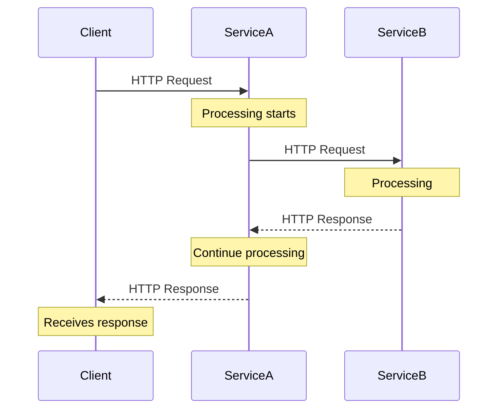
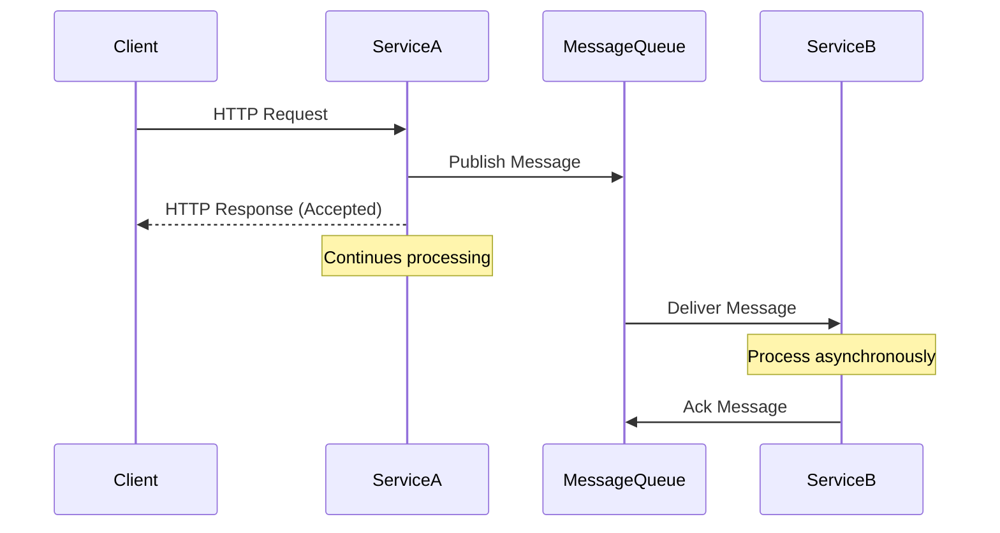
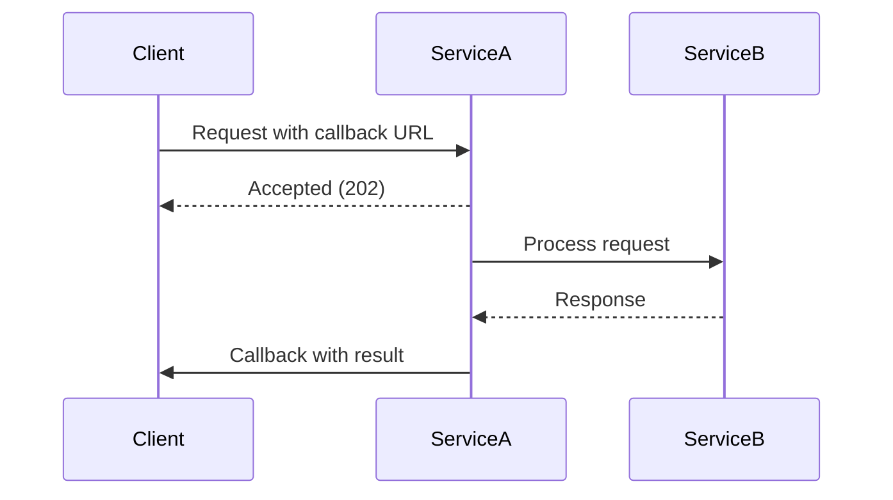
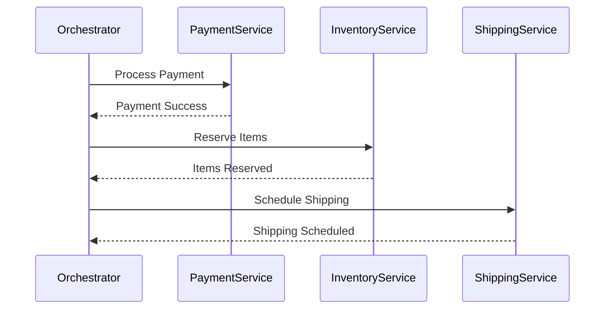

# Synchronous vs Asynchronous Communication

## Introduction

In distributed systems, services need to communicate with each other to fulfill user requests and maintain system functionality. The choice between synchronous and asynchronous communication patterns significantly impacts system performance, reliability, and scalability.

## Synchronous Communication

### Definition

Synchronous communication occurs when the sender waits for a response from the receiver before continuing execution. The calling service blocks until it receives a response or times out.

### Characteristics

- **Blocking**: Caller waits for response
- **Real-time**: Immediate response expected
- **Direct coupling**: Services are tightly coupled
- **Simple flow**: Request-response pattern

### Common Implementations

- **HTTP/HTTPS REST APIs**
- **GraphQL queries**
- **gRPC calls**
- **Database queries**
- **Function calls within applications**

### Synchronous Communication Flow

### Advantages

✅ **Simple to understand and implement**
- Straightforward request-response model
- Easy to debug and trace execution flow
- Familiar programming model for developers

✅ **Immediate consistency**
- Real-time data exchange
- Immediate error handling
- Transactional consistency across services

✅ **Easy error handling**
- Direct error propagation
- Immediate failure detection
- Simple retry mechanisms

### Disadvantages

❌ **Performance bottlenecks**
- Blocking operations reduce throughput
- Chain of dependencies can create cascading delays
- Limited by slowest service in the chain

❌ **Reduced availability**
- Single point of failure
- Service unavailability affects entire chain
- Timeout issues can cascade

❌ **Tight coupling**
- Services must be available simultaneously
- Difficult to scale independently
- Changes in one service affect others

## Asynchronous Communication

### Definition

Asynchronous communication allows the sender to continue execution without waiting for a response. Messages are typically sent through intermediary systems like message queues or event streams.

### Characteristics

- **Non-blocking**: Caller doesn't wait for response
- **Decoupled**: Services operate independently
- **Eventually consistent**: Data consistency achieved over time
- **Resilient**: Better fault tolerance

### Common Implementations

- **Message Queues** (RabbitMQ, Amazon SQS)
- **Event Streams** (Apache Kafka, Amazon Kinesis)
- **Pub/Sub Systems** (Google Pub/Sub, Redis Pub/Sub)
- **Event-driven architectures**
- **Webhooks and callbacks**

### Asynchronous Communication Flow

### Advantages

✅ **Better performance and scalability**
- Non-blocking operations increase throughput
- Services can scale independently
- Better resource utilization

✅ **Improved resilience**
- Services can be temporarily unavailable
- Message persistence ensures delivery
- Graceful degradation under load

✅ **Loose coupling**
- Services don't need to know about each other
- Easy to add new consumers
- Independent deployment and scaling

✅ **Better fault tolerance**
- Message queues provide durability
- Retry mechanisms built-in
- Dead letter queues for failed messages

### Disadvantages

❌ **Complexity**
- More complex architecture
- Difficult to debug distributed flows
- Message ordering challenges

❌ **Eventual consistency**
- Data may be temporarily inconsistent
- Complex state management
- Difficult to implement transactions

❌ **Message delivery challenges**
- Duplicate message handling
- Message loss scenarios
- Ordering guarantees

## Communication Pattern Comparison

| Aspect | Synchronous | Asynchronous |
|--------|-------------|--------------|
| **Response Time** | Immediate | Delayed/Eventually |
| **Coupling** | Tight | Loose |
| **Complexity** | Low | High |
| **Scalability** | Limited | High |
| **Consistency** | Strong | Eventual |
| **Error Handling** | Simple | Complex |
| **Debugging** | Easy | Difficult |
| **Fault Tolerance** | Low | High |
| **Performance** | Blocking | Non-blocking |
| **Use Cases** | Real-time queries | Background processing |

## When to Use Each Pattern

### Use Synchronous Communication When:

🎯 **Real-time requirements**
- User interfaces requiring immediate feedback
- Financial transactions needing instant confirmation
- Authentication and authorization checks

🎯 **Simple operations**
- CRUD operations on single entities
- Data validation and transformation
- Simple business logic execution

🎯 **Strong consistency needed**
- Banking transactions
- Inventory management
- Critical business operations

### Use Asynchronous Communication When:

🎯 **Background processing**
- Email notifications
- Report generation
- Data analytics and ETL jobs

🎯 **High throughput requirements**
- Event logging and monitoring
- Bulk data processing
- Stream processing applications

🎯 **Loose coupling desired**
- Microservices architectures
- Event-driven systems
- Integration with external systems

## Hybrid Approaches

### Request-Response with Callbacks

### Saga Pattern

For distributed transactions combining both patterns:

## Best Practices

### For Synchronous Communication

1. **Implement timeouts** to prevent indefinite blocking
2. **Use circuit breakers** to handle service failures
3. **Implement retry logic** with exponential backoff
4. **Monitor response times** and set SLA thresholds
5. **Use connection pooling** for better performance

### For Asynchronous Communication

1. **Design for idempotency** to handle duplicate messages
2. **Implement dead letter queues** for failed messages
3. **Use message schemas** for backward compatibility
4. **Monitor queue depths** and processing rates
5. **Implement proper error handling** and alerting

## Real-World Examples

### E-commerce Order Processing

**Synchronous components:**
- User authentication
- Payment validation
- Inventory check

**Asynchronous components:**
- Order confirmation email
- Inventory updates
- Shipping notifications
- Analytics events

### Social Media Platform

**Synchronous components:**
- User login
- Post creation API response
- Real-time messaging

**Asynchronous components:**
- Feed updates
- Notification delivery
- Content moderation
- Analytics processing

## Key Takeaways

1. **Choose based on requirements**: Consider latency, consistency, and coupling needs
2. **Hybrid approaches work**: Combine both patterns in the same system
3. **Start simple**: Begin with synchronous, evolve to asynchronous as needed
4. **Monitor and measure**: Track performance and reliability metrics
5. **Plan for failures**: Both patterns need proper error handling strategies

Understanding when and how to use synchronous vs asynchronous communication is fundamental to designing effective distributed systems. The choice impacts everything from user experience to system scalability and reliability.